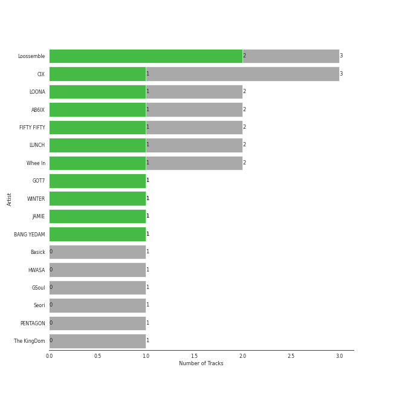
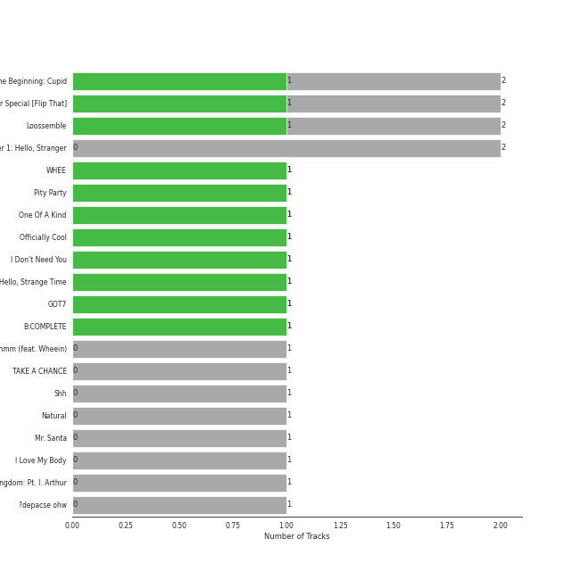

# WM Korea

14 songs

Appears as:
- WM Korea (14 tracks)

## Top Artists

See all 10 artists

| Art | Tracks | 💚 | Artist | 🔗 |
|:---|---:|---:|:---|:---|
|  | 3 | 1 | CIX | [🔗](https://open.spotify.com/artist/1lHfzEkKmmvdVDDDLKkcsd) |
|  | 2 | 1 | LOONA | [🔗](https://open.spotify.com/artist/52zMTJCKluDlFwMQWmccY7) |
|  | 2 | 1 | AB6IX | [🔗](https://open.spotify.com/artist/4y0wFJ5jmCUNRLZfsw1I7g) |
|  | 2 | 1 | Whee In | [🔗](https://open.spotify.com/artist/0BqRGrwqndrtNkojXiqIzL) |
|  | 1 | 1 | GOT7 | [🔗](https://open.spotify.com/artist/6nfDaffa50mKtEOwR8g4df) |
|  | 1 | 1 | Seori | [🔗](https://open.spotify.com/artist/2bWTIIQP9zaVc55RaMGu7e) |
|  | 1 | 1 | JAMIE | [🔗](https://open.spotify.com/artist/2YXlVLKq3X3soXd2aXUtIT) |
|  | 1 | 1 | LUNCH | [🔗](https://open.spotify.com/artist/2UVzzx3MOPYV3l6xW2lzBv) |
|  | 1 | 0 | Basick | [🔗](https://open.spotify.com/artist/7pXKdkQsYFCMG2omRxheJ2) |
|  | 1 | 0 | KINGDOM | [🔗](https://open.spotify.com/artist/0p5Ot7c8cFHtS82hd1WBN3) |

## Top Albums

See all 12 albums

| Art | Tracks | 💚 | Album | Release Date | 🔗 |
|:---|---:|---:|:---|:---|:---|
|  | 2 | 1 | Summer Special [Flip That] | 2022-06-20 | [🔗](https://open.spotify.com/album/7odJeHxR62PWP4Cms4GpwB) |
|  | 2 | 0 | HELLO Chapter 1: Hello, Stranger | 2019-07-23 | [🔗](https://open.spotify.com/album/73Jw9dKwFV1kF62JFUls3V) |
|  | 1 | 1 | WHEE | 2022-01-16 | [🔗](https://open.spotify.com/album/4BLxIwHfv87WeOQ9A4sm9E) |
|  | 1 | 1 | Pity Party | 2022-02-03 | [🔗](https://open.spotify.com/album/2yMHiLYBnrMsdUCUL3bFkU) |
|  | 1 | 1 | I Don't Need You | 2020-06-07 | [🔗](https://open.spotify.com/album/6W4mS8VsOi2WAkkMuh9SJ9) |
|  | 1 | 1 | HELLO Chapter 3: Hello, Strange Time | 2020-10-27 | [🔗](https://open.spotify.com/album/6w3QkgYGtf6LfiWb5iCYc1) |
|  | 1 | 1 | GOT7 | 2022-05-23 | [🔗](https://open.spotify.com/album/3vIVsuFU7ZKCwKB2Yri8lM) |
|  | 1 | 1 | B:COMPLETE | 2019-05-22 | [🔗](https://open.spotify.com/album/5cxJNT3zQw9kvJ0wpwWY7V) |
|  | 1 | 1 | ?depacse ohw | 2020-05-12 | [🔗](https://open.spotify.com/album/0srUbfZOMUBwUitQGQeUca) |
|  | 1 | 0 | When It Snows mmm (feat. Wheein) | 2020-12-23 | [🔗](https://open.spotify.com/album/5z8FBqt7BCXR6MB5fzy7L3) |
|  | 1 | 0 | TAKE A CHANCE | 2022-10-04 | [🔗](https://open.spotify.com/album/1QDAlRAOgIMPBQpMQ4LZ0E) |
|  | 1 | 0 | History Of Kingdom: Pt. I. Arthur | 2021-02-18 | [🔗](https://open.spotify.com/album/1R84dnzp7NRkcbd2HFihGe) |

## Genres

See all 6 genres

| Tracks | 💚 | Genre |
|---:|---:|:---|
| 12 | 7 | [k-pop](../genres/k_pop.md) |
| 4 | 2 | [k-pop boy group](../genres/k_pop_boy_group.md) |
| 2 | 1 | [k-pop girl group](../genres/k_pop_girl_group.md) |
| 1 | 1 | korean r&b |
| 1 | 1 | korean ost |
| 1 | 0 | k-rap |

## Tracks released under WM Korea

| Art | Track | Album | Artists | Label | 💚 | 🔗 |
|:---|:---|:---|:---|:---|:---|:---|
|  | BREATHE | B:COMPLETE | AB6IX | [WM Korea](wm_korea.md) | 💚 | [🔗](https://open.spotify.com/track/4XbyRgWe6yU4wE6WShdTEs) |
|  | Sugarcoat | TAKE A CHANCE | AB6IX | [WM Korea](wm_korea.md) | | [🔗](https://open.spotify.com/track/4iZyz8jYIritdTyeJhvwfy) |
|  | When It Snows mmm (feat. Wheein) | When It Snows mmm (feat. Wheein) | Basick, Whee In | [WM Korea](wm_korea.md) | | [🔗](https://open.spotify.com/track/5p4nVbbKRDASNjHNI5HvOV) |
|  | Movie Star | HELLO Chapter 1: Hello, Stranger | CIX | [WM Korea](wm_korea.md) | | [🔗](https://open.spotify.com/track/65pVi11JqwSZqUuYAqLP36) |
|  | What You Wanted | HELLO Chapter 1: Hello, Stranger | CIX | [WM Korea](wm_korea.md) | | [🔗](https://open.spotify.com/track/76dpiZihYVl5VbiHNjVj5l) |
|  | Jungle | HELLO Chapter 3: Hello, Strange Time | CIX | [WM Korea](wm_korea.md) | 💚 | [🔗](https://open.spotify.com/track/0QyLYuhCdzwVk9OkmvwAjh) |
|  | NANANA | GOT7 | GOT7 | [WM Korea](wm_korea.md) | 💚 | [🔗](https://open.spotify.com/track/2tEMbypmvYhf84mzVbhxwZ) |
|  | Pity Party | Pity Party | JAMIE | [WM Korea](wm_korea.md) | 💚 | [🔗](https://open.spotify.com/track/3hmjSgK0gSytIf3sbCFShk) |
|  | Excalibur | History Of Kingdom: Pt. I. Arthur | KINGDOM | [WM Korea](wm_korea.md) | | [🔗](https://open.spotify.com/track/5uNEmROkf5izWfrQ9oLvAQ) |
|  | Flip That | Summer Special [Flip That] | LOONA | [WM Korea](wm_korea.md) | 💚 | [🔗](https://open.spotify.com/track/7cHXwaBnIBFUPuP376z07E) |
|  | POSE | Summer Special [Flip That] | LOONA | [WM Korea](wm_korea.md) | | [🔗](https://open.spotify.com/track/2BdGXQ4MjeYCZ9JNte85Q4) |
|  | I Don't Need You | I Don't Need You | LUNCH | [WM Korea](wm_korea.md) | 💚 | [🔗](https://open.spotify.com/track/5I9mKWUEM2RICe6QJ26PyM) |
|  | Running Through The Night | ?depacse ohw | Seori | [WM Korea](wm_korea.md) | 💚 | [🔗](https://open.spotify.com/track/3UZ46DvXvB2R7sBUZornlv) |
|  | Make Me Happy | WHEE | Whee In | [WM Korea](wm_korea.md) | 💚 | [🔗](https://open.spotify.com/track/6ry670EtSALRt1yd0W0wca) |
