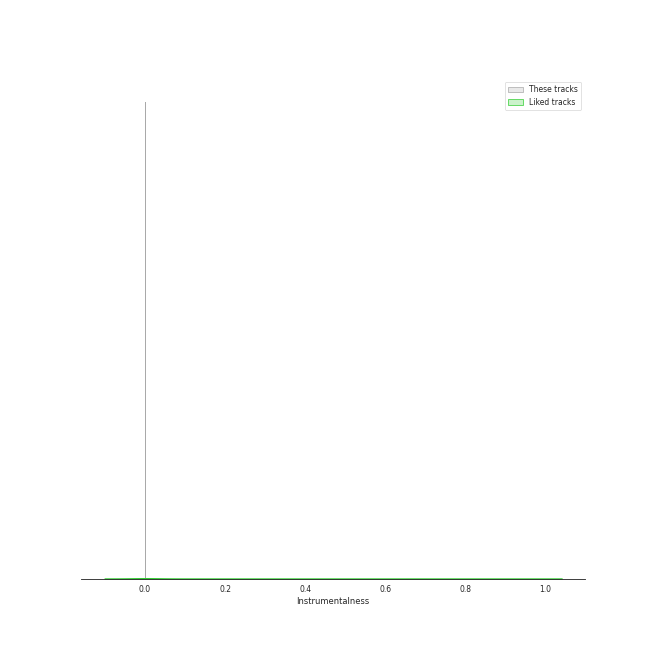
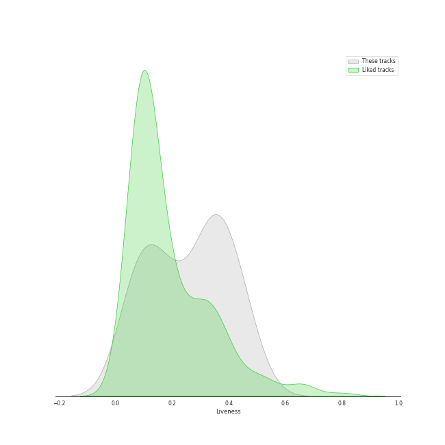

# Audio Features for WM Korea

## Danceability

| 10 most Danceable tracks | 10 least Danceable tracks |
|:---|:---|
| POSE (0.823) | Solo Christmas (0.416) |
| BREATHE (0.818) | Jungle (0.487) |
| Flip That (0.803) | Excalibur (0.512) |
| Sugarcoat (0.797) | Running Through The Night (0.644) |
| Mr. Santa (0.755) | Make Me Happy (0.659) |
| Pity Party (0.73) | I Don't Need You (0.66) |
| Movie Star (0.718) | When It Snows mmm (feat. Wheein) (0.69) |
| What You Wanted (0.709) | NANANA (0.706) |
| NANANA (0.706) | What You Wanted (0.709) |
| When It Snows mmm (feat. Wheein) (0.69) | Movie Star (0.718) |

## Energy

| 10 most Energetic tracks | 10 least Energetic tracks |
|:---|:---|
| Movie Star (0.89) | Solo Christmas (0.259) |
| BREATHE (0.849) | Running Through The Night (0.532) |
| Flip That (0.831) | Mr. Santa (0.609) |
| Sugarcoat (0.826) | Make Me Happy (0.664) |
| Jungle (0.805) | When It Snows mmm (feat. Wheein) (0.684) |
| Excalibur (0.799) | NANANA (0.692) |
| Pity Party (0.792) | POSE (0.72) |
| What You Wanted (0.77) | I Don't Need You (0.744) |
| I Don't Need You (0.744) | What You Wanted (0.77) |
| POSE (0.72) | Pity Party (0.792) |

## Speechiness

| 10 most Speechy tracks | 10 least Speechy tracks |
|:---|:---|
| I Don't Need You (0.422) | NANANA (0.0277) |
| Sugarcoat (0.215) | Solo Christmas (0.0332) |
| BREATHE (0.206) | Make Me Happy (0.0338) |
| When It Snows mmm (feat. Wheein) (0.0768) | Mr. Santa (0.0383) |
| What You Wanted (0.0668) | Pity Party (0.0411) |
| Excalibur (0.0614) | POSE (0.0536) |
| Flip That (0.0569) | Jungle (0.0539) |
| Running Through The Night (0.0562) | Movie Star (0.0553) |
| Movie Star (0.0553) | Running Through The Night (0.0562) |
| Jungle (0.0539) | Flip That (0.0569) |

## Acousticness

| 10 most Acoustic tracks | 10 least Acoustic tracks |
|:---|:---|
| Solo Christmas (0.858) | Excalibur (0.0247) |
| I Don't Need You (0.46) | POSE (0.0326) |
| Running Through The Night (0.455) | What You Wanted (0.044) |
| When It Snows mmm (feat. Wheein) (0.389) | BREATHE (0.0641) |
| Mr. Santa (0.317) | Flip That (0.072) |
| Make Me Happy (0.291) | NANANA (0.0768) |
| Jungle (0.142) | Pity Party (0.0933) |
| Movie Star (0.107) | Sugarcoat (0.105) |
| Sugarcoat (0.105) | Movie Star (0.107) |
| Pity Party (0.0933) | Jungle (0.142) |

## Instrumentalness

| 10 most Instrumental tracks | 10 least Instrumental tracks |
|:---|:---|
| POSE (0.000172) | Jungle (0.0) |
| Make Me Happy (3.46e-05) | NANANA (0.0) |
| When It Snows mmm (feat. Wheein) (2.88e-05) | Running Through The Night (0.0) |
| Pity Party (3.05e-06) | BREATHE (0.0) |
| Flip That (0.0) | Sugarcoat (0.0) |
| What You Wanted (0.0) | I Don't Need You (0.0) |
| Solo Christmas (0.0) | Mr. Santa (0.0) |
| Movie Star (0.0) | Excalibur (0.0) |
| Excalibur (0.0) | Movie Star (0.0) |
| Mr. Santa (0.0) | Solo Christmas (0.0) |

## Liveness

| 10 most Live tracks | 10 least Live tracks |
|:---|:---|
| Movie Star (0.462) | Sugarcoat (0.0612) |
| When It Snows mmm (feat. Wheein) (0.425) | BREATHE (0.0839) |
| Pity Party (0.418) | I Don't Need You (0.115) |
| Mr. Santa (0.347) | What You Wanted (0.127) |
| POSE (0.34) | NANANA (0.173) |
| Flip That (0.328) | Excalibur (0.181) |
| Running Through The Night (0.266) | Solo Christmas (0.187) |
| Make Me Happy (0.205) | Jungle (0.198) |
| Jungle (0.198) | Make Me Happy (0.205) |
| Solo Christmas (0.187) | Running Through The Night (0.266) |

## Valence

| 10 most Happy tracks | 10 least Happy tracks |
|:---|:---|
| Pity Party (0.749) | POSE (0.195) |
| Movie Star (0.741) | Jungle (0.213) |
| Flip That (0.736) | Solo Christmas (0.248) |
| I Don't Need You (0.735) | Excalibur (0.304) |
| Sugarcoat (0.658) | When It Snows mmm (feat. Wheein) (0.384) |
| Running Through The Night (0.64) | Make Me Happy (0.511) |
| BREATHE (0.605) | Mr. Santa (0.517) |
| NANANA (0.601) | What You Wanted (0.586) |
| What You Wanted (0.586) | NANANA (0.601) |
| Mr. Santa (0.517) | BREATHE (0.605) |

## Tempo

| 10 most Fast tracks | 10 least Fast tracks |
|:---|:---|
| Jungle (146.065) | Excalibur (87.891) |
| What You Wanted (145.921) | When It Snows mmm (feat. Wheein) (87.971) |
| I Don't Need You (143.059) | Running Through The Night (92.039) |
| NANANA (137.006) | Mr. Santa (99.936) |
| Solo Christmas (131.072) | Make Me Happy (104.055) |
| Pity Party (124.988) | Sugarcoat (109.964) |
| BREATHE (124.954) | Movie Star (111.967) |
| POSE (120.007) | Flip That (112.045) |
| Flip That (112.045) | POSE (120.007) |
| Movie Star (111.967) | BREATHE (124.954) |
