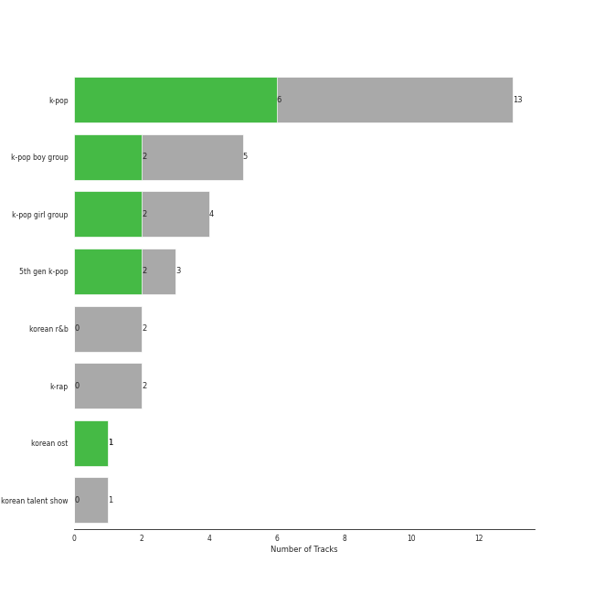
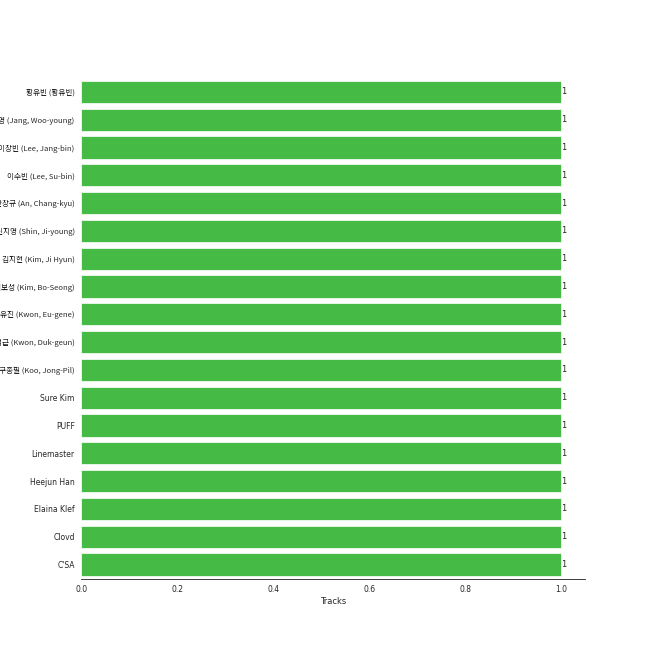

# WM Korea

24 songs

[See Track Features](audio_features.md)

[See Clusters](clusters/overview.md)

Appears as:
- WM Korea (24 tracks)

## Top Artists

| Art | Tracks | 💚 | Artist | 🔗 |
|:---|---:|---:|:---|:---|
|  | 3 | 2 | Loossemble | [🔗](https://open.spotify.com/artist/1kbVoxpFh1eDOXumLmVdKY) |
|  | 3 | 1 | CIX | [🔗](https://open.spotify.com/artist/1lHfzEkKmmvdVDDDLKkcsd) |
|  | 2 | 1 | [LOONA](../../artists/loona/overview.md) | [🔗](https://open.spotify.com/artist/52zMTJCKluDlFwMQWmccY7) |
|  | 2 | 1 | AB6IX | [🔗](https://open.spotify.com/artist/4y0wFJ5jmCUNRLZfsw1I7g) |
|  | 2 | 1 | FIFTY FIFTY | [🔗](https://open.spotify.com/artist/4GJ6xDCF5jaUqD6avOuQT6) |
|  | 2 | 1 | LUNCH | [🔗](https://open.spotify.com/artist/2UVzzx3MOPYV3l6xW2lzBv) |
|  | 2 | 1 | Whee In | [🔗](https://open.spotify.com/artist/0BqRGrwqndrtNkojXiqIzL) |
|  | 1 | 1 | GOT7 | [🔗](https://open.spotify.com/artist/6nfDaffa50mKtEOwR8g4df) |
|  | 1 | 1 | [WINTER](../../artists/winter/overview.md) | [🔗](https://open.spotify.com/artist/3mPquBmMu97Iq9TpzQ6ayI) |
|  | 1 | 1 | JAMIE | [🔗](https://open.spotify.com/artist/2YXlVLKq3X3soXd2aXUtIT) |

See all 17 artists

| Art | Tracks | 💚 | Artist | 🔗 |
|:---|---:|---:|:---|:---|
|  | 1 | 1 | BANG YEDAM | [🔗](https://open.spotify.com/artist/1slszTGbkp1uNnI6G5uD0X) |
|  | 1 | 0 | Basick | [🔗](https://open.spotify.com/artist/7pXKdkQsYFCMG2omRxheJ2) |
|  | 1 | 0 | [HWASA](../../artists/hwasa/overview.md) | [🔗](https://open.spotify.com/artist/7bmYpVgQub656uNTu6qGNQ) |
|  | 1 | 0 | GSoul | [🔗](https://open.spotify.com/artist/4oEXworvhegyK83rZwVyWL) |
|  | 1 | 0 | Seori | [🔗](https://open.spotify.com/artist/2bWTIIQP9zaVc55RaMGu7e) |
|  | 1 | 0 | [PENTAGON](../../artists/pentagon/overview.md) | [🔗](https://open.spotify.com/artist/1wKpMkucynaTfG8lyPprYV) |
|  | 1 | 0 | The KingDom | [🔗](https://open.spotify.com/artist/0p5Ot7c8cFHtS82hd1WBN3) |

## Top Albums

| Art | Tracks | 💚 | Album | Release Date | 🔗 |
|:---|---:|---:|:---|:---|:---|
|  | 2 | 1 | The Beginning: Cupid | 2023-02-24 | [🔗](https://open.spotify.com/album/5letLUZIFsQikJYShfGNs4) |
|  | 2 | 1 | Summer Special [Flip That] | 2022-06-20 | [🔗](https://open.spotify.com/album/7odJeHxR62PWP4Cms4GpwB) |
|  | 2 | 1 | Loossemble | 2023-09-15 | [🔗](https://open.spotify.com/album/51TyZNm7E9EF1gSJGLGsxh) |
|  | 2 | 0 | HELLO Chapter 1: Hello, Stranger | 2019-07-23 | [🔗](https://open.spotify.com/album/73Jw9dKwFV1kF62JFUls3V) |
|  | 1 | 1 | WHEE | 2022-01-16 | [🔗](https://open.spotify.com/album/4BLxIwHfv87WeOQ9A4sm9E) |
|  | 1 | 1 | Pity Party | 2022-02-03 | [🔗](https://open.spotify.com/album/2yMHiLYBnrMsdUCUL3bFkU) |
|  | 1 | 1 | One Of A Kind | 2024-04-15 | [🔗](https://open.spotify.com/album/2sN27KkVSnHvqi0MA2YxcZ) |
|  | 1 | 1 | Officially Cool | 2024-04-02 | [🔗](https://open.spotify.com/album/7ak1PBCmrVLvOANEenebe9) |
|  | 1 | 1 | I Don't Need You | 2020-06-07 | [🔗](https://open.spotify.com/album/6W4mS8VsOi2WAkkMuh9SJ9) |
|  | 1 | 1 | HELLO Chapter 3: Hello, Strange Time | 2020-10-27 | [🔗](https://open.spotify.com/album/6w3QkgYGtf6LfiWb5iCYc1) |

See all 20 albums

| Art | Tracks | 💚 | Album | Release Date | 🔗 |
|:---|---:|---:|:---|:---|:---|
|  | 1 | 1 | GOT7 | 2022-05-23 | [🔗](https://open.spotify.com/album/3vIVsuFU7ZKCwKB2Yri8lM) |
|  | 1 | 1 | B:COMPLETE | 2019-05-22 | [🔗](https://open.spotify.com/album/5cxJNT3zQw9kvJ0wpwWY7V) |
|  | 1 | 0 | When It Snows mmm (feat. Wheein) | 2020-12-23 | [🔗](https://open.spotify.com/album/5z8FBqt7BCXR6MB5fzy7L3) |
|  | 1 | 0 | TAKE A CHANCE | 2022-10-04 | [🔗](https://open.spotify.com/album/1QDAlRAOgIMPBQpMQ4LZ0E) |
|  | 1 | 0 | Shh | 2023-05-10 | [🔗](https://open.spotify.com/album/2IFIiCZ8FgprUn7yhqYG49) |
|  | 1 | 0 | Natural | 2021-12-02 | [🔗](https://open.spotify.com/album/2yOqQbBoXX0nNPBqts1dmZ) |
|  | 1 | 0 | Mr. Santa | 2020-11-27 | [🔗](https://open.spotify.com/album/1ZJDN26GeLf0BznSW8VBe5) |
|  | 1 | 0 | I Love My Body | 2023-09-06 | [🔗](https://open.spotify.com/album/7Lbc8drIJGlYLT4hdcBvre) |
|  | 1 | 0 | History Of Kingdom: Pt. I. Arthur | 2021-02-18 | [🔗](https://open.spotify.com/album/1R84dnzp7NRkcbd2HFihGe) |
|  | 1 | 0 | ?depacse ohw | 2020-05-12 | [🔗](https://open.spotify.com/album/0srUbfZOMUBwUitQGQeUca) |

## Genres

| Tracks | 💚 | Genre |
|---:|---:|:---|
| 13 | 6 | [k-pop](../../genres/k-pop/overview.md) |
| 5 | 2 | [k-pop boy group](../../genres/k-pop_boy_group/overview.md) |
| 4 | 2 | [k-pop girl group](../../genres/k-pop_girl_group/overview.md) |
| 3 | 2 | [5th gen k-pop](../../genres/5th_gen_k-pop/overview.md) |
| 1 | 1 | korean ost |
| 2 | 0 | [korean r&b](../../genres/korean_r_b/overview.md) |
| 2 | 0 | [k-rap](../../genres/k-rap/overview.md) |
| 1 | 0 | korean talent show |

## Top Producers

| Art | Producer | Tracks | Credit Types |
|:---|:---|---:|:---|
| | 권덕근 (Kwon, Duk-geun) | 1 | Arranger, Songwriter |
| | PUFF | 1 | Arranger, Songwriter |
| | Linemaster | 1 | Producer, Songwriter |
| | 안창규 (An, Chang-kyu) | 1 | Producer |
| | 황유빈 (황유빈) | 1 | Lyricist |
| | [구종필 (Koo, Jong-Pil)](../../producers/구종필_(koo,_jong-pil)/overview.md) | 1 | Producer |
| | 김지현 (Kim, Ji Hyun) | 1 | Producer |
| | Clovd | 1 | Arranger, Songwriter |
| | 권유진 (Kwon, Eu-gene) | 1 | Producer |
| | Sure Kim | 1 | Arranger, Lyricist, Songwriter |

View all

| Art | Producer | Tracks | Credit Types |
|:---|:---|---:|:---|
| | 김보성 (Kim, Bo-Seong) | 1 | Producer |
| | C'SA | 1 | Songwriter |
| | 신지영 (Shin, Ji-young) | 1 | Producer |
| | 장우영 (Jang, Woo-young) | 1 | Producer |
| | 이수빈 (Lee, Su-bin) | 1 | Arranger, Lyricist, Songwriter |
| | Heejun Han | 1 | Lyricist |
| | Elaina Klef | 1 | Lyricist |
| | 이장빈 (Lee, Jang-bin) | 1 | Producer |

## Tracks released under WM Korea

| Art | Track | Album | Artists | Label | Rank | 💚 | 🔗 |
|:---|:---|:---|:---|:---|---:|:---|:---|
|  | Sensitive | Loossemble | Loossemble | [WM Korea](.) | 155 | 💚 | [🔗](https://open.spotify.com/track/6A1dCPrUYhg56ukp4zlEUw) |
|  | Officially Cool | Officially Cool | BANG YEDAM, [WINTER](../../artists/winter/overview.md) | [WM Korea](.) | 197 | 💚 | [🔗](https://open.spotify.com/track/52rdnAZoYsEbguqMwCOeLi) |
|  | Cupid - Twin Ver. | The Beginning: Cupid | FIFTY FIFTY | [WM Korea](.) | 328 | | [🔗](https://open.spotify.com/track/7FbrGaHYVDmfr7KoLIZnQ7) |
|  | I Love My Body | I Love My Body | [HWASA](../../artists/hwasa/overview.md) | [WM Korea](.) | 333 | | [🔗](https://open.spotify.com/track/0pHylQR53epYtRcVIhUSCh) |
|  | Real world | Loossemble | Loossemble | [WM Korea](.) | 579 | | [🔗](https://open.spotify.com/track/2gW0fZQNsjs3XKPNzHYC8Q) |
|  | Pity Party | Pity Party | JAMIE | [WM Korea](.) | 692 | 💚 | [🔗](https://open.spotify.com/track/3hmjSgK0gSytIf3sbCFShk) |
|  | When It Snows mmm (feat. Wheein) | When It Snows mmm (feat. Wheein) | Basick, Whee In | [WM Korea](.) | 776 | | [🔗](https://open.spotify.com/track/5p4nVbbKRDASNjHNI5HvOV) |
|  | BREATHE | B:COMPLETE | AB6IX | [WM Korea](.) | nan | 💚 | [🔗](https://open.spotify.com/track/4XbyRgWe6yU4wE6WShdTEs) |
|  | Movie Star | HELLO Chapter 1: Hello, Stranger | CIX | [WM Korea](.) | nan | | [🔗](https://open.spotify.com/track/65pVi11JqwSZqUuYAqLP36) |
|  | What You Wanted | HELLO Chapter 1: Hello, Stranger | CIX | [WM Korea](.) | nan | | [🔗](https://open.spotify.com/track/76dpiZihYVl5VbiHNjVj5l) |

See all tracks

| Art | Track | Album | Artists | Label | Rank | 💚 | 🔗 |
|:---|:---|:---|:---|:---|---:|:---|:---|
|  | Running Through The Night | ?depacse ohw | Seori | [WM Korea](.) | nan | | [🔗](https://open.spotify.com/track/3UZ46DvXvB2R7sBUZornlv) |
|  | I Don't Need You | I Don't Need You | LUNCH | [WM Korea](.) | nan | 💚 | [🔗](https://open.spotify.com/track/5I9mKWUEM2RICe6QJ26PyM) |
|  | Jungle | HELLO Chapter 3: Hello, Strange Time | CIX | [WM Korea](.) | nan | 💚 | [🔗](https://open.spotify.com/track/0QyLYuhCdzwVk9OkmvwAjh) |
|  | Mr. Santa | Mr. Santa | LUNCH | [WM Korea](.) | nan | | [🔗](https://open.spotify.com/track/5sKVq8eZao43FmumueYClP) |
|  | Excalibur | History Of Kingdom: Pt. I. Arthur | The KingDom | [WM Korea](.) | nan | | [🔗](https://open.spotify.com/track/5uNEmROkf5izWfrQ9oLvAQ) |
|  | Natural | Natural | GSoul | [WM Korea](.) | nan | | [🔗](https://open.spotify.com/track/0ACt3PP22HyKfpFIV6AQUW) |
|  | Make Me Happy | WHEE | Whee In | [WM Korea](.) | nan | 💚 | [🔗](https://open.spotify.com/track/6ry670EtSALRt1yd0W0wca) |
|  | NANANA | GOT7 | GOT7 | [WM Korea](.) | nan | 💚 | [🔗](https://open.spotify.com/track/2tEMbypmvYhf84mzVbhxwZ) |
|  | Flip That | Summer Special [Flip That] | [LOONA](../../artists/loona/overview.md) | [WM Korea](.) | nan | 💚 | [🔗](https://open.spotify.com/track/7cHXwaBnIBFUPuP376z07E) |
|  | POSE | Summer Special [Flip That] | [LOONA](../../artists/loona/overview.md) | [WM Korea](.) | nan | | [🔗](https://open.spotify.com/track/2BdGXQ4MjeYCZ9JNte85Q4) |
|  | Sugarcoat | TAKE A CHANCE | AB6IX | [WM Korea](.) | nan | | [🔗](https://open.spotify.com/track/4iZyz8jYIritdTyeJhvwfy) |
|  | Cupid | The Beginning: Cupid | FIFTY FIFTY | [WM Korea](.) | nan | 💚 | [🔗](https://open.spotify.com/track/5mg3VB3Qh7jcR5kAAC4DSV) |
|  | Shh | Shh | [PENTAGON](../../artists/pentagon/overview.md) | [WM Korea](.) | nan | | [🔗](https://open.spotify.com/track/0qu6gCG90KB4vp6H7JpAZy) |
|  | Boomerang | One Of A Kind | Loossemble | [WM Korea](.) | nan | 💚 | [🔗](https://open.spotify.com/track/5wZPGf9ySuuRVlegYFYas0) |

