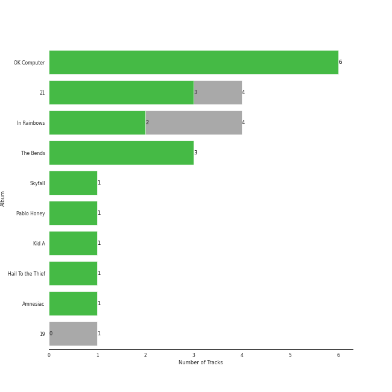
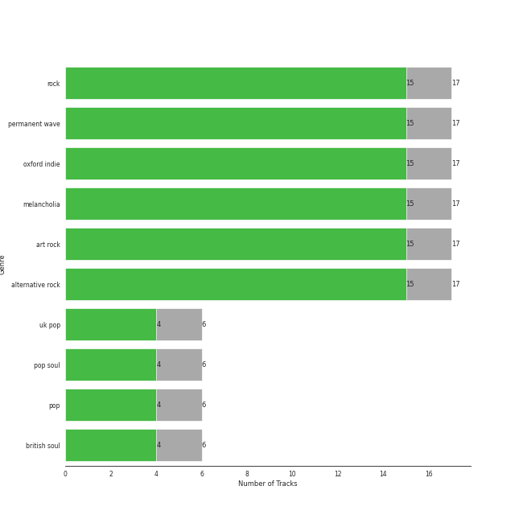

# XL Recordings

22 songs

Appears as:
- XL Recordings (21 tracks)
- XL Recordings/Columbia (1 tracks)

## Top Artists

See all 2 artists

| Number of Tracks | Art | Artist | 🔗 |
|---:|:---|:---|:---|
| 16 |  | [Radiohead](../artists/radiohead.md) | [🔗](https://open.spotify.com/artist/4Z8W4fKeB5YxbusRsdQVPb) |
| 6 |  | Adele | [🔗](https://open.spotify.com/artist/4dpARuHxo51G3z768sgnrY) |

## Top Albums

See all 10 albums

| Number of Tracks | Art | Album | Release Date | 🔗 |
|---:|:---|:---|:---|:---|
| 5 |  | OK Computer | 1997-05-28 | [🔗](https://open.spotify.com/album/6dVIqQ8qmQ5GBnJ9shOYGE) |
| 4 |  | In Rainbows | 2007-12-28 | [🔗](https://open.spotify.com/album/5vkqYmiPBYLaalcmjujWxK) |
| 4 |  | 21 | 2011-01-24 | [🔗](https://open.spotify.com/album/0Lg1uZvI312TPqxNWShFXL) |
| 3 |  | The Bends | 1995-03-13 | [🔗](https://open.spotify.com/album/35UJLpClj5EDrhpNIi4DFg) |
| 1 |  | Skyfall | 2012-10-04 | [🔗](https://open.spotify.com/album/6TwN6Lq9glwnG8kNp6chHY) |
| 1 |  | Pablo Honey | 1993-02-22 | [🔗](https://open.spotify.com/album/3gBVdu4a1MMJVMy6vwPEb8) |
| 1 |  | Kid A | 2000-10-02 | [🔗](https://open.spotify.com/album/6GjwtEZcfenmOf6l18N7T7) |
| 1 |  | Hail To the Thief | 2003-06-09 | [🔗](https://open.spotify.com/album/5mzoI3VH0ZWk1pLFR6RoYy) |
| 1 |  | Amnesiac | 2001-03-12 | [🔗](https://open.spotify.com/album/6V9YnBmFjWmXCBaUVRCVXP) |
| 1 |  | 19 | 2008-01-28 | [🔗](https://open.spotify.com/album/1ydnyXPdmHrWXqXDgtQCPf) |

## Genres

See all 10 genres

| Number of Tracks | Genre |
|---:|:---|
| 16 | [rock](../genres/rock.md) |
| 16 | permanent wave |
| 16 | oxford indie |
| 16 | melancholia |
| 16 | art rock |
| 16 | alternative rock |
| 6 | uk pop |
| 6 | pop soul |
| 6 | [pop](../genres/pop.md) |
| 6 | british soul |

## Tracks released under XL Recordings

| Art | Track | Album | Artists | Label | 💚 | 🔗 |
|:---|:---|:---|:---|:---|:---|:---|
|  | Chasing Pavements | 19 | Adele | [XL Recordings](xl_recordings.md) | | [🔗](https://open.spotify.com/track/71WAtDcWVYMoCsblD2uQXx) |
|  | Rolling in the Deep | 21 | Adele | [XL Recordings](xl_recordings.md) | | [🔗](https://open.spotify.com/track/1c8gk2PeTE04A1pIDH9YMk) |
|  | Set Fire to the Rain | 21 | Adele | [XL Recordings](xl_recordings.md) | 💚 | [🔗](https://open.spotify.com/track/73CMRj62VK8nUS4ezD2wvi) |
|  | Someone Like You | 21 | Adele | [XL Recordings](xl_recordings.md) | | [🔗](https://open.spotify.com/track/1zwMYTA5nlNjZxYrvBB2pV) |
|  | Take It All | 21 | Adele | [XL Recordings](xl_recordings.md) | 💚 | [🔗](https://open.spotify.com/track/08YJEcxGtYXwCGqXMZDiyQ) |
|  | Skyfall | Skyfall | Adele | [Columbia](columbia.md), [XL Recordings](xl_recordings.md) | 💚 | [🔗](https://open.spotify.com/track/6VObnIkLVruX4UVyxWhlqm) |
|  | Creep | Pablo Honey | [Radiohead](../artists/radiohead.md) | [XL Recordings](xl_recordings.md) | 💚 | [🔗](https://open.spotify.com/track/70LcF31zb1H0PyJoS1Sx1r) |
|  | Fake Plastic Trees | The Bends | [Radiohead](../artists/radiohead.md) | [XL Recordings](xl_recordings.md) | 💚 | [🔗](https://open.spotify.com/track/73CKjW3vsUXRpy3NnX4H7F) |
|  | High and Dry | The Bends | [Radiohead](../artists/radiohead.md) | [XL Recordings](xl_recordings.md) | 💚 | [🔗](https://open.spotify.com/track/2a1iMaoWQ5MnvLFBDv4qkf) |
|  | Street Spirit (Fade Out) | The Bends | [Radiohead](../artists/radiohead.md) | [XL Recordings](xl_recordings.md) | 💚 | [🔗](https://open.spotify.com/track/2QwObYJWyJTiozvs0RI7CF) |
|  | Exit Music (For A Film) | OK Computer | [Radiohead](../artists/radiohead.md) | [XL Recordings](xl_recordings.md) | 💚 | [🔗](https://open.spotify.com/track/0z1o5L7HJx562xZSATcIpY) |
|  | Karma Police | OK Computer | [Radiohead](../artists/radiohead.md) | [XL Recordings](xl_recordings.md) | 💚 | [🔗](https://open.spotify.com/track/63OQupATfueTdZMWTxW03A) |
|  | Let Down | OK Computer | [Radiohead](../artists/radiohead.md) | [XL Recordings](xl_recordings.md) | 💚 | [🔗](https://open.spotify.com/track/2fuYa3Lx06QQJAm0MjztKr) |
|  | No Surprises | OK Computer | [Radiohead](../artists/radiohead.md) | [XL Recordings](xl_recordings.md) | 💚 | [🔗](https://open.spotify.com/track/10nyNJ6zNy2YVYLrcwLccB) |
|  | Paranoid Android | OK Computer | [Radiohead](../artists/radiohead.md) | [XL Recordings](xl_recordings.md) | 💚 | [🔗](https://open.spotify.com/track/6LgJvl0Xdtc73RJ1mmpotq) |
|  | Everything In Its Right Place | Kid A | [Radiohead](../artists/radiohead.md) | [XL Recordings](xl_recordings.md) | 💚 | [🔗](https://open.spotify.com/track/2kRFrWaLWiKq48YYVdGcm8) |
|  | Pyramid Song | Amnesiac | [Radiohead](../artists/radiohead.md) | [XL Recordings](xl_recordings.md) | 💚 | [🔗](https://open.spotify.com/track/3A9vIxzGBjEfqmDK7H9exS) |
|  | There, There | Hail To the Thief | [Radiohead](../artists/radiohead.md) | [XL Recordings](xl_recordings.md) | 💚 | [🔗](https://open.spotify.com/track/5h4y42RUKwYKYWgutNwvKP) |
|  | All I Need | In Rainbows | [Radiohead](../artists/radiohead.md) | [XL Recordings](xl_recordings.md) | | [🔗](https://open.spotify.com/track/5Qv2Nby1xTr9pQyjkrc94J) |
|  | Jigsaw Falling Into Place | In Rainbows | [Radiohead](../artists/radiohead.md) | [XL Recordings](xl_recordings.md) | 💚 | [🔗](https://open.spotify.com/track/0YJ9FWWHn9EfnN0lHwbzvV) |
|  | Reckoner | In Rainbows | [Radiohead](../artists/radiohead.md) | [XL Recordings](xl_recordings.md) | 💚 | [🔗](https://open.spotify.com/track/02ppMPbg1OtEdHgoPqoqju) |
|  | Weird Fishes/ Arpeggi | In Rainbows | [Radiohead](../artists/radiohead.md) | [XL Recordings](xl_recordings.md) | | [🔗](https://open.spotify.com/track/4wajJ1o7jWIg62YqpkHC7S) |
