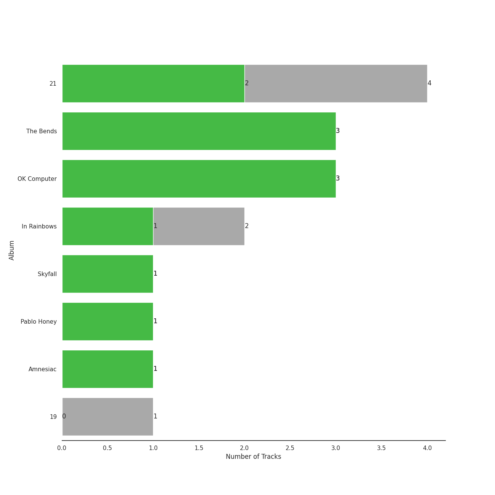
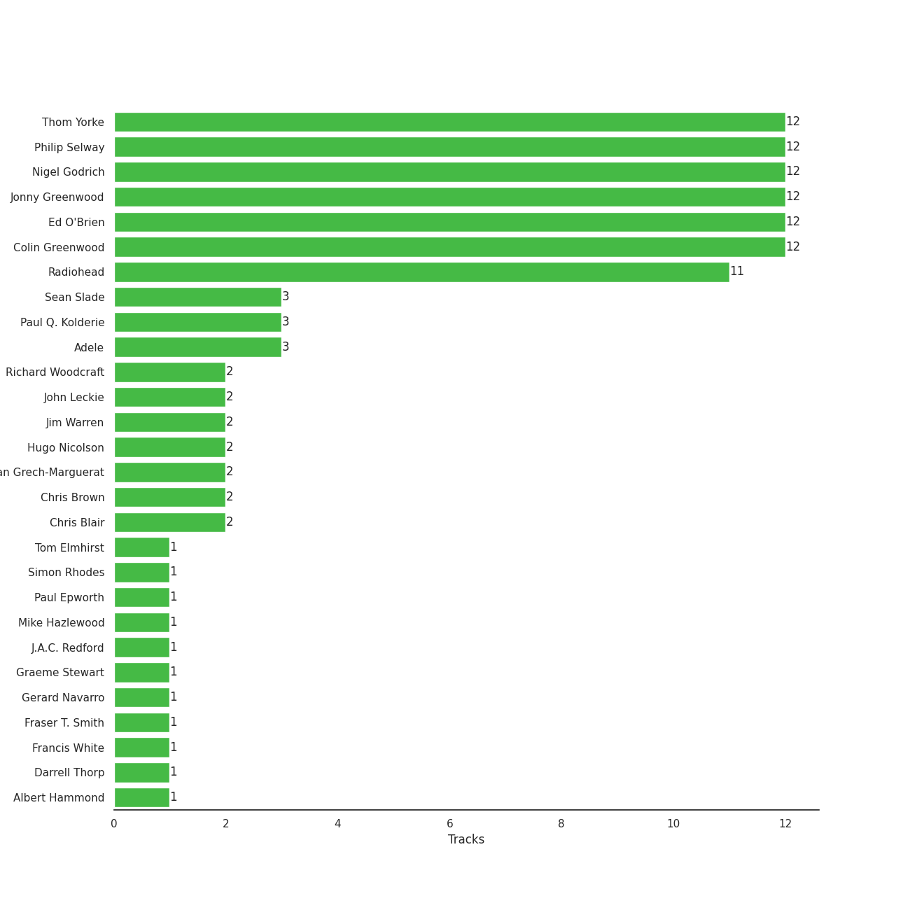

# XL Recordings

22 songs

[See Track Features](audio_features.md)

[See Clusters](clusters/overview.md)

Appears as:
- XL Recordings (21 tracks)
- XL Recordings/Columbia (1 tracks)

## Top Artists

| Art | Tracks | 💚 | Artist | 🔗 |
|:---|---:|---:|:---|:---|
|  | 16 | 14 | [Radiohead](../../artists/radiohead/overview.md) | [🔗](https://open.spotify.com/artist/4Z8W4fKeB5YxbusRsdQVPb) |
|  | 6 | 3 | Adele | [🔗](https://open.spotify.com/artist/4dpARuHxo51G3z768sgnrY) |

## Top Albums

| Art | Tracks | 💚 | Album | Release Date | 🔗 |
|:---|---:|---:|:---|:---|:---|
|  | 5 | 5 | OK Computer | 1997-05-28 | [🔗](https://open.spotify.com/album/6dVIqQ8qmQ5GBnJ9shOYGE) |
|  | 4 | 2 | In Rainbows | 2007-12-28 | [🔗](https://open.spotify.com/album/5vkqYmiPBYLaalcmjujWxK) |
|  | 4 | 2 | 21 | 2011-01-24 | [🔗](https://open.spotify.com/album/0Lg1uZvI312TPqxNWShFXL) |
|  | 3 | 3 | The Bends | 1995-03-13 | [🔗](https://open.spotify.com/album/35UJLpClj5EDrhpNIi4DFg) |
|  | 1 | 1 | Skyfall | 2012-10-04 | [🔗](https://open.spotify.com/album/6TwN6Lq9glwnG8kNp6chHY) |
|  | 1 | 1 | Pablo Honey | 1993-02-22 | [🔗](https://open.spotify.com/album/3gBVdu4a1MMJVMy6vwPEb8) |
|  | 1 | 1 | Kid A | 2000-10-02 | [🔗](https://open.spotify.com/album/6GjwtEZcfenmOf6l18N7T7) |
|  | 1 | 1 | Hail To the Thief | 2003-06-09 | [🔗](https://open.spotify.com/album/5mzoI3VH0ZWk1pLFR6RoYy) |
|  | 1 | 1 | Amnesiac | 2001-03-12 | [🔗](https://open.spotify.com/album/6V9YnBmFjWmXCBaUVRCVXP) |
|  | 1 | 0 | 19 | 2008-01-28 | [🔗](https://open.spotify.com/album/1ydnyXPdmHrWXqXDgtQCPf) |

## Genres

| Tracks | 💚 | Genre |
|---:|---:|:---|
| 16 | 14 | [rock](../../genres/rock/overview.md) |
| 16 | 14 | [permanent wave](../../genres/permanent_wave/overview.md) |
| 16 | 14 | oxford indie |
| 16 | 14 | melancholia |
| 16 | 14 | art rock |
| 16 | 14 | [alternative rock](../../genres/alternative_rock/overview.md) |
| 6 | 3 | [uk pop](../../genres/uk_pop/overview.md) |
| 6 | 3 | pop soul |
| 6 | 3 | [pop](../../genres/pop/overview.md) |
| 6 | 3 | british soul |

## Top Producers

| Art | Producer | Tracks | Credit Types |
|:---|:---|---:|:---|
| | Colin Greenwood | 12 | Songwriter |
| | Jonny Greenwood | 12 | Songwriter, Arranger, Producer |
| | Ed O'Brien | 12 | Songwriter |
| | Philip Selway | 12 | Songwriter |
| | Nigel Godrich | 12 | Producer |
| | Thom Yorke | 12 | Lyricist, Producer, Songwriter, Arranger |
|  | [Radiohead](../../artists/radiohead/overview.md) | 11 | Arranger, Producer, Lyricist, Songwriter |
| | Paul Q. Kolderie | 3 | Producer |
|  | Adele | 3 | Songwriter |
| | Sean Slade | 3 | Producer |

View all

| Art | Producer | Tracks | Credit Types |
|:---|:---|---:|:---|
| | Chris Blair | 2 | Producer |
| | Jim Warren | 2 | Producer |
| | Dan Grech-Marguerat | 2 | Producer |
|  | Chris Brown | 2 | Producer |
| | Hugo Nicolson | 2 | Producer |
| | John Leckie | 2 | Producer |
| | Richard Woodcraft | 2 | Producer |
| | Darrell Thorp | 1 | Producer |
| | Gerard Navarro | 1 | Producer |
| | Tom Elmhirst | 1 | Producer |
| | Fraser T. Smith | 1 | Songwriter |
| | Paul Epworth | 1 | Producer, Songwriter |
| | J.A.C. Redford | 1 | Arranger |
| | Francis White | 1 | Songwriter |
| | Albert Hammond | 1 | Songwriter |
| | Simon Rhodes | 1 | Producer |
| | Graeme Stewart | 1 | Producer |
| | Mike Hazlewood | 1 | Songwriter |

## Tracks released under XL Recordings

| Art | Track | Album | Artists | Label | 💚 | 🔗 |
|:---|:---|:---|:---|:---|:---|:---|
|  | Chasing Pavements | 19 | Adele | [XL Recordings](.) | | [🔗](https://open.spotify.com/track/71WAtDcWVYMoCsblD2uQXx) |
|  | Rolling in the Deep | 21 | Adele | [XL Recordings](.) | | [🔗](https://open.spotify.com/track/1c8gk2PeTE04A1pIDH9YMk) |
|  | Set Fire to the Rain | 21 | Adele | [XL Recordings](.) | 💚 | [🔗](https://open.spotify.com/track/73CMRj62VK8nUS4ezD2wvi) |
|  | Someone Like You | 21 | Adele | [XL Recordings](.) | | [🔗](https://open.spotify.com/track/1zwMYTA5nlNjZxYrvBB2pV) |
|  | Take It All | 21 | Adele | [XL Recordings](.) | 💚 | [🔗](https://open.spotify.com/track/08YJEcxGtYXwCGqXMZDiyQ) |
|  | Skyfall | Skyfall | Adele | [Columbia](../columbia), [XL Recordings](.) | 💚 | [🔗](https://open.spotify.com/track/6VObnIkLVruX4UVyxWhlqm) |
|  | Creep | Pablo Honey | [Radiohead](../../artists/radiohead/overview.md) | [XL Recordings](.) | 💚 | [🔗](https://open.spotify.com/track/70LcF31zb1H0PyJoS1Sx1r) |
|  | Fake Plastic Trees | The Bends | [Radiohead](../../artists/radiohead/overview.md) | [XL Recordings](.) | 💚 | [🔗](https://open.spotify.com/track/73CKjW3vsUXRpy3NnX4H7F) |
|  | High and Dry | The Bends | [Radiohead](../../artists/radiohead/overview.md) | [XL Recordings](.) | 💚 | [🔗](https://open.spotify.com/track/2a1iMaoWQ5MnvLFBDv4qkf) |
|  | Street Spirit (Fade Out) | The Bends | [Radiohead](../../artists/radiohead/overview.md) | [XL Recordings](.) | 💚 | [🔗](https://open.spotify.com/track/2QwObYJWyJTiozvs0RI7CF) |

See all tracks

| Art | Track | Album | Artists | Label | 💚 | 🔗 |
|:---|:---|:---|:---|:---|:---|:---|
|  | Exit Music (For A Film) | OK Computer | [Radiohead](../../artists/radiohead/overview.md) | [XL Recordings](.) | 💚 | [🔗](https://open.spotify.com/track/0z1o5L7HJx562xZSATcIpY) |
|  | Karma Police | OK Computer | [Radiohead](../../artists/radiohead/overview.md) | [XL Recordings](.) | 💚 | [🔗](https://open.spotify.com/track/63OQupATfueTdZMWTxW03A) |
|  | Let Down | OK Computer | [Radiohead](../../artists/radiohead/overview.md) | [XL Recordings](.) | 💚 | [🔗](https://open.spotify.com/track/2fuYa3Lx06QQJAm0MjztKr) |
|  | No Surprises | OK Computer | [Radiohead](../../artists/radiohead/overview.md) | [XL Recordings](.) | 💚 | [🔗](https://open.spotify.com/track/10nyNJ6zNy2YVYLrcwLccB) |
|  | Paranoid Android | OK Computer | [Radiohead](../../artists/radiohead/overview.md) | [XL Recordings](.) | 💚 | [🔗](https://open.spotify.com/track/6LgJvl0Xdtc73RJ1mmpotq) |
|  | Everything In Its Right Place | Kid A | [Radiohead](../../artists/radiohead/overview.md) | [XL Recordings](.) | 💚 | [🔗](https://open.spotify.com/track/2kRFrWaLWiKq48YYVdGcm8) |
|  | Pyramid Song | Amnesiac | [Radiohead](../../artists/radiohead/overview.md) | [XL Recordings](.) | 💚 | [🔗](https://open.spotify.com/track/3A9vIxzGBjEfqmDK7H9exS) |
|  | There, There | Hail To the Thief | [Radiohead](../../artists/radiohead/overview.md) | [XL Recordings](.) | 💚 | [🔗](https://open.spotify.com/track/5h4y42RUKwYKYWgutNwvKP) |
|  | All I Need | In Rainbows | [Radiohead](../../artists/radiohead/overview.md) | [XL Recordings](.) | | [🔗](https://open.spotify.com/track/5Qv2Nby1xTr9pQyjkrc94J) |
|  | Jigsaw Falling Into Place | In Rainbows | [Radiohead](../../artists/radiohead/overview.md) | [XL Recordings](.) | 💚 | [🔗](https://open.spotify.com/track/0YJ9FWWHn9EfnN0lHwbzvV) |
|  | Reckoner | In Rainbows | [Radiohead](../../artists/radiohead/overview.md) | [XL Recordings](.) | 💚 | [🔗](https://open.spotify.com/track/02ppMPbg1OtEdHgoPqoqju) |
|  | Weird Fishes/ Arpeggi | In Rainbows | [Radiohead](../../artists/radiohead/overview.md) | [XL Recordings](.) | | [🔗](https://open.spotify.com/track/4wajJ1o7jWIg62YqpkHC7S) |

