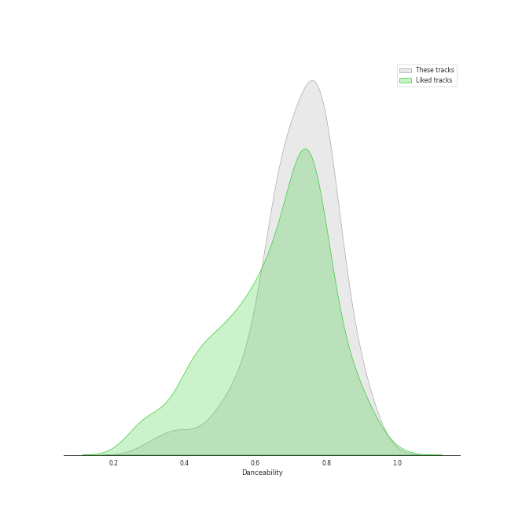
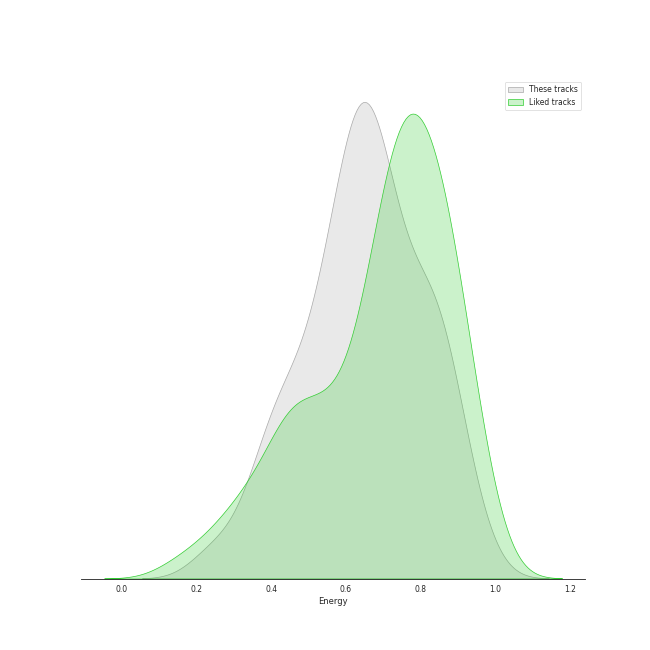
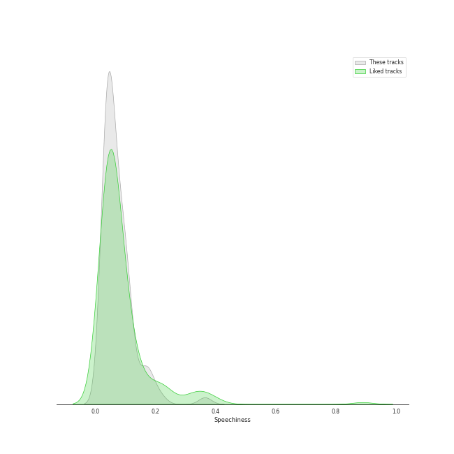
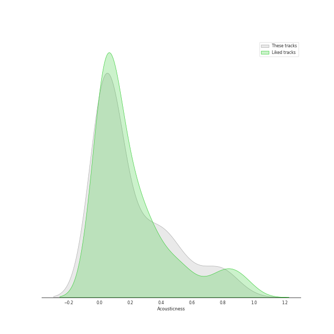
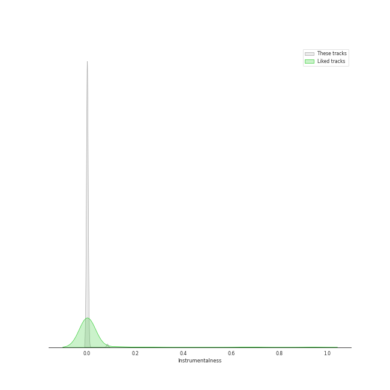
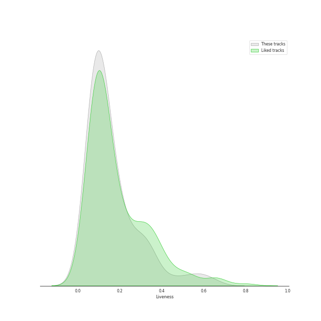
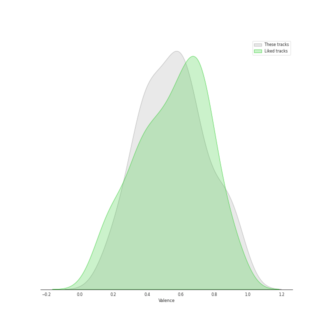
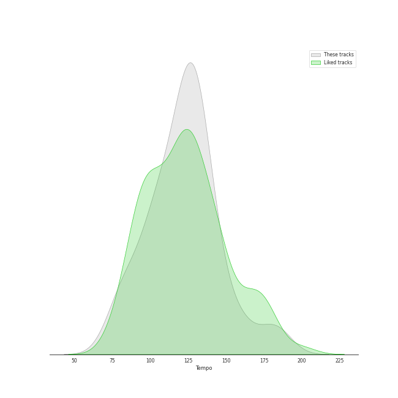

# Track Features for YG Entertainment

## Danceability

| ​ | 10 most Danceable tracks | ​​ | 10 least Danceable tracks |
|:---|:---|:---|:---|
|  | Typa Girl (0.915) |  | On The Ground (0.311) |
|  | Love Lee (0.914) |  | Melted (0.384) |
|  | 1, 2, 3, 4 (0.905) |  | You Never Know (0.477) |
|  | BATTER UP (0.903) |  | NO WAY (0.48) |
|  | U (0.873) |  | How can I love the heartbreak, you're the one I love (0.52) |
|  | 200% (0.853) |  | BABY BABY (0.534) |
|  | Fry’s Dream (0.845) |  | Hope Not (0.556) |
|  | FLOWER (0.841) |  | MISSING U (0.572) |
|  | MONEY (0.831) |  | 무제(無題) (Untitled, 2014) (0.583) |
|  | Shut Down (0.82) |  | Forever Young (0.605) |

## Energy

| ​ | 10 most Energetic tracks | ​​ | 10 least Energetic tracks |
|:---|:---|:---|:---|
|  | Forever Young (0.949) |  | How can I love the heartbreak, you're the one I love (0.248) |
|  | See U Later (0.926) |  | BREATHE (0.251) |
|  | CROOKED (0.919) |  | 20MIN (0.354) |
|  | Hello Bitches (0.884) |  | Melted (0.361) |
|  | Really (0.881) |  | The Happiest Girl (0.374) |
|  | MY STAR (0.872) |  | Gone (0.377) |
|  | DADDY (0.869) |  | FLOWER (0.384) |
|  | BEAUTIFUL (0.859) |  | Hope Not (0.423) |
|  | As If It's Your Last (0.852) |  | STAY (0.432) |
|  | LET'S NOT FALL IN LOVE (0.846) |  | You Never Know (0.435) |

## Speechiness

| ​ | 10 most Speechy tracks | ​​ | 10 least Speechy tracks |
|:---|:---|:---|:---|
|  | Ice Cream (with Selena Gomez) (0.365) |  | Hope Not (0.0274) |
|  | MONEY (0.218) |  | LOVE SCENARIO (0.0307) |
|  | Kill This Love (0.191) |  | Tally (0.031) |
|  | Whale (0.181) |  | Melted (0.0311) |
|  | FXXK WIT US (0.163) |  | HOLD MY HAND (0.0317) |
|  | Love To Hate Me (0.159) |  | MISSING U (0.0318) |
|  | Pink Venom (0.145) |  | 무제(無題) (Untitled, 2014) (0.0321) |
|  | DADDY (0.13) |  | The Happiest Girl (0.0328) |
|  | RHYTHM TA (0.114) |  | Only Look At Me (나만 바라봐) (0.0336) |
|  | WHISTLE (0.114) |  | Still Life (0.034) |

## Acousticness

| ​ | 10 most Acoustic tracks | ​​ | 10 least Acoustic tracks |
|:---|:---|:---|:---|
|  | How can I love the heartbreak, you're the one I love (0.91) |  | CROOKED (0.00191) |
|  | Melted (0.832) |  | THE GIRLS - BLACKPINK THE GAME OST (0.00199) |
|  | BREATHE (0.803) |  | Fantastic Baby (0.002) |
|  | 무제(無題) (Untitled, 2014) (0.785) |  | BOOMBAYAH (0.00268) |
|  | 20MIN (0.768) |  | Shut Down (0.00412) |
|  | NO WAY (0.748) |  | Yeah Yeah Yeah (0.00486) |
|  | 눈,코,입 (Eyes, Nose, Lips) (0.736) |  | Lovesick Girls (0.00559) |
|  | The Happiest Girl (0.638) |  | WHISTLE (0.00561) |
|  | Gone (0.594) |  | Hard to Love (0.00616) |
|  | STAY (0.551) |  | Tally (0.00777) |

## Instrumentalness

| ​ | 10 most Instrumental tracks | ​​ | 10 least Instrumental tracks |
|:---|:---|:---|:---|
|  | You and I (Park Bom) (0.0837) |  | Shut Down (0.0) |
|  | Whale (0.00351) |  | BONA BONA (0.0) |
|  | Kill This Love (0.00221) |  | Typa Girl (0.0) |
|  | FREEDOM (0.000966) |  | Tally (0.0) |
|  | LALISA (0.000784) |  | How People Move (0.0) |
|  | How You Like That (0.000135) |  | DARARI (0.0) |
|  | Pretty Savage (0.000122) |  | NO ONE (0.0) |
|  | Crazy Over You (0.000119) |  | NO WAY (0.0) |
|  | Ice Cream (with Selena Gomez) (8.06e-05) |  | 눈,코,입 (Eyes, Nose, Lips) (0.0) |
|  | MONEY (6.12e-05) |  | BOOMBAYAH (0.0) |

## Liveness

| ​ | 10 most Live tracks | ​​ | 10 least Live tracks |
|:---|:---|:---|:---|
|  | Typa Girl (0.628) |  | Ice Cream (with Selena Gomez) (0.0311) |
|  | See U Later (0.582) |  | It's Over (0.0471) |
|  | Rose (0.56) |  | How People Move (0.0511) |
|  | BOOMBAYAH (0.497) |  | CROOKED (0.0588) |
|  | Hello Bitches (0.439) |  | How You Like That (0.0601) |
|  | LOSER (0.356) |  | Still Life (0.0628) |
|  | HOLD MY HAND (0.351) |  | Yeah Yeah Yeah (0.0628) |
|  | BANG BANG BANG (0.346) |  | MMM (0.0643) |
|  | RHYTHM TA (0.332) |  | Fantastic Baby (0.0652) |
|  | Only Look At Me (나만 바라봐) (0.332) |  | NO ONE (0.0664) |

## Valence

| ​ | 10 most Happy tracks | ​​ | 10 least Happy tracks |
|:---|:---|:---|:---|
|  | 1, 2, 3, 4 (0.955) |  | FREEDOM (0.152) |
|  | Really (0.947) |  | Melted (0.169) |
|  | RE-BYE (0.924) |  | Hope Not (0.179) |
|  | MY STAR (0.92) |  | How can I love the heartbreak, you're the one I love (0.228) |
|  | Ice Cream (with Selena Gomez) (0.91) |  | Still Life (0.239) |
|  | 1, 2 (0.881) |  | 눈,코,입 (Eyes, Nose, Lips) (0.254) |
|  | BATTER UP (0.873) |  | 무제(無題) (Untitled, 2014) (0.263) |
|  | 200% (0.872) |  | On The Ground (0.286) |
|  | Only Look At Me (나만 바라봐) (0.859) |  | MOVE (T5) (0.307) |
|  | LALISA (0.85) |  | BABY BABY (0.314) |

## Tempo

| ​ | 10 most Fast tracks | ​​ | 10 least Fast tracks |
|:---|:---|:---|:---|
|  | On The Ground (188.7) |  | MISSING U (71.967) |
|  | Pink Venom (180.169) |  | 무제(無題) (Untitled, 2014) (79.826) |
|  | BABY BABY (179.908) |  | Gone (79.936) |
|  | Love To Hate Me (162.225) |  | MMM (79.976) |
|  | You and I (Park Bom) (161.838) |  | FXXK WIT US (80.037) |
|  | THE GIRLS - BLACKPINK THE GAME OST (160.07) |  | RHYTHM TA (81.975) |
|  | Ice Cream (with Selena Gomez) (159.972) |  | DARARI (84.955) |
|  | Pretty Savage (152.045) |  | STAY (87.959) |
|  | LALISA (150.058) |  | LOSER (89.846) |
|  | Hello Bitches (145.075) |  | The Happiest Girl (91.058) |
