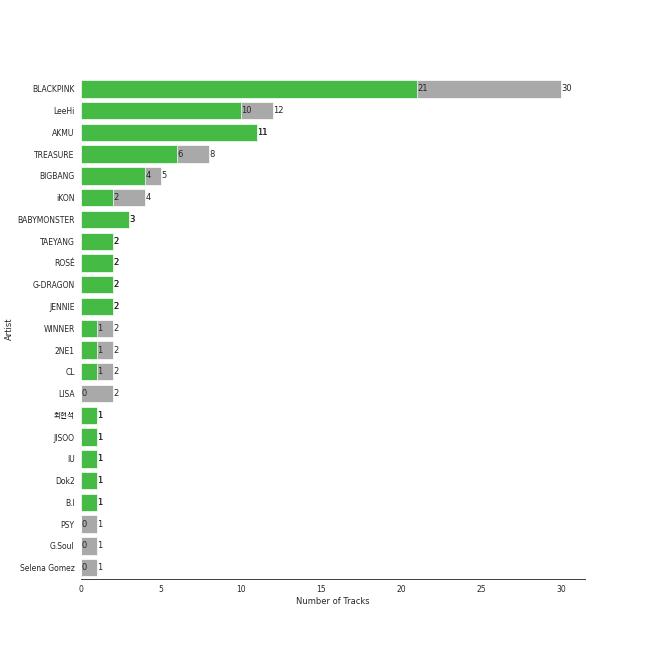
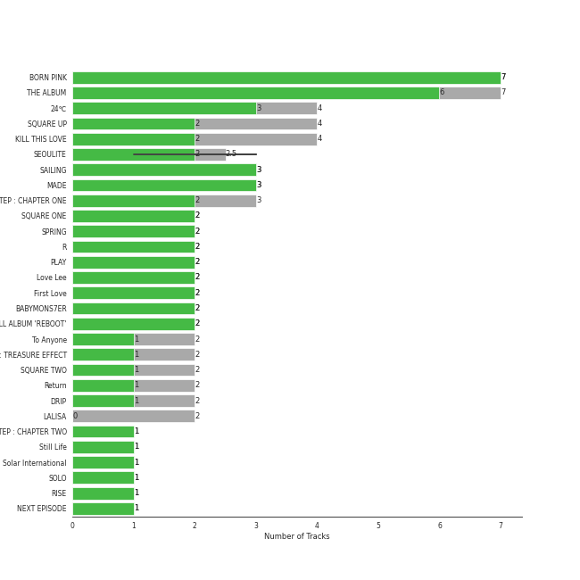
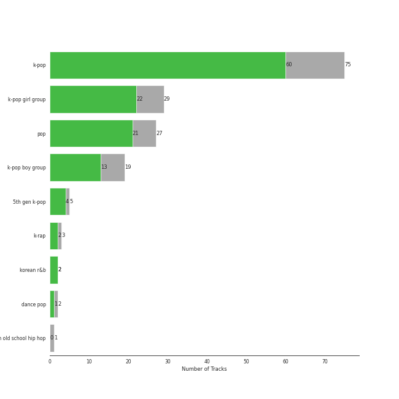
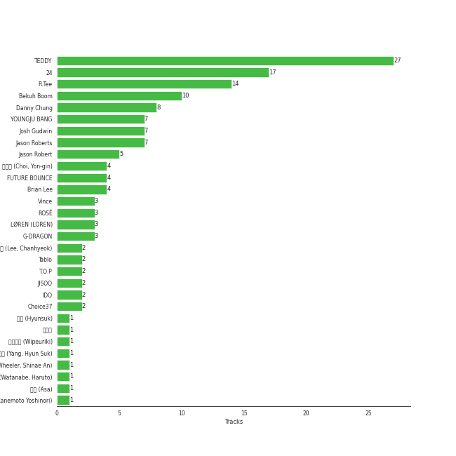

# YG Entertainment

89 songs

Appears as:
- YG Entertainment (58 tracks)
- YG Entertainment/Interscope Records (20 tracks)
- YG Entertainment, distributed through Interscope Records (5 tracks)
- 2018 YG Entertainment, distributed through Interscope Records (4 tracks)
- YG Entertainment/Columbia Records (2 tracks)

## Top Artists

| Art | Rank | Tracks | 💚 | Artist | 🔗 |
|:---|---:|---:|---:|:---|:---|
|  | 5 | 27 | 21 | [BLACKPINK](../../artists/blackpink/overview.md) | [🔗](https://open.spotify.com/artist/41MozSoPIsD1dJM0CLPjZF) |
|  | 72 | 11 | 11 | [AKMU](../../artists/akmu/overview.md) | [🔗](https://open.spotify.com/artist/6OwKE9Ez6ALxpTaKcT5ayv) |
|  | 11 | 12 | 10 | [LeeHi](../../artists/leehi/overview.md) | [🔗](https://open.spotify.com/artist/7cVZApDoQZpS447nHTsNqu) |
|  | 78 | 8 | 6 | [TREASURE](../../artists/treasure/overview.md) | [🔗](https://open.spotify.com/artist/3KonOYiLsU53m4yT7gNotP) |
|  | 176 | 5 | 4 | BIGBANG | [🔗](https://open.spotify.com/artist/4Kxlr1PRlDKEB0ekOCyHgX) |
|  | 81 | 5 | 4 | BABYMONSTER | [🔗](https://open.spotify.com/artist/1SIocsqdEefUTE6XKGUiVS) |
|  | 340 | 4 | 2 | iKON | [🔗](https://open.spotify.com/artist/5qRSs6mvI17zrkJpOHkCoM) |
|  | 58 | 2 | 2 | TAEYANG | [🔗](https://open.spotify.com/artist/6udveWUgX4vu75FF0DTrXV) |
|  | 126 | 2 | 2 | [ROSÉ](../../artists/rosé/overview.md) | [🔗](https://open.spotify.com/artist/3eVa5w3URK5duf6eyVDbu9) |
|  | 62 | 2 | 2 | G-DRAGON | [🔗](https://open.spotify.com/artist/30b9WulBM8sFuBo17nNq9c) |

See all 23 artists

| Art | Rank | Tracks | 💚 | Artist | 🔗 |
|:---|---:|---:|---:|:---|:---|
|  | 103 | 2 | 2 | JENNIE | [🔗](https://open.spotify.com/artist/250b0Wlc5Vk0CoUsaCY84M) |
|  | 448 | 2 | 1 | WINNER | [🔗](https://open.spotify.com/artist/5DuzBeOgFwViFcv00Q5PFb) |
|  | 68 | 2 | 1 | 2NE1 | [🔗](https://open.spotify.com/artist/1l0mKo96Jh9HVYONcRl3Yp) |
|  | 448 | 2 | 1 | CL | [🔗](https://open.spotify.com/artist/0tzSBCPJZmHTdOA3ZV2mN3) |
| | 448 | 1 | 1 | 최현석 | [🔗](https://open.spotify.com/artist/7ywGEr53ogVxLibBcb82JV) |
|  | 318 | 1 | 1 | JISOO | [🔗](https://open.spotify.com/artist/6UZ0ba50XreR4TM8u322gs) |
|  | 3 | 1 | 1 | [IU](../../artists/iu/overview.md) | [🔗](https://open.spotify.com/artist/3HqSLMAZ3g3d5poNaI7GOU) |
|  | 448 | 1 | 1 | Dok2 | [🔗](https://open.spotify.com/artist/0rW6fVd3yuW2CF2sLYWQtE) |
|  | 430 | 1 | 1 | B.I | [🔗](https://open.spotify.com/artist/0UntV1Bw2hk3fbRrm9eMP6) |
|  | 152 | 2 | 0 | LISA | [🔗](https://open.spotify.com/artist/5L1lO4eRHmJ7a0Q6csE5cT) |
|  | 293 | 1 | 0 | PSY | [🔗](https://open.spotify.com/artist/2dd5mrQZvg6SmahdgVKDzh) |
|  | 448 | 1 | 0 | G.Soul | [🔗](https://open.spotify.com/artist/0fLesFHNsJpalRtqzSYxnd) |
|  | 448 | 1 | 0 | Selena Gomez | [🔗](https://open.spotify.com/artist/0C8ZW7ezQVs4URX5aX7Kqx) |

## Top Albums

| Art | Rank | Tracks | 💚 | Album | Release Date | 🔗 |
|:---|---:|---:|---:|:---|:---|:---|
|  | 690 | 7 | 7 | BORN PINK | 2022-09-15 | [🔗](https://open.spotify.com/album/0kbZ4ZNRs76sSFeGUEErFM) |
|  | 1 | 7 | 6 | THE ALBUM | 2020-10-02 | [🔗](https://open.spotify.com/album/71O60S5gIJSIAhdnrDIh3N) |
|  | 323 | 4 | 3 | 24℃ | 2019-05-30 | [🔗](https://open.spotify.com/album/5u9CP1NknadV33hZepVEy5) |
|  | 77 | 4 | 2 | SQUARE UP | 2018-06-15 | [🔗](https://open.spotify.com/album/0wOiWrujRbxlKEGWRQpKYc) |
|  | 18 | 4 | 2 | KILL THIS LOVE | 2019-04-05 | [🔗](https://open.spotify.com/album/3PNxZ3BELbUXJ1XLktXiHz) |
|  | 145 | 3 | 3 | SEOULITE | 2016-03-09 | [🔗](https://open.spotify.com/album/2c41Flo2HQgy0A9P3xuSFf) |
|  | 312 | 3 | 3 | SAILING | 2019-09-25 | [🔗](https://open.spotify.com/album/7C0Ci0alKWwwXPIFYEdVcn) |
|  | 255 | 3 | 3 | MADE | 2016-12-13 | [🔗](https://open.spotify.com/album/2SPrl8C8pgSM5gXbAiyJHY) |
|  | 381 | 3 | 2 | THE SECOND STEP : CHAPTER ONE | 2022-02-15 | [🔗](https://open.spotify.com/album/17l09k7ZDb4GYwmsIVGcRZ) |
|  | 104 | 2 | 2 | SQUARE ONE | 2016-08-08 | [🔗](https://open.spotify.com/album/0FOOodYRlj7gzh7q7IjmNZ) |

See all 45 albums

| Art | Rank | Tracks | 💚 | Album | Release Date | 🔗 |
|:---|---:|---:|---:|:---|:---|:---|
|  | 411 | 2 | 2 | SPRING | 2016-05-04 | [🔗](https://open.spotify.com/album/0HtbFp1B1WrbUr9mcBrAhN) |
|  | 221 | 2 | 2 | R | 2021-03-12 | [🔗](https://open.spotify.com/album/5BQcoDfcZ8aBcikYX9B7Ob) |
|  | 554 | 2 | 2 | PLAY | 2014-04-07 | [🔗](https://open.spotify.com/album/1eu07xRE0vQfN5et0Y3DAy) |
|  | 170 | 2 | 2 | Love Lee | 2023-08-21 | [🔗](https://open.spotify.com/album/47xcjDSi1t6pQE2RvXKdUF) |
|  | 690 | 2 | 2 | First Love | 2013-03-28 | [🔗](https://open.spotify.com/album/74thqvuyVQfosFffvKx2uo) |
|  | 91 | 2 | 2 | BABYMONS7ER | 2024-04-01 | [🔗](https://open.spotify.com/album/0eSbsl3j8jz96LC2NCLPc4) |
|  | 320 | 2 | 2 | 2ND FULL ALBUM 'REBOOT' | 2023-07-28 | [🔗](https://open.spotify.com/album/4gQx8IC4zESV506dgNs0vR) |
|  | 649 | 2 | 1 | To Anyone | 2010-09-09 | [🔗](https://open.spotify.com/album/2SNSGfhfcfBLyQDTXMCPXG) |
|  | 690 | 2 | 1 | THE FIRST STEP : TREASURE EFFECT | 2021-01-11 | [🔗](https://open.spotify.com/album/5tQDFmW8QrZdTsICpLQBTL) |
|  | 489 | 2 | 1 | SQUARE TWO | 2016-11-01 | [🔗](https://open.spotify.com/album/2Fna4Tb7fme5aHsNMJtVtp) |
|  | 690 | 2 | 1 | SEOULITE | 2016-04-20 | [🔗](https://open.spotify.com/album/3cGyWEJaQlj7kCdKBCOGeb) |
|  | 690 | 2 | 1 | Return | 2018-01-25 | [🔗](https://open.spotify.com/album/7th9VLudqM04TpG8hNE1pb) |
|  | 690 | 2 | 1 | DRIP | 2024-11-01 | [🔗](https://open.spotify.com/album/6Lp82GTJXzgtIopT0g7N7k) |
|  | 690 | 2 | 0 | LALISA | 2021-09-10 | [🔗](https://open.spotify.com/album/66OYt73mqan1hWa78BhfPd) |
|  | 133 | 1 | 1 | THE SECOND STEP : CHAPTER TWO | 2022-10-04 | [🔗](https://open.spotify.com/album/4l5YvRcmno5RMKZCZp1j0g) |
|  | 570 | 1 | 1 | Still Life | 2022-04-05 | [🔗](https://open.spotify.com/album/2oCAY48bhZvQte0l7apmYC) |
|  | 561 | 1 | 1 | Solar International | 2010-08-19 | [🔗](https://open.spotify.com/album/42BVvYE1FLO8mQH0ZJn4de) |
|  | 171 | 1 | 1 | SOLO | 2018-11-12 | [🔗](https://open.spotify.com/album/7qAJpYeABXN9ZV5wOOX59k) |
|  | 72 | 1 | 1 | RISE | 2014-06-03 | [🔗](https://open.spotify.com/album/1Y9so4jq4t4taAHu0VdKX3) |
|  | 421 | 1 | 1 | NEXT EPISODE | 2021-07-26 | [🔗](https://open.spotify.com/album/0Pt0eGpyNO5dDN8PORypSy) |
|  | 451 | 1 | 1 | NEW KIDS REPACKAGE : THE NEW KIDS | 2019-01-07 | [🔗](https://open.spotify.com/album/6RZYa7F18bu7mmeT8qxWqh) |
|  | 418 | 1 | 1 | ME | 2023-03-31 | [🔗](https://open.spotify.com/album/4QuczuzDZNzCDli5Gz6DQ0) |
|  | 407 | 1 | 1 | LOVE EPISODE | 2024-06-03 | [🔗](https://open.spotify.com/album/3HG5kKZPdKRspJFUvShae7) |
|  | 46 | 1 | 1 | KWON JI YONG | 2017-06-08 | [🔗](https://open.spotify.com/album/2koSNfchdUxqw1rPJO87aH) |
|  | 446 | 1 | 1 | JENNIE Special Single [You & Me] | 2023-10-06 | [🔗](https://open.spotify.com/album/1Vzh3fTdh0R0evafCcpNpL) |
|  | 690 | 1 | 1 | Hello Bitches | 2015-12-05 | [🔗](https://open.spotify.com/album/1pu6aEuAKBdTdQLSbfBNTG) |
|  | 690 | 1 | 1 | EXIT : E | 2016-02-01 | [🔗](https://open.spotify.com/album/7D2FML3EyRJcCoiEgUbRxT) |
|  | 690 | 1 | 1 | COUP D'ETAT | 2013-09-05 | [🔗](https://open.spotify.com/album/4msI9bSfKohOPFic15aLR4) |
|  | 173 | 1 | 1 | BATTER UP | 2023-11-27 | [🔗](https://open.spotify.com/album/2CSQuvvt3XHLDX36O3nRv7) |
|  | 690 | 1 | 1 | As If It's Your Last | 2017-06-22 | [🔗](https://open.spotify.com/album/7ikmjsvRzDRzxHN0KXSQdv) |
|  | 470 | 1 | 1 | 1,2,3,4 | 2012-10-29 | [🔗](https://open.spotify.com/album/6yYc7Ag6nVB3HVXzLjF9uz) |
|  | 690 | 1 | 0 | PSY 7TH ALBUM | 2015-12-01 | [🔗](https://open.spotify.com/album/1aHmoh8Iog2xqwVk9A77yc) |
|  | 690 | 1 | 0 | FATE NUMBER FOR | 2017-04-04 | [🔗](https://open.spotify.com/album/7aUSYOs4iSl0qx28lelrs0) |
|  | 690 | 1 | 0 | DEBUT FULL ALBUM 'WELCOME BACK' | 2015-12-24 | [🔗](https://open.spotify.com/album/56d4rgrQSPY3fzbxQS260h) |
|  | 690 | 1 | 0 | ALIVE | 2012-02-29 | [🔗](https://open.spotify.com/album/5rI92smOlSS5d1Hq05BY7M) |

## Genres

| Tracks | 💚 | Genre |
|---:|---:|:---|
| 75 | 60 | [k-pop](../../genres/k-pop/overview.md) |
| 29 | 22 | [k-pop girl group](../../genres/k-pop_girl_group/overview.md) |
| 27 | 21 | [pop](../../genres/pop/overview.md) |
| 19 | 13 | [k-pop boy group](../../genres/k-pop_boy_group/overview.md) |
| 5 | 4 | [5th gen k-pop](../../genres/5th_gen_k-pop/overview.md) |
| 3 | 2 | [k-rap](../../genres/k-rap/overview.md) |
| 2 | 2 | [korean r&b](../../genres/korean_r_b/overview.md) |
| 2 | 1 | [dance pop](../../genres/dance_pop/overview.md) |
| 1 | 0 | korean old school hip hop |

## Top Producers

| Art | Producer | Tracks | Credit Types |
|:---|:---|---:|:---|
| | [TEDDY](../../producers/teddy/overview.md) | 28 | Lyricist, Producer, Songwriter, Arranger |
| | [24](../../producers/24/overview.md) | 17 | Arranger, Producer, Songwriter |
| | [R.Tee](../../producers/r_tee/overview.md) | 14 | Arranger, Producer, Songwriter, Lyricist |
|  | Bekuh Boom | 10 | Lyricist, Songwriter |
| | Jason Roberts | 8 | Producer |
| | Danny Chung | 8 | Lyricist |
| | YOUNGJU BANG | 7 | Producer |
| | [Josh Gudwin](../../producers/josh_gudwin/overview.md) | 7 | Producer |
| | Jason Robert | 5 | Producer |
| | Brian Lee | 4 | Songwriter, Producer, Lyricist |

View all

| Art | Producer | Tracks | Credit Types |
|:---|:---|---:|:---|
| | FUTURE BOUNCE | 4 | Arranger, Songwriter |
| | 최용인 (Choi, Yon-gin) | 4 | Producer |
|  | G-DRAGON | 3 | Lyricist, Songwriter |
|  | [ROSÉ](../../artists/rosé/overview.md) | 3 | Songwriter, Lyricist |
| | Vince | 3 | Arranger, Lyricist |
| | LØREN (LOREN) | 3 | Lyricist |
| | 양현석 (Yang, Hyun Suk) | 2 | Arranger, Lyricist, Songwriter, Producer |
| | KUSH | 2 | Arranger, Lyricist, Songwriter, Producer |
| | IDO | 2 | Arranger, Songwriter |
| | T.O.P | 2 | Lyricist |
|  | JISOO | 2 | Lyricist |
| | 이찬혁 (Lee, Chanhyeok) | 2 | Lyricist, Songwriter |
| | Choice37 | 2 | Lyricist, Arranger, Songwriter |
| | Tablo | 2 | Lyricist, Songwriter |
| | Raul Cubina | 1 | Songwriter |
| | Alex Oriet | 1 | Lyricist, Songwriter |
| | 한재응 (Han, Jae-Eung) | 1 | Producer |
| | Chaz Mishan | 1 | Arranger, Songwriter |
| | Brother Su | 1 | Lyricist |
| | Jon Bellion | 1 | Producer, Songwriter |
| | Teddy Sinclair | 1 | Lyricist, Songwriter |
| | 春虎 (Watanabe, Haruto) | 1 | Lyricist |
| | Willy Moon | 1 | Lyricist, Songwriter |
| | YONGJU BANG | 1 | Producer |
| | Dominsuk | 1 | Arranger, Songwriter |
| | WHERE THE NOISE | 1 | Lyricist |
| | BIGTONE | 1 | Lyricist |
| | アサ (Asa) | 1 | Lyricist, Songwriter |
| | Lydia Paek | 1 | Songwriter |
| | かねもと よしのり (Kanemoto Yoshinori) | 1 | Lyricist |
|  | TAEYANG | 1 | Songwriter |
| | Steph Jones | 1 | Lyricist |
| | YG Family | 1 | Producer |
|  | 2NE1 | 1 | Producer |
| | NOHC | 1 | Arranger |
| | Tushar Apte | 1 | Arranger, Lyricist, Songwriter |
| | 최현석 | 1 | Lyricist |
| | Jose Balaguer | 1 | Producer |
| | JONGHYUN | 1 | Lyricist, Songwriter |
| | 현석 (Hyunsuk) | 1 | Lyricist |
| | Amy Allen | 1 | Songwriter |
| | Nat Dunn | 1 | Lyricist, Songwriter |
| | Dee.P | 1 | Arranger, Songwriter |
| | Leah Haywood | 1 | Songwriter |
| | 안신애 (Wheeler, Shinae An) | 1 | Lyricist, Songwriter |
| | Soraya LaPread | 1 | Lyricist, Songwriter |
|  | Dok2 | 1 | Lyricist |
| | Ojivolta | 1 | Producer |
| | Jorgen Odegard | 1 | Producer, Songwriter |
|  | JENNIE | 1 | Lyricist, Songwriter |
| | VVN | 1 | Lyricist, Songwriter |
| | Paro | 1 | Lyricist, Songwriter |
| | Chloe George | 1 | Lyricist |
|  | David Guetta | 1 | Songwriter |
| | 신성권 (Shin, Sung-Kwon) | 1 | Producer |
| | 이경준 (Lee, Kyung-Joon) | 1 | Producer |
| | J. Lauryn | 1 | Songwriter |
| | Jared Lee | 1 | Lyricist, Songwriter |
| | 위프리키 (Wipeuriki) | 1 | Songwriter |
| | Rob Grimaldi | 1 | Arranger, Lyricist, Songwriter |
|  | [YENA](../../artists/yena/overview.md) | 1 | Arranger |
| | Max Wolfgang | 1 | Lyricist, Songwriter |
| | David Phelan | 1 | Lyricist, Songwriter |
| | Bianca Atterberry | 1 | Lyricist, Songwriter |
| | Freddy Wexler | 1 | Lyricist, Songwriter |

## Tracks released under YG Entertainment

| Art | Track | Album | Artists | Label | Rank | 💚 | 🔗 |
|:---|:---|:---|:---|:---|---:|:---|:---|
|  | Pretty Savage | THE ALBUM | [BLACKPINK](../../artists/blackpink/overview.md) | [Interscope Records](../interscope_records), [YG Entertainment](.) | 11 | 💚 | [🔗](https://open.spotify.com/track/1XnpzbOGptRwfJhZgLbmSr) |
|  | Kill This Love | KILL THIS LOVE | [BLACKPINK](../../artists/blackpink/overview.md) | [Interscope Records](../interscope_records), [YG Entertainment](.) | 13 | 💚 | [🔗](https://open.spotify.com/track/6hvczQ05jc1yGlp9zhb95V) |
|  | Crazy Over You | THE ALBUM | [BLACKPINK](../../artists/blackpink/overview.md) | [Interscope Records](../interscope_records), [YG Entertainment](.) | 15 | 💚 | [🔗](https://open.spotify.com/track/7qq0EOPW4RRlqdvMBmdd73) |
|  | How You Like That | THE ALBUM | [BLACKPINK](../../artists/blackpink/overview.md) | [Interscope Records](../interscope_records), [YG Entertainment](.) | 16 | 💚 | [🔗](https://open.spotify.com/track/4SFknyjLcyTLJFPKD2m96o) |
|  | 무제(無題) (Untitled, 2014) | KWON JI YONG | G-DRAGON | [YG Entertainment](.) | 43 | 💚 | [🔗](https://open.spotify.com/track/16BS342F89MDqouSxgLaUK) |
|  | 눈,코,입 (Eyes, Nose, Lips) | RISE | TAEYANG | [YG Entertainment](.) | 84 | 💚 | [🔗](https://open.spotify.com/track/0lYtIvI7bO51PZSeK22Mbz) |
|  | DDU-DU DDU-DU | SQUARE UP | [BLACKPINK](../../artists/blackpink/overview.md) | [Interscope Records](../interscope_records), [YG Entertainment](.) | 89 | 💚 | [🔗](https://open.spotify.com/track/4lQsB3ERTWSNaAN1IkuNRl) |
|  | SHEESH | BABYMONS7ER | BABYMONSTER | [YG Entertainment](.) | 106 | 💚 | [🔗](https://open.spotify.com/track/1njlnn8ZKHI77Pe9szIONR) |
|  | BOOMBAYAH | SQUARE ONE | [BLACKPINK](../../artists/blackpink/overview.md) | [YG Entertainment](.) | 145 | 💚 | [🔗](https://open.spotify.com/track/13MF2TYuyfITClL1R2ei6e) |
|  | HELLO | THE SECOND STEP : CHAPTER TWO | [TREASURE](../../artists/treasure/overview.md) | [YG Entertainment](.) | 167 | 💚 | [🔗](https://open.spotify.com/track/1ex8euBuzVyqjThnYfwY2k) |

See all tracks

| Art | Track | Album | Artists | Label | Rank | 💚 | 🔗 |
|:---|:---|:---|:---|:---|---:|:---|:---|
|  | HOLD MY HAND | SEOULITE | [LeeHi](../../artists/leehi/overview.md) | [YG Entertainment](.) | 197 | 💚 | [🔗](https://open.spotify.com/track/7bwSMCwF2C4cK2W97H6oCA) |
|  | WHISTLE | SQUARE ONE | [BLACKPINK](../../artists/blackpink/overview.md) | [YG Entertainment](.) | 210 | 💚 | [🔗](https://open.spotify.com/track/6NEoeBLQbOMw92qMeLfI40) |
|  | SOLO | SOLO | JENNIE | [Interscope Records](../interscope_records), [YG Entertainment](.) | 242 | 💚 | [🔗](https://open.spotify.com/track/2wVDWtLKXunswWecARNILj) |
|  | BATTER UP | BATTER UP | BABYMONSTER | [YG Entertainment](.) | 244 | 💚 | [🔗](https://open.spotify.com/track/3VBj0lzjmhTzVFPEDOjNCG) |
|  | Love Lee | Love Lee | [AKMU](../../artists/akmu/overview.md) | [YG Entertainment](.) | 266 | 💚 | [🔗](https://open.spotify.com/track/1qosh64U6CR5ki1g1Rf2dZ) |
|  | Gone | R | [ROSÉ](../../artists/rosé/overview.md) | [Interscope Records](../interscope_records), [YG Entertainment](.) | 308 | 💚 | [🔗](https://open.spotify.com/track/2dHoVW9AxJVSRebPRyV2aA) |
|  | Fry’s Dream | Love Lee | [AKMU](../../artists/akmu/overview.md) | [YG Entertainment](.) | 325 | 💚 | [🔗](https://open.spotify.com/track/6f4CAdAmrOfGH3FOfwHMSV) |
|  | LOSER | MADE | BIGBANG | [YG Entertainment](.) | 375 | 💚 | [🔗](https://open.spotify.com/track/2vzn8usBcuNL93DnTjEK0z) |
|  | Whale | SAILING | [AKMU](../../artists/akmu/overview.md) | [YG Entertainment](.) | 437 | 💚 | [🔗](https://open.spotify.com/track/5OJ275pPDWTd2qWX4kbhXj) |
|  | BREATHE | SEOULITE | [LeeHi](../../artists/leehi/overview.md) | [YG Entertainment](.) | 445 | 💚 | [🔗](https://open.spotify.com/track/6G4z9WbxyEeWdEQTfShACT) |
|  | 20MIN | 24℃ | [LeeHi](../../artists/leehi/overview.md) | [YG Entertainment](.) | 458 | 💚 | [🔗](https://open.spotify.com/track/1Wl9MPBkb50b4uevY6sxkA) |
|  | MOVE (T5) | 2ND FULL ALBUM 'REBOOT' | [TREASURE](../../artists/treasure/overview.md) | [Columbia](../columbia), [YG Entertainment](.) | 531 | 💚 | [🔗](https://open.spotify.com/track/6ce3rQ3j3vfRics2YiHWbW) |
|  | DARARI | THE SECOND STEP : CHAPTER ONE | [TREASURE](../../artists/treasure/overview.md) | [YG Entertainment](.) | 554 | 💚 | [🔗](https://open.spotify.com/track/0dcnrLo8s1rhjm8euGjI4n) |
|  | Hero | LOVE EPISODE | [AKMU](../../artists/akmu/overview.md) | [YG Entertainment](.) | 594 | 💚 | [🔗](https://open.spotify.com/track/1hXs7BduDW3yGSSwolP8eh) |
|  | How People Move | SPRING | [AKMU](../../artists/akmu/overview.md) | [YG Entertainment](.) | 602 | 💚 | [🔗](https://open.spotify.com/track/0c2Yg75sFgD0hWhRq4voAn) |
|  | FLOWER | ME | JISOO | [Interscope Records](../interscope_records), [YG Entertainment](.) | 612 | 💚 | [🔗](https://open.spotify.com/track/69CrOS7vEHIrhC2ILyEi0s) |
|  | NAKKA (with IU) | NEXT EPISODE | [AKMU](../../artists/akmu/overview.md), [IU](../../artists/iu/overview.md) | [YG Entertainment](.) | 616 | 💚 | [🔗](https://open.spotify.com/track/4t2FIqZJORKZGSKg30SShr) |
|  | You & Me | JENNIE Special Single [You & Me] | JENNIE | [Interscope Records](../interscope_records), [YG Entertainment](.) | 664 | 💚 | [🔗](https://open.spotify.com/track/6gcuJpHu0Ey30D5WR76y98) |
|  | KILLING ME | NEW KIDS REPACKAGE : THE NEW KIDS | iKON | [YG Entertainment](.) | 674 | 💚 | [🔗](https://open.spotify.com/track/1IbpTcFDHRD87cGQOhVCDP) |
|  | 1, 2, 3, 4 | 1,2,3,4 | [LeeHi](../../artists/leehi/overview.md) | [YG Entertainment](.) | 697 | 💚 | [🔗](https://open.spotify.com/track/1MMuD3VaVq7qqfvRgSrbRs) |
|  | PLAYING WITH FIRE | SQUARE TWO | [BLACKPINK](../../artists/blackpink/overview.md) | [YG Entertainment](.) | 728 | 💚 | [🔗](https://open.spotify.com/track/7qmvLmX9tyaTiBAVNI6YEn) |
|  | BONA BONA | 2ND FULL ALBUM 'REBOOT' | [TREASURE](../../artists/treasure/overview.md) | [Columbia](../columbia), [YG Entertainment](.) | 755 | 💚 | [🔗](https://open.spotify.com/track/0IkWksfw3Qxob96bjFKhyF) |
|  | Melted | PLAY | [AKMU](../../artists/akmu/overview.md) | [YG Entertainment](.) | 837 | 💚 | [🔗](https://open.spotify.com/track/2tYPFWrbGbsGKafe5pP64z) |
|  | Only Look At Me (나만 바라봐) | Solar International | TAEYANG | [YG Entertainment](.) | 852 | 💚 | [🔗](https://open.spotify.com/track/1xaLJbuJr6efSW8MFA7vTu) |
|  | LET'S NOT FALL IN LOVE | MADE | BIGBANG | [YG Entertainment](.) | 861 | 💚 | [🔗](https://open.spotify.com/track/6UgkB0xM45TR3Zjqm3GQ6T) |
|  | Still Life | Still Life | BIGBANG | [YG Entertainment](.) | 870 | 💚 | [🔗](https://open.spotify.com/track/3TSLqZssCoCdDlMhCJ08XW) |
|  | Can't Nobody | To Anyone | 2NE1 | [YG Entertainment](.) | 994 | | [🔗](https://open.spotify.com/track/6bdrK3DnKZWfAsvO21oj1q) |
|  | You and I (Park Bom) | To Anyone | 2NE1 | [YG Entertainment](.) | 1054 | 💚 | [🔗](https://open.spotify.com/track/14Pn9Vd2GKwQrVYADgCZ5l) |
|  | Fantastic Baby | ALIVE | BIGBANG | [YG Entertainment](.) | 1054 | | [🔗](https://open.spotify.com/track/26eV0R7nbqtlzh316ncU99) |
|  | It's Over | First Love | [LeeHi](../../artists/leehi/overview.md) | [YG Entertainment](.) | 1054 | 💚 | [🔗](https://open.spotify.com/track/47PAgx8nAijlmCdJtiq2iE) |
|  | Rose | First Love | [LeeHi](../../artists/leehi/overview.md) | [YG Entertainment](.) | 1054 | 💚 | [🔗](https://open.spotify.com/track/6MksZu2sx5jzoPszxbRZMw) |
|  | CROOKED | COUP D'ETAT | G-DRAGON | [YG Entertainment](.) | 1054 | 💚 | [🔗](https://open.spotify.com/track/4EwNWRBWdZ6bgvxRHlZ8OO) |
|  | 200% | PLAY | [AKMU](../../artists/akmu/overview.md) | [YG Entertainment](.) | 1054 | 💚 | [🔗](https://open.spotify.com/track/6qkx0tenDglbF21CU4wa1k) |
|  | DADDY | PSY 7TH ALBUM | PSY, CL | [YG Entertainment](.) | 1054 | | [🔗](https://open.spotify.com/track/1eMVXXpNPEUdFRy5ZH7FpM) |
|  | Hello Bitches | Hello Bitches | CL | [YG Entertainment](.) | 1054 | 💚 | [🔗](https://open.spotify.com/track/72ysGFB4mZTgQsPqN9PzPS) |
|  | RHYTHM TA | DEBUT FULL ALBUM 'WELCOME BACK' | iKON | [YG Entertainment](.) | 1054 | | [🔗](https://open.spotify.com/track/6vLIqcTMfTvs6ecdYqRuOD) |
|  | BABY BABY | EXIT : E | WINNER | [YG Entertainment](.) | 1054 | 💚 | [🔗](https://open.spotify.com/track/2zLRE8rUhH2i7maIU5sWVI) |
|  | FXXK WIT US | SEOULITE | [LeeHi](../../artists/leehi/overview.md), Dok2 | [YG Entertainment](.) | 1054 | 💚 | [🔗](https://open.spotify.com/track/6wj3blmFAG2pNWQ40Yuaq8) |
|  | MISSING U | SEOULITE | [LeeHi](../../artists/leehi/overview.md) | [YG Entertainment](.) | 1054 | 💚 | [🔗](https://open.spotify.com/track/4uk677I1lb0ZPSXGhL2FcA) |
|  | MY STAR | SEOULITE | [LeeHi](../../artists/leehi/overview.md) | [YG Entertainment](.) | 1054 | | [🔗](https://open.spotify.com/track/42Dl2MOplqImwLoIPMv6Me) |
|  | RE-BYE | SPRING | [AKMU](../../artists/akmu/overview.md) | [YG Entertainment](.) | 1054 | 💚 | [🔗](https://open.spotify.com/track/7pz1YzMwDxS9uuwAEp7MLk) |
|  | STAY | SQUARE TWO | [BLACKPINK](../../artists/blackpink/overview.md) | [YG Entertainment](.) | 1054 | | [🔗](https://open.spotify.com/track/3tP6QKbXvtrxiDI7QwKyUf) |
|  | BANG BANG BANG | MADE | BIGBANG | [YG Entertainment](.) | 1054 | 💚 | [🔗](https://open.spotify.com/track/3dI59jLoFMjMAyUAyRZnkE) |
|  | REALLY REALLY | FATE NUMBER FOR | WINNER | [YG Entertainment](.) | 1054 | | [🔗](https://open.spotify.com/track/4iJyTp1KwCeBKhf7h0SwsD) |
|  | As If It's Your Last | As If It's Your Last | [BLACKPINK](../../artists/blackpink/overview.md) | [YG Entertainment](.) | 1054 | 💚 | [🔗](https://open.spotify.com/track/4ZxOuNHhpyOj4gv52MtQpT) |
|  | BEAUTIFUL | Return | iKON | [YG Entertainment](.) | 1054 | | [🔗](https://open.spotify.com/track/2l526adqDC9nZ9TL4dD80A) |
|  | LOVE SCENARIO | Return | iKON | [YG Entertainment](.) | 1054 | 💚 | [🔗](https://open.spotify.com/track/3d3ELsqKlQ7WA0a10Isu3l) |
|  | Forever Young | SQUARE UP | [BLACKPINK](../../artists/blackpink/overview.md) | [Interscope Records](../interscope_records), [YG Entertainment](.) | 1054 | 💚 | [🔗](https://open.spotify.com/track/6veFyjNycn6EaNCKhkPXUY) |
|  | Really | SQUARE UP | [BLACKPINK](../../artists/blackpink/overview.md) | [Interscope Records](../interscope_records), [YG Entertainment](.) | 1054 | | [🔗](https://open.spotify.com/track/2URMA0ap6SAI8wFmcY1yta) |
|  | See U Later | SQUARE UP | [BLACKPINK](../../artists/blackpink/overview.md) | [Interscope Records](../interscope_records), [YG Entertainment](.) | 1054 | | [🔗](https://open.spotify.com/track/2REoTZjaB3jyAt5dgkV5GK) |
|  | Don't Know What To Do | KILL THIS LOVE | [BLACKPINK](../../artists/blackpink/overview.md) | [Interscope Records](../interscope_records), [YG Entertainment](.) | 1054 | 💚 | [🔗](https://open.spotify.com/track/38SKB7UfhL6Sd6Joxex5yK) |
|  | Hope Not | KILL THIS LOVE | [BLACKPINK](../../artists/blackpink/overview.md) | [Interscope Records](../interscope_records), [YG Entertainment](.) | 1054 | | [🔗](https://open.spotify.com/track/3eZD5DZGibwxMAOaCMBg3k) |
|  | Kick It | KILL THIS LOVE | [BLACKPINK](../../artists/blackpink/overview.md) | [Interscope Records](../interscope_records), [YG Entertainment](.) | 1054 | | [🔗](https://open.spotify.com/track/4rsoLz7ZY1Ldz8dpm4Lqtg) |
|  | 1, 2 | 24℃ | [LeeHi](../../artists/leehi/overview.md), 최현석 | [YG Entertainment](.) | 1054 | 💚 | [🔗](https://open.spotify.com/track/2U4292s8Vs8p7rDP8LYr8c) |
|  | NO ONE | 24℃ | [LeeHi](../../artists/leehi/overview.md), B.I | [YG Entertainment](.) | 1054 | 💚 | [🔗](https://open.spotify.com/track/0iQ7Nc2YhlyGHeUi4R8Gl6) |
|  | NO WAY | 24℃ | [LeeHi](../../artists/leehi/overview.md), G.Soul | [YG Entertainment](.) | 1054 | | [🔗](https://open.spotify.com/track/0jA0TihvVbPHgrIcHbW1Og) |
|  | FREEDOM | SAILING | [AKMU](../../artists/akmu/overview.md) | [YG Entertainment](.) | 1054 | 💚 | [🔗](https://open.spotify.com/track/3vu2YlsxVFIb8xz8ZBAwiX) |
|  | How can I love the heartbreak, you're the one I love | SAILING | [AKMU](../../artists/akmu/overview.md) | [YG Entertainment](.) | 1054 | 💚 | [🔗](https://open.spotify.com/track/0hqj5JBnFt1BHEz2UCFwrl) |
|  | Ice Cream (with Selena Gomez) | THE ALBUM | [BLACKPINK](../../artists/blackpink/overview.md), Selena Gomez | [Interscope Records](../interscope_records), [YG Entertainment](.) | 1054 | | [🔗](https://open.spotify.com/track/4JUPEh2DVSXFGExu4Uxevz) |
|  | Love To Hate Me | THE ALBUM | [BLACKPINK](../../artists/blackpink/overview.md) | [Interscope Records](../interscope_records), [YG Entertainment](.) | 1054 | 💚 | [🔗](https://open.spotify.com/track/7iKDsPfLT0d5mu2htfMKBZ) |
|  | Lovesick Girls | THE ALBUM | [BLACKPINK](../../artists/blackpink/overview.md) | [Interscope Records](../interscope_records), [YG Entertainment](.) | 1054 | 💚 | [🔗](https://open.spotify.com/track/4Ws314Ylb27BVsvlZOy30C) |
|  | You Never Know | THE ALBUM | [BLACKPINK](../../artists/blackpink/overview.md) | [Interscope Records](../interscope_records), [YG Entertainment](.) | 1054 | 💚 | [🔗](https://open.spotify.com/track/39kzWAiVPpycdMpr745oPj) |
|  | I LOVE YOU | THE FIRST STEP : TREASURE EFFECT | [TREASURE](../../artists/treasure/overview.md) | [YG Entertainment](.) | 1054 | 💚 | [🔗](https://open.spotify.com/track/1SxqqC1aQ8JiLyfMrHYmnF) |
|  | MMM | THE FIRST STEP : TREASURE EFFECT | [TREASURE](../../artists/treasure/overview.md) | [YG Entertainment](.) | 1054 | | [🔗](https://open.spotify.com/track/7DlfhY3YfQKi97j0DXihen) |
|  | On The Ground | R | [ROSÉ](../../artists/rosé/overview.md) | [Interscope Records](../interscope_records), [YG Entertainment](.) | 1054 | 💚 | [🔗](https://open.spotify.com/track/2pn8dNVSpYnAtlKFC8Q0DJ) |
|  | LALISA | LALISA | LISA | [Interscope Records](../interscope_records), [YG Entertainment](.) | 1054 | | [🔗](https://open.spotify.com/track/7uQZVznj0uQOGC9KhV2Mg6) |
|  | MONEY | LALISA | LISA | [Interscope Records](../interscope_records), [YG Entertainment](.) | 1054 | | [🔗](https://open.spotify.com/track/7hU3IHwjX150XLoTVmjD0q) |
|  | JIKJIN | THE SECOND STEP : CHAPTER ONE | [TREASURE](../../artists/treasure/overview.md) | [YG Entertainment](.) | 1054 | 💚 | [🔗](https://open.spotify.com/track/2bnJ8IxZnVc2YmUaX0sZap) |
|  | U | THE SECOND STEP : CHAPTER ONE | [TREASURE](../../artists/treasure/overview.md) | [YG Entertainment](.) | 1054 | | [🔗](https://open.spotify.com/track/5NIHhuAdsaZHmGeEoHiGY7) |
|  | Hard to Love | BORN PINK | [BLACKPINK](../../artists/blackpink/overview.md) | [Interscope Records](../interscope_records), [YG Entertainment](.) | 1054 | 💚 | [🔗](https://open.spotify.com/track/1AigcD5jRDRZeSUwbDebgW) |
|  | Pink Venom | BORN PINK | [BLACKPINK](../../artists/blackpink/overview.md) | [Interscope Records](../interscope_records), [YG Entertainment](.) | 1054 | 💚 | [🔗](https://open.spotify.com/track/5zwwW9Oq7ubSxoCGyW1nbY) |
|  | Shut Down | BORN PINK | [BLACKPINK](../../artists/blackpink/overview.md) | [Interscope Records](../interscope_records), [YG Entertainment](.) | 1054 | 💚 | [🔗](https://open.spotify.com/track/7gRFDGEzF9UkBV233yv2dc) |
|  | Tally | BORN PINK | [BLACKPINK](../../artists/blackpink/overview.md) | [Interscope Records](../interscope_records), [YG Entertainment](.) | 1054 | 💚 | [🔗](https://open.spotify.com/track/6wXsbgTd5PDNEClVdmZU5z) |
|  | The Happiest Girl | BORN PINK | [BLACKPINK](../../artists/blackpink/overview.md) | [Interscope Records](../interscope_records), [YG Entertainment](.) | 1054 | 💚 | [🔗](https://open.spotify.com/track/7AdGloF1UHKe1vAZPbqIXH) |
|  | Typa Girl | BORN PINK | [BLACKPINK](../../artists/blackpink/overview.md) | [Interscope Records](../interscope_records), [YG Entertainment](.) | 1054 | 💚 | [🔗](https://open.spotify.com/track/6ZMeStEX2VHPkrBQYiDF3h) |
|  | Yeah Yeah Yeah | BORN PINK | [BLACKPINK](../../artists/blackpink/overview.md) | [Interscope Records](../interscope_records), [YG Entertainment](.) | 1054 | 💚 | [🔗](https://open.spotify.com/track/5y4WmuvFX1t3NdSId0MFOh) |
|  | LIKE THAT | BABYMONS7ER | BABYMONSTER | [YG Entertainment](.) | 1054 | 💚 | [🔗](https://open.spotify.com/track/7GDgpad2BQVuDUzaxHFakc) |
|  | CLIK CLAK | DRIP | BABYMONSTER | [YG Entertainment](.) | 1054 | | [🔗](https://open.spotify.com/track/0Rq9lIn9fl4wiW9Tg72ifr) |
|  | DRIP | DRIP | BABYMONSTER | [YG Entertainment](.) | 1054 | 💚 | [🔗](https://open.spotify.com/track/198zDKzyktXRG1PGpidY9h) |

