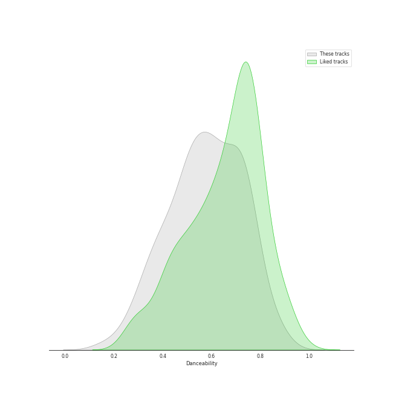
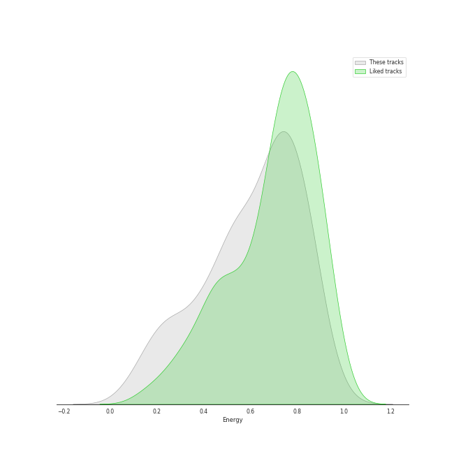
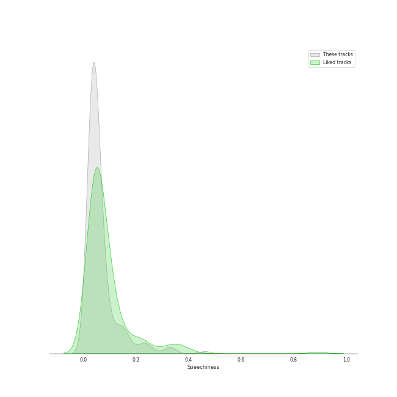
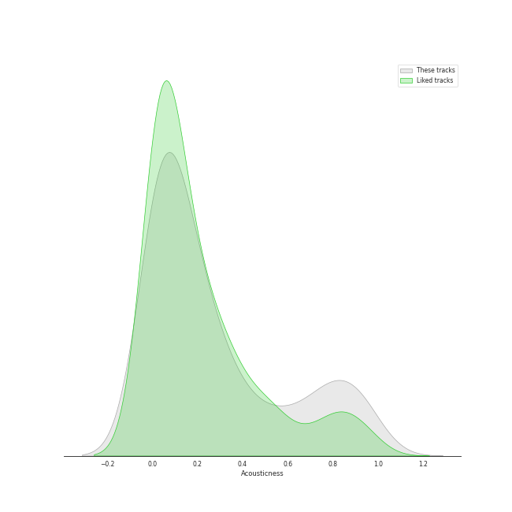
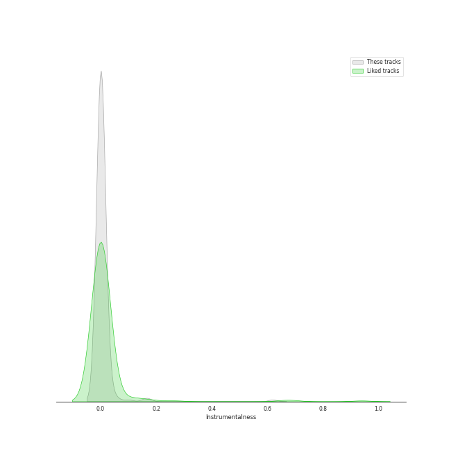
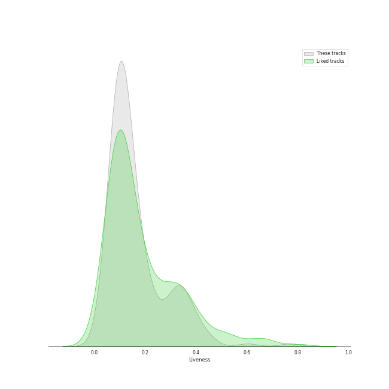
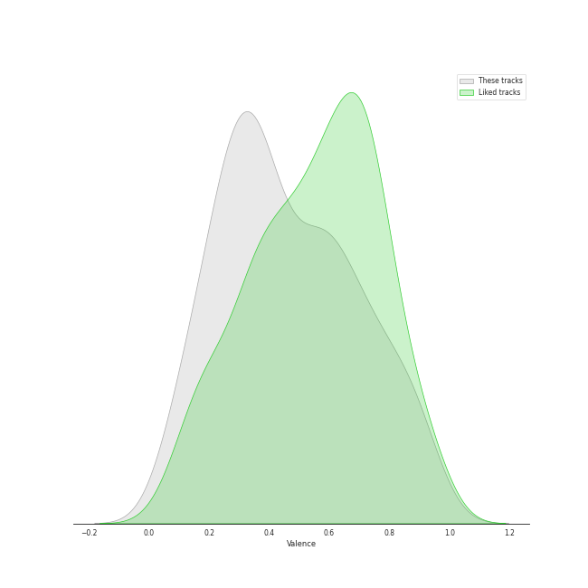
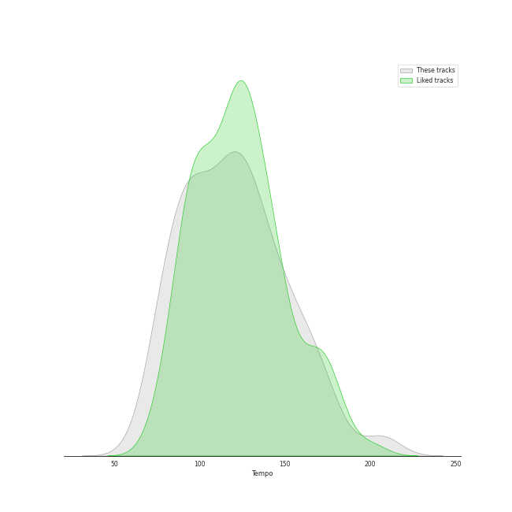

# Track Features for A-Pop Favorites

## Danceability

| ​ | 10 most Danceable tracks | ​​ | 10 least Danceable tracks |
|:---|:---|:---|:---|
|  | bury a friend (0.905) |  | Bridge Over Troubled Water (0.149) |
|  | Love Sex Magic (feat. Justin Timberlake) (0.893) |  | Lights (0.193) |
|  | Make Me Feel (0.859) |  | Paranoid Android (0.251) |
|  | Trendsetter (0.858) |  | No Surprises (0.255) |
|  | Good Intent (0.851) |  | Across The Universe - Remastered 2009 (0.257) |
|  | Crazy (0.836) |  | Gravity (0.27) |
|  | At My Worst (0.813) |  | Once Upon Another Time (0.275) |
|  | Technologic (0.812) |  | Poison & Wine (0.285) |
|  | Paper Rings (0.811) |  | exile (feat. Bon Iver) (0.298) |
|  | Gorgeous (0.8) |  | Dream On (0.307) |

## Energy

| ​ | 10 most Energetic tracks | ​​ | 10 least Energetic tracks |
|:---|:---|:---|:---|
|  | When Doves Cry (0.989) |  | Mad World (0.0585) |
|  | Go Your Own Way - 2004 Remaster (0.941) |  | And So It Goes (0.0871) |
|  | Everybody Talks (0.924) |  | xanny (0.125) |
|  | Lone Digger (0.924) |  | Julia (0.128) |
|  | Smooth (feat. Rob Thomas) (0.923) |  | Golden Slumbers - Remastered 2009 (0.152) |
|  | Cameo Lover (0.922) |  | Landslide (0.161) |
|  | Bad Romance (0.921) |  | Hide and Seek (0.166) |
|  | Misery Business (0.906) |  | Manhattan (0.168) |
|  | Gimme Sympathy (0.886) |  | Honeybee (0.186) |
|  | Movin' Out (Anthony's Song) (0.88) |  | Poison & Wine (0.186) |

## Speechiness

| ​ | 10 most Speechy tracks | ​​ | 10 least Speechy tracks |
|:---|:---|:---|:---|
|  | Youngblood (0.463) |  | Satellite Call (0.0241) |
|  | bury a friend (0.332) |  | Breakeven (0.0242) |
|  | &burn (with Vince Staples) (0.331) |  | Old Fashioned (0.0246) |
|  | Hustle (0.326) |  | Set Fire to the Rain (0.0249) |
|  | Buttons (0.267) |  | High and Dry (0.0256) |
|  | xanny (0.239) |  | Karma Police (0.0258) |
|  | Focus (0.239) |  | Begin Again (0.0263) |
|  | Talk Dirty (feat. 2 Chainz) (0.232) |  | Machine Gun (0.0268) |
|  | Technologic (0.224) |  | I Want It That Way (0.027) |
|  | Daddy Lessons (0.216) |  | Instant Crush (feat. Julian Casablancas) (0.0271) |

## Acousticness

| ​ | 10 most Acoustic tracks | ​​ | 10 least Acoustic tracks |
|:---|:---|:---|:---|
|  | Mad World (0.976) |  | Technologic (0.000369) |
|  | Manhattan (0.972) |  | Out Of The Woods (0.00103) |
|  | Take It All (0.957) |  | Yellow (0.00239) |
|  | Skinny Love (0.952) |  | New Rules (0.00261) |
|  | lovely (with Khalid) (0.934) |  | Misery Business (0.00272) |
|  | When I Was Your Man (0.932) |  | Everybody Talks (0.00301) |
|  | All of Me (0.922) |  | Bad Romance (0.00314) |
|  | Off My Face (0.92) |  | Carry on Wayward Son (0.00321) |
|  | And So It Goes (0.91) |  | Set Fire to the Rain (0.00408) |
|  | Hide and Seek (0.909) |  | Sway With Me (with GALXARA) (0.00468) |

## Instrumentalness

| ​ | 10 most Instrumental tracks | ​​ | 10 least Instrumental tracks |
|:---|:---|:---|:---|
|  | Instant Crush (feat. Julian Casablancas) (0.619) |  | Leave The Door Open (0.0) |
|  | Kill Bill (0.169) |  | The Lighthouse's Tale (0.0) |
|  | bury a friend (0.162) |  | Trendsetter (0.0) |
|  | Fake Plastic Trees (0.0997) |  | Love Me Like You Do (0.0) |
|  | Crazy (0.0583) |  | Come Round Soon (0.0) |
|  | Lights - Single Version (0.0469) |  | When I Was Your Man (0.0) |
|  | 25 or 6 to 4 (0.0367) |  | At My Worst (0.0) |
|  | Satellite Call (0.0318) |  | lovely (with Khalid) (0.0) |
|  | Islands (0.0261) |  | Julia (0.0) |
|  | Toxic (0.025) |  | Take Me to Church (0.0) |

## Liveness

| ​ | 10 most Live tracks | ​​ | 10 least Live tracks |
|:---|:---|:---|:---|
|  | Don't Stop Me Now - Remastered 2011 (0.77) |  | Flowers (0.0232) |
|  | Revolution 1 - Remastered 2009 (0.621) |  | Uncharted (0.0343) |
|  | Love On Top (0.604) |  | Superstition - Single Version (0.0385) |
|  | Carry on Wayward Son (0.446) |  | Eden (0.0456) |
|  | Focus (0.444) |  | Chasing The Sun (0.0497) |
|  | When Doves Cry (0.443) |  | Paranoid Android (0.0545) |
|  | ...Baby One More Time (0.443) |  | When I Get You Alone (0.0549) |
|  | Off To The Races (0.4) |  | My Life (0.0555) |
|  | Rockabye (feat. Sean Paul & Anne-Marie) (0.398) |  | Halo (0.0563) |
|  | Bang Bang (0.396) |  | Movin' Out (Anthony's Song) (0.0591) |

## Valence

| ​ | 10 most Happy tracks | ​​ | 10 least Happy tracks |
|:---|:---|:---|:---|
|  | Smooth (feat. Rob Thomas) (0.961) |  | xanny (0.0528) |
|  | I Choose You (0.947) |  | Once Upon Another Time (0.0551) |
|  | Toxic (0.924) |  | Yellow Flicker Beat (0.0597) |
|  | Levitating (feat. DaBaby) (0.915) |  | Skyfall (0.0789) |
|  | ...Baby One More Time (0.907) |  | Dress (0.0851) |
|  | That Man (0.903) |  | Islands (0.0863) |
|  | Movin' Out (Anthony's Song) (0.895) |  | Hide and Seek (0.0901) |
|  | Blow Away (0.891) |  | Creep (0.104) |
|  | Lone Digger (0.88) |  | We All Need Saving (0.117) |
|  | Sway With Me (with GALXARA) (0.875) |  | No Surprises (0.118) |

## Tempo

| ​ | 10 most Fast tracks | ​​ | 10 least Fast tracks |
|:---|:---|:---|:---|
|  | Buttons (210.857) |  | imagine (62.519) |
|  | That Man (207.029) |  | Lover (68.534) |
|  | Lights (205.422) |  | When I Was Your Man (72.795) |
|  | Uncharted (203.962) |  | Fake Plastic Trees (73.543) |
|  | MONTERO (Call Me By Your Name) (178.818) |  | We All Need Saving (74.717) |
|  | Piano Man (177.734) |  | Come Round Soon (74.751) |
|  | Mad World (174.149) |  | Karma Police (74.807) |
|  | Me And My Broken Heart (174.084) |  | exile (feat. Bon Iver) (75.602) |
|  | Yellow (173.372) |  | Skyfall (75.881) |
|  | Misery Business (172.977) |  | Only the Good Die Young (76.214) |
