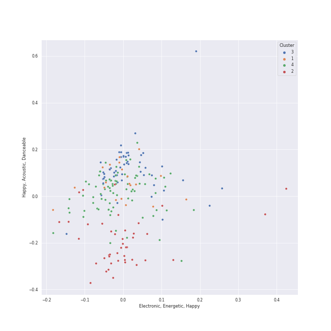

# Clusters in A-Pop Favorites

## Cluster #1

21 tracks

| Art | Track | Album | Artists | Label | Rank | 💚 | 🔗 |
|:---|:---|:---|:---|:---|---:|:---|:---|
|  | Rockabye (feat. Sean Paul & Anne-Marie) | What Is Love? (Deluxe Edition) | [Clean Bandit](../../../../artists/clean_bandit/overview.md), Sean Paul, Anne-Marie | Atlantic Records UK | 974 | 💚 | [🔗](https://open.spotify.com/track/2hrUO4drrO63i7FYbCLBl2) |
|  | Bang Bang | My Everything - Deluxe | Jessie J, [Ariana Grande](../../../../artists/ariana_grande/overview.md), Nicki Minaj | [Universal Records](../../../../labels/universal_music_llc) | 974 | 💚 | [🔗](https://open.spotify.com/track/466s1BacUmiRdR3ISvNjyx) |
|  | Talk Dirty (feat. 2 Chainz) | Talk Dirty | [Jason Derulo](../../../../artists/jason_derulo/overview.md), 2 Chainz | [Beluga Heights/Warner Records](../../../../labels/warner_records) | 974 | 💚 | [🔗](https://open.spotify.com/track/6g6A7qNhTfUgOSH7ROOxTD) |
|  | Grace Kelly | Life in Cartoon Motion | MIKA | Casablanca Records/Island UK | 974 | 💚 | [🔗](https://open.spotify.com/track/7dzUZec5MnWMyQnk5klnKR) |
|  | Home | Carencro | Marc Broussard | [Island Records](../../../../labels/island_records) | 974 | 💚 | [🔗](https://open.spotify.com/track/1XhzO8cuPaqsqUKw92Wbwc) |
|  | MONTERO (Call Me By Your Name) | MONTERO (Call Me By Your Name) | Lil Nas X | [Columbia](../../../../labels/columbia) | 974 | 💚 | [🔗](https://open.spotify.com/track/67BtfxlNbhBmCDR2L2l8qd) |
|  | Everybody Talks | Picture Show | Neon Trees | Mercury Records | 754 | 💚 | [🔗](https://open.spotify.com/track/2iUmqdfGZcHIhS3b9E9EWq) |
|  | Hit 'Em Up Style (Oops!) | Bittersweet | Blu Cantrell | Arista | 974 | 💚 | [🔗](https://open.spotify.com/track/3flAV51ACbtIcEixb0QeZv) |
|  | Carry on Wayward Son | Leftoverture (Expanded Edition) | Kansas | [Epic](../../../../labels/epic), [Legacy](../../../../labels/legacy) | 974 | 💚 | [🔗](https://open.spotify.com/track/4DMKwE2E2iYDKY01C335Uw) |
|  | Sway With Me (with GALXARA) | Sway With Me (with GALXARA) | Saweetie, GALXARA | [Atlantic Records](../../../../labels/atlantic_records) | 974 | 💚 | [🔗](https://open.spotify.com/track/5gqLY5H1ZyT3BScVr0nDMs) |
## Cluster #2

49 tracks

| Art | Track | Album | Artists | Label | Rank | 💚 | 🔗 |
|:---|:---|:---|:---|:---|---:|:---|:---|
|  | Manhattan | The Blessed Unrest | [Sara Bareilles](../../../../artists/sara_bareilles/overview.md) | [Epic](../../../../labels/epic) | 607 | 💚 | [🔗](https://open.spotify.com/track/0aSgzAUObtmSSwh1yO6shv) |
|  | The Lighthouse's Tale | Nickel Creek | Nickel Creek | Sugar Hill Records | 974 | 💚 | [🔗](https://open.spotify.com/track/05HjafWVI238CLw5RDNkas) |
|  | Take It All | 21 | [Adele](../../../../artists/adele/overview.md) | [XL Recordings](../../../../labels/xl_recordings) | 209 | 💚 | [🔗](https://open.spotify.com/track/08YJEcxGtYXwCGqXMZDiyQ) |
|  | Samson | Begin to Hope | Regina Spektor | Sire | 974 | 💚 | [🔗](https://open.spotify.com/track/2JAUBPBVkimRLc5BGhAkfJ) |
|  | Video Games | Born To Die | [Lana Del Rey](../../../../artists/lana_del_rey/overview.md) | [Polydor Records](../../../../labels/polydor_records) | 974 | 💚 | [🔗](https://open.spotify.com/track/5by7gtiDrxe4n2qQQunL8S) |
|  | The Sound of Silence - Acoustic Version | Wednesday Morning, 3 A.M. | [Simon & Garfunkel](../../../../artists/simon___garfunkel/overview.md) | [Columbia](../../../../labels/columbia) | 974 | 💚 | [🔗](https://open.spotify.com/track/5y788ya4NvwhBznoDIcXwK) |
|  | Wait It Out | Ellipse | [Imogen Heap](../../../../artists/imogen_heap/overview.md) | [RCA Records Label](../../../../labels/rca_records_label) | 974 | 💚 | [🔗](https://open.spotify.com/track/4xszw2YraekWIpj0SZ6Lp6) |
|  | Stone Cold | Confident | Demi Lovato | [Hollywood Records](../../../../labels/hollywood_records) | 974 | 💚 | [🔗](https://open.spotify.com/track/3by8IfnW9dZ2t4pZw1WVxz) |
|  | Honeybee | The 2¢ Show | Steam Powered Giraffe | Steam Powered Giraffe | 228 | 💚 | [🔗](https://open.spotify.com/track/3MZjOGeXhpHbQ9ESMNFFnH) |
|  | All of Me | Love In The Future (Expanded Edition) | John Legend | [G.O.O.D. Music/Columbia](../../../../labels/columbia) | 974 | 💚 | [🔗](https://open.spotify.com/track/3U4isOIWM3VvDubwSI3y7a) |
## Cluster #3

50 tracks

| Art | Track | Album | Artists | Label | Rank | 💚 | 🔗 |
|:---|:---|:---|:---|:---|---:|:---|:---|
|  | Gonna Get Over You | Kaleidoscope Heart | [Sara Bareilles](../../../../artists/sara_bareilles/overview.md) | [Epic](../../../../labels/epic) | 974 | 💚 | [🔗](https://open.spotify.com/track/45ou2UBThJA4WtFGIiYLI3) |
|  | Fairytale | Little Voice | [Sara Bareilles](../../../../artists/sara_bareilles/overview.md) | [Epic](../../../../labels/epic) | 401 | 💚 | [🔗](https://open.spotify.com/track/1q8eyTNRSGEAqSvTATTgIG) |
|  | Love Song | Little Voice | [Sara Bareilles](../../../../artists/sara_bareilles/overview.md) | [Epic](../../../../labels/epic) | 974 | 💚 | [🔗](https://open.spotify.com/track/4E6cwWJWZw2zWf7VFbH7wf) |
|  | The Other Side (feat. CeeLo Green and B.o.B) | Doo-Wops & Hooligans | [Bruno Mars](../../../../artists/bruno_mars/overview.md), B.o.B, CeeLo Green | [Atlantic Records](../../../../labels/atlantic_records) | 974 | 💚 | [🔗](https://open.spotify.com/track/0HasfWMrNxTjycDy9TkRtA) |
|  | I Know Places | 1989 | [Taylor Swift](../../../../artists/taylor_swift/overview.md) | [Big Machine Records, LLC](../../../../labels/big_machine_records) | 974 | 💚 | [🔗](https://open.spotify.com/track/3jBMHD19RZdAqG9iFQh7xc) |
|  | Two Way Street | Vows (Deluxe Version) | [Kimbra](../../../../artists/kimbra/overview.md) | [Warner Records](../../../../labels/warner_records) | 974 | 💚 | [🔗](https://open.spotify.com/track/7ptSTFAis4UckLAfUrMfM0) |
|  | YOUTH | Blue Neighbourhood (Deluxe) | Troye Sivan | EMI Recorded Music Australia Pty Ltd | 974 | 💚 | [🔗](https://open.spotify.com/track/1cOyWWUr3oXJIxY0AjJEx9) |
|  | Me And My Broken Heart | Let The Road | Rixton | Silent Records/Giant Little Man | 392 | 💚 | [🔗](https://open.spotify.com/track/1oew3nFNY3vMacJAsvry0S) |
|  | Breakeven | The Script | The Script | [Epic/Phonogenic](../../../../labels/epic) | 958 | 💚 | [🔗](https://open.spotify.com/track/285hMzLhJwHVLe9QT9qilk) |
|  | I Want It That Way | Millennium | Backstreet Boys | [Jive](../../../../labels/jive) | 407 | 💚 | [🔗](https://open.spotify.com/track/47BBI51FKFwOMlIiX6m8ya) |
## Cluster #4

32 tracks

| Art | Track | Album | Artists | Label | Rank | 💚 | 🔗 |
|:---|:---|:---|:---|:---|---:|:---|:---|
|  | Go Your Own Way - 2004 Remaster | Rumours (Super Deluxe) | Fleetwood Mac | [Rhino](../../../../labels/rhino), [Warner Records](../../../../labels/warner_records) | 974 | 💚 | [🔗](https://open.spotify.com/track/4xh7W7tlNMIczFhupCPniY) |
|  | Disturbia | Good Girl Gone Bad: Reloaded | [Rihanna](../../../../artists/rihanna/overview.md) | [Def Jam Recordings](../../../../labels/def_jam_recordings) | 974 | 💚 | [🔗](https://open.spotify.com/track/2VOomzT6VavJOGBeySqaMc) |
|  | Lights - Single Version | Lights | Ellie Goulding | [Polydor Records](../../../../labels/polydor_records) | 974 | 💚 | [🔗](https://open.spotify.com/track/5qftsSFD6Qgndcx13SSqQj) |
|  | Only the Good Die Young | The Stranger (Legacy Edition) | [Billy Joel](../../../../artists/billy_joel/overview.md) | [Columbia](../../../../labels/columbia), [Legacy](../../../../labels/legacy) | 550 | 💚 | [🔗](https://open.spotify.com/track/1xOXXYh6lTW8laxlW7JP2J) |
|  | My Life | 52nd Street | [Billy Joel](../../../../artists/billy_joel/overview.md) | [Columbia](../../../../labels/columbia) | 974 | 💚 | [🔗](https://open.spotify.com/track/4ZoBC5MhSEzuknIgAkBaoT) |
|  | Misery Business | Riot! | Paramore | [Fueled By Ramen](../../../../labels/fueled_by_ramen) | 361 | 💚 | [🔗](https://open.spotify.com/track/6SpLc7EXZIPpy0sVko0aoU) |
|  | Sunday Morning | Songs About Jane | [Maroon 5](../../../../artists/maroon_5/overview.md) | [Interscope Records*](../../../../labels/interscope_records) | 974 | 💚 | [🔗](https://open.spotify.com/track/1YI0uK36eupTmw9F8kHysr) |
|  | This Love | Songs About Jane | [Maroon 5](../../../../artists/maroon_5/overview.md) | [Interscope Records*](../../../../labels/interscope_records) | 974 | 💚 | [🔗](https://open.spotify.com/track/6YgV0EF8xJMZz0Zm6BTaT4) |
|  | Electric Twist | Bomb In A Birdcage | A Fine Frenzy | [Virgin Records](../../../../labels/virgin_records) | 609 | 💚 | [🔗](https://open.spotify.com/track/2jQ7ZztDfmt4qeW0tOMIqY) |
|  | 25 or 6 to 4 | Chicago IX: Chicago's Greatest Hits | Chicago | [Rhino](../../../../labels/rhino) | 893 | 💚 | [🔗](https://open.spotify.com/track/65eRcjlStTnk8opG5eIQ8Z) |
## Cluster #5

52 tracks

| Art | Track | Album | Artists | Label | Rank | 💚 | 🔗 |
|:---|:---|:---|:---|:---|---:|:---|:---|
|  | Satellite Call | The Blessed Unrest | [Sara Bareilles](../../../../artists/sara_bareilles/overview.md) | [Epic](../../../../labels/epic) | 974 | 💚 | [🔗](https://open.spotify.com/track/0Jab895fPkyyQdNkMl6nYi) |
|  | Grenade | Doo-Wops & Hooligans | [Bruno Mars](../../../../artists/bruno_mars/overview.md) | [Atlantic Records](../../../../labels/atlantic_records) | 914 | 💚 | [🔗](https://open.spotify.com/track/2tJulUYLDKOg9XrtVkMgcJ) |
|  | DNA | DNA (Expanded Edition) | Little Mix | [Syco Music](../../../../labels/syco_music) | 974 | 💚 | [🔗](https://open.spotify.com/track/0MXMNgjjtOBxAjfw8a4lwL) |
|  | Dog Days Are Over | Lungs (Deluxe Edition) | [Florence + The Machine](../../../../artists/florence_+_the_machine/overview.md) | [Universal-Island Records Ltd.](../../../../labels/universal-island_records_ltd_) | 974 | 💚 | [🔗](https://open.spotify.com/track/1YLJVmuzeM2YSUkCCaTNUB) |
|  | Wally | Lemon Love | Aslyn | [Capitol Records](../../../../labels/capitol_records) | 974 | 💚 | [🔗](https://open.spotify.com/track/1JuNI0UJR2qDFlbZi1kO6p) |
|  | Bird Set Free | This Is Acting (Deluxe Version) | [Sia](../../../../artists/sia/overview.md) | [Monkey Puzzle](../../../../labels/monkey_puzzle), [RCA Records Label](../../../../labels/rca_records_label) | 974 | 💚 | [🔗](https://open.spotify.com/track/6MowG7MRVgPfGlCMsXKMJ2) |
|  | Cough Syrup | Young The Giant (Special Edition) | Young the Giant | Roadrunner Records | 974 | 💚 | [🔗](https://open.spotify.com/track/1UqhkbzB1kuFwt2iy4h29Q) |
|  | Breezeblocks | An Awesome Wave | alt-J | Canvasback/ATL | 394 | 💚 | [🔗](https://open.spotify.com/track/3n69hLUdIsSa1WlRmjMZlW) |
|  | Fitzpleasure | An Awesome Wave | alt-J | Canvasback/ATL | 974 | 💚 | [🔗](https://open.spotify.com/track/7DdXf9x75iEVCHWfoRwRuR) |
|  | There Goes My Baby | Raymond v Raymond (Expanded Edition) | USHER | LaFace Records | 974 | 💚 | [🔗](https://open.spotify.com/track/6IUiqtI8tE49sqGbmtrNd8) |