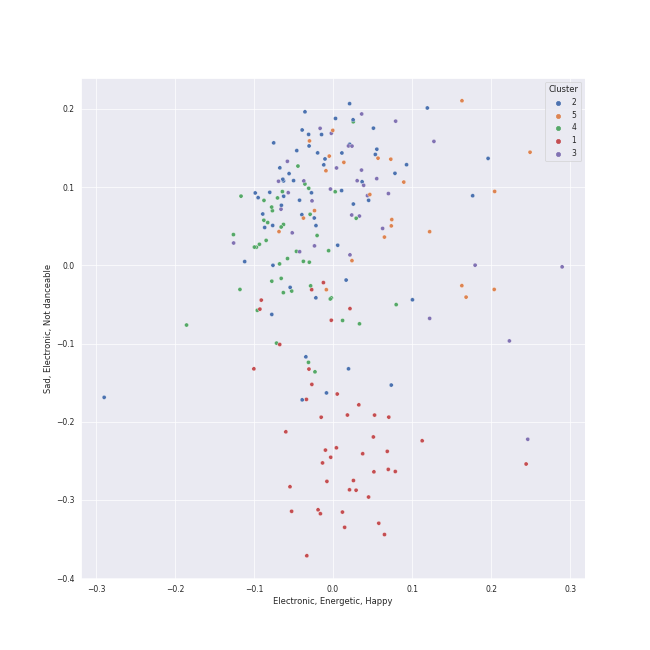

# Clusters in A-Pop Favorites

## Cluster #1

55 tracks

| Art | Track | Album | Artists | Label | Rank | 💚 | 🔗 |
|:---|:---|:---|:---|:---|---:|:---|:---|
|  | Armor | Amidst the Chaos (Bonus Version) | [Sara Bareilles](../../../../artists/sara_bareilles/overview.md) | [Epic](../../../../labels/epic) | nan | 💚 | [🔗](https://open.spotify.com/track/4kO1W2nNKj6C9h5vm31sdX) |
|  | Leave The Door Open | An Evening With Silk Sonic | [Bruno Mars](../../../../artists/bruno_mars/overview.md), Anderson .Paak, Silk Sonic | [Aftermath Entertainment/Atlantic](../../../../labels/atlantic_records) | nan | 💚 | [🔗](https://open.spotify.com/track/02VBYrHfVwfEWXk5DXyf0T) |
|  | Tightrope (feat. Big Boi) - Big Boi Vocal Edit | The ArchAndroid | [Janelle Monáe](../../../../artists/janelle_monáe/overview.md), Big Boi | [Bad Boy/Wondaland](../../../../labels/bad_boy) | nan | 💚 | [🔗](https://open.spotify.com/track/1ljzHUgt2SU2ADkhfa9eBC) |
|  | Disturbia | Good Girl Gone Bad: Reloaded | [Rihanna](../../../../artists/rihanna/overview.md) | [Def Jam Recordings](../../../../labels/def_jam_recordings) | nan | 💚 | [🔗](https://open.spotify.com/track/2VOomzT6VavJOGBeySqaMc) |
|  | Lights - Single Version | Lights | Ellie Goulding | [Polydor Records](../../../../labels/polydor_records) | nan | 💚 | [🔗](https://open.spotify.com/track/5qftsSFD6Qgndcx13SSqQj) |
|  | Cameo Lover | Vows (Deluxe Version) | [Kimbra](../../../../artists/kimbra/overview.md) | [Warner Records](../../../../labels/warner_records) | nan | 💚 | [🔗](https://open.spotify.com/track/6mEDMe0zG5pYrsRxizjauk) |
|  | Problem | My Everything (Deluxe) | [Ariana Grande](../../../../artists/ariana_grande/overview.md), Iggy Azalea | [Universal Records](../../../../labels/universal_music_llc) | 250 | 💚 | [🔗](https://open.spotify.com/track/7vS3Y0IKjde7Xg85LWIEdP) |
|  | This Love | Songs About Jane | [Maroon 5](../../../../artists/maroon_5/overview.md) | [Interscope Records*](../../../../labels/interscope_records) | nan | 💚 | [🔗](https://open.spotify.com/track/6YgV0EF8xJMZz0Zm6BTaT4) |
|  | When I Get You Alone | A Beautiful World | Robin Thicke | Nu America Music | nan | 💚 | [🔗](https://open.spotify.com/track/1jzWQHcMT8rxvgUjUiqGIH) |
|  | Hit 'Em Up Style (Oops!) | Bittersweet | Blu Cantrell | Arista | nan | 💚 | [🔗](https://open.spotify.com/track/3flAV51ACbtIcEixb0QeZv) |
## Cluster #2

36 tracks

| Art | Track | Album | Artists | Label | Rank | 💚 | 🔗 |
|:---|:---|:---|:---|:---|---:|:---|:---|
|  | Manhattan | The Blessed Unrest | [Sara Bareilles](../../../../artists/sara_bareilles/overview.md) | [Epic](../../../../labels/epic) | 463 | 💚 | [🔗](https://open.spotify.com/track/0aSgzAUObtmSSwh1yO6shv) |
|  | The Lighthouse's Tale | Nickel Creek | Nickel Creek | Sugar Hill Records | nan | 💚 | [🔗](https://open.spotify.com/track/05HjafWVI238CLw5RDNkas) |
|  | Take It All | 21 | [Adele](../../../../artists/adele/overview.md) | [XL Recordings](../../../../labels/xl_recordings) | 228 | 💚 | [🔗](https://open.spotify.com/track/08YJEcxGtYXwCGqXMZDiyQ) |
|  | Samson | Begin to Hope | Regina Spektor | Sire | nan | 💚 | [🔗](https://open.spotify.com/track/2JAUBPBVkimRLc5BGhAkfJ) |
|  | Video Games | Born To Die | [Lana Del Rey](../../../../artists/lana_del_rey/overview.md) | [Polydor Records](../../../../labels/polydor_records) | nan | 💚 | [🔗](https://open.spotify.com/track/5by7gtiDrxe4n2qQQunL8S) |
|  | The Sound of Silence - Acoustic Version | Wednesday Morning, 3 A.M. | [Simon & Garfunkel](../../../../artists/simon___garfunkel/overview.md) | [Columbia](../../../../labels/columbia) | nan | 💚 | [🔗](https://open.spotify.com/track/5y788ya4NvwhBznoDIcXwK) |
|  | Wait It Out | Ellipse | [Imogen Heap](../../../../artists/imogen_heap/overview.md) | [RCA Records Label](../../../../labels/rca_records_label) | nan | 💚 | [🔗](https://open.spotify.com/track/4xszw2YraekWIpj0SZ6Lp6) |
|  | Your Song | Elton John | Elton John | [UMC (Universal Music Catalogue)](../../../../labels/umc_(universal_music_catalogue)) | 307 | 💚 | [🔗](https://open.spotify.com/track/38zsOOcu31XbbYj9BIPUF1) |
|  | Honeybee | The 2¢ Show | Steam Powered Giraffe | Steam Powered Giraffe | 267 | 💚 | [🔗](https://open.spotify.com/track/3MZjOGeXhpHbQ9ESMNFFnH) |
|  | All of Me | Love In The Future (Expanded Edition) | John Legend | [G.O.O.D. Music/Columbia](../../../../labels/columbia) | nan | 💚 | [🔗](https://open.spotify.com/track/3U4isOIWM3VvDubwSI3y7a) |
## Cluster #3

49 tracks

| Art | Track | Album | Artists | Label | Rank | 💚 | 🔗 |
|:---|:---|:---|:---|:---|---:|:---|:---|
|  | Love Song | Little Voice | [Sara Bareilles](../../../../artists/sara_bareilles/overview.md) | [Epic](../../../../labels/epic) | nan | 💚 | [🔗](https://open.spotify.com/track/4E6cwWJWZw2zWf7VFbH7wf) |
|  | The Other Side (feat. CeeLo Green and B.o.B) | Doo-Wops & Hooligans | [Bruno Mars](../../../../artists/bruno_mars/overview.md), B.o.B, CeeLo Green | [Atlantic Records](../../../../labels/atlantic_records) | nan | 💚 | [🔗](https://open.spotify.com/track/0HasfWMrNxTjycDy9TkRtA) |
|  | I Know Places | 1989 | [Taylor Swift](../../../../artists/taylor_swift/overview.md) | [Big Machine Records, LLC](../../../../labels/big_machine_records) | nan | 💚 | [🔗](https://open.spotify.com/track/3jBMHD19RZdAqG9iFQh7xc) |
|  | ...Ready For It? | reputation | [Taylor Swift](../../../../artists/taylor_swift/overview.md) | [Big Machine Records, LLC](../../../../labels/big_machine_records) | nan | 💚 | [🔗](https://open.spotify.com/track/2yLa0QULdQr0qAIvVwN6B5) |
|  | Two Way Street | Vows (Deluxe Version) | [Kimbra](../../../../artists/kimbra/overview.md) | [Warner Records](../../../../labels/warner_records) | nan | 💚 | [🔗](https://open.spotify.com/track/7ptSTFAis4UckLAfUrMfM0) |
|  | Yoü And I | Born This Way | [Lady Gaga](../../../../artists/lady_gaga/overview.md) | [Interscope](../../../../labels/interscope_records) | nan | 💚 | [🔗](https://open.spotify.com/track/6rkAY9rk1NTFB94QxG3LJR) |
|  | Alive | This Is Acting (Deluxe Version) | [Sia](../../../../artists/sia/overview.md) | [Monkey Puzzle](../../../../labels/monkey_puzzle), [RCA Records Label](../../../../labels/rca_records_label) | nan | 💚 | [🔗](https://open.spotify.com/track/25R5Tdr4K7ENb6umHzdCXn) |
|  | Me And My Broken Heart | Let The Road | Rixton | Silent Records/Giant Little Man | 298 | 💚 | [🔗](https://open.spotify.com/track/1oew3nFNY3vMacJAsvry0S) |
|  | I Want It That Way | Millennium | Backstreet Boys | [Jive](../../../../labels/jive) | nan | 💚 | [🔗](https://open.spotify.com/track/47BBI51FKFwOMlIiX6m8ya) |
|  | If I Go | Ella Eyre | Ella Eyre | [Virgin Records Ltd](../../../../labels/virgin_records) | nan | 💚 | [🔗](https://open.spotify.com/track/5JO7yGfeJKYjbOXRRdNk64) |
## Cluster #4

57 tracks

| Art | Track | Album | Artists | Label | Rank | 💚 | 🔗 |
|:---|:---|:---|:---|:---|---:|:---|:---|
|  | Satellite Call | The Blessed Unrest | [Sara Bareilles](../../../../artists/sara_bareilles/overview.md) | [Epic](../../../../labels/epic) | nan | 💚 | [🔗](https://open.spotify.com/track/0Jab895fPkyyQdNkMl6nYi) |
|  | Begin Again | Red | [Taylor Swift](../../../../artists/taylor_swift/overview.md) | [Big Machine Records, LLC](../../../../labels/big_machine_records) | 734 | 💚 | [🔗](https://open.spotify.com/track/0L4YCNRfXAoTvdpWeH2RGj) |
|  | Love Me Like You Do | Fifty Shades Freed (Original Motion Picture Soundtrack) | Ellie Goulding | FSF, [Republic Records](../../../../labels/republic_records), [Universal Music LLC](../../../../labels/universal_music_llc) | nan | 💚 | [🔗](https://open.spotify.com/track/0Cy7wt6IlRfBPHXXjmZbcP) |
|  | we can't be friends (wait for your love) | eternal sunshine | [Ariana Grande](../../../../artists/ariana_grande/overview.md) | [Republic Records](../../../../labels/republic_records) | nan | 💚 | [🔗](https://open.spotify.com/track/51ZQ1vr10ffzbwIjDCwqm4) |
|  | DNA | DNA (Expanded Edition) | Little Mix | [Syco Music](../../../../labels/syco_music) | nan | 💚 | [🔗](https://open.spotify.com/track/0MXMNgjjtOBxAjfw8a4lwL) |
|  | Cough Syrup | Young The Giant (Special Edition) | Young the Giant | Roadrunner Records | nan | 💚 | [🔗](https://open.spotify.com/track/1UqhkbzB1kuFwt2iy4h29Q) |
|  | Sign of the Times | Harry Styles | Harry Styles | [Columbia](../../../../labels/columbia) | nan | 💚 | [🔗](https://open.spotify.com/track/5Ohxk2dO5COHF1krpoPigN) |
|  | Breezeblocks | An Awesome Wave | alt-J | Canvasback/ATL | 363 | 💚 | [🔗](https://open.spotify.com/track/3n69hLUdIsSa1WlRmjMZlW) |
|  | Fitzpleasure | An Awesome Wave | alt-J | Canvasback/ATL | nan | 💚 | [🔗](https://open.spotify.com/track/7DdXf9x75iEVCHWfoRwRuR) |
|  | There Goes My Baby | Raymond v Raymond (Expanded Edition) | USHER | LaFace Records | nan | 💚 | [🔗](https://open.spotify.com/track/6IUiqtI8tE49sqGbmtrNd8) |