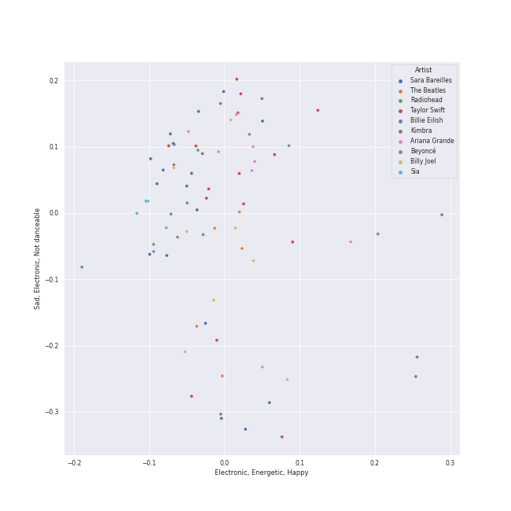
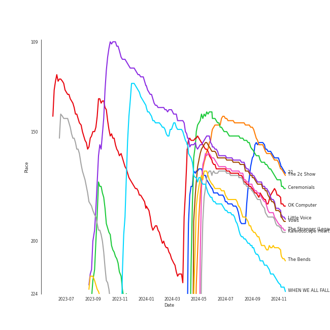
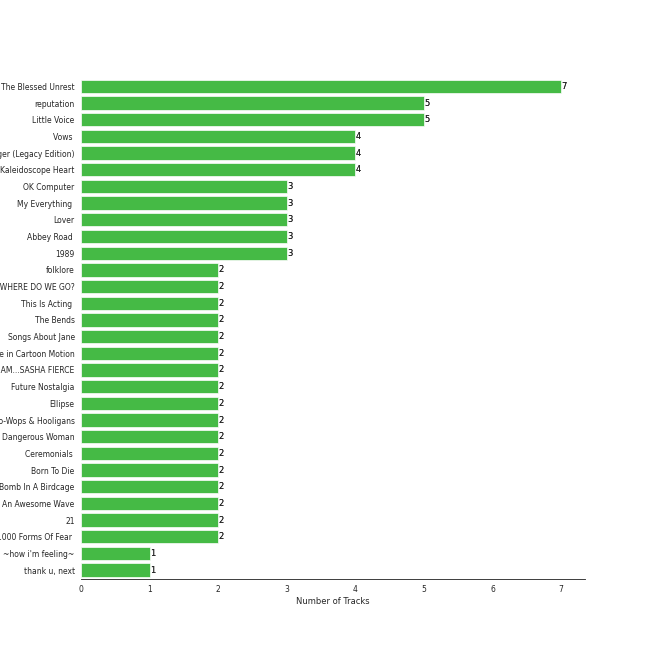
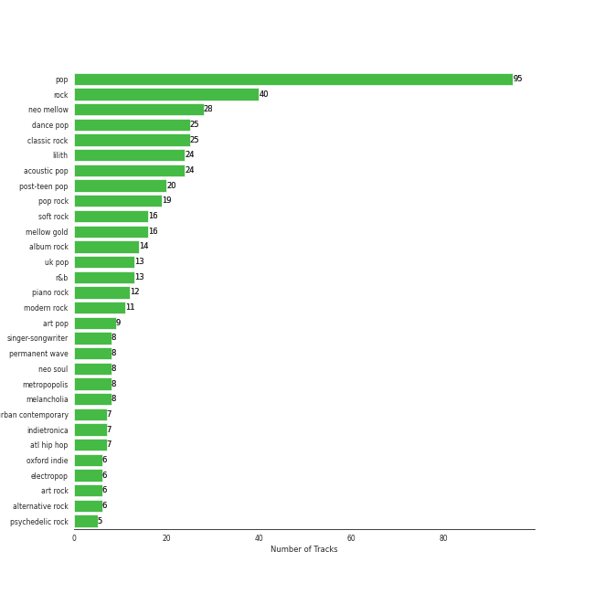
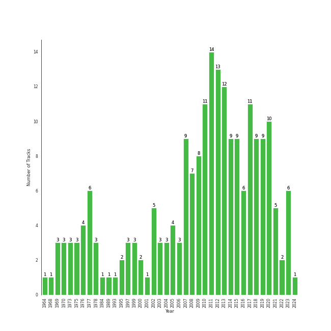

# A-Pop Favorites

[210 tracks 🔗](https://open.spotify.com/playlist/7hmRwiUOGV2mmgqXmsjqL2)

[See Track Features](audio_features.md)

[See Clusters](clusters/overview.md)

## Top Artists

| Art | Rank | Tracks | 💚 | Artist | 🔗 |
|:---|---:|---:|---:|:---|:---|
|  | 23 | 18 | 18 | [Sara Bareilles](../../artists/sara_bareilles/overview.md) | [🔗](https://open.spotify.com/artist/2Sqr0DXoaYABbjBo9HaMkM) |
|  | 20 | 15 | 15 | [Taylor Swift](../../artists/taylor_swift/overview.md) | [🔗](https://open.spotify.com/artist/06HL4z0CvFAxyc27GXpf02) |
|  | 33 | 9 | 9 | [Ariana Grande](../../artists/ariana_grande/overview.md) | [🔗](https://open.spotify.com/artist/66CXWjxzNUsdJxJ2JdwvnR) |
|  | 54 | 8 | 8 | [Billy Joel](../../artists/billy_joel/overview.md) | [🔗](https://open.spotify.com/artist/6zFYqv1mOsgBRQbae3JJ9e) |
|  | 48 | 6 | 6 | [Radiohead](../../artists/radiohead/overview.md) | [🔗](https://open.spotify.com/artist/4Z8W4fKeB5YxbusRsdQVPb) |
|  | 142 | 5 | 5 | [Beyoncé](../../artists/beyoncé/overview.md) | [🔗](https://open.spotify.com/artist/6vWDO969PvNqNYHIOW5v0m) |
|  | 64 | 5 | 5 | [The Beatles](../../artists/the_beatles/overview.md) | [🔗](https://open.spotify.com/artist/3WrFJ7ztbogyGnTHbHJFl2) |
|  | 110 | 4 | 4 | [Janelle Monáe](../../artists/janelle_monáe/overview.md) | [🔗](https://open.spotify.com/artist/6ueGR6SWhUJfvEhqkvMsVs) |
|  | 46 | 4 | 4 | [Billie Eilish](../../artists/billie_eilish/overview.md) | [🔗](https://open.spotify.com/artist/6qqNVTkY8uBg9cP3Jd7DAH) |
|  | 92 | 4 | 4 | [Kimbra](../../artists/kimbra/overview.md) | [🔗](https://open.spotify.com/artist/6hk7Yq1DU9QcCCrz9uc0Ti) |

See top 100 artists

| Art | Rank | Tracks | 💚 | Artist | 🔗 |
|:---|---:|---:|---:|:---|:---|
|  | 147 | 4 | 4 | [Sia](../../artists/sia/overview.md) | [🔗](https://open.spotify.com/artist/5WUlDfRSoLAfcVSX1WnrxN) |
|  | 91 | 4 | 4 | [Bruno Mars](../../artists/bruno_mars/overview.md) | [🔗](https://open.spotify.com/artist/0du5cEVh5yTK9QJze8zA0C) |
|  | 426 | 3 | 3 | [Imogen Heap](../../artists/imogen_heap/overview.md) | [🔗](https://open.spotify.com/artist/6Xb4ezwoAQC4516kI89nWz) |
|  | 88 | 3 | 3 | [Dua Lipa](../../artists/dua_lipa/overview.md) | [🔗](https://open.spotify.com/artist/6M2wZ9GZgrQXHCFfjv46we) |
|  | 131 | 3 | 3 | [Adele](../../artists/adele/overview.md) | [🔗](https://open.spotify.com/artist/4dpARuHxo51G3z768sgnrY) |
|  | 81 | 3 | 3 | [Florence + The Machine](../../artists/florence_+_the_machine/overview.md) | [🔗](https://open.spotify.com/artist/1moxjboGR7GNWYIMWsRjgG) |
|  | 47 | 3 | 3 | [Queen](../../artists/queen/overview.md) | [🔗](https://open.spotify.com/artist/1dfeR4HaWDbWqFHLkxsg1d) |
|  | 435 | 3 | 3 | Ellie Goulding | [🔗](https://open.spotify.com/artist/0X2BH1fck6amBIoJhDVmmJ) |
|  | 175 | 2 | 2 | Stevie Wonder | [🔗](https://open.spotify.com/artist/7guDJrEfX3qb6FEbdPA5qi) |
|  | 435 | 2 | 2 | [Simon & Garfunkel](../../artists/simon___garfunkel/overview.md) | [🔗](https://open.spotify.com/artist/70cRZdQywnSFp9pnc2WTCE) |
|  | 347 | 2 | 2 | Bebe Rexha | [🔗](https://open.spotify.com/artist/64M6ah0SkkRsnPGtGiRAbb) |
|  | 133 | 2 | 2 | [Rihanna](../../artists/rihanna/overview.md) | [🔗](https://open.spotify.com/artist/5pKCCKE2ajJHZ9KAiaK11H) |
|  | 435 | 2 | 2 | CeeLo Green | [🔗](https://open.spotify.com/artist/5nLYd9ST4Cnwy6NHaCxbj8) |
|  | 317 | 2 | 2 | A Fine Frenzy | [🔗](https://open.spotify.com/artist/5dTYaRzOn4rXGBLH052EeQ) |
|  | 203 | 2 | 2 | [Doja Cat](../../artists/doja_cat/overview.md) | [🔗](https://open.spotify.com/artist/5cj0lLjcoR7YOSnhnX0Po5) |
|  | 221 | 2 | 2 | Miley Cyrus | [🔗](https://open.spotify.com/artist/5YGY8feqx7naU7z4HrwZM6) |
|  | 435 | 2 | 2 | MIKA | [🔗](https://open.spotify.com/artist/5MmVJVhhYKQ86izuGHzJYA) |
|  | 357 | 2 | 2 | Lauv | [🔗](https://open.spotify.com/artist/5JZ7CnR6gTvEMKX4g70Amv) |
|  | 267 | 2 | 2 | [Daft Punk](../../artists/daft_punk/overview.md) | [🔗](https://open.spotify.com/artist/4tZwfgrHOc3mvqYlEYSvVi) |
|  | 264 | 2 | 2 | [Camila Cabello](../../artists/camila_cabello/overview.md) | [🔗](https://open.spotify.com/artist/4nDoRrQiYLoBzwC5BhVJzF) |
|  | 198 | 2 | 2 | [Coldplay](../../artists/coldplay/overview.md) | [🔗](https://open.spotify.com/artist/4gzpq5DPGxSnKTe4SA8HAU) |
|  | 227 | 2 | 2 | alt-J | [🔗](https://open.spotify.com/artist/3XHO7cRUPCLOr6jwp8vsx5) |
|  | 224 | 2 | 2 | Elton John | [🔗](https://open.spotify.com/artist/3PhoLpVuITZKcymswpck5b) |
|  | 200 | 2 | 2 | [Rilo Kiley](../../artists/rilo_kiley/overview.md) | [🔗](https://open.spotify.com/artist/2cevwbv7ISD92VMNLYLHZA) |
|  | 163 | 2 | 2 | [Britney Spears](../../artists/britney_spears/overview.md) | [🔗](https://open.spotify.com/artist/26dSoYclwsYLMAKD3tpOr4) |
|  | 395 | 2 | 2 | P!nk | [🔗](https://open.spotify.com/artist/1KCSPY1glIKqW2TotWuXOR) |
|  | 140 | 2 | 2 | [Lady Gaga](../../artists/lady_gaga/overview.md) | [🔗](https://open.spotify.com/artist/1HY2Jd0NmPuamShAr6KMms) |
|  | 435 | 2 | 2 | Fleetwood Mac | [🔗](https://open.spotify.com/artist/08GQAI4eElDnROBrJRGE0X) |
|  | 114 | 2 | 2 | [Maroon 5](../../artists/maroon_5/overview.md) | [🔗](https://open.spotify.com/artist/04gDigrS5kc9YWfZHwBETP) |
|  | 120 | 2 | 2 | [Lana Del Rey](../../artists/lana_del_rey/overview.md) | [🔗](https://open.spotify.com/artist/00FQb4jTyendYWaN8pK0wa) |
|  | 205 | 1 | 1 | SZA | [🔗](https://open.spotify.com/artist/7tYKF4w9nC0nq9CsPZTHyP) |
|  | 435 | 1 | 1 | Lil Nas X | [🔗](https://open.spotify.com/artist/7jVv8c5Fj3E9VhNjxT4snq) |
|  | 435 | 1 | 1 | Aerosmith | [🔗](https://open.spotify.com/artist/7Ey4PD4MYsKc5I2dolUwbH) |
|  | 157 | 1 | 1 | Paramore | [🔗](https://open.spotify.com/artist/74XFHRwlV6OrjEM0A2NCMF) |
|  | 435 | 1 | 1 | Jon McLaughlin | [🔗](https://open.spotify.com/artist/6z29S0IoiBJpSMP8plyCj7) |
|  | 306 | 1 | 1 | The Pussycat Dolls | [🔗](https://open.spotify.com/artist/6wPhSqRtPu1UhRCDX5yaDJ) |
|  | 435 | 1 | 1 | Blu Cantrell | [🔗](https://open.spotify.com/artist/6vytZ677lz4LzCrUDcDokM) |
|  | 435 | 1 | 1 | Commodores | [🔗](https://open.spotify.com/artist/6twIAGnYuIT1pncMAsXnEm) |
|  | 435 | 1 | 1 | Aslyn | [🔗](https://open.spotify.com/artist/6seR0G84QQq1NIW844E7Qq) |
|  | 435 | 1 | 1 | Katy Perry | [🔗](https://open.spotify.com/artist/6jJ0s89eD6GaHleKKya26X) |
|  | 435 | 1 | 1 | Saweetie | [🔗](https://open.spotify.com/artist/6cK3NBO6uP7hh0oyuVELFl) |
|  | 435 | 1 | 1 | mgk | [🔗](https://open.spotify.com/artist/6TIYQ3jFPwQSRmorSezPxX) |
|  | 435 | 1 | 1 | Demi Lovato | [🔗](https://open.spotify.com/artist/6S2OmqARrzebs0tKUEyXyp) |
|  | 410 | 1 | 1 | Amy Winehouse | [🔗](https://open.spotify.com/artist/6Q192DXotxtaysaqNPy5yR) |
|  | 435 | 1 | 1 | Silk Sonic | [🔗](https://open.spotify.com/artist/6PvvGcCY2XtUcSRld1Wilr) |
|  | 435 | 1 | 1 | [Clean Bandit](../../artists/clean_bandit/overview.md) | [🔗](https://open.spotify.com/artist/6MDME20pz9RveH9rEXvrOM) |
|  | 435 | 1 | 1 | Khalid | [🔗](https://open.spotify.com/artist/6LuN9FCkKOj5PcnpouEgny) |
|  | 435 | 1 | 1 | Harry Styles | [🔗](https://open.spotify.com/artist/6KImCVD70vtIoJWnq6nGn3) |
|  | 307 | 1 | 1 | The Civil Wars | [🔗](https://open.spotify.com/artist/6J7rw7NELJUCThPbAfyLIE) |
|  | 249 | 1 | 1 | Santana | [🔗](https://open.spotify.com/artist/6GI52t8N5F02MxU0g5U69P) |
|  | 435 | 1 | 1 | Vince Staples | [🔗](https://open.spotify.com/artist/68kEuyFKyqrdQQLLsmiatm) |
|  | 435 | 1 | 1 | Ella Eyre | [🔗](https://open.spotify.com/artist/66TrUkUZ3RM29dqeDQRgyA) |
|  | 387 | 1 | 1 | Connor Price | [🔗](https://open.spotify.com/artist/5zixe6AbgXPqt4c1uSl94L) |
|  | 197 | 1 | 1 | Iggy Azalea | [🔗](https://open.spotify.com/artist/5yG7ZAZafVaAlMTeBybKAL) |
|  | 435 | 1 | 1 | John Legend | [🔗](https://open.spotify.com/artist/5y2Xq6xcjJb2jVM54GHK3t) |
|  | 245 | 1 | 1 | Backstreet Boys | [🔗](https://open.spotify.com/artist/5rSXSAkZ67PYJSvpUpkOr7) |
|  | 435 | 1 | 1 | Gary Jules | [🔗](https://open.spotify.com/artist/5oRnbmgqvvq7fVlgk4vcEa) |
|  | 435 | 1 | 1 | B.o.B | [🔗](https://open.spotify.com/artist/5ndkK3dpZLKtBklKjxNQwT) |
|  | 302 | 1 | 1 | Andrew Joslyn | [🔗](https://open.spotify.com/artist/5dSCgfYs71v0zjg2AwUq9n) |
|  | 185 | 1 | 1 | Prince | [🔗](https://open.spotify.com/artist/5a2EaR3hamoenG9rDuVn8j) |
|  | 435 | 1 | 1 | Gnarls Barkley | [🔗](https://open.spotify.com/artist/5SbkVQYYzlw1kte75QIabH) |
|  | 435 | 1 | 1 | 5 Seconds of Summer | [🔗](https://open.spotify.com/artist/5Rl15oVamLq7FbSb0NNBNy) |
|  | 393 | 1 | 1 | Imagine Dragons | [🔗](https://open.spotify.com/artist/53XhwfbYqKCa1cC15pYq2q) |
|  | 435 | 1 | 1 | Young Thug | [🔗](https://open.spotify.com/artist/50co4Is1HCEo8bhOyUWKpn) |
|  | 322 | 1 | 1 | Jem | [🔗](https://open.spotify.com/artist/4v4xuH9VypORYabMnhPLt1) |
|  | 274 | 1 | 1 | DaBaby | [🔗](https://open.spotify.com/artist/4r63FhuTkUYltbVAg5TQnk) |
|  | 435 | 1 | 1 | Young the Giant | [🔗](https://open.spotify.com/artist/4j56EQDQu5XnL7R3E9iFJT) |
|  | 346 | 1 | 1 | Travis Barker | [🔗](https://open.spotify.com/artist/4exLIFE8sISLr28sqG1qNX) |
|  | 435 | 1 | 1 | Marc Broussard | [🔗](https://open.spotify.com/artist/4cEwEednPwWCdYT7ZhROZe) |
|  | 321 | 1 | 1 | Jidenna | [🔗](https://open.spotify.com/artist/4TsHKU8l8Wq7n7OPVikirn) |
|  | 403 | 1 | 1 | Bon Iver | [🔗](https://open.spotify.com/artist/4LEiUm1SRbFMgfqnQTwUbQ) |
|  | 435 | 1 | 1 | Caro Emerald | [🔗](https://open.spotify.com/artist/492hDmhPyuIjP3MgTcIqgm) |
|  | 435 | 1 | 1 | Regina Spektor | [🔗](https://open.spotify.com/artist/3z6Gk257P9jNcZbBXJNX5i) |
|  | 316 | 1 | 1 | Huxlee | [🔗](https://open.spotify.com/artist/3yb7HrGPG0WpWgdO4XFwBf) |
|  | 118 | 1 | 1 | [Sammy Rae & The Friends](../../artists/sammy_rae___the_friends/overview.md) | [🔗](https://open.spotify.com/artist/3lFDsTyYNPQc8WzJExnQWn) |
|  | 435 | 1 | 1 | Anderson .Paak | [🔗](https://open.spotify.com/artist/3jK9MiCrA42lLAdMGUZpwa) |
|  | 406 | 1 | 1 | Chicago | [🔗](https://open.spotify.com/artist/3iDD7bnsjL9J4fO298r0L0) |
|  | 244 | 1 | 1 | Little Mix | [🔗](https://open.spotify.com/artist/3e7awlrlDSwF3iM0WBjGMp) |
|  | 435 | 1 | 1 | Nickel Creek | [🔗](https://open.spotify.com/artist/3bcLBxvaI7GsBzGp3WHnwQ) |
|  | 435 | 1 | 1 | Rob Thomas | [🔗](https://open.spotify.com/artist/3aBkeBhwadnWMWoVJ2CxJC) |
|  | 435 | 1 | 1 | Twenty One Pilots | [🔗](https://open.spotify.com/artist/3YQKmKGau1PzlVlkL1iodx) |
|  | 130 | 1 | 1 | Kim Petras | [🔗](https://open.spotify.com/artist/3Xt3RrJMFv5SZkCfUE8C1J) |
|  | 435 | 1 | 1 | Troye Sivan | [🔗](https://open.spotify.com/artist/3WGpXCj9YhhfX11TToZcXP) |
|  | 388 | 1 | 1 | Haviah Mighty | [🔗](https://open.spotify.com/artist/3UROQ34SGxV7h71Z3Gqp8u) |
|  | 329 | 1 | 1 | Tyla | [🔗](https://open.spotify.com/artist/3SozjO3Lat463tQICI9LcE) |
|  | 435 | 1 | 1 | Sean Paul | [🔗](https://open.spotify.com/artist/3Isy6kedDrgPYoTS1dazA9) |
|  | 435 | 1 | 1 | Will Jordan | [🔗](https://open.spotify.com/artist/3Is3ehDoBlnTKQtCHdEvpd) |
|  | 435 | 1 | 1 | Frankie Valli | [🔗](https://open.spotify.com/artist/3CDKmzJu6uwEGnPLLZffpD) |
|  | 433 | 1 | 1 | The Script | [🔗](https://open.spotify.com/artist/3AQRLZ9PuTAozP28Skbq8V) |
|  | 351 | 1 | 1 | Caravan Palace | [🔗](https://open.spotify.com/artist/37J1PlAkhRK7yrZUtqaUpQ) |

## Top Tracks

Most and least listened tracks

| Rank | ​ | Most listened tracks | Rank | ​​ | Least listened tracks |
|---:|:---|:---|---:|:---|:---|
| 225 |  | [Take It All](../../artists/adele/overview.md) | 1018 |  | Love Sex Magic (feat. Justin Timberlake) |
| 227 |  | Honeybee | 1018 |  | [&burn (with Vince Staples)](../../artists/billie_eilish/overview.md) |
| 248 |  | [Never Let Me Go](../../artists/florence_+_the_machine/overview.md) | 1018 |  | [Two Way Street](../../artists/kimbra/overview.md) |
| 268 |  | [Settle Down](../../artists/kimbra/overview.md) | 1018 |  | [Hide and Seek](../../artists/imogen_heap/overview.md) |
| 279 |  | [Paranoid Android](../../artists/radiohead/overview.md) | 1018 |  | [Don't Stop Me Now - Remastered 2011](../../artists/queen/overview.md) |
| 287 |  | [Machine Gun](../../artists/sara_bareilles/overview.md) | 1018 |  | [Uncharted](../../artists/sara_bareilles/overview.md) |
| 302 |  | [Fake Plastic Trees](../../artists/radiohead/overview.md) | 1018 |  | Grace Kelly |
| 331 |  | [Vienna](../../artists/billy_joel/overview.md) | 1018 |  | [Once Upon Another Time](../../artists/sara_bareilles/overview.md) |
| 335 |  | [Bohemian Rhapsody - Remastered 2011](../../artists/queen/overview.md) | 1018 |  | Lights |
| 349 |  | [Talk It Up](../../artists/sammy_rae___the_friends/overview.md) | 1018 |  | Fitzpleasure |

## Top Albums

| Art | Rank | Tracks | 💚 | Album | Release Date | 🔗 |
|:---|---:|---:|---:|:---|:---|:---|
|  | 282 | 7 | 7 | The Blessed Unrest | 2013-07-16 | [🔗](https://open.spotify.com/album/7lpbyGc4fHsQkBTsfWVBhp) |
|  | 345 | 5 | 5 | reputation | 2017-11-10 | [🔗](https://open.spotify.com/album/6DEjYFkNZh67HP7R9PSZvv) |
|  | 190 | 5 | 5 | Little Voice | 2007-07-03 | [🔗](https://open.spotify.com/album/2Z9WUERfMjOgQ6ze9TcGbF) |
|  | 191 | 4 | 4 | Vows (Deluxe Version) | 2011 | [🔗](https://open.spotify.com/album/6V9rvW05Um5bIHePPfeI8p) |
|  | 195 | 4 | 4 | The Stranger (Legacy Edition) | 1977 | [🔗](https://open.spotify.com/album/1Mhn9VosyjtWn4dMPFlna6) |
|  | 196 | 4 | 4 | Kaleidoscope Heart | 2010-09-07 | [🔗](https://open.spotify.com/album/627ukPRwYxyBREHxBq0vGJ) |
|  | 184 | 3 | 3 | OK Computer | 1997-05-28 | [🔗](https://open.spotify.com/album/6dVIqQ8qmQ5GBnJ9shOYGE) |
|  | 250 | 3 | 3 | My Everything (Deluxe) | 2014-08-22 | [🔗](https://open.spotify.com/album/6EVYTRG1drKdO8OnIQBeEj) |
|  | 602 | 3 | 3 | Lover | 2019-08-23 | [🔗](https://open.spotify.com/album/1NAmidJlEaVgA3MpcPFYGq) |
|  | 302 | 3 | 3 | Abbey Road (Remastered) | 1969-09-26 | [🔗](https://open.spotify.com/album/0ETFjACtuP2ADo6LFhL6HN) |

See top 100 albums

| Art | Rank | Tracks | 💚 | Album | Release Date | 🔗 |
|:---|---:|---:|---:|:---|:---|:---|
|  | 667 | 3 | 3 | 1989 | 2014-10-27 | [🔗](https://open.spotify.com/album/2QJmrSgbdM35R67eoGQo4j) |
|  | 610 | 2 | 2 | folklore | 2020-07-24 | [🔗](https://open.spotify.com/album/2fenSS68JI1h4Fo296JfGr) |
|  | 223 | 2 | 2 | WHEN WE ALL FALL ASLEEP, WHERE DO WE GO? | 2019-03-29 | [🔗](https://open.spotify.com/album/0S0KGZnfBGSIssfF54WSJh) |
|  | 667 | 2 | 2 | This Is Acting (Deluxe Version) | 2016-10-21 | [🔗](https://open.spotify.com/album/2eV6DIPDnGl1idcjww6xyX) |
|  | 209 | 2 | 2 | The Bends | 1995-03-13 | [🔗](https://open.spotify.com/album/35UJLpClj5EDrhpNIi4DFg) |
|  | 667 | 2 | 2 | Songs About Jane | 2002-06-25 | [🔗](https://open.spotify.com/album/1Rv9WRKyYhFaGbuYDaQunN) |
|  | 667 | 2 | 2 | Life in Cartoon Motion | 2007-02-05 | [🔗](https://open.spotify.com/album/4wKkXYJXQWDa9sndBSx0gI) |
|  | 667 | 2 | 2 | I AM...SASHA FIERCE | 2008-11-14 | [🔗](https://open.spotify.com/album/23Y5wdyP5byMFktZf8AcWU) |
|  | 667 | 2 | 2 | Future Nostalgia | 2020-03-27 | [🔗](https://open.spotify.com/album/5lKlFlReHOLShQKyRv6AL9) |
|  | 642 | 2 | 2 | Ellipse | 2009-08-25 | [🔗](https://open.spotify.com/album/5AYKGPzPBJNHeKehCxMaq0) |
|  | 623 | 2 | 2 | Doo-Wops & Hooligans | 2010-05-11 | [🔗](https://open.spotify.com/album/1uyf3l2d4XYwiEqAb7t7fX) |
|  | 382 | 2 | 2 | Dangerous Woman | 2016-05-20 | [🔗](https://open.spotify.com/album/3pdKKSqqLVIKmRTGw0x2N7) |
|  | 176 | 2 | 2 | Ceremonials (Deluxe Edition) | 2011-01-01 | [🔗](https://open.spotify.com/album/5SxudoALxEAVh9l83kSebx) |
|  | 279 | 2 | 2 | Born To Die | 2012-01-30 | [🔗](https://open.spotify.com/album/4X8hAqIWpQyQks2yRhyqs4) |
|  | 425 | 2 | 2 | Bomb In A Birdcage | 2009-01-01 | [🔗](https://open.spotify.com/album/07IV5RxLvAUeZbcPm4zOzn) |
|  | 301 | 2 | 2 | An Awesome Wave | 2012-09-18 | [🔗](https://open.spotify.com/album/6k3vC8nep1BfqAIJ81L6OL) |
|  | 169 | 2 | 2 | 21 | 2011-01-24 | [🔗](https://open.spotify.com/album/0Lg1uZvI312TPqxNWShFXL) |
|  | 667 | 2 | 2 | 1000 Forms Of Fear (Deluxe Version) | 2015-05-04 | [🔗](https://open.spotify.com/album/6FdNvoO5sF4EKwCX9je1MH) |
|  | 505 | 1 | 1 | ~how i'm feeling~ | 2020-03-06 | [🔗](https://open.spotify.com/album/3ZuE680xhR1A4bCFGvL8mi) |
|  | 512 | 1 | 1 | thank u, next | 2019-02-08 | [🔗](https://open.spotify.com/album/2fYhqwDWXjbpjaIJPEfKFw) |
|  | 667 | 1 | 1 | lovely (with Khalid) | 2018-04-19 | [🔗](https://open.spotify.com/album/2sBB17RXTamvj7Ncps15AK) |
|  | 667 | 1 | 1 | evermore | 2020-12-11 | [🔗](https://open.spotify.com/album/2Xoteh7uEpea4TohMxjtaq) |
|  | 489 | 1 | 1 | eternal sunshine | 2024-03-08 | [🔗](https://open.spotify.com/album/5EYKrEDnKhhcNxGedaRQeK) |
|  | 667 | 1 | 1 | bloom | 2017-05-12 | [🔗](https://open.spotify.com/album/3yWRq9Dd2UO5xyqxTjLDmp) |
|  | 484 | 1 | 1 | Yours Truly | 2013-01-01 | [🔗](https://open.spotify.com/album/5xSvNPstcxHtR4ap2vvN8A) |
|  | 667 | 1 | 1 | Youngblood (Deluxe) | 2018-06-15 | [🔗](https://open.spotify.com/album/2D0Hi3Jj6RFnpWDcSa0Otu) |
|  | 667 | 1 | 1 | Young The Giant (Special Edition) | 2011 | [🔗](https://open.spotify.com/album/2ww7MYrkExsljnKhcINDse) |
|  | 429 | 1 | 1 | Yoga | 2015-03-31 | [🔗](https://open.spotify.com/album/5rzxGeVyCV74SvV5hjLRAU) |
|  | 667 | 1 | 1 | Yellow Flicker Beat (From The Hunger Games: Mockingjay Part 1) | 2014-09-30 | [🔗](https://open.spotify.com/album/7sg5iqMiDrM2aJqLAmv83V) |
|  | 667 | 1 | 1 | What Is Love? (Deluxe Edition) | 2018-11-30 | [🔗](https://open.spotify.com/album/1MvF4ulZKH7SaDQs9rE5nc) |
|  | 667 | 1 | 1 | Wednesday Morning, 3 A.M. | 1964-10-19 | [🔗](https://open.spotify.com/album/5pnJrocLlZ3FWEbcr2PTz0) |
|  | 667 | 1 | 1 | Water | 2023-07-28 | [🔗](https://open.spotify.com/album/22sXXkKgjEuawIFL1e1tRw) |
|  | 667 | 1 | 1 | Village | 2018-11-02 | [🔗](https://open.spotify.com/album/2KxC2M0bVm5hrK3GgGMuV9) |
|  | 519 | 1 | 1 | Unorthodox Jukebox | 2012-12-07 | [🔗](https://open.spotify.com/album/58ufpQsJ1DS5kq4hhzQDiI) |
|  | 667 | 1 | 1 | Unholy (feat. Kim Petras) | 2022-09-22 | [🔗](https://open.spotify.com/album/0gX9tkL5njRax8ymWcXARi) |
|  | 253 | 1 | 1 | Under The Blacklight (Standard Version) | 2007-08-20 | [🔗](https://open.spotify.com/album/2f9RsTZpsYMLRVZBtW7En8) |
|  | 667 | 1 | 1 | Turnstiles | 1976-05-19 | [🔗](https://open.spotify.com/album/7GiLfxL1su3MSqz7pmKMZi) |
|  | 585 | 1 | 1 | Trendsetter | 2023-11-03 | [🔗](https://open.spotify.com/album/1Hxam85Bhf98cIkMRKX9QA) |
|  | 667 | 1 | 1 | Trading Snakeoil for Wolftickets | 2001-01-01 | [🔗](https://open.spotify.com/album/1OydCrx4m7fguwcX4stR9z) |
|  | 667 | 1 | 1 | The Very Best of Frankie Valli & The 4 Seasons | 2003-01-14 | [🔗](https://open.spotify.com/album/0NUEQILaBzavnzcMEs4buZ) |
|  | 667 | 1 | 1 | The Truth About Love | 2012-09-18 | [🔗](https://open.spotify.com/album/2Q9oTK48eb85waX1fFJsvj) |
|  | 657 | 1 | 1 | The Script | 2008-07-14 | [🔗](https://open.spotify.com/album/1r5J0N6Ep181K0i8YuTYgO) |
|  | 667 | 1 | 1 | The Prelude | 2020-07-17 | [🔗](https://open.spotify.com/album/3Qj2vsFzmaB8jcH6Q60WIG) |
|  | 667 | 1 | 1 | The Lady Killer | 2010-11-09 | [🔗](https://open.spotify.com/album/3MXU6UoWrf4w4bOvjZTlvY) |
|  | 249 | 1 | 1 | The Good Life | 2018-07-10 | [🔗](https://open.spotify.com/album/4s1igjt5YJe7s7BdCeX3DX) |
|  | 667 | 1 | 1 | The Fame Monster (Deluxe Edition) | 2009-11-05 | [🔗](https://open.spotify.com/album/6rePArBMb5nLWEaY9aQqL4) |
|  | 555 | 1 | 1 | The Definitive Collection | 2002-10-29 | [🔗](https://open.spotify.com/album/4E1itnJOhTMRSATNaxh0Sq) |
|  | 667 | 1 | 1 | The Beatles (Remastered) | 1968-11-22 | [🔗](https://open.spotify.com/album/1klALx0u4AavZNEvC4LrTL) |
|  | 667 | 1 | 1 | The ArchAndroid | 2010-05-17 | [🔗](https://open.spotify.com/album/7MvSB0JTdtl1pSwZcgvYQX) |
|  | 170 | 1 | 1 | The 2¢ Show | 2012-05-23 | [🔗](https://open.spotify.com/album/4DECRyKlhKJgjZLLuvfAI6) |
|  | 667 | 1 | 1 | Teenage Dream | 2010-01-01 | [🔗](https://open.spotify.com/album/3BoUxfC7YhxNq3TpOfnRif) |
|  | 667 | 1 | 1 | Talk Dirty | 2013-09-10 | [🔗](https://open.spotify.com/album/4PeZu0It7qVrTG40t3HM9A) |
|  | 667 | 1 | 1 | Sway With Me (with GALXARA) | 2020-01-31 | [🔗](https://open.spotify.com/album/5uC0YWUVDKRZD9x1cRgjyu) |
|  | 667 | 1 | 1 | Supernatural (Remastered) | 1999-06-15 | [🔗](https://open.spotify.com/album/10aiDpdFGyfCFEcqpx6XTq) |
|  | 423 | 1 | 1 | SuperRock (All Folked Up) | 2017-07-19 | [🔗](https://open.spotify.com/album/4PEc1CBBlhpGzswmWjLyFK) |
|  | 667 | 1 | 1 | Storm Front | 1989-10-17 | [🔗](https://open.spotify.com/album/1Vw2uoVkLAJFVViJ1QyK1D) |
|  | 667 | 1 | 1 | St. Elsewhere | 2006-05-02 | [🔗](https://open.spotify.com/album/7p2aWivr9OLXocSTTKtG9B) |
|  | 667 | 1 | 1 | Speak for Yourself | 2005-07-18 | [🔗](https://open.spotify.com/album/0t0Cr8jA63wlm8nWj7qfvJ) |
|  | 667 | 1 | 1 | Songs In The Key Of Life | 1976-09-28 | [🔗](https://open.spotify.com/album/6YUCc2RiXcEKS9ibuZxjt0) |
|  | 667 | 1 | 1 | Slow Grenade | 2020-06-30 | [🔗](https://open.spotify.com/album/15Zgvxqql6EPHE3NJlUt0R) |
|  | 667 | 1 | 1 | Skyfall | 2012-10-04 | [🔗](https://open.spotify.com/album/6TwN6Lq9glwnG8kNp6chHY) |
|  | 258 | 1 | 1 | SOS | 2022-12-09 | [🔗](https://open.spotify.com/album/07w0rG5TETcyihsEIZR3qG) |
|  | 667 | 1 | 1 | Rumours (Super Deluxe) | 1977-02-04 | [🔗](https://open.spotify.com/album/0BwWUstDMUbgq2NYONRqlu) |
|  | 270 | 1 | 1 | Riot! | 2007-06-11 | [🔗](https://open.spotify.com/album/71rziY9eLo1tA2dBMxrwhc) |
|  | 634 | 1 | 1 | Red | 2012-10-22 | [🔗](https://open.spotify.com/album/1EoDsNmgTLtmwe1BDAVxV5) |
|  | 667 | 1 | 1 | Raymond v Raymond (Expanded Edition) | 2010-03-30 | [🔗](https://open.spotify.com/album/6A1F3Fkq5dYeYYNkXflcTX) |
|  | 346 | 1 | 1 | Random Access Memories | 2013-05-20 | [🔗](https://open.spotify.com/album/4m2880jivSbbyEGAKfITCa) |
|  | 667 | 1 | 1 | Purple Rain | 1984-06-25 | [🔗](https://open.spotify.com/album/7nXJ5k4XgRj5OLg9m8V3zc) |
|  | 524 | 1 | 1 | Picture Show | 2012-01-01 | [🔗](https://open.spotify.com/album/0uRFz92JmjwDbZbB7hEBIr) |
|  | 637 | 1 | 1 | Piano Man (Legacy Edition) | 1973-11-07 | [🔗](https://open.spotify.com/album/69wjSAZXZiD2EBia3b3gxL) |
|  | 667 | 1 | 1 | Parachutes | 2000-07-10 | [🔗](https://open.spotify.com/album/6ZG5lRT77aJ3btmArcykra) |
|  | 667 | 1 | 1 | Paint The Town Red | 2023-08-04 | [🔗](https://open.spotify.com/album/54dZypaXHAIDzBe9ujAZ63) |
|  | 442 | 1 | 1 | Pablo Honey | 1993-02-22 | [🔗](https://open.spotify.com/album/3gBVdu4a1MMJVMy6vwPEb8) |
|  | 612 | 1 | 1 | PCD | 2005-01-01 | [🔗](https://open.spotify.com/album/5x8e8UcCeOgrOzSnDGuPye) |
|  | 349 | 1 | 1 | Once Upon Another Time | 2012-05-22 | [🔗](https://open.spotify.com/album/1PrqYZJRzGNf8AsSOraxnZ) |
|  | 667 | 1 | 1 | OK Now | 2008-01-01 | [🔗](https://open.spotify.com/album/3fKJJQFV6a61fnKYDDj2LU) |
|  | 589 | 1 | 1 | Night Visions | 2012-09-04 | [🔗](https://open.spotify.com/album/6htgf3qv7vGcsdxLCDxKp8) |
|  | 667 | 1 | 1 | Nickel Creek | 2000 | [🔗](https://open.spotify.com/album/5SGG7graQOU3OnK3cZZCNd) |
|  | 667 | 1 | 1 | Music From The Motion Picture Cadillac Records | 2008-11-28 | [🔗](https://open.spotify.com/album/4b2zuwf7CPesdiTg1kFDjU) |
|  | 667 | 1 | 1 | More Adventurous (U.S. Release) | 2004-07-27 | [🔗](https://open.spotify.com/album/4n36X2GMJ84BKh9D9zMRVI) |
|  | 310 | 1 | 1 | Millennium | 1999-05-18 | [🔗](https://open.spotify.com/album/5ySxm9hxBNss01WCL7GLyQ) |
|  | 500 | 1 | 1 | Metropolis: The Chase Suite (Special Edition) | 2008-08-12 | [🔗](https://open.spotify.com/album/3T3bJi3cvwR5U7ihwgEwF1) |
|  | 667 | 1 | 1 | MONTERO (Call Me By Your Name) | 2021-03-31 | [🔗](https://open.spotify.com/album/2Hjcfw8zHN4dJDZJGOzLd6) |
|  | 667 | 1 | 1 | Lungs (Deluxe Edition) | 2009 | [🔗](https://open.spotify.com/album/2FgknX5e7fJlriQtxvpLhZ) |
|  | 667 | 1 | 1 | Love In The Future (Expanded Edition) | 2013-08-30 | [🔗](https://open.spotify.com/album/4OTAx9un4e6NfoHuVRiOrC) |
|  | 667 | 1 | 1 | Lose Control | 2023-06-23 | [🔗](https://open.spotify.com/album/5QMiub2LonMqxB7dhtbPlX) |
|  | 667 | 1 | 1 | Lights | 2011-01-01 | [🔗](https://open.spotify.com/album/3duZhvcaoqdNveQYXf9dMV) |
|  | 299 | 1 | 1 | Let The Road | 2014-01-01 | [🔗](https://open.spotify.com/album/02ae5i5UAoFrt2peVox9Xd) |
|  | 667 | 1 | 1 | Let It Be (Remastered) | 1970-05-08 | [🔗](https://open.spotify.com/album/0jTGHV5xqHPvEcwL8f6YU5) |
|  | 667 | 1 | 1 | Lemonade | 2016-04-23 | [🔗](https://open.spotify.com/album/7dK54iZuOxXFarGhXwEXfF) |

## Top Record Labels

| Tracks | 💚 | Label |
|---:|---:|:---|
| 25 | 25 | [Columbia](../../labels/columbia/overview.md) |
| 23 | 23 | [Epic](../../labels/epic/overview.md) |
| 16 | 16 | [Warner Records](../../labels/warner_records/overview.md) |
| 12 | 12 | [RCA Records Label](../../labels/rca_records_label/overview.md) |
| 9 | 9 | [XL Recordings](../../labels/xl_recordings/overview.md) |
| 9 | 9 | [Interscope Records](../../labels/interscope_records/overview.md) |
| 9 | 9 | [Big Machine Records](../../labels/big_machine_records/overview.md) |
| 8 | 8 | [Universal Music LLC](../../labels/universal_music_llc/overview.md) |
| 8 | 8 | [Legacy](../../labels/legacy/overview.md) |
| 6 | 6 | [Taylor Swift](../../labels/taylor_swift/overview.md) |

See all 92 labels

| Tracks | 💚 | Label |
|---:|---:|:---|
| 6 | 6 | [Atlantic Records](../../labels/atlantic_records/overview.md) |
| 5 | 5 | [EMI Catalogue](../../labels/emi_catalogue/overview.md) |
| 4 | 4 | [Universal-Island Records Ltd.](../../labels/universal-island_records_ltd_/overview.md) |
| 4 | 4 | [Rhino](../../labels/rhino/overview.md) |
| 4 | 4 | [Polydor Records](../../labels/polydor_records/overview.md) |
| 4 | 4 | [Monkey Puzzle](../../labels/monkey_puzzle/overview.md) |
| 4 | 4 | [Hollywood Records](../../labels/hollywood_records/overview.md) |
| 4 | 4 | [Darkroom](../../labels/darkroom/overview.md) |
| 4 | 4 | [Bad Boy](../../labels/bad_boy/overview.md) |
| 3 | 3 | [Virgin Records](../../labels/virgin_records/overview.md) |
| 3 | 3 | [Republic Records](../../labels/republic_records/overview.md) |
| 3 | 3 | Music World Music |
| 3 | 3 | [MOTOWN](../../labels/motown/overview.md) |
| 3 | 3 | [Jive](../../labels/jive/overview.md) |
| 3 | 3 | [Capitol Records](../../labels/capitol_records/overview.md) |
| 3 | 3 | ATL |
| 2 | 2 | Wondaland |
| 2 | 2 | [UNI](../../labels/uni/overview.md) |
| 2 | 2 | [UMC (Universal Music Catalogue)](../../labels/umc_(universal_music_catalogue)/overview.md) |
| 2 | 2 | [Syco Music](../../labels/syco_music/overview.md) |
| 2 | 2 | [Parkwood Entertainment](../../labels/parkwood_entertainment/overview.md) |
| 2 | 2 | LaFace Records |
| 2 | 2 | Island UK |
| 2 | 2 | [Fueled By Ramen](../../labels/fueled_by_ramen/overview.md) |
| 2 | 2 | Casablanca Records |
| 2 | 2 | Canvasback |
| 2 | 2 | Atlantic Records UK |
| 1 | 1 | sensibility recordings |
| 1 | 1 | UMGRI Interscope |
| 1 | 1 | Top Dawg Entertainment |
| 1 | 1 | Superpop.Co |
| 1 | 1 | Sugar Hill Records |
| 1 | 1 | Steam Powered Giraffe |
| 1 | 1 | Sony BMG Music UK |
| 1 | 1 | Sire |
| 1 | 1 | Silent Records |
| 1 | 1 | Roc Nation |
| 1 | 1 | Roadrunner Records |
| 1 | 1 | Rihanna |
| 1 | 1 | Radiculture |
| 1 | 1 | RBMG |
| 1 | 1 | Pussycat Dolls |
| 1 | 1 | Phonogenic |
| 1 | 1 | [Parlophone UK](../../labels/parlophone_uk/overview.md) |
| 1 | 1 | Parlophone Records Limited |
| 1 | 1 | Olivia Rodrigo PS |
| 1 | 1 | Nu America Music |
| 1 | 1 | [Nettwerk Music Group](../../labels/nettwerk_music_group/overview.md) |
| 1 | 1 | Mockingjay |
| 1 | 1 | Metric Music International |
| 1 | 1 | Mercury Records |
| 1 | 1 | Lux Finite Music |
| 1 | 1 | Le Plan Recordings |
| 1 | 1 | Lauv |
| 1 | 1 | Kid Ina Korner |
| 1 | 1 | Kemosabe Records |
| 1 | 1 | [Island Records](../../labels/island_records/overview.md) |
| 1 | 1 | Island Def Jam |
| 1 | 1 | Hunger Games 3 |
| 1 | 1 | Grandmono Records |
| 1 | 1 | Giant Little Man |
| 1 | 1 | G.O.O.D. Music |
| 1 | 1 | FSF |
| 1 | 1 | FAX Records |
| 1 | 1 | Elektra |
| 1 | 1 | EMI Recorded Music Australia Pty Ltd |
| 1 | 1 | [EMI](../../labels/emi/overview.md) |
| 1 | 1 | Downtown Recordings |
| 1 | 1 | Down Up Down Music |
| 1 | 1 | [Def Jam Recordings](../../labels/def_jam_recordings/overview.md) |
| 1 | 1 | Def Jam |
| 1 | 1 | Daft Life Ltd. |
| 1 | 1 | Concord Records |
| 1 | 1 | Capitol Records UK |
| 1 | 1 | Brute |
| 1 | 1 | Beluga Heights |
| 1 | 1 | Beaute |
| 1 | 1 | Arista |
| 1 | 1 | Aftermath Entertainment |
| 1 | 1 | ATO Records |
| 1 | 1 | ADA France |
| 1 | 1 | 4 of clubs LLC |

## Genres

| Tracks | 💚 | Genre |
|---:|---:|:---|
| 95 | 95 | [pop](../../genres/pop/overview.md) |
| 40 | 40 | [rock](../../genres/rock/overview.md) |
| 28 | 28 | [neo mellow](../../genres/neo_mellow/overview.md) |
| 25 | 25 | [dance pop](../../genres/dance_pop/overview.md) |
| 25 | 25 | [classic rock](../../genres/classic_rock/overview.md) |
| 24 | 24 | [lilith](../../genres/lilith/overview.md) |
| 24 | 24 | [acoustic pop](../../genres/acoustic_pop/overview.md) |
| 20 | 20 | [post-teen pop](../../genres/post-teen_pop/overview.md) |
| 19 | 19 | [pop rock](../../genres/pop_rock/overview.md) |
| 16 | 16 | [soft rock](../../genres/soft_rock/overview.md) |

See top 100 genres

| Tracks | 💚 | Genre |
|---:|---:|:---|
| 16 | 16 | [mellow gold](../../genres/mellow_gold/overview.md) |
| 14 | 14 | [album rock](../../genres/album_rock/overview.md) |
| 13 | 13 | [uk pop](../../genres/uk_pop/overview.md) |
| 13 | 13 | [r&b](../../genres/r_b/overview.md) |
| 12 | 12 | [piano rock](../../genres/piano_rock/overview.md) |
| 11 | 11 | [modern rock](../../genres/modern_rock/overview.md) |
| 9 | 9 | [art pop](../../genres/art_pop/overview.md) |
| 8 | 8 | [singer-songwriter](../../genres/singer-songwriter/overview.md) |
| 8 | 8 | [permanent wave](../../genres/permanent_wave/overview.md) |
| 8 | 8 | [neo soul](../../genres/neo_soul/overview.md) |
| 8 | 8 | [metropopolis](../../genres/metropopolis/overview.md) |
| 8 | 8 | melancholia |
| 7 | 7 | [urban contemporary](../../genres/urban_contemporary/overview.md) |
| 7 | 7 | indietronica |
| 7 | 7 | atl hip hop |
| 6 | 6 | oxford indie |
| 6 | 6 | electropop |
| 6 | 6 | [art rock](../../genres/art_rock/overview.md) |
| 6 | 6 | [alternative rock](../../genres/alternative_rock/overview.md) |
| 5 | 5 | [psychedelic rock](../../genres/psychedelic_rock/overview.md) |
| 5 | 5 | nz pop |
| 5 | 5 | merseybeat |
| 5 | 5 | indie rock |
| 5 | 5 | glam rock |
| 5 | 5 | [british invasion](../../genres/british_invasion/overview.md) |
| 4 | 4 | pov: indie |
| 4 | 4 | pop soul |
| 4 | 4 | british soul |
| 4 | 4 | bergen indie |
| 4 | 4 | alternative r&b |
| 4 | 4 | afrofuturism |
| 3 | 3 | yacht rock |
| 3 | 3 | [viral pop](../../genres/viral_pop/overview.md) |
| 3 | 3 | [uk alternative pop](../../genres/uk_alternative_pop/overview.md) |
| 3 | 3 | talent show |
| 3 | 3 | [soul](../../genres/soul/overview.md) |
| 3 | 3 | pop rap |
| 3 | 3 | motown |
| 3 | 3 | modern alternative rock |
| 3 | 3 | indie pop |
| 3 | 3 | [hard rock](../../genres/hard_rock/overview.md) |
| 3 | 3 | etherpop |
| 3 | 3 | baroque pop |
| 2 | 2 | uk dance |
| 2 | 2 | stomp and holler |
| 2 | 2 | shimmer pop |
| 2 | 2 | [rap](../../genres/rap/overview.md) |
| 2 | 2 | la indie |
| 2 | 2 | hip pop |
| 2 | 2 | girl group |
| 2 | 2 | funktronica |
| 2 | 2 | funk |
| 2 | 2 | folk rock |
| 2 | 2 | [folk](../../genres/folk/overview.md) |
| 2 | 2 | filter house |
| 2 | 2 | electro swing |
| 2 | 2 | electro |
| 2 | 2 | chamber pop |
| 2 | 2 | boy band |
| 2 | 2 | barbadian pop |
| 2 | 2 | [adult standards](../../genres/adult_standards/overview.md) |
| 1 | 1 | uk funky |
| 1 | 1 | uk contemporary r&b |
| 1 | 1 | trap queen |
| 1 | 1 | teen pop |
| 1 | 1 | synth funk |
| 1 | 1 | steampunk |
| 1 | 1 | south carolina hip hop |
| 1 | 1 | singer-songwriter pop |
| 1 | 1 | quiet storm |
| 1 | 1 | progressive rock |
| 1 | 1 | progressive bluegrass |
| 1 | 1 | pop punk |
| 1 | 1 | pop emo |
| 1 | 1 | pop dance |
| 1 | 1 | pixie |
| 1 | 1 | ohio hip hop |
| 1 | 1 | nyc pop |
| 1 | 1 | nu jazz |
| 1 | 1 | new americana |
| 1 | 1 | neo-synthpop |
| 1 | 1 | minneapolis sound |
| 1 | 1 | mexican classic rock |
| 1 | 1 | mandolin |
| 1 | 1 | [lounge](../../genres/lounge/overview.md) |
| 1 | 1 | lgbtq+ hip hop |
| 1 | 1 | lafayette indie |
| 1 | 1 | italian pop |
| 1 | 1 | irish singer-songwriter |
| 1 | 1 | instrumental bluegrass |

## Top Producers

| Art | Producer | Tracks | Credit Types |
|:---|:---|---:|:---|
| | [Serban Ghenea](../../producers/serban_ghenea/overview.md) | 26 | Producer |
|  | [Taylor Swift](../../artists/taylor_swift/overview.md) | 15 | Lyricist, Songwriter, Producer |
| | [Max Martin](../../producers/max_martin/overview.md) | 14 | Producer, Songwriter, Lyricist |
|  | [Sara Bareilles](../../artists/sara_bareilles/overview.md) | 13 | Lyricist, Songwriter, Producer |
| | [John Hanes](../../producers/john_hanes/overview.md) | 12 | Producer |
| | [Sam Holland](../../producers/sam_holland/overview.md) | 9 | Producer |
| | [Manny Marroquin](../../producers/manny_marroquin/overview.md) | 8 | Producer |
| | [Mark "Spike" Stent](../../producers/mark__spike__stent/overview.md) | 8 | Producer |
|  | [Billy Joel](../../artists/billy_joel/overview.md) | 8 | Lyricist, Producer, Songwriter, Arranger |
| | [Laura Sisk](../../producers/laura_sisk/overview.md) | 7 | Producer |

View all

| Art | Producer | Tracks | Credit Types |
|:---|:---|---:|:---|
| | [Jack Antonoff](../../producers/jack_antonoff/overview.md) | 6 | Producer, Songwriter |
| | [Shellback](../../producers/shellback/overview.md) | 6 | Lyricist, Producer, Songwriter |
| | [Jonny Greenwood](../../producers/jonny_greenwood/overview.md) | 6 | Songwriter, Arranger, Producer |
| | [Ed O'Brien](../../producers/ed_o_brien/overview.md) | 6 | Songwriter |
| | [Philip Selway](../../producers/philip_selway/overview.md) | 6 | Songwriter |
| | [Colin Greenwood](../../producers/colin_greenwood/overview.md) | 6 | Songwriter |
| | John O'Mahony | 6 | Producer |
| | [Thom Yorke](../../producers/thom_yorke/overview.md) | 6 | Lyricist, Songwriter, Arranger, Producer |
|  | [Ariana Grande](../../artists/ariana_grande/overview.md) | 5 | Producer, Songwriter, Lyricist |
| | [ILYA](../../producers/ilya/overview.md) | 5 | Producer, Songwriter |
| | [Jim Boyer](../../producers/jim_boyer/overview.md) | 5 | Producer |
| | [George Martin](../../producers/george_martin/overview.md) | 5 | Producer, Arranger |
| | [Phil Ramone](../../producers/phil_ramone/overview.md) | 5 | Producer |
| | [Paul McCartney](../../producers/paul_mccartney/overview.md) | 4 | Songwriter |
|  | [Beyoncé](../../artists/beyoncé/overview.md) | 4 | Producer, Songwriter |
| | [FINNEAS](../../producers/finneas/overview.md) | 4 | Producer, Songwriter |
| | Kurt Uenala | 4 | Producer |
| | Michael Ilbert | 4 | Producer |
| | [Nigel Godrich](../../producers/nigel_godrich/overview.md) | 4 | Producer |
|  | [Sia](../../artists/sia/overview.md) | 4 | Producer, Songwriter |
|  | [Radiohead](../../artists/radiohead/overview.md) | 4 | Producer, Arranger |
|  | [Bruno Mars](../../artists/bruno_mars/overview.md) | 4 | Songwriter, Producer |
|  | [Adele](../../artists/adele/overview.md) | 4 | Songwriter |
| | Geoff Emerick | 4 | Producer |
| | [Paul Epworth](../../producers/paul_epworth/overview.md) | 4 | Lyricist, Producer, Songwriter |
| | [John Lennon](../../producers/john_lennon/overview.md) | 4 | Songwriter |
| | Andrew Watt | 4 | Songwriter, Producer |
| | Ali Tamposi | 4 | Songwriter |
|  | [Kimbra](../../artists/kimbra/overview.md) | 4 | Lyricist, Producer, Songwriter |
| | [Rob Kinelski](../../producers/rob_kinelski/overview.md) | 4 | Producer |
| | [Freddie Mercury](../../producers/freddie_mercury/overview.md) | 3 | Lyricist, Songwriter |
| | Philip Lawrence | 3 | Songwriter |
| | Neal Avron | 3 | Arranger, Producer |
| | Tyler Johnson | 3 | Producer, Songwriter |
| | The Smeezingtons | 3 | Producer |
| | [Aaron Dessner](../../producers/aaron_dessner/overview.md) | 3 | Producer, Songwriter |
| | Jaycen Joshua | 3 | Producer |
|  | [Queen](../../artists/queen/overview.md) | 3 | Producer, Arranger |
| | Mike Elizondo | 3 | Producer, Songwriter |
| | Justin Tranter | 3 | Songwriter |
| | Phil McDonald | 3 | Producer |
| | Ari Levine | 3 | Producer, Songwriter |
| | Jonathan Low | 3 | Producer |
| | [Josh Gudwin](../../producers/josh_gudwin/overview.md) | 3 | Producer |
| | [Kid Harpoon](../../producers/kid_harpoon/overview.md) | 3 | Songwriter, Producer |
| | [Florence Welch](../../producers/florence_welch/overview.md) | 3 | Lyricist, Songwriter |
| | Alex Pasco | 3 | Producer |
|  | [Imogen Heap](../../artists/imogen_heap/overview.md) | 3 | Lyricist, Producer, Songwriter |
| | Tom Elmhirst | 3 | Producer |
| | Brody Brown | 3 | Songwriter |
| | [Savan Kotecha](../../producers/savan_kotecha/overview.md) | 3 | Songwriter |
| | Bryce Dessner | 3 | Arranger |
|  | [Billie Eilish](../../artists/billie_eilish/overview.md) | 3 | Lyricist, Songwriter |
| | [François Tétaz (Tétaz, François)](../../producers/françois_tétaz_(tétaz,_françois)/overview.md) | 3 | Lyricist, Producer, Songwriter |
| | [Greg Kurstin](../../producers/greg_kurstin/overview.md) | 3 | Producer, Songwriter |
| | Roy Thomas Baker | 3 | Producer |
| | Geoff Workman | 2 | Producer |
|  | [Dua Lipa](../../artists/dua_lipa/overview.md) | 2 | Songwriter |
|  | [Coldplay](../../artists/coldplay/overview.md) | 2 | Producer |
| | Leland | 2 | Songwriter |
| | Adam Levine | 2 | Lyricist, Songwriter |
| | Gwil Sainsbury | 2 | Songwriter |
| | Mike Stone | 2 | Producer |
| | Jonny Buckland | 2 | Songwriter |
| | TBHits | 2 | Producer, Songwriter |
| | Peter Carlsson | 2 | Producer |
| | James Valentine | 2 | Lyricist, Songwriter |
| | Charlie Andrew | 2 | Producer, Songwriter |
| | Kyle Resnick | 2 | Producer |
|  | Ellie Goulding | 2 | Songwriter |
| | Dan Reynolds | 2 | Producer, Songwriter |
| | Jim Caruana | 2 | Producer |
| | Michael Pollack | 2 | Songwriter |
| | Jeff Bhasker | 2 | Producer, Songwriter |
| | Justin Vernon | 2 | Lyricist, Songwriter, Producer |
| | Joe Newman | 2 | Songwriter |
|  | Paul Simon | 2 | Lyricist, Producer, Songwriter |
| | [Łukasz Gottwald (Gottwald, Łukasz)](../../producers/łukasz_gottwald_(gottwald,_łukasz)/overview.md) | 2 | Songwriter |
|  | [Lana Del Rey](../../artists/lana_del_rey/overview.md) | 2 | Songwriter |
|  | Elton John | 2 | Songwriter |
| | Ryan Dusick | 2 | Lyricist, Songwriter |
| | Thomas Bartlett | 2 | Producer |
|  | [Doja Cat](../../artists/doja_cat/overview.md) | 2 | Songwriter |
| | Ken Nelson | 2 | Producer |
|  | Fleetwood Mac | 2 | Producer |
| | Charles Moniz | 2 | Producer |
| | Paul Q. Kolderie | 2 | Producer |
| | Sean Slade | 2 | Producer |
|  | [Lady Gaga](../../artists/lady_gaga/overview.md) | 2 | Songwriter, Producer |
| | Julian Burg | 2 | Producer |

## Years

| ​ | 10 newest albums | ​​ | 10 oldest albums |
|:---|:---|:---|:---|
|  | eternal sunshine (2024-03-08) |  | Wednesday Morning, 3 A.M. (1964-10-19) |
|  | Trendsetter (2023-11-03) |  | The Beatles (Remastered) (1968-11-22) |
|  | GUTS (2023-09-08) |  | Abbey Road (Remastered) (1969-09-26) |
|  | Endless Summer Vacation (2023-08-18) |  | Bridge Over Troubled Water (1970-01-26) |
|  | Paint The Town Red (2023-08-04) |  | Elton John (1970-04-10) |
|  | Water (2023-07-28) |  | Let It Be (Remastered) (1970-05-08) |
|  | Lose Control (2023-06-23) |  | Aerosmith (1973-01-05) |
|  | SOS (2022-12-09) |  | Goodbye Yellow Brick Road (Remastered) (1973-10-05) |
|  | Unholy (feat. Kim Petras) (2022-09-22) |  | Piano Man (Legacy Edition) (1973-11-07) |
|  | An Evening With Silk Sonic (2021-11-11) |  | Fleetwood Mac (1975-07-11) |