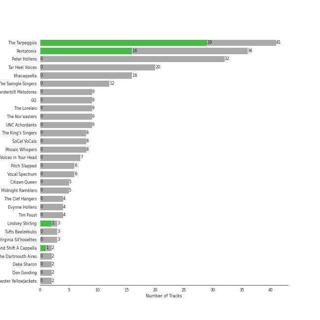

# A Cappella

## Top Artists

See all artists

|   Number of Tracks | Artist                                                   | 🔗                                                           |
|-------------------:|:---------------------------------------------------------|:------------------------------------------------------------|
|                 40 | [Pentatonix](../artists/pentatonix.md)                   | [🔗](https://open.spotify.com/artist/26AHtbjWKiwYzsoGoUZq53) |
|                 33 | [Peter Hollens](../artists/peter_hollens.md)             | [🔗](https://open.spotify.com/artist/7EIbKyiLnEJ1Y074UIUyZJ) |
|                 24 | [The Tarpeggios](../artists/the_tarpeggios.md)           | [🔗](https://open.spotify.com/artist/2HXd5pFHJyaQJr5aXfErrE) |
|                 20 | [Tar Heel Voices](../artists/tar_heel_voices.md)         | [🔗](https://open.spotify.com/artist/1apO6pJsV1nwuF2K8sEsDo) |
|                 18 | [Ithacappella](../artists/ithacappella.md)               | [🔗](https://open.spotify.com/artist/5bPTIGQvxRNjr6wl9yyAct) |
|                 13 | [The Swingle Singers](../artists/the_swingle_singers.md) | [🔗](https://open.spotify.com/artist/1ZlFYysRdc6YaUH5FkxPl8) |
|                 11 | [The Loreleis](../artists/the_loreleis.md)               | [🔗](https://open.spotify.com/artist/1fqMjreaczGwFmdmG6AvJs) |
|                 11 | [The Nor'easters](../artists/the_nor_easters.md)         | [🔗](https://open.spotify.com/artist/1aLfVgwt8eBrpvHcutWmqe) |
|                 10 | [The King's Singers](../artists/the_king_s_singers.md)   | [🔗](https://open.spotify.com/artist/5lR7yDVN4z9kahOiUSlMhe) |
|                  9 | Vanderbilt Melodores                                     | [🔗](https://open.spotify.com/artist/7HkF8fT7TZlrQsjSgWUEXN) |
|                  9 | GQ                                                       | [🔗](https://open.spotify.com/artist/6JYedwPn7zEWlTSUda9mev) |
|                  9 | UNC Achordants                                           | [🔗](https://open.spotify.com/artist/1TzZMeOCs4TMYtzgohPMAr) |
|                  9 | Mosaic Whispers                                          | [🔗](https://open.spotify.com/artist/0fP33MCfVUaPivyFYLZtoh) |
|                  7 | SoCal VoCals                                             | [🔗](https://open.spotify.com/artist/5L30XpwHG77eWCZtelTns9) |
|                  7 | Voices in Your Head                                      | [🔗](https://open.spotify.com/artist/44v8JgDySt9tkgfV3AWxBJ) |
|                  7 | Vocal Spectrum                                           | [🔗](https://open.spotify.com/artist/20nWuvMfCct9xv73hRYO7O) |
|                  6 | Pitch Slapped                                            | [🔗](https://open.spotify.com/artist/7EH7jldX62OIsU1yU1SWE7) |
|                  5 | Citizen Queen                                            | [🔗](https://open.spotify.com/artist/2z7BqfKvVlkr8KVAOTBKcz) |
|                  5 | Tim Foust                                                | [🔗](https://open.spotify.com/artist/2VtwFbDZzIoT9ZD0uR5HHD) |
|                  5 | University of Rochester Midnight Ramblers                | [🔗](https://open.spotify.com/artist/2Tv49uvEsNJXUpuFL7HuKu) |
|                  4 | The Clef Hangers                                         | [🔗](https://open.spotify.com/artist/5wUTXZIMX0mn6MzFA13qfO) |
|                  4 | Evynne Hollens                                           | [🔗](https://open.spotify.com/artist/3nj3MfJCFFoKiRkAOW1R8c) |
|                  3 | Tufts Beelzebubs                                         | [🔗](https://open.spotify.com/artist/4VsNVAxuPxZrJMWE2Tprtq) |
|                  3 | Lindsey Stirling                                         | [🔗](https://open.spotify.com/artist/378dH6EszOLFShpRzAQkVM) |
|                  2 | The Dartmouth Aires                                      | [🔗](https://open.spotify.com/artist/71Cez1b1NqsxIn5u8XNiQD) |
|                  2 | [Billy Joel](../artists/billy_joel.md)                   | [🔗](https://open.spotify.com/artist/6zFYqv1mOsgBRQbae3JJ9e) |
|                  2 | Deke Sharon                                              | [🔗](https://open.spotify.com/artist/6eWNb9yuroBpPcQ4sOkL1e) |
|                  2 | Don Gooding                                              | [🔗](https://open.spotify.com/artist/66iv9KzffeiANddjYouG6U) |
|                  2 | Second Shift A Cappella                                  | [🔗](https://open.spotify.com/artist/62Sh3v52pBL7IhWZMaGgq6) |
|                  2 | University of Rochester YellowJackets                    | [🔗](https://open.spotify.com/artist/5PdBpsZXvnEbbTe1589fMO) |
|                  2 | The Pitchforks                                           | [🔗](https://open.spotify.com/artist/5IPABE7EhPLvUVsgM3dlZ8) |
|                  2 | University Of Delaware Vocal Point                       | [🔗](https://open.spotify.com/artist/4nrhXBXu7FnxWeSbB21bfk) |
|                  2 | Paul Simon                                               | [🔗](https://open.spotify.com/artist/2CvCyf1gEVhI0mX6aFXmVI) |
|                  2 | Acappology                                               | [🔗](https://open.spotify.com/artist/21v1APtcWJHRmeKdBRVbYs) |
|                  2 | Tufts sQ!                                                | [🔗](https://open.spotify.com/artist/21QIHECpmN2KwhpVhIWHpT) |
|                  2 | The MIT Logarhythms                                      | [🔗](https://open.spotify.com/artist/1jz5HCLwsDkpBYz80n9wbR) |
|                  2 | Bill Hare                                                | [🔗](https://open.spotify.com/artist/10WhKnqdsfpYWDgZhjrday) |
|                  2 | The Virginia Sil'hooettes                                | [🔗](https://open.spotify.com/artist/0LKgClZwZKGhM5BkCzjfMX) |
|                  1 | Awaken A Cappella                                        | [🔗](https://open.spotify.com/artist/7zjm9GiXJPq0z3bKETWl1N) |
|                  1 | Shams Ahmed                                              | [🔗](https://open.spotify.com/artist/7rIkgg1ozqQIezA7c8Khf4) |
|                  1 | Pitches & Notes                                          | [🔗](https://open.spotify.com/artist/7l6eX8dYXjmQnfF04Sr4Vh) |
|                  1 | Delia Darney                                             | [🔗](https://open.spotify.com/artist/7ikvHdyyUnB92bHTgFcctU) |
|                  1 | Florida State University All-Night Yahtzee               | [🔗](https://open.spotify.com/artist/7hpsmZ7DZukPPg1dR2wqAy) |
|                  1 | University of Wisconsin-Madison Fundamentally Sound      | [🔗](https://open.spotify.com/artist/7f7ezoLEjOp1K0qDSosU80) |
|                  1 | Off The Beat                                             | [🔗](https://open.spotify.com/artist/7aCUqnLkFEQd2FPL6RK1tW) |
|                  1 | Anna Gilbert                                             | [🔗](https://open.spotify.com/artist/77ajzV8In7jP3U2OYT1Yy7) |
|                  1 | UGA Noteworthy                                           | [🔗](https://open.spotify.com/artist/6MyHz1OaVtj1w2y6JTu2u5) |
|                  1 | The Hound + The Fox                                      | [🔗](https://open.spotify.com/artist/6KxrjoB8dMcRC295reb2Us) |
|                  1 | Roxorloops & Blady Kris                                  | [🔗](https://open.spotify.com/artist/6HRJOlHBoo07WcZdXZAADI) |
|                  1 | BYU Vocal Point                                          | [🔗](https://open.spotify.com/artist/5zhxxb24WP6q6rbLHAn2UQ) |
|                  1 | The Statesmen                                            | [🔗](https://open.spotify.com/artist/5m9J0qjRMcetcTxN535NBZ) |
|                  1 | Mike Love                                                | [🔗](https://open.spotify.com/artist/5gr5OoQ4aQdJ3CqOr9v7Bt) |
|                  1 | The Swingles                                             | [🔗](https://open.spotify.com/artist/5QvPTVBx6OlrUuPwC8W3uU) |
|                  1 | Tyler Ward                                               | [🔗](https://open.spotify.com/artist/5Hc9oDGvStNGmnj44m8sHg) |
|                  1 | The Back Row                                             | [🔗](https://open.spotify.com/artist/5GaN9YyrJyPmJd6dALWhQh) |
|                  1 | The Harmonics                                            | [🔗](https://open.spotify.com/artist/528Rcthd9JqtIrlbrGKNsG) |
|                  1 | Kat Dunbar Linker                                        | [🔗](https://open.spotify.com/artist/512QZ1TM6L4uXmWCVOKHtV) |
|                  1 | Tink                                                     | [🔗](https://open.spotify.com/artist/4v6XOdonnfpdTKTRJArG7v) |
|                  1 | Varsity Vocals                                           | [🔗](https://open.spotify.com/artist/4bQp9Lm7LgRMLtqEsH3Bqf) |
|                  1 | [Andrew Lloyd Webber](../artists/andrew_lloyd_webber.md) | [🔗](https://open.spotify.com/artist/4aP1lp10BRYZO658B2NwkG) |
|                  1 | The Harvard-Radcliffe Veritones                          | [🔗](https://open.spotify.com/artist/4Zjdnr698SzQDAPMx4oxy0) |
|                  1 | Brian Wilson                                             | [🔗](https://open.spotify.com/artist/4Q82S0VzF8qlCb4PnSDurj) |
|                  1 | Brandeis VoiceMale                                       | [🔗](https://open.spotify.com/artist/4DsnXPBijq5tMq5zAEfF1L) |
|                  1 | Taylor Davis                                             | [🔗](https://open.spotify.com/artist/480xKab3lUPhBBnCzlzqIu) |
|                  1 | Decadence                                                | [🔗](https://open.spotify.com/artist/3uBUg8TtKXz6m3wY5aXa9I) |
|                  1 | Emily Shanny                                             | [🔗](https://open.spotify.com/artist/3oWiUIUDPWJmvB8wElpaO5) |
|                  1 | Andrew Busher                                            | [🔗](https://open.spotify.com/artist/3Zbnq9cbmHkNBzUrfTe2Vb) |
|                  1 | Gabe Hendifar                                            | [🔗](https://open.spotify.com/artist/3YIBM4yvZHT4lRQa14eHQh) |
|                  1 | Hullabahoos                                              | [🔗](https://open.spotify.com/artist/3S1DEHnGNfWmamdZEyLs8I) |
|                  1 | Eight Beat Measure                                       | [🔗](https://open.spotify.com/artist/3My1YRLewqqDXME2OkBpdZ) |
|                  1 | The Doo Wop Shop                                         | [🔗](https://open.spotify.com/artist/3BKvJisNneE6cOuLuBHGpC) |
|                  1 | Josquin des Prez                                         | [🔗](https://open.spotify.com/artist/31f23hmZawdqgp0sECAzE8) |
|                  1 | The Vassar Devils                                        | [🔗](https://open.spotify.com/artist/31EncJhuSBcAIsZGA3G1GK) |
|                  1 | Elizabeth Wright                                         | [🔗](https://open.spotify.com/artist/2tQ7EzEpu1KFpseMdHGSzL) |
|                  1 | Low Key                                                  | [🔗](https://open.spotify.com/artist/2bFVGrmfB6A9ljMkunWcXC) |
|                  1 | [Sara Bareilles](../artists/sara_bareilles.md)           | [🔗](https://open.spotify.com/artist/2Sqr0DXoaYABbjBo9HaMkM) |
|                  1 | Hank Green                                               | [🔗](https://open.spotify.com/artist/2SQVGFEgP0UZTZC1re2ECh) |
|                  1 | The Swingle Singers                                      | [🔗](https://open.spotify.com/artist/2Rn34e82tV2YfbLfP1omlS) |
|                  1 | Penn Masala                                              | [🔗](https://open.spotify.com/artist/2MhJb1ljKttJewuYZTpXxr) |
|                  1 | Home Free                                                | [🔗](https://open.spotify.com/artist/2MSlGNpwXDScUdspOK6TS7) |
|                  1 | David Archuleta                                          | [🔗](https://open.spotify.com/artist/2C9n4tQgNLhHPhSCmdsQnk) |
|                  1 | Mixed Emotions                                           | [🔗](https://open.spotify.com/artist/2BoHcRUfryDNxa9HQxXSpr) |
|                  1 | Beejul Khatri                                            | [🔗](https://open.spotify.com/artist/24SlCPf92d5VTzhI0ztENn) |
|                  1 | Upper Structure                                          | [🔗](https://open.spotify.com/artist/1tlKq97YGAGBavozMVeddE) |
|                  1 | University of Michigan G-Men                             | [🔗](https://open.spotify.com/artist/1jANAnjCBrwxiT4c33eeNc) |
|                  1 | Tufts Jackson Jills                                      | [🔗](https://open.spotify.com/artist/1dUJZ0lbobmanl4W14h0a2) |
|                  1 | BYU Noteworthy                                           | [🔗](https://open.spotify.com/artist/1ZknN7FbjjjMTmdU42OEeX) |
|                  1 | Academical Village People                                | [🔗](https://open.spotify.com/artist/1Vjug1h4HXCeplbouQEbV3) |
|                  1 | Traditional                                              | [🔗](https://open.spotify.com/artist/1U5zgr455OGyIkLNXvDdrf) |
|                  1 | Erika Petty                                              | [🔗](https://open.spotify.com/artist/15YH0MYEIRY7AmrrwfVO4W) |
|                  1 | The Virginia Gentlemen                                   | [🔗](https://open.spotify.com/artist/0steWfkS4hwaErh84SlHMW) |
|                  1 | The Bostonians                                           | [🔗](https://open.spotify.com/artist/0gW6hG0g7pVNbHgvmYwHDl) |
|                  1 | New Dominions                                            | [🔗](https://open.spotify.com/artist/0PzFyYSC4Y7JarVyByrJPc) |
|                  1 | The Buffalo Chips                                        | [🔗](https://open.spotify.com/artist/0IAZ8PiZ0KqdMd191HDJ8t) |
|                  1 | Jason Derulo                                             | [🔗](https://open.spotify.com/artist/07YZf4WDAMNwqr4jfgOZ8y) |
|                  1 | N'Harmonics                                              | [🔗](https://open.spotify.com/artist/02WQpZmto5LiTgoorLhpLK) |
|                  1 | On The Rocks                                             | [🔗](https://open.spotify.com/artist/00IjdWQ46sSBP4gZYObAMx) |

## Tracks

| Track                                                  | Album                                                               | Artists                                                                                                                                                         | 💚   | 🔗                                                          |
|:-------------------------------------------------------|:--------------------------------------------------------------------|:----------------------------------------------------------------------------------------------------------------------------------------------------------------|:----|:-----------------------------------------------------------|
| Domino                                                 | BOCA 2014: Best Of College A Cappella                               | Academical Village People                                                                                                                                       |     | [🔗](https://open.spotify.com/track/3DKmS1wFIHh2fs2rLWnngc) |
| Gunpowder & Lead                                       | BOCA 2012: Best Of College A Cappella                               | Acappology                                                                                                                                                      |     | [🔗](https://open.spotify.com/track/4VULVdHqtgipHNPFnVRQ7D) |
| Latch                                                  | BOCA 2018: Best of College A Cappella                               | Acappology                                                                                                                                                      |     | [🔗](https://open.spotify.com/track/4ohS1wfgFuaeePkvp0fbPL) |
| All I Ask of You                                       | Cappella                                                            | [Andrew Lloyd Webber](../artists/andrew_lloyd_webber.md), [The King's Singers](../artists/the_king_s_singers.md)                                                |     | [🔗](https://open.spotify.com/track/5JTRLqApDZKaIwcopt1d9p) |
| And So It Goes                                         | Cappella                                                            | [Billy Joel](../artists/billy_joel.md), [The King's Singers](../artists/the_king_s_singers.md)                                                                  |     | [🔗](https://open.spotify.com/track/6oFO1RXQZTdqXxh0Zw8xwp) |
| And So It Goes                                         | Good Vibrations                                                     | [Billy Joel](../artists/billy_joel.md), [The King's Singers](../artists/the_king_s_singers.md)                                                                  |     | [🔗](https://open.spotify.com/track/1v8w3Ve0EYhy8cMlRR92QM) |
| Phoenix                                                | BOCA 2012: Best Of College A Cappella                               | Brandeis VoiceMale                                                                                                                                              |     | [🔗](https://open.spotify.com/track/0SD3F1HRCKtQNXy6B2zltD) |
| Listen                                                 | BOCA 2010: Best Of College A Cappella                               | BYU Noteworthy                                                                                                                                                  |     | [🔗](https://open.spotify.com/track/2IdhvVi0vsa8ELKURGlMzV) |
| Eine kleine Nachtmusik                                 | BOCA 2015: Best Of College A Cappella                               | BYU Vocal Point                                                                                                                                                 |     | [🔗](https://open.spotify.com/track/4C4waD825wsfbZfQCxMmNn) |
| Lost in Japan                                          | Lost in Japan                                                       | Citizen Queen                                                                                                                                                   |     | [🔗](https://open.spotify.com/track/14ruMnm89Giao1vbFs7Bux) |
| Never Enough                                           | Never Enough                                                        | Citizen Queen                                                                                                                                                   |     | [🔗](https://open.spotify.com/track/3NzxjhxtUmmicwbWquPoXt) |
| No Tears Left to Cry                                   | No Tears Left to Cry                                                | Citizen Queen                                                                                                                                                   |     | [🔗](https://open.spotify.com/track/6SgkZROgo3xuatvg1zU8AZ) |
| Señorita                                               | Señorita                                                            | Citizen Queen                                                                                                                                                   |     | [🔗](https://open.spotify.com/track/3QglLwEow7OT5BUaZUNS4W) |
| bad guy                                                | bad guy                                                             | Citizen Queen                                                                                                                                                   |     | [🔗](https://open.spotify.com/track/2trPKQthDkOiLFCNy5fkIO) |
| Valerie                                                | BOCA 2013: Best of College A Cappella                               | Decadence                                                                                                                                                       |     | [🔗](https://open.spotify.com/track/18OOiO2QFVNYwixjqj1jks) |
| Talk Dirty                                             | BOCA 2015: Best Of College A Cappella                               | Eight Beat Measure                                                                                                                                              |     | [🔗](https://open.spotify.com/track/5lFEOhTWJbqbI0MwWhiKKk) |
| Aha!                                                   | BOCA 2013: Best of College A Cappella                               | Florida State University All-Night Yahtzee                                                                                                                      |     | [🔗](https://open.spotify.com/track/7Lx4TW1CMmHVP5ZiNGyi9H) |
| Fly Away - Intro                                       | GQ                                                                  | GQ                                                                                                                                                              |     | [🔗](https://open.spotify.com/track/0IdDyJeQXKg0KkwabitLmk) |
| Fly Away - Reprise                                     | GQ                                                                  | GQ                                                                                                                                                              |     | [🔗](https://open.spotify.com/track/4DZcIScN0K45rFv4CYD8cz) |
| I'm into Something Good / Happy Together               | GQ                                                                  | GQ                                                                                                                                                              |     | [🔗](https://open.spotify.com/track/647bpZBwa3ieLL4n3z39r5) |
| Plain Gold Ring                                        | GQ                                                                  | GQ                                                                                                                                                              |     | [🔗](https://open.spotify.com/track/3HQKqgiyuRAOYzRlOk0CzI) |
| Timshel                                                | GQ                                                                  | GQ                                                                                                                                                              |     | [🔗](https://open.spotify.com/track/5GtzG4nMm0DD4nlQp15uOn) |
| You Are My Sunshine                                    | GQ                                                                  | GQ                                                                                                                                                              |     | [🔗](https://open.spotify.com/track/2onWKiQV1I8I5Q0Nx45yoa) |
| Bei Mir Bist Du Schön                                  | GQ, Vol. II                                                         | GQ                                                                                                                                                              |     | [🔗](https://open.spotify.com/track/5t8Vp0SkxBJNJmtOZPu5u5) |
| Crabbuckit                                             | GQ, Vol. II                                                         | GQ                                                                                                                                                              |     | [🔗](https://open.spotify.com/track/7mgUbZEmuzs2TfXQNae4Dq) |
| How Great Thou Art                                     | GQ, Vol. II                                                         | GQ                                                                                                                                                              |     | [🔗](https://open.spotify.com/track/4mtfy4FhOni2BiidWoO4Kr) |
| Sweater Weather                                        | BOCA 2015: Best Of College A Cappella                               | Hullabahoos                                                                                                                                                     |     | [🔗](https://open.spotify.com/track/1cV1Q5LrLF4NdLgp1XuRvw) |
| Closer                                                 | BOCA 2010: Best Of College A Cappella                               | [Ithacappella](../artists/ithacappella.md)                                                                                                                      |     | [🔗](https://open.spotify.com/track/2OgqjJ8IYtCvqfUfvScpCx) |
| Halo                                                   | BOCA 2012: Best Of College A Cappella                               | [Ithacappella](../artists/ithacappella.md)                                                                                                                      |     | [🔗](https://open.spotify.com/track/3JFXlrFvax09IkXKWhGwVG) |
| Sixteen Tons                                           | Before You Go                                                       | [Ithacappella](../artists/ithacappella.md)                                                                                                                      |     | [🔗](https://open.spotify.com/track/1eBmRgj1SjBwnRYMImzhg5) |
| Closer                                                 | Breakdown!                                                          | [Ithacappella](../artists/ithacappella.md)                                                                                                                      |     | [🔗](https://open.spotify.com/track/0Hn3xNL4W9NRwyY2l4GJFY) |
| I Want You Back                                        | Breakdown!                                                          | [Ithacappella](../artists/ithacappella.md)                                                                                                                      |     | [🔗](https://open.spotify.com/track/3RZlEBnJJzfzqOr7UUlMZ8) |
| Isn't She Lovely                                       | Breakdown!                                                          | [Ithacappella](../artists/ithacappella.md)                                                                                                                      |     | [🔗](https://open.spotify.com/track/0ZSOQ9LuxzBbGk9bJ4vVvl) |
| We All Need Saving                                     | Breakdown!                                                          | [Ithacappella](../artists/ithacappella.md)                                                                                                                      |     | [🔗](https://open.spotify.com/track/0gve0tHDC9HABOSzsbcouZ) |
| Fireflies                                              | Off the Hook                                                        | [Ithacappella](../artists/ithacappella.md)                                                                                                                      |     | [🔗](https://open.spotify.com/track/32Z70Jce3icBWnVZrZHt68) |
| Halo                                                   | Off the Hook                                                        | [Ithacappella](../artists/ithacappella.md)                                                                                                                      |     | [🔗](https://open.spotify.com/track/5qlpHkmxJntPok8hKIPcrY) |
| Telephone                                              | Off the Hook                                                        | [Ithacappella](../artists/ithacappella.md)                                                                                                                      |     | [🔗](https://open.spotify.com/track/2Be3QDAcqCqaqZLuO64J87) |
| The Sound of Silence                                   | Off the Hook                                                        | [Ithacappella](../artists/ithacappella.md)                                                                                                                      |     | [🔗](https://open.spotify.com/track/4tptZOGxMiwN7jB3mwY9Uq) |
| Don't Stop Me Now                                      | Stages                                                              | [Ithacappella](../artists/ithacappella.md)                                                                                                                      |     | [🔗](https://open.spotify.com/track/4DBs9w3PojGatSDbT42vS7) |
| Say Something                                          | Stages                                                              | [Ithacappella](../artists/ithacappella.md)                                                                                                                      |     | [🔗](https://open.spotify.com/track/03ZafJ5f3rfyF9fSB8JkX8) |
| I Won't Give Up                                        | The Party Upstairs                                                  | [Ithacappella](../artists/ithacappella.md)                                                                                                                      |     | [🔗](https://open.spotify.com/track/4fK1ojDf3LYPh4KhNWoQFi) |
| Some Nights                                            | The Party Upstairs                                                  | [Ithacappella](../artists/ithacappella.md)                                                                                                                      |     | [🔗](https://open.spotify.com/track/5ys1Y4xf0vaKR8HjonRl21) |
| The Man Who Can't Be Moved                             | The Party Upstairs                                                  | [Ithacappella](../artists/ithacappella.md)                                                                                                                      |     | [🔗](https://open.spotify.com/track/6wUSJugAinSVEgJu8S50Ou) |
| We Found Love                                          | The Party Upstairs                                                  | [Ithacappella](../artists/ithacappella.md)                                                                                                                      |     | [🔗](https://open.spotify.com/track/4p2CmpzQB1PzgCssyQepPg) |
| Too Close (feat. Roxorloops & Blady Kris)              | The Party Upstairs                                                  | [Ithacappella](../artists/ithacappella.md), Roxorloops & Blady Kris                                                                                             |     | [🔗](https://open.spotify.com/track/3mTJZn9RT8dd9cOXLq3Kgj) |
| If I Ever Fall In Love (feat. Jason Derulo)            | Pentatonix (Deluxe Version)                                         | Jason Derulo, [Pentatonix](../artists/pentatonix.md)                                                                                                            | 💚   | [🔗](https://open.spotify.com/track/3vaWsG3oKZt0bSra2p5c5R) |
| Radioactive                                            | PTX                                                                 | Lindsey Stirling, [Pentatonix](../artists/pentatonix.md)                                                                                                        | 💚   | [🔗](https://open.spotify.com/track/7dJGehjbhJvs3K4fWwYTW1) |
| Papaoutai (Stromae Cover) (feat. Lindsey Stirling)     | PTX, Vol. III                                                       | Lindsey Stirling, [Pentatonix](../artists/pentatonix.md)                                                                                                        | 💚   | [🔗](https://open.spotify.com/track/4LeTorR5FyWgxM3zZI7Qii) |
| Fields of Gold                                         | Legendary Covers, Vol. 1                                            | Lindsey Stirling, [Peter Hollens](../artists/peter_hollens.md), Tyler Ward                                                                                      |     | [🔗](https://open.spotify.com/track/0sLEBadE1MXYXDiugLoEe6) |
| Hit 'Em Up Style                                       | BOCA 2011: Best Of College A Cappella                               | Low Key                                                                                                                                                         |     | [🔗](https://open.spotify.com/track/1vZFo0NkvmQPv08O4m11nU) |
| when the party's over                                  | BOCA 2020: Best of College A Cappella                               | Mixed Emotions                                                                                                                                                  |     | [🔗](https://open.spotify.com/track/5eXzpI6Y9OJRfJFu9jr4q4) |
| Paranoid Android                                       | Against the Grain                                                   | Mosaic Whispers                                                                                                                                                 |     | [🔗](https://open.spotify.com/track/22r7NTeTiEmNF1GD9rigXD) |
| Fix You                                                | Behind Bars                                                         | Mosaic Whispers                                                                                                                                                 |     | [🔗](https://open.spotify.com/track/2Up1OJpPa9gMbvgRd69sfL) |
| Fix You                                                | Behind Bars                                                         | Mosaic Whispers                                                                                                                                                 |     | [🔗](https://open.spotify.com/track/2Up1OJpPa9gMbvgRd69sfL) |
| Landslide                                              | Behind Bars                                                         | Mosaic Whispers                                                                                                                                                 |     | [🔗](https://open.spotify.com/track/42oLAPsFC8VUNEQ3rFIwVh) |
| Big Yellow Taxi                                        | Defrosted                                                           | Mosaic Whispers                                                                                                                                                 |     | [🔗](https://open.spotify.com/track/2ZzNHn8tKFrODeE8TpRJTg) |
| Elastic Heart                                          | ICCA 2016: The Extended Cuts                                        | Mosaic Whispers                                                                                                                                                 |     | [🔗](https://open.spotify.com/track/4Ek6v5gLQoBJuitIjPl5Fz) |
| White Flag                                             | Oasis                                                               | Mosaic Whispers                                                                                                                                                 |     | [🔗](https://open.spotify.com/track/4OTM4JDDkXdAwxJ88f7yZd) |
| Crazy In Love                                          | Wavelength                                                          | Mosaic Whispers                                                                                                                                                 |     | [🔗](https://open.spotify.com/track/0QC4u321fMlZlCJ46vk5uW) |
| There Goes My Baby                                     | Wavelength                                                          | Mosaic Whispers                                                                                                                                                 |     | [🔗](https://open.spotify.com/track/5914Jx2xX9GLN2saFuKJk1) |
| High And Dry                                           | BOCA 2011: Best Of College A Cappella                               | N'Harmonics                                                                                                                                                     |     | [🔗](https://open.spotify.com/track/7pjIkpcS5y38CuI4JRfJru) |
| Chandelier                                             | BOCA 2015: Best Of College A Cappella                               | New Dominions                                                                                                                                                   |     | [🔗](https://open.spotify.com/track/6VIwRB8pI0PgAXBwswVENi) |
| Does He Love You?                                      | BOCA 2008: Best Of College A Cappella                               | Off The Beat                                                                                                                                                    |     | [🔗](https://open.spotify.com/track/7gMEjMeugwWUZVq0m1pTNK) |
| All Time Low                                           | BOCA 2021: Best of College A Cappella                               | On The Rocks                                                                                                                                                    |     | [🔗](https://open.spotify.com/track/1z8D1f7Ljew7O99KMDslPS) |
| The Boxer                                              | Cappella                                                            | Paul Simon, [The King's Singers](../artists/the_king_s_singers.md)                                                                                              |     | [🔗](https://open.spotify.com/track/14WHMIVLmxzXUXAYrACaxD) |
| The Boxer                                              | Good Vibrations                                                     | Paul Simon, [The King's Singers](../artists/the_king_s_singers.md)                                                                                              |     | [🔗](https://open.spotify.com/track/5lRqY3uEKRCqSA0vXI4Lf7) |
| Manwa Laage                                            | BOCA 2015: Best Of College A Cappella                               | Penn Masala                                                                                                                                                     |     | [🔗](https://open.spotify.com/track/2aMMIV2pWF9S3eOQ0MFll7) |
| Hallelujah                                             | A Pentatonix Christmas Deluxe                                       | [Pentatonix](../artists/pentatonix.md)                                                                                                                          |     | [🔗](https://open.spotify.com/track/0HZk0QsXPhMNAWNDR3rYE8) |
| Attention                                              | Attention                                                           | [Pentatonix](../artists/pentatonix.md)                                                                                                                          |     | [🔗](https://open.spotify.com/track/6GXSUulN01V3aceEjovzqL) |
| Sweater Weather                                        | Christmas Is Here!                                                  | [Pentatonix](../artists/pentatonix.md)                                                                                                                          |     | [🔗](https://open.spotify.com/track/50YYe94G19kWVyhzdEXxki) |
| Hallelujah                                             | Hallelujah                                                          | [Pentatonix](../artists/pentatonix.md)                                                                                                                          |     | [🔗](https://open.spotify.com/track/0LsRGxeE8zZjzOV5QrR8G2) |
| Havana                                                 | Havana                                                              | [Pentatonix](../artists/pentatonix.md)                                                                                                                          | 💚   | [🔗](https://open.spotify.com/track/5vLmZ6ya1RGLoLeNwA82hY) |
| Say Something                                          | PTX                                                                 | [Pentatonix](../artists/pentatonix.md)                                                                                                                          |     | [🔗](https://open.spotify.com/track/2SrJ0Iw6GobiRGyh2XKZhV) |
| Somebody That I Used to Know                           | PTX                                                                 | [Pentatonix](../artists/pentatonix.md)                                                                                                                          |     | [🔗](https://open.spotify.com/track/1S8uwRgAnR028rfWdm4hhO) |
| Attention                                              | PTX Presents: Top Pop, Vol. I                                       | [Pentatonix](../artists/pentatonix.md)                                                                                                                          |     | [🔗](https://open.spotify.com/track/5P40YyCrdZRsoj2vTbSyVI) |
| Finesse                                                | PTX Presents: Top Pop, Vol. I                                       | [Pentatonix](../artists/pentatonix.md)                                                                                                                          |     | [🔗](https://open.spotify.com/track/4GfCvy3t1u4lMAFldhB7EF) |
| Havana                                                 | PTX Presents: Top Pop, Vol. I                                       | [Pentatonix](../artists/pentatonix.md)                                                                                                                          |     | [🔗](https://open.spotify.com/track/0wkiCJqCtI8keITfZ642jg) |
| Can't Help Falling In Love                             | PTX Vol. IV - Classics                                              | [Pentatonix](../artists/pentatonix.md)                                                                                                                          | 💚   | [🔗](https://open.spotify.com/track/1xKScU3i8ho0OIhNoC5YW9) |
| Imagine                                                | PTX Vol. IV - Classics                                              | [Pentatonix](../artists/pentatonix.md)                                                                                                                          | 💚   | [🔗](https://open.spotify.com/track/1UaTmLT3nB1sNBfv1hkqU1) |
| Over The Rainbow                                       | PTX Vol. IV - Classics                                              | [Pentatonix](../artists/pentatonix.md)                                                                                                                          | 💚   | [🔗](https://open.spotify.com/track/7MefjVBQqdV6XRXBlWejTQ) |
| Aha!                                                   | PTX, Vol. 1                                                         | [Pentatonix](../artists/pentatonix.md)                                                                                                                          | 💚   | [🔗](https://open.spotify.com/track/5AspukpHyZuTciR17YPSrS) |
| Show You How to Love                                   | PTX, Vol. 1                                                         | [Pentatonix](../artists/pentatonix.md)                                                                                                                          |     | [🔗](https://open.spotify.com/track/0jExzGwfnZ1vTuCVB7w3vM) |
| Somebody That I Used to Know                           | PTX, Vol. 1                                                         | [Pentatonix](../artists/pentatonix.md)                                                                                                                          | 💚   | [🔗](https://open.spotify.com/track/5XPSElbh3y0S1Jl0ggpwQr) |
| Starships                                              | PTX, Vol. 1                                                         | [Pentatonix](../artists/pentatonix.md)                                                                                                                          | 💚   | [🔗](https://open.spotify.com/track/28KAxjOTAnnGjGpC2Qx8gn) |
| The Baddest Girl                                       | PTX, Vol. 1                                                         | [Pentatonix](../artists/pentatonix.md)                                                                                                                          | 💚   | [🔗](https://open.spotify.com/track/3tKAuyZm1eLdmkZekqezic) |
| We Are Young                                           | PTX, Vol. 1                                                         | [Pentatonix](../artists/pentatonix.md)                                                                                                                          | 💚   | [🔗](https://open.spotify.com/track/5mMoySkxdUWlTw6X2l4egi) |
| Daft Punk                                              | PTX, Vol. 2                                                         | [Pentatonix](../artists/pentatonix.md)                                                                                                                          | 💚   | [🔗](https://open.spotify.com/track/6ukvsBzq4d1vBsAUmz7ZVt) |
| Hey Momma / Hit the Road Jack                          | PTX, Vol. 2                                                         | [Pentatonix](../artists/pentatonix.md)                                                                                                                          | 💚   | [🔗](https://open.spotify.com/track/2wUZek0zWyw5mGKoT8mRcG) |
| I Need Your Love                                       | PTX, Vol. 2                                                         | [Pentatonix](../artists/pentatonix.md)                                                                                                                          |     | [🔗](https://open.spotify.com/track/11tQS3cthRT6guY7WkTypx) |
| Love Again                                             | PTX, Vol. 2                                                         | [Pentatonix](../artists/pentatonix.md)                                                                                                                          |     | [🔗](https://open.spotify.com/track/0vcyzDe6aoYTg6jM0U0T9r) |
| Natural Disaster                                       | PTX, Vol. 2                                                         | [Pentatonix](../artists/pentatonix.md)                                                                                                                          |     | [🔗](https://open.spotify.com/track/04nemEju86ULMJ1iy6EAsF) |
| Run to You                                             | PTX, Vol. 2                                                         | [Pentatonix](../artists/pentatonix.md)                                                                                                                          | 💚   | [🔗](https://open.spotify.com/track/1bukNCD9JEwNp235Ov0iZH) |
| Valentine                                              | PTX, Vol. 2                                                         | [Pentatonix](../artists/pentatonix.md)                                                                                                                          | 💚   | [🔗](https://open.spotify.com/track/5djjmpqAOlne6d5RSHQmvu) |
| La La Latch (Sam Smith/Disclosure/Naughty Boy Mashup)  | PTX, Vol. III                                                       | [Pentatonix](../artists/pentatonix.md)                                                                                                                          | 💚   | [🔗](https://open.spotify.com/track/6fOqEAXCwboCO4BdzbZG1K) |
| Problem (Ariana Grande Cover)                          | PTX, Vol. III                                                       | [Pentatonix](../artists/pentatonix.md)                                                                                                                          | 💚   | [🔗](https://open.spotify.com/track/45h4cCw7ccsRXb0Orle2an) |
| Rather Be (Clean Bandit Cover)                         | PTX, Vol. III                                                       | [Pentatonix](../artists/pentatonix.md)                                                                                                                          | 💚   | [🔗](https://open.spotify.com/track/4hxemf0pE0mSzubgsfRLWu) |
| See Through                                            | PTX, Vol. III                                                       | [Pentatonix](../artists/pentatonix.md)                                                                                                                          |     | [🔗](https://open.spotify.com/track/6UNqsxeupIqwNds2oSDYnY) |
| Standing By                                            | PTX, Vol. III                                                       | [Pentatonix](../artists/pentatonix.md)                                                                                                                          |     | [🔗](https://open.spotify.com/track/2ZtMNYog671T0UFfp0hhWq) |
| Can't Sleep Love                                       | Pentatonix (Deluxe Version)                                         | [Pentatonix](../artists/pentatonix.md)                                                                                                                          |     | [🔗](https://open.spotify.com/track/1klGbW5a9qTBFUjFfddbmU) |
| Na Na Na                                               | Pentatonix (Deluxe Version)                                         | [Pentatonix](../artists/pentatonix.md)                                                                                                                          |     | [🔗](https://open.spotify.com/track/6v08G3CGcoyiODIWZoOxR4) |
| Dance of the Sugar Plum Fairy                          | That's Christmas To Me (Deluxe Edition)                             | [Pentatonix](../artists/pentatonix.md)                                                                                                                          |     | [🔗](https://open.spotify.com/track/0u0TlASkQWH2bGIZRu0HLh) |
| Let It Go                                              | That's Christmas To Me (Deluxe Edition)                             | [Pentatonix](../artists/pentatonix.md)                                                                                                                          |     | [🔗](https://open.spotify.com/track/2G7K3Op9y3HhqrF2TdHP95) |
| The Sound of Silence                                   | The Sound of Silence                                                | [Pentatonix](../artists/pentatonix.md)                                                                                                                          |     | [🔗](https://open.spotify.com/track/0ZFeVCKCMCXUQ1TKVd2azW) |
| Can't Sleep Love (feat. Tink)                          | Pentatonix (Deluxe Version)                                         | [Pentatonix](../artists/pentatonix.md), Tink                                                                                                                    | 💚   | [🔗](https://open.spotify.com/track/1GXFYdKM6MNrogE2PacpKe) |
| Hamilton Medley                                        | Covers, Vol. III                                                    | [Peter Hollens](../artists/peter_hollens.md)                                                                                                                    |     | [🔗](https://open.spotify.com/track/7HU8e7VCXuhOSaDoQ5UBwn) |
| Mad World                                              | Covers, Vol. III                                                    | [Peter Hollens](../artists/peter_hollens.md)                                                                                                                    |     | [🔗](https://open.spotify.com/track/3K3mORNnlUXodukHH0sDjr) |
| Imagine                                                | Legendary Covers, Vol. 1                                            | [Peter Hollens](../artists/peter_hollens.md)                                                                                                                    |     | [🔗](https://open.spotify.com/track/4oiGtuMHFcfOcIDQyY52wy) |
| Lullaby                                                | Legendary Covers, Vol. 1                                            | [Peter Hollens](../artists/peter_hollens.md)                                                                                                                    |     | [🔗](https://open.spotify.com/track/6vqc1KcIaO0NmQLaAJApqe) |
| Over the Rainbow                                       | Legendary Covers, Vol. 1                                            | [Peter Hollens](../artists/peter_hollens.md)                                                                                                                    |     | [🔗](https://open.spotify.com/track/76ko6F6QRmiviFILuF9g6J) |
| You Raise Me Up - A Cappella                           | Legendary Covers, Vol. 1                                            | [Peter Hollens](../artists/peter_hollens.md)                                                                                                                    |     | [🔗](https://open.spotify.com/track/57EvTXkeuxNPWxQYIdW5AY) |
| Danny Boy                                              | Legendary Folk Songs                                                | [Peter Hollens](../artists/peter_hollens.md)                                                                                                                    |     | [🔗](https://open.spotify.com/track/5DXL9IESZqqqrW2euiWaAA) |
| Loch Lomond                                            | Legendary Folk Songs                                                | [Peter Hollens](../artists/peter_hollens.md)                                                                                                                    |     | [🔗](https://open.spotify.com/track/0eUE1gw4CpTlqBktSI9aND) |
| Scarborough Fair                                       | Legendary Folk Songs                                                | [Peter Hollens](../artists/peter_hollens.md)                                                                                                                    |     | [🔗](https://open.spotify.com/track/1fXgi7opKIjkpjX6uVNJXx) |
| The Fox                                                | Legendary Folk Songs                                                | [Peter Hollens](../artists/peter_hollens.md)                                                                                                                    |     | [🔗](https://open.spotify.com/track/14NcPvHX03DgKjTHXXsZNn) |
| The Water is Wide                                      | Legendary Folk Songs                                                | [Peter Hollens](../artists/peter_hollens.md)                                                                                                                    |     | [🔗](https://open.spotify.com/track/2E6c7d4MfJBtOI3B5Vsajk) |
| Arwen's Song                                           | Misty Mountains: Songs Inspired by The Hobbit and Lord of the Rings | [Peter Hollens](../artists/peter_hollens.md)                                                                                                                    |     | [🔗](https://open.spotify.com/track/4H3LioOCKpZcE9jmvWqNcv) |
| Edge of Night                                          | Misty Mountains: Songs Inspired by The Hobbit and Lord of the Rings | [Peter Hollens](../artists/peter_hollens.md)                                                                                                                    |     | [🔗](https://open.spotify.com/track/0nBeUCpjIu62kLU3MFjZbL) |
| Gollum's Song                                          | Misty Mountains: Songs Inspired by The Hobbit and Lord of the Rings | [Peter Hollens](../artists/peter_hollens.md)                                                                                                                    |     | [🔗](https://open.spotify.com/track/61WvPK7oUmEeXJvdQx7Kd2) |
| Into The West                                          | Misty Mountains: Songs Inspired by The Hobbit and Lord of the Rings | [Peter Hollens](../artists/peter_hollens.md)                                                                                                                    |     | [🔗](https://open.spotify.com/track/46ZN4mhFy9De1fjlHGbYze) |
| Song of the Lonely Mountain                            | Misty Mountains: Songs Inspired by The Hobbit and Lord of the Rings | [Peter Hollens](../artists/peter_hollens.md)                                                                                                                    |     | [🔗](https://open.spotify.com/track/1Ht9LvTpP6bZezGCL2BRHP) |
| Shenandoah                                             | Legendary Folk Songs                                                | [Peter Hollens](../artists/peter_hollens.md), Anna Gilbert                                                                                                      |     | [🔗](https://open.spotify.com/track/4F0h4ke31MIzjmb018lmml) |
| Loch Lomond                                            | Legendary Folk Songs                                                | [Peter Hollens](../artists/peter_hollens.md), David Archuleta                                                                                                   |     | [🔗](https://open.spotify.com/track/1AbjBMyhiiEt5GJiRtlDRX) |
| At the Beginning                                       | At the Beginning                                                    | [Peter Hollens](../artists/peter_hollens.md), Evynne Hollens                                                                                                    |     | [🔗](https://open.spotify.com/track/4rONfUG09RBdY299o0rvm8) |
| Phantom of the Opera Medley                            | Covers, Vol. III                                                    | [Peter Hollens](../artists/peter_hollens.md), Evynne Hollens                                                                                                    |     | [🔗](https://open.spotify.com/track/7FpJ62ZQtyitL40diEH9vf) |
| The Prayer                                             | Legendary Covers, Vol. 1                                            | [Peter Hollens](../artists/peter_hollens.md), Evynne Hollens                                                                                                    |     | [🔗](https://open.spotify.com/track/22NQSPn3K3NUzoVe4zbQWU) |
| Les Miserables Medley                                  | Peter Hollens                                                       | [Peter Hollens](../artists/peter_hollens.md), Evynne Hollens                                                                                                    |     | [🔗](https://open.spotify.com/track/2qo9G9xV51aUpclzAYEU9W) |
| Hobbit Drinking Medley                                 | Misty Mountains: Songs Inspired by The Hobbit and Lord of the Rings | [Peter Hollens](../artists/peter_hollens.md), Hank Green                                                                                                        |     | [🔗](https://open.spotify.com/track/3lO8g6FU5zQlzdfW3zxNQ0) |
| Amazing Grace                                          | Legendary Folk Songs                                                | [Peter Hollens](../artists/peter_hollens.md), Home Free                                                                                                         |     | [🔗](https://open.spotify.com/track/4Y7ccrzeEvhvCc8IFoxZKd) |
| I See Fire                                             | Misty Mountains: Songs Inspired by The Hobbit and Lord of the Rings | [Peter Hollens](../artists/peter_hollens.md), Taylor Davis                                                                                                      |     | [🔗](https://open.spotify.com/track/3GDHe8EwGQMxDE1QuPitvw) |
| The Parting Glass                                      | Legendary Folk Songs                                                | [Peter Hollens](../artists/peter_hollens.md), The Hound + The Fox                                                                                               |     | [🔗](https://open.spotify.com/track/1l1r0PNrP1b15QLJjpgOp6) |
| Poor Wayfaring Stranger                                | Legendary Folk Songs                                                | [Peter Hollens](../artists/peter_hollens.md), The Swingles                                                                                                      |     | [🔗](https://open.spotify.com/track/0NmsMH3LvATRdd4bRSTdtl) |
| Bridge Over Troubled Water                             | Legendary Covers, Vol. 1                                            | [Peter Hollens](../artists/peter_hollens.md), Tim Foust                                                                                                         |     | [🔗](https://open.spotify.com/track/1My1VVTQAO9cAGJw7BhpTa) |
| The Sound of Silence                                   | Legendary Covers, Vol. 1                                            | [Peter Hollens](../artists/peter_hollens.md), Tim Foust                                                                                                         |     | [🔗](https://open.spotify.com/track/19ZmmtsRITqrh7aBPdpyNz) |
| Greensleeves                                           | Legendary Folk Songs                                                | [Peter Hollens](../artists/peter_hollens.md), Tim Foust                                                                                                         |     | [🔗](https://open.spotify.com/track/0Q7QHXmwjj8u9ajPvwNnCO) |
| Misty Mountains                                        | Misty Mountains: Songs Inspired by The Hobbit and Lord of the Rings | [Peter Hollens](../artists/peter_hollens.md), Tim Foust                                                                                                         |     | [🔗](https://open.spotify.com/track/21sD95jUPmren2fGY0wxYE) |
| The Sound of Silence                                   | The Sound of Silence                                                | [Peter Hollens](../artists/peter_hollens.md), Tim Foust                                                                                                         |     | [🔗](https://open.spotify.com/track/10kJzrXI48v0wzRBBPjo06) |
| Disturbia                                              | Disturbia                                                           | Pitch Slapped                                                                                                                                                   |     | [🔗](https://open.spotify.com/track/1KSw4qWE0rVho501q2bBgA) |
| Because of You                                         | Pitch Slapped - EP                                                  | Pitch Slapped                                                                                                                                                   |     | [🔗](https://open.spotify.com/track/4L94VtyGgK5iBnOEkS4vgP) |
| Breakeven                                              | Pitch Slapped - EP                                                  | Pitch Slapped                                                                                                                                                   |     | [🔗](https://open.spotify.com/track/6VXLQHs49KvnSQXaPrCBQh) |
| Got To Get You Into My Life                            | Pitch Slapped - EP                                                  | Pitch Slapped                                                                                                                                                   |     | [🔗](https://open.spotify.com/track/3qBprB0ZTGZ9smH0YGgppn) |
| Halo                                                   | Pitch Slapped - EP                                                  | Pitch Slapped                                                                                                                                                   |     | [🔗](https://open.spotify.com/track/2iN8Dmoe6z5spepFbiJ3ld) |
| Without Your Love                                      | Pitch Slapped - EP                                                  | Pitch Slapped                                                                                                                                                   |     | [🔗](https://open.spotify.com/track/0L0hyvhKUB8zytGw8plT3l) |
| God is a Woman                                         | BOCA 2021: Best of College A Cappella                               | Pitches & Notes                                                                                                                                                 |     | [🔗](https://open.spotify.com/track/3YL6rePe5HfzyxkJJta9CR) |
| Gravity                                                | BOCA 2004: Best Of College A Cappella                               | [Sara Bareilles](../artists/sara_bareilles.md), Awaken A Cappella, Don Gooding, Bill Hare, Gabe Hendifar, Deke Sharon                                           |     | [🔗](https://open.spotify.com/track/0W94b6tM78Miftv7W5tOX2) |
| Dance in the Graveyards                                | Graveyard Shift                                                     | Second Shift A Cappella                                                                                                                                         |     | [🔗](https://open.spotify.com/track/2xg0DtRn2Wz32HdmkhzHQu) |
| Take Me to Church / Like a Prayer                      | Graveyard Shift                                                     | Second Shift A Cappella                                                                                                                                         |     | [🔗](https://open.spotify.com/track/4KIb1vBHFEzb1tymlJKrDB) |
| Movin' On                                              | BOCA 2010: Best Of College A Cappella                               | SoCal VoCals                                                                                                                                                    |     | [🔗](https://open.spotify.com/track/6ij7GL6J5e8l8gprJZ1sz7) |
| Tightrope                                              | BOCA 2014: Best Of College A Cappella                               | SoCal VoCals                                                                                                                                                    |     | [🔗](https://open.spotify.com/track/3SVFOwTfDYsfYISonpmSJz) |
| Hold My Heart                                          | Permit to Harmonize                                                 | SoCal VoCals                                                                                                                                                    |     | [🔗](https://open.spotify.com/track/1oyljwybETBhXYENumATMa) |
| Poison & Wine                                          | Permit to Harmonize                                                 | SoCal VoCals                                                                                                                                                    |     | [🔗](https://open.spotify.com/track/0e1lJVRsuzBjkXy73BpMq6) |
| Finesse - Remix                                        | V                                                                   | SoCal VoCals                                                                                                                                                    |     | [🔗](https://open.spotify.com/track/6hKURb6RkJoGTWPMsMhQSc) |
| Pure Imagination                                       | V                                                                   | SoCal VoCals                                                                                                                                                    |     | [🔗](https://open.spotify.com/track/1XfW8CuHYq0PYNImGpo3MT) |
| Wayfaring Stranger                                     | VoCabulary                                                          | SoCal VoCals                                                                                                                                                    |     | [🔗](https://open.spotify.com/track/71WPmT3HvhdjHgGbxuQEmX) |
| Can't Take My Eyes Off You                             | 1988                                                                | [Tar Heel Voices](../artists/tar_heel_voices.md)                                                                                                                |     | [🔗](https://open.spotify.com/track/421iteTHiwbWZneFqAUQpS) |
| Chandelier                                             | 1988                                                                | [Tar Heel Voices](../artists/tar_heel_voices.md)                                                                                                                |     | [🔗](https://open.spotify.com/track/18wXABY4rT8OWkluEuXir0) |
| Counting Stars                                         | 1988                                                                | [Tar Heel Voices](../artists/tar_heel_voices.md)                                                                                                                |     | [🔗](https://open.spotify.com/track/497vByhCSwcQHKrLOqsXgA) |
| Say Something                                          | 1988                                                                | [Tar Heel Voices](../artists/tar_heel_voices.md)                                                                                                                |     | [🔗](https://open.spotify.com/track/2lXAm7golSL8XPCJiv8qVS) |
| Bird Set Free                                          | Ignite                                                              | [Tar Heel Voices](../artists/tar_heel_voices.md)                                                                                                                |     | [🔗](https://open.spotify.com/track/4jgYV89FYNG8a8jzFa51Xy) |
| Easy                                                   | Keepin' it Low Key                                                  | [Tar Heel Voices](../artists/tar_heel_voices.md)                                                                                                                |     | [🔗](https://open.spotify.com/track/37vwAtZv5XEbpg0uetfdcB) |
| Happy Ending                                           | Keepin' it Low Key                                                  | [Tar Heel Voices](../artists/tar_heel_voices.md)                                                                                                                |     | [🔗](https://open.spotify.com/track/72bpNdFjmdbiLFGV1w92RY) |
| Machine Gun                                            | Keepin' it Low Key                                                  | [Tar Heel Voices](../artists/tar_heel_voices.md)                                                                                                                |     | [🔗](https://open.spotify.com/track/3p0txIEAiyVi0MBOd0AkmR) |
| Only the Good Die Young                                | Keepin' it Low Key                                                  | [Tar Heel Voices](../artists/tar_heel_voices.md)                                                                                                                |     | [🔗](https://open.spotify.com/track/3OERzUoUYTsAOarTBVQcMw) |
| Samson                                                 | Keepin' it Low Key                                                  | [Tar Heel Voices](../artists/tar_heel_voices.md)                                                                                                                |     | [🔗](https://open.spotify.com/track/4GkzthA7aLCGzoP7vuZj7t) |
| Wally                                                  | Keepin' it Low Key                                                  | [Tar Heel Voices](../artists/tar_heel_voices.md)                                                                                                                |     | [🔗](https://open.spotify.com/track/4dY5fF23LOemKIA9Q2uzxZ) |
| Blown Away                                             | Quarter Past                                                        | [Tar Heel Voices](../artists/tar_heel_voices.md)                                                                                                                |     | [🔗](https://open.spotify.com/track/0XWtfrs1Sh8Qm47OeMlCYN) |
| Falling Slowly                                         | Quarter Past                                                        | [Tar Heel Voices](../artists/tar_heel_voices.md)                                                                                                                |     | [🔗](https://open.spotify.com/track/4tzF2kdCUtlbVpry6z9WPZ) |
| Morning Comes                                          | Quarter Past                                                        | [Tar Heel Voices](../artists/tar_heel_voices.md)                                                                                                                |     | [🔗](https://open.spotify.com/track/1z0NSC0GZhulpwAGv6QcYN) |
| Set Fire To The Rain                                   | Quarter Past                                                        | [Tar Heel Voices](../artists/tar_heel_voices.md)                                                                                                                |     | [🔗](https://open.spotify.com/track/6SMKwFe2OB1HOh1ZT8sOVq) |
| Speechless                                             | Quarter Past                                                        | [Tar Heel Voices](../artists/tar_heel_voices.md)                                                                                                                |     | [🔗](https://open.spotify.com/track/3ibXraWcKcHr3ga4PKRY05) |
| Wait It Out                                            | Quarter Past                                                        | [Tar Heel Voices](../artists/tar_heel_voices.md)                                                                                                                |     | [🔗](https://open.spotify.com/track/5jxyJeMudecYVsPXctn4dv) |
| Wanted                                                 | Quarter Past                                                        | [Tar Heel Voices](../artists/tar_heel_voices.md)                                                                                                                |     | [🔗](https://open.spotify.com/track/0wfPw0MHPaMOt4Np1oCa0q) |
| You And I                                              | Quarter Past                                                        | [Tar Heel Voices](../artists/tar_heel_voices.md)                                                                                                                |     | [🔗](https://open.spotify.com/track/5L6yEBGz4rtApJ8PgY6kjl) |
| She Used to Be Mine                                    | Unbound                                                             | [Tar Heel Voices](../artists/tar_heel_voices.md)                                                                                                                |     | [🔗](https://open.spotify.com/track/7cuRwKzH4LJoIEkRzO0EEV) |
| Sexyback                                               | BOCA 2008: Best Of College A Cappella                               | The Back Row                                                                                                                                                    |     | [🔗](https://open.spotify.com/track/6GUakxj472xSOMb7n4PmGu) |
| First Train Home                                       | BOCA 2011: Best Of College A Cappella                               | The Bostonians                                                                                                                                                  |     | [🔗](https://open.spotify.com/track/1AFKgrcUEWCjMvnfhMgQAH) |
| Viva La Vida                                           | BOCA 2009: Best Of College A Cappella                               | The Buffalo Chips                                                                                                                                               |     | [🔗](https://open.spotify.com/track/3h7QyvRCvDzaq5byDWMulH) |
| Don't Stop Believin'                                   | BOCA 2008: Best Of College A Cappella                               | The Clef Hangers                                                                                                                                                |     | [🔗](https://open.spotify.com/track/3j0EShkWclou2SnCRirqbj) |
| Let It Go                                              | Fixate                                                              | The Clef Hangers                                                                                                                                                |     | [🔗](https://open.spotify.com/track/3WgDY81htmhTtSh7VWIl60) |
| Africa                                                 | House Rules                                                         | The Clef Hangers                                                                                                                                                |     | [🔗](https://open.spotify.com/track/2dmQFWn149bJXFMkaeArNo) |
| Some Nights                                            | The Mallard                                                         | The Clef Hangers                                                                                                                                                |     | [🔗](https://open.spotify.com/track/553aS2CmFAuIlw8JKeN2q8) |
| Brand New Jones                                        | BOCA 2012: Best Of College A Cappella                               | The Dartmouth Aires                                                                                                                                             |     | [🔗](https://open.spotify.com/track/0GMJCCfFZpAw9NVnpZjJTV) |
| All of Me                                              | BOCA 2015: Best Of College A Cappella                               | The Dartmouth Aires                                                                                                                                             |     | [🔗](https://open.spotify.com/track/2Sur4RO7a4VVXxzfxX9bY7) |
| Oops!...I Did It Again                                 | BOCA 2021: Best of College A Cappella                               | The Doo Wop Shop                                                                                                                                                |     | [🔗](https://open.spotify.com/track/2sigy23leJc6YIAltQadIK) |
| Sound Of Silence                                       | BOCA 2009: Best Of College A Cappella                               | The Harmonics                                                                                                                                                   |     | [🔗](https://open.spotify.com/track/7d9eTipRw0DsB2ggcecqez) |
| They                                                   | BOCA 2009: Best Of College A Cappella                               | The Harvard-Radcliffe Veritones                                                                                                                                 |     | [🔗](https://open.spotify.com/track/12RoSrRwRi85EESftOp9fh) |
| The Circle of Life                                     | Circle Of Life                                                      | [The King's Singers](../artists/the_king_s_singers.md)                                                                                                          |     | [🔗](https://open.spotify.com/track/3jzAbk9K5I1n8zlPeptNxD) |
| Shenandoah - Arr. Bob Chilcott                         | Gold                                                                | [The King's Singers](../artists/the_king_s_singers.md)                                                                                                          |     | [🔗](https://open.spotify.com/track/7vhTfs9QoqqPowjORyHnvj) |
| Lullabye (Goodnight My Angel)                          | The King's Singers Collection                                       | [The King's Singers](../artists/the_king_s_singers.md)                                                                                                          |     | [🔗](https://open.spotify.com/track/32ruFNP2hO8fPpfmRewbwV) |
| Good Vibrations                                        | Cappella                                                            | [The King's Singers](../artists/the_king_s_singers.md), Brian Wilson, Mike Love                                                                                 |     | [🔗](https://open.spotify.com/track/14LgsPIZ7xKsfkM50VjxuA) |
| Ave Maria                                              | Cappella                                                            | [The King's Singers](../artists/the_king_s_singers.md), Josquin des Prez                                                                                        |     | [🔗](https://open.spotify.com/track/6xBGuah2AMT6y5S0HlztUU) |
| Landslide                                              | A Kick & A Wallop                                                   | [The Loreleis](../artists/the_loreleis.md)                                                                                                                      |     | [🔗](https://open.spotify.com/track/1gViYygDgkWPAH8q6WfsN0) |
| Shake It Out                                           | A Kick & A Wallop                                                   | [The Loreleis](../artists/the_loreleis.md)                                                                                                                      |     | [🔗](https://open.spotify.com/track/2sDFmfPjYFy5MvFj1Gds02) |
| DNA                                                    | BOCA 2014: Best Of College A Cappella                               | [The Loreleis](../artists/the_loreleis.md)                                                                                                                      |     | [🔗](https://open.spotify.com/track/6ZpX4DRFMbY8U4L8dPOFAR) |
| Bluebird                                               | BOCA 2016: Best Of College A Cappella                               | [The Loreleis](../artists/the_loreleis.md)                                                                                                                      |     | [🔗](https://open.spotify.com/track/7LLOuelob5YTG9Nxey377l) |
| DNA                                                    | Burn                                                                | [The Loreleis](../artists/the_loreleis.md)                                                                                                                      |     | [🔗](https://open.spotify.com/track/5ga8GnfhDfcscqlzIFNoBp) |
| Bluebird                                               | Sincerely,                                                          | [The Loreleis](../artists/the_loreleis.md)                                                                                                                      |     | [🔗](https://open.spotify.com/track/1CxrAFGO31aaZyDdCKUmAI) |
| Elastic Heart                                          | Sincerely,                                                          | [The Loreleis](../artists/the_loreleis.md)                                                                                                                      |     | [🔗](https://open.spotify.com/track/3QLXMQMV2MOp66qHfgU5Lg) |
| Here                                                   | Sincerely,                                                          | [The Loreleis](../artists/the_loreleis.md)                                                                                                                      |     | [🔗](https://open.spotify.com/track/6jCsjDAeVU2fvbBb7hZe8X) |
| Daddy Lessons                                          | Where the Secret Lies                                               | [The Loreleis](../artists/the_loreleis.md)                                                                                                                      |     | [🔗](https://open.spotify.com/track/2GmUvhbLEly5ERfknrW3sb) |
| How Big, How Blue, How Beautiful                       | Where the Secret Lies                                               | [The Loreleis](../artists/the_loreleis.md)                                                                                                                      |     | [🔗](https://open.spotify.com/track/1Z2DeA17SJLGn57v2pOVDv) |
| My Happy Ending                                        | BOCA 2006: Best Of College A Cappella                               | [The Loreleis](../artists/the_loreleis.md), Don Gooding, Bill Hare, Deke Sharon, Varsity Vocals, Kat Dunbar Linker, Delia Darney, Elizabeth Wright, Erika Petty |     | [🔗](https://open.spotify.com/track/7umin6cK2uTjk1BwLMKzJ9) |
| Here (In Your Arms)                                    | BOCA 2009: Best Of College A Cappella                               | The MIT Logarhythms                                                                                                                                             |     | [🔗](https://open.spotify.com/track/0eyAuLKMMEJRqiHFPhhFYI) |
| There Goes My Baby                                     | BOCA 2012: Best Of College A Cappella                               | The MIT Logarhythms                                                                                                                                             |     | [🔗](https://open.spotify.com/track/45TOM8ILavStTJ1G2aOo9g) |
| Woods                                                  | BOCA 2013: Best of College A Cappella                               | [The Nor'easters](../artists/the_nor_easters.md)                                                                                                                |     | [🔗](https://open.spotify.com/track/2ul4oLZzBFZK2zFaS0WcJF) |
| Don't You Worry Child                                  | BOCA 2014: Best Of College A Cappella                               | [The Nor'easters](../artists/the_nor_easters.md)                                                                                                                |     | [🔗](https://open.spotify.com/track/62RQw8vUhTQ96zpoeLP1ux) |
| Counting Stars                                         | BOCA 2015: Best Of College A Cappella                               | [The Nor'easters](../artists/the_nor_easters.md)                                                                                                                |     | [🔗](https://open.spotify.com/track/7btsa3AD5GeGV3GJUtWhMj) |
| Elastic Heart                                          | BOCA 2016: Best Of College A Cappella                               | [The Nor'easters](../artists/the_nor_easters.md)                                                                                                                |     | [🔗](https://open.spotify.com/track/0XbipzvVZhHAwBF9L98pCt) |
| Let it Be                                              | III                                                                 | [The Nor'easters](../artists/the_nor_easters.md)                                                                                                                |     | [🔗](https://open.spotify.com/track/30Rw3kVSjTsxnjPsUl2ghS) |
| Russian Roulette                                       | III                                                                 | [The Nor'easters](../artists/the_nor_easters.md)                                                                                                                |     | [🔗](https://open.spotify.com/track/3i9BAKZjmW9Fun0YnnnjR0) |
| Alive                                                  | RISE                                                                | [The Nor'easters](../artists/the_nor_easters.md)                                                                                                                |     | [🔗](https://open.spotify.com/track/7sBzLIvCknMuaSssdRqihX) |
| Elastic Heart                                          | RISE                                                                | [The Nor'easters](../artists/the_nor_easters.md)                                                                                                                |     | [🔗](https://open.spotify.com/track/237OcsZneD4UBcBaNvcOPA) |
| Elastic Heart                                          | RISE                                                                | [The Nor'easters](../artists/the_nor_easters.md)                                                                                                                |     | [🔗](https://open.spotify.com/track/237OcsZneD4UBcBaNvcOPA) |
| Honeymoon Avenue                                       | RISE                                                                | [The Nor'easters](../artists/the_nor_easters.md)                                                                                                                |     | [🔗](https://open.spotify.com/track/6ja6rwUZNNfk07xqaiKyTS) |
| Sincerely, Jane                                        | Equilibrium                                                         | [The Nor'easters](../artists/the_nor_easters.md), Shams Ahmed, Emily Shanny, Beejul Khatri                                                                      |     | [🔗](https://open.spotify.com/track/0hOFlYJaWWzMjHZJUl79mo) |
| Home                                                   | BOCA 2009: Best Of College A Cappella                               | The Pitchforks                                                                                                                                                  |     | [🔗](https://open.spotify.com/track/3NWCOrattfBSPxx6j5cGBr) |
| All Of The Lights                                      | BOCA 2013: Best of College A Cappella                               | The Pitchforks                                                                                                                                                  |     | [🔗](https://open.spotify.com/track/25Cnsylo80N1bX9CzSvCaE) |
| Breathe Again                                          | BOCA 2014: Best Of College A Cappella                               | The Statesmen                                                                                                                                                   |     | [🔗](https://open.spotify.com/track/5wxyJOGMdJKVRHsjCx3IOb) |
| Santa Baby                                             | A Capella Christmas Favourites                                      | [The Swingle Singers](../artists/the_swingle_singers.md)                                                                                                        |     | [🔗](https://open.spotify.com/track/7307wo13OdM2bjMSbqE6o2) |
| Largo [Harpsichord Concerto No. 5 in F minor BWV 1056] | Anyone For Mozart, Bach, Handel, Vivaldi?                           | The Swingle Singers                                                                                                                                             |     | [🔗](https://open.spotify.com/track/7pBRrOvcE2ZMiR5k891vhx) |
| Eleanor Rigby                                          | Ferris Wheels                                                       | [The Swingle Singers](../artists/the_swingle_singers.md)                                                                                                        |     | [🔗](https://open.spotify.com/track/4eAG3qbDfpjQZUpU5OzW0W) |
| God Only Knows                                         | Ferris Wheels                                                       | [The Swingle Singers](../artists/the_swingle_singers.md)                                                                                                        |     | [🔗](https://open.spotify.com/track/6CrOQIE1PpRdh12PvmUt3c) |
| Lullabye (Goodnight My Angel)                          | Ferris Wheels                                                       | [The Swingle Singers](../artists/the_swingle_singers.md)                                                                                                        |     | [🔗](https://open.spotify.com/track/1lCmkvrvjVsF53vovXU1h6) |
| On The 4th Of July                                     | Ferris Wheels                                                       | [The Swingle Singers](../artists/the_swingle_singers.md)                                                                                                        |     | [🔗](https://open.spotify.com/track/5cdFeHoKQs72WRAvr5zB2O) |
| Amazing Grace                                          | Unwrapped                                                           | [The Swingle Singers](../artists/the_swingle_singers.md)                                                                                                        |     | [🔗](https://open.spotify.com/track/0o1XNwvgJaeS7FT4bRDMvg) |
| River                                                  | Unwrapped                                                           | [The Swingle Singers](../artists/the_swingle_singers.md)                                                                                                        |     | [🔗](https://open.spotify.com/track/3tRp2GXDcwHuUkHHjPMf04) |
| Santa Baby                                             | Unwrapped                                                           | [The Swingle Singers](../artists/the_swingle_singers.md)                                                                                                        |     | [🔗](https://open.spotify.com/track/4pTLb92N6v48GG0Tw5YsDn) |
| Walking in the Air                                     | Unwrapped                                                           | [The Swingle Singers](../artists/the_swingle_singers.md)                                                                                                        |     | [🔗](https://open.spotify.com/track/3slx8Bk62t6dAawHNzKAOu) |
| Libertango                                             | Weather To Fly                                                      | [The Swingle Singers](../artists/the_swingle_singers.md)                                                                                                        |     | [🔗](https://open.spotify.com/track/1gJS3bMQ5B6z9PxVrr7F2Y) |
| Poor Wayfaring Stranger                                | Weather To Fly                                                      | [The Swingle Singers](../artists/the_swingle_singers.md)                                                                                                        |     | [🔗](https://open.spotify.com/track/3vZI7kzLJgzZEVu8hB1ZTS) |
| Prelude No.1 in C Major                                | ZZZ Spotlight on Bach                                               | [The Swingle Singers](../artists/the_swingle_singers.md)                                                                                                        |     | [🔗](https://open.spotify.com/track/3xu4PEqXcUA34ZwbwPnD0L) |
| Traditional: Ciao, Bella, Ciao                         | Around the World - A Folk Song Collection                           | [The Swingle Singers](../artists/the_swingle_singers.md), Traditional, Andrew Busher                                                                            |     | [🔗](https://open.spotify.com/track/6bVBff0oOgog8kjTPLUgBI) |
| Carolina State of Mind                                 | Carolina State of Mind                                              | [The Tarpeggios](../artists/the_tarpeggios.md)                                                                                                                  | 💚   | [🔗](https://open.spotify.com/track/60xweUiIfi93UhZEDN3DKY) |
| Chariot                                                | Carolina State of Mind                                              | [The Tarpeggios](../artists/the_tarpeggios.md)                                                                                                                  |     | [🔗](https://open.spotify.com/track/0of5rsasONYN34mx4rSgsn) |
| Home                                                   | Carolina State of Mind                                              | [The Tarpeggios](../artists/the_tarpeggios.md)                                                                                                                  | 💚   | [🔗](https://open.spotify.com/track/5EiVVKFfodbFiHTCFEB1i3) |
| I Knew You Were Trouble                                | Carolina State of Mind                                              | [The Tarpeggios](../artists/the_tarpeggios.md)                                                                                                                  | 💚   | [🔗](https://open.spotify.com/track/2uB0wu6NOxNAEYmKvf1VDi) |
| Lullabye (Goodnight, My Angel)                         | Carolina State of Mind                                              | [The Tarpeggios](../artists/the_tarpeggios.md)                                                                                                                  | 💚   | [🔗](https://open.spotify.com/track/4OXK8cslw5QGKzk6U1yRfU) |
| Settle Down                                            | Carolina State of Mind                                              | [The Tarpeggios](../artists/the_tarpeggios.md)                                                                                                                  | 💚   | [🔗](https://open.spotify.com/track/2RGGnyqlJ65QcpA4FggZ2x) |
| The Scientist                                          | Carolina State of Mind                                              | [The Tarpeggios](../artists/the_tarpeggios.md)                                                                                                                  | 💚   | [🔗](https://open.spotify.com/track/6NOjptrSCGSEr6vvSQuDmC) |
| G Train                                                | G Train                                                             | [The Tarpeggios](../artists/the_tarpeggios.md)                                                                                                                  | 💚   | [🔗](https://open.spotify.com/track/7IFr6PZwvtqBJEMl55Omvx) |
| Golden Slumbers / Carry That Weight                    | Homeward                                                            | [The Tarpeggios](../artists/the_tarpeggios.md)                                                                                                                  | 💚   | [🔗](https://open.spotify.com/track/3CJwaHt5VqpKaoJ4h523AB) |
| Kiss the Sky                                           | Homeward                                                            | [The Tarpeggios](../artists/the_tarpeggios.md)                                                                                                                  | 💚   | [🔗](https://open.spotify.com/track/1alIiVzLvztXf92CxCXY1B) |
| Sanctify                                               | Homeward                                                            | [The Tarpeggios](../artists/the_tarpeggios.md)                                                                                                                  | 💚   | [🔗](https://open.spotify.com/track/3uKuUjR2RMJFFbIAz8l459) |
| The End (Interlude)                                    | Homeward                                                            | [The Tarpeggios](../artists/the_tarpeggios.md)                                                                                                                  | 💚   | [🔗](https://open.spotify.com/track/36TvCuzr3KGsG8UdZ9tk8e) |
| You Take My Breath Away                                | Homeward                                                            | [The Tarpeggios](../artists/the_tarpeggios.md)                                                                                                                  | 💚   | [🔗](https://open.spotify.com/track/430GqLsbnIps8OZoZUCIYp) |
| Wife You Up                                            | Immaterial                                                          | [The Tarpeggios](../artists/the_tarpeggios.md)                                                                                                                  | 💚   | [🔗](https://open.spotify.com/track/73dGGJmQ9ERvnumjuG5LES) |
| XS                                                     | Immaterial                                                          | [The Tarpeggios](../artists/the_tarpeggios.md)                                                                                                                  | 💚   | [🔗](https://open.spotify.com/track/3s8C5wAXYgvpmzBhTduJBg) |
| A Case of You                                          | The Teal Album                                                      | [The Tarpeggios](../artists/the_tarpeggios.md)                                                                                                                  | 💚   | [🔗](https://open.spotify.com/track/6YwWeHUYCkRoGJWGtohs0j) |
| Blank Space                                            | The Teal Album                                                      | [The Tarpeggios](../artists/the_tarpeggios.md)                                                                                                                  | 💚   | [🔗](https://open.spotify.com/track/55uhowm3d20ahlHjQNa78b) |
| Bottom of the River                                    | The Teal Album                                                      | [The Tarpeggios](../artists/the_tarpeggios.md)                                                                                                                  | 💚   | [🔗](https://open.spotify.com/track/25XUZBlrcbb5U2fsJBY03P) |
| Build Me up Buttercup                                  | The Teal Album                                                      | [The Tarpeggios](../artists/the_tarpeggios.md)                                                                                                                  | 💚   | [🔗](https://open.spotify.com/track/7Gi0VBh0IsTbIncQGNJjv3) |
| Can't Take My Eyes off You                             | The Teal Album                                                      | [The Tarpeggios](../artists/the_tarpeggios.md)                                                                                                                  | 💚   | [🔗](https://open.spotify.com/track/1wT7nx5HLq9mhBf3P0BwTf) |
| Candyman                                               | The Teal Album                                                      | [The Tarpeggios](../artists/the_tarpeggios.md)                                                                                                                  | 💚   | [🔗](https://open.spotify.com/track/1OEnvNhDx4iYvjKD8rIp89) |
| Chandelier                                             | The Teal Album                                                      | [The Tarpeggios](../artists/the_tarpeggios.md)                                                                                                                  |     | [🔗](https://open.spotify.com/track/132bFFrU2GvmvebqUlO2qS) |
| Drag Me Down / As Long as You Love Me                  | The Teal Album                                                      | [The Tarpeggios](../artists/the_tarpeggios.md)                                                                                                                  | 💚   | [🔗](https://open.spotify.com/track/3GqtzxfUrdmrApqEMaWggL) |
| I See Fire                                             | The Teal Album                                                      | [The Tarpeggios](../artists/the_tarpeggios.md)                                                                                                                  | 💚   | [🔗](https://open.spotify.com/track/4Mp2l1tCHxnm65a6yQ8lph) |
| Alive                                                  | BOCA 2018: Best of College A Cappella                               | The Vassar Devils                                                                                                                                               |     | [🔗](https://open.spotify.com/track/6HhUjfh7zgH5lwPYJXCoUl) |
| Problem                                                | BOCA 2015: Best Of College A Cappella                               | The Virginia Gentlemen                                                                                                                                          |     | [🔗](https://open.spotify.com/track/16Q8OxraSJD6JX8gnmzjTS) |
| Say (All I Need)                                       | BOCA 2010: Best Of College A Cappella                               | The Virginia Sil'hooettes                                                                                                                                       |     | [🔗](https://open.spotify.com/track/1t9VIvxuGPM3zx7kR5CbPB) |
| Telephone                                              | BOCA 2011: Best Of College A Cappella                               | The Virginia Sil'hooettes                                                                                                                                       |     | [🔗](https://open.spotify.com/track/2LlRv5v26c1wRTnJaH2P2y) |
| Come Sail Away                                         | BOCA 2008: Best Of College A Cappella                               | Tufts Beelzebubs                                                                                                                                                |     | [🔗](https://open.spotify.com/track/4shx271boRWtwHWM2bTpGa) |
| Who Are You                                            | BOCA 2010: Best Of College A Cappella                               | Tufts Beelzebubs                                                                                                                                                |     | [🔗](https://open.spotify.com/track/16anMWzEl1TuW5yKtnZBd7) |
| Everybody Talks                                        | BOCA 2014: Best Of College A Cappella                               | Tufts Beelzebubs                                                                                                                                                |     | [🔗](https://open.spotify.com/track/4uJ9zT1WIdRQXY0cd71Pki) |
| Misery Business                                        | BOCA 2010: Best Of College A Cappella                               | Tufts Jackson Jills                                                                                                                                             |     | [🔗](https://open.spotify.com/track/3S8HYZFYSvgpIwadfV5PX6) |
| Put Your Records On                                    | BOCA 2008: Best Of College A Cappella                               | Tufts sQ!                                                                                                                                                       |     | [🔗](https://open.spotify.com/track/3xE8DcaJYoDYMHgY9BDKdZ) |
| That's What You Get                                    | BOCA 2010: Best Of College A Cappella                               | Tufts sQ!                                                                                                                                                       |     | [🔗](https://open.spotify.com/track/3GcG8ouobilGq1eXAOEvNG) |
| Apologize                                              | BOCA 2009: Best Of College A Cappella                               | UGA Noteworthy                                                                                                                                                  |     | [🔗](https://open.spotify.com/track/0XvEuKedxyyk3Q7nVjrIXJ) |
| Work Song                                              | A Swing and a Miss                                                  | UNC Achordants                                                                                                                                                  |     | [🔗](https://open.spotify.com/track/3zXReaaGS0fblbTwV2CS4F) |
| Honeybee                                               | Almost 8:08                                                         | UNC Achordants                                                                                                                                                  |     | [🔗](https://open.spotify.com/track/0p2RFwAkiQEijgUvghNBJY) |
| Radioactive Love                                       | Almost 8:08                                                         | UNC Achordants                                                                                                                                                  |     | [🔗](https://open.spotify.com/track/0ZmWbHp88PBcWpUnQEkNK1) |
| Little Lion Man                                        | Greene St.                                                          | UNC Achordants                                                                                                                                                  |     | [🔗](https://open.spotify.com/track/5Ww0iej75Ff6PqgvjF0nkR) |
| Sincerely Jane                                         | Greene St.                                                          | UNC Achordants                                                                                                                                                  |     | [🔗](https://open.spotify.com/track/1lrBOE36rDMg2HrNEarO5m) |
| Smooth                                                 | Greene St.                                                          | UNC Achordants                                                                                                                                                  |     | [🔗](https://open.spotify.com/track/65AgP6Pa75doGVqSoyEVl3) |
| We All Need Saving                                     | Greene St.                                                          | UNC Achordants                                                                                                                                                  |     | [🔗](https://open.spotify.com/track/1pmXBVP9jTuMscTa5S9TOP) |
| Carry On Wayward Son                                   | High Stakes Old Maid                                                | UNC Achordants                                                                                                                                                  |     | [🔗](https://open.spotify.com/track/20F6HiYBShG2uKe6eyX6JB) |
| Stay                                                   | Storming The Castle                                                 | UNC Achordants                                                                                                                                                  |     | [🔗](https://open.spotify.com/track/6C9f6yQW4Fdm6dIstxNsyG) |
| Wrecking Ball                                          | BOCA 2015: Best Of College A Cappella                               | University Of Delaware Vocal Point                                                                                                                              |     | [🔗](https://open.spotify.com/track/16FprIRs4tJd34TnnjOagK) |
| Break Free                                             | BOCA 2016: Best Of College A Cappella                               | University Of Delaware Vocal Point                                                                                                                              |     | [🔗](https://open.spotify.com/track/1ytCzhV54aRqPpMMxhiQGD) |
| Skinny Love                                            | BOCA 2016: Best Of College A Cappella                               | University of Michigan G-Men                                                                                                                                    |     | [🔗](https://open.spotify.com/track/6PWPv9j5TcbDd9LjJC7s5W) |
| I Write Sins Not Tragedies                             | BOCA 2008: Best Of College A Cappella                               | University of Rochester Midnight Ramblers                                                                                                                       |     | [🔗](https://open.spotify.com/track/2dQ2TQVlW0SDEHp0Ew4rBr) |
| Fireflies                                              | Best of BOCA: The First 20 Years                                    | University of Rochester Midnight Ramblers                                                                                                                       |     | [🔗](https://open.spotify.com/track/39g3TJTdQlakKOb1LHLkUP) |
| If I Ain't Got You                                     | Déjà Blue                                                           | University of Rochester Midnight Ramblers                                                                                                                       |     | [🔗](https://open.spotify.com/track/3uzpLD83HIswicPyNjIAeV) |
| Somebody to Love                                       | Déjà Blue                                                           | University of Rochester Midnight Ramblers                                                                                                                       |     | [🔗](https://open.spotify.com/track/1eFGyhxh3mhU2UhO43cikk) |
| La Camisa Negra                                        | Voices Only 2009 College A Cappella (Disc 1)                        | University of Rochester Midnight Ramblers                                                                                                                       |     | [🔗](https://open.spotify.com/track/7jjTHn2fcIh6eGfzaNTI7w) |
| Bang Bang                                              | BOCA 2016: Best Of College A Cappella                               | University of Rochester YellowJackets                                                                                                                           |     | [🔗](https://open.spotify.com/track/41O5Dh0QQF7x8djeNhCHzK) |
| Waka Waka (This Time for Africa)                       | Voices Only 2013 College A Cappella, Vol. 1                         | University of Rochester YellowJackets                                                                                                                           |     | [🔗](https://open.spotify.com/track/37x7PLzv5rAxTZAgfCInUx) |
| Smooth Criminal                                        | BOCA 2013: Best of College A Cappella                               | University of Wisconsin-Madison Fundamentally Sound                                                                                                             |     | [🔗](https://open.spotify.com/track/7kxwqVLwWMbkZKqm0GykBY) |
| She Used to Be Mine                                    | BOCA 2018: Best of College A Cappella                               | Upper Structure                                                                                                                                                 |     | [🔗](https://open.spotify.com/track/6jcJMJ6CcYPzPZ9386CJd5) |
| Cough Syrup                                            | Encore                                                              | Vanderbilt Melodores                                                                                                                                            |     | [🔗](https://open.spotify.com/track/4Wzi8j1QMFE10SDbe2r1VB) |
| Bang Bang                                              | M                                                                   | Vanderbilt Melodores                                                                                                                                            |     | [🔗](https://open.spotify.com/track/1UOM0rw7bL6ABrJJdCQVGS) |
| Colder Weather                                         | M                                                                   | Vanderbilt Melodores                                                                                                                                            |     | [🔗](https://open.spotify.com/track/6ZlO7zjdkGguzlzqETjQWX) |
| I Will Follow You Into the Dark                        | M                                                                   | Vanderbilt Melodores                                                                                                                                            |     | [🔗](https://open.spotify.com/track/0pSpcp8H6Uz0YYTstd6TQd) |
| Stay With Me                                           | M                                                                   | Vanderbilt Melodores                                                                                                                                            |     | [🔗](https://open.spotify.com/track/4RmV6pCVugq1eRjVyAFif0) |
| Take Me To Church                                      | M                                                                   | Vanderbilt Melodores                                                                                                                                            |     | [🔗](https://open.spotify.com/track/3V9QTe9fMUYNts2DQMk6kx) |
| Uptown Funk                                            | M                                                                   | Vanderbilt Melodores                                                                                                                                            |     | [🔗](https://open.spotify.com/track/5HonIiodFfMQo6ThSI24Xy) |
| Supermassive Black Hole                                | Rain Check                                                          | Vanderbilt Melodores                                                                                                                                            |     | [🔗](https://open.spotify.com/track/4KQuKxLvAt8VKCWElzPohA) |
| Attention                                              | The Reading Room Sessions (Fall 2017)                               | Vanderbilt Melodores                                                                                                                                            |     | [🔗](https://open.spotify.com/track/3GolOe5fuyjiRbbodrQS34) |
| Bring Him Home                                         | Vocal Spectrum                                                      | Vocal Spectrum                                                                                                                                                  |     | [🔗](https://open.spotify.com/track/3F2C3wITQ0NFaDoH9M8EZQ) |
| Good Vibrations                                        | Vocal Spectrum II                                                   | Vocal Spectrum                                                                                                                                                  |     | [🔗](https://open.spotify.com/track/1Fc1cwZ0rGEMuSI0UA80oX) |
| I Wanna Be Like You                                    | Vocal Spectrum II                                                   | Vocal Spectrum                                                                                                                                                  |     | [🔗](https://open.spotify.com/track/5l8yk87c3EQvXxSVp8B7lG) |
| Aladdin Medley                                         | Vocal Spectrum III                                                  | Vocal Spectrum                                                                                                                                                  |     | [🔗](https://open.spotify.com/track/5NV7Y19aSDgD1wbYPtwJBn) |
| Aladdin Medley                                         | Vocal Spectrum III                                                  | Vocal Spectrum                                                                                                                                                  |     | [🔗](https://open.spotify.com/track/5NV7Y19aSDgD1wbYPtwJBn) |
| When I See An Elephant Fly                             | Vocal Spectrum III                                                  | Vocal Spectrum                                                                                                                                                  |     | [🔗](https://open.spotify.com/track/6MlxQrguGbAAZt7Jeqd1Xp) |
| The Music of the Night                                 | Vocal Spectrum V                                                    | Vocal Spectrum                                                                                                                                                  |     | [🔗](https://open.spotify.com/track/6uQT4PYguRcLCXGR0ZjXj1) |
| I'd Like To                                            | BOCA 2011: Best Of College A Cappella                               | Voices in Your Head                                                                                                                                             |     | [🔗](https://open.spotify.com/track/3SmIBvxdncN2l6F3x5m6Tu) |
| We Found Love                                          | BOCA 2013: Best of College A Cappella                               | Voices in Your Head                                                                                                                                             |     | [🔗](https://open.spotify.com/track/00pw67OZKJyzydY9N2Orui) |
| Home                                                   | I Used to Live Alone                                                | Voices in Your Head                                                                                                                                             |     | [🔗](https://open.spotify.com/track/4NUlXRw52KIz9bQ58S4oYu) |
| I'd Like To                                            | I Used to Live Alone                                                | Voices in Your Head                                                                                                                                             |     | [🔗](https://open.spotify.com/track/3VPjsDRsPu26BK1cUYQYz6) |
| Cry Me a River                                         | Songs for Padded Rooms                                              | Voices in Your Head                                                                                                                                             |     | [🔗](https://open.spotify.com/track/7j2UXGaBVzCGe1zJ795Mv8) |
| Demons                                                 | Songs for Padded Rooms                                              | Voices in Your Head                                                                                                                                             |     | [🔗](https://open.spotify.com/track/3LSZijFefbFNrSC4bVitOO) |
| Toxic                                                  | Songs for Padded Rooms                                              | Voices in Your Head                                                                                                                                             |     | [🔗](https://open.spotify.com/track/2crmVN1l4kgyGwlABJSFoS) |
