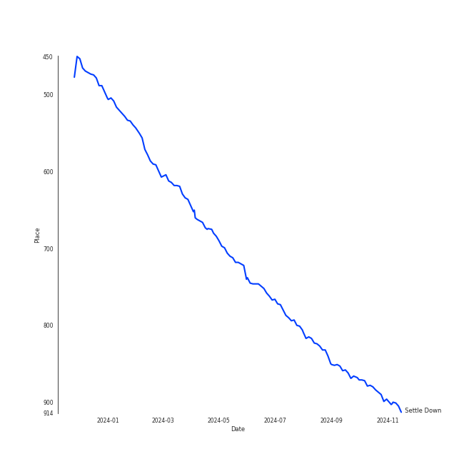

# Tracks in A Cappella from 2013

## Artists

| Art | Tracks | 💚 | Artist | 🔗 |
|:---|---:|---:|:---|:---|
|  | 7 | 6 | [The Tarpeggios](../../../artists/the_tarpeggios/overview.md) | [🔗](https://open.spotify.com/artist/2HXd5pFHJyaQJr5aXfErrE) |
|  | 7 | 3 | [Pentatonix](../../../artists/pentatonix/overview.md) | [🔗](https://open.spotify.com/artist/26AHtbjWKiwYzsoGoUZq53) |
|  | 6 | 0 | GQ | [🔗](https://open.spotify.com/artist/6JYedwPn7zEWlTSUda9mev) |
|  | 6 | 0 | Tar Heel Voices | [🔗](https://open.spotify.com/artist/1apO6pJsV1nwuF2K8sEsDo) |
|  | 5 | 0 | Ithacappella | [🔗](https://open.spotify.com/artist/5bPTIGQvxRNjr6wl9yyAct) |
|  | 3 | 0 | The King's Singers | [🔗](https://open.spotify.com/artist/5lR7yDVN4z9kahOiUSlMhe) |
|  | 2 | 0 | SoCal VoCals | [🔗](https://open.spotify.com/artist/5L30XpwHG77eWCZtelTns9) |
|  | 2 | 0 | The Swingle Singers | [🔗](https://open.spotify.com/artist/1ZlFYysRdc6YaUH5FkxPl8) |
| | 1 | 0 | Shams Ahmed | [🔗](https://open.spotify.com/artist/7rIkgg1ozqQIezA7c8Khf4) |
|  | 1 | 0 | Vanderbilt Melodores | [🔗](https://open.spotify.com/artist/7HkF8fT7TZlrQsjSgWUEXN) |

View all

| Art | Tracks | 💚 | Artist | 🔗 |
|:---|---:|---:|:---|:---|
| | 1 | 0 | Roxorloops & Blady Kris | [🔗](https://open.spotify.com/artist/6HRJOlHBoo07WcZdXZAADI) |
|  | 1 | 0 | The Clef Hangers | [🔗](https://open.spotify.com/artist/5wUTXZIMX0mn6MzFA13qfO) |
|  | 1 | 0 | Mike Love | [🔗](https://open.spotify.com/artist/5gr5OoQ4aQdJ3CqOr9v7Bt) |
|  | 1 | 0 | University of Rochester YellowJackets | [🔗](https://open.spotify.com/artist/5PdBpsZXvnEbbTe1589fMO) |
|  | 1 | 0 | Andrew Lloyd Webber | [🔗](https://open.spotify.com/artist/4aP1lp10BRYZO658B2NwkG) |
|  | 1 | 0 | Brian Wilson | [🔗](https://open.spotify.com/artist/4Q82S0VzF8qlCb4PnSDurj) |
| | 1 | 0 | Emily Shanny | [🔗](https://open.spotify.com/artist/3oWiUIUDPWJmvB8wElpaO5) |
|  | 1 | 0 | Josquin des Prez | [🔗](https://open.spotify.com/artist/31f23hmZawdqgp0sECAzE8) |
| | 1 | 0 | Beejul Khatri | [🔗](https://open.spotify.com/artist/24SlCPf92d5VTzhI0ztENn) |
|  | 1 | 0 | The Nor'easters | [🔗](https://open.spotify.com/artist/1aLfVgwt8eBrpvHcutWmqe) |

## Albums

| Art | Tracks | 💚 | Album | Release Date | 🔗 |
|:---|---:|---:|:---|:---|:---|
|  | 7 | 6 | Carolina State of Mind | 2013-11-15 | [🔗](https://open.spotify.com/album/3zKusinRVxdC5s2wOPYBgX) |
|  | 7 | 3 | PTX, Vol. 2 | 2013-11-05 | [🔗](https://open.spotify.com/album/12dPqNFIdjiVFSHvtsDmzJ) |
|  | 6 | 0 | Keepin' it Low Key | 2013-01-18 | [🔗](https://open.spotify.com/album/4EmdqB8w7gEONRX5QLypQZ) |
|  | 6 | 0 | GQ | 2013-10-07 | [🔗](https://open.spotify.com/album/3Op25RElrVsFcte612zusf) |
|  | 5 | 0 | The Party Upstairs | 2013-12-13 | [🔗](https://open.spotify.com/album/2AIAKP2FxbYNjmwQgAkqZz) |
|  | 3 | 0 | Cappella | 2013 | [🔗](https://open.spotify.com/album/3n6JxpdWnHkazMCQxKK5qI) |
|  | 2 | 0 | Weather To Fly | 2013-09-16 | [🔗](https://open.spotify.com/album/2AW4oP7GeAcKOWRY5x7O0o) |
|  | 2 | 0 | Permit to Harmonize | 2013-03-01 | [🔗](https://open.spotify.com/album/4aHUBNFRDR1DzCO8GULLTD) |
|  | 1 | 0 | Voices Only 2013 College A Cappella, Vol. 1 | 2013-08-01 | [🔗](https://open.spotify.com/album/6zr4GyBIMy2GRvIGPflYaK) |
|  | 1 | 0 | The Mallard | 2013-04-13 | [🔗](https://open.spotify.com/album/2IV5LQ4DzCjAIVwYZMHYgo) |

View all

| Art | Tracks | 💚 | Album | Release Date | 🔗 |
|:---|---:|---:|:---|:---|:---|
|  | 1 | 0 | Equilibrium | 2013-11-17 | [🔗](https://open.spotify.com/album/6BeTGjWVDQLQhdSM5MBziy) |
|  | 1 | 0 | Encore | 2013-05-03 | [🔗](https://open.spotify.com/album/1AN2Vv5PecNjJEmzys8Gru) |

## Tracks

| Art | Track | Album | Artists | Label | Rank | 💚 | 🔗 |
|:---|:---|:---|:---|:---|---:|:---|:---|
|  | Settle Down | Carolina State of Mind | [The Tarpeggios](../../../artists/the_tarpeggios/overview.md) | [The Tarpeggios](../../../labels/the_tarpeggios) | 654 | 💚 | [🔗](https://open.spotify.com/track/2RGGnyqlJ65QcpA4FggZ2x) |
|  | All I Ask of You | Cappella | Andrew Lloyd Webber, The King's Singers | [Sony Classical](../../../labels/sony_classical), [Sony Music Labels Inc.](../../../labels/sony_music_labels_inc_) | nan | | [🔗](https://open.spotify.com/track/5JTRLqApDZKaIwcopt1d9p) |
|  | Ave Maria | Cappella | Josquin des Prez, The King's Singers | [Sony Classical](../../../labels/sony_classical), [Sony Music Labels Inc.](../../../labels/sony_music_labels_inc_) | nan | | [🔗](https://open.spotify.com/track/6xBGuah2AMT6y5S0HlztUU) |
|  | Good Vibrations | Cappella | Brian Wilson, Mike Love, The King's Singers | [Sony Classical](../../../labels/sony_classical), [Sony Music Labels Inc.](../../../labels/sony_music_labels_inc_) | nan | | [🔗](https://open.spotify.com/track/14LgsPIZ7xKsfkM50VjxuA) |
|  | Easy | Keepin' it Low Key | Tar Heel Voices | [A Cappella Records](../../../labels/a_cappella_records) | nan | | [🔗](https://open.spotify.com/track/37vwAtZv5XEbpg0uetfdcB) |
|  | Happy Ending | Keepin' it Low Key | Tar Heel Voices | [A Cappella Records](../../../labels/a_cappella_records) | nan | | [🔗](https://open.spotify.com/track/72bpNdFjmdbiLFGV1w92RY) |
|  | Machine Gun | Keepin' it Low Key | Tar Heel Voices | [A Cappella Records](../../../labels/a_cappella_records) | nan | | [🔗](https://open.spotify.com/track/3p0txIEAiyVi0MBOd0AkmR) |
|  | Only the Good Die Young | Keepin' it Low Key | Tar Heel Voices | [A Cappella Records](../../../labels/a_cappella_records) | nan | | [🔗](https://open.spotify.com/track/3OERzUoUYTsAOarTBVQcMw) |
|  | Samson | Keepin' it Low Key | Tar Heel Voices | [A Cappella Records](../../../labels/a_cappella_records) | nan | | [🔗](https://open.spotify.com/track/4GkzthA7aLCGzoP7vuZj7t) |
|  | Wally | Keepin' it Low Key | Tar Heel Voices | [A Cappella Records](../../../labels/a_cappella_records) | nan | | [🔗](https://open.spotify.com/track/4dY5fF23LOemKIA9Q2uzxZ) |

View all

| Art | Track | Album | Artists | Label | Rank | 💚 | 🔗 |
|:---|:---|:---|:---|:---|---:|:---|:---|
|  | Hold My Heart | Permit to Harmonize | SoCal VoCals | SoCal VoCals | nan | | [🔗](https://open.spotify.com/track/1oyljwybETBhXYENumATMa) |
|  | Poison & Wine | Permit to Harmonize | SoCal VoCals | SoCal VoCals | nan | | [🔗](https://open.spotify.com/track/0e1lJVRsuzBjkXy73BpMq6) |
|  | Some Nights | The Mallard | The Clef Hangers | The Clef Hangers | nan | | [🔗](https://open.spotify.com/track/553aS2CmFAuIlw8JKeN2q8) |
|  | Cough Syrup | Encore | Vanderbilt Melodores | [A Cappella Records](../../../labels/a_cappella_records) | nan | | [🔗](https://open.spotify.com/track/4Wzi8j1QMFE10SDbe2r1VB) |
|  | Waka Waka (This Time for Africa) | Voices Only 2013 College A Cappella, Vol. 1 | University of Rochester YellowJackets | Voices Only A Cappella | nan | | [🔗](https://open.spotify.com/track/37x7PLzv5rAxTZAgfCInUx) |
|  | Libertango | Weather To Fly | The Swingle Singers | world village | nan | | [🔗](https://open.spotify.com/track/1gJS3bMQ5B6z9PxVrr7F2Y) |
|  | Poor Wayfaring Stranger | Weather To Fly | The Swingle Singers | world village | nan | | [🔗](https://open.spotify.com/track/3vZI7kzLJgzZEVu8hB1ZTS) |
|  | Fly Away - Intro | GQ | GQ | Option C Records | nan | | [🔗](https://open.spotify.com/track/0IdDyJeQXKg0KkwabitLmk) |
|  | Fly Away - Reprise | GQ | GQ | Option C Records | nan | | [🔗](https://open.spotify.com/track/4DZcIScN0K45rFv4CYD8cz) |
|  | I'm into Something Good / Happy Together | GQ | GQ | Option C Records | nan | | [🔗](https://open.spotify.com/track/647bpZBwa3ieLL4n3z39r5) |
|  | Plain Gold Ring | GQ | GQ | Option C Records | nan | | [🔗](https://open.spotify.com/track/3HQKqgiyuRAOYzRlOk0CzI) |
|  | Timshel | GQ | GQ | Option C Records | nan | | [🔗](https://open.spotify.com/track/5GtzG4nMm0DD4nlQp15uOn) |
|  | You Are My Sunshine | GQ | GQ | Option C Records | nan | | [🔗](https://open.spotify.com/track/2onWKiQV1I8I5Q0Nx45yoa) |
|  | Daft Punk | PTX, Vol. 2 | [Pentatonix](../../../artists/pentatonix/overview.md) | [RCA Records Label](../../../labels/rca_records_label) | nan | 💚 | [🔗](https://open.spotify.com/track/6ukvsBzq4d1vBsAUmz7ZVt) |
|  | Hey Momma / Hit the Road Jack | PTX, Vol. 2 | [Pentatonix](../../../artists/pentatonix/overview.md) | [RCA Records Label](../../../labels/rca_records_label) | nan | | [🔗](https://open.spotify.com/track/2wUZek0zWyw5mGKoT8mRcG) |
|  | I Need Your Love | PTX, Vol. 2 | [Pentatonix](../../../artists/pentatonix/overview.md) | [RCA Records Label](../../../labels/rca_records_label) | nan | | [🔗](https://open.spotify.com/track/11tQS3cthRT6guY7WkTypx) |
|  | Love Again | PTX, Vol. 2 | [Pentatonix](../../../artists/pentatonix/overview.md) | [RCA Records Label](../../../labels/rca_records_label) | nan | | [🔗](https://open.spotify.com/track/0vcyzDe6aoYTg6jM0U0T9r) |
|  | Natural Disaster | PTX, Vol. 2 | [Pentatonix](../../../artists/pentatonix/overview.md) | [RCA Records Label](../../../labels/rca_records_label) | nan | | [🔗](https://open.spotify.com/track/04nemEju86ULMJ1iy6EAsF) |
|  | Run to You | PTX, Vol. 2 | [Pentatonix](../../../artists/pentatonix/overview.md) | [RCA Records Label](../../../labels/rca_records_label) | nan | 💚 | [🔗](https://open.spotify.com/track/1bukNCD9JEwNp235Ov0iZH) |
|  | Valentine | PTX, Vol. 2 | [Pentatonix](../../../artists/pentatonix/overview.md) | [RCA Records Label](../../../labels/rca_records_label) | nan | 💚 | [🔗](https://open.spotify.com/track/5djjmpqAOlne6d5RSHQmvu) |
|  | Carolina State of Mind | Carolina State of Mind | [The Tarpeggios](../../../artists/the_tarpeggios/overview.md) | [The Tarpeggios](../../../labels/the_tarpeggios) | nan | 💚 | [🔗](https://open.spotify.com/track/60xweUiIfi93UhZEDN3DKY) |
|  | Chariot | Carolina State of Mind | [The Tarpeggios](../../../artists/the_tarpeggios/overview.md) | [The Tarpeggios](../../../labels/the_tarpeggios) | nan | | [🔗](https://open.spotify.com/track/0of5rsasONYN34mx4rSgsn) |
|  | Home | Carolina State of Mind | [The Tarpeggios](../../../artists/the_tarpeggios/overview.md) | [The Tarpeggios](../../../labels/the_tarpeggios) | nan | 💚 | [🔗](https://open.spotify.com/track/5EiVVKFfodbFiHTCFEB1i3) |
|  | I Knew You Were Trouble | Carolina State of Mind | [The Tarpeggios](../../../artists/the_tarpeggios/overview.md) | [The Tarpeggios](../../../labels/the_tarpeggios) | nan | 💚 | [🔗](https://open.spotify.com/track/2uB0wu6NOxNAEYmKvf1VDi) |
|  | Lullabye (Goodnight, My Angel) | Carolina State of Mind | [The Tarpeggios](../../../artists/the_tarpeggios/overview.md) | [The Tarpeggios](../../../labels/the_tarpeggios) | nan | 💚 | [🔗](https://open.spotify.com/track/4OXK8cslw5QGKzk6U1yRfU) |
|  | The Scientist | Carolina State of Mind | [The Tarpeggios](../../../artists/the_tarpeggios/overview.md) | [The Tarpeggios](../../../labels/the_tarpeggios) | nan | 💚 | [🔗](https://open.spotify.com/track/6NOjptrSCGSEr6vvSQuDmC) |
|  | Sincerely, Jane | Equilibrium | The Nor'easters, Shams Ahmed, Emily Shanny, Beejul Khatri | The Nor'easters | nan | | [🔗](https://open.spotify.com/track/0hOFlYJaWWzMjHZJUl79mo) |
|  | I Won't Give Up | The Party Upstairs | Ithacappella | [Ithacappella](../../../labels/ithacappella) | nan | | [🔗](https://open.spotify.com/track/4fK1ojDf3LYPh4KhNWoQFi) |
|  | Some Nights | The Party Upstairs | Ithacappella | [Ithacappella](../../../labels/ithacappella) | nan | | [🔗](https://open.spotify.com/track/5ys1Y4xf0vaKR8HjonRl21) |
|  | The Man Who Can't Be Moved | The Party Upstairs | Ithacappella | [Ithacappella](../../../labels/ithacappella) | nan | | [🔗](https://open.spotify.com/track/6wUSJugAinSVEgJu8S50Ou) |
|  | Too Close (feat. Roxorloops & Blady Kris) | The Party Upstairs | Ithacappella, Roxorloops & Blady Kris | [Ithacappella](../../../labels/ithacappella) | nan | | [🔗](https://open.spotify.com/track/3mTJZn9RT8dd9cOXLq3Kgj) |
|  | We Found Love | The Party Upstairs | Ithacappella | [Ithacappella](../../../labels/ithacappella) | nan | | [🔗](https://open.spotify.com/track/4p2CmpzQB1PzgCssyQepPg) |

