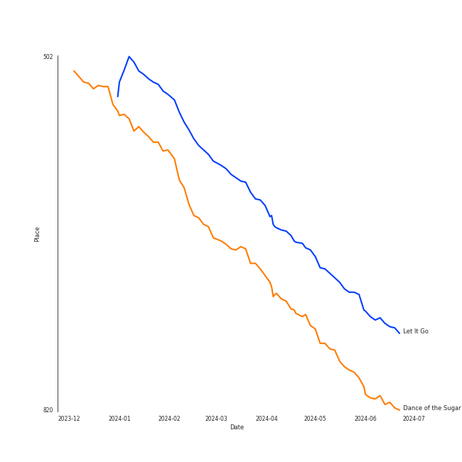

# Tracks in A Cappella from 2015

## Artists

| Art | Tracks | 💚 | Artist | 🔗 |
|:---|---:|---:|:---|:---|
|  | 6 | 2 | [Pentatonix](../../../artists/pentatonix/overview.md) | [🔗](https://open.spotify.com/artist/26AHtbjWKiwYzsoGoUZq53) |
|  | 1 | 1 | Tink | [🔗](https://open.spotify.com/artist/4v6XOdonnfpdTKTRJArG7v) |
|  | 1 | 1 | [Jason Derulo](../../../artists/jason_derulo/overview.md) | [🔗](https://open.spotify.com/artist/07YZf4WDAMNwqr4jfgOZ8y) |
|  | 6 | 0 | Vanderbilt Melodores | [🔗](https://open.spotify.com/artist/7HkF8fT7TZlrQsjSgWUEXN) |
|  | 4 | 0 | Tar Heel Voices | [🔗](https://open.spotify.com/artist/1apO6pJsV1nwuF2K8sEsDo) |
|  | 2 | 0 | University of Rochester Midnight Ramblers | [🔗](https://open.spotify.com/artist/2Tv49uvEsNJXUpuFL7HuKu) |
|  | 2 | 0 | Mosaic Whispers | [🔗](https://open.spotify.com/artist/0fP33MCfVUaPivyFYLZtoh) |
|  | 1 | 0 | University of Rochester YellowJackets | [🔗](https://open.spotify.com/artist/5PdBpsZXvnEbbTe1589fMO) |
|  | 1 | 0 | Vocal Point (University of Delaware) | [🔗](https://open.spotify.com/artist/4nrhXBXu7FnxWeSbB21bfk) |
| | 1 | 0 | University of Michigan G-Men | [🔗](https://open.spotify.com/artist/1jANAnjCBrwxiT4c33eeNc) |

## Albums

| Art | Tracks | 💚 | Album | Release Date | 🔗 |
|:---|---:|---:|:---|:---|:---|
|  | 6 | 0 | M | 2015-03-30 | [🔗](https://open.spotify.com/album/1B0XzLFo4XYh8QIwPRTdpR) |
|  | 4 | 2 | Pentatonix (Deluxe Version) | 2015-10-16 | [🔗](https://open.spotify.com/album/6qf9tE8pNRW0kX1Cucrixr) |
|  | 4 | 0 | 1988 | 2015-05-19 | [🔗](https://open.spotify.com/album/6nktHqHKPt8kT4ozUJvwrs) |
|  | 3 | 0 | BOCA 2016: Best Of College A Cappella | 2015-12-15 | [🔗](https://open.spotify.com/album/2AOr4esohQurJGXklhRH1a) |
|  | 2 | 0 | Wavelength | 2015-04-10 | [🔗](https://open.spotify.com/album/56RyapLbZ4DESHfzD87X7F) |
|  | 2 | 0 | That's Christmas To Me (Deluxe Edition) | 2015-10-30 | [🔗](https://open.spotify.com/album/082VlX7cBth0o8xqDGclNn) |
|  | 2 | 0 | Déjà Blue | 2015-04-11 | [🔗](https://open.spotify.com/album/1mZNLR8qY6GhhrnCmtEAv3) |

## Tracks

| Art | Track | Album | Artists | Label | Rank | 💚 | 🔗 |
|:---|:---|:---|:---|:---|---:|:---|:---|
|  | Let It Go | That's Christmas To Me (Deluxe Edition) | [Pentatonix](../../../artists/pentatonix/overview.md) | [RCA Records Label](../../../labels/rca_records_label) | 659 | | [🔗](https://open.spotify.com/track/2G7K3Op9y3HhqrF2TdHP95) |
|  | Dance of the Sugar Plum Fairy | That's Christmas To Me (Deluxe Edition) | [Pentatonix](../../../artists/pentatonix/overview.md) | [RCA Records Label](../../../labels/rca_records_label) | 721 | | [🔗](https://open.spotify.com/track/0u0TlASkQWH2bGIZRu0HLh) |
|  | Bang Bang | M | Vanderbilt Melodores | Vanderbilt Melodores | nan | | [🔗](https://open.spotify.com/track/1UOM0rw7bL6ABrJJdCQVGS) |
|  | Colder Weather | M | Vanderbilt Melodores | Vanderbilt Melodores | nan | | [🔗](https://open.spotify.com/track/6ZlO7zjdkGguzlzqETjQWX) |
|  | I Will Follow You Into the Dark | M | Vanderbilt Melodores | Vanderbilt Melodores | nan | | [🔗](https://open.spotify.com/track/0pSpcp8H6Uz0YYTstd6TQd) |
|  | Stay With Me | M | Vanderbilt Melodores | Vanderbilt Melodores | nan | | [🔗](https://open.spotify.com/track/4RmV6pCVugq1eRjVyAFif0) |
|  | Take Me To Church | M | Vanderbilt Melodores | Vanderbilt Melodores | nan | | [🔗](https://open.spotify.com/track/3V9QTe9fMUYNts2DQMk6kx) |
|  | Uptown Funk | M | Vanderbilt Melodores | Vanderbilt Melodores | nan | | [🔗](https://open.spotify.com/track/5HonIiodFfMQo6ThSI24Xy) |
|  | Crazy In Love | Wavelength | Mosaic Whispers | Mosaic Whispers | nan | | [🔗](https://open.spotify.com/track/0QC4u321fMlZlCJ46vk5uW) |
|  | There Goes My Baby | Wavelength | Mosaic Whispers | Mosaic Whispers | nan | | [🔗](https://open.spotify.com/track/5914Jx2xX9GLN2saFuKJk1) |

View all

| Art | Track | Album | Artists | Label | Rank | 💚 | 🔗 |
|:---|:---|:---|:---|:---|---:|:---|:---|
|  | If I Ain't Got You | Déjà Blue | University of Rochester Midnight Ramblers | The University of Rochester Midnight Ramblers | nan | | [🔗](https://open.spotify.com/track/3uzpLD83HIswicPyNjIAeV) |
|  | Somebody to Love | Déjà Blue | University of Rochester Midnight Ramblers | The University of Rochester Midnight Ramblers | nan | | [🔗](https://open.spotify.com/track/1eFGyhxh3mhU2UhO43cikk) |
|  | Can't Take My Eyes Off You | 1988 | Tar Heel Voices | Tar Heel Voices | nan | | [🔗](https://open.spotify.com/track/421iteTHiwbWZneFqAUQpS) |
|  | Chandelier | 1988 | Tar Heel Voices | Tar Heel Voices | nan | | [🔗](https://open.spotify.com/track/18wXABY4rT8OWkluEuXir0) |
|  | Counting Stars | 1988 | Tar Heel Voices | Tar Heel Voices | nan | | [🔗](https://open.spotify.com/track/497vByhCSwcQHKrLOqsXgA) |
|  | Say Something | 1988 | Tar Heel Voices | Tar Heel Voices | nan | | [🔗](https://open.spotify.com/track/2lXAm7golSL8XPCJiv8qVS) |
|  | Can't Sleep Love | Pentatonix (Deluxe Version) | [Pentatonix](../../../artists/pentatonix/overview.md) | [RCA Records Label](../../../labels/rca_records_label) | nan | | [🔗](https://open.spotify.com/track/1klGbW5a9qTBFUjFfddbmU) |
|  | Can't Sleep Love (feat. Tink) | Pentatonix (Deluxe Version) | [Pentatonix](../../../artists/pentatonix/overview.md), Tink | [RCA Records Label](../../../labels/rca_records_label) | nan | 💚 | [🔗](https://open.spotify.com/track/1GXFYdKM6MNrogE2PacpKe) |
|  | If I Ever Fall In Love (feat. Jason Derulo) | Pentatonix (Deluxe Version) | [Pentatonix](../../../artists/pentatonix/overview.md), [Jason Derulo](../../../artists/jason_derulo/overview.md) | [RCA Records Label](../../../labels/rca_records_label) | nan | 💚 | [🔗](https://open.spotify.com/track/3vaWsG3oKZt0bSra2p5c5R) |
|  | Na Na Na | Pentatonix (Deluxe Version) | [Pentatonix](../../../artists/pentatonix/overview.md) | [RCA Records Label](../../../labels/rca_records_label) | nan | | [🔗](https://open.spotify.com/track/6v08G3CGcoyiODIWZoOxR4) |
|  | Bang Bang | BOCA 2016: Best Of College A Cappella | University of Rochester YellowJackets | [Varsity Vocals](../../../labels/varsity_vocals) | nan | | [🔗](https://open.spotify.com/track/41O5Dh0QQF7x8djeNhCHzK) |
|  | Break Free | BOCA 2016: Best Of College A Cappella | Vocal Point (University of Delaware) | [Varsity Vocals](../../../labels/varsity_vocals) | nan | | [🔗](https://open.spotify.com/track/1ytCzhV54aRqPpMMxhiQGD) |
|  | Skinny Love | BOCA 2016: Best Of College A Cappella | University of Michigan G-Men | [Varsity Vocals](../../../labels/varsity_vocals) | nan | | [🔗](https://open.spotify.com/track/6PWPv9j5TcbDd9LjJC7s5W) |

