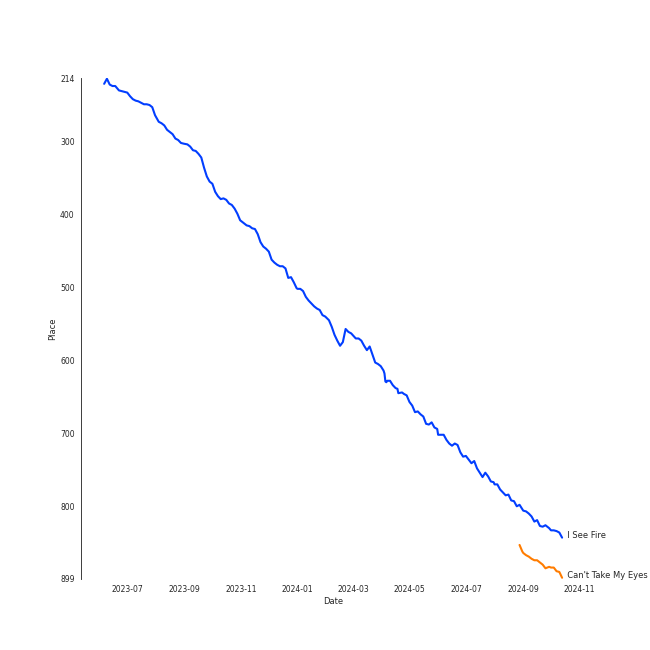

# Tracks in A Cappella from 2016

## Artists

| Art | Rank | Tracks | 💚 | Artist | 🔗 |
|:---|---:|---:|---:|:---|:---|
|  | 44 | 9 | 7 | [The Tarpeggios](../../../artists/the_tarpeggios/overview.md) | [🔗](https://open.spotify.com/artist/2HXd5pFHJyaQJr5aXfErrE) |
|  | 195 | 1 | 1 | Stella Jang | [🔗](https://open.spotify.com/artist/2Y9AUayH5pyZpVfkDYDfJV) |
|  | 421 | 8 | 0 | Peter Hollens | [🔗](https://open.spotify.com/artist/7EIbKyiLnEJ1Y074UIUyZJ) |
|  | 421 | 5 | 0 | UNC Achordants | [🔗](https://open.spotify.com/artist/1TzZMeOCs4TMYtzgohPMAr) |
|  | 421 | 4 | 0 | The Nor'easters | [🔗](https://open.spotify.com/artist/1aLfVgwt8eBrpvHcutWmqe) |
|  | 421 | 3 | 0 | GQ | [🔗](https://open.spotify.com/artist/6JYedwPn7zEWlTSUda9mev) |
|  | 421 | 3 | 0 | The Loreleis | [🔗](https://open.spotify.com/artist/1fqMjreaczGwFmdmG6AvJs) |
| | 421 | 1 | 0 | Florida State University All-Night Yahtzee | [🔗](https://open.spotify.com/artist/7hpsmZ7DZukPPg1dR2wqAy) |
| | 421 | 1 | 0 | University of Wisconsin-Madison Fundamentally Sound | [🔗](https://open.spotify.com/artist/7f7ezoLEjOp1K0qDSosU80) |
|  | 421 | 1 | 0 | SoCal VoCals | [🔗](https://open.spotify.com/artist/5L30XpwHG77eWCZtelTns9) |

View all

| Art | Rank | Tracks | 💚 | Artist | 🔗 |
|:---|---:|---:|---:|:---|:---|
|  | 421 | 1 | 0 | The Pitchforks | [🔗](https://open.spotify.com/artist/5IPABE7EhPLvUVsgM3dlZ8) |
|  | 421 | 1 | 0 | Taylor Davis | [🔗](https://open.spotify.com/artist/480xKab3lUPhBBnCzlzqIu) |
|  | 421 | 1 | 0 | Voices in Your Head | [🔗](https://open.spotify.com/artist/44v8JgDySt9tkgfV3AWxBJ) |
|  | 421 | 1 | 0 | Decadence | [🔗](https://open.spotify.com/artist/3uBUg8TtKXz6m3wY5aXa9I) |
|  | 421 | 1 | 0 | Tim Foust | [🔗](https://open.spotify.com/artist/2VtwFbDZzIoT9ZD0uR5HHD) |
|  | 421 | 1 | 0 | Hank Green | [🔗](https://open.spotify.com/artist/2SQVGFEgP0UZTZC1re2ECh) |

## Albums

| Art | Rank | Tracks | 💚 | Album | Release Date | 🔗 |
|:---|---:|---:|---:|:---|:---|:---|
|  | 533 | 9 | 7 | The Teal Album | 2016-11-12 | [🔗](https://open.spotify.com/album/7mTQ62MIYHSbkZHGjY0Ftg) |
|  | 621 | 8 | 0 | Misty Mountains: Songs Inspired by The Hobbit and Lord of the Rings | 2016-03-18 | [🔗](https://open.spotify.com/album/4GYDt4IqU8EZ6KJLHpPuOK) |
|  | 621 | 6 | 0 | BOCA 2013: Best of College A Cappella | 2016 | [🔗](https://open.spotify.com/album/6Pqey2mc4EWSfYNH3bifbO) |
|  | 621 | 4 | 0 | Greene St. | 2016 | [🔗](https://open.spotify.com/album/3qJMqi0VzTFGSDTTMUI5n7) |
|  | 621 | 3 | 0 | Sincerely, | 2016-03-22 | [🔗](https://open.spotify.com/album/4szRoyYFWqLMea8NLx2TpL) |
|  | 621 | 3 | 0 | RISE | 2016-02-09 | [🔗](https://open.spotify.com/album/6V8819n4bdv7dA5mFdCIAo) |
|  | 621 | 3 | 0 | GQ, Vol. II | 2016-07-21 | [🔗](https://open.spotify.com/album/71Z9gNhhrz6jhIC272Yt24) |
|  | 621 | 1 | 1 | Colors | 2016-10-06 | [🔗](https://open.spotify.com/album/419WgjPNItZIDgjd1GSgrO) |
|  | 621 | 1 | 0 | VoCabulary | 2016-05-03 | [🔗](https://open.spotify.com/album/6QTtvpKN8GebVCKsx8YRmJ) |
|  | 621 | 1 | 0 | High Stakes Old Maid | 2016 | [🔗](https://open.spotify.com/album/6sg9WsK06H588Y5VOmwj37) |

## Tracks

| Art | Track | Album | Artists | Label | Rank | 💚 | 🔗 |
|:---|:---|:---|:---|:---|---:|:---|:---|
|  | I See Fire | The Teal Album | [The Tarpeggios](../../../artists/the_tarpeggios/overview.md) | The Unc - Chapel Hill Tarpeggios | 803 | 💚 | [🔗](https://open.spotify.com/track/4Mp2l1tCHxnm65a6yQ8lph) |
|  | Aha! | BOCA 2013: Best of College A Cappella | Florida State University All-Night Yahtzee | [Varsity Vocals](../../../labels/varsity_vocals) | 938 | | [🔗](https://open.spotify.com/track/7Lx4TW1CMmHVP5ZiNGyi9H) |
|  | All Of The Lights | BOCA 2013: Best of College A Cappella | The Pitchforks | [Varsity Vocals](../../../labels/varsity_vocals) | 938 | | [🔗](https://open.spotify.com/track/25Cnsylo80N1bX9CzSvCaE) |
|  | Smooth Criminal | BOCA 2013: Best of College A Cappella | University of Wisconsin-Madison Fundamentally Sound | [Varsity Vocals](../../../labels/varsity_vocals) | 938 | | [🔗](https://open.spotify.com/track/7kxwqVLwWMbkZKqm0GykBY) |
|  | Valerie | BOCA 2013: Best of College A Cappella | Decadence | [Varsity Vocals](../../../labels/varsity_vocals) | 938 | | [🔗](https://open.spotify.com/track/18OOiO2QFVNYwixjqj1jks) |
|  | We Found Love | BOCA 2013: Best of College A Cappella | Voices in Your Head | [Varsity Vocals](../../../labels/varsity_vocals) | 938 | | [🔗](https://open.spotify.com/track/00pw67OZKJyzydY9N2Orui) |
|  | Woods | BOCA 2013: Best of College A Cappella | The Nor'easters | [Varsity Vocals](../../../labels/varsity_vocals) | 938 | | [🔗](https://open.spotify.com/track/2ul4oLZzBFZK2zFaS0WcJF) |
|  | Little Lion Man | Greene St. | UNC Achordants | UNC Achordants | 938 | | [🔗](https://open.spotify.com/track/5Ww0iej75Ff6PqgvjF0nkR) |
|  | Sincerely Jane | Greene St. | UNC Achordants | UNC Achordants | 938 | | [🔗](https://open.spotify.com/track/1lrBOE36rDMg2HrNEarO5m) |
|  | Smooth | Greene St. | UNC Achordants | UNC Achordants | 938 | | [🔗](https://open.spotify.com/track/65AgP6Pa75doGVqSoyEVl3) |

View all

| Art | Track | Album | Artists | Label | Rank | 💚 | 🔗 |
|:---|:---|:---|:---|:---|---:|:---|:---|
|  | We All Need Saving | Greene St. | UNC Achordants | UNC Achordants | 938 | | [🔗](https://open.spotify.com/track/1pmXBVP9jTuMscTa5S9TOP) |
|  | Carry On Wayward Son | High Stakes Old Maid | UNC Achordants | [A Cappella Records](../../../labels/a_cappella_records) | 938 | | [🔗](https://open.spotify.com/track/20F6HiYBShG2uKe6eyX6JB) |
|  | Alive | RISE | The Nor'easters | The Nor'easters | 938 | | [🔗](https://open.spotify.com/track/7sBzLIvCknMuaSssdRqihX) |
|  | Elastic Heart | RISE | The Nor'easters | The Nor'easters | 938 | | [🔗](https://open.spotify.com/track/237OcsZneD4UBcBaNvcOPA) |
|  | Honeymoon Avenue | RISE | The Nor'easters | The Nor'easters | 938 | | [🔗](https://open.spotify.com/track/6ja6rwUZNNfk07xqaiKyTS) |
|  | Arwen's Song | Misty Mountains: Songs Inspired by The Hobbit and Lord of the Rings | Peter Hollens | [Peter Hollens](../../../labels/peter_hollens) | 938 | | [🔗](https://open.spotify.com/track/4H3LioOCKpZcE9jmvWqNcv) |
|  | Edge of Night | Misty Mountains: Songs Inspired by The Hobbit and Lord of the Rings | Peter Hollens | [Peter Hollens](../../../labels/peter_hollens) | 938 | | [🔗](https://open.spotify.com/track/0nBeUCpjIu62kLU3MFjZbL) |
|  | Gollum's Song | Misty Mountains: Songs Inspired by The Hobbit and Lord of the Rings | Peter Hollens | [Peter Hollens](../../../labels/peter_hollens) | 938 | | [🔗](https://open.spotify.com/track/61WvPK7oUmEeXJvdQx7Kd2) |
|  | Hobbit Drinking Medley | Misty Mountains: Songs Inspired by The Hobbit and Lord of the Rings | Peter Hollens, Hank Green | [Peter Hollens](../../../labels/peter_hollens) | 938 | | [🔗](https://open.spotify.com/track/3lO8g6FU5zQlzdfW3zxNQ0) |
|  | I See Fire | Misty Mountains: Songs Inspired by The Hobbit and Lord of the Rings | Peter Hollens, Taylor Davis | [Peter Hollens](../../../labels/peter_hollens) | 938 | | [🔗](https://open.spotify.com/track/3GDHe8EwGQMxDE1QuPitvw) |
|  | Into The West | Misty Mountains: Songs Inspired by The Hobbit and Lord of the Rings | Peter Hollens | [Peter Hollens](../../../labels/peter_hollens) | 938 | | [🔗](https://open.spotify.com/track/46ZN4mhFy9De1fjlHGbYze) |
|  | Misty Mountains | Misty Mountains: Songs Inspired by The Hobbit and Lord of the Rings | Peter Hollens, Tim Foust | [Peter Hollens](../../../labels/peter_hollens) | 938 | | [🔗](https://open.spotify.com/track/21sD95jUPmren2fGY0wxYE) |
|  | Song of the Lonely Mountain | Misty Mountains: Songs Inspired by The Hobbit and Lord of the Rings | Peter Hollens | [Peter Hollens](../../../labels/peter_hollens) | 938 | | [🔗](https://open.spotify.com/track/1Ht9LvTpP6bZezGCL2BRHP) |
|  | Bluebird | Sincerely, | The Loreleis | The Loreleis | 938 | | [🔗](https://open.spotify.com/track/1CxrAFGO31aaZyDdCKUmAI) |
|  | Elastic Heart | Sincerely, | The Loreleis | The Loreleis | 938 | | [🔗](https://open.spotify.com/track/3QLXMQMV2MOp66qHfgU5Lg) |
|  | Here | Sincerely, | The Loreleis | The Loreleis | 938 | | [🔗](https://open.spotify.com/track/6jCsjDAeVU2fvbBb7hZe8X) |
|  | Wayfaring Stranger | VoCabulary | SoCal VoCals | The SoCal VoCals | 938 | | [🔗](https://open.spotify.com/track/71WPmT3HvhdjHgGbxuQEmX) |
|  | Bei Mir Bist Du Schön | GQ, Vol. II | GQ | Option C Records | 938 | | [🔗](https://open.spotify.com/track/5t8Vp0SkxBJNJmtOZPu5u5) |
|  | Crabbuckit | GQ, Vol. II | GQ | Option C Records | 938 | | [🔗](https://open.spotify.com/track/7mgUbZEmuzs2TfXQNae4Dq) |
|  | How Great Thou Art | GQ, Vol. II | GQ | Option C Records | 938 | | [🔗](https://open.spotify.com/track/4mtfy4FhOni2BiidWoO4Kr) |
|  | Colors | Colors | Stella Jang | GRDL | 938 | 💚 | [🔗](https://open.spotify.com/track/1oACG26rFg4XwAkW5oGGUa) |
|  | A Case of You | The Teal Album | [The Tarpeggios](../../../artists/the_tarpeggios/overview.md) | The Unc - Chapel Hill Tarpeggios | 938 | 💚 | [🔗](https://open.spotify.com/track/6YwWeHUYCkRoGJWGtohs0j) |
|  | Blank Space | The Teal Album | [The Tarpeggios](../../../artists/the_tarpeggios/overview.md) | The Unc - Chapel Hill Tarpeggios | 938 | | [🔗](https://open.spotify.com/track/55uhowm3d20ahlHjQNa78b) |
|  | Bottom of the River | The Teal Album | [The Tarpeggios](../../../artists/the_tarpeggios/overview.md) | The Unc - Chapel Hill Tarpeggios | 938 | 💚 | [🔗](https://open.spotify.com/track/25XUZBlrcbb5U2fsJBY03P) |
|  | Build Me up Buttercup | The Teal Album | [The Tarpeggios](../../../artists/the_tarpeggios/overview.md) | The Unc - Chapel Hill Tarpeggios | 938 | 💚 | [🔗](https://open.spotify.com/track/7Gi0VBh0IsTbIncQGNJjv3) |
|  | Can't Take My Eyes off You | The Teal Album | [The Tarpeggios](../../../artists/the_tarpeggios/overview.md) | The Unc - Chapel Hill Tarpeggios | 938 | 💚 | [🔗](https://open.spotify.com/track/1wT7nx5HLq9mhBf3P0BwTf) |
|  | Candyman | The Teal Album | [The Tarpeggios](../../../artists/the_tarpeggios/overview.md) | The Unc - Chapel Hill Tarpeggios | 938 | 💚 | [🔗](https://open.spotify.com/track/1OEnvNhDx4iYvjKD8rIp89) |
|  | Chandelier | The Teal Album | [The Tarpeggios](../../../artists/the_tarpeggios/overview.md) | The Unc - Chapel Hill Tarpeggios | 938 | | [🔗](https://open.spotify.com/track/132bFFrU2GvmvebqUlO2qS) |
|  | Drag Me Down / As Long as You Love Me | The Teal Album | [The Tarpeggios](../../../artists/the_tarpeggios/overview.md) | The Unc - Chapel Hill Tarpeggios | 938 | 💚 | [🔗](https://open.spotify.com/track/3GqtzxfUrdmrApqEMaWggL) |

