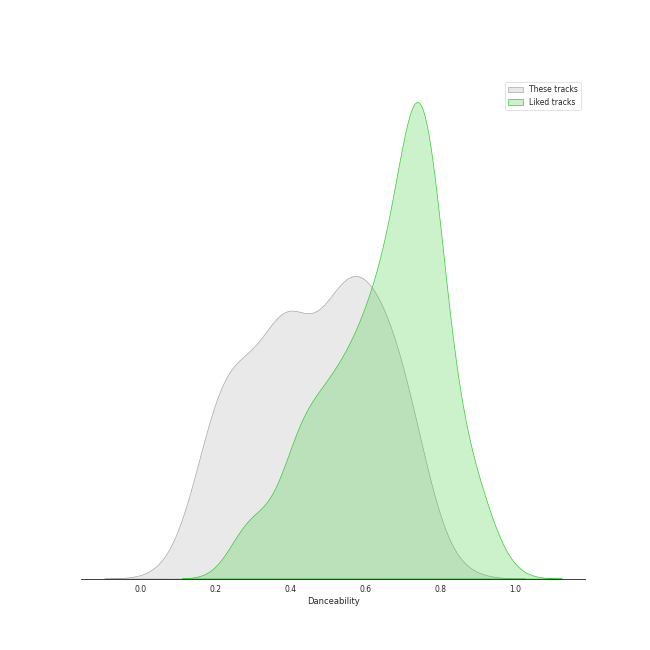
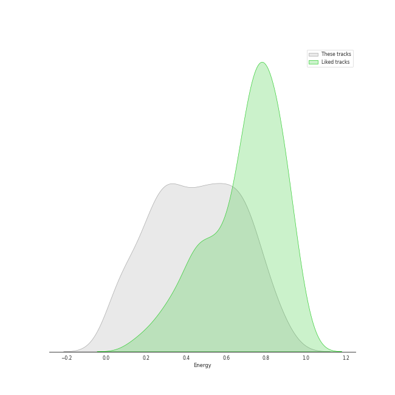
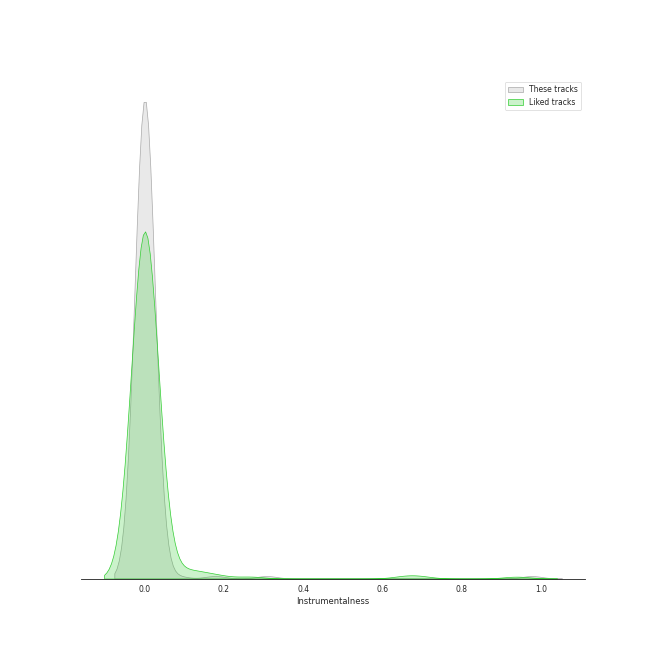
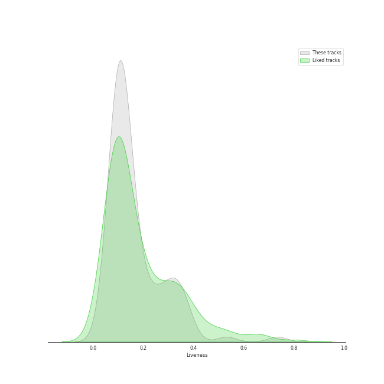
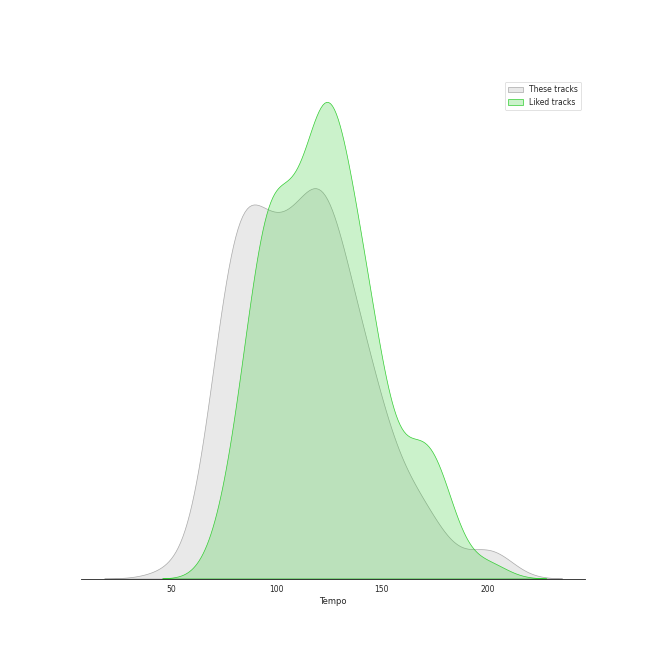

# Audio Features for A Cappella

## Danceability

| 10 most Danceable tracks | 10 least Danceable tracks |
|:---|:---|
| Uptown Funk (0.847) | Gollum's Song (0.0835) |
| Problem (0.834) | Bring Him Home (0.0972) |
| La Camisa Negra (0.812) | Ave Maria (0.15) |
| Rather Be (Clean Bandit Cover) (0.803) | Arwen's Song (0.157) |
| Settle Down (0.794) | The Music of the Night (0.168) |
| Sexyback (0.782) | Greensleeves (0.173) |
| Toxic (0.764) | The Water is Wide (0.174) |
| Finesse (0.763) | The End (Interlude) (0.176) |
| bad guy (0.76) | Bluebird (0.184) |
| The Fox (0.758) | Amazing Grace (0.187) |

## Energy

| 10 most Energetic tracks | 10 least Energetic tracks |
|:---|:---|
| Smooth Criminal (0.889) | Largo [Harpsichord Concerto No. 5 in F minor BWV 1056] (0.0156) |
| Misery Business (0.888) | And So It Goes (0.0387) |
| No Tears Left to Cry (0.885) | You Are My Sunshine (0.0465) |
| Don't Stop Me Now (0.883) | Shenandoah - Arr. Bob Chilcott (0.0468) |
| Elastic Heart (0.881) | Lullabye (Goodnight My Angel) (0.0495) |
| Russian Roulette (0.866) | Fly Away - Intro (0.0564) |
| Candyman (0.848) | Woods (0.0582) |
| Valerie (0.847) | How Great Thou Art (0.0598) |
| Finesse (0.836) | Run to You (0.0622) |
| Telephone (0.832) | All I Ask of You (0.0636) |

## Speechiness

| 10 most Speechy tracks | 10 least Speechy tracks |
|:---|:---|
| Hey Momma / Hit the Road Jack (0.433) | We Found Love (0.0244) |
| bad guy (0.384) | Samson (0.0256) |
| Hobbit Drinking Medley (0.378) | Chariot (0.0262) |
| Uptown Funk (0.34) | Machine Gun (0.0264) |
| Bang Bang (0.34) | The Scientist (0.0267) |
| Don't Stop Me Now (0.31) | Fields of Gold (0.027) |
| Candyman (0.236) | The Sound of Silence (0.0273) |
| Hamilton Medley (0.231) | We All Need Saving (0.0273) |
| I'd Like To (0.213) | Loch Lomond (0.0274) |
| Cry Me a River (0.19) | Demons (0.0276) |

## Acousticness

| 10 most Acoustic tracks | 10 least Acoustic tracks |
|:---|:---|
| Ave Maria (0.991) | I Need Your Love (0.00319) |
| Lullabye (Goodnight My Angel) (0.991) | Daft Punk (0.00403) |
| Shenandoah - Arr. Bob Chilcott (0.989) | The Baddest Girl (0.00637) |
| Amazing Grace (0.987) | Domino (0.0113) |
| Bring Him Home (0.984) | Chandelier (0.0115) |
| All I Ask of You (0.98) | Talk Dirty (0.017) |
| Lullabye (Goodnight My Angel) (0.976) | Starships (0.0176) |
| Walking in the Air (0.975) | We Are Young (0.02) |
| Largo [Harpsichord Concerto No. 5 in F minor BWV 1056] (0.973) | Problem (0.0204) |
| Prelude No.1 in C Major (0.972) | Wrecking Ball (0.0208) |

## Instrumentalness

| 10 most Instrumental tracks | 10 least Instrumental tracks |
|:---|:---|
| Prelude No.1 in C Major (0.977) | Say Something (0.0) |
| Libertango (0.809) | Natural Disaster (0.0) |
| Eine kleine Nachtmusik (0.653) | Brand New Jones (0.0) |
| You Take My Breath Away (0.308) | Hallelujah (0.0) |
| Lullabye (Goodnight My Angel) (0.178) | Closer (0.0) |
| Dance of the Sugar Plum Fairy (0.079) | Fly Away - Intro (0.0) |
| Here (In Your Arms) (0.0273) | Without Your Love (0.0) |
| Falling Slowly (0.019) | Poor Wayfaring Stranger (0.0) |
| Shenandoah - Arr. Bob Chilcott (0.0127) | Greensleeves (0.0) |
| Ave Maria (0.00671) | Phoenix (0.0) |

## Liveness

| 10 most Live tracks | 10 least Live tracks |
|:---|:---|
| Brand New Jones (0.926) | Settle Down (0.0381) |
| XS (0.869) | Paranoid Android (0.0416) |
| I'd Like To (0.738) | Bang Bang (0.0429) |
| Sound Of Silence (0.731) | Blank Space (0.044) |
| Smooth (0.534) | Africa (0.0464) |
| Talk Dirty (0.53) | Russian Roulette (0.0472) |
| Starships (0.447) | Finesse (0.0503) |
| Disturbia (0.429) | Lost in Japan (0.0508) |
| Bei Mir Bist Du Schön (0.391) | I Knew You Were Trouble (0.0531) |
| Havana (0.385) | Papaoutai (Stromae Cover) (feat. Lindsey Stirling) (0.0551) |

## Valence

| 10 most Happy tracks | 10 least Happy tracks |
|:---|:---|
| Big Yellow Taxi (0.924) | Shenandoah - Arr. Bob Chilcott (0.0364) |
| I Want You Back (0.91) | Gollum's Song (0.0366) |
| Attention (0.907) | You Take My Breath Away (0.0384) |
| Finesse (0.903) | Skinny Love (0.0387) |
| Na Na Na (0.862) | Bring Him Home (0.0388) |
| Domino (0.86) | You Are My Sunshine (0.0417) |
| Smooth (0.851) | Arwen's Song (0.0448) |
| The Fox (0.849) | The Sound of Silence (0.0476) |
| Toxic (0.842) | Ave Maria (0.0558) |
| I'd Like To (0.831) | The Music of the Night (0.0584) |

## Tempo

| 10 most Fast tracks | 10 least Fast tracks |
|:---|:---|
| Attention (204.19) | Gollum's Song (49.588) |
| Hey Momma / Hit the Road Jack (203.068) | The Prayer (62.132) |
| On The 4th Of July (199.616) | Bluebird (66.753) |
| Crazy In Love (198.465) | Shenandoah - Arr. Bob Chilcott (67.944) |
| The Man Who Can't Be Moved (198.008) | The Music of the Night (70.887) |
| Gunpowder & Lead (187.614) | Lullabye (Goodnight, My Angel) (72.306) |
| The Boxer (181.849) | The Water is Wide (72.35) |
| Carolina State of Mind (180.209) | Lullabye (Goodnight My Angel) (72.925) |
| Bring Him Home (179.945) | Speechless (72.971) |
| My Happy Ending (175.719) | Cry Me a River (72.975) |
