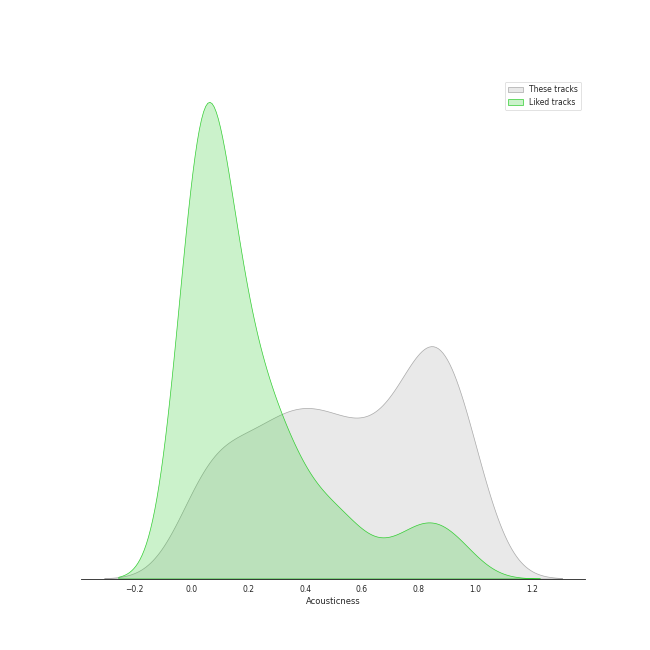
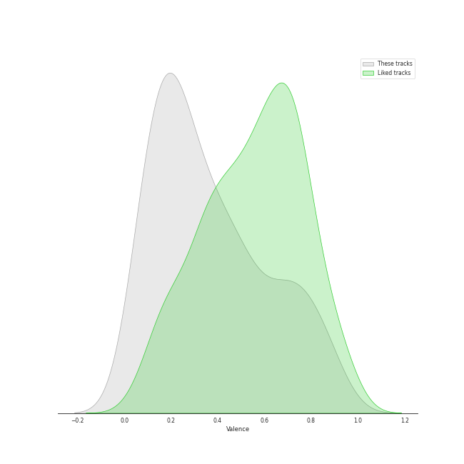

# Track Features for A Cappella

## Danceability

| ​ | 10 most Danceable tracks | ​​ | 10 least Danceable tracks |
|:---|:---|:---|:---|
|  | Uptown Funk (0.847) |  | Gollum's Song (0.0835) |
|  | Problem (0.834) |  | Bring Him Home (0.0972) |
|  | La Camisa Negra (0.812) |  | Ave Maria (0.15) |
|  | Rather Be (Clean Bandit Cover) (0.803) |  | Bridge Over Troubled Water (feat. John Legend & Tori Kelly) (0.153) |
|  | Settle Down (0.794) |  | Arwen's Song (0.157) |
|  | Sexyback (0.782) |  | The Music of the Night (0.168) |
|  | Toxic (0.764) |  | Greensleeves (0.173) |
|  | Finesse (0.763) |  | The Water is Wide (0.174) |
|  | bad guy (0.76) |  | The End (Interlude) (0.176) |
|  | The Fox (0.758) |  | Bluebird (0.184) |

## Energy

| ​ | 10 most Energetic tracks | ​​ | 10 least Energetic tracks |
|:---|:---|:---|:---|
|  | Smooth Criminal (0.889) |  | Largo [Harpsichord Concerto No. 5 in F minor BWV 1056] (0.0156) |
|  | Misery Business (0.888) |  | And So It Goes (0.0387) |
|  | No Tears Left to Cry (0.885) |  | You Are My Sunshine (0.0465) |
|  | Don't Stop Me Now (0.883) |  | Shenandoah - Arr. Bob Chilcott (0.0468) |
|  | Elastic Heart (0.881) |  | Lullabye (Goodnight My Angel) (0.0495) |
|  | Russian Roulette (0.866) |  | Fly Away - Intro (0.0564) |
|  | Candyman (0.848) |  | Woods (0.0582) |
|  | Valerie (0.847) |  | How Great Thou Art (0.0598) |
|  | Finesse (0.836) |  | Run to You (0.0622) |
|  | Telephone (0.832) |  | All I Ask of You (0.0636) |

## Speechiness

| ​ | 10 most Speechy tracks | ​​ | 10 least Speechy tracks |
|:---|:---|:---|:---|
|  | Hey Momma / Hit the Road Jack (0.433) |  | We Found Love (0.0244) |
|  | bad guy (0.384) |  | Samson (0.0256) |
|  | Hobbit Drinking Medley (0.378) |  | Chariot (0.0262) |
|  | Uptown Funk (0.34) |  | Machine Gun (0.0264) |
|  | Bang Bang (0.34) |  | The Scientist (0.0267) |
|  | Don't Stop Me Now (0.31) |  | Fields of Gold (0.027) |
|  | Candyman (0.236) |  | The Sound of Silence (0.0273) |
|  | Hamilton Medley (0.231) |  | We All Need Saving (0.0273) |
|  | I'd Like To (0.213) |  | Loch Lomond (0.0274) |
|  | Cry Me a River (0.19) |  | Demons (0.0276) |

## Acousticness

| ​ | 10 most Acoustic tracks | ​​ | 10 least Acoustic tracks |
|:---|:---|:---|:---|
|  | Ave Maria (0.991) |  | I Need Your Love (0.00319) |
|  | Lullabye (Goodnight My Angel) (0.991) |  | Daft Punk (0.00403) |
|  | Shenandoah - Arr. Bob Chilcott (0.989) |  | The Baddest Girl (0.00637) |
|  | Amazing Grace (0.987) |  | Domino (0.0113) |
|  | Bring Him Home (0.984) |  | Chandelier (0.0115) |
|  | All I Ask of You (0.98) |  | Honeymoon Avenue (0.0169) |
|  | Lullabye (Goodnight My Angel) (0.976) |  | Talk Dirty (0.017) |
|  | Walking in the Air (0.975) |  | Starships (0.0176) |
|  | Largo [Harpsichord Concerto No. 5 in F minor BWV 1056] (0.973) |  | We Are Young (0.02) |
|  | Prelude No.1 in C Major (0.972) |  | Problem (0.0204) |

## Instrumentalness

| ​ | 10 most Instrumental tracks | ​​ | 10 least Instrumental tracks |
|:---|:---|:---|:---|
|  | Prelude No.1 in C Major (0.977) |  | Say Something (0.0) |
|  | Libertango (0.809) |  | Natural Disaster (0.0) |
|  | Eine kleine Nachtmusik (0.653) |  | Brand New Jones (0.0) |
|  | You Take My Breath Away (0.308) |  | Hallelujah (0.0) |
|  | Lullabye (Goodnight My Angel) (0.178) |  | Closer (0.0) |
|  | Dance of the Sugar Plum Fairy (0.079) |  | Fly Away - Intro (0.0) |
|  | Here (In Your Arms) (0.0273) |  | Without Your Love (0.0) |
|  | Falling Slowly (0.019) |  | Poor Wayfaring Stranger (0.0) |
|  | Shenandoah - Arr. Bob Chilcott (0.0127) |  | Greensleeves (0.0) |
|  | Ave Maria (0.00671) |  | Phoenix (0.0) |

## Liveness

| ​ | 10 most Live tracks | ​​ | 10 least Live tracks |
|:---|:---|:---|:---|
|  | Brand New Jones (0.926) |  | Settle Down (0.0381) |
|  | XS (0.869) |  | Paranoid Android (0.0416) |
|  | I'd Like To (0.738) |  | Bang Bang (0.0429) |
|  | Sound Of Silence (0.731) |  | Blank Space (0.044) |
|  | Smooth (0.534) |  | Africa (0.0464) |
|  | Talk Dirty (0.53) |  | Russian Roulette (0.0472) |
|  | Starships (0.447) |  | Finesse (0.0503) |
|  | Disturbia (0.429) |  | Lost in Japan (0.0508) |
|  | Bei Mir Bist Du Schön (0.391) |  | I Knew You Were Trouble (0.0531) |
|  | Havana (0.385) |  | Papaoutai (Stromae Cover) (feat. Lindsey Stirling) (0.0551) |

## Valence

| ​ | 10 most Happy tracks | ​​ | 10 least Happy tracks |
|:---|:---|:---|:---|
|  | Big Yellow Taxi (0.924) |  | Shenandoah - Arr. Bob Chilcott (0.0364) |
|  | I Want You Back (0.91) |  | Gollum's Song (0.0366) |
|  | Attention (0.907) |  | You Take My Breath Away (0.0384) |
|  | Finesse (0.903) |  | Skinny Love (0.0387) |
|  | Na Na Na (0.862) |  | Bring Him Home (0.0388) |
|  | Domino (0.86) |  | You Are My Sunshine (0.0417) |
|  | Smooth (0.851) |  | Arwen's Song (0.0448) |
|  | The Fox (0.849) |  | The Sound of Silence (0.0476) |
|  | Toxic (0.842) |  | Ave Maria (0.0558) |
|  | I'd Like To (0.831) |  | The Music of the Night (0.0584) |

## Tempo

| ​ | 10 most Fast tracks | ​​ | 10 least Fast tracks |
|:---|:---|:---|:---|
|  | Attention (204.19) |  | Gollum's Song (49.588) |
|  | Hey Momma / Hit the Road Jack (203.068) |  | The Prayer (62.132) |
|  | On The 4th Of July (199.616) |  | Bluebird (66.753) |
|  | Crazy In Love (198.465) |  | Shenandoah - Arr. Bob Chilcott (67.944) |
|  | The Man Who Can't Be Moved (198.008) |  | The Music of the Night (70.887) |
|  | Gunpowder & Lead (187.614) |  | Lullabye (Goodnight, My Angel) (72.306) |
|  | The Boxer (181.849) |  | The Water is Wide (72.35) |
|  | Carolina State of Mind (180.209) |  | Lullabye (Goodnight My Angel) (72.925) |
|  | Bring Him Home (179.945) |  | Speechless (72.971) |
|  | My Happy Ending (175.719) |  | Cry Me a River (72.975) |
