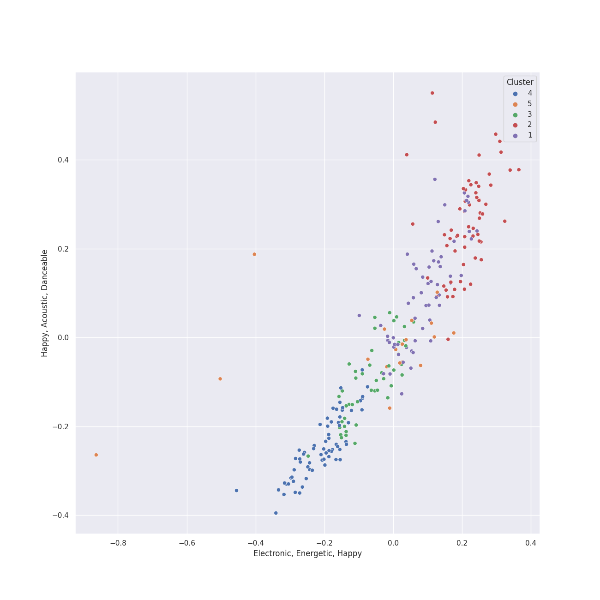

# Clusters in A Cappella

## Cluster #1

60 tracks

| Art | Track | Album | Artists | Label | Rank | 💚 | 🔗 |
|:---|:---|:---|:---|:---|---:|:---|:---|
|  | All Of The Lights | BOCA 2013: Best of College A Cappella | The Pitchforks | [Varsity Vocals](../../../../labels/varsity_vocals) | 1018 | | [🔗](https://open.spotify.com/track/25Cnsylo80N1bX9CzSvCaE) |
|  | Halo | Off the Hook | Ithacappella | [Ithacappella](../../../../labels/ithacappella) | 1018 | | [🔗](https://open.spotify.com/track/5qlpHkmxJntPok8hKIPcrY) |
|  | At the Beginning | At the Beginning | Peter Hollens, Evynne Hollens | [One Voice Productions, LLC](../../../../labels/one_voice_productions) | 1018 | | [🔗](https://open.spotify.com/track/4rONfUG09RBdY299o0rvm8) |
|  | Speechless | Quarter Past | Tar Heel Voices | [A Cappella Records](../../../../labels/a_cappella_records) | 1018 | | [🔗](https://open.spotify.com/track/3ibXraWcKcHr3ga4PKRY05) |
|  | Stand | BOCA 2023: Best Of College A Cappella | SoCal VoCals | [Varsity Vocals](../../../../labels/varsity_vocals) | 1018 | | [🔗](https://open.spotify.com/track/4dXYbR5E6WBXqheezAaZFP) |
|  | I Will Follow You Into the Dark | M | Vanderbilt Melodores | Vanderbilt Melodores | 1018 | | [🔗](https://open.spotify.com/track/0pSpcp8H6Uz0YYTstd6TQd) |
|  | Take Me To Church | M | Vanderbilt Melodores | Vanderbilt Melodores | 1018 | | [🔗](https://open.spotify.com/track/3V9QTe9fMUYNts2DQMk6kx) |
|  | Break Free | BOCA 2016: Best Of College A Cappella | Vocal Point (University of Delaware) | [Varsity Vocals](../../../../labels/varsity_vocals) | 1018 | | [🔗](https://open.spotify.com/track/1ytCzhV54aRqPpMMxhiQGD) |
|  | Come Sail Away | BOCA 2008: Best Of College A Cappella | Tufts Beelzebubs | [Varsity Vocals](../../../../labels/varsity_vocals) | 1018 | | [🔗](https://open.spotify.com/track/4shx271boRWtwHWM2bTpGa) |
|  | Let It Go | Fixate | The Clef Hangers | The Clef Hangers | 1018 | | [🔗](https://open.spotify.com/track/3WgDY81htmhTtSh7VWIl60) |
## Cluster #2

50 tracks

| Art | Track | Album | Artists | Label | Rank | 💚 | 🔗 |
|:---|:---|:---|:---|:---|---:|:---|:---|
|  | Isn't She Lovely | Breakdown! | Ithacappella | 649668 Records DK2 | 1018 | | [🔗](https://open.spotify.com/track/0ZSOQ9LuxzBbGk9bJ4vVvl) |
|  | Daft Punk | PTX, Vol. 2 | [Pentatonix](../../../../artists/pentatonix/overview.md) | [RCA Records Label](../../../../labels/rca_records_label) | 1018 | 💚 | [🔗](https://open.spotify.com/track/6ukvsBzq4d1vBsAUmz7ZVt) |
|  | Aha! | PTX, Vol. 1 | [Pentatonix](../../../../artists/pentatonix/overview.md) | [RCA Records Label](../../../../labels/rca_records_label) | 1018 | 💚 | [🔗](https://open.spotify.com/track/5AspukpHyZuTciR17YPSrS) |
|  | Can't Sleep Love (feat. Tink) | Pentatonix (Deluxe Version) | [Pentatonix](../../../../artists/pentatonix/overview.md), Tink | [RCA Records Label](../../../../labels/rca_records_label) | 1018 | 💚 | [🔗](https://open.spotify.com/track/1GXFYdKM6MNrogE2PacpKe) |
|  | Problem (Ariana Grande Cover) | PTX, Vol. III | [Pentatonix](../../../../artists/pentatonix/overview.md) | [RCA Records Label](../../../../labels/rca_records_label) | 605 | 💚 | [🔗](https://open.spotify.com/track/45h4cCw7ccsRXb0Orle2an) |
|  | Got To Get You Into My Life | Pitch Slapped - EP | Pitch Slapped | [A Cappella Records](../../../../labels/a_cappella_records) | 1018 | | [🔗](https://open.spotify.com/track/3qBprB0ZTGZ9smH0YGgppn) |
|  | They | BOCA 2009: Best Of College A Cappella | The Harvard-Radcliffe Veritones | [Varsity Vocals](../../../../labels/varsity_vocals) | 1018 | | [🔗](https://open.spotify.com/track/12RoSrRwRi85EESftOp9fh) |
|  | Tightrope | BOCA 2014: Best Of College A Cappella | SoCal VoCals | [Varsity Vocals](../../../../labels/varsity_vocals) | 1018 | | [🔗](https://open.spotify.com/track/3SVFOwTfDYsfYISonpmSJz) |
|  | That's What You Get | BOCA 2010: Best Of College A Cappella | Tufts sQ! | [Varsity Vocals](../../../../labels/varsity_vocals) | 1018 | | [🔗](https://open.spotify.com/track/3GcG8ouobilGq1eXAOEvNG) |
|  | Misery Business | BOCA 2010: Best Of College A Cappella | Tufts Jackson Jills | [Varsity Vocals](../../../../labels/varsity_vocals) | 1018 | | [🔗](https://open.spotify.com/track/3S8HYZFYSvgpIwadfV5PX6) |
## Cluster #3

81 tracks

| Art | Track | Album | Artists | Label | Rank | 💚 | 🔗 |
|:---|:---|:---|:---|:---|---:|:---|:---|
|  | Can't Help Falling In Love | PTX Vol. IV - Classics | [Pentatonix](../../../../artists/pentatonix/overview.md) | [RCA Records Label](../../../../labels/rca_records_label) | 1018 | 💚 | [🔗](https://open.spotify.com/track/1xKScU3i8ho0OIhNoC5YW9) |
|  | All of Me | BOCA 2015: Best Of College A Cappella | The Dartmouth Aires | [Varsity Vocals](../../../../labels/varsity_vocals) | 1018 | | [🔗](https://open.spotify.com/track/2Sur4RO7a4VVXxzfxX9bY7) |
|  | Timshel | GQ | GQ | Option C Records | 1018 | | [🔗](https://open.spotify.com/track/5GtzG4nMm0DD4nlQp15uOn) |
|  | Scarborough Fair | Legendary Folk Songs | Peter Hollens | [One Voice Productions](../../../../labels/one_voice_productions) | 1018 | | [🔗](https://open.spotify.com/track/1fXgi7opKIjkpjX6uVNJXx) |
|  | You Raise Me Up - A Cappella | Legendary Covers, Vol. 1 | Peter Hollens | [Peter Hollens](../../../../labels/peter_hollens) | 1018 | | [🔗](https://open.spotify.com/track/57EvTXkeuxNPWxQYIdW5AY) |
|  | Lullaby | Legendary Covers, Vol. 1 | Peter Hollens | [Peter Hollens](../../../../labels/peter_hollens) | 1018 | | [🔗](https://open.spotify.com/track/6vqc1KcIaO0NmQLaAJApqe) |
|  | White Flag | Oasis | Mosaic Whispers | Mosaic Whispers | 1018 | | [🔗](https://open.spotify.com/track/4OTM4JDDkXdAwxJ88f7yZd) |
|  | Gravity | BOCA 2004: Best Of College A Cappella | Awaken A Cappella, [Sara Bareilles](../../../../artists/sara_bareilles/overview.md), Don Gooding, Bill Hare, Gabe Hendifar, Deke Sharon | [Varsity Vocals](../../../../labels/varsity_vocals) | 1018 | | [🔗](https://open.spotify.com/track/0W94b6tM78Miftv7W5tOX2) |
|  | Say Something | 1988 | Tar Heel Voices | Tar Heel Voices | 1018 | | [🔗](https://open.spotify.com/track/2lXAm7golSL8XPCJiv8qVS) |
|  | Poison & Wine | Permit to Harmonize | SoCal VoCals | SoCal VoCals | 1018 | | [🔗](https://open.spotify.com/track/0e1lJVRsuzBjkXy73BpMq6) |
## Cluster #4

53 tracks

| Art | Track | Album | Artists | Label | Rank | 💚 | 🔗 |
|:---|:---|:---|:---|:---|---:|:---|:---|
|  | Sincerely, Jane | Equilibrium | The Nor'easters, Shams Ahmed, Emily Shanny, Beejul Khatri | The Nor'easters | 1018 | | [🔗](https://open.spotify.com/track/0hOFlYJaWWzMjHZJUl79mo) |
|  | Honeymoon Avenue | RISE | The Nor'easters | The Nor'easters | 1018 | | [🔗](https://open.spotify.com/track/6ja6rwUZNNfk07xqaiKyTS) |
|  | Show You How to Love | PTX, Vol. 1 | [Pentatonix](../../../../artists/pentatonix/overview.md) | [RCA Records Label](../../../../labels/rca_records_label) | 1018 | | [🔗](https://open.spotify.com/track/0jExzGwfnZ1vTuCVB7w3vM) |
|  | La La Latch (Sam Smith/Disclosure/Naughty Boy Mashup) | PTX, Vol. III | [Pentatonix](../../../../artists/pentatonix/overview.md) | [RCA Records Label](../../../../labels/rca_records_label) | 1018 | 💚 | [🔗](https://open.spotify.com/track/6fOqEAXCwboCO4BdzbZG1K) |
|  | Sweater Weather | Christmas Is Here! | [Pentatonix](../../../../artists/pentatonix/overview.md) | [RCA Records Label](../../../../labels/rca_records_label) | 1018 | | [🔗](https://open.spotify.com/track/50YYe94G19kWVyhzdEXxki) |
|  | There Goes My Baby | Wavelength | Mosaic Whispers | Mosaic Whispers | 1018 | | [🔗](https://open.spotify.com/track/5914Jx2xX9GLN2saFuKJk1) |
|  | Blown Away | Quarter Past | Tar Heel Voices | [A Cappella Records](../../../../labels/a_cappella_records) | 1018 | | [🔗](https://open.spotify.com/track/0XWtfrs1Sh8Qm47OeMlCYN) |
|  | Wally | Keepin' it Low Key | Tar Heel Voices | [A Cappella Records](../../../../labels/a_cappella_records) | 1018 | | [🔗](https://open.spotify.com/track/4dY5fF23LOemKIA9Q2uzxZ) |
|  | Here | Sincerely, | The Loreleis | The Loreleis | 1018 | | [🔗](https://open.spotify.com/track/6jCsjDAeVU2fvbBb7hZe8X) |
|  | Some Nights | The Mallard | The Clef Hangers | The Clef Hangers | 1018 | | [🔗](https://open.spotify.com/track/553aS2CmFAuIlw8JKeN2q8) |
## Cluster #5

16 tracks

| Art | Track | Album | Artists | Label | Rank | 💚 | 🔗 |
|:---|:---|:---|:---|:---|---:|:---|:---|
|  | Toxic | Songs for Padded Rooms | Voices in Your Head | [A Cappella Records](../../../../labels/a_cappella_records) | 1018 | | [🔗](https://open.spotify.com/track/2crmVN1l4kgyGwlABJSFoS) |
|  | Cry Me a River | Songs for Padded Rooms | Voices in Your Head | [A Cappella Records](../../../../labels/a_cappella_records) | 1018 | | [🔗](https://open.spotify.com/track/7j2UXGaBVzCGe1zJ795Mv8) |
|  | Sixteen Tons | Before You Go | Ithacappella | [Ithacappella](../../../../labels/ithacappella) | 1018 | | [🔗](https://open.spotify.com/track/1eBmRgj1SjBwnRYMImzhg5) |
|  | Valentine | PTX, Vol. 2 | [Pentatonix](../../../../artists/pentatonix/overview.md) | [RCA Records Label](../../../../labels/rca_records_label) | 1018 | 💚 | [🔗](https://open.spotify.com/track/5djjmpqAOlne6d5RSHQmvu) |
|  | Crabbuckit | GQ, Vol. II | GQ | Option C Records | 1018 | | [🔗](https://open.spotify.com/track/7mgUbZEmuzs2TfXQNae4Dq) |
|  | Can't Take My Eyes Off You | 1988 | Tar Heel Voices | Tar Heel Voices | 1018 | | [🔗](https://open.spotify.com/track/421iteTHiwbWZneFqAUQpS) |
|  | Carry On Wayward Son | High Stakes Old Maid | UNC Achordants | [A Cappella Records](../../../../labels/a_cappella_records) | 1018 | | [🔗](https://open.spotify.com/track/20F6HiYBShG2uKe6eyX6JB) |
|  | On The 4th Of July | Ferris Wheels | The Swingle Singers | SwingCD | 1018 | | [🔗](https://open.spotify.com/track/5cdFeHoKQs72WRAvr5zB2O) |
|  | I Wanna Be Like You | Vocal Spectrum II | Vocal Spectrum | Naked Voice Records | 1018 | | [🔗](https://open.spotify.com/track/5l8yk87c3EQvXxSVp8B7lG) |
|  | When I See An Elephant Fly | Vocal Spectrum III | Vocal Spectrum | Naked Voice Records | 1018 | | [🔗](https://open.spotify.com/track/6MlxQrguGbAAZt7Jeqd1Xp) |