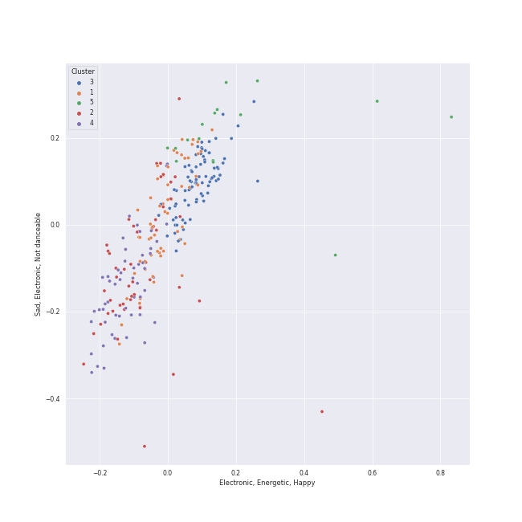

# Clusters in A Cappella

## Cluster #1

59 tracks

| Art | Track | Album | Artists | Label | 💚 | 🔗 |
|:---|:---|:---|:---|:---|:---|:---|
|  | Fireflies | Off the Hook | Ithacappella | [Ithacappella](../../../../labels/ithacappella) | | [🔗](https://open.spotify.com/track/32Z70Jce3icBWnVZrZHt68) |
|  | There Goes My Baby | Wavelength | Mosaic Whispers | Mosaic Whispers | | [🔗](https://open.spotify.com/track/5914Jx2xX9GLN2saFuKJk1) |
|  | Halo | Pitch Slapped - EP | Pitch Slapped | [A Cappella Records](../../../../labels/a_cappella_records) | | [🔗](https://open.spotify.com/track/2iN8Dmoe6z5spepFbiJ3ld) |
|  | Happy Ending | Keepin' it Low Key | Tar Heel Voices | [A Cappella Records](../../../../labels/a_cappella_records) | | [🔗](https://open.spotify.com/track/72bpNdFjmdbiLFGV1w92RY) |
|  | Speechless | Quarter Past | Tar Heel Voices | [A Cappella Records](../../../../labels/a_cappella_records) | | [🔗](https://open.spotify.com/track/3ibXraWcKcHr3ga4PKRY05) |
|  | Bird Set Free | Ignite | Tar Heel Voices | Tar Heel Voices | | [🔗](https://open.spotify.com/track/4jgYV89FYNG8a8jzFa51Xy) |
|  | Here | Sincerely, | The Loreleis | The Loreleis | | [🔗](https://open.spotify.com/track/6jCsjDAeVU2fvbBb7hZe8X) |
|  | How Big, How Blue, How Beautiful | Where the Secret Lies | The Loreleis | The Loreleis | | [🔗](https://open.spotify.com/track/1Z2DeA17SJLGn57v2pOVDv) |
|  | There Goes My Baby | BOCA 2012: Best Of College A Cappella | The MIT Logarhythms | [Varsity Vocals](../../../../labels/varsity_vocals) | | [🔗](https://open.spotify.com/track/45TOM8ILavStTJ1G2aOo9g) |
|  | Honeymoon Avenue | RISE | The Nor'easters | The Nor'easters | | [🔗](https://open.spotify.com/track/6ja6rwUZNNfk07xqaiKyTS) |
## Cluster #2

59 tracks

| Art | Track | Album | Artists | Label | 💚 | 🔗 |
|:---|:---|:---|:---|:---|:---|:---|
|  | Some Nights | The Party Upstairs | Ithacappella | [Ithacappella](../../../../labels/ithacappella) | | [🔗](https://open.spotify.com/track/5ys1Y4xf0vaKR8HjonRl21) |
|  | Aha! | PTX, Vol. 1 | [Pentatonix](../../../../artists/pentatonix/overview.md) | [RCA Records Label](../../../../labels/rca_records_label) | 💚 | [🔗](https://open.spotify.com/track/5AspukpHyZuTciR17YPSrS) |
|  | Daft Punk | PTX, Vol. 2 | [Pentatonix](../../../../artists/pentatonix/overview.md) | [RCA Records Label](../../../../labels/rca_records_label) | 💚 | [🔗](https://open.spotify.com/track/6ukvsBzq4d1vBsAUmz7ZVt) |
|  | Love Again | PTX, Vol. 2 | [Pentatonix](../../../../artists/pentatonix/overview.md) | [RCA Records Label](../../../../labels/rca_records_label) | | [🔗](https://open.spotify.com/track/0vcyzDe6aoYTg6jM0U0T9r) |
|  | Problem (Ariana Grande Cover) | PTX, Vol. III | [Pentatonix](../../../../artists/pentatonix/overview.md) | [RCA Records Label](../../../../labels/rca_records_label) | 💚 | [🔗](https://open.spotify.com/track/45h4cCw7ccsRXb0Orle2an) |
|  | Attention | PTX Presents: Top Pop, Vol. I | [Pentatonix](../../../../artists/pentatonix/overview.md) | [RCA Records Label](../../../../labels/rca_records_label) | | [🔗](https://open.spotify.com/track/5P40YyCrdZRsoj2vTbSyVI) |
|  | Tightrope | BOCA 2014: Best Of College A Cappella | SoCal VoCals | [Varsity Vocals](../../../../labels/varsity_vocals) | | [🔗](https://open.spotify.com/track/3SVFOwTfDYsfYISonpmSJz) |
|  | Home | BOCA 2009: Best Of College A Cappella | The Pitchforks | [Varsity Vocals](../../../../labels/varsity_vocals) | | [🔗](https://open.spotify.com/track/3NWCOrattfBSPxx6j5cGBr) |
|  | Misery Business | BOCA 2010: Best Of College A Cappella | Tufts Jackson Jills | [Varsity Vocals](../../../../labels/varsity_vocals) | | [🔗](https://open.spotify.com/track/3S8HYZFYSvgpIwadfV5PX6) |
|  | That's What You Get | BOCA 2010: Best Of College A Cappella | Tufts sQ! | [Varsity Vocals](../../../../labels/varsity_vocals) | | [🔗](https://open.spotify.com/track/3GcG8ouobilGq1eXAOEvNG) |
## Cluster #3

48 tracks

| Art | Track | Album | Artists | Label | 💚 | 🔗 |
|:---|:---|:---|:---|:---|:---|:---|
|  | Say Something | Stages | Ithacappella | [Ithacappella](../../../../labels/ithacappella) | | [🔗](https://open.spotify.com/track/03ZafJ5f3rfyF9fSB8JkX8) |
|  | Landslide | Behind Bars | Mosaic Whispers | Mosaic Whispers | | [🔗](https://open.spotify.com/track/42oLAPsFC8VUNEQ3rFIwVh) |
|  | Song of the Lonely Mountain | Misty Mountains: Songs Inspired by The Hobbit and Lord of the Rings | Peter Hollens | [Peter Hollens](../../../../labels/peter_hollens) | | [🔗](https://open.spotify.com/track/1Ht9LvTpP6bZezGCL2BRHP) |
|  | Poor Wayfaring Stranger | Legendary Folk Songs | Peter Hollens, The Swingles | [One Voice Productions](../../../../labels/one_voice_productions) | | [🔗](https://open.spotify.com/track/0NmsMH3LvATRdd4bRSTdtl) |
|  | Because of You | Pitch Slapped - EP | Pitch Slapped | [A Cappella Records](../../../../labels/a_cappella_records) | | [🔗](https://open.spotify.com/track/4L94VtyGgK5iBnOEkS4vgP) |
|  | Apologize | BOCA 2009: Best Of College A Cappella | UGA Noteworthy | [Varsity Vocals](../../../../labels/varsity_vocals) | | [🔗](https://open.spotify.com/track/0XvEuKedxyyk3Q7nVjrIXJ) |
|  | Cough Syrup | Encore | Vanderbilt Melodores | [A Cappella Records](../../../../labels/a_cappella_records) | | [🔗](https://open.spotify.com/track/4Wzi8j1QMFE10SDbe2r1VB) |
|  | Colder Weather | M | Vanderbilt Melodores | Vanderbilt Melodores | | [🔗](https://open.spotify.com/track/6ZlO7zjdkGguzlzqETjQWX) |
|  | Aladdin Medley | Vocal Spectrum III | Vocal Spectrum | Naked Voice Records | | [🔗](https://open.spotify.com/track/5NV7Y19aSDgD1wbYPtwJBn) |
|  | Home | I Used to Live Alone | Voices in Your Head | [A Cappella Records](../../../../labels/a_cappella_records) | | [🔗](https://open.spotify.com/track/4NUlXRw52KIz9bQ58S4oYu) |
## Cluster #4

67 tracks

| Art | Track | Album | Artists | Label | 💚 | 🔗 |
|:---|:---|:---|:---|:---|:---|:---|
|  | Gravity | BOCA 2004: Best Of College A Cappella | Awaken A Cappella, [Sara Bareilles](../../../../artists/sara_bareilles/overview.md), Don Gooding, Bill Hare, Gabe Hendifar, Deke Sharon | [Varsity Vocals](../../../../labels/varsity_vocals) | | [🔗](https://open.spotify.com/track/0W94b6tM78Miftv7W5tOX2) |
|  | Timshel | GQ | GQ | Option C Records | | [🔗](https://open.spotify.com/track/5GtzG4nMm0DD4nlQp15uOn) |
|  | Can't Help Falling In Love | PTX Vol. IV - Classics | [Pentatonix](../../../../artists/pentatonix/overview.md) | [RCA Records Label](../../../../labels/rca_records_label) | 💚 | [🔗](https://open.spotify.com/track/1xKScU3i8ho0OIhNoC5YW9) |
|  | Misty Mountains | Misty Mountains: Songs Inspired by The Hobbit and Lord of the Rings | Peter Hollens, Tim Foust | [Peter Hollens](../../../../labels/peter_hollens) | | [🔗](https://open.spotify.com/track/21sD95jUPmren2fGY0wxYE) |
|  | Greensleeves | Legendary Folk Songs | Peter Hollens, Tim Foust | [One Voice Productions](../../../../labels/one_voice_productions) | | [🔗](https://open.spotify.com/track/0Q7QHXmwjj8u9ajPvwNnCO) |
|  | Loch Lomond | Legendary Folk Songs | Peter Hollens, David Archuleta | [One Voice Productions](../../../../labels/one_voice_productions) | | [🔗](https://open.spotify.com/track/1AbjBMyhiiEt5GJiRtlDRX) |
|  | Scarborough Fair | Legendary Folk Songs | Peter Hollens | [One Voice Productions](../../../../labels/one_voice_productions) | | [🔗](https://open.spotify.com/track/1fXgi7opKIjkpjX6uVNJXx) |
|  | Lullaby | Legendary Covers, Vol. 1 | Peter Hollens | [Peter Hollens](../../../../labels/peter_hollens) | | [🔗](https://open.spotify.com/track/6vqc1KcIaO0NmQLaAJApqe) |
|  | You Raise Me Up - A Cappella | Legendary Covers, Vol. 1 | Peter Hollens | [Peter Hollens](../../../../labels/peter_hollens) | | [🔗](https://open.spotify.com/track/57EvTXkeuxNPWxQYIdW5AY) |
|  | Poison & Wine | Permit to Harmonize | SoCal VoCals | SoCal VoCals | | [🔗](https://open.spotify.com/track/0e1lJVRsuzBjkXy73BpMq6) |
## Cluster #5

19 tracks

| Art | Track | Album | Artists | Label | 💚 | 🔗 |
|:---|:---|:---|:---|:---|:---|:---|
|  | Crabbuckit | GQ, Vol. II | GQ | Option C Records | | [🔗](https://open.spotify.com/track/7mgUbZEmuzs2TfXQNae4Dq) |
|  | Sixteen Tons | Before You Go | Ithacappella | [Ithacappella](../../../../labels/ithacappella) | | [🔗](https://open.spotify.com/track/1eBmRgj1SjBwnRYMImzhg5) |
|  | Movin' On | BOCA 2010: Best Of College A Cappella | SoCal VoCals | [Varsity Vocals](../../../../labels/varsity_vocals) | | [🔗](https://open.spotify.com/track/6ij7GL6J5e8l8gprJZ1sz7) |
|  | Can't Take My Eyes Off You | 1988 | Tar Heel Voices | Tar Heel Voices | | [🔗](https://open.spotify.com/track/421iteTHiwbWZneFqAUQpS) |
|  | Counting Stars | 1988 | Tar Heel Voices | Tar Heel Voices | | [🔗](https://open.spotify.com/track/497vByhCSwcQHKrLOqsXgA) |
|  | Put Your Records On | BOCA 2008: Best Of College A Cappella | Tufts sQ! | [Varsity Vocals](../../../../labels/varsity_vocals) | | [🔗](https://open.spotify.com/track/3xE8DcaJYoDYMHgY9BDKdZ) |
|  | Carry On Wayward Son | High Stakes Old Maid | UNC Achordants | [A Cappella Records](../../../../labels/a_cappella_records) | | [🔗](https://open.spotify.com/track/20F6HiYBShG2uKe6eyX6JB) |
|  | When I See An Elephant Fly | Vocal Spectrum III | Vocal Spectrum | Naked Voice Records | | [🔗](https://open.spotify.com/track/6MlxQrguGbAAZt7Jeqd1Xp) |
|  | Cry Me a River | Songs for Padded Rooms | Voices in Your Head | [A Cappella Records](../../../../labels/a_cappella_records) | | [🔗](https://open.spotify.com/track/7j2UXGaBVzCGe1zJ795Mv8) |
|  | Toxic | Songs for Padded Rooms | Voices in Your Head | [A Cappella Records](../../../../labels/a_cappella_records) | | [🔗](https://open.spotify.com/track/2crmVN1l4kgyGwlABJSFoS) |