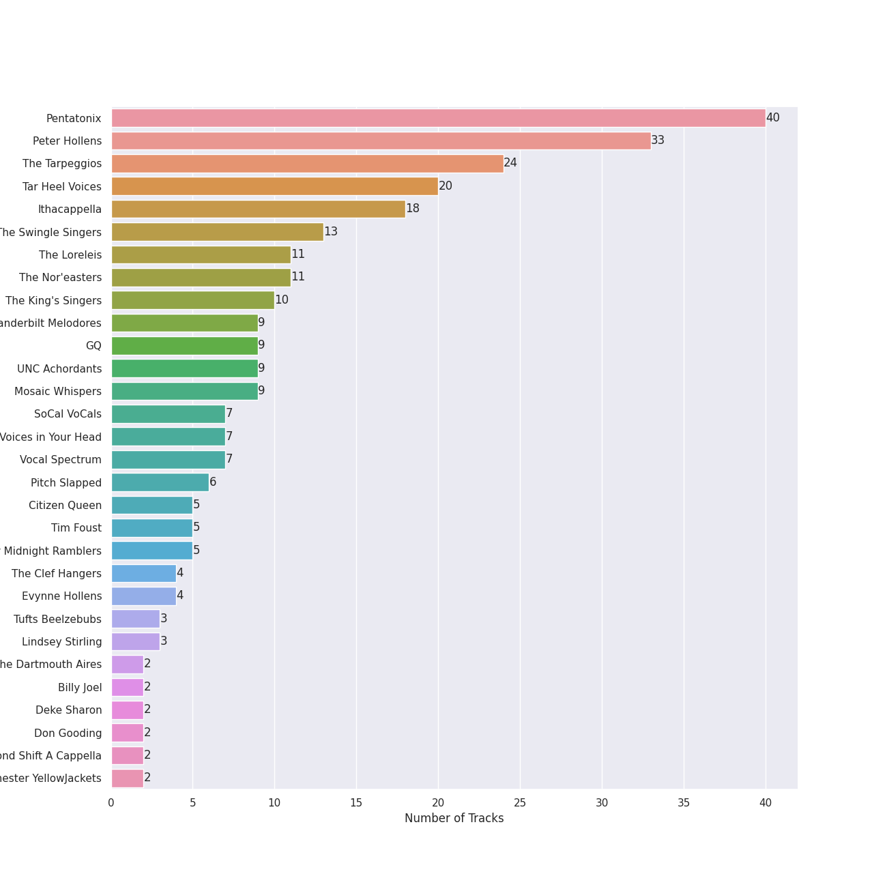
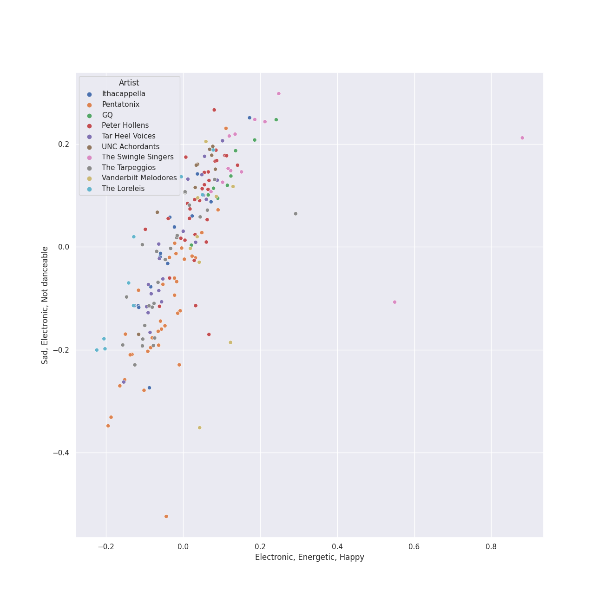
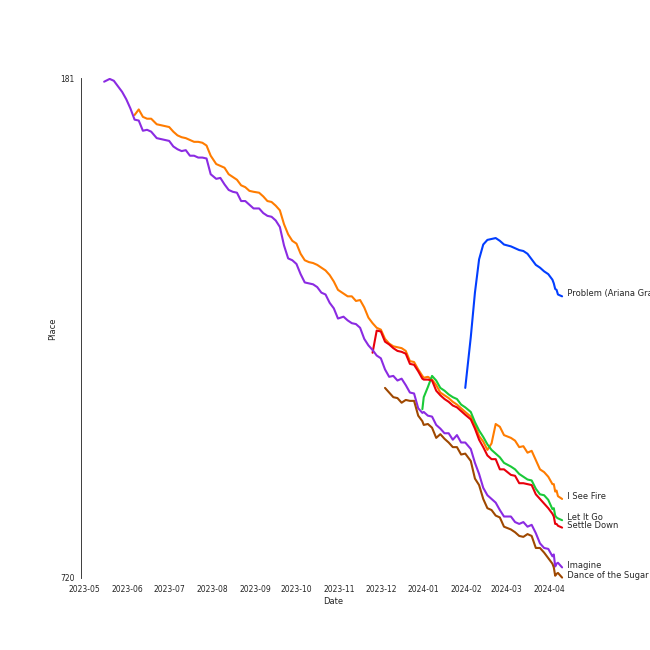
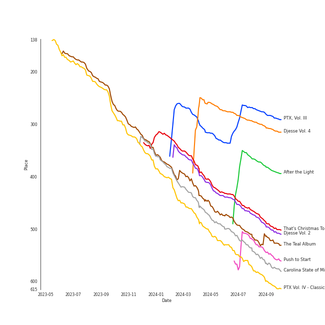
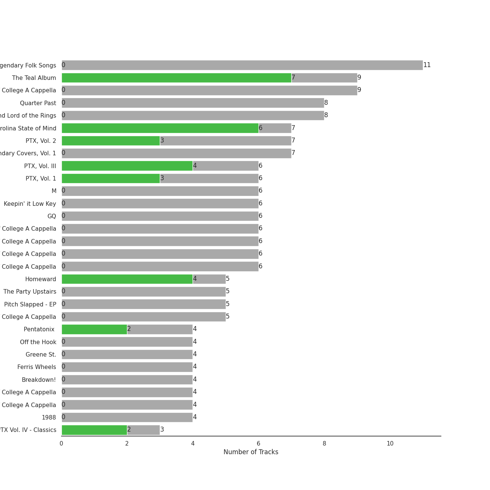
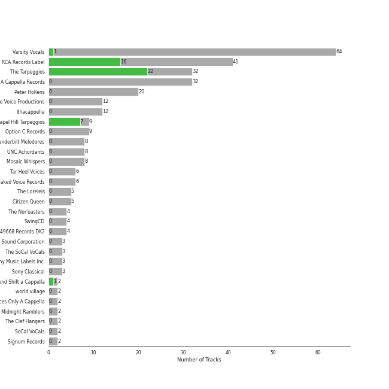
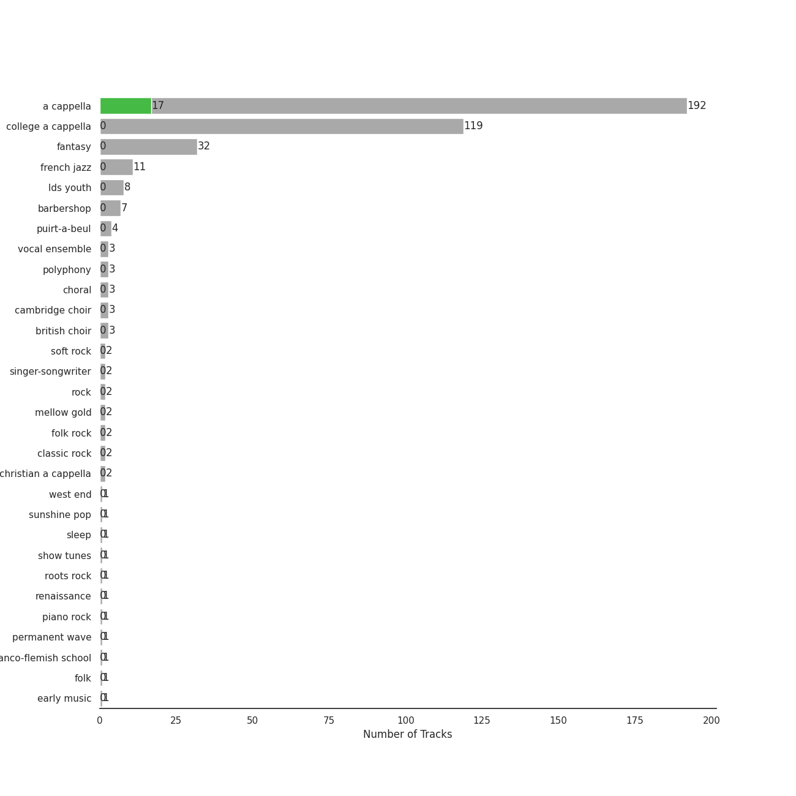
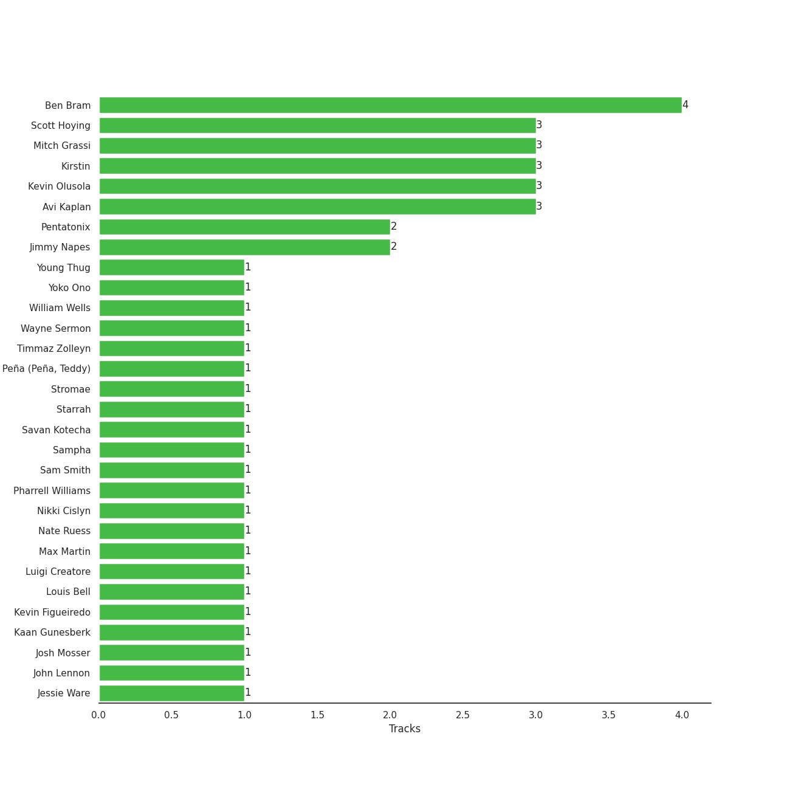
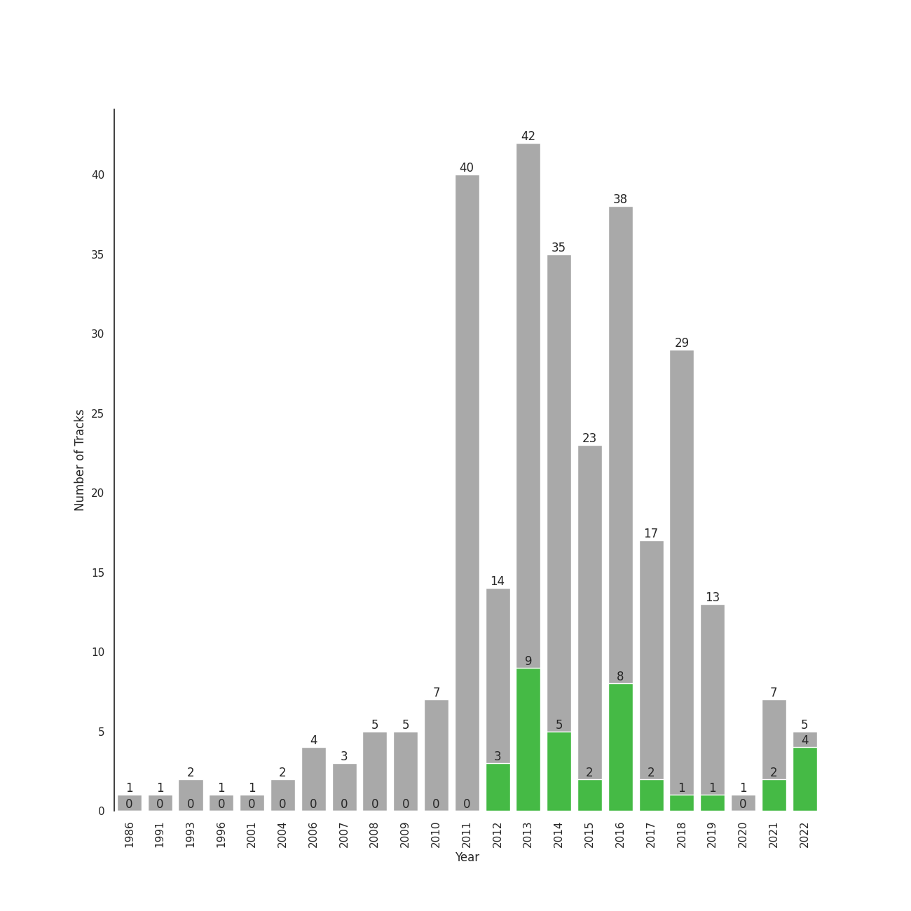

# A Cappella

[317 tracks (48 liked) 🔗](https://open.spotify.com/playlist/7LQjtpZ8EZ5vWXgPoovFeC)

[See Track Features](audio_features.md)

[See Clusters](clusters/overview.md)

## Top Artists

| Art | Rank | Tracks | 💚 | Artist | 🔗 |
|:---|---:|---:|---:|:---|:---|
|  | 43 | 41 | 29 | [The Tarpeggios](../../artists/the_tarpeggios/overview.md) | [🔗](https://open.spotify.com/artist/2HXd5pFHJyaQJr5aXfErrE) |
|  | 33 | 36 | 16 | [Pentatonix](../../artists/pentatonix/overview.md) | [🔗](https://open.spotify.com/artist/26AHtbjWKiwYzsoGoUZq53) |
|  | 413 | 3 | 2 | [Lindsey Stirling](../../artists/lindsey_stirling/overview.md) | [🔗](https://open.spotify.com/artist/378dH6EszOLFShpRzAQkVM) |
|  | 413 | 2 | 1 | Second Shift A Cappella | [🔗](https://open.spotify.com/artist/62Sh3v52pBL7IhWZMaGgq6) |
|  | 413 | 1 | 1 | Tink | [🔗](https://open.spotify.com/artist/4v6XOdonnfpdTKTRJArG7v) |
|  | 194 | 1 | 1 | Stella Jang | [🔗](https://open.spotify.com/artist/2Y9AUayH5pyZpVfkDYDfJV) |
|  | 413 | 1 | 1 | The Harvard Opportunes | [🔗](https://open.spotify.com/artist/2VyMwoZuuLbwsOjFVqw2O0) |
|  | 273 | 1 | 1 | [Jason Derulo](../../artists/jason_derulo/overview.md) | [🔗](https://open.spotify.com/artist/07YZf4WDAMNwqr4jfgOZ8y) |
|  | 413 | 32 | 0 | Peter Hollens | [🔗](https://open.spotify.com/artist/7EIbKyiLnEJ1Y074UIUyZJ) |
|  | 413 | 20 | 0 | Tar Heel Voices | [🔗](https://open.spotify.com/artist/1apO6pJsV1nwuF2K8sEsDo) |

See top 100 artists

| Art | Rank | Tracks | 💚 | Artist | 🔗 |
|:---|---:|---:|---:|:---|:---|
|  | 413 | 16 | 0 | Ithacappella | [🔗](https://open.spotify.com/artist/5bPTIGQvxRNjr6wl9yyAct) |
|  | 413 | 12 | 0 | The Swingle Singers | [🔗](https://open.spotify.com/artist/1ZlFYysRdc6YaUH5FkxPl8) |
|  | 413 | 9 | 0 | Vanderbilt Melodores | [🔗](https://open.spotify.com/artist/7HkF8fT7TZlrQsjSgWUEXN) |
|  | 413 | 9 | 0 | GQ | [🔗](https://open.spotify.com/artist/6JYedwPn7zEWlTSUda9mev) |
|  | 413 | 9 | 0 | The Loreleis | [🔗](https://open.spotify.com/artist/1fqMjreaczGwFmdmG6AvJs) |
|  | 413 | 9 | 0 | The Nor'easters | [🔗](https://open.spotify.com/artist/1aLfVgwt8eBrpvHcutWmqe) |
|  | 413 | 9 | 0 | UNC Achordants | [🔗](https://open.spotify.com/artist/1TzZMeOCs4TMYtzgohPMAr) |
|  | 413 | 8 | 0 | The King's Singers | [🔗](https://open.spotify.com/artist/5lR7yDVN4z9kahOiUSlMhe) |
|  | 413 | 8 | 0 | SoCal VoCals | [🔗](https://open.spotify.com/artist/5L30XpwHG77eWCZtelTns9) |
|  | 413 | 8 | 0 | Mosaic Whispers | [🔗](https://open.spotify.com/artist/0fP33MCfVUaPivyFYLZtoh) |
|  | 413 | 7 | 0 | Voices in Your Head | [🔗](https://open.spotify.com/artist/44v8JgDySt9tkgfV3AWxBJ) |
|  | 413 | 6 | 0 | Pitch Slapped | [🔗](https://open.spotify.com/artist/7EH7jldX62OIsU1yU1SWE7) |
|  | 413 | 6 | 0 | Vocal Spectrum | [🔗](https://open.spotify.com/artist/20nWuvMfCct9xv73hRYO7O) |
|  | 413 | 5 | 0 | Citizen Queen | [🔗](https://open.spotify.com/artist/2z7BqfKvVlkr8KVAOTBKcz) |
|  | 413 | 5 | 0 | University of Rochester Midnight Ramblers | [🔗](https://open.spotify.com/artist/2Tv49uvEsNJXUpuFL7HuKu) |
|  | 413 | 4 | 0 | The Clef Hangers | [🔗](https://open.spotify.com/artist/5wUTXZIMX0mn6MzFA13qfO) |
|  | 413 | 4 | 0 | Evynne Hollens | [🔗](https://open.spotify.com/artist/3nj3MfJCFFoKiRkAOW1R8c) |
|  | 413 | 4 | 0 | Tim Foust | [🔗](https://open.spotify.com/artist/2VtwFbDZzIoT9ZD0uR5HHD) |
|  | 413 | 3 | 0 | Tufts Beelzebubs | [🔗](https://open.spotify.com/artist/4VsNVAxuPxZrJMWE2Tprtq) |
|  | 413 | 3 | 0 | The Virginia Sil'hooettes | [🔗](https://open.spotify.com/artist/0LKgClZwZKGhM5BkCzjfMX) |
|  | 413 | 2 | 0 | The Dartmouth Aires | [🔗](https://open.spotify.com/artist/71Cez1b1NqsxIn5u8XNiQD) |
| | 413 | 2 | 0 | Deke Sharon | [🔗](https://open.spotify.com/artist/6eWNb9yuroBpPcQ4sOkL1e) |
| | 413 | 2 | 0 | Don Gooding | [🔗](https://open.spotify.com/artist/66iv9KzffeiANddjYouG6U) |
|  | 413 | 2 | 0 | University of Rochester YellowJackets | [🔗](https://open.spotify.com/artist/5PdBpsZXvnEbbTe1589fMO) |
|  | 413 | 2 | 0 | The Pitchforks | [🔗](https://open.spotify.com/artist/5IPABE7EhPLvUVsgM3dlZ8) |
|  | 413 | 2 | 0 | Vocal Point (University of Delaware) | [🔗](https://open.spotify.com/artist/4nrhXBXu7FnxWeSbB21bfk) |
|  | 413 | 2 | 0 | Acappology | [🔗](https://open.spotify.com/artist/21v1APtcWJHRmeKdBRVbYs) |
|  | 413 | 2 | 0 | Tufts sQ! | [🔗](https://open.spotify.com/artist/21QIHECpmN2KwhpVhIWHpT) |
|  | 413 | 2 | 0 | The MIT Logarhythms | [🔗](https://open.spotify.com/artist/1jz5HCLwsDkpBYz80n9wbR) |
|  | 413 | 2 | 0 | Bill Hare | [🔗](https://open.spotify.com/artist/10WhKnqdsfpYWDgZhjrday) |
|  | 413 | 1 | 0 | Awaken A Cappella | [🔗](https://open.spotify.com/artist/7zjm9GiXJPq0z3bKETWl1N) |
| | 413 | 1 | 0 | Shams Ahmed | [🔗](https://open.spotify.com/artist/7rIkgg1ozqQIezA7c8Khf4) |
|  | 413 | 1 | 0 | Pitches & Notes | [🔗](https://open.spotify.com/artist/7l6eX8dYXjmQnfF04Sr4Vh) |
| | 413 | 1 | 0 | Delia Darney | [🔗](https://open.spotify.com/artist/7ikvHdyyUnB92bHTgFcctU) |
| | 413 | 1 | 0 | Florida State University All-Night Yahtzee | [🔗](https://open.spotify.com/artist/7hpsmZ7DZukPPg1dR2wqAy) |
| | 413 | 1 | 0 | University of Wisconsin-Madison Fundamentally Sound | [🔗](https://open.spotify.com/artist/7f7ezoLEjOp1K0qDSosU80) |
|  | 413 | 1 | 0 | Off The Beat | [🔗](https://open.spotify.com/artist/7aCUqnLkFEQd2FPL6RK1tW) |
|  | 413 | 1 | 0 | Anna Gilbert | [🔗](https://open.spotify.com/artist/77ajzV8In7jP3U2OYT1Yy7) |
|  | 53 | 1 | 0 | [Billy Joel](../../artists/billy_joel/overview.md) | [🔗](https://open.spotify.com/artist/6zFYqv1mOsgBRQbae3JJ9e) |
|  | 413 | 1 | 0 | UGA Noteworthy | [🔗](https://open.spotify.com/artist/6MyHz1OaVtj1w2y6JTu2u5) |
|  | 413 | 1 | 0 | The Hound + The Fox | [🔗](https://open.spotify.com/artist/6KxrjoB8dMcRC295reb2Us) |
| | 413 | 1 | 0 | Roxorloops & Blady Kris | [🔗](https://open.spotify.com/artist/6HRJOlHBoo07WcZdXZAADI) |
|  | 413 | 1 | 0 | BYU Vocal Point | [🔗](https://open.spotify.com/artist/5zhxxb24WP6q6rbLHAn2UQ) |
|  | 413 | 1 | 0 | John Legend | [🔗](https://open.spotify.com/artist/5y2Xq6xcjJb2jVM54GHK3t) |
|  | 413 | 1 | 0 | The Statesmen | [🔗](https://open.spotify.com/artist/5m9J0qjRMcetcTxN535NBZ) |
|  | 413 | 1 | 0 | Dhamakapella | [🔗](https://open.spotify.com/artist/5j28H9tWwW4RlMNKyrONCV) |
|  | 413 | 1 | 0 | Mike Love | [🔗](https://open.spotify.com/artist/5gr5OoQ4aQdJ3CqOr9v7Bt) |
|  | 413 | 1 | 0 | The Swingles | [🔗](https://open.spotify.com/artist/5QvPTVBx6OlrUuPwC8W3uU) |
|  | 413 | 1 | 0 | Tyler Ward | [🔗](https://open.spotify.com/artist/5Hc9oDGvStNGmnj44m8sHg) |
|  | 413 | 1 | 0 | The Back Row | [🔗](https://open.spotify.com/artist/5GaN9YyrJyPmJd6dALWhQh) |
|  | 413 | 1 | 0 | The Harmonics | [🔗](https://open.spotify.com/artist/528Rcthd9JqtIrlbrGKNsG) |
| | 413 | 1 | 0 | Kat Dunbar Linker | [🔗](https://open.spotify.com/artist/512QZ1TM6L4uXmWCVOKHtV) |
|  | 413 | 1 | 0 | Varsity Vocals | [🔗](https://open.spotify.com/artist/4bQp9Lm7LgRMLtqEsH3Bqf) |
|  | 413 | 1 | 0 | Andrew Lloyd Webber | [🔗](https://open.spotify.com/artist/4aP1lp10BRYZO658B2NwkG) |
|  | 413 | 1 | 0 | The Harvard-Radcliffe Veritones | [🔗](https://open.spotify.com/artist/4Zjdnr698SzQDAPMx4oxy0) |
|  | 413 | 1 | 0 | Brian Wilson | [🔗](https://open.spotify.com/artist/4Q82S0VzF8qlCb4PnSDurj) |
|  | 413 | 1 | 0 | Brandeis VoiceMale | [🔗](https://open.spotify.com/artist/4DsnXPBijq5tMq5zAEfF1L) |
|  | 413 | 1 | 0 | Taylor Davis | [🔗](https://open.spotify.com/artist/480xKab3lUPhBBnCzlzqIu) |
|  | 413 | 1 | 0 | Decadence | [🔗](https://open.spotify.com/artist/3uBUg8TtKXz6m3wY5aXa9I) |
| | 413 | 1 | 0 | Emily Shanny | [🔗](https://open.spotify.com/artist/3oWiUIUDPWJmvB8wElpaO5) |
| | 413 | 1 | 0 | Andrew Busher | [🔗](https://open.spotify.com/artist/3Zbnq9cbmHkNBzUrfTe2Vb) |
| | 413 | 1 | 0 | Gabe Hendifar | [🔗](https://open.spotify.com/artist/3YIBM4yvZHT4lRQa14eHQh) |
|  | 413 | 1 | 0 | Hullabahoos | [🔗](https://open.spotify.com/artist/3S1DEHnGNfWmamdZEyLs8I) |
|  | 413 | 1 | 0 | Low Key | [🔗](https://open.spotify.com/artist/3QiFLZnOapcbmh1onAoNBL) |
|  | 413 | 1 | 0 | Eight Beat Measure | [🔗](https://open.spotify.com/artist/3My1YRLewqqDXME2OkBpdZ) |
|  | 413 | 1 | 0 | The Doo Wop Shop | [🔗](https://open.spotify.com/artist/3BKvJisNneE6cOuLuBHGpC) |
|  | 413 | 1 | 0 | Josquin des Prez | [🔗](https://open.spotify.com/artist/31f23hmZawdqgp0sECAzE8) |
|  | 413 | 1 | 0 | The Vassar Devils | [🔗](https://open.spotify.com/artist/31EncJhuSBcAIsZGA3G1GK) |
|  | 413 | 1 | 0 | Elizabeth Wright | [🔗](https://open.spotify.com/artist/2tQ7EzEpu1KFpseMdHGSzL) |
|  | 25 | 1 | 0 | [Sara Bareilles](../../artists/sara_bareilles/overview.md) | [🔗](https://open.spotify.com/artist/2Sqr0DXoaYABbjBo9HaMkM) |
|  | 413 | 1 | 0 | Hank Green | [🔗](https://open.spotify.com/artist/2SQVGFEgP0UZTZC1re2ECh) |
|  | 413 | 1 | 0 | The Swingle Singers | [🔗](https://open.spotify.com/artist/2Rn34e82tV2YfbLfP1omlS) |
|  | 413 | 1 | 0 | Penn Masala | [🔗](https://open.spotify.com/artist/2MhJb1ljKttJewuYZTpXxr) |
|  | 413 | 1 | 0 | Home Free | [🔗](https://open.spotify.com/artist/2MSlGNpwXDScUdspOK6TS7) |
|  | 413 | 1 | 0 | Paul Simon | [🔗](https://open.spotify.com/artist/2CvCyf1gEVhI0mX6aFXmVI) |
|  | 413 | 1 | 0 | David Archuleta | [🔗](https://open.spotify.com/artist/2C9n4tQgNLhHPhSCmdsQnk) |
|  | 413 | 1 | 0 | Mixed Emotions | [🔗](https://open.spotify.com/artist/2BoHcRUfryDNxa9HQxXSpr) |
| | 413 | 1 | 0 | Beejul Khatri | [🔗](https://open.spotify.com/artist/24SlCPf92d5VTzhI0ztENn) |
|  | 317 | 1 | 0 | Tori Kelly | [🔗](https://open.spotify.com/artist/1vSN1fsvrzpbttOYGsliDr) |
|  | 413 | 1 | 0 | Upper Structure | [🔗](https://open.spotify.com/artist/1tlKq97YGAGBavozMVeddE) |
| | 413 | 1 | 0 | University of Michigan G-Men | [🔗](https://open.spotify.com/artist/1jANAnjCBrwxiT4c33eeNc) |
|  | 413 | 1 | 0 | Tufts Jackson Jills | [🔗](https://open.spotify.com/artist/1dUJZ0lbobmanl4W14h0a2) |
|  | 413 | 1 | 0 | BYU Noteworthy | [🔗](https://open.spotify.com/artist/1ZknN7FbjjjMTmdU42OEeX) |
|  | 413 | 1 | 0 | Academical Village People | [🔗](https://open.spotify.com/artist/1Vjug1h4HXCeplbouQEbV3) |
|  | 413 | 1 | 0 | Traditional | [🔗](https://open.spotify.com/artist/1U5zgr455OGyIkLNXvDdrf) |
| | 413 | 1 | 0 | Erika Petty | [🔗](https://open.spotify.com/artist/15YH0MYEIRY7AmrrwfVO4W) |
|  | 413 | 1 | 0 | The Virginia Gentlemen | [🔗](https://open.spotify.com/artist/0steWfkS4hwaErh84SlHMW) |
|  | 413 | 1 | 0 | The Bostonians | [🔗](https://open.spotify.com/artist/0gW6hG0g7pVNbHgvmYwHDl) |
|  | 38 | 1 | 0 | [Jacob Collier](../../artists/jacob_collier/overview.md) | [🔗](https://open.spotify.com/artist/0QWrMNukfcVOmgEU0FEDyD) |
|  | 413 | 1 | 0 | New Dominions | [🔗](https://open.spotify.com/artist/0PzFyYSC4Y7JarVyByrJPc) |

## Top Tracks

Most and least listened tracks

| Rank | ​ | Most listened tracks | Rank | ​​ | Least listened tracks |
|---:|:---|:---|---:|:---|:---|
| 532 |  | [Rather Be (Clean Bandit Cover)](../../artists/pentatonix/overview.md) | 920 |  | Shenandoah - Arr. Bob Chilcott |
| 533 |  | [Problem (Ariana Grande Cover)](../../artists/pentatonix/overview.md) | 920 |  | My Happy Ending |
| 535 |  | [Dawn FM](../../artists/the_tarpeggios/overview.md) | 920 |  | Alive |
| 785 |  | [I See Fire](../../artists/the_tarpeggios/overview.md) | 920 |  | High And Dry |
| 794 |  | [Flesh & Bone](../../artists/the_tarpeggios/overview.md) | 920 |  | Largo [Harpsichord Concerto No. 5 in F minor BWV 1056] |
| 812 |  | [Let It Go](../../artists/pentatonix/overview.md) | 920 |  | Crabbuckit |
| 819 |  | [Settle Down](../../artists/the_tarpeggios/overview.md) | 920 |  | Smooth Criminal |
| 877 |  | [Imagine](../../artists/pentatonix/overview.md) | 920 |  | La Camisa Negra |
| 893 |  | [Dance of the Sugar Plum Fairy](../../artists/pentatonix/overview.md) | 920 |  | Cry Me a River |
| 920 |  | We Found Love | 920 |  | [Hallucinate](../../artists/the_tarpeggios/overview.md) |

## Top Albums

| Art | Rank | Tracks | 💚 | Album | Release Date | 🔗 |
|:---|---:|---:|---:|:---|:---|:---|
|  | 611 | 11 | 0 | Legendary Folk Songs | 2018-06-15 | [🔗](https://open.spotify.com/album/22qN0Gw54OwckjTgVGUzVG) |
|  | 522 | 9 | 7 | The Teal Album | 2016-11-12 | [🔗](https://open.spotify.com/album/7mTQ62MIYHSbkZHGjY0Ftg) |
|  | 611 | 9 | 0 | BOCA 2015: Best Of College A Cappella | 2014-12-19 | [🔗](https://open.spotify.com/album/0gyhBvJs1GiI31cMMmKLnK) |
|  | 611 | 8 | 0 | Quarter Past | 2014-11-18 | [🔗](https://open.spotify.com/album/1pScBPjmT5w3s0BTgkdgJy) |
|  | 611 | 8 | 0 | Misty Mountains: Songs Inspired by The Hobbit and Lord of the Rings | 2016-03-18 | [🔗](https://open.spotify.com/album/4GYDt4IqU8EZ6KJLHpPuOK) |
|  | 549 | 7 | 6 | Carolina State of Mind | 2013-11-15 | [🔗](https://open.spotify.com/album/3zKusinRVxdC5s2wOPYBgX) |
|  | 611 | 7 | 5 | Bloodline | 2024-05-15 | [🔗](https://open.spotify.com/album/5XMETYH0wL2F3qDpWfVKzw) |
|  | 611 | 7 | 3 | PTX, Vol. 2 | 2013-11-05 | [🔗](https://open.spotify.com/album/12dPqNFIdjiVFSHvtsDmzJ) |
|  | 611 | 7 | 0 | Legendary Covers, Vol. 1 | 2019 | [🔗](https://open.spotify.com/album/1tFypxtPJ5A61j97TRhWnP) |
|  | 272 | 6 | 4 | PTX, Vol. III | 2014-09-23 | [🔗](https://open.spotify.com/album/32y54TelUHSUDWVOx4h1B4) |

See top 100 albums

| Art | Rank | Tracks | 💚 | Album | Release Date | 🔗 |
|:---|---:|---:|---:|:---|:---|:---|
|  | 611 | 6 | 3 | PTX, Vol. 1 | 2012-06-26 | [🔗](https://open.spotify.com/album/5wGlP6EqF7akh6N3UGfKVZ) |
|  | 611 | 6 | 0 | M | 2015-03-30 | [🔗](https://open.spotify.com/album/1B0XzLFo4XYh8QIwPRTdpR) |
|  | 611 | 6 | 0 | Keepin' it Low Key | 2013-01-18 | [🔗](https://open.spotify.com/album/4EmdqB8w7gEONRX5QLypQZ) |
|  | 611 | 6 | 0 | GQ | 2013-10-07 | [🔗](https://open.spotify.com/album/3Op25RElrVsFcte612zusf) |
|  | 611 | 6 | 0 | BOCA 2013: Best of College A Cappella | 2016 | [🔗](https://open.spotify.com/album/6Pqey2mc4EWSfYNH3bifbO) |
|  | 611 | 6 | 0 | BOCA 2010: Best Of College A Cappella | 2011-02-15 | [🔗](https://open.spotify.com/album/3HSd3voAxPxS50UrfInBVJ) |
|  | 611 | 6 | 0 | BOCA 2009: Best Of College A Cappella | 2011-02-15 | [🔗](https://open.spotify.com/album/50WaSkL4pVvz9Crsca7oNV) |
|  | 611 | 6 | 0 | BOCA 2008: Best Of College A Cappella | 2011-02-15 | [🔗](https://open.spotify.com/album/4Z0ju0i47UZ2Y4icq2f3wZ) |
|  | 611 | 5 | 4 | Homeward | 2022-04-08 | [🔗](https://open.spotify.com/album/2FiDSelqVoi7VQfpmaMRJK) |
|  | 611 | 5 | 0 | The Party Upstairs | 2013-12-13 | [🔗](https://open.spotify.com/album/2AIAKP2FxbYNjmwQgAkqZz) |
|  | 611 | 5 | 0 | Pitch Slapped - EP | 2011-04-08 | [🔗](https://open.spotify.com/album/5I08qbUSg8f48kenQs7Tg6) |
|  | 611 | 5 | 0 | BOCA 2014: Best Of College A Cappella | 2014-01-31 | [🔗](https://open.spotify.com/album/7rZoAMtoZ8s5mLIlUTWgVT) |
|  | 611 | 4 | 2 | Pentatonix (Deluxe Version) | 2015-10-16 | [🔗](https://open.spotify.com/album/6qf9tE8pNRW0kX1Cucrixr) |
|  | 611 | 4 | 0 | Off the Hook | 2011-12-10 | [🔗](https://open.spotify.com/album/1wfYTTpHsGxvIjDwsPLAAC) |
|  | 611 | 4 | 0 | Greene St. | 2016 | [🔗](https://open.spotify.com/album/3qJMqi0VzTFGSDTTMUI5n7) |
|  | 611 | 4 | 0 | Ferris Wheels | 2010-01-01 | [🔗](https://open.spotify.com/album/5ASqFPQZT7iJ3Txsly4JIC) |
|  | 611 | 4 | 0 | Breakdown! | 2009-12-05 | [🔗](https://open.spotify.com/album/7u7dNsbxjcxVoffJELqtCV) |
|  | 611 | 4 | 0 | BOCA 2012: Best Of College A Cappella | 2012-01-01 | [🔗](https://open.spotify.com/album/26eCHp86K2xLQj0B7Cr8he) |
|  | 611 | 4 | 0 | BOCA 2011: Best Of College A Cappella | 2011-01-11 | [🔗](https://open.spotify.com/album/27d96rqnXRtmrGBGHJzPBh) |
|  | 368 | 4 | 0 | After the Light | 2023-08-18 | [🔗](https://open.spotify.com/album/5Q9k2sd9kFnmPEJjdsFIpV) |
|  | 611 | 4 | 0 | 1988 | 2015-05-19 | [🔗](https://open.spotify.com/album/6nktHqHKPt8kT4ozUJvwrs) |
|  | 581 | 3 | 2 | PTX Vol. IV - Classics | 2017-04-07 | [🔗](https://open.spotify.com/album/00JpoY0ZaQRXTNJUruibfX) |
|  | 611 | 3 | 2 | MODERN ECSTASY | 2023-07-07 | [🔗](https://open.spotify.com/album/3EFIthm5Zjb7MfuXeDJb9A) |
|  | 611 | 3 | 1 | PTX Presents: Top Pop, Vol. I | 2018-04-13 | [🔗](https://open.spotify.com/album/2viOlnLfhPLDgx7hvBqLwW) |
|  | 611 | 3 | 1 | BOCA 2023: Best Of College A Cappella | 2023-02-07 | [🔗](https://open.spotify.com/album/25nFx7zXWcdnh8luicyh38) |
|  | 611 | 3 | 0 | Unwrapped | 2006-09-12 | [🔗](https://open.spotify.com/album/6ua3tHyrfZNh6CpZLzCAuT) |
|  | 611 | 3 | 0 | Songs for Padded Rooms | 2011-05-21 | [🔗](https://open.spotify.com/album/0h3bmbpSuD01ha1k52E1uz) |
|  | 611 | 3 | 0 | Sincerely, | 2016-03-22 | [🔗](https://open.spotify.com/album/4szRoyYFWqLMea8NLx2TpL) |
|  | 611 | 3 | 0 | RISE | 2016-02-09 | [🔗](https://open.spotify.com/album/6V8819n4bdv7dA5mFdCIAo) |
|  | 611 | 3 | 0 | GQ, Vol. II | 2016-07-21 | [🔗](https://open.spotify.com/album/71Z9gNhhrz6jhIC272Yt24) |
|  | 611 | 3 | 0 | Covers, Vol. III | 2017-06-16 | [🔗](https://open.spotify.com/album/69zZ6utXSbC6dr6tdBsvNz) |
|  | 611 | 3 | 0 | Cappella | 2013 | [🔗](https://open.spotify.com/album/3n6JxpdWnHkazMCQxKK5qI) |
|  | 611 | 3 | 0 | BOCA 2021: Best of College A Cappella | 2021-02-06 | [🔗](https://open.spotify.com/album/1eKkeTIlePsRpKkQre78tT) |
|  | 611 | 3 | 0 | BOCA 2018: Best of College A Cappella | 2021-02-04 | [🔗](https://open.spotify.com/album/4F7k4viXqEAIlrB5rbAPbF) |
|  | 611 | 3 | 0 | BOCA 2016: Best Of College A Cappella | 2015-12-15 | [🔗](https://open.spotify.com/album/2AOr4esohQurJGXklhRH1a) |
|  | 527 | 2 | 2 | Push to Start | 2023-04-03 | [🔗](https://open.spotify.com/album/4ggdFWPHn5rTdUrw4s46yS) |
|  | 611 | 2 | 2 | Immaterial | 2021-07-16 | [🔗](https://open.spotify.com/album/5YgtPHMCi4dGtL6JarEGkI) |
|  | 611 | 2 | 1 | PTX | 2014-09-19 | [🔗](https://open.spotify.com/album/77RBn8pRsfXlZdfTQh221D) |
|  | 611 | 2 | 1 | Graveyard Shift | 2018-10-28 | [🔗](https://open.spotify.com/album/4i6gztUxx7Iq1tocxEX1pY) |
|  | 611 | 2 | 0 | Where the Secret Lies | 2018 | [🔗](https://open.spotify.com/album/6kKcn38yjU8iFvlWCbcQsL) |
|  | 611 | 2 | 0 | Weather To Fly | 2013-09-16 | [🔗](https://open.spotify.com/album/2AW4oP7GeAcKOWRY5x7O0o) |
|  | 611 | 2 | 0 | Wavelength | 2015-04-10 | [🔗](https://open.spotify.com/album/56RyapLbZ4DESHfzD87X7F) |
|  | 611 | 2 | 0 | Vocal Spectrum III | 2011-11-07 | [🔗](https://open.spotify.com/album/4F5N06bwpwxllsHAJh8Xn6) |
|  | 611 | 2 | 0 | Vocal Spectrum II | 2008-07-15 | [🔗](https://open.spotify.com/album/1RDzZXCmf9q1SQbyz48HFq) |
|  | 611 | 2 | 0 | V | 2018 | [🔗](https://open.spotify.com/album/7wPsYBhUlqtAgPr2hbbmP3) |
|  | 469 | 2 | 0 | That's Christmas To Me (Deluxe Edition) | 2015-10-30 | [🔗](https://open.spotify.com/album/082VlX7cBth0o8xqDGclNn) |
|  | 611 | 2 | 0 | Stages | 2014-09-21 | [🔗](https://open.spotify.com/album/3mnYoDcAHKx6uA91f7rtAa) |
|  | 611 | 2 | 0 | Permit to Harmonize | 2013-03-01 | [🔗](https://open.spotify.com/album/4aHUBNFRDR1DzCO8GULLTD) |
|  | 611 | 2 | 0 | III | 2012-04-12 | [🔗](https://open.spotify.com/album/3iFvXj07Frbs54rK9CzCIo) |
|  | 611 | 2 | 0 | I Used to Live Alone | 2011-05-21 | [🔗](https://open.spotify.com/album/0AmRRsaQVm5noeAB6LF8yA) |
|  | 611 | 2 | 0 | Good Vibrations | 1993 | [🔗](https://open.spotify.com/album/10IUKCLZPs9onPwXfQVxfv) |
|  | 611 | 2 | 0 | Déjà Blue | 2015-04-11 | [🔗](https://open.spotify.com/album/1mZNLR8qY6GhhrnCmtEAv3) |
|  | 611 | 2 | 0 | Behind Bars | 2007-02-21 | [🔗](https://open.spotify.com/album/40g8iY5VB5sTJ31943mAzQ) |
|  | 611 | 2 | 0 | Almost 8:08 | 2017-09-06 | [🔗](https://open.spotify.com/album/1gbG9XfNmlfNGEnOTH0f6N) |
|  | 611 | 2 | 0 | A Kick & A Wallop | 2012-03-24 | [🔗](https://open.spotify.com/album/5wnXtRvlemaPLxZFTpWtix) |
|  | 611 | 1 | 1 | G Train | 2019-11-22 | [🔗](https://open.spotify.com/album/0vmio1Hc8vrU7scyVa6BYK) |
|  | 611 | 1 | 1 | Colors | 2016-10-06 | [🔗](https://open.spotify.com/album/419WgjPNItZIDgjd1GSgrO) |
|  | 611 | 1 | 0 | bad guy | 2019-12-13 | [🔗](https://open.spotify.com/album/1phloQZ7zGTlsfQVUBiTbK) |
|  | 611 | 1 | 0 | Voices Only 2013 College A Cappella, Vol. 1 | 2013-08-01 | [🔗](https://open.spotify.com/album/6zr4GyBIMy2GRvIGPflYaK) |
|  | 611 | 1 | 0 | Voices Only 2009 College A Cappella (Disc 1) | 2009-09-23 | [🔗](https://open.spotify.com/album/20PLlTE6r1hsQrmyhUW7oB) |
|  | 611 | 1 | 0 | Vocal Spectrum V | 2017-07-14 | [🔗](https://open.spotify.com/album/3thUTTJbMtypYYmvsU6ucZ) |
|  | 611 | 1 | 0 | Vocal Spectrum | 2008-07-15 | [🔗](https://open.spotify.com/album/1rwY1OIG97HcTydwEVtqOP) |
|  | 611 | 1 | 0 | VoCabulary | 2016-05-03 | [🔗](https://open.spotify.com/album/6QTtvpKN8GebVCKsx8YRmJ) |
|  | 611 | 1 | 0 | Unbound | 2017-07-13 | [🔗](https://open.spotify.com/album/5KqLmDu7Lui1qqdnItWDUs) |
|  | 611 | 1 | 0 | The Sound of Silence | 2017 | [🔗](https://open.spotify.com/album/2csjrZ6lbV7wWvVTsEi7u0) |
|  | 611 | 1 | 0 | The Sound of Silence | 2019-02-15 | [🔗](https://open.spotify.com/album/2d5CHsmyOYGqfjDaPrdEzc) |
|  | 611 | 1 | 0 | The Reading Room Sessions (Fall 2017) | 2017 | [🔗](https://open.spotify.com/album/4xbXu4kEwTS8NOTX6aRwkg) |
|  | 611 | 1 | 0 | The Mallard | 2013-04-13 | [🔗](https://open.spotify.com/album/2IV5LQ4DzCjAIVwYZMHYgo) |
|  | 611 | 1 | 0 | The King's Singers Collection | 2008-03-31 | [🔗](https://open.spotify.com/album/2dvmTkGLdYcm6jnrsdQZlj) |
|  | 611 | 1 | 0 | Storming The Castle | 2021-06-09 | [🔗](https://open.spotify.com/album/1wjibXmmViZMNA1HsMo7f6) |
|  | 611 | 1 | 0 | Spotlight on Bach | 2010-02-22 | [🔗](https://open.spotify.com/album/3qHHoQNFqZptsQE9Y3esLh) |
|  | 611 | 1 | 0 | Señorita | 2019-12-02 | [🔗](https://open.spotify.com/album/40wlfdkpATRjUMtrlt6BFb) |
|  | 611 | 1 | 0 | Rain Check | 2010-11-09 | [🔗](https://open.spotify.com/album/6xuVrseH6zVGlcMojwowxn) |
|  | 611 | 1 | 0 | Peter Hollens | 2014-10-27 | [🔗](https://open.spotify.com/album/5kB9QXjsPtcUwvlj4w0dZV) |
|  | 611 | 1 | 0 | Oasis | 2018 | [🔗](https://open.spotify.com/album/1VpHqAIW8Pu343GJa0UpRQ) |
|  | 611 | 1 | 0 | No Tears Left to Cry | 2018-12-11 | [🔗](https://open.spotify.com/album/2f47uqbseyM4AGSCiIQaw2) |
|  | 611 | 1 | 0 | Never Enough | 2019-02-08 | [🔗](https://open.spotify.com/album/0c9cgQqbVL9QVvwbA6faAB) |
|  | 611 | 1 | 0 | Lost in Japan | 2018-12-28 | [🔗](https://open.spotify.com/album/1Zs8K8co0WkLKaQ4NxduR5) |
|  | 611 | 1 | 0 | Ignite | 2021-06-28 | [🔗](https://open.spotify.com/album/5O7GFH7FfXuuDlOfNH76Qq) |
|  | 611 | 1 | 0 | ICCA 2016: The Extended Cuts | 2017-01-24 | [🔗](https://open.spotify.com/album/07xYpylAQHOJoHStqUpKwp) |
|  | 611 | 1 | 0 | House Rules | 2011-04-26 | [🔗](https://open.spotify.com/album/1fHxE6WZL6ouusBW4h9nE4) |
|  | 611 | 1 | 0 | High Stakes Old Maid | 2016 | [🔗](https://open.spotify.com/album/6sg9WsK06H588Y5VOmwj37) |
|  | 611 | 1 | 0 | Gold | 2017-11-03 | [🔗](https://open.spotify.com/album/3OF5H5176VONmVik8EvJC6) |
|  | 611 | 1 | 0 | Fixate | 2017-04-08 | [🔗](https://open.spotify.com/album/2wDs6jkrCEPBJLnLLFWt7J) |
|  | 611 | 1 | 0 | Equilibrium | 2013-11-17 | [🔗](https://open.spotify.com/album/6BeTGjWVDQLQhdSM5MBziy) |
|  | 611 | 1 | 0 | Encore | 2013-05-03 | [🔗](https://open.spotify.com/album/1AN2Vv5PecNjJEmzys8Gru) |
|  | 297 | 1 | 0 | Djesse Vol. 4 | 2024-03-01 | [🔗](https://open.spotify.com/album/13r6eqjYlKELFQlNvVCBz1) |
|  | 611 | 1 | 0 | Disturbia | 2010-11-22 | [🔗](https://open.spotify.com/album/3ypmasyBX16BmWt52owYaN) |
|  | 611 | 1 | 0 | Defrosted | 2004-04-24 | [🔗](https://open.spotify.com/album/3DLNakCGffrhPaaj9rfepk) |
|  | 611 | 1 | 0 | Circle Of Life | 1996-11-08 | [🔗](https://open.spotify.com/album/3W9Uo4nvI281sjlEIrR6z6) |

## Top Record Labels

| Tracks | 💚 | Label |
|---:|---:|:---|
| 32 | 22 | [The Tarpeggios](../../labels/the_tarpeggios/overview.md) |
| 41 | 16 | [RCA Records Label](../../labels/rca_records_label/overview.md) |
| 9 | 7 | The Unc - Chapel Hill Tarpeggios |
| 64 | 1 | [Varsity Vocals](../../labels/varsity_vocals/overview.md) |
| 2 | 1 | Second Shift a Cappella |
| 1 | 1 | GRDL |
| 32 | 0 | [A Cappella Records](../../labels/a_cappella_records/overview.md) |
| 20 | 0 | [Peter Hollens](../../labels/peter_hollens/overview.md) |
| 12 | 0 | [One Voice Productions](../../labels/one_voice_productions/overview.md) |
| 12 | 0 | [Ithacappella](../../labels/ithacappella/overview.md) |

See all 39 labels

| Tracks | 💚 | Label |
|---:|---:|:---|
| 9 | 0 | Option C Records |
| 8 | 0 | Vanderbilt Melodores |
| 8 | 0 | UNC Achordants |
| 8 | 0 | Mosaic Whispers |
| 6 | 0 | Tar Heel Voices |
| 6 | 0 | Naked Voice Records |
| 5 | 0 | The Loreleis |
| 5 | 0 | Citizen Queen |
| 4 | 0 | The Nor'easters |
| 4 | 0 | SwingCD |
| 4 | 0 | 649668 Records DK2 |
| 3 | 0 | The Sound Corporation |
| 3 | 0 | The SoCal VoCals |
| 3 | 0 | [Sony Music Labels Inc.](../../labels/sony_music_labels_inc_/overview.md) |
| 3 | 0 | [Sony Classical](../../labels/sony_classical/overview.md) |
| 2 | 0 | world village |
| 2 | 0 | Voices Only A Cappella |
| 2 | 0 | The University of Rochester Midnight Ramblers |
| 2 | 0 | The Clef Hangers |
| 2 | 0 | SoCal VoCals |
| 2 | 0 | Signum Records |
| 2 | 0 | RCA Victor |
| 1 | 0 | [Warner Classics](../../labels/warner_classics/overview.md) |
| 1 | 0 | Universal Music Division Decca Records France |
| 1 | 0 | Sonoton Music |
| 1 | 0 | Signum OMP |
| 1 | 0 | RCA Victor - Munich |
| 1 | 0 | Loudr |
| 1 | 0 | [Decca (UMO)](../../labels/decca_(umo)/overview.md) |

## Genres

| Tracks | 💚 | Genre |
|---:|---:|:---|
| 81 | 16 | [a cappella](../../genres/a_cappella/overview.md) |
| 36 | 16 | [viral pop](../../genres/viral_pop/overview.md) |
| 123 | 1 | [college a cappella](../../genres/college_a_cappella/overview.md) |
| 1 | 1 | korean city pop |
| 32 | 0 | fantasy |
| 15 | 0 | barbershop |
| 11 | 0 | french jazz |
| 7 | 0 | lds youth |
| 4 | 0 | puirt-a-beul |
| 3 | 0 | vocal ensemble |

See all 36 genres

| Tracks | 💚 | Genre |
|---:|---:|:---|
| 3 | 0 | polyphony |
| 3 | 0 | choral |
| 3 | 0 | cambridge choir |
| 3 | 0 | british choir |
| 2 | 0 | [soft rock](../../genres/soft_rock/overview.md) |
| 2 | 0 | [singer-songwriter](../../genres/singer-songwriter/overview.md) |
| 2 | 0 | [rock](../../genres/rock/overview.md) |
| 2 | 0 | [mellow gold](../../genres/mellow_gold/overview.md) |
| 2 | 0 | lds |
| 2 | 0 | [classic rock](../../genres/classic_rock/overview.md) |
| 2 | 0 | christian a cappella |
| 1 | 0 | west end |
| 1 | 0 | [uk alternative pop](../../genres/uk_alternative_pop/overview.md) |
| 1 | 0 | sunshine pop |
| 1 | 0 | renaissance |
| 1 | 0 | [piano rock](../../genres/piano_rock/overview.md) |
| 1 | 0 | [permanent wave](../../genres/permanent_wave/overview.md) |
| 1 | 0 | gregorian chant |
| 1 | 0 | franco-flemish school |
| 1 | 0 | folk rock |
| 1 | 0 | [folk](../../genres/folk/overview.md) |
| 1 | 0 | [early music](../../genres/early_music/overview.md) |
| 1 | 0 | [classical](../../genres/classical/overview.md) |
| 1 | 0 | [broadway](../../genres/broadway/overview.md) |
| 1 | 0 | baroque pop |
| 1 | 0 | [album rock](../../genres/album_rock/overview.md) |

## Top Producers

| Art | Producer | Tracks | Credit Types |
|:---|:---|---:|:---|
| | Ben Bram | 4 | Songwriter, Arranger |
| | Kevin Olusola | 3 | Songwriter |
| | Avi Kaplan | 3 | Songwriter |
| | Kirstin | 3 | Songwriter |
| | Scott Hoying | 3 | Songwriter |
| | Mitch Grassi | 3 | Songwriter |
| | Jimmy Napes | 2 | Songwriter |
|  | [Pentatonix](../../artists/pentatonix/overview.md) | 2 | Arranger |
| | Dan Reynolds | 1 | Songwriter |
|  | Nate Ruess | 1 | Songwriter |

View all

| Art | Producer | Tracks | Credit Types |
|:---|:---|---:|:---|
|  | [Ariana Grande](../../artists/ariana_grande/overview.md) | 1 | Songwriter |
| | Nikki Cislyn | 1 | Songwriter |
| | Wayne Sermon | 1 | Songwriter |
| | [ILYA](../../producers/ilya/overview.md) | 1 | Songwriter |
| | George David Weiss | 1 | Songwriter |
| | Luigi Creatore | 1 | Songwriter |
|  | Stella Jang | 1 | Arranger, Lyricist, Producer, Songwriter |
| | Kaan Gunesberk | 1 | Songwriter |
| | Jeff Bhasker | 1 | Songwriter |
| | [Savan Kotecha](../../producers/savan_kotecha/overview.md) | 1 | Songwriter |
|  | Stromae | 1 | Songwriter |
| | Yoko Ono | 1 | Lyricist |
| | Elof Loelv | 1 | Songwriter |
| | Brian Lee | 1 | Songwriter |
| | Starrah | 1 | Songwriter |
| | 허은숙 (Heo, Eun-sook) | 1 | Producer |
| | Louis Bell | 1 | Songwriter |
| | Ben McKee | 1 | Songwriter |
|  | Young Thug | 1 | Songwriter |
| | Andrew Watt | 1 | Songwriter |
|  | [Camila Cabello](../../artists/camila_cabello/overview.md) | 1 | Songwriter |
| | Howard Lawrence | 1 | Songwriter |
| | Ali Tamposi | 1 | Songwriter |
| | Alex da Kid | 1 | Songwriter |
| | [Jack Antonoff](../../producers/jack_antonoff/overview.md) | 1 | Songwriter |
| | Sampha | 1 | Songwriter |
|  | Pharrell Williams | 1 | Songwriter |
| | Teddy Peña (Peña, Teddy) | 1 | Songwriter |
| | Hugo Peretti | 1 | Songwriter |
| | Guy Lawrence | 1 | Songwriter |
|  | [Imogen Heap](../../artists/imogen_heap/overview.md) | 1 | Lyricist, Songwriter |
| | Andrew Dost | 1 | Songwriter |
|  | Iggy Azalea | 1 | Songwriter |
| | Jack Patterson | 1 | Songwriter |
| | [John Lennon](../../producers/john_lennon/overview.md) | 1 | Lyricist, Songwriter |
| | Josh Mosser | 1 | Songwriter |
|  | Sam Smith | 1 | Songwriter |
| | 조준성 (Jo, June-sung) | 1 | Producer |
| | [Max Martin](../../producers/max_martin/overview.md) | 1 | Songwriter |
| | Grace Chatto | 1 | Songwriter |
| | Timmaz Zolleyn | 1 | Songwriter |
| | William Wells | 1 | Songwriter |
| | Jessie Ware | 1 | Songwriter |
| | Carl Martin | 1 | Songwriter |
| | Kevin Figueiredo | 1 | Songwriter |
| | Frank Dukes | 1 | Songwriter |

## Years

View all years

| Year | Number of Tracks |
|:---|---:|
| 2024 | 9 |
| 2023 | 12 |
| 2022 | 6 |
| 2021 | 10 |
| 2020 | 1 |
| 2019 | 13 |
| [2018](2018/overview.md) | 26 |
| 2017 | 17 |
| [2016](2016/overview.md) | 39 |
| [2015](2015/overview.md) | 23 |
| [2014](2014/overview.md) | 35 |
| [2013](2013/overview.md) | 42 |
| 2012 | 14 |
| [2011](2011/overview.md) | 39 |
| 2010 | 7 |
| 2009 | 5 |
| 2008 | 5 |
| 2007 | 2 |
| 2006 | 4 |
| 2004 | 2 |
| 2001 | 1 |
| 1996 | 1 |
| 1993 | 2 |
| 1991 | 1 |
| 1986 | 1 |

| ​ | 10 newest albums | ​​ | 10 oldest albums |
|:---|:---|:---|:---|
|  | Bloodline (2024-05-15) |  | Anyone For Mozart, Bach, Handel, Vivaldi? (1986-01-01) |
|  | Djesse Vol. 4 (2024-03-01) |  | Around the World - A Folk Song Collection (1991-02-01) |
|  | BOCA 2024: Best Of College A Cappella (2024-01-26) |  | Good Vibrations (1993) |
|  | After the Light (2023-08-18) |  | Circle Of Life (1996-11-08) |
|  | MODERN ECSTASY (2023-07-07) |  | Against the Grain (2001-04-24) |
|  | Push to Start (2023-04-03) |  | BOCA 2004: Best Of College A Cappella (2004-01-01) |
|  | BOCA 2023: Best Of College A Cappella (2023-02-07) |  | Defrosted (2004-04-24) |
|  | BOCA 2022: Best Of College A Cappella (2022-04-19) |  | BOCA 2006: Best Of College A Cappella (2006-01-01) |
|  | Homeward (2022-04-08) |  | Unwrapped (2006-09-12) |
|  | Immaterial (2021-07-16) |  | Behind Bars (2007-02-21) |