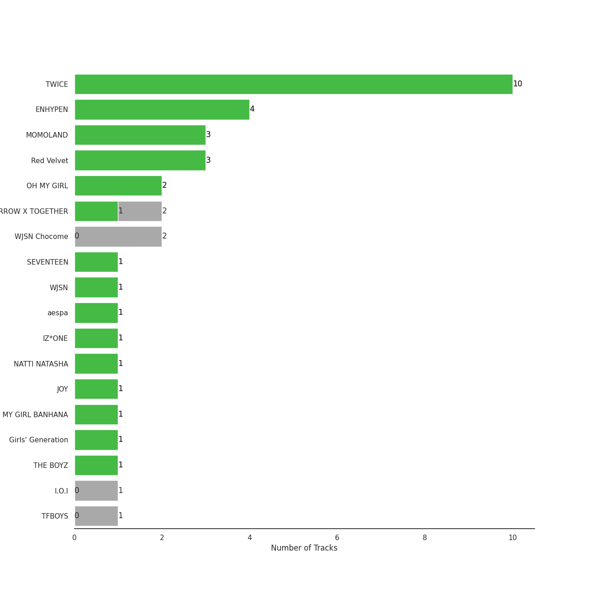
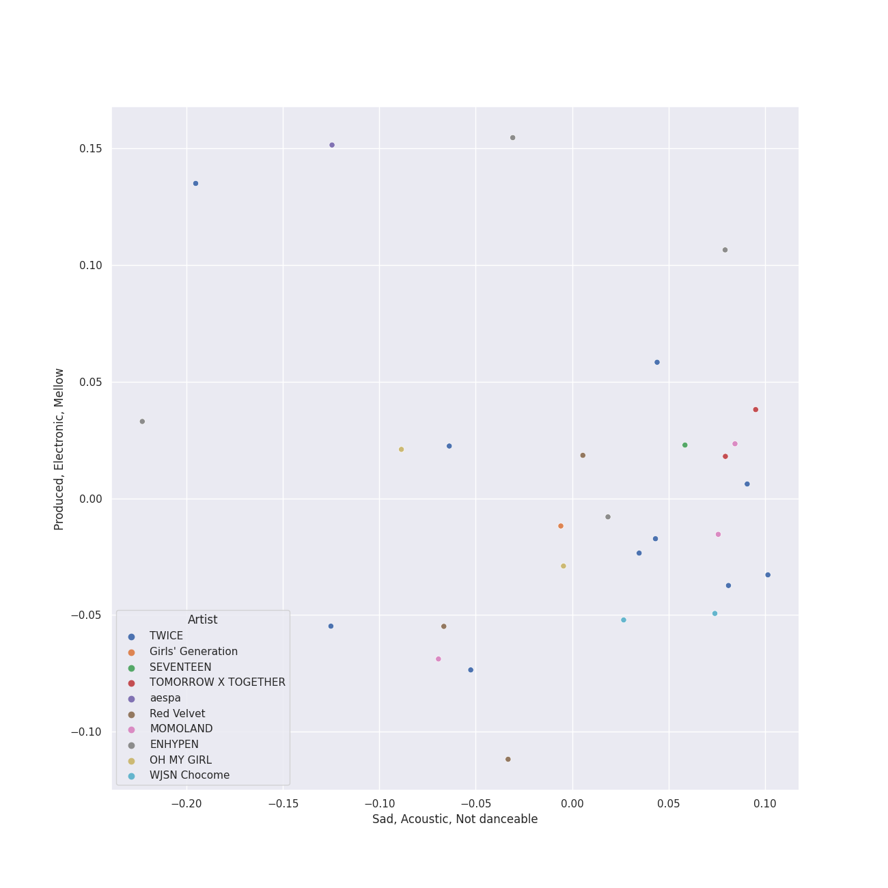
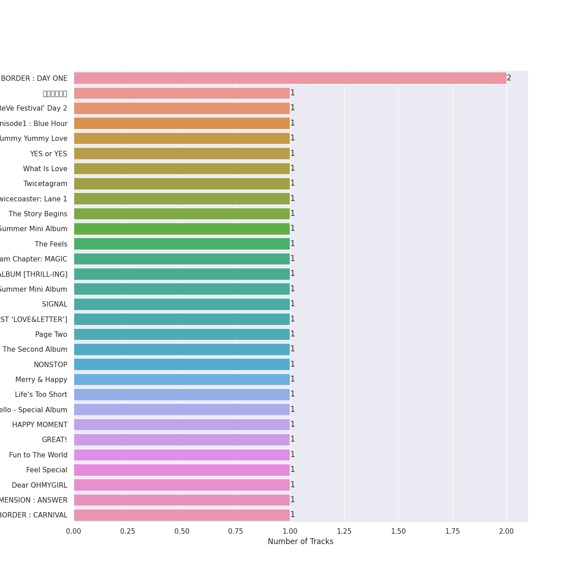
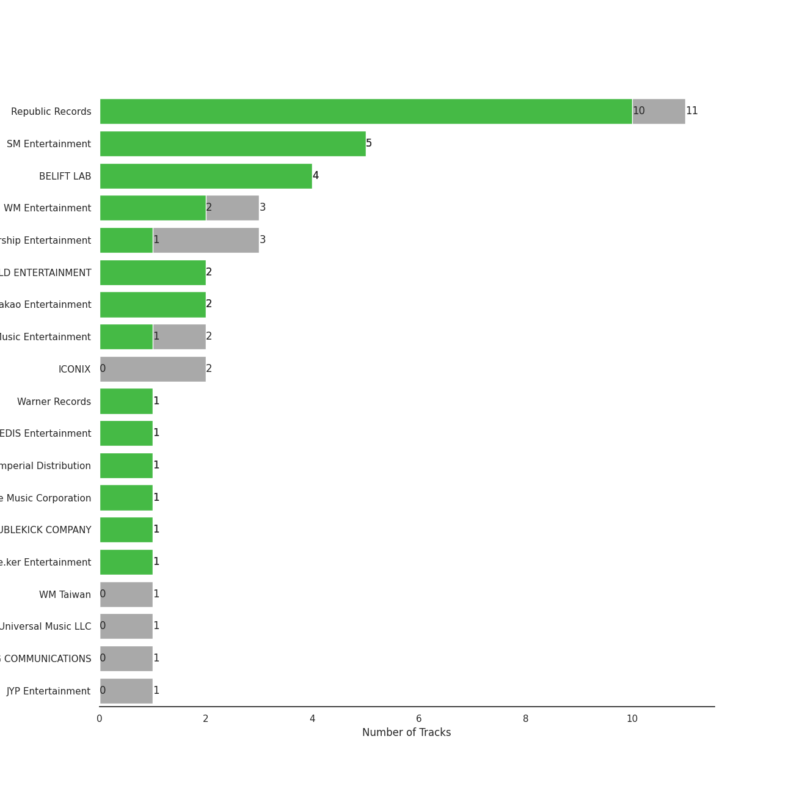
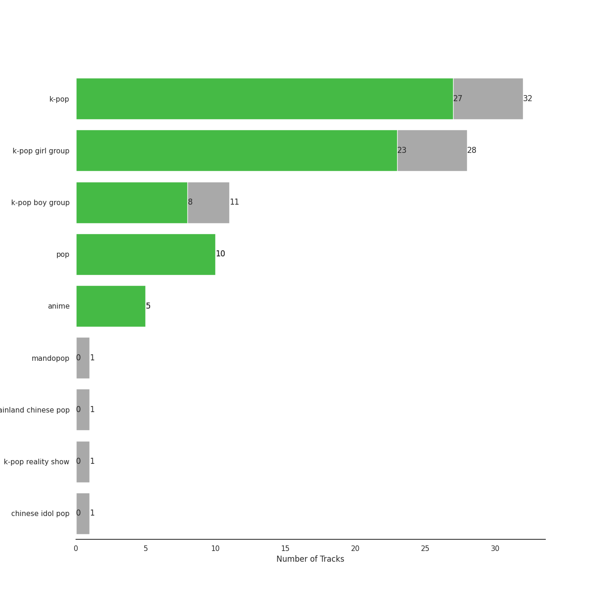
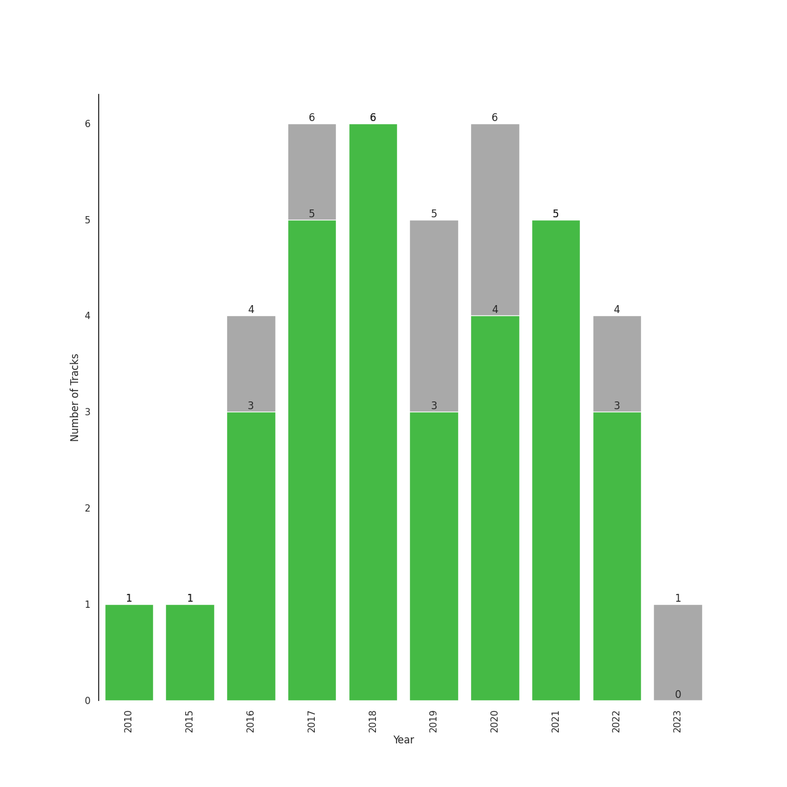

# Aegyo

[36 songs](tracks.md)

## Top Artists

See all 18 artists

| Number of Tracks | Art | Artist | 🔗 |
|---:|:---|:---|:---|
| 10 |  | [TWICE](../../artists/twice.md) | [🔗](https://open.spotify.com/artist/7n2Ycct7Beij7Dj7meI4X0) |
| 4 |  | [ENHYPEN](../../artists/enhypen.md) | [🔗](https://open.spotify.com/artist/5t5FqBwTcgKTaWmfEbwQY9) |
| 3 |  | MOMOLAND | [🔗](https://open.spotify.com/artist/5RR0MLwcjc87wjSw2JYdwx) |
| 3 |  | [Red Velvet](../../artists/red_velvet.md) | [🔗](https://open.spotify.com/artist/1z4g3DjTBBZKhvAroFlhOM) |
| 2 |  | WJSN Chocome | [🔗](https://open.spotify.com/artist/5VyqN5hNo0TbYF0ICU77nn) |
| 2 |  | OH MY GIRL | [🔗](https://open.spotify.com/artist/2019zR22qK2RBvCqtudBaI) |
| 2 |  | TOMORROW X TOGETHER | [🔗](https://open.spotify.com/artist/0ghlgldX5Dd6720Q3qFyQB) |
| 1 |  | [SEVENTEEN](../../artists/seventeen.md) | [🔗](https://open.spotify.com/artist/7nqOGRxlXj7N2JYbgNEjYH) |
| 1 |  | WJSN | [🔗](https://open.spotify.com/artist/6hhqsQZhtp9hfaZhSd0VSD) |
| 1 |  | [aespa](../../artists/aespa.md) | [🔗](https://open.spotify.com/artist/6YVMFz59CuY7ngCxTxjpxE) |
| 1 |  | I.O.I | [🔗](https://open.spotify.com/artist/6RKnXXyprPjhBdCvL802Ku) |
| 1 |  | IZ*ONE | [🔗](https://open.spotify.com/artist/5r1tUTxVSgvBHnoDuDODPH) |
| 1 |  | TFBOYS | [🔗](https://open.spotify.com/artist/1dywcVTpMrP7VmQUhngSce) |
| 1 |  | Natti Natasha | [🔗](https://open.spotify.com/artist/1GDbiv3spRmZ1XdM1jQbT7) |
| 1 |  | JOY | [🔗](https://open.spotify.com/artist/0sYpJ0nCC8AlDrZFeAA7ub) |
| 1 |  | OH MY GIRL BANHANA | [🔗](https://open.spotify.com/artist/0X1f2U9bxiC3DhKA8OcvgG) |
| 1 |  | [Girls' Generation](../../artists/girls__generation.md) | [🔗](https://open.spotify.com/artist/0Sadg1vgvaPqGTOjxu0N6c) |
| 1 |  | THE BOYZ | [🔗](https://open.spotify.com/artist/0CmvFWTX9zmMNCUi6fHtAx) |

## Top Albums

See all 35 albums

| Number of Tracks | Art | Album | Release Date | 🔗 |
|---:|:---|:---|:---|:---|
| 2 |  | BORDER : DAY ONE | 2020-11-30 | [🔗](https://open.spotify.com/album/3YxF7jTnpdNepWbO42f8lH) |
| 1 |  | 青春修炼手册 | 2017-01-01 | [🔗](https://open.spotify.com/album/5sJB1R7udfChkgp5VRfY07) |
| 1 |  | ‘The ReVe Festival’ Day 2 | 2019-08-20 | [🔗](https://open.spotify.com/album/3DXz6ItR9DzIw9S0h3Cxfc) |
| 1 |  | miss me? | 2016-10-17 | [🔗](https://open.spotify.com/album/2YyowuE62RMWFtBSa2EO7r) |
| 1 |  | minisode1 : Blue Hour | 2020-10-26 | [🔗](https://open.spotify.com/album/2DDNDdePEx9R0bBwRqahdr) |
| 1 |  | Yummy Yummy Love | 2022-01-14 | [🔗](https://open.spotify.com/album/2r35RHvEtBjgKiONdItRR5) |
| 1 |  | YES or YES | 2018-11-05 | [🔗](https://open.spotify.com/album/25VunQEW0x2W6ALND2Mh4g) |
| 1 |  | Twicetagram | 2017-10-30 | [🔗](https://open.spotify.com/album/3hJXmK5gWN9P6jtZL0Lr2y) |
| 1 |  | Twicecoaster: Lane 1 | 2016-10-24 | [🔗](https://open.spotify.com/album/5zQhaDNbiXHRqd8Y51I4vy) |
| 1 |  | The Story Begins | 2015-10-20 | [🔗](https://open.spotify.com/album/72WWZVAx6GtSbEeGESwDLo) |
| 1 |  | The Red Summer - Summer Mini Album | 2017-07-09 | [🔗](https://open.spotify.com/album/6OXg149IkmbgW7zfzbwgS2) |
| 1 |  | The Dream Chapter: MAGIC | 2019-10-21 | [🔗](https://open.spotify.com/album/5KoR6s906nbO21C9ZPdwTv) |
| 1 |  | THE BOYZ 6TH MINI ALBUM [THRILL-ING] | 2021-08-09 | [🔗](https://open.spotify.com/album/0lh0pZ8GjZGrAhzIG4Jn0E) |
| 1 |  | Super Yuppers! | 2022-01-05 | [🔗](https://open.spotify.com/album/5Sh3VW04we2IqNP7BlBwuM) |
| 1 |  | Summer Nights | 2018-07-09 | [🔗](https://open.spotify.com/album/2GKTroaa4ysyhEdvzpvUoM) |
| 1 |  | Summer Magic - Summer Mini Album | 2018-08-06 | [🔗](https://open.spotify.com/album/5zWa1ZEUBctbKqvwXbFawo) |
| 1 |  | SIGNAL | 2017-05-15 | [🔗](https://open.spotify.com/album/28PwDunFAR71toOCTYRvkf) |
| 1 |  | SEVENTEEN 1ST ALBUM [FIRST ‘LOVE&LETTER’] | 2016-04-25 | [🔗](https://open.spotify.com/album/50BrkBakrLWufmTLjCVBwn) |
| 1 |  | Page Two | 2016-04-25 | [🔗](https://open.spotify.com/album/6q2oUEqL9uzVXHCeKoA8JV) |
| 1 |  | Oh! - The Second Album | 2010-01-28 | [🔗](https://open.spotify.com/album/4e841RxorIoZIufX8v7p7E) |
| 1 |  | NONSTOP | 2020-04-27 | [🔗](https://open.spotify.com/album/7J8Kp48L7RdLkpjSVrO5PY) |
| 1 |  | Merry & Happy | 2017-12-11 | [🔗](https://open.spotify.com/album/0R7pj4tnmcoUulrZGPo6nw) |
| 1 |  | Hmph! | 2020-10-07 | [🔗](https://open.spotify.com/album/3oiVOb6e43wsvdV4ClJYm0) |
| 1 |  | Hello - Special Album | 2021-05-31 | [🔗](https://open.spotify.com/album/37mRfTDwQzVbHihypYY8oE) |
| 1 |  | HAPPY MOMENT (1) | 2017-06-07 | [🔗](https://open.spotify.com/album/4nnyYQGOKRU090FK7sfunL) |
| 1 |  | Girls - The 2nd Mini Album | 2022-07-08 | [🔗](https://open.spotify.com/album/4w1dbvUy1crv0knXQvcSeY) |
| 1 |  | GREAT! | 2018-01-03 | [🔗](https://open.spotify.com/album/5vt2sEP5J0VNbYXoA7h2k4) |
| 1 |  | Fun to The World | 2018-06-26 | [🔗](https://open.spotify.com/album/75dkh8s39e7txjNe9cODH3) |
| 1 |  | Formula of Love: O+T=<3 | 2021-11-12 | [🔗](https://open.spotify.com/album/5052Ip89wdW8EGdpjEpNeq) |
| 1 |  | Feel Special | 2019-09-23 | [🔗](https://open.spotify.com/album/3NQBPabmRm3LzVcmtkTLfo) |
| 1 |  | Dear OHMYGIRL | 2021-05-10 | [🔗](https://open.spotify.com/album/2xfmLni05CCgygcNdtPvuN) |
| 1 |  | DIMENSION : ANSWER | 2022-01-10 | [🔗](https://open.spotify.com/album/3nOj9hsnptBEDt9ie2lra5) |
| 1 |  | BORDER : CARNIVAL | 2021-04-26 | [🔗](https://open.spotify.com/album/4LGYBcRsteiXjcPD4QQvxv) |
| 1 |  | BLOOM*IZ | 2020-02-17 | [🔗](https://open.spotify.com/album/5dm3PMCHxTSOdDFZ1hlfMm) |
| 1 |  | BANANA ALLERGY MONKEY | 2018-04-02 | [🔗](https://open.spotify.com/album/5KuGBZ8VDDWM47WK2hs0PV) |

## Top Record Labels

See all 15 labels

| Number of Tracks | Label |
|---:|:---|
| 11 | [Republic Records](../../labels/republic_records.md) |
| 5 | [SM Entertainment](../../labels/sm_entertainment.md) |
| 4 | [BELIFT LAB](../../labels/belift_lab.md) |
| 3 | WM Entertainment |
| 3 | [Starship Entertainment](../../labels/starship_entertainment.md) |
| 2 | [Stone Music Entertainment](../../labels/stone_music_entertainment.md) |
| 2 | MLD ENTERTAINMENT |
| 2 | [Kakao Entertainment](../../labels/kakao_entertainment.md) |
| 1 | [Warner Records](../../labels/warner_records.md) |
| 1 | WM Taiwan |
| 1 | [PLEDIS Entertainment](../../labels/pledis_entertainment.md) |
| 1 | Imperial Distribution |
| 1 | [Genie Music Corporation](../../labels/genie_music_corporation.md) |
| 1 | DUBLEKICK COMPANY |
| 1 | Cre.ker Entertainment |

## Genres

See all 8 genres

| Number of Tracks | Genre |
|---:|:---|
| 27 | [k-pop](../../genres/k_pop.md) |
| 26 | [k-pop girl group](../../genres/k_pop_girl_group.md) |
| 8 | [k-pop boy group](../../genres/k_pop_boy_group.md) |
| 4 | anime |
| 1 | mandopop |
| 1 | mainland chinese pop |
| 1 | k-pop reality show |
| 1 | chinese idol pop |

## Years

| 10 newest albums | 10 oldest albums |
|:---|:---|
| 
 Girls - The 2nd Mini Album (2022-07-08)
 | 
 Oh! - The Second Album (2010-01-28)
 |
| 
 Yummy Yummy Love (2022-01-14)
 | 
 The Story Begins (2015-10-20)
 |
| 
 DIMENSION : ANSWER (2022-01-10)
 | 
 Page Two (2016-04-25)
 |
| 
 Super Yuppers! (2022-01-05)
 | 
 SEVENTEEN 1ST ALBUM [FIRST ‘LOVE&LETTER’] (2016-04-25)
 |
| 
 Formula of Love: O+T=<3 (2021-11-12)
 | 
 miss me? (2016-10-17)
 |
| 
 THE BOYZ 6TH MINI ALBUM [THRILL-ING] (2021-08-09)
 | 
 Twicecoaster: Lane 1 (2016-10-24)
 |
| 
 Hello - Special Album (2021-05-31)
 | 
 青春修炼手册 (2017-01-01)
 |
| 
 Dear OHMYGIRL (2021-05-10)
 | 
 SIGNAL (2017-05-15)
 |
| 
 BORDER : CARNIVAL (2021-04-26)
 | 
 HAPPY MOMENT (1) (2017-06-07)
 |
| 
 BORDER : DAY ONE (2020-11-30)
 | 
 The Red Summer - Summer Mini Album (2017-07-09)
 |
## Audio Features

| 10 most Danceable tracks | 10 least Danceable tracks |
|:---|:---|
| 10 Months (0.876) | Hello (0.392) |
| Dolphin (0.858) | Life's Too Short (English Version) (0.472) |
| Banana Allergy Monkey (0.815) | Let Me In (20 CUBE) (0.483) |
| The Feels (0.808) | CHEER UP (0.551) |
| Hmph! (0.796) | Heart Shaker (0.564) |
| BBoom BBoom (0.785) | What is Love (0.574) |
| FIESTA (0.756) | Not For Sale (0.583) |
| Gee (0.756) | Signal (0.62) |
| Babyface (0.752) | Super Yuppers! (0.636) |
| Very Very Very (0.744) | 9 and Three Quarters (Run Away) (0.639) |

| 10 most Energetic tracks | 10 least Energetic tracks |
|:---|:---|
| Very Very Very (0.963) | Not For Sale (0.589) |
| Feel Special (0.959) | Polaroid Love (0.67) |
| Hmph! (0.958) | Dolphin (0.68) |
| Dun Dun Dance (0.957) | 10 Months (0.73) |
| Heart Shaker (0.944) | BBoom BBoom (0.744) |
| BAAM (0.94) | 9 and Three Quarters (Run Away) (0.756) |
| Umpah Umpah (0.935) | Signal (0.761) |
| Power Up (0.934) | Let Me In (20 CUBE) (0.795) |
| Super Yuppers! (0.931) | Life's Too Short (English Version) (0.8) |
| Pretty U (0.931) | Babyface (0.803) |

| 10 most Speechy tracks | 10 least Speechy tracks |
|:---|:---|
| Signal (0.334) | Gee (0.0274) |
| Life's Too Short (English Version) (0.265) | Likey (0.033) |
| Not For Sale (0.203) | Hmph! (0.0358) |
| Red Flavor (0.189) | BBoom BBoom (0.0369) |
| Let Me In (20 CUBE) (0.181) | THRILL RIDE (0.037) |
| Pretty U (0.163) | YES or YES (0.0374) |
| 青春修炼手册 (0.161) | BAAM (0.0435) |
| Power Up (0.144) | Polaroid Love (0.0439) |
| CHEER UP (0.124) | Hello (0.0459) |
| Super Yuppers! (0.102) | 10 Months (0.0492) |

| 10 most Acoustic tracks | 10 least Acoustic tracks |
|:---|:---|
| Polaroid Love (0.458) | Let Me In (20 CUBE) (0.00258) |
| Likey (0.413) | 9 and Three Quarters (Run Away) (0.0055) |
| Hello (0.351) | Blue Hour (0.00962) |
| Life's Too Short (English Version) (0.289) | Super Yuppers! (0.00982) |
| Gee (0.281) | BBoom BBoom (0.0149) |
| Like Ooh-Ahh (0.241) | Pretty U (0.0173) |
| Signal (0.22) | Umpah Umpah (0.0258) |
| Dolphin (0.171) | Feel Special (0.0296) |
| Dun Dun Dance (0.169) | 10 Months (0.0345) |
| CHEER UP (0.139) | Babyface (0.0376) |

| 10 most Instrumental tracks | 10 least Instrumental tracks |
|:---|:---|
| Power Up (0.00745) | Gee (0.0) |
| BBoom BBoom (0.00666) | Pretty U (0.0) |
| BAAM (0.00431) | Signal (0.0) |
| Feel Special (0.00188) | 9 and Three Quarters (Run Away) (0.0) |
| Hmph! (0.000423) | Life's Too Short (English Version) (0.0) |
| Likey (0.000377) | The Feels (0.0) |
| TT (0.00016) | Super Yuppers! (0.0) |
| Like Ooh-Ahh (0.000105) | Dolphin (0.0) |
| YES or YES (3.72e-06) | Blue Hour (0.0) |
| Very Very Very (1.86e-06) | Hello (0.0) |

| 10 most Live tracks | 10 least Live tracks |
|:---|:---|
| Umpah Umpah (0.437) | BBoom BBoom (0.0661) |
| Yummy Yummy Love (0.414) | Pretty U (0.0815) |
| TT (0.399) | The Feels (0.0816) |
| Like Ooh-Ahh (0.382) | Very Very Very (0.0836) |
| Polaroid Love (0.361) | Red Flavor (0.0839) |
| Hello (0.349) | BAAM (0.0864) |
| FIESTA (0.343) | Blue Hour (0.0871) |
| Power Up (0.306) | Hmph! (0.088) |
| Super Yuppers! (0.296) | Let Me In (20 CUBE) (0.0912) |
| What is Love (0.264) | THRILL RIDE (0.0971) |

| 10 most Happy tracks | 10 least Happy tracks |
|:---|:---|
| Hmph! (0.926) | TT (0.396) |
| The Feels (0.922) | Likey (0.443) |
| BAAM (0.905) | CHEER UP (0.509) |
| Power Up (0.898) | Red Flavor (0.515) |
| Pretty U (0.884) | 9 and Three Quarters (Run Away) (0.532) |
| Super Yuppers! (0.879) | Life's Too Short (English Version) (0.548) |
| Heart Shaker (0.857) | Not For Sale (0.56) |
| Umpah Umpah (0.844) | 青春修炼手册 (0.564) |
| BBoom BBoom (0.833) | What is Love (0.569) |
| Banana Allergy Monkey (0.81) | Dolphin (0.621) |
