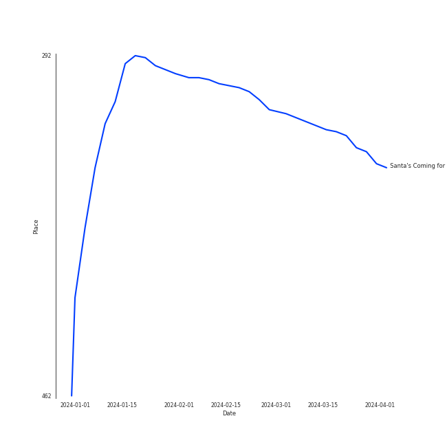

# Tracks in Alt-Pop from 2018

## Artists

| Art | Tracks | 💚 | Artist | 🔗 |
|:---|---:|---:|:---|:---|
|  | 3 | 3 | [Clean Bandit](../../../artists/clean_bandit/overview.md) | [🔗](https://open.spotify.com/artist/6MDME20pz9RveH9rEXvrOM) |
|  | 4 | 1 | Sammy Rae & The Friends | [🔗](https://open.spotify.com/artist/3lFDsTyYNPQc8WzJExnQWn) |
|  | 1 | 1 | Vulfpeck | [🔗](https://open.spotify.com/artist/7pXu47GoqSYRajmBCjxdD6) |
|  | 1 | 1 | Metropole Orkest | [🔗](https://open.spotify.com/artist/7JYdpWAsiqzrmMB3qxkEbI) |
|  | 1 | 1 | The Happy Fits | [🔗](https://open.spotify.com/artist/73rPcaYEhBd0UuVZBqqyQJ) |
|  | 1 | 1 | [Billie Eilish](../../../artists/billie_eilish/overview.md) | [🔗](https://open.spotify.com/artist/6qqNVTkY8uBg9cP3Jd7DAH) |
|  | 1 | 1 | Demi Lovato | [🔗](https://open.spotify.com/artist/6S2OmqARrzebs0tKUEyXyp) |
|  | 1 | 1 | Khalid | [🔗](https://open.spotify.com/artist/6LuN9FCkKOj5PcnpouEgny) |
|  | 1 | 1 | Jules Buckley | [🔗](https://open.spotify.com/artist/5gGbAKDXhDoBXIJe8SuBvX) |
|  | 1 | 1 | Sean Paul | [🔗](https://open.spotify.com/artist/3Isy6kedDrgPYoTS1dazA9) |

View all

| Art | Tracks | 💚 | Artist | 🔗 |
|:---|---:|---:|:---|:---|
|  | 1 | 1 | Theo Katzman | [🔗](https://open.spotify.com/artist/2a4lU7F8toqKpb5v6Ftqya) |
|  | 1 | 1 | Anne-Marie | [🔗](https://open.spotify.com/artist/1zNqDE7qDGCsyzJwohVaoX) |
|  | 1 | 1 | Zara Larsson | [🔗](https://open.spotify.com/artist/1Xylc3o4UrD53lo9CvFvVg) |
|  | 1 | 1 | [Jacob Collier](../../../artists/jacob_collier/overview.md) | [🔗](https://open.spotify.com/artist/0QWrMNukfcVOmgEU0FEDyD) |
|  | 1 | 1 | Jacob Banks | [🔗](https://open.spotify.com/artist/0AepkoQhYvkjEzzwIcGxdV) |
|  | 5 | 0 | [Kimbra](../../../artists/kimbra/overview.md) | [🔗](https://open.spotify.com/artist/6hk7Yq1DU9QcCCrz9uc0Ti) |
|  | 2 | 0 | [Sia](../../../artists/sia/overview.md) | [🔗](https://open.spotify.com/artist/5WUlDfRSoLAfcVSX1WnrxN) |
|  | 1 | 0 | [Janelle Monáe](../../../artists/janelle_monáe/overview.md) | [🔗](https://open.spotify.com/artist/6ueGR6SWhUJfvEhqkvMsVs) |
|  | 1 | 0 | Tove Styrke | [🔗](https://open.spotify.com/artist/2QSPrJfYeRXaltEEiriXN9) |
|  | 1 | 0 | [Florence + The Machine](../../../artists/florence_+_the_machine/overview.md) | [🔗](https://open.spotify.com/artist/1moxjboGR7GNWYIMWsRjgG) |
|  | 1 | 0 | Grimes | [🔗](https://open.spotify.com/artist/053q0ukIDRgzwTr4vNSwab) |

## Albums

| Art | Tracks | 💚 | Album | Release Date | 🔗 |
|:---|---:|---:|:---|:---|:---|
|  | 5 | 0 | Primal Heart | 2018-04-20 | [🔗](https://open.spotify.com/album/4pj0BkJ7u39i009oqe8V79) |
|  | 4 | 1 | The Good Life | 2018-07-10 | [🔗](https://open.spotify.com/album/2xCZSSa0kfIJFDhQR8bYar) |
|  | 2 | 2 | What Is Love? (Deluxe Edition) | 2018-11-30 | [🔗](https://open.spotify.com/album/1MvF4ulZKH7SaDQs9rE5nc) |
|  | 2 | 0 | Everyday Is Christmas (Deluxe Edition) | 2018-11-01 | [🔗](https://open.spotify.com/album/2vcGYJcPfXUmCdcXXqqukg) |
|  | 1 | 1 | lovely (with Khalid) | 2018-04-19 | [🔗](https://open.spotify.com/album/2sBB17RXTamvj7Ncps15AK) |
|  | 1 | 1 | Village | 2018-11-02 | [🔗](https://open.spotify.com/album/2KxC2M0bVm5hrK3GgGMuV9) |
|  | 1 | 1 | Solo (feat. Demi Lovato) | 2018-05-17 | [🔗](https://open.spotify.com/album/1q7a5wZeti0neU2jDn8Dz3) |
|  | 1 | 1 | Hill Climber | 2018-12-07 | [🔗](https://open.spotify.com/album/2cZ4rjMOn8zz1ToKSBQVWa) |
|  | 1 | 1 | Djesse Vol. 1 | 2018-12-07 | [🔗](https://open.spotify.com/album/47bMDS4CMLbqcIVjEMWUjK) |
|  | 1 | 1 | Concentrate | 2018-06-15 | [🔗](https://open.spotify.com/album/1mgzsmNo3XcdjonlRIwvFk) |

View all

| Art | Tracks | 💚 | Album | Release Date | 🔗 |
|:---|---:|---:|:---|:---|:---|
|  | 1 | 0 | Sway | 2018-05-04 | [🔗](https://open.spotify.com/album/3fSRbKgYW6kcR1ZFMaaNV4) |
|  | 1 | 0 | High As Hope | 2018-06-29 | [🔗](https://open.spotify.com/album/0pKZJj9GzcKPCS8r4IaksA) |
|  | 1 | 0 | Dirty Computer | 2018-04-27 | [🔗](https://open.spotify.com/album/2PjlaxlMunGOUvcRzlTbtE) |

## Tracks

| Art | Track | Album | Artists | Label | Rank | 💚 | 🔗 |
|:---|:---|:---|:---|:---|---:|:---|:---|
|  | Santa's Coming for Us | Everyday Is Christmas (Deluxe Edition) | [Sia](../../../artists/sia/overview.md) | [Monkey Puzzle/Atlantic](../../../labels/atlantic_records) | 351 | | [🔗](https://open.spotify.com/track/1N1ZpYUJc9fwrqk53FGgWv) |
|  | lovely (with Khalid) | lovely (with Khalid) | [Billie Eilish](../../../artists/billie_eilish/overview.md), Khalid | [Darkroom](../../../labels/darkroom) | nan | 💚 | [🔗](https://open.spotify.com/track/0u2P5u6lvoDfwTYjAADbn4) |
|  | Lightyears | Primal Heart | [Kimbra](../../../artists/kimbra/overview.md) | [Warner Records](../../../labels/warner_records) | nan | | [🔗](https://open.spotify.com/track/0lArgFRoTvsmrt7A6DzMXL) |
|  | Like They Do on the TV | Primal Heart | [Kimbra](../../../artists/kimbra/overview.md) | [Warner Records](../../../labels/warner_records) | nan | | [🔗](https://open.spotify.com/track/28FSs3VqsHiEGa8dIfnG2T) |
|  | Recovery | Primal Heart | [Kimbra](../../../artists/kimbra/overview.md) | [Warner Records](../../../labels/warner_records) | nan | | [🔗](https://open.spotify.com/track/0HqtTIH9Eo7IdTiiFvpdjM) |
|  | The Good War | Primal Heart | [Kimbra](../../../artists/kimbra/overview.md) | [Warner Records](../../../labels/warner_records) | nan | | [🔗](https://open.spotify.com/track/3Py6qWHKkcdBEVcYThxhp9) |
|  | Top of the World | Primal Heart | [Kimbra](../../../artists/kimbra/overview.md) | [Warner Records](../../../labels/warner_records) | nan | | [🔗](https://open.spotify.com/track/1Gbdx88ElOui7lczwxGX6m) |
|  | Pynk (feat. Grimes) | Dirty Computer | [Janelle Monáe](../../../artists/janelle_monáe/overview.md), Grimes | [Bad Boy Records](../../../labels/bad_boy) | nan | | [🔗](https://open.spotify.com/track/5OpiyfqaQLdtwHd3SfembH) |
|  | Say My Name | Sway | Tove Styrke | [RCA Records Label](../../../labels/rca_records_label) | nan | | [🔗](https://open.spotify.com/track/2XDJzMW1MUWeAIQoMOJeUj) |
|  | Solo (feat. Demi Lovato) | Solo (feat. Demi Lovato) | [Clean Bandit](../../../artists/clean_bandit/overview.md), Demi Lovato | Atlantic Records UK | nan | 💚 | [🔗](https://open.spotify.com/track/6kPJZM97LwdG9QIsT7khp6) |

View all

| Art | Track | Album | Artists | Label | Rank | 💚 | 🔗 |
|:---|:---|:---|:---|:---|---:|:---|:---|
|  | Relimerence | Concentrate | The Happy Fits | The Happy Fits Records | nan | 💚 | [🔗](https://open.spotify.com/track/77fgmofMCNb6Lra5ZMvEDE) |
|  | Hunger | High As Hope | [Florence + The Machine](../../../artists/florence_+_the_machine/overview.md) | [EMI](../../../labels/emi) | nan | | [🔗](https://open.spotify.com/track/6Ju28M6P8Y8sLjBgWjyUUD) |
|  | Flesh & Bone | The Good Life | Sammy Rae & The Friends | Nettwerk Records | nan | | [🔗](https://open.spotify.com/track/0awxPw2WkYJVzcSKWvJZAh) |
|  | Kick It to Me | The Good Life | Sammy Rae & The Friends | Nettwerk Records | nan | | [🔗](https://open.spotify.com/track/5omukHtcJduzkSfOlze4iB) |
|  | Talk It Up | The Good Life | Sammy Rae & The Friends | Nettwerk Records | nan | 💚 | [🔗](https://open.spotify.com/track/32jOQyOqRdxSEiQJTjvZM2) |
|  | The Feeling | The Good Life | Sammy Rae & The Friends | Nettwerk Records | nan | | [🔗](https://open.spotify.com/track/1aVedqqfdBKK0XsrjNJerA) |
|  | Snowman | Everyday Is Christmas (Deluxe Edition) | [Sia](../../../artists/sia/overview.md) | [Monkey Puzzle/Atlantic](../../../labels/atlantic_records) | nan | | [🔗](https://open.spotify.com/track/7uoFMmxln0GPXQ0AcCBXRq) |
|  | Unknown (To You) | Village | Jacob Banks | UMGRI Interscope | nan | 💚 | [🔗](https://open.spotify.com/track/4jDDaKTqcZQWvgubuW6N7l) |
|  | Rockabye (feat. Sean Paul & Anne-Marie) | What Is Love? (Deluxe Edition) | [Clean Bandit](../../../artists/clean_bandit/overview.md), Sean Paul, Anne-Marie | Atlantic Records UK | nan | 💚 | [🔗](https://open.spotify.com/track/2hrUO4drrO63i7FYbCLBl2) |
|  | Symphony (feat. Zara Larsson) | What Is Love? (Deluxe Edition) | [Clean Bandit](../../../artists/clean_bandit/overview.md), Zara Larsson | Atlantic Records UK | nan | 💚 | [🔗](https://open.spotify.com/track/72gv4zhNvRVdQA0eOenCal) |
|  | With The Love In My Heart | Djesse Vol. 1 | [Jacob Collier](../../../artists/jacob_collier/overview.md), Metropole Orkest, Jules Buckley | [Decca (UMO)](../../../labels/decca_(umo)) | nan | 💚 | [🔗](https://open.spotify.com/track/0ZVPABdzJEa0nG85uAlBjB) |
|  | Half of the Way | Hill Climber | Vulfpeck, Theo Katzman | Vulf Records | nan | 💚 | [🔗](https://open.spotify.com/track/3uFp6gGgNMtSEmzx1cHTG4) |

