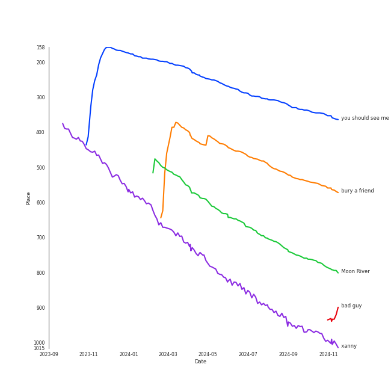

# Tracks in Alt-Pop from 2019

## Artists

| Art | Rank | Tracks | 💚 | Artist | 🔗 |
|:---|---:|---:|---:|:---|:---|
|  | 45 | 6 | 6 | [Billie Eilish](../../../artists/billie_eilish/overview.md) | [🔗](https://open.spotify.com/artist/6qqNVTkY8uBg9cP3Jd7DAH) |
|  | 185 | 2 | 2 | Faouzia | [🔗](https://open.spotify.com/artist/5NhgsV7qPWHZqYEMKzbYvo) |
|  | 39 | 2 | 1 | [Jacob Collier](../../../artists/jacob_collier/overview.md) | [🔗](https://open.spotify.com/artist/0QWrMNukfcVOmgEU0FEDyD) |
|  | 432 | 1 | 1 | half•alive | [🔗](https://open.spotify.com/artist/7sOR7gk6XUlGnxj3p9F54k) |
|  | 91 | 1 | 1 | [Kimbra](../../../artists/kimbra/overview.md) | [🔗](https://open.spotify.com/artist/6hk7Yq1DU9QcCCrz9uc0Ti) |
|  | 432 | 1 | 1 | Destiny Rogers | [🔗](https://open.spotify.com/artist/6gezkje7GoJlQbHBgLXHuu) |
|  | 432 | 1 | 1 | Maggie Rogers | [🔗](https://open.spotify.com/artist/4NZvixzsSefsNiIqXn0NDe) |
|  | 102 | 1 | 1 | Christopher | [🔗](https://open.spotify.com/artist/3zDRCqOhJXJfS2YWOEwGMC) |
|  | 432 | 1 | 1 | Gotye | [🔗](https://open.spotify.com/artist/2AsusXITU8P25dlRNhcAbG) |
|  | 118 | 3 | 0 | [Lana Del Rey](../../../artists/lana_del_rey/overview.md) | [🔗](https://open.spotify.com/artist/00FQb4jTyendYWaN8pK0wa) |

View all

| Art | Rank | Tracks | 💚 | Artist | 🔗 |
|:---|---:|---:|---:|:---|:---|
|  | 120 | 1 | 0 | [Sammy Rae & The Friends](../../../artists/sammy_rae___the_friends/overview.md) | [🔗](https://open.spotify.com/artist/3lFDsTyYNPQc8WzJExnQWn) |
|  | 134 | 1 | 0 | Lolo Zouaï | [🔗](https://open.spotify.com/artist/2qDIR2WlcW3llkGqJWg9VJ) |

## Albums

| Art | Rank | Tracks | 💚 | Album | Release Date | 🔗 |
|:---|---:|---:|---:|:---|:---|:---|
|  | 218 | 5 | 5 | WHEN WE ALL FALL ASLEEP, WHERE DO WE GO? | 2019-03-29 | [🔗](https://open.spotify.com/album/0S0KGZnfBGSIssfF54WSJh) |
|  | 661 | 3 | 0 | Norman Fucking Rockwell! | 2019-08-30 | [🔗](https://open.spotify.com/album/5XpEKORZ4y6OrCZSKsi46A) |
|  | 521 | 2 | 1 | Djesse Vol. 2 | 2019-07-19 | [🔗](https://open.spotify.com/album/3zNi5dCpkbm4zv7h1vGOMy) |
|  | 661 | 1 | 1 | everything i wanted | 2019-11-13 | [🔗](https://open.spotify.com/album/4i3rAwPw7Ln2YrKDusaWyT) |
|  | 661 | 1 | 1 | Under the Surface | 2019-02-22 | [🔗](https://open.spotify.com/album/6ISIdF1gCK9X8pn4FaObHE) |
|  | 661 | 1 | 1 | Tomboy | 2019-02-28 | [🔗](https://open.spotify.com/album/2uDZBeyyQ7mfwF9mUJeYUG) |
|  | 661 | 1 | 1 | Tears of Gold | 2019-11-20 | [🔗](https://open.spotify.com/album/7INSJKOxZcMGywJyf9bEWi) |
|  | 661 | 1 | 1 | Now, Not Yet | 2019-08-09 | [🔗](https://open.spotify.com/album/2KSWrd22LGc0Hmqs2Z5i7z) |
|  | 661 | 1 | 1 | Heard It In A Past Life | 2019-01-18 | [🔗](https://open.spotify.com/album/5AHWNPo3gllDmixgAoFru4) |
|  | 661 | 1 | 1 | Born Without a Heart | 2019-03-28 | [🔗](https://open.spotify.com/album/5EOIYFpu56h7AgQxCRcyZG) |

View all

| Art | Rank | Tracks | 💚 | Album | Release Date | 🔗 |
|:---|---:|---:|---:|:---|:---|:---|
|  | 661 | 1 | 1 | Aussie Legends | 2019-11-22 | [🔗](https://open.spotify.com/album/3IGRFGa4ErR0CU8aMMrRql) |
|  | 661 | 1 | 0 | Saw It Coming | 2019-05-10 | [🔗](https://open.spotify.com/album/1rMlFYPvk8FFDQYIJ8pudV) |
|  | 661 | 1 | 0 | High Highs to Low Lows | 2019-04-19 | [🔗](https://open.spotify.com/album/1zYV9ByVJ4JURQ1f2q9Rnf) |

## Tracks

| Art | Track | Album | Artists | Label | Rank | 💚 | 🔗 |
|:---|:---|:---|:---|:---|---:|:---|:---|
|  | you should see me in a crown | WHEN WE ALL FALL ASLEEP, WHERE DO WE GO? | [Billie Eilish](../../../artists/billie_eilish/overview.md) | [Darkroom](../../../labels/darkroom), [Interscope Records](../../../labels/interscope_records) | 347 | 💚 | [🔗](https://open.spotify.com/track/3XF5xLJHOQQRbWya6hBp7d) |
|  | bury a friend | WHEN WE ALL FALL ASLEEP, WHERE DO WE GO? | [Billie Eilish](../../../artists/billie_eilish/overview.md) | [Darkroom](../../../labels/darkroom), [Interscope Records](../../../labels/interscope_records) | 557 | 💚 | [🔗](https://open.spotify.com/track/4SSnFejRGlZikf02HLewEF) |
|  | Moon River | Djesse Vol. 2 | [Jacob Collier](../../../artists/jacob_collier/overview.md) | [Decca (UMO)](../../../labels/decca_(umo)) | 786 | | [🔗](https://open.spotify.com/track/1IRRqn75jaZHp7zMT1NGbZ) |
|  | xanny | WHEN WE ALL FALL ASLEEP, WHERE DO WE GO? | [Billie Eilish](../../../artists/billie_eilish/overview.md) | [Darkroom](../../../labels/darkroom), [Interscope Records](../../../labels/interscope_records) | 998 | 💚 | [🔗](https://open.spotify.com/track/4QIo4oxwzzafcBWkKjDpXY) |
|  | Light On | Heard It In A Past Life | Maggie Rogers | [Capitol Records](../../../labels/capitol_records) | 1009 | 💚 | [🔗](https://open.spotify.com/track/6UnCGAEmrbGIOSmGRZQ1M2) |
|  | Bad | Under the Surface | Christopher | Parlophone Denmark | 1009 | 💚 | [🔗](https://open.spotify.com/track/66zdGutAO6NJmMjH8ejBIq) |
|  | Tomboy | Tomboy | Destiny Rogers | Not specified | 1009 | 💚 | [🔗](https://open.spotify.com/track/5Ti3fqGTfjUsSdylFNy0Ng) |
|  | Born Without a Heart | Born Without a Heart | Faouzia | Faouzia 2019 | 1009 | 💚 | [🔗](https://open.spotify.com/track/6i5jBmnB22alUpJ7hpznuj) |
|  | bad guy | WHEN WE ALL FALL ASLEEP, WHERE DO WE GO? | [Billie Eilish](../../../artists/billie_eilish/overview.md) | [Darkroom](../../../labels/darkroom), [Interscope Records](../../../labels/interscope_records) | 1009 | 💚 | [🔗](https://open.spotify.com/track/2Fxmhks0bxGSBdJ92vM42m) |
|  | when the party's over | WHEN WE ALL FALL ASLEEP, WHERE DO WE GO? | [Billie Eilish](../../../artists/billie_eilish/overview.md) | [Darkroom](../../../labels/darkroom), [Interscope Records](../../../labels/interscope_records) | 1009 | 💚 | [🔗](https://open.spotify.com/track/43zdsphuZLzwA9k4DJhU0I) |

View all

| Art | Track | Album | Artists | Label | Rank | 💚 | 🔗 |
|:---|:---|:---|:---|:---|---:|:---|:---|
|  | Desert Rose | High Highs to Low Lows | Lolo Zouaï | [Keep It On The Lolo/RCA Records](../../../labels/rca_records_label) | 1009 | | [🔗](https://open.spotify.com/track/0HUdWSPyrr98kiAdR3Mvyp) |
|  | Saw It Coming | Saw It Coming | [Sammy Rae & The Friends](../../../artists/sammy_rae___the_friends/overview.md) | [Nettwerk Music Group](../../../labels/nettwerk_music_group) | 1009 | | [🔗](https://open.spotify.com/track/0hU26xDCONlEnAtcMGw4NC) |
|  | Make Me Cry | Djesse Vol. 2 | [Jacob Collier](../../../artists/jacob_collier/overview.md) | [Decca (UMO)](../../../labels/decca_(umo)) | 1009 | 💚 | [🔗](https://open.spotify.com/track/4Y6VEDkRSpbn8Wt8x18RHh) |
|  | still feel. | Now, Not Yet | half•alive | [half·alive/RCA Records](../../../labels/rca_records_label) | 1009 | 💚 | [🔗](https://open.spotify.com/track/48XkVAagIoQHCsOlJtXUd5) |
|  | Doin' Time | Norman Fucking Rockwell! | [Lana Del Rey](../../../artists/lana_del_rey/overview.md) | [Polydor Records](../../../labels/polydor_records) | 1009 | | [🔗](https://open.spotify.com/track/0Oqc0kKFsQ6MhFOLBNZIGX) |
|  | Fuck it I love you | Norman Fucking Rockwell! | [Lana Del Rey](../../../artists/lana_del_rey/overview.md) | [Polydor Records](../../../labels/polydor_records) | 1009 | | [🔗](https://open.spotify.com/track/7MtVPRGtZl6rPjMfLoI3Lh) |
|  | Norman fucking Rockwell | Norman Fucking Rockwell! | [Lana Del Rey](../../../artists/lana_del_rey/overview.md) | [Polydor Records](../../../labels/polydor_records) | 1009 | | [🔗](https://open.spotify.com/track/3RIgHHpnFKj5Rni1shokDj) |
|  | everything i wanted | everything i wanted | [Billie Eilish](../../../artists/billie_eilish/overview.md) | [Darkroom](../../../labels/darkroom), [Interscope Records](../../../labels/interscope_records) | 1009 | 💚 | [🔗](https://open.spotify.com/track/3ZCTVFBt2Brf31RLEnCkWJ) |
|  | Tears of Gold | Tears of Gold | Faouzia | Faouzia 2019 | 1009 | 💚 | [🔗](https://open.spotify.com/track/2YyLNljkMy2viVcXoFGTDY) |
|  | Somebody That I Used To Know | Aussie Legends | Gotye, [Kimbra](../../../artists/kimbra/overview.md) | UMG Recordings, Inc. | 1009 | 💚 | [🔗](https://open.spotify.com/track/54ZV2zBKOn1EVDUs7Jvf2F) |

