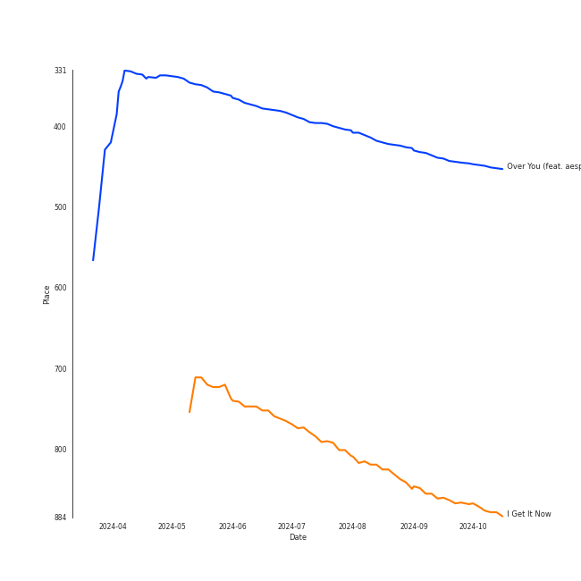

# Tracks in Alt-Pop from 2024

## Artists

| Art | Rank | Tracks | 💚 | Artist | 🔗 |
|:---|---:|---:|---:|:---|:---|
|  | 39 | 6 | 5 | [Jacob Collier](../../../artists/jacob_collier/overview.md) | [🔗](https://open.spotify.com/artist/0QWrMNukfcVOmgEU0FEDyD) |
|  | 130 | 7 | 4 | [Sammy Rae & The Friends](../../../artists/sammy_rae___the_friends/overview.md) | [🔗](https://open.spotify.com/artist/3lFDsTyYNPQc8WzJExnQWn) |
|  | 45 | 4 | 4 | [Billie Eilish](../../../artists/billie_eilish/overview.md) | [🔗](https://open.spotify.com/artist/6qqNVTkY8uBg9cP3Jd7DAH) |
|  | 293 | 3 | 2 | Charli xcx | [🔗](https://open.spotify.com/artist/25uiPmTg16RbhZWAqwLBy5) |
|  | 431 | 1 | 1 | Lindsey Lomis | [🔗](https://open.spotify.com/artist/7qY2O8bWspXlSwQl5JAkvn) |
|  | 1 | 1 | 1 | [aespa](../../../artists/aespa/overview.md) | [🔗](https://open.spotify.com/artist/6YVMFz59CuY7ngCxTxjpxE) |
|  | 431 | 1 | 1 | Anoushka Shankar | [🔗](https://open.spotify.com/artist/6MTByljF8u5omBltY2VKPU) |
|  | 143 | 1 | 1 | [Sia](../../../artists/sia/overview.md) | [🔗](https://open.spotify.com/artist/5WUlDfRSoLAfcVSX1WnrxN) |
|  | 431 | 1 | 1 | Varijashree Venugopal | [🔗](https://open.spotify.com/artist/59GUnH7f4NlLkxSxtNNt0i) |
|  | 145 | 1 | 1 | Lolo Zouaï | [🔗](https://open.spotify.com/artist/2qDIR2WlcW3llkGqJWg9VJ) |

View all

| Art | Rank | Tracks | 💚 | Artist | 🔗 |
|:---|---:|---:|---:|:---|:---|
|  | 431 | 1 | 1 | Camilo | [🔗](https://open.spotify.com/artist/28gNT5KBp7IjEOQoevXf9N) |
|  | 131 | 1 | 1 | Steam Powered Giraffe | [🔗](https://open.spotify.com/artist/1yqs45BSh7457Flyhmdv7f) |
|  | 251 | 1 | 1 | Chris Martin | [🔗](https://open.spotify.com/artist/0LQoZQIV0mIs0y0XQb0Sw2) |
|  | 431 | 1 | 0 | John Legend | [🔗](https://open.spotify.com/artist/5y2Xq6xcjJb2jVM54GHK3t) |
|  | 333 | 1 | 0 | Tori Kelly | [🔗](https://open.spotify.com/artist/1vSN1fsvrzpbttOYGsliDr) |

## Albums

| Art | Rank | Tracks | 💚 | Album | Release Date | 🔗 |
|:---|---:|---:|---:|:---|:---|:---|
|  | 317 | 6 | 5 | Djesse Vol. 4 | 2024-03-01 | [🔗](https://open.spotify.com/album/13r6eqjYlKELFQlNvVCBz1) |
|  | 650 | 4 | 2 | Something for Everybody | 2024-09-20 | [🔗](https://open.spotify.com/album/0t0hNxHpqtvn7dT3YO18ma) |
|  | 650 | 3 | 3 | HIT ME HARD AND SOFT | 2024-05-17 | [🔗](https://open.spotify.com/album/7aJuG4TFXa2hmE4z1yxc3n) |
|  | 587 | 3 | 2 | I Get It Now | 2024-04-12 | [🔗](https://open.spotify.com/album/5zZHAGHasjwkR9B1xX3Xq6) |
|  | 650 | 2 | 1 | BRAT | 2024-06-07 | [🔗](https://open.spotify.com/album/2lIZef4lzdvZkiiCzvPKj7) |
|  | 650 | 1 | 1 | Please Hold | 2024-09-13 | [🔗](https://open.spotify.com/album/3yTyKaDM9gEzPuSgTCWTmq) |
|  | 650 | 1 | 1 | I Forgive You | 2024-04-12 | [🔗](https://open.spotify.com/album/3RPlxsjui6dOA6qMDBH70E) |
|  | 650 | 1 | 1 | Guess featuring Billie Eilish | 2024-08-01 | [🔗](https://open.spotify.com/album/3ThlxfLSy4bfKzxWqmC7VN) |
|  | 650 | 1 | 1 | A Life of Un-Delightment | 2024-07-26 | [🔗](https://open.spotify.com/album/1MNFjkoFAlyWHykUfUCfZ9) |

## Tracks

| Art | Track | Album | Artists | Label | Rank | 💚 | 🔗 |
|:---|:---|:---|:---|:---|---:|:---|:---|
|  | Over You (feat. aespa & Chris Martin) | Djesse Vol. 4 | [Jacob Collier](../../../artists/jacob_collier/overview.md), [aespa](../../../artists/aespa/overview.md), Chris Martin | [Decca (UMO)](../../../labels/decca_(umo)) | 451 | 💚 | [🔗](https://open.spotify.com/track/7MSZg4Km8CM7NRXTeJoANZ) |
|  | I Get It Now | I Get It Now | [Sammy Rae & The Friends](../../../artists/sammy_rae___the_friends/overview.md) | [Nettwerk Music Group](../../../labels/nettwerk_music_group) | 879 | 💚 | [🔗](https://open.spotify.com/track/03ECDyILFfQ98k106zwcIt) |
|  | A Rock Somewhere (feat. Anoushka Shankar & Varijashree Venugopal) | Djesse Vol. 4 | [Jacob Collier](../../../artists/jacob_collier/overview.md), Anoushka Shankar, Varijashree Venugopal | [Decca (UMO)](../../../labels/decca_(umo)) | 984 | 💚 | [🔗](https://open.spotify.com/track/0PZU2E5P51ZJOQDW1k5U8F) |
|  | Bridge Over Troubled Water (feat. John Legend & Tori Kelly) | Djesse Vol. 4 | [Jacob Collier](../../../artists/jacob_collier/overview.md), John Legend, Tori Kelly | [Decca (UMO)](../../../labels/decca_(umo)) | 984 | | [🔗](https://open.spotify.com/track/4asa5agcZmibrmpTmb1q6m) |
|  | Cinnamon Crush (feat. Lindsey Lomis) | Djesse Vol. 4 | [Jacob Collier](../../../artists/jacob_collier/overview.md), Lindsey Lomis | [Decca (UMO)](../../../labels/decca_(umo)) | 984 | 💚 | [🔗](https://open.spotify.com/track/6XJvYWE3tx9tRVavh6GysW) |
|  | Mi Corazón (feat. Camilo) | Djesse Vol. 4 | [Jacob Collier](../../../artists/jacob_collier/overview.md), Camilo | [Decca (UMO)](../../../labels/decca_(umo)) | 984 | 💚 | [🔗](https://open.spotify.com/track/5Rg0oIXL40HY5CsUWD3IAJ) |
|  | She Put Sunshine | Djesse Vol. 4 | [Jacob Collier](../../../artists/jacob_collier/overview.md) | [Decca (UMO)](../../../labels/decca_(umo)) | 984 | 💚 | [🔗](https://open.spotify.com/track/60ZCmLIYDUHmQ98Ydo1cR8) |
|  | I Forgive You | I Forgive You | [Sia](../../../artists/sia/overview.md) | [Atlantic Records](../../../labels/atlantic_records), [Monkey Puzzle](../../../labels/monkey_puzzle) | 984 | 💚 | [🔗](https://open.spotify.com/track/2jh0kJheW38ljJucWMoaG6) |
|  | Coming Home Song | I Get It Now | [Sammy Rae & The Friends](../../../artists/sammy_rae___the_friends/overview.md) | [Nettwerk Music Group](../../../labels/nettwerk_music_group) | 984 | | [🔗](https://open.spotify.com/track/3RhLH5ROodko8Se1kRpjJ1) |
|  | Thieves | I Get It Now | [Sammy Rae & The Friends](../../../artists/sammy_rae___the_friends/overview.md) | [Nettwerk Music Group](../../../labels/nettwerk_music_group) | 984 | 💚 | [🔗](https://open.spotify.com/track/5v4JBxzAfArnWg3n3MhRRl) |

View all

| Art | Track | Album | Artists | Label | Rank | 💚 | 🔗 |
|:---|:---|:---|:---|:---|---:|:---|:---|
|  | BIRDS OF A FEATHER | HIT ME HARD AND SOFT | [Billie Eilish](../../../artists/billie_eilish/overview.md) | [Darkroom](../../../labels/darkroom), [Interscope Records](../../../labels/interscope_records) | 984 | 💚 | [🔗](https://open.spotify.com/track/6dOtVTDdiauQNBQEDOtlAB) |
|  | BLUE | HIT ME HARD AND SOFT | [Billie Eilish](../../../artists/billie_eilish/overview.md) | [Darkroom](../../../labels/darkroom), [Interscope Records](../../../labels/interscope_records) | 984 | 💚 | [🔗](https://open.spotify.com/track/2prqm9sPLj10B4Wg0wE5x9) |
|  | LUNCH | HIT ME HARD AND SOFT | [Billie Eilish](../../../artists/billie_eilish/overview.md) | [Darkroom](../../../labels/darkroom), [Interscope Records](../../../labels/interscope_records) | 984 | 💚 | [🔗](https://open.spotify.com/track/629DixmZGHc7ILtEntuiWE) |
|  | 360 | BRAT | Charli xcx | [Atlantic Records](../../../labels/atlantic_records) | 984 | | [🔗](https://open.spotify.com/track/4w2GLmK2wnioVnb5CPQeex) |
|  | 365 | BRAT | Charli xcx | [Atlantic Records](../../../labels/atlantic_records) | 984 | 💚 | [🔗](https://open.spotify.com/track/5h68SoVFGleijCtjEja3xG) |
|  | A Life of Un-Delightment | A Life of Un-Delightment | Steam Powered Giraffe | Steam Powered Giraffe | 984 | 💚 | [🔗](https://open.spotify.com/track/4I2U5iJYLvrPvxniBUY1mV) |
|  | Guess featuring Billie Eilish | Guess featuring Billie Eilish | Charli xcx, [Billie Eilish](../../../artists/billie_eilish/overview.md) | [Atlantic Records](../../../labels/atlantic_records) | 984 | 💚 | [🔗](https://open.spotify.com/track/3WOhcATHxK2SLNeP5W3v1v) |
|  | UNHHH | Please Hold | Lolo Zouaï | Keep It On The Lolo | 984 | 💚 | [🔗](https://open.spotify.com/track/7GMUOZVVsXs0si8sJ9QXQP) |
|  | Coming Home Song | Something for Everybody | [Sammy Rae & The Friends](../../../artists/sammy_rae___the_friends/overview.md) | [Nettwerk Music Group](../../../labels/nettwerk_music_group) | 984 | 💚 | [🔗](https://open.spotify.com/track/4XeCHgZ6vhNwFFaV1zR8oS) |
|  | Good Time Tavern | Something for Everybody | [Sammy Rae & The Friends](../../../artists/sammy_rae___the_friends/overview.md) | [Nettwerk Music Group](../../../labels/nettwerk_music_group) | 984 | | [🔗](https://open.spotify.com/track/5ETuNqDyD25GQ6ygYHaDcd) |
|  | No Rulebook | Something for Everybody | [Sammy Rae & The Friends](../../../artists/sammy_rae___the_friends/overview.md) | [Nettwerk Music Group](../../../labels/nettwerk_music_group) | 984 | | [🔗](https://open.spotify.com/track/0E9uXoHs9JLyl6pjTVc8Qe) |
|  | Thieves | Something for Everybody | [Sammy Rae & The Friends](../../../artists/sammy_rae___the_friends/overview.md) | [Nettwerk Music Group](../../../labels/nettwerk_music_group) | 984 | 💚 | [🔗](https://open.spotify.com/track/1w74CVsaIhyxbW3LvYdB9s) |

