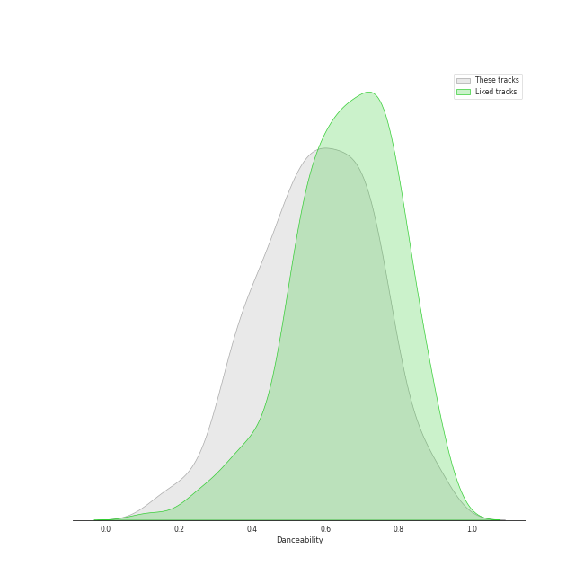
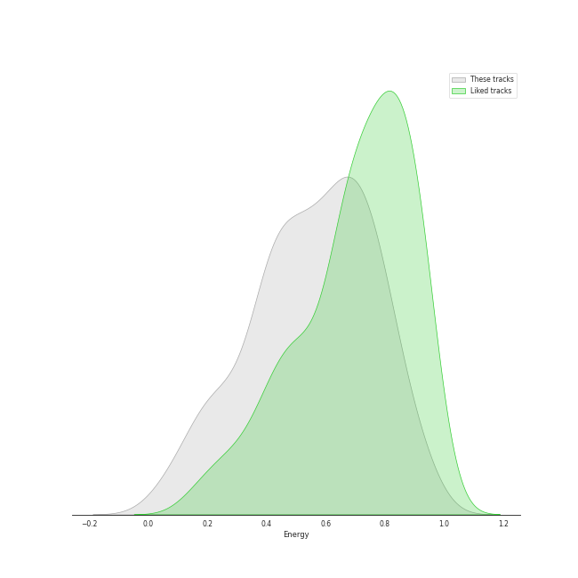
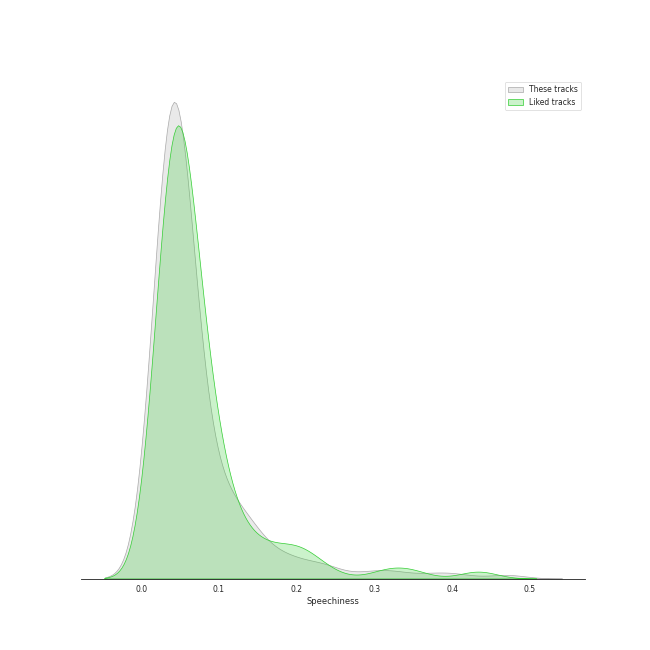
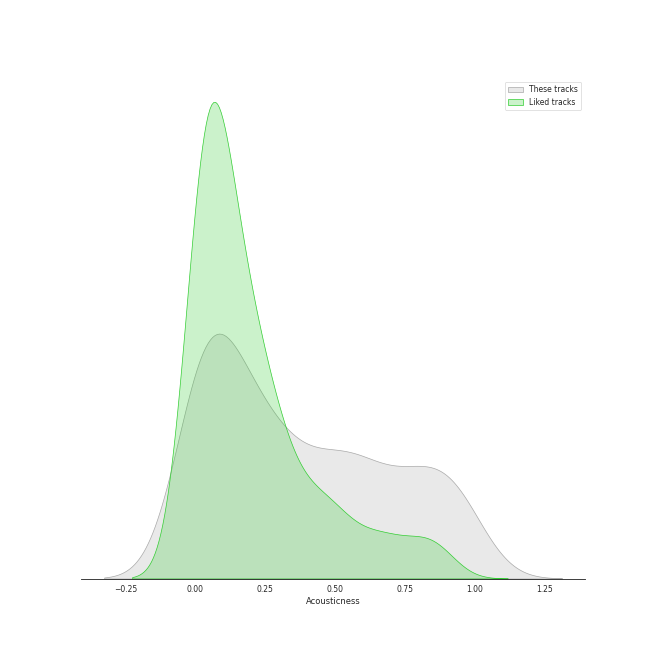
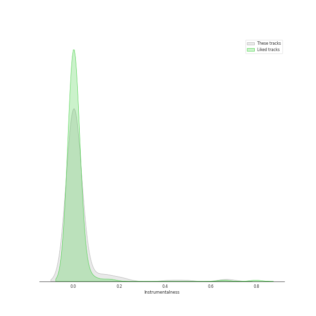
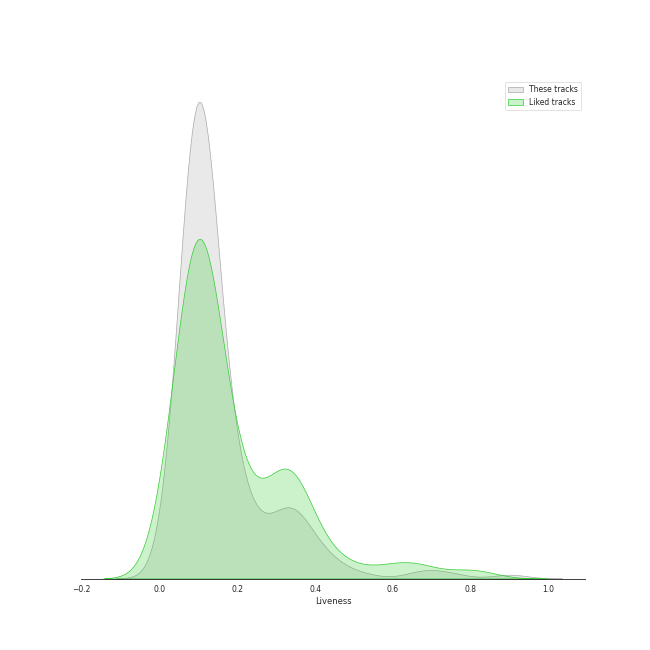
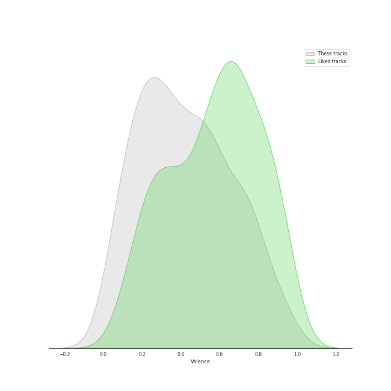
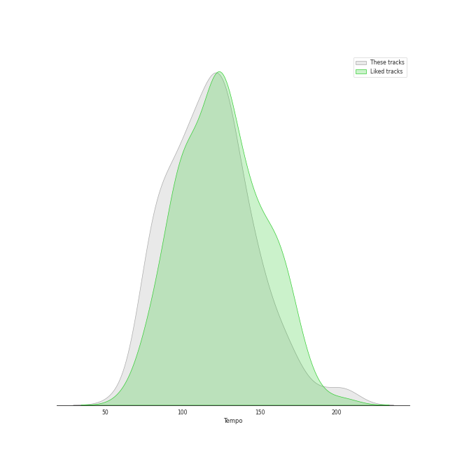

# Track Features for Alt-Pop

## Danceability

| ​ | 10 most Danceable tracks | ​​ | 10 least Danceable tracks |
|:---|:---|:---|:---|
|  | Fidelity (0.923) |  | Bridge Over Troubled Water (feat. John Legend & Tori Kelly) (0.129) |
|  | bury a friend (0.905) |  | Moon River (0.144) |
|  | In My Bones (feat. Kimbra & Tank and The Bangas) (0.897) |  | Born To Die (0.18) |
|  | On the Radio (0.88) |  | Norman fucking Rockwell (0.215) |
|  | Therefore I Am (0.879) |  | Shades Of Cool (0.262) |
|  | Somebody That I Used To Know (0.864) |  | That's Where I Am (0.269) |
|  | Good Intent (0.851) |  | Say You'll Go (0.272) |
|  | Q.U.E.E.N. (feat. Erykah Badu) (0.843) |  | Radio (0.312) |
|  | Replay! (0.806) |  | What Kind Of Man (0.313) |
|  | Dreamer (0.802) |  | Young And Beautiful (0.324) |

## Energy

| ​ | 10 most Energetic tracks | ​​ | 10 least Energetic tracks |
|:---|:---|:---|:---|
|  | Beg for You (feat. Rina Sawayama) (0.945) |  | In The Wee Small Hours of the Morning (0.029) |
|  | Lone Digger (0.924) |  | ❤️ (0.0491) |
|  | Still into You (0.923) |  | What Was I Made For? [From The Motion Picture "Barbie"] (0.0911) |
|  | Cameo Lover (0.922) |  | Used (0.0938) |
|  | Like They Do on the TV (0.911) |  | when the party's over (0.111) |
|  | Misery Business (0.906) |  | xanny (0.125) |
|  | Relimerence (0.894) |  | Make Me Cry (0.152) |
|  | Ain't It Fun (0.893) |  | Moon River (0.154) |
|  | Delilah (0.87) |  | Hide and Seek (0.166) |
|  | Rabbit Heart (Raise It Up) (0.853) |  | Desert Song (0.167) |

## Speechiness

| ​ | 10 most Speechy tracks | ​​ | 10 least Speechy tracks |
|:---|:---|:---|:---|
|  | Time Alone With You (feat. Daniel Caesar) (0.462) |  | Speeding Cars (0.0247) |
|  | Running Outta Love (feat. Tori Kelly) (0.405) |  | Come On Closer (0.025) |
|  | bad guy (0.375) |  | Never Gonna Be Alone (feat. Lizzy McAlpine & John Mayer) (0.0265) |
|  | bury a friend (0.332) |  | Meant (0.0267) |
|  | All I Need (with Mahalia & Ty Dolla $ign) (0.311) |  | The Only Exception (0.0272) |
|  | With The Love In My Heart (0.29) |  | Odi Et Amo (0.0275) |
|  | Dance Apocalyptic (0.243) |  | Love (0.0277) |
|  | xanny (0.239) |  | Stay Now (0.0281) |
|  | watch (0.225) |  | Missing You (0.0285) |
|  | Summer Is for Falling in Love (0.218) |  | The Great Unknown (0.0287) |

## Acousticness

| ​ | 10 most Acoustic tracks | ​​ | 10 least Acoustic tracks |
|:---|:---|:---|:---|
|  | In The Wee Small Hours of the Morning (0.985) |  | Maniac (0.00162) |
|  | when the party's over (0.978) |  | Kiss With A Fist (0.0024) |
|  | ❤️ (0.97) |  | SILENCE (0.00271) |
|  | Moon River (0.97) |  | Misery Business (0.00272) |
|  | Norman fucking Rockwell (0.968) |  | You've Got The Love (0.00455) |
|  | What Was I Made For? [From The Motion Picture "Barbie"] (0.959) |  | RIP, Love (0.00641) |
|  | Meant to Move (0.959) |  | Recovery (0.00747) |
|  | Desert Song (0.948) |  | Nightflyers (0.00834) |
|  | Used (0.938) |  | Missing You (0.00859) |
|  | lovely (with Khalid) (0.934) |  | Seven Devils (0.00913) |

## Instrumentalness

| ​ | 10 most Instrumental tracks | ​​ | 10 least Instrumental tracks |
|:---|:---|:---|:---|
|  | Abeja (0.915) |  | The Feeling (0.0) |
|  | Never Gonna Be Alone (feat. Lizzy McAlpine & John Mayer) (0.682) |  | When I Was Your Man (0.0) |
|  | Only Time (0.661) |  | Dark Paradise (0.0) |
|  | everything i wanted (0.657) |  | lovely (with Khalid) (0.0) |
|  | Coal Miners (0.487) |  | Minefields (0.0) |
|  | Swan Song (0.421) |  | G Train (0.0) |
|  | Orinoco Flow (0.28) |  | All I Need (with Mahalia & Ty Dolla $ign) (0.0) |
|  | you should see me in a crown (0.219) |  | Running Outta Love (feat. Tori Kelly) (0.0) |
|  | Mantra for a Struggling Artist (0.216) |  | Take Me to Church (0.0) |
|  | Meant to Move (0.188) |  | Come On Closer (0.0) |

## Liveness

| ​ | 10 most Live tracks | ​​ | 10 least Live tracks |
|:---|:---|:---|:---|
|  | Bel Air (0.901) |  | Ain't It Fun (0.021) |
|  | Whatever We Feel (0.75) |  | Caralee (0.0412) |
|  | death bed (coffee for your head) (0.696) |  | Seven Devils (0.0477) |
|  | WELLLL (0.652) |  | still feel. (0.0492) |
|  | Time Alone With You (feat. Daniel Caesar) (0.522) |  | Relimerence (0.0528) |
|  | Saw It Coming (0.456) |  | Still into You (0.0561) |
|  | No Light, No Light (0.444) |  | Icarus (0.0582) |
|  | Darling (0.441) |  | Therefore I Am (0.0583) |
|  | Off To The Races (0.4) |  | Beg for You (feat. Rina Sawayama) - A. G. Cook & VERNON OF SEVENTEEN Remix (0.0585) |
|  | Rockabye (feat. Sean Paul & Anne-Marie) (0.398) |  | The Wire (0.0585) |

## Valence

| ​ | 10 most Happy tracks | ​​ | 10 least Happy tracks |
|:---|:---|:---|:---|
|  | Tick Tock (feat. 24kGoldn) (0.946) |  | Say You'll Go (0.0388) |
|  | Earth (0.938) |  | Swan Song (0.0392) |
|  | Come On Closer (0.928) |  | Moon River (0.04) |
|  | Woke Up Today (0.91) |  | In The Wee Small Hours of the Morning (0.0422) |
|  | That Man (0.903) |  | No Time To Die (0.0517) |
|  | All I Need (with Mahalia & Ty Dolla $ign) (0.887) |  | xanny (0.0528) |
|  | Lone Digger (0.88) |  | Yellow Flicker Beat (0.0597) |
|  | Good Intent (0.834) |  | Waltz Me to the Grave (0.0748) |
|  | Beg for You (feat. Rina Sawayama) - A. G. Cook & VERNON OF SEVENTEEN Remix (0.824) |  | How Big, How Blue, How Beautiful (0.0825) |
|  | Kick It to Me (0.823) |  | Shades Of Cool (0.0878) |

## Tempo

| ​ | 10 most Fast tracks | ​​ | 10 least Fast tracks |
|:---|:---|:---|:---|
|  | That Man (207.029) |  | Seven Devils (58.534) |
|  | Dance Apocalyptic (205.749) |  | Bridge Over Troubled Water (feat. John Legend & Tori Kelly) (65.873) |
|  | Like They Do on the TV (199.23) |  | Running Outta Love (feat. Tori Kelly) (68.076) |
|  | In My Room (188.05) |  | When I Was Your Man (72.795) |
|  | That's Where I Am (181.299) |  | No Time To Die (73.537) |
|  | Misery Business (172.977) |  | Radio (75.112) |
|  | I Feel It All (172.046) |  | Summer Is for Falling in Love (75.279) |
|  | Waves (171.814) |  | Born To Die (75.632) |
|  | Delilah (169.946) |  | Cinnamon Crush (feat. Lindsey Lomis) (75.908) |
|  | Closing In (167.982) |  | Old Flame (77.61) |
