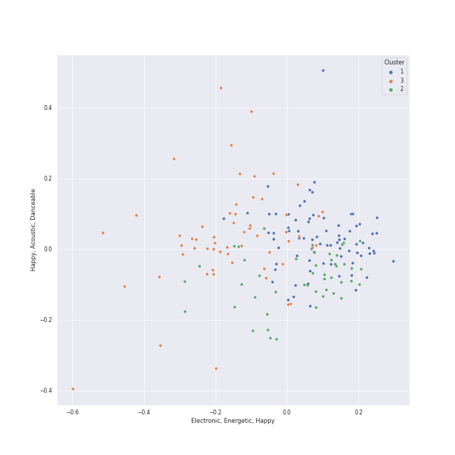

# Clusters in Alt-Pop

## Cluster #1

43 tracks

| Art | Track | Album | Artists | Label | 💚 | 🔗 |
|:---|:---|:---|:---|:---|:---|:---|
|  | Chasing Tomorrow | Chasing Tomorrow | CARSTN, GoldFish, Anna Graceman | Kontor Records | 💚 | [🔗](https://open.spotify.com/track/3vBMircA5qKK86CGshh4Ir) |
|  | Beg for You (feat. Rina Sawayama) - A. G. Cook & VERNON OF SEVENTEEN Remix | Beg For You (A. G. Cook & VERNON OF SEVENTEEN Remix) [feat. Rina Sawayama] | Charli XCX, A. G. Cook, VERNON, Rina Sawayama | Atlantic Records UK | | [🔗](https://open.spotify.com/track/3teT4GffWtZUYQVmUwL14d) |
|  | I Feel It All | The Reminder | Feist | Universal Music Division One Records | | [🔗](https://open.spotify.com/track/3ghgwo0BTPm329zGMQRfn7) |
|  | They | Finally Woken | Jem | ATO Records | 💚 | [🔗](https://open.spotify.com/track/5HiVagjTjqdvu3Ke2aqMc7) |
|  | Cameo Lover | Vows (Deluxe Version) | [Kimbra](../../../../artists/kimbra/overview.md) | [Warner Records](../../../../labels/warner_records) | 💚 | [🔗](https://open.spotify.com/track/6mEDMe0zG5pYrsRxizjauk) |
|  | Young Folks | Writer's Block | Peter Bjorn and John | Universal Music AB | | [🔗](https://open.spotify.com/track/4dyx5SzxPPaD8xQIid5Wjj) |
|  | The Feeling | The Good Life | Sammy Rae & The Friends | Nettwerk Records | | [🔗](https://open.spotify.com/track/1aVedqqfdBKK0XsrjNJerA) |
|  | Cheap Thrills | This Is Acting (Deluxe Version) | [Sia](../../../../artists/sia/overview.md) | [Monkey Puzzle Records](../../../../labels/monkey_puzzle_records), [RCA Records Label](../../../../labels/rca_records_label) | 💚 | [🔗](https://open.spotify.com/track/3S4px9f4lceWdKf0gWciFu) |
|  | G Train | Searching | Thirdstory | Verve | 💚 | [🔗](https://open.spotify.com/track/0vYIpioP94c4gwxOyopklE) |
|  | Half of the Way | Hill Climber | Vulfpeck, Theo Katzman | Vulf Records | 💚 | [🔗](https://open.spotify.com/track/3uFp6gGgNMtSEmzx1cHTG4) |
## Cluster #2

61 tracks

| Art | Track | Album | Artists | Label | 💚 | 🔗 |
|:---|:---|:---|:---|:---|:---|:---|
|  | Minefields | CITIZENS | Faouzia, John Legend | [Atlantic Records](../../../../labels/atlantic_records) | | [🔗](https://open.spotify.com/track/0vH52Icuf6LzOFrkHE8mZG) |
|  | I'm Not Calling You A Liar | Lungs | [Florence + The Machine](../../../../artists/florence_+_the_machine/overview.md) | [Universal-Island Records Ltd.](../../../../labels/universal-island_records_ltd_) | 💚 | [🔗](https://open.spotify.com/track/7u5oRKGjNovOvg8s1q4OTU) |
|  | What The Water Gave Me | Ceremonials (Deluxe Edition) | [Florence + The Machine](../../../../artists/florence_+_the_machine/overview.md) | [Universal-Island Records Ltd.](../../../../labels/universal-island_records_ltd_) | 💚 | [🔗](https://open.spotify.com/track/3RiOPzAvhNKuMIdPYOrKV8) |
|  | How Big, How Blue, How Beautiful | How Big, How Blue, How Beautiful | [Florence + The Machine](../../../../artists/florence_+_the_machine/overview.md) | [Universal-Island Records Ltd.](../../../../labels/universal-island_records_ltd_) | 💚 | [🔗](https://open.spotify.com/track/7GlwvJ8iAbCEfZjGq3iwmZ) |
|  | Closing In | Speak for Yourself | [Imogen Heap](../../../../artists/imogen_heap/overview.md) | Sony BMG Music UK | 💚 | [🔗](https://open.spotify.com/track/3wKRHAG6IvErggsniF1a3j) |
|  | The Great Unknown | Jukebox The Ghost | Jukebox The Ghost | Cherrytree Records/Kierszenbaum | | [🔗](https://open.spotify.com/track/6xBUdFmhryjXoxn8KkTNr4) |
|  | Summertime Sadness | Born To Die | [Lana Del Rey](../../../../artists/lana_del_rey/overview.md) | [Polydor Records](../../../../labels/polydor_records) | 💚 | [🔗](https://open.spotify.com/track/4cKtn8Shw999egpwBmWQmp) |
|  | Young And Beautiful | Young And Beautiful | [Lana Del Rey](../../../../artists/lana_del_rey/overview.md) | [Polydor Records](../../../../labels/polydor_records) | | [🔗](https://open.spotify.com/track/2nMeu6UenVvwUktBCpLMK9) |
|  | Love | Lust For Life | [Lana Del Rey](../../../../artists/lana_del_rey/overview.md) | [Polydor Records](../../../../labels/polydor_records) | | [🔗](https://open.spotify.com/track/2Kerz9H9IejzeIpjhDJoYG) |
|  | The Only Exception | Brand New Eyes | Paramore | [Fueled By Ramen](../../../../labels/fueled_by_ramen) | | [🔗](https://open.spotify.com/track/7JIuqL4ZqkpfGKQhYlrirs) |
## Cluster #3

43 tracks

| Art | Track | Album | Artists | Label | 💚 | 🔗 |
|:---|:---|:---|:---|:---|:---|:---|
|  | Boom | Anjulie | Anjulie | Hear Music | 💚 | [🔗](https://open.spotify.com/track/2Jf86nCe8O3LgAcflzxuy9) |
|  | Rather Be (feat. Jess Glynne) | New Eyes | [Clean Bandit](../../../../artists/clean_bandit/overview.md), Jess Glynne | [Big Beat Records/Atlantic](../../../../labels/atlantic_records) | 💚 | [🔗](https://open.spotify.com/track/0am001WwFBVGDGLwRh3ixi) |
|  | Symphony (feat. Zara Larsson) | What Is Love? (Deluxe Edition) | [Clean Bandit](../../../../artists/clean_bandit/overview.md), Zara Larsson | Atlantic Records UK | 💚 | [🔗](https://open.spotify.com/track/72gv4zhNvRVdQA0eOenCal) |
|  | Born Without a Heart | Born Without a Heart | Faouzia | Faouzia 2019 | 💚 | [🔗](https://open.spotify.com/track/6i5jBmnB22alUpJ7hpznuj) |
|  | Between Two Lungs | Lungs | [Florence + The Machine](../../../../artists/florence_+_the_machine/overview.md) | [Universal-Island Records Ltd.](../../../../labels/universal-island_records_ltd_) | 💚 | [🔗](https://open.spotify.com/track/5w7sVlGwbDE72HH9OzpDXw) |
|  | A New Kind Of Love - Demo | A New Kind Of Love (Demo) | Frou Frou, [Imogen Heap](../../../../artists/imogen_heap/overview.md), Guy Sigsworth | Megaphonic | 💚 | [🔗](https://open.spotify.com/track/3fuyYaLhZ2RoP9eWpvfP1H) |
|  | Heat Waves | Dreamland (+ Bonus Levels) | Glass Animals | [Polydor Records](../../../../labels/polydor_records) | | [🔗](https://open.spotify.com/track/02MWAaffLxlfxAUY7c5dvx) |
|  | Limbo | Vows (Deluxe Version) | [Kimbra](../../../../artists/kimbra/overview.md) | [Warner Records](../../../../labels/warner_records) | 💚 | [🔗](https://open.spotify.com/track/6go4VH47IaXtYlTGHizjhm) |
|  | Settle Down | Vows (Deluxe Version) | [Kimbra](../../../../artists/kimbra/overview.md) | [Warner Records](../../../../labels/warner_records) | 💚 | [🔗](https://open.spotify.com/track/6cdslY3YKjh7pImxFhSBVG) |
|  | Light On | Heard It In A Past Life | Maggie Rogers | [Capitol Records](../../../../labels/capitol_records) | 💚 | [🔗](https://open.spotify.com/track/6UnCGAEmrbGIOSmGRZQ1M2) |