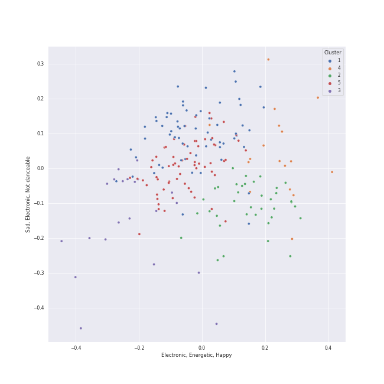

# Clusters in Alt-Pop

## Cluster #1

67 tracks

| Art | Track | Album | Artists | Label | Rank | 💚 | 🔗 |
|:---|:---|:---|:---|:---|---:|:---|:---|
|  | Electric Lady (feat. Solange) | The Electric Lady | [Janelle Monáe](../../../../artists/janelle_monáe/overview.md), Roman GianArthur, Solange | [Bad Boy/Wondaland](../../../../labels/bad_boy) | 893 | 💚 | [🔗](https://open.spotify.com/track/69vzkewKl2LPquyEiqD8BB) |
|  | She Put Sunshine | Djesse Vol. 4 | [Jacob Collier](../../../../artists/jacob_collier/overview.md) | [Decca (UMO)](../../../../labels/decca_(umo)) | 893 | 💚 | [🔗](https://open.spotify.com/track/60ZCmLIYDUHmQ98Ydo1cR8) |
|  | Limbo | Vows (Deluxe Version) | [Kimbra](../../../../artists/kimbra/overview.md) | [Warner Records](../../../../labels/warner_records) | 856 | 💚 | [🔗](https://open.spotify.com/track/6go4VH47IaXtYlTGHizjhm) |
|  | Two Way Street | Vows (Deluxe Version) | [Kimbra](../../../../artists/kimbra/overview.md) | [Warner Records](../../../../labels/warner_records) | 893 | 💚 | [🔗](https://open.spotify.com/track/7ptSTFAis4UckLAfUrMfM0) |
|  | Dark Paradise | Born To Die | [Lana Del Rey](../../../../artists/lana_del_rey/overview.md) | [Polydor Records](../../../../labels/polydor_records) | 893 | 💚 | [🔗](https://open.spotify.com/track/0rbuGVyW18IpX0bhA3P4Oh) |
|  | Symphony (feat. Zara Larsson) | What Is Love? (Deluxe Edition) | [Clean Bandit](../../../../artists/clean_bandit/overview.md), Zara Larsson | Atlantic Records UK | 893 | 💚 | [🔗](https://open.spotify.com/track/72gv4zhNvRVdQA0eOenCal) |
|  | Born Without a Heart | Born Without a Heart | Faouzia | Faouzia 2019 | 893 | 💚 | [🔗](https://open.spotify.com/track/6i5jBmnB22alUpJ7hpznuj) |
|  | YOUTH | Blue Neighbourhood (Deluxe) | Troye Sivan | EMI Recorded Music Australia Pty Ltd | 893 | 💚 | [🔗](https://open.spotify.com/track/1cOyWWUr3oXJIxY0AjJEx9) |
|  | Boom | Anjulie | Anjulie | Hear Music | 893 | 💚 | [🔗](https://open.spotify.com/track/2Jf86nCe8O3LgAcflzxuy9) |
|  | Caralee | Hey Hello | Ripe | Self Released | 893 | 💚 | [🔗](https://open.spotify.com/track/46OPEiFmQBOyASN4ZNePqb) |
## Cluster #2

44 tracks

| Art | Track | Album | Artists | Label | Rank | 💚 | 🔗 |
|:---|:---|:---|:---|:---|---:|:---|:---|
|  | I Get It Now | I Get It Now | Sammy Rae & The Friends | [Nettwerk Music Group](../../../../labels/nettwerk_music_group) | 792 | 💚 | [🔗](https://open.spotify.com/track/03ECDyILFfQ98k106zwcIt) |
|  | Make Me Cry | Djesse Vol. 2 | [Jacob Collier](../../../../artists/jacob_collier/overview.md) | [Decca (UMO)](../../../../labels/decca_(umo)) | 893 | 💚 | [🔗](https://open.spotify.com/track/4Y6VEDkRSpbn8Wt8x18RHh) |
|  | Odi Et Amo | Beatrix Runs | Elizaveta | [Universal Records](../../../../labels/universal_music_llc) | 893 | 💚 | [🔗](https://open.spotify.com/track/24wPBY34rV79iESLYdpsRH) |
|  | ocean eyes | dont smile at me | [Billie Eilish](../../../../artists/billie_eilish/overview.md) | [Darkroom](../../../../labels/darkroom) | 893 | 💚 | [🔗](https://open.spotify.com/track/7hDVYcQq6MxkdJGweuCtl9) |
|  | Eet | Far | Regina Spektor | Sire | 893 | 💚 | [🔗](https://open.spotify.com/track/0N9WhEz6DiBDvBxa6uJCTY) |
|  | Samson | Begin to Hope | Regina Spektor | Sire | 893 | 💚 | [🔗](https://open.spotify.com/track/2JAUBPBVkimRLc5BGhAkfJ) |
|  | Love | Lust For Life | [Lana Del Rey](../../../../artists/lana_del_rey/overview.md) | [Polydor Records](../../../../labels/polydor_records) | 893 | | [🔗](https://open.spotify.com/track/2Kerz9H9IejzeIpjhDJoYG) |
|  | Wait It Out | Ellipse | [Imogen Heap](../../../../artists/imogen_heap/overview.md) | [RCA Records Label](../../../../labels/rca_records_label) | 893 | 💚 | [🔗](https://open.spotify.com/track/4xszw2YraekWIpj0SZ6Lp6) |
|  | Work Song | Hozier (Expanded Edition) | Hozier | [Columbia](../../../../labels/columbia) | 893 | 💚 | [🔗](https://open.spotify.com/track/5TgEJ62DOzBpGxZ7WRsrqb) |
|  | Daylight | Daylight | David Kushner | Miserable Music Group, LLC | 893 | 💚 | [🔗](https://open.spotify.com/track/1odExI7RdWc4BT515LTAwj) |
## Cluster #3

37 tracks

| Art | Track | Album | Artists | Label | Rank | 💚 | 🔗 |
|:---|:---|:---|:---|:---|---:|:---|:---|
|  | The Feeling | The Good Life | Sammy Rae & The Friends | [Nettwerk Music Group](../../../../labels/nettwerk_music_group) | 893 | | [🔗](https://open.spotify.com/track/0dmCos7GHCr5PRKp5LNGH7) |
|  | Kick It to Me | The Good Life | Sammy Rae & The Friends | [Nettwerk Music Group](../../../../labels/nettwerk_music_group) | 893 | 💚 | [🔗](https://open.spotify.com/track/6QZbDUZEgkwaVWROtWzjQ0) |
|  | Recovery | Primal Heart | [Kimbra](../../../../artists/kimbra/overview.md) | [Warner Records](../../../../labels/warner_records) | 893 | | [🔗](https://open.spotify.com/track/0HqtTIH9Eo7IdTiiFvpdjM) |
|  | Good Ones | CRASH | Charli xcx | [Atlantic Records](../../../../labels/atlantic_records) | 893 | 💚 | [🔗](https://open.spotify.com/track/2grSOc6HNTXQQXNoRKt9UM) |
|  | Beg for You (feat. Rina Sawayama) - A. G. Cook & VERNON OF SEVENTEEN Remix | Beg For You (A. G. Cook & VERNON OF SEVENTEEN Remix) [feat. Rina Sawayama] | Charli xcx, A. G. Cook, VERNON, Rina Sawayama | Atlantic Records UK | 893 | | [🔗](https://open.spotify.com/track/3teT4GffWtZUYQVmUwL14d) |
|  | They | Finally Woken | Jem | ATO Records | 554 | 💚 | [🔗](https://open.spotify.com/track/5HiVagjTjqdvu3Ke2aqMc7) |
|  | That Man | Deleted Scenes From The Cutting Room Floor | Caro Emerald | Grandmono Records | 893 | 💚 | [🔗](https://open.spotify.com/track/1tSpZHA49KemUzdfra0QTh) |
|  | Half of the Way | Hill Climber | Vulfpeck, Theo Katzman | Vulf Records | 893 | 💚 | [🔗](https://open.spotify.com/track/3uFp6gGgNMtSEmzx1cHTG4) |
|  | Chasing Tomorrow | Chasing Tomorrow | CARSTN, GoldFish, Anna Graceman | Kontor Records | 893 | 💚 | [🔗](https://open.spotify.com/track/3vBMircA5qKK86CGshh4Ir) |
|  | Young Folks | Writer's Block | Peter Bjorn and John | Universal Music AB | 893 | | [🔗](https://open.spotify.com/track/4dyx5SzxPPaD8xQIid5Wjj) |
## Cluster #4

39 tracks

| Art | Track | Album | Artists | Label | Rank | 💚 | 🔗 |
|:---|:---|:---|:---|:---|---:|:---|:---|
|  | Dog Days Are Over | Lungs (Deluxe Edition) | [Florence + The Machine](../../../../artists/florence_+_the_machine/overview.md) | [Universal-Island Records Ltd.](../../../../labels/universal-island_records_ltd_) | 893 | 💚 | [🔗](https://open.spotify.com/track/1YLJVmuzeM2YSUkCCaTNUB) |
|  | What The Water Gave Me | Ceremonials (Deluxe Edition) | [Florence + The Machine](../../../../artists/florence_+_the_machine/overview.md) | [Universal-Island Records Ltd.](../../../../labels/universal-island_records_ltd_) | 579 | 💚 | [🔗](https://open.spotify.com/track/3RiOPzAvhNKuMIdPYOrKV8) |
|  | Shake It Out | Ceremonials (Deluxe Edition) | [Florence + The Machine](../../../../artists/florence_+_the_machine/overview.md) | [Universal-Island Records Ltd.](../../../../labels/universal-island_records_ltd_) | 893 | 💚 | [🔗](https://open.spotify.com/track/4lY95OMGb9WxP6IYut64ir) |
|  | Seven Devils | Ceremonials (Deluxe Edition) | [Florence + The Machine](../../../../artists/florence_+_the_machine/overview.md) | [Universal-Island Records Ltd.](../../../../labels/universal-island_records_ltd_) | 811 | 💚 | [🔗](https://open.spotify.com/track/5qaLfqAUiqvsoL0l4T05Yx) |
|  | What Kind Of Man | How Big, How Blue, How Beautiful | [Florence + The Machine](../../../../artists/florence_+_the_machine/overview.md) | [Universal-Island Records Ltd.](../../../../labels/universal-island_records_ltd_) | 893 | | [🔗](https://open.spotify.com/track/2ZE1EiHnmtdiv9KAJTGeRq) |
|  | Minefields | CITIZENS | Faouzia, John Legend | [Atlantic Records](../../../../labels/atlantic_records) | 893 | | [🔗](https://open.spotify.com/track/0vH52Icuf6LzOFrkHE8mZG) |
|  | Closing In | Speak for Yourself | [Imogen Heap](../../../../artists/imogen_heap/overview.md) | Sony BMG Music UK | 893 | 💚 | [🔗](https://open.spotify.com/track/3wKRHAG6IvErggsniF1a3j) |
|  | The Only Exception | Brand New Eyes | Paramore | [Fueled By Ramen](../../../../labels/fueled_by_ramen) | 893 | | [🔗](https://open.spotify.com/track/7JIuqL4ZqkpfGKQhYlrirs) |
|  | Eye of the Needle | 1000 Forms Of Fear (Deluxe Version) | [Sia](../../../../artists/sia/overview.md) | [Monkey Puzzle](../../../../labels/monkey_puzzle), [RCA Records Label](../../../../labels/rca_records_label) | 893 | 💚 | [🔗](https://open.spotify.com/track/6H8UxS43KArEIu2vGZI9Dj) |
|  | Big Girls Cry | 1000 Forms Of Fear (Deluxe Version) | [Sia](../../../../artists/sia/overview.md) | [Monkey Puzzle](../../../../labels/monkey_puzzle), [RCA Records Label](../../../../labels/rca_records_label) | 893 | 💚 | [🔗](https://open.spotify.com/track/7zE6pyXLjUCOy8PG0UL5SZ) |