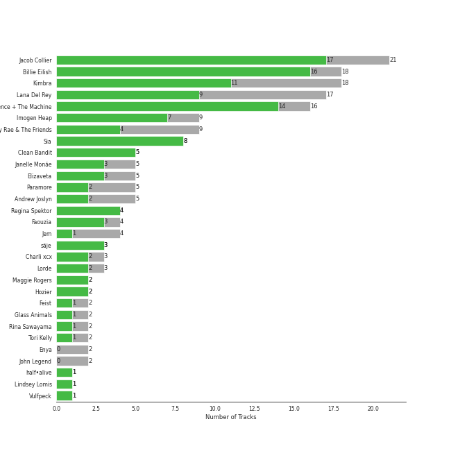
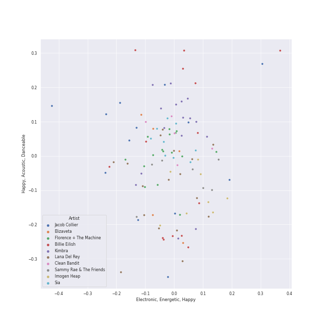
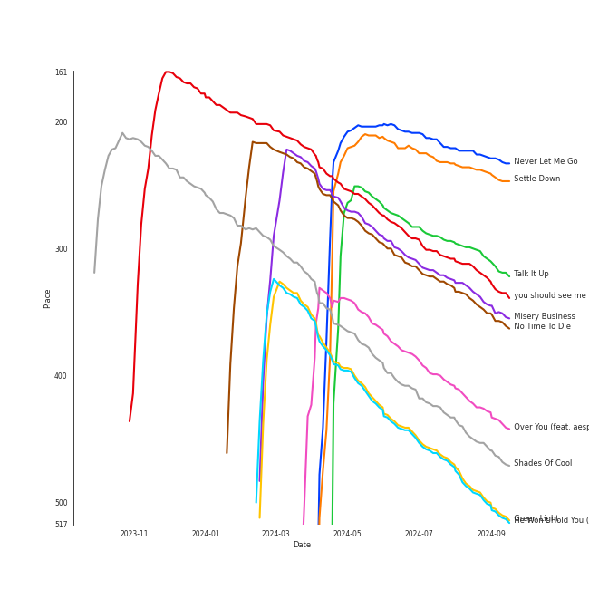
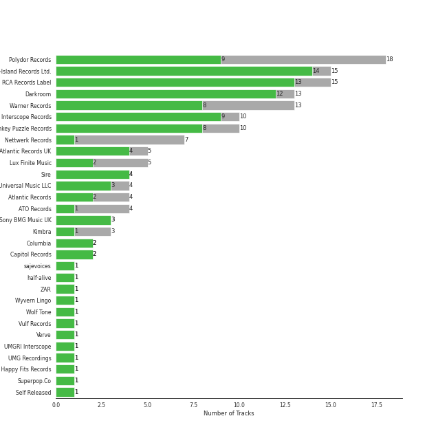
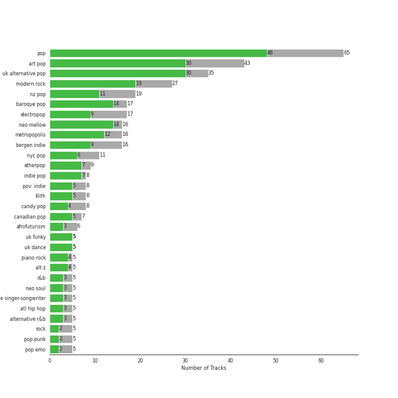
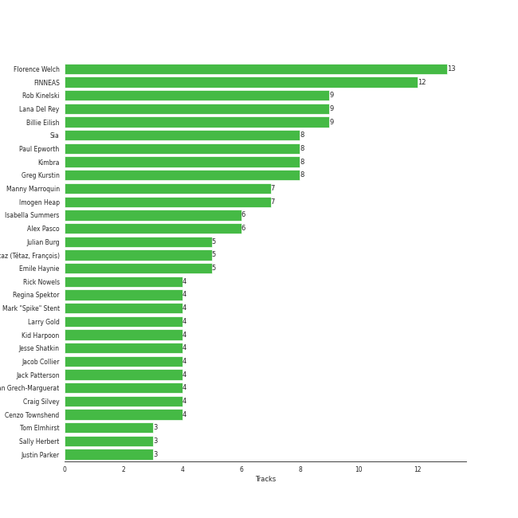
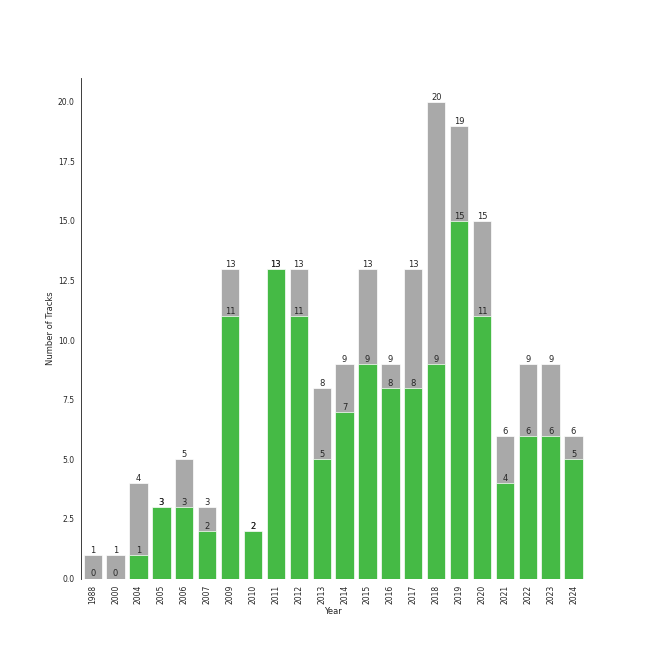

# Alt-Pop

[206 tracks (148 liked) 🔗](https://open.spotify.com/playlist/4DgMab6SK9pnl6P05fw2YI)

[See Track Features](audio_features.md)

[See Clusters](clusters/overview.md)

## Top Artists

| Art | Rank | Tracks | 💚 | Artist | 🔗 |
|:---|---:|---:|---:|:---|:---|
|  | 43 | 20 | 18 | [Billie Eilish](../../artists/billie_eilish/overview.md) | [🔗](https://open.spotify.com/artist/6qqNVTkY8uBg9cP3Jd7DAH) |
|  | 35 | 21 | 16 | [Jacob Collier](../../artists/jacob_collier/overview.md) | [🔗](https://open.spotify.com/artist/0QWrMNukfcVOmgEU0FEDyD) |
|  | 79 | 16 | 14 | [Florence + The Machine](../../artists/florence_+_the_machine/overview.md) | [🔗](https://open.spotify.com/artist/1moxjboGR7GNWYIMWsRjgG) |
|  | 89 | 18 | 11 | [Kimbra](../../artists/kimbra/overview.md) | [🔗](https://open.spotify.com/artist/6hk7Yq1DU9QcCCrz9uc0Ti) |
|  | 116 | 17 | 9 | [Lana Del Rey](../../artists/lana_del_rey/overview.md) | [🔗](https://open.spotify.com/artist/00FQb4jTyendYWaN8pK0wa) |
|  | 153 | 8 | 8 | [Sia](../../artists/sia/overview.md) | [🔗](https://open.spotify.com/artist/5WUlDfRSoLAfcVSX1WnrxN) |
|  | 421 | 9 | 7 | [Imogen Heap](../../artists/imogen_heap/overview.md) | [🔗](https://open.spotify.com/artist/6Xb4ezwoAQC4516kI89nWz) |
|  | 421 | 5 | 5 | [Clean Bandit](../../artists/clean_bandit/overview.md) | [🔗](https://open.spotify.com/artist/6MDME20pz9RveH9rEXvrOM) |
|  | 143 | 9 | 4 | Sammy Rae & The Friends | [🔗](https://open.spotify.com/artist/3lFDsTyYNPQc8WzJExnQWn) |
|  | 353 | 6 | 4 | Charli xcx | [🔗](https://open.spotify.com/artist/25uiPmTg16RbhZWAqwLBy5) |

See top 100 artists

| Art | Rank | Tracks | 💚 | Artist | 🔗 |
|:---|---:|---:|---:|:---|:---|
|  | 421 | 4 | 4 | Regina Spektor | [🔗](https://open.spotify.com/artist/3z6Gk257P9jNcZbBXJNX5i) |
|  | 107 | 5 | 3 | [Janelle Monáe](../../artists/janelle_monáe/overview.md) | [🔗](https://open.spotify.com/artist/6ueGR6SWhUJfvEhqkvMsVs) |
|  | 421 | 5 | 3 | Elizaveta | [🔗](https://open.spotify.com/artist/2a9bCkqCkLvXM0s3uPvR7M) |
|  | 185 | 4 | 3 | Faouzia | [🔗](https://open.spotify.com/artist/5NhgsV7qPWHZqYEMKzbYvo) |
|  | 348 | 3 | 3 | säje | [🔗](https://open.spotify.com/artist/7iitvSs52z6e7UvIo2LCYi) |
|  | 154 | 5 | 2 | Paramore | [🔗](https://open.spotify.com/artist/74XFHRwlV6OrjEM0A2NCMF) |
|  | 256 | 5 | 2 | Andrew Joslyn | [🔗](https://open.spotify.com/artist/5dSCgfYs71v0zjg2AwUq9n) |
|  | 208 | 3 | 2 | Lorde | [🔗](https://open.spotify.com/artist/163tK9Wjr9P9DmM0AVK7lm) |
|  | 421 | 2 | 2 | Maggie Rogers | [🔗](https://open.spotify.com/artist/4NZvixzsSefsNiIqXn0NDe) |
|  | 421 | 2 | 2 | Hozier | [🔗](https://open.spotify.com/artist/2FXC3k01G6Gw61bmprjgqS) |
|  | 307 | 4 | 1 | Jem | [🔗](https://open.spotify.com/artist/4v4xuH9VypORYabMnhPLt1) |
|  | 421 | 2 | 1 | Feist | [🔗](https://open.spotify.com/artist/6CWTBjOJK75cTE8Xv8u1kj) |
|  | 421 | 2 | 1 | Glass Animals | [🔗](https://open.spotify.com/artist/4yvcSjfu4PC0CYQyLy4wSq) |
|  | 421 | 2 | 1 | Rina Sawayama | [🔗](https://open.spotify.com/artist/2KEqzdPS7M5YwGmiuPTdr5) |
|  | 322 | 2 | 1 | Tori Kelly | [🔗](https://open.spotify.com/artist/1vSN1fsvrzpbttOYGsliDr) |
|  | 421 | 1 | 1 | half•alive | [🔗](https://open.spotify.com/artist/7sOR7gk6XUlGnxj3p9F54k) |
|  | 421 | 1 | 1 | Lindsey Lomis | [🔗](https://open.spotify.com/artist/7qY2O8bWspXlSwQl5JAkvn) |
|  | 421 | 1 | 1 | Vulfpeck | [🔗](https://open.spotify.com/artist/7pXu47GoqSYRajmBCjxdD6) |
|  | 421 | 1 | 1 | Roman GianArthur | [🔗](https://open.spotify.com/artist/7hgRzsQGjlm1zifNoigyB9) |
|  | 421 | 1 | 1 | Wyvern Lingo | [🔗](https://open.spotify.com/artist/7etzKNDxaZ1LefgbGrexsN) |
|  | 421 | 1 | 1 | Ty Dolla $ign | [🔗](https://open.spotify.com/artist/7c0XG5cIJTrrAgEC3ULPiq) |
|  | 326 | 1 | 1 | Metropole Orkest | [🔗](https://open.spotify.com/artist/7JYdpWAsiqzrmMB3qxkEbI) |
|  | 421 | 1 | 1 | Thirdstory | [🔗](https://open.spotify.com/artist/7GJbWH8vhhuW22707B8HsW) |
|  | 421 | 1 | 1 | The Happy Fits | [🔗](https://open.spotify.com/artist/73rPcaYEhBd0UuVZBqqyQJ) |
|  | 421 | 1 | 1 | Destiny Rogers | [🔗](https://open.spotify.com/artist/6gezkje7GoJlQbHBgLXHuu) |
|  | 421 | 1 | 1 | 24kGoldn | [🔗](https://open.spotify.com/artist/6fWVd57NKTalqvmjRd2t8Z) |
|  | 421 | 1 | 1 | Powfu | [🔗](https://open.spotify.com/artist/6bmlMHgSheBauioMgKv2tn) |
|  | 1 | 1 | 1 | [aespa](../../artists/aespa/overview.md) | [🔗](https://open.spotify.com/artist/6YVMFz59CuY7ngCxTxjpxE) |
|  | 421 | 1 | 1 | Demi Lovato | [🔗](https://open.spotify.com/artist/6S2OmqARrzebs0tKUEyXyp) |
|  | 421 | 1 | 1 | Shelby Earl | [🔗](https://open.spotify.com/artist/6PIo5nhCQJbR0NfxPdGnGC) |
|  | 421 | 1 | 1 | Frou Frou | [🔗](https://open.spotify.com/artist/6MUyqmIQ35inLjch0YzIEG) |
|  | 421 | 1 | 1 | Anoushka Shankar | [🔗](https://open.spotify.com/artist/6MTByljF8u5omBltY2VKPU) |
|  | 421 | 1 | 1 | Khalid | [🔗](https://open.spotify.com/artist/6LuN9FCkKOj5PcnpouEgny) |
|  | 421 | 1 | 1 | The Womack Sisters | [🔗](https://open.spotify.com/artist/6BjLHAiun9TeqC55KB3L6s) |
|  | 421 | 1 | 1 | Vince Staples | [🔗](https://open.spotify.com/artist/68kEuyFKyqrdQQLLsmiatm) |
|  | 421 | 1 | 1 | EyeLoveBrandon | [🔗](https://open.spotify.com/artist/5nlf0Hcw7PI00zee655ZYX) |
|  | 328 | 1 | 1 | Jules Buckley | [🔗](https://open.spotify.com/artist/5gGbAKDXhDoBXIJe8SuBvX) |
|  | 318 | 1 | 1 | Tank and The Bangas | [🔗](https://open.spotify.com/artist/5cAtakaadWHJLxmGKrKcX7) |
|  | 421 | 1 | 1 | Michael Mayo | [🔗](https://open.spotify.com/artist/5GPxGRe2IglKP3ZiwwJbP4) |
|  | 421 | 1 | 1 | Varijashree Venugopal | [🔗](https://open.spotify.com/artist/59GUnH7f4NlLkxSxtNNt0i) |
|  | 378 | 1 | 1 | HAIM | [🔗](https://open.spotify.com/artist/4Ui2kfOqGujY81UcPrb5KE) |
|  | 421 | 1 | 1 | Jess Glynne | [🔗](https://open.spotify.com/artist/4ScCswdRlyA23odg9thgIO) |
|  | 421 | 1 | 1 | Anjulie | [🔗](https://open.spotify.com/artist/4DTbdShHu2RPYEEMUp2XWV) |
|  | 421 | 1 | 1 | Caro Emerald | [🔗](https://open.spotify.com/artist/492hDmhPyuIjP3MgTcIqgm) |
|  | 421 | 1 | 1 | Pink Siifu | [🔗](https://open.spotify.com/artist/40ZElxHldNyvn7x8WRC6fh) |
|  | 101 | 1 | 1 | Christopher | [🔗](https://open.spotify.com/artist/3zDRCqOhJXJfS2YWOEwGMC) |
|  | 302 | 1 | 1 | Huxlee | [🔗](https://open.spotify.com/artist/3yb7HrGPG0WpWgdO4XFwBf) |
|  | 421 | 1 | 1 | CARSTN | [🔗](https://open.spotify.com/artist/3Wb1mXnd1hXkGwys5m54YC) |
|  | 421 | 1 | 1 | Troye Sivan | [🔗](https://open.spotify.com/artist/3WGpXCj9YhhfX11TToZcXP) |
|  | 421 | 1 | 1 | Sean Paul | [🔗](https://open.spotify.com/artist/3Isy6kedDrgPYoTS1dazA9) |
|  | 421 | 1 | 1 | Will Jordan | [🔗](https://open.spotify.com/artist/3Is3ehDoBlnTKQtCHdEvpd) |
|  | 337 | 1 | 1 | Caravan Palace | [🔗](https://open.spotify.com/artist/37J1PlAkhRK7yrZUtqaUpQ) |
|  | 421 | 1 | 1 | beabadoobee | [🔗](https://open.spotify.com/artist/35l9BRT7MXmM8bv2WDQiyB) |
|  | 421 | 1 | 1 | David Kushner | [🔗](https://open.spotify.com/artist/33NVpKoXjItPwUJTMZIOiY) |
| | 421 | 1 | 1 | Tommy Raps | [🔗](https://open.spotify.com/artist/2jDVhHiltj9mEWoIGdBg3z) |
|  | 421 | 1 | 1 | Solange | [🔗](https://open.spotify.com/artist/2auiVi8sUZo17dLy1HwrTU) |
|  | 421 | 1 | 1 | Theo Katzman | [🔗](https://open.spotify.com/artist/2a4lU7F8toqKpb5v6Ftqya) |
|  | 370 | 1 | 1 | Jennifer Nettles | [🔗](https://open.spotify.com/artist/2WV4xLQooFalR2cit0XSKp) |
|  | 421 | 1 | 1 | Anna Graceman | [🔗](https://open.spotify.com/artist/2B69uGl0nh5LMFUAZxVw5y) |
|  | 421 | 1 | 1 | Gotye | [🔗](https://open.spotify.com/artist/2AsusXITU8P25dlRNhcAbG) |
|  | 421 | 1 | 1 | Camilo | [🔗](https://open.spotify.com/artist/28gNT5KBp7IjEOQoevXf9N) |
|  | 421 | 1 | 1 | Daniel Caesar | [🔗](https://open.spotify.com/artist/20wkVLutqVOYrc0kxFs7rA) |
|  | 421 | 1 | 1 | Anne-Marie | [🔗](https://open.spotify.com/artist/1zNqDE7qDGCsyzJwohVaoX) |
|  | 130 | 1 | 1 | Steam Powered Giraffe | [🔗](https://open.spotify.com/artist/1yqs45BSh7457Flyhmdv7f) |
|  | 421 | 1 | 1 | YB | [🔗](https://open.spotify.com/artist/1rpgxJZxZMLnFNc1Jmyov5) |
|  | 421 | 1 | 1 | Zara Larsson | [🔗](https://open.spotify.com/artist/1Xylc3o4UrD53lo9CvFvVg) |
|  | 421 | 1 | 1 | Mabel | [🔗](https://open.spotify.com/artist/1MIVXf74SZHmTIp4V4paH4) |
|  | 421 | 1 | 1 | Ripe | [🔗](https://open.spotify.com/artist/19lQ2rJLlP71FOKESiMNJT) |
|  | 421 | 1 | 1 | Mahalia | [🔗](https://open.spotify.com/artist/16rCzZOMQX7P8Kmn5YKexI) |
|  | 421 | 1 | 1 | GoldFish | [🔗](https://open.spotify.com/artist/0uRdK8gy7fXJGRywrlmPM7) |
|  | 421 | 1 | 1 | Guy Sigsworth | [🔗](https://open.spotify.com/artist/0uQWT7X0I9Y7zM7WWexpAj) |
|  | 319 | 1 | 1 | Måneskin | [🔗](https://open.spotify.com/artist/0lAWpj5szCSwM4rUMHYmrr) |
|  | 90 | 1 | 1 | [Bruno Mars](../../artists/bruno_mars/overview.md) | [🔗](https://open.spotify.com/artist/0du5cEVh5yTK9QJze8zA0C) |
|  | 421 | 1 | 1 | Sarah Kang | [🔗](https://open.spotify.com/artist/0MBNzfGHTiPYag4DupDXUj) |
|  | 246 | 1 | 1 | Chris Martin | [🔗](https://open.spotify.com/artist/0LQoZQIV0mIs0y0XQb0Sw2) |
|  | 421 | 1 | 1 | Melt | [🔗](https://open.spotify.com/artist/0G7KI9I5BApiXc5Sqpyil9) |
|  | 421 | 1 | 1 | Jacob Banks | [🔗](https://open.spotify.com/artist/0AepkoQhYvkjEzzwIcGxdV) |
|  | 421 | 2 | 0 | Enya | [🔗](https://open.spotify.com/artist/6uothxMWeLWIhsGeF7cyo4) |
|  | 421 | 2 | 0 | John Legend | [🔗](https://open.spotify.com/artist/5y2Xq6xcjJb2jVM54GHK3t) |
|  | 421 | 1 | 0 | Erykah Badu | [🔗](https://open.spotify.com/artist/7IfculRW2WXyzNQ8djX8WX) |
|  | 421 | 1 | 0 | Peter Bjorn and John | [🔗](https://open.spotify.com/artist/6u11Qbko2N2hP4lTBYjX86) |
|  | 278 | 1 | 0 | Rapsody | [🔗](https://open.spotify.com/artist/6NL31G53xThQXkFs7lDpL5) |
|  | 182 | 1 | 0 | [Coldplay](../../artists/coldplay/overview.md) | [🔗](https://open.spotify.com/artist/4gzpq5DPGxSnKTe4SA8HAU) |
|  | 298 | 1 | 0 | Thundercat | [🔗](https://open.spotify.com/artist/4frXpPxQQZwbCu3eTGnZEw) |
|  | 421 | 1 | 0 | Conan Gray | [🔗](https://open.spotify.com/artist/4Uc8Dsxct0oMqx0P6i60ea) |
|  | 421 | 1 | 0 | Mndsgn | [🔗](https://open.spotify.com/artist/4GcpBLY8g8NrmimWbssM26) |
|  | 272 | 1 | 0 | A. G. Cook | [🔗](https://open.spotify.com/artist/335TWGWGFan4vaacJzSiU8) |
|  | 421 | 1 | 0 | VERNON | [🔗](https://open.spotify.com/artist/2Y34b9AOK30zXgL7cAH4NG) |
|  | 421 | 1 | 0 | Tove Styrke | [🔗](https://open.spotify.com/artist/2QSPrJfYeRXaltEEiriXN9) |
|  | 421 | 1 | 0 | Sofie Royer | [🔗](https://open.spotify.com/artist/2P2BXSc0Wxpf10Fpno38rl) |

## Top Tracks

Most and least listened tracks

| Rank | ​ | Most listened tracks | Rank | ​​ | Least listened tracks |
|---:|:---|:---|---:|:---|:---|
| 227 |  | [Never Let Me Go](../../artists/florence_+_the_machine/overview.md) | 938 |  | [Big Girls Cry](../../artists/sia/overview.md) |
| 239 |  | [Settle Down](../../artists/kimbra/overview.md) | 938 |  | [&burn (with Vince Staples)](../../artists/billie_eilish/overview.md) |
| 306 |  | Talk It Up | 938 |  | [Two Way Street](../../artists/kimbra/overview.md) |
| 321 |  | [you should see me in a crown](../../artists/billie_eilish/overview.md) | 938 |  | [Hide and Seek](../../artists/imogen_heap/overview.md) |
| 341 |  | Misery Business | 938 |  | [ocean eyes](../../artists/billie_eilish/overview.md) |
| 348 |  | [No Time To Die](../../artists/billie_eilish/overview.md) | 938 |  | death bed (coffee for your head) |
| 426 |  | [Over You (feat. aespa & Chris Martin)](../../artists/jacob_collier/overview.md) | 938 |  | [watch](../../artists/billie_eilish/overview.md) |
| 453 |  | [Shades Of Cool](../../artists/lana_del_rey/overview.md) | 938 |  | [Fuck it I love you](../../artists/lana_del_rey/overview.md) |
| 496 |  | Green Light | 938 |  | The Only Exception |
| 498 |  | [He Won't Hold You (feat. Rapsody)](../../artists/jacob_collier/overview.md) | 938 |  | [How Big, How Blue, How Beautiful](../../artists/florence_+_the_machine/overview.md) |

## Top Albums

| Art | Rank | Tracks | 💚 | Album | Release Date | 🔗 |
|:---|---:|---:|---:|:---|:---|:---|
|  | 174 | 7 | 7 | Vows (Deluxe Version) | 2011 | [🔗](https://open.spotify.com/album/6V9rvW05Um5bIHePPfeI8p) |
|  | 621 | 6 | 6 | Lungs (Deluxe Edition) | 2009 | [🔗](https://open.spotify.com/album/2FgknX5e7fJlriQtxvpLhZ) |
|  | 162 | 6 | 6 | Ceremonials - Deluxe Edition | 2011-01-01 | [🔗](https://open.spotify.com/album/5SxudoALxEAVh9l83kSebx) |
|  | 250 | 6 | 6 | Born To Die | 2012-01-30 | [🔗](https://open.spotify.com/album/4X8hAqIWpQyQks2yRhyqs4) |
|  | 302 | 6 | 5 | Djesse Vol. 4 | 2024-03-01 | [🔗](https://open.spotify.com/album/13r6eqjYlKELFQlNvVCBz1) |
|  | 207 | 5 | 5 | WHEN WE ALL FALL ASLEEP, WHERE DO WE GO? | 2019-03-29 | [🔗](https://open.spotify.com/album/0S0KGZnfBGSIssfF54WSJh) |
|  | 242 | 5 | 4 | Djesse Vol. 3 | 2020-08-14 | [🔗](https://open.spotify.com/album/33cj3kzLqVOg9zvy69Wrc8) |
|  | 621 | 5 | 0 | Primal Heart | 2018-04-20 | [🔗](https://open.spotify.com/album/4pj0BkJ7u39i009oqe8V79) |
|  | 621 | 4 | 4 | 1000 Forms Of Fear (Deluxe Version) | 2015-05-04 | [🔗](https://open.spotify.com/album/6FdNvoO5sF4EKwCX9je1MH) |
|  | 621 | 4 | 3 | Ellipse | 2009-08-25 | [🔗](https://open.spotify.com/album/5AYKGPzPBJNHeKehCxMaq0) |

See top 100 albums

| Art | Rank | Tracks | 💚 | Album | Release Date | 🔗 |
|:---|---:|---:|---:|:---|:---|:---|
|  | 621 | 4 | 3 | Beatrix Runs | 2012 | [🔗](https://open.spotify.com/album/7HsPaYQbCYnxosF5WiSlEA) |
|  | 621 | 4 | 2 | Awake at the Bottom of the Ocean | 2017-02-10 | [🔗](https://open.spotify.com/album/7G36cnLPx9CuqnmZXYna4a) |
|  | 394 | 4 | 1 | Finally Woken | 2004-03-23 | [🔗](https://open.spotify.com/album/3RkjNfqqlhWyLrRp0ZCARU) |
|  | 621 | 3 | 3 | dont smile at me | 2017-12-22 | [🔗](https://open.spotify.com/album/7fRrTyKvE4Skh93v97gtcU) |
|  | 621 | 3 | 3 | This Is Acting (Deluxe Version) | 2016-10-21 | [🔗](https://open.spotify.com/album/2eV6DIPDnGl1idcjww6xyX) |
|  | 621 | 3 | 3 | Speak for Yourself | 2005-07-18 | [🔗](https://open.spotify.com/album/0t0Cr8jA63wlm8nWj7qfvJ) |
|  | 621 | 3 | 3 | In My Room | 2016-07-01 | [🔗](https://open.spotify.com/album/70N5l7CBZmAMCh1WfnM6in) |
|  | 621 | 3 | 3 | Begin to Hope | 2006-06-13 | [🔗](https://open.spotify.com/album/4L4tcx3itXbtx5kuchKhFE) |
|  | 223 | 3 | 2 | The Good Life | 2018-07-10 | [🔗](https://open.spotify.com/album/4s1igjt5YJe7s7BdCeX3DX) |
|  | 621 | 3 | 2 | The Electric Lady | 2013-09-06 | [🔗](https://open.spotify.com/album/3bnHtSmmsgJiG82hGCmsq9) |
|  | 560 | 3 | 2 | I Get It Now | 2024-04-12 | [🔗](https://open.spotify.com/album/5zZHAGHasjwkR9B1xX3Xq6) |
|  | 621 | 3 | 2 | How Big, How Blue, How Beautiful | 2015-06-01 | [🔗](https://open.spotify.com/album/2btszoya78vyT8fwelmVnz) |
|  | 506 | 3 | 2 | Happier Than Ever | 2021-07-30 | [🔗](https://open.spotify.com/album/0JGOiO34nwfUdDrD612dOp) |
|  | 621 | 3 | 2 | HIT ME HARD AND SOFT | 2024-05-17 | [🔗](https://open.spotify.com/album/7aJuG4TFXa2hmE4z1yxc3n) |
|  | 322 | 3 | 1 | Ultraviolence (Deluxe) | 2014-01-01 | [🔗](https://open.spotify.com/album/1ORxRsK3MrSLvh7VQTF01F) |
|  | 621 | 3 | 1 | A Reckoning | 2023-01-27 | [🔗](https://open.spotify.com/album/2LXTIciAcMZ6wa96d9sLnM) |
|  | 621 | 3 | 0 | Norman Fucking Rockwell! | 2019-08-30 | [🔗](https://open.spotify.com/album/5XpEKORZ4y6OrCZSKsi46A) |
|  | 621 | 2 | 2 | säje | 2023-08-25 | [🔗](https://open.spotify.com/album/6L4rGy7MjjQFUhbeSFlcBr) |
|  | 621 | 2 | 2 | What Is Love? (Deluxe Edition) | 2018-11-30 | [🔗](https://open.spotify.com/album/1MvF4ulZKH7SaDQs9rE5nc) |
|  | 621 | 2 | 2 | Hozier (Expanded Edition) | 2014-09-19 | [🔗](https://open.spotify.com/album/4Pv7m8D82A1Xun7xNCKZjJ) |
|  | 621 | 2 | 2 | CRASH | 2022-03-18 | [🔗](https://open.spotify.com/album/1QqipMXWzJhr6yfcNKTp8B) |
|  | 621 | 2 | 1 | The Reminder | 2007-01-01 | [🔗](https://open.spotify.com/album/7bTdGfczXffzzNE9ssJj4Z) |
|  | 621 | 2 | 1 | Paramore | 2013-04-05 | [🔗](https://open.spotify.com/album/4sgYpkIASM1jVlNC8Wp9oF) |
|  | 621 | 2 | 1 | Lust For Life | 2017-07-21 | [🔗](https://open.spotify.com/album/7xYiTrbTL57QO0bb4hXIKo) |
|  | 489 | 2 | 1 | Djesse Vol. 2 | 2019-07-19 | [🔗](https://open.spotify.com/album/3zNi5dCpkbm4zv7h1vGOMy) |
|  | 621 | 2 | 1 | CITIZENS | 2022-05-19 | [🔗](https://open.spotify.com/album/3nh4uK04eRkHyrxIDWEfkp) |
|  | 621 | 2 | 1 | BRAT | 2024-06-07 | [🔗](https://open.spotify.com/album/2lIZef4lzdvZkiiCzvPKj7) |
|  | 621 | 1 | 1 | lovely (with Khalid) | 2018-04-19 | [🔗](https://open.spotify.com/album/2sBB17RXTamvj7Ncps15AK) |
|  | 621 | 1 | 1 | everything i wanted | 2019-11-13 | [🔗](https://open.spotify.com/album/4i3rAwPw7Ln2YrKDusaWyT) |
|  | 621 | 1 | 1 | death bed (coffee for your head) | 2020-02-08 | [🔗](https://open.spotify.com/album/2p9gK2BcdrloHNJwarc9gc) |
|  | 621 | 1 | 1 | Yellow Flicker Beat (From The Hunger Games: Mockingjay Part 1) | 2014-09-30 | [🔗](https://open.spotify.com/album/7sg5iqMiDrM2aJqLAmv83V) |
|  | 621 | 1 | 1 | What Was I Made For? [From The Motion Picture "Barbie"] | 2023-07-13 | [🔗](https://open.spotify.com/album/3AafSrFIbJPH6BJHiJm1Cd) |
|  | 621 | 1 | 1 | Waves | 2020-10-09 | [🔗](https://open.spotify.com/album/4J4lVYyekfRZXTlAukqGw4) |
|  | 621 | 1 | 1 | WELLLL | 2023-07-14 | [🔗](https://open.spotify.com/album/6RFuKQSGuvj6f0l9A7wnbm) |
|  | 621 | 1 | 1 | Village | 2018-11-02 | [🔗](https://open.spotify.com/album/2KxC2M0bVm5hrK3GgGMuV9) |
|  | 478 | 1 | 1 | Unorthodox Jukebox | 2012-12-07 | [🔗](https://open.spotify.com/album/58ufpQsJ1DS5kq4hhzQDiI) |
|  | 621 | 1 | 1 | Under the Surface | 2019-02-22 | [🔗](https://open.spotify.com/album/6ISIdF1gCK9X8pn4FaObHE) |
|  | 621 | 1 | 1 | Tomboy | 2019-02-28 | [🔗](https://open.spotify.com/album/2uDZBeyyQ7mfwF9mUJeYUG) |
|  | 621 | 1 | 1 | Tick Tock (feat. 24kGoldn) | 2020-08-21 | [🔗](https://open.spotify.com/album/3tuAs968COA2vxKjiLvmxr) |
|  | 621 | 1 | 1 | The Widow Knows E.P. | 2014-08-14 | [🔗](https://open.spotify.com/album/548WnictHrfJKj2u6tXqFe) |
|  | 621 | 1 | 1 | The Golden Echo | 2014-08-15 | [🔗](https://open.spotify.com/album/66hoUkjxM7tVQwu7bZocwP) |
|  | 621 | 1 | 1 | The ArchAndroid | 2010-05-17 | [🔗](https://open.spotify.com/album/7MvSB0JTdtl1pSwZcgvYQX) |
|  | 621 | 1 | 1 | Tears of Gold | 2019-11-20 | [🔗](https://open.spotify.com/album/7INSJKOxZcMGywJyf9bEWi) |
|  | 621 | 1 | 1 | Taxidriver OST Part.1 | 2021-04-16 | [🔗](https://open.spotify.com/album/3PNXlS9tggXmCm1hrlHDcQ) |
|  | 621 | 1 | 1 | Surrender | 2022-07-29 | [🔗](https://open.spotify.com/album/2VeOtQQAJxR8VyvmoXqIbI) |
|  | 386 | 1 | 1 | SuperRock (All Folked Up) | 2017-07-19 | [🔗](https://open.spotify.com/album/4PEc1CBBlhpGzswmWjLyFK) |
|  | 621 | 1 | 1 | Summer Is for Falling in Love | 2020-07-31 | [🔗](https://open.spotify.com/album/1P5LIeSXzyMqjWjNtB2wG0) |
|  | 621 | 1 | 1 | Solo (feat. Demi Lovato) | 2018-05-17 | [🔗](https://open.spotify.com/album/1q7a5wZeti0neU2jDn8Dz3) |
|  | 621 | 1 | 1 | Searching | 2016-05-06 | [🔗](https://open.spotify.com/album/7pjWbCevZabqDKwm26ggKd) |
|  | 243 | 1 | 1 | Riot! | 2007-06-11 | [🔗](https://open.spotify.com/album/71rziY9eLo1tA2dBMxrwhc) |
|  | 621 | 1 | 1 | Pure Heroine | 2013-09-27 | [🔗](https://open.spotify.com/album/0rmhjUgoVa17LZuS8xWQ3v) |
|  | 621 | 1 | 1 | Paradise | 2012-11-09 | [🔗](https://open.spotify.com/album/1JnjcAIKQ9TSJFVFierTB8) |
|  | 621 | 1 | 1 | Now, Not Yet | 2019-08-09 | [🔗](https://open.spotify.com/album/2KSWrd22LGc0Hmqs2Z5i7z) |
|  | 247 | 1 | 1 | No Time To Die | 2020-02-13 | [🔗](https://open.spotify.com/album/5sXSHscDjBez8VF20cSyad) |
|  | 621 | 1 | 1 | New Eyes | 2014-06-02 | [🔗](https://open.spotify.com/album/4a6DxkhmMvvEdPXxm4ergN) |
|  | 621 | 1 | 1 | I Forgive You | 2024-04-12 | [🔗](https://open.spotify.com/album/3RPlxsjui6dOA6qMDBH70E) |
|  | 621 | 1 | 1 | How To Be A Human Being | 2016-08-26 | [🔗](https://open.spotify.com/album/6qb9MDR0lfsN9a2pw77uJy) |
|  | 621 | 1 | 1 | Hill Climber | 2018-12-07 | [🔗](https://open.spotify.com/album/2cZ4rjMOn8zz1ToKSBQVWa) |
|  | 621 | 1 | 1 | Hey Hello | 2015-07-27 | [🔗](https://open.spotify.com/album/1hPQOTErkj7sRrlMXuSqnX) |
|  | 621 | 1 | 1 | Heard It In A Past Life | 2019-01-18 | [🔗](https://open.spotify.com/album/5AHWNPo3gllDmixgAoFru4) |
|  | 621 | 1 | 1 | Guess featuring Billie Eilish | 2024-08-01 | [🔗](https://open.spotify.com/album/3ThlxfLSy4bfKzxWqmC7VN) |
|  | 621 | 1 | 1 | Far | 2009-06-19 | [🔗](https://open.spotify.com/album/5t0lQDPLF22wmWCtSZkIVv) |
|  | 428 | 1 | 1 | Djesse Vol. 1 | 2018-12-07 | [🔗](https://open.spotify.com/album/47bMDS4CMLbqcIVjEMWUjK) |
|  | 530 | 1 | 1 | Desert Song | 2020-05-29 | [🔗](https://open.spotify.com/album/01Wmlp4OQ36xv48lqBmDm2) |
|  | 621 | 1 | 1 | Deleted Scenes From The Cutting Room Floor | 2010-01-29 | [🔗](https://open.spotify.com/album/1D8grnftAaivpmBkayUgMR) |
|  | 621 | 1 | 1 | Days Are Gone | 2013-09-30 | [🔗](https://open.spotify.com/album/729Vh0HApsm7hGDVjbmtrf) |
|  | 621 | 1 | 1 | Daylight | 2023-04-14 | [🔗](https://open.spotify.com/album/6NcI39WPu4kY6Tul11nhSv) |
|  | 621 | 1 | 1 | Darling | 2017-02-03 | [🔗](https://open.spotify.com/album/7pDkPCnYRapjr8dXcwkNIB) |
|  | 621 | 1 | 1 | Concentrate | 2018-06-15 | [🔗](https://open.spotify.com/album/1mgzsmNo3XcdjonlRIwvFk) |
|  | 415 | 1 | 1 | Chosen | 2017-12-08 | [🔗](https://open.spotify.com/album/2qJw6w5XwQO0PQlSWPu7Tw) |
|  | 621 | 1 | 1 | Chasing Tomorrow | 2022-07-22 | [🔗](https://open.spotify.com/album/2xZ3UkqpQhuMw41N2LuLxI) |
|  | 621 | 1 | 1 | Born Without a Heart | 2019-03-28 | [🔗](https://open.spotify.com/album/5EOIYFpu56h7AgQxCRcyZG) |
|  | 621 | 1 | 1 | Blue Neighbourhood - Deluxe | 2015-12-04 | [🔗](https://open.spotify.com/album/5ouTDazE4LF9bVJPx1nlgW) |
|  | 621 | 1 | 1 | Aussie Legends | 2019-11-22 | [🔗](https://open.spotify.com/album/3IGRFGa4ErR0CU8aMMrRql) |
|  | 621 | 1 | 1 | Anjulie | 2009-01-01 | [🔗](https://open.spotify.com/album/13ablPhINDfXMbbvgX7eLw) |
|  | 532 | 1 | 1 | Always Like New | 2021-06-25 | [🔗](https://open.spotify.com/album/1mDOfTvqqstiKHpmjNjYdU) |
|  | 621 | 1 | 1 | A New Kind Of Love (Demo) | 2022-04-08 | [🔗](https://open.spotify.com/album/484SKRaXGq7m9VV0rmSyeb) |
|  | 621 | 1 | 1 | A Life of Un-Delightment | 2024-07-26 | [🔗](https://open.spotify.com/album/1MNFjkoFAlyWHykUfUCfZ9) |
|  | 449 | 1 | 1 | <|º_º|> | 2015-10-16 | [🔗](https://open.spotify.com/album/4DrZfbV5FB2Hwzpq6rwArp) |
|  | 621 | 1 | 1 | &burn (with Vince Staples) | 2017-12-15 | [🔗](https://open.spotify.com/album/6eQpKhYCtvD0TwXQVHsgC2) |
|  | 621 | 1 | 0 | Young And Beautiful | 2013-01-01 | [🔗](https://open.spotify.com/album/1D92WOHWUI2AGQCCdplcXL) |
|  | 621 | 1 | 0 | Writer's Block | 2006-01-01 | [🔗](https://open.spotify.com/album/5g4E06cxsFEMFE9hSekAt2) |
|  | 621 | 1 | 0 | Whatever We Feel | 2020-04-03 | [🔗](https://open.spotify.com/album/4Qcemk272gcxq9D6ca40Xz) |
|  | 621 | 1 | 0 | Watermark | 1988 | [🔗](https://open.spotify.com/album/2FZ2y8Z5sTRSnnSa8DIPHz) |
|  | 621 | 1 | 0 | This Is Why | 2023-02-10 | [🔗](https://open.spotify.com/album/6tG8sCK4htJOLjlWwb7gZB) |
|  | 621 | 1 | 0 | The Girl and the Ghost | 2012-09-18 | [🔗](https://open.spotify.com/album/1e1qx3O2gLpmLuVE7OEfxp) |
|  | 621 | 1 | 0 | Sway | 2018-05-04 | [🔗](https://open.spotify.com/album/3fSRbKgYW6kcR1ZFMaaNV4) |
|  | 621 | 1 | 0 | Sofie's SOS Tape | 2016-12-16 | [🔗](https://open.spotify.com/album/4HSL9qNMgDUNQFngd3ODit) |
|  | 621 | 1 | 0 | Saw It Coming | 2019-05-10 | [🔗](https://open.spotify.com/album/1rMlFYPvk8FFDQYIJ8pudV) |
|  | 621 | 1 | 0 | Never Gonna Be Alone (feat. Lizzy McAlpine & John Mayer) | 2022-06-10 | [🔗](https://open.spotify.com/album/0rFjAGsF5UhG8hPeirWaHV) |

## Top Record Labels

| Tracks | 💚 | Label |
|---:|---:|:---|
| 19 | 17 | [Darkroom](../../labels/darkroom/overview.md) |
| 15 | 14 | [Universal-Island Records Ltd.](../../labels/universal-island_records_ltd_/overview.md) |
| 16 | 12 | [Decca (UMO)](../../labels/decca_(umo)/overview.md) |
| 14 | 12 | [RCA Records Label](../../labels/rca_records_label/overview.md) |
| 14 | 12 | [Interscope Records](../../labels/interscope_records/overview.md) |
| 18 | 9 | [Polydor Records](../../labels/polydor_records/overview.md) |
| 14 | 8 | [Warner Records](../../labels/warner_records/overview.md) |
| 11 | 8 | [Atlantic Records](../../labels/atlantic_records/overview.md) |
| 8 | 8 | [Monkey Puzzle](../../labels/monkey_puzzle/overview.md) |
| 9 | 4 | [Nettwerk Music Group](../../labels/nettwerk_music_group/overview.md) |

See all 68 labels

| Tracks | 💚 | Label |
|---:|---:|:---|
| 5 | 4 | Atlantic Records UK |
| 4 | 4 | Sire |
| 4 | 4 | [Columbia](../../labels/columbia/overview.md) |
| 5 | 3 | [Bad Boy](../../labels/bad_boy/overview.md) |
| 4 | 3 | Wondaland |
| 4 | 3 | [Universal Music LLC](../../labels/universal_music_llc/overview.md) |
| 3 | 3 | sajevoices |
| 3 | 3 | Sony BMG Music UK |
| 3 | 3 | Hajanga Records |
| 5 | 2 | Lux Finite Music |
| 4 | 2 | [Fueled By Ramen](../../labels/fueled_by_ramen/overview.md) |
| 2 | 2 | Faouzia 2019 |
| 2 | 2 | [Capitol Records](../../labels/capitol_records/overview.md) |
| 4 | 1 | ATO Records |
| 3 | 1 | Kimbra |
| 2 | 1 | Universal Music New Zealand Limited |
| 2 | 1 | Universal Music Division Decca Records France |
| 1 | 1 | half·alive |
| 1 | 1 | ZAR |
| 1 | 1 | Wyvern Lingo |
| 1 | 1 | Wolf Tone |
| 1 | 1 | Vulf Records |
| 1 | 1 | Verve |
| 1 | 1 | UMGRI Interscope |
| 1 | 1 | UMG Recordings |
| 1 | 1 | The Happy Fits Records |
| 1 | 1 | Superpop.Co |
| 1 | 1 | Steam Powered Giraffe |
| 1 | 1 | Self Released |
| 1 | 1 | Sarah Kang |
| 1 | 1 | SBS Contents Hub Co. |
| 1 | 1 | Parlophone Denmark |
| 1 | 1 | Not specified |
| 1 | 1 | Music Recipe |
| 1 | 1 | Mockingjay |
| 1 | 1 | Miserable Music Group |
| 1 | 1 | Melt Records |
| 1 | 1 | Megaphonic |
| 1 | 1 | Le Plan Recordings |
| 1 | 1 | Kontor Records |
| 1 | 1 | Hunger Games 3 |
| 1 | 1 | Hear Music |
| 1 | 1 | Grandmono Records |
| 1 | 1 | EMI Recorded Music Australia Pty Ltd |
| 1 | 1 | Concord Records |
| 1 | 1 | Big Beat Records |
| 1 | 0 | WM UK |
| 1 | 0 | Universal Music AB |
| 1 | 0 | Stones Throw Records |
| 1 | 0 | [Rhino](../../labels/rhino/overview.md) |
| 1 | 0 | [Republic Records](../../labels/republic_records/overview.md) |
| 1 | 0 | RCA Victor |
| 1 | 0 | [Parlophone UK](../../labels/parlophone_uk/overview.md) |
| 1 | 0 | Kierszenbaum |
| 1 | 0 | Flower Army Records |
| 1 | 0 | [EMI](../../labels/emi/overview.md) |
| 1 | 0 | Cherrytree Records |
| 1 | 0 | Brainfeeder |

## Genres

| Tracks | 💚 | Genre |
|---:|---:|:---|
| 69 | 51 | [pop](../../genres/pop/overview.md) |
| 47 | 33 | [art pop](../../genres/art_pop/overview.md) |
| 35 | 29 | [uk alternative pop](../../genres/uk_alternative_pop/overview.md) |
| 27 | 19 | [modern rock](../../genres/modern_rock/overview.md) |
| 19 | 14 | [metropopolis](../../genres/metropopolis/overview.md) |
| 17 | 14 | baroque pop |
| 16 | 14 | [neo mellow](../../genres/neo_mellow/overview.md) |
| 19 | 11 | nz pop |
| 17 | 9 | electropop |
| 16 | 9 | bergen indie |

See all 89 genres

| Tracks | 💚 | Genre |
|---:|---:|:---|
| 9 | 7 | etherpop |
| 8 | 7 | indie pop |
| 11 | 6 | nyc pop |
| 11 | 6 | candy pop |
| 8 | 5 | pov: indie |
| 7 | 5 | [canadian pop](../../genres/canadian_pop/overview.md) |
| 5 | 5 | uk funky |
| 5 | 5 | uk dance |
| 6 | 4 | [uk pop](../../genres/uk_pop/overview.md) |
| 5 | 4 | [piano rock](../../genres/piano_rock/overview.md) |
| 5 | 4 | alt z |
| 4 | 4 | [lilith](../../genres/lilith/overview.md) |
| 6 | 3 | afrofuturism |
| 5 | 3 | [r&b](../../genres/r_b/overview.md) |
| 5 | 3 | neo soul |
| 5 | 3 | deep indie singer-songwriter |
| 5 | 3 | atl hip hop |
| 5 | 3 | alternative r&b |
| 5 | 2 | [rock](../../genres/rock/overview.md) |
| 5 | 2 | pop punk |
| 5 | 2 | pop emo |
| 5 | 2 | pixie |
| 3 | 2 | indietronica |
| 2 | 2 | irish singer-songwriter |
| 2 | 2 | electro swing |
| 2 | 2 | australian pop |
| 4 | 1 | deep acoustic pop |
| 3 | 1 | indie soul |
| 3 | 1 | indie rock |
| 2 | 1 | shiver pop |
| 2 | 1 | gauze pop |
| 2 | 1 | chamber pop |
| 2 | 1 | canadian indie |
| 1 | 1 | [viral pop](../../genres/viral_pop/overview.md) |
| 1 | 1 | uk contemporary r&b |
| 1 | 1 | tropical house |
| 1 | 1 | steampunk |
| 1 | 1 | singer-songwriter pop |
| 1 | 1 | sad rap |
| 1 | 1 | sad lo-fi |
| 1 | 1 | nu jazz |
| 1 | 1 | new jersey indie |
| 1 | 1 | modern folk rock |
| 1 | 1 | korean indie rock |
| 1 | 1 | k-rock |
| 1 | 1 | italian pop |
| 1 | 1 | irish pop |
| 1 | 1 | instrumental funk |
| 1 | 1 | indie rock italiano |
| 1 | 1 | gen z singer-songwriter |
| 1 | 1 | funk rock |
| 1 | 1 | dutch pop |
| 1 | 1 | downtempo |
| 1 | 1 | danish pop |
| 1 | 1 | [dance pop](../../genres/dance_pop/overview.md) |
| 1 | 1 | country road |
| 1 | 1 | country dawn |
| 1 | 1 | country |
| 1 | 1 | contemporary country |
| 1 | 1 | boston indie |
| 1 | 1 | bedroom r&b |
| 1 | 1 | ann arbor indie |
| 2 | 0 | operatic pop |
| 2 | 0 | gregorian dance |
| 2 | 0 | celtic |
| 1 | 0 | wonky |
| 1 | 0 | synth funk |
| 1 | 0 | swedish synthpop |
| 1 | 0 | swedish pop |
| 1 | 0 | swedish indie pop |
| 1 | 0 | swedish electropop |
| 1 | 0 | swedish alternative rock |
| 1 | 0 | [permanent wave](../../genres/permanent_wave/overview.md) |
| 1 | 0 | new rave |
| 1 | 0 | instrumental hip hop |
| 1 | 0 | dance-punk |
| 1 | 0 | bedroom pop |
| 1 | 0 | alternative dance |
| 1 | 0 | abstract beats |

## Top Producers

| Art | Producer | Tracks | Credit Types |
|:---|:---|---:|:---|
| | [FINNEAS](../../producers/finneas/overview.md) | 18 | Lyricist, Producer, Songwriter, Arranger |
|  | [Billie Eilish](../../artists/billie_eilish/overview.md) | 14 | Lyricist, Songwriter, Producer |
| | [Rob Kinelski](../../producers/rob_kinelski/overview.md) | 12 | Producer |
| | [Florence Welch](../../producers/florence_welch/overview.md) | 12 | Lyricist, Songwriter |
|  | [Lana Del Rey](../../artists/lana_del_rey/overview.md) | 9 | Songwriter, Lyricist, Producer |
|  | [Kimbra](../../artists/kimbra/overview.md) | 8 | Lyricist, Producer, Songwriter |
| | [Manny Marroquin](../../producers/manny_marroquin/overview.md) | 8 | Producer |
| | [Paul Epworth](../../producers/paul_epworth/overview.md) | 8 | Producer, Lyricist, Songwriter |
|  | [Sia](../../artists/sia/overview.md) | 7 | Producer, Songwriter |
| | [Greg Kurstin](../../producers/greg_kurstin/overview.md) | 7 | Producer, Songwriter |

View all

| Art | Producer | Tracks | Credit Types |
|:---|:---|---:|:---|
|  | [Imogen Heap](../../artists/imogen_heap/overview.md) | 7 | Songwriter, Lyricist, Producer |
| | Alex Pasco | 6 | Producer |
|  | [Jacob Collier](../../artists/jacob_collier/overview.md) | 6 | Arranger, Producer, Songwriter |
| | Isabella Summers | 6 | Songwriter, Producer, Lyricist |
| | [Mark "Spike" Stent](../../producers/mark__spike__stent/overview.md) | 5 | Producer |
| | [François Tétaz (Tétaz, François)](../../producers/françois_tétaz_(tétaz,_françois)/overview.md) | 5 | Lyricist, Producer, Songwriter |
| | Ben Bloomberg | 5 | Producer |
| | Julian Burg | 5 | Producer |
| | Emile Haynie | 5 | Producer |
| | Jack Patterson | 4 | Producer, Songwriter |
| | Dan Grech-Marguerat | 4 | Producer |
| | Craig Silvey | 4 | Producer |
| | Cenzo Townshend | 4 | Producer |
| | Larry Gold | 4 | Arranger |
| | Rick Nowels | 4 | Producer, Songwriter, Lyricist |
|  | Charli xcx | 4 | Songwriter, Lyricist |
|  | Regina Spektor | 4 | Lyricist, Producer, Songwriter |
| | Jesse Shatkin | 4 | Producer, Songwriter |
| | [Kid Harpoon](../../producers/kid_harpoon/overview.md) | 4 | Songwriter, Lyricist, Producer |
| | James Ford | 3 | Producer |
| | Jimmy Robertson | 3 | Producer |
| | Craig Bishop | 3 | Producer |
| | Grace Chatto | 3 | Producer, Songwriter |
| | Sally Herbert | 3 | Arranger |
| | Tom Elmhirst | 3 | Producer |
| | David Kahne | 3 | Producer |
| | Justin Parker | 3 | Producer, Songwriter |
| | Jon Castelli | 3 | Producer |
| | Matt Wiggins | 2 | Producer |
| | M-Phazes | 2 | Producer |
| | Bullion | 2 | Producer |
| | Brad Lauchert | 2 | Producer |
| | [Serban Ghenea](../../producers/serban_ghenea/overview.md) | 2 | Producer |
| | Mark "Top" Rankin | 2 | Producer |
|  | Lorde | 2 | Songwriter |
| | Markus Dravs | 2 | Producer |
| | Robin Baynton | 2 | Producer |
|  | Hozier | 2 | Arranger, Lyricist, Producer, Songwriter |
| | Steve Mac | 2 | Songwriter, Producer |
| | Hayley Williams | 2 | Songwriter |
| | Andrew Wyatt | 2 | Songwriter, Arranger, Producer |
| | Ina Wroldsen | 2 | Songwriter |
| | [John Hanes](../../producers/john_hanes/overview.md) | 2 | Producer |
| | Aron Forbes | 2 | Producer |
| | Tim Larcombe | 2 | Songwriter, Producer |
| | Luke Patterson | 2 | Producer |
| | Chaz Sexton | 2 | Producer |
| | Chris Braide | 2 | Producer, Songwriter |
| | Joel Little | 2 | Producer, Songwriter |
| | Mark Ralph | 2 | Producer |
| | Rob Kirwan | 2 | Producer |
|  | Maggie Rogers | 2 | Lyricist, Producer, Songwriter |
|  | Daniel Caesar | 1 | Songwriter |
| | Jimmy Napes | 1 | Songwriter |
| | Andrew Scheps | 1 | Producer |
| | Emiko Bankson | 1 | Songwriter |
| | Rush | 1 | Songwriter |
| | Brian Degraw | 1 | Songwriter |
| | Jia Lih | 1 | Producer |
| | Anmol Malik | 1 | Songwriter |
| | James Krausse | 1 | Producer, Songwriter |
| | Will Owen | 1 | Arranger |
| | Fred again.. | 1 | Songwriter |
| | Nicolas Fournier | 1 | Producer |
| | Taylor York | 1 | Producer, Songwriter |
| | Adam Hawkins | 1 | Producer |
| | Ben Hogarth | 1 | Producer |
| | Josh Diamond | 1 | Songwriter |
| | David Schreurs | 1 | Songwriter |
| | Johnny Mercer | 1 | Lyricist |
| | Tarriona 'Tank' Ball | 1 | Songwriter |
| | Lionel Crasta | 1 | Producer |
|  | Demi Lovato | 1 | Songwriter |
| | Dan Auerbach | 1 | Producer |
|  | Diplo | 1 | Producer |
| | Brent Kolatalo | 1 | Producer |
|  | Feist | 1 | Producer, Songwriter |
| | Oscar Lang | 1 | Songwriter |
| | Luiz Bonfá (Bonfá, Luiz) | 1 | Songwriter |
| | Christian Michael Klosterman | 1 | Songwriter |
|  | [Bruno Mars](../../artists/bruno_mars/overview.md) | 1 | Songwriter |
| | Vincent Degiorgio | 1 | Songwriter |
| | Renaud Letang | 1 | Producer |
| | Jeremy Hatcher | 1 | Producer |
|  | A. G. Cook | 1 | Producer, Songwriter |
| | Josh Taylor | 1 | Songwriter |
| | J. Tyler Johnson | 1 | Songwriter |
|  | Powfu | 1 | Songwriter |
| | KAMILLE | 1 | Songwriter |
| | Hal Ritson | 1 | Producer |

## Years

| ​ | 10 newest albums | ​​ | 10 oldest albums |
|:---|:---|:---|:---|
|  | Guess featuring Billie Eilish (2024-08-01) |  | Watermark (1988) |
|  | A Life of Un-Delightment (2024-07-26) |  | A Day Without Rain (2000-11-11) |
|  | BRAT (2024-06-07) |  | Finally Woken (2004-03-23) |
|  | HIT ME HARD AND SOFT (2024-05-17) |  | Speak for Yourself (2005-07-18) |
|  | I Get It Now (2024-04-12) |  | Writer's Block (2006-01-01) |
|  | I Forgive You (2024-04-12) |  | Goodnight And Go (2006-05-02) |
|  | Djesse Vol. 4 (2024-03-01) |  | Begin to Hope (2006-06-13) |
|  | säje (2023-08-25) |  | The Reminder (2007-01-01) |
|  | WELLLL (2023-07-14) |  | Riot! (2007-06-11) |
|  | What Was I Made For? [From The Motion Picture "Barbie"] (2023-07-13) |  | Lungs (Deluxe Edition) (2009) |