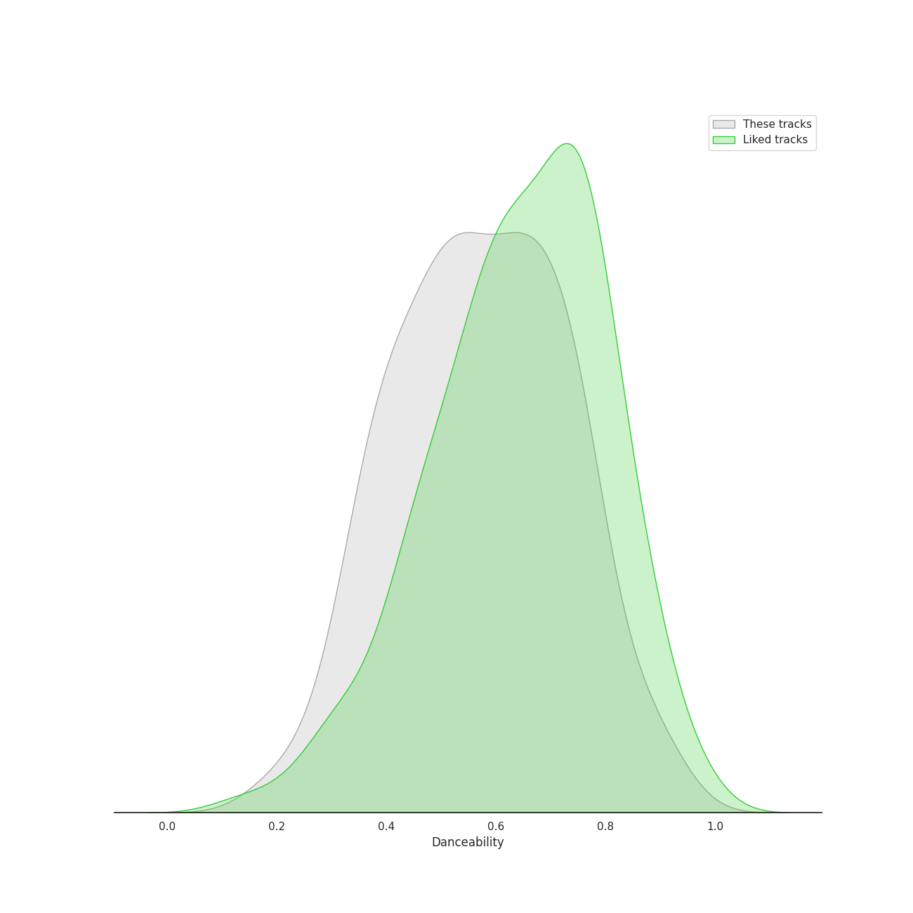
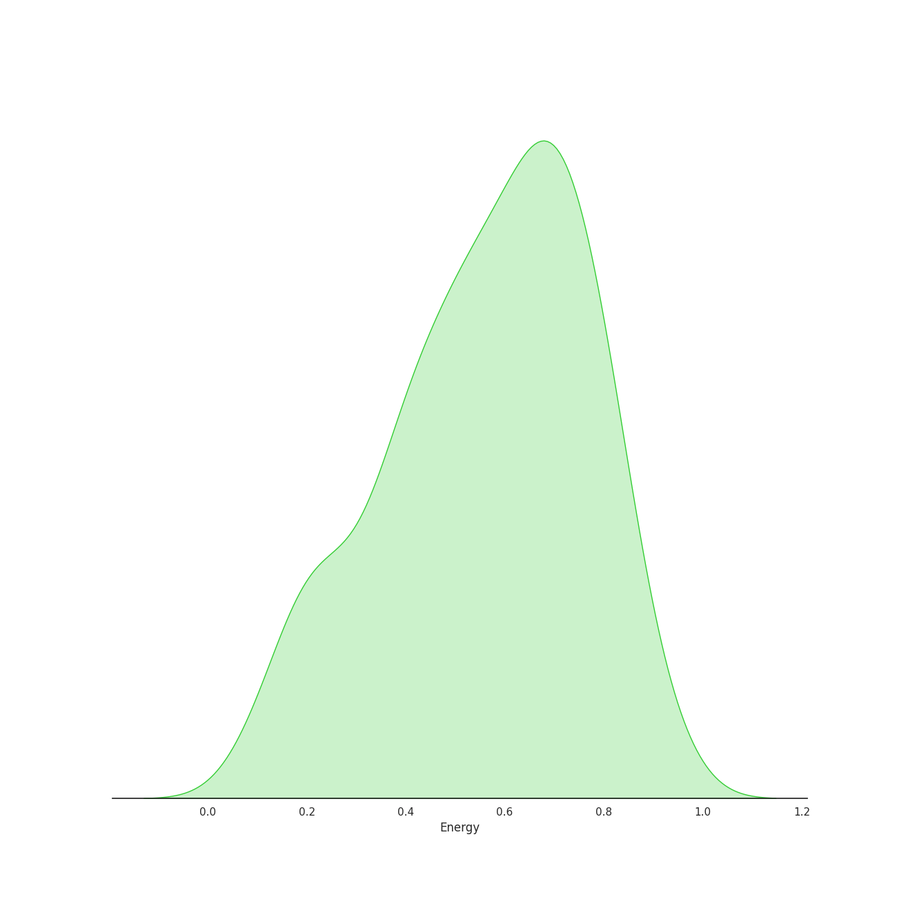
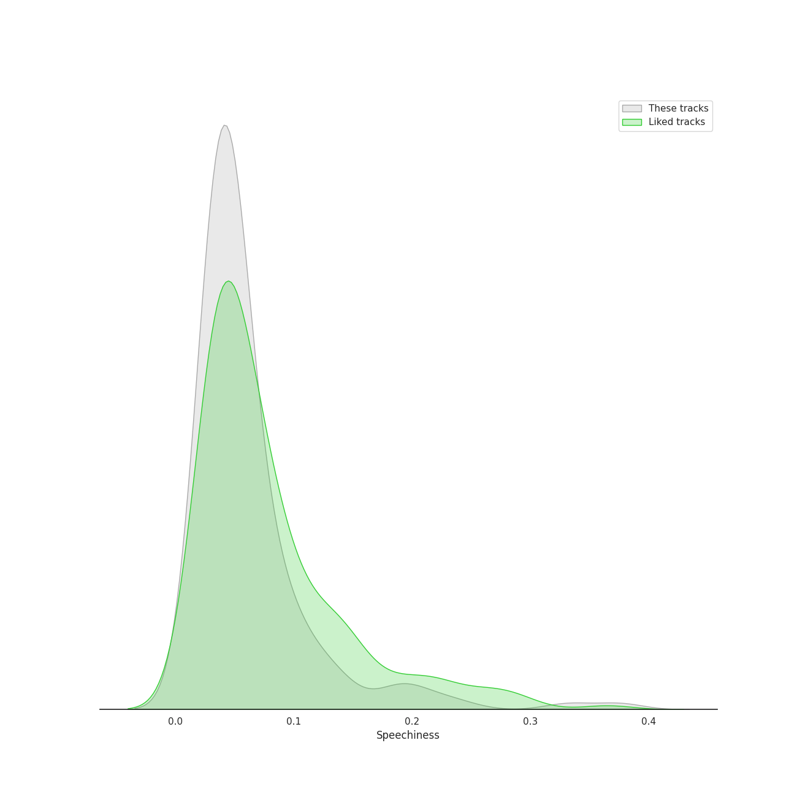
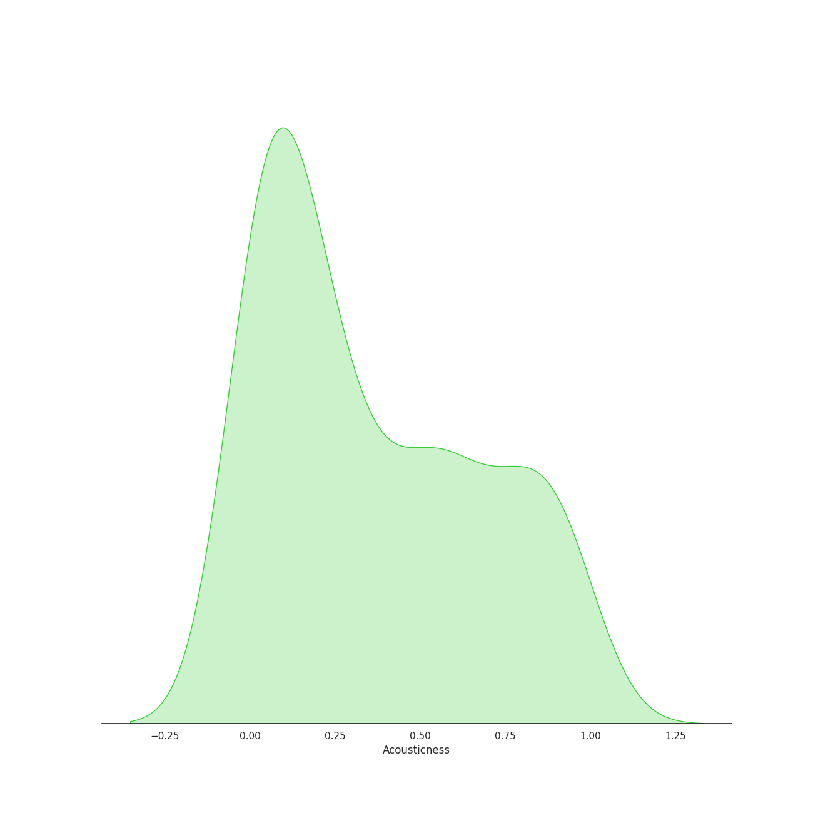
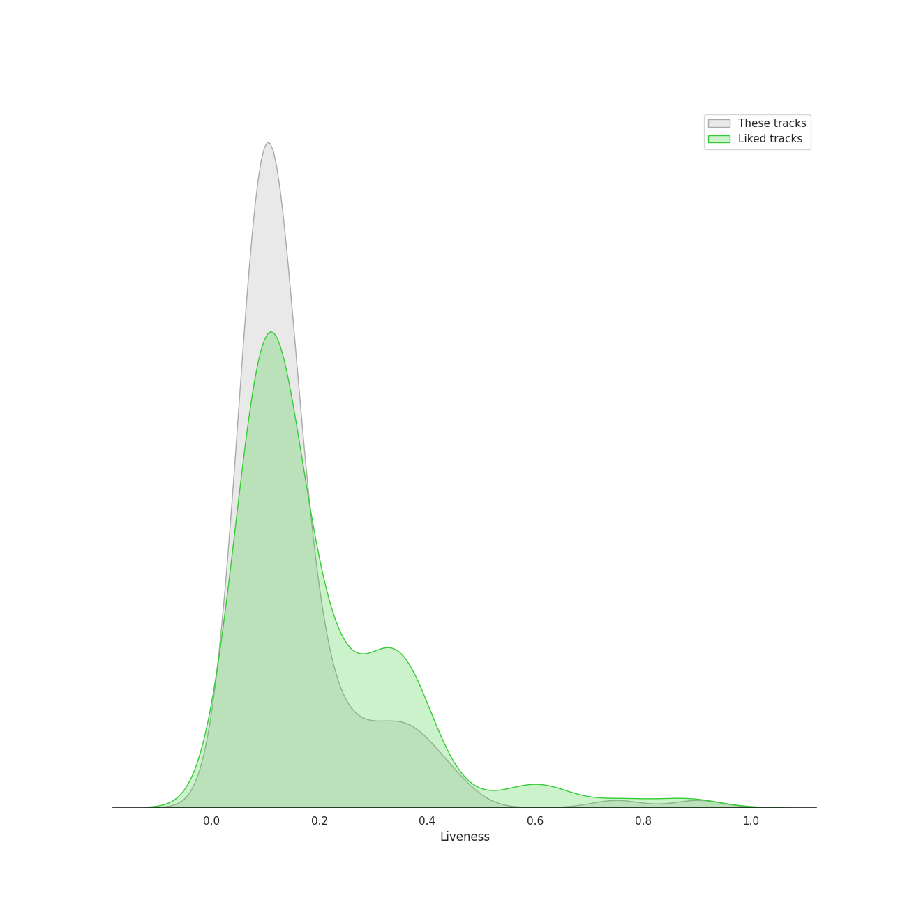
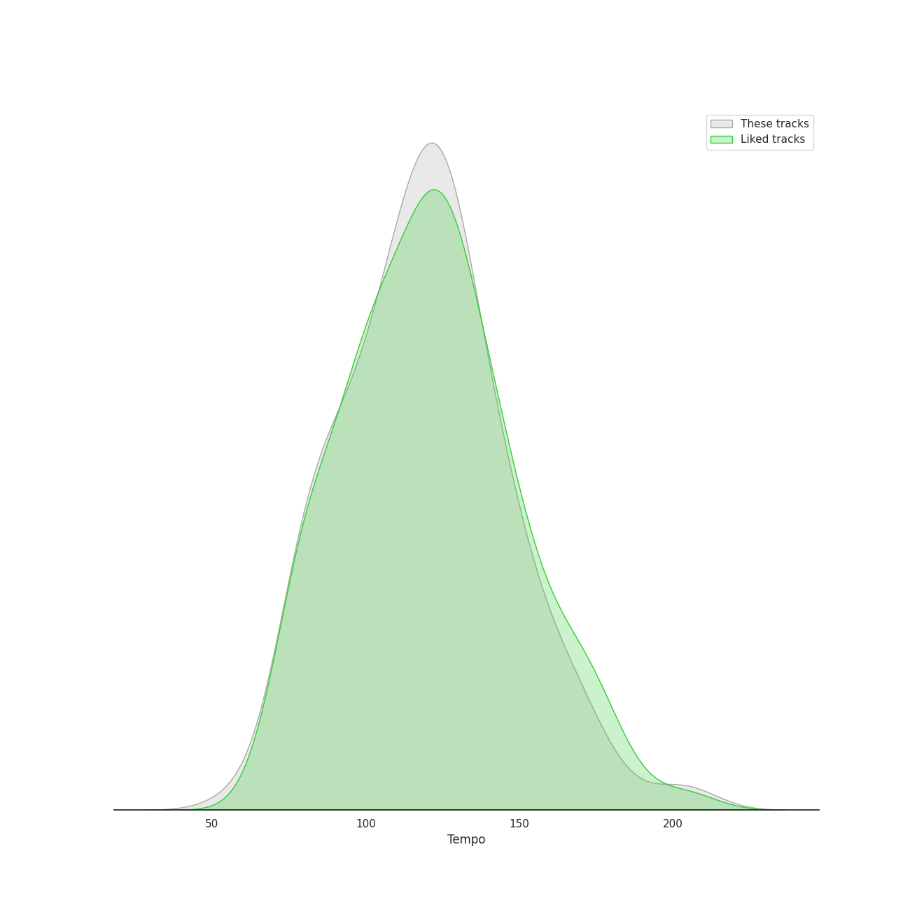

# Audio Features for Alt-Pop

## Danceability

| 10 most Danceable tracks | 10 least Danceable tracks |
|:---|:---|
| Fidelity (0.923) | Born To Die (0.18) |
| bury a friend (0.905) | Norman fucking Rockwell (0.215) |
| On the Radio (0.88) | Shades Of Cool (0.262) |
| Therefore I Am (0.879) | That's Where I Am (0.269) |
| Somebody That I Used To Know (0.864) | Radio (0.312) |
| Good Intent (0.851) | What Kind Of Man (0.313) |
| replay! (0.806) | Young And Beautiful (0.324) |
| Dreamer (0.802) | Happier Than Ever (0.332) |
| Rather Be (feat. Jess Glynne) (0.799) | Swan Song (0.34) |
| still feel. (0.779) | Bel Air (0.346) |

## Energy

| 10 most Energetic tracks | 10 least Energetic tracks |
|:---|:---|
| Cameo Lover (0.922) | Used (0.0938) |
| Like They Do on the TV (0.911) | when the party's over (0.111) |
| Delilah (0.87) | xanny (0.125) |
| Rabbit Heart (Raise It Up) (0.865) | Hide and Seek (0.166) |
| Radio (0.841) | foolish thinking (0.176) |
| Mantra for a Struggling Artist (0.839) | Samson (0.193) |
| They (0.817) | Norman fucking Rockwell (0.203) |
| Darling (0.812) | No Time To Die (0.219) |
| Young Folks (0.812) | Dreamer (0.223) |
| That Man (0.812) | Icarus (0.225) |

## Speechiness

| 10 most Speechy tracks | 10 least Speechy tracks |
|:---|:---|
| bad guy (0.375) | Speeding Cars (0.0247) |
| bury a friend (0.332) | Come On Closer (0.025) |
| xanny (0.239) | Meant (0.0267) |
| Cheap Thrills (feat. Sean Paul) (0.201) | Odi Et Amo (0.0275) |
| G Train (0.192) | Love (0.0277) |
| you should see me in a crown (0.186) | Stay Now (0.0281) |
| la type (0.183) | Missing You (0.0285) |
| Eye of the Needle (0.144) | Good Ones (0.0293) |
| That Man (0.138) | Swan Song (0.0294) |
| Like They Do on the TV (0.134) | First Train Home (0.0295) |

## Acousticness

| 10 most Acoustic tracks | 10 least Acoustic tracks |
|:---|:---|
| when the party's over (0.978) | Maniac (0.00162) |
| Norman fucking Rockwell (0.968) | Kiss With A Fist (0.00254) |
| Meant to Move (0.959) | SILENCE (0.00271) |
| Used (0.938) | You've Got The Love (0.00475) |
| lovely (with Khalid) (0.934) | Recovery (0.00747) |
| Icarus (0.931) | Free (0.00777) |
| No Time To Die (0.917) | Nightflyers (0.00834) |
| foolish thinking (0.917) | Missing You (0.00859) |
| Hide and Seek (0.909) | Seven Devils (0.00913) |
| everything i wanted (0.902) | What The Water Gave Me (0.00933) |

## Instrumentalness

| 10 most Instrumental tracks | 10 least Instrumental tracks |
|:---|:---|
| everything i wanted (0.657) | You've Got The Love (0.0) |
| Coal Miners (0.487) | Flesh & Bone (0.0) |
| Swan Song (0.421) | Dark Paradise (0.0) |
| you should see me in a crown (0.219) | lovely (with Khalid) (0.0) |
| Mantra for a Struggling Artist (0.216) | G Train (0.0) |
| Meant to Move (0.188) | Take Me to Church (0.0) |
| bury a friend (0.162) | Come On Closer (0.0) |
| GOLDWING (0.159) | The Feeling (0.0) |
| Therefore I Am (0.135) | YOUTH (0.0) |
| bad guy (0.13) | Odi Et Amo (0.0) |

## Liveness

| 10 most Live tracks | 10 least Live tracks |
|:---|:---|
| Bel Air (0.901) | Seven Devils (0.0477) |
| Whatever We Feel (0.75) | still feel. (0.0492) |
| Saw It Coming (0.456) | Icarus (0.0582) |
| No Light, No Light (0.444) | Therefore I Am (0.0583) |
| Darling (0.441) | Beg for You (feat. Rina Sawayama) - A. G. Cook & VERNON OF SEVENTEEN Remix (0.0585) |
| Off To The Races (0.4) | Say My Name (0.0596) |
| Rockabye (feat. Sean Paul & Anne-Marie) (0.398) | replay! (0.063) |
| Cherry (0.384) | The Other Side Of Paradise (0.0649) |
| Never Let Me Go (0.383) | Kiss With A Fist (0.0654) |
| Billions (0.374) | Coal Miners (0.0674) |

## Valence

| 10 most Happy tracks | 10 least Happy tracks |
|:---|:---|
| Tick Tock (feat. 24kGoldn) (0.946) | Swan Song (0.0392) |
| Earth (0.938) | Free (0.0494) |
| Come On Closer (0.928) | No Time To Die (0.0517) |
| That Man (0.903) | xanny (0.0528) |
| Good Intent (0.834) | Waltz Me to the Grave (0.0748) |
| Beg for You (feat. Rina Sawayama) - A. G. Cook & VERNON OF SEVENTEEN Remix (0.824) | How Big, How Blue, How Beautiful (0.0825) |
| Flesh & Bone (0.824) | Shades Of Cool (0.0878) |
| Kick It to Me (0.82) | Hide and Seek (0.0901) |
| Icarus (0.795) | The Good War (0.0928) |
| Rockabye (feat. Sean Paul & Anne-Marie) (0.792) | Old Flame (0.0932) |

## Tempo

| 10 most Fast tracks | 10 least Fast tracks |
|:---|:---|
| That Man (207.029) | Seven Devils (58.534) |
| Like They Do on the TV (199.23) | No Time To Die (73.537) |
| That's Where I Am (181.299) | Radio (75.112) |
| Free (174.806) | Born To Die (75.632) |
| I Feel It All (172.046) | Old Flame (77.61) |
| Delilah (169.946) | SILENCE (77.995) |
| Closing In (167.982) | Tomboy (77.998) |
| Limbo (165.02) | Norman fucking Rockwell (78.287) |
| Say My Name (164.035) | Heat Waves (80.87) |
| Big Girls Cry (161.996) | Happier Than Ever (81.055) |
