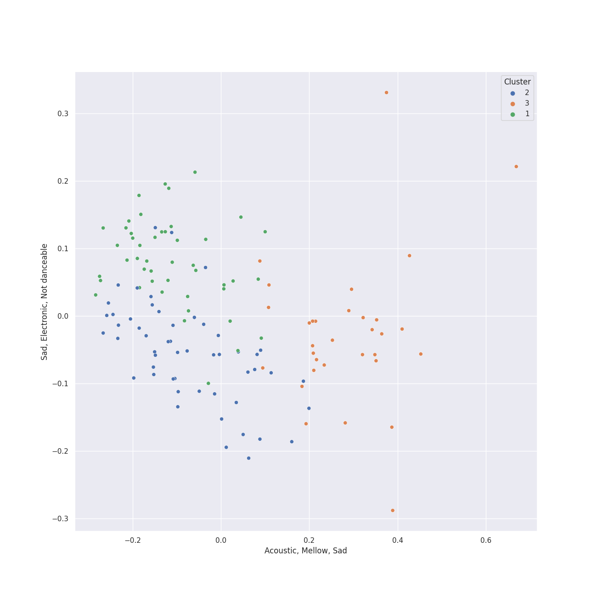

# Clusters in Alt-Pop

## Cluster #1

50 tracks

| Art | Track | Album | Artists | Label | 💚 | 🔗 |
|:---|:---|:---|:---|:---|:---|:---|
|  | Dog Days Are Over | Lungs | [Florence + The Machine](../../../../artists/florence___the_machine/overview.md) | [Universal-Island Records Ltd.](../../../../labels/universal_island_records_ltd_) | 💚 | [🔗](https://open.spotify.com/track/416zj01H28D6uQP43LL6x3) |
|  | I'm Not Calling You A Liar | Lungs | [Florence + The Machine](../../../../artists/florence___the_machine/overview.md) | [Universal-Island Records Ltd.](../../../../labels/universal_island_records_ltd_) | 💚 | [🔗](https://open.spotify.com/track/7u5oRKGjNovOvg8s1q4OTU) |
|  | You've Got The Love | Lungs | [Florence + The Machine](../../../../artists/florence___the_machine/overview.md) | [Universal-Island Records Ltd.](../../../../labels/universal_island_records_ltd_) | 💚 | [🔗](https://open.spotify.com/track/0DyToChmZxd4js5BY9Jf2G) |
|  | Closing In | Speak for Yourself | [Imogen Heap](../../../../artists/imogen_heap/overview.md) | Sony BMG Music UK | 💚 | [🔗](https://open.spotify.com/track/3wKRHAG6IvErggsniF1a3j) |
|  | The Great Unknown | Jukebox The Ghost | Jukebox The Ghost | Cherrytree Records/Kierszenbaum | | [🔗](https://open.spotify.com/track/6xBUdFmhryjXoxn8KkTNr4) |
|  | Top of the World | Primal Heart | [Kimbra](../../../../artists/kimbra/overview.md) | [Warner Records](../../../../labels/warner_records) | | [🔗](https://open.spotify.com/track/1Gbdx88ElOui7lczwxGX6m) |
|  | Dark Paradise | Born To Die | [Lana Del Rey](../../../../artists/lana_del_rey/overview.md) | [Polydor Records](../../../../labels/polydor_records) | 💚 | [🔗](https://open.spotify.com/track/0rbuGVyW18IpX0bhA3P4Oh) |
|  | Summertime Sadness | Born To Die | [Lana Del Rey](../../../../artists/lana_del_rey/overview.md) | [Polydor Records](../../../../labels/polydor_records) | 💚 | [🔗](https://open.spotify.com/track/4cKtn8Shw999egpwBmWQmp) |
|  | Eye of the Needle | 1000 Forms Of Fear (Deluxe Version) | [Sia](../../../../artists/sia/overview.md) | [Monkey Puzzle Records](../../../../labels/monkey_puzzle_records), [RCA Records Label](../../../../labels/rca_records_label) | 💚 | [🔗](https://open.spotify.com/track/6H8UxS43KArEIu2vGZI9Dj) |
|  | Bird Set Free | This Is Acting (Deluxe Version) | [Sia](../../../../artists/sia/overview.md) | [Monkey Puzzle Records](../../../../labels/monkey_puzzle_records), [RCA Records Label](../../../../labels/rca_records_label) | 💚 | [🔗](https://open.spotify.com/track/6MowG7MRVgPfGlCMsXKMJ2) |
## Cluster #2

57 tracks

| Art | Track | Album | Artists | Label | 💚 | 🔗 |
|:---|:---|:---|:---|:---|:---|:---|
|  | Boom | Anjulie | Anjulie | Hear Music | 💚 | [🔗](https://open.spotify.com/track/2Jf86nCe8O3LgAcflzxuy9) |
|  | I Feel It All | The Reminder | Feist | Universal Music Division One Records | | [🔗](https://open.spotify.com/track/3ghgwo0BTPm329zGMQRfn7) |
|  | Limbo | Vows (Deluxe Version) | [Kimbra](../../../../artists/kimbra/overview.md) | [Warner Records](../../../../labels/warner_records) | 💚 | [🔗](https://open.spotify.com/track/6go4VH47IaXtYlTGHizjhm) |
|  | Two Way Street | Vows (Deluxe Version) | [Kimbra](../../../../artists/kimbra/overview.md) | [Warner Records](../../../../labels/warner_records) | 💚 | [🔗](https://open.spotify.com/track/7ptSTFAis4UckLAfUrMfM0) |
|  | LA Type | A Reckoning | [Kimbra](../../../../artists/kimbra/overview.md), Tommy Raps, Pink Siifu | Kimbra | 💚 | [🔗](https://open.spotify.com/track/5itleMdzr78LXcwibYZkwP) |
|  | Doin' Time | Norman Fucking Rockwell! | [Lana Del Rey](../../../../artists/lana_del_rey/overview.md) | [Polydor Records](../../../../labels/polydor_records) | | [🔗](https://open.spotify.com/track/0Oqc0kKFsQ6MhFOLBNZIGX) |
|  | The Feeling | The Good Life | Sammy Rae & The Friends | Nettwerk Records | | [🔗](https://open.spotify.com/track/1aVedqqfdBKK0XsrjNJerA) |
|  | Cheap Thrills | This Is Acting (Deluxe Version) | [Sia](../../../../artists/sia/overview.md) | [Monkey Puzzle Records](../../../../labels/monkey_puzzle_records), [RCA Records Label](../../../../labels/rca_records_label) | 💚 | [🔗](https://open.spotify.com/track/3S4px9f4lceWdKf0gWciFu) |
|  | Cheap Thrills (feat. Sean Paul) | This Is Acting (Deluxe Version) | [Sia](../../../../artists/sia/overview.md), Sean Paul | [Monkey Puzzle Records](../../../../labels/monkey_puzzle_records), [RCA Records Label](../../../../labels/rca_records_label) | 💚 | [🔗](https://open.spotify.com/track/2ONIJ40u0Attbm3miIIpNO) |
|  | Half of the Way | Hill Climber | Vulfpeck, Theo Katzman | Vulf Records | 💚 | [🔗](https://open.spotify.com/track/3uFp6gGgNMtSEmzx1cHTG4) |
## Cluster #3

33 tracks

| Art | Track | Album | Artists | Label | 💚 | 🔗 |
|:---|:---|:---|:---|:---|:---|:---|
|  | ocean eyes | dont smile at me | [Billie Eilish](../../../../artists/billie_eilish/overview.md) | [Darkroom](../../../../labels/darkroom) | 💚 | [🔗](https://open.spotify.com/track/7hDVYcQq6MxkdJGweuCtl9) |
|  | Odi Et Amo | Beatrix Runs | Elizaveta | [Universal Records](../../../../labels/universal_music_llc) | 💚 | [🔗](https://open.spotify.com/track/24wPBY34rV79iESLYdpsRH) |
|  | Icarus | Messenger | Elizaveta | Flower Army Records | | [🔗](https://open.spotify.com/track/08Bp5AoOyjDsTNBlSkWTgI) |
|  | Work Song | Hozier (Expanded Edition) | Hozier | [Columbia](../../../../labels/columbia) | 💚 | [🔗](https://open.spotify.com/track/5TgEJ62DOzBpGxZ7WRsrqb) |
|  | Wait It Out | Ellipse | [Imogen Heap](../../../../artists/imogen_heap/overview.md) | [RCA Records Label](../../../../labels/rca_records_label) | 💚 | [🔗](https://open.spotify.com/track/4xszw2YraekWIpj0SZ6Lp6) |
|  | Foolish Thinking | A Reckoning | [Kimbra](../../../../artists/kimbra/overview.md), Ryan Lott | Kimbra | | [🔗](https://open.spotify.com/track/2TVMfEi6tqg5cxrg18n21s) |
|  | Video Games | Born To Die | [Lana Del Rey](../../../../artists/lana_del_rey/overview.md) | [Polydor Records](../../../../labels/polydor_records) | 💚 | [🔗](https://open.spotify.com/track/5by7gtiDrxe4n2qQQunL8S) |
|  | Fuck it I love you | Norman Fucking Rockwell! | [Lana Del Rey](../../../../artists/lana_del_rey/overview.md) | [Polydor Records](../../../../labels/polydor_records) | | [🔗](https://open.spotify.com/track/7MtVPRGtZl6rPjMfLoI3Lh) |
|  | Samson | Begin to Hope | Regina Spektor | Sire | 💚 | [🔗](https://open.spotify.com/track/2JAUBPBVkimRLc5BGhAkfJ) |
|  | Summer Is for Falling in Love | Summer Is for Falling in Love | Sarah Kang, EyeLoveBrandon | Sarah Kang | 💚 | [🔗](https://open.spotify.com/track/6yfGer1TKpxOjhSd5eL0DL) |