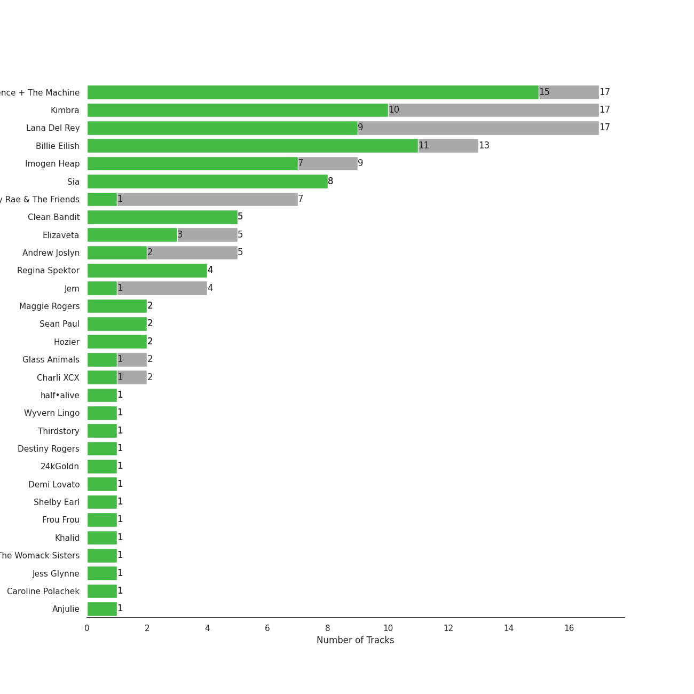
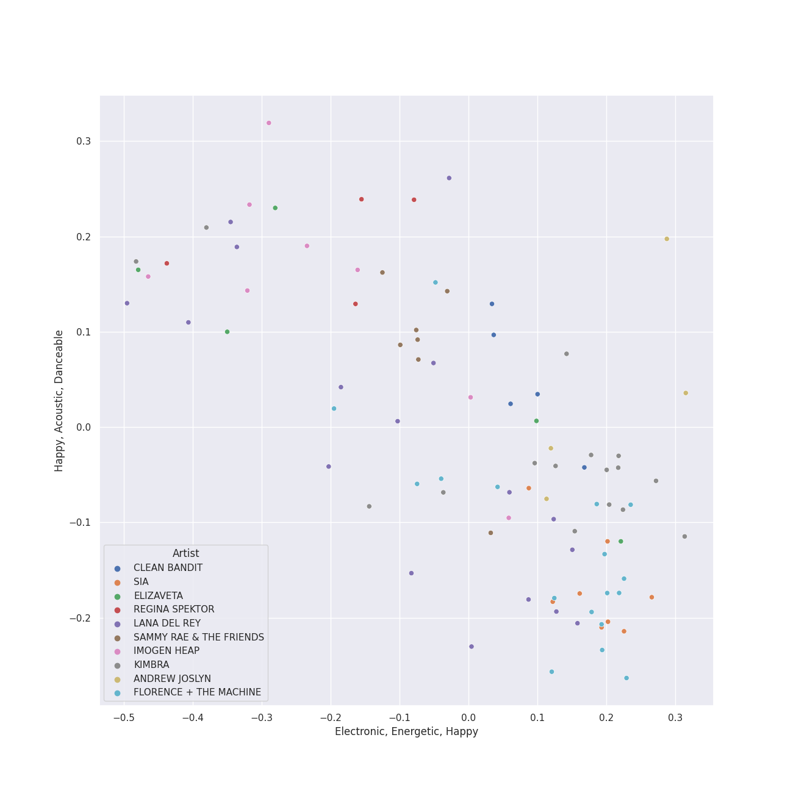
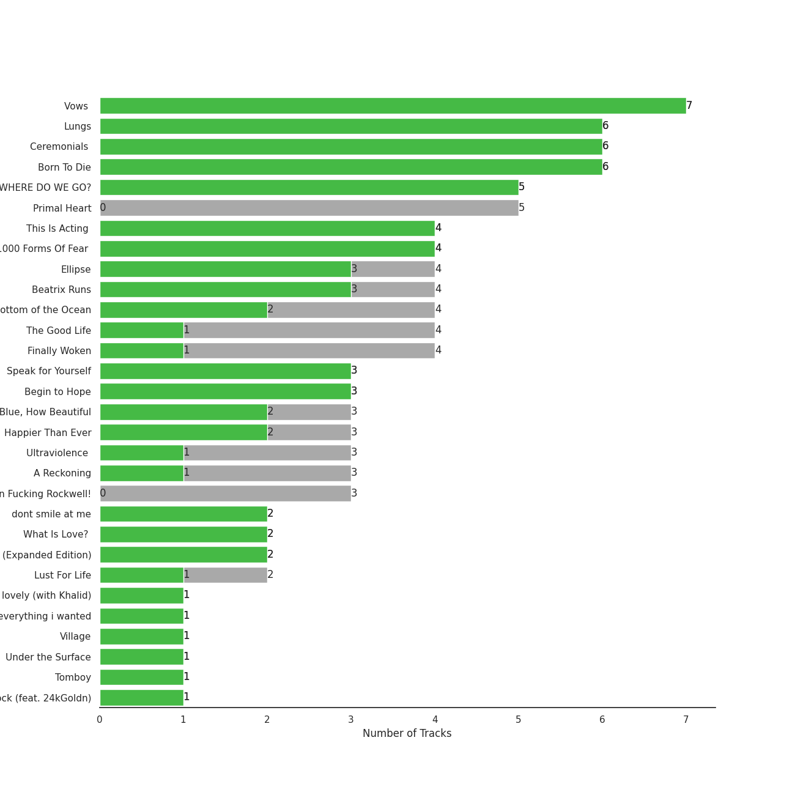
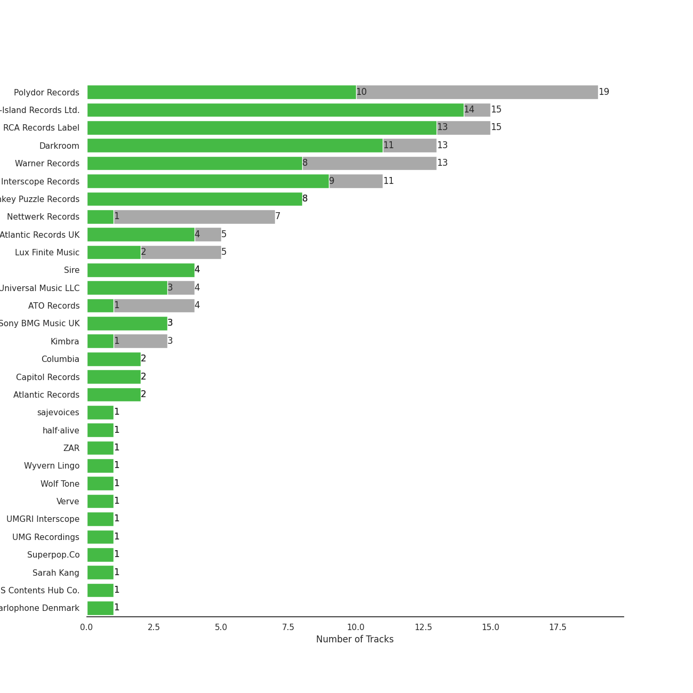
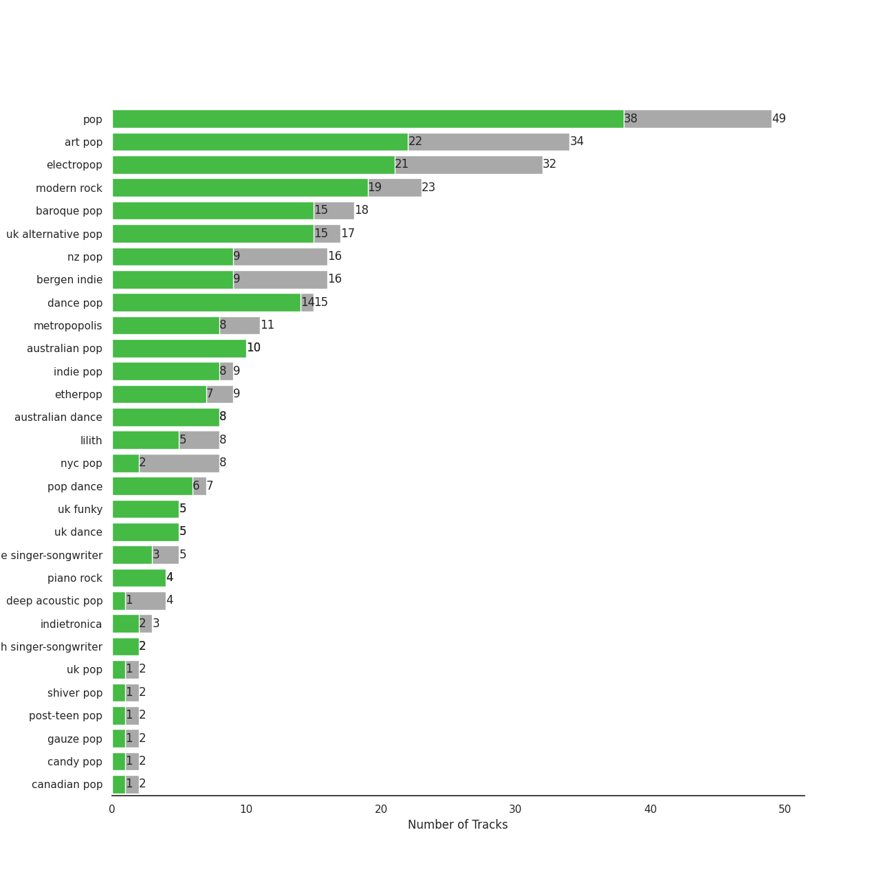
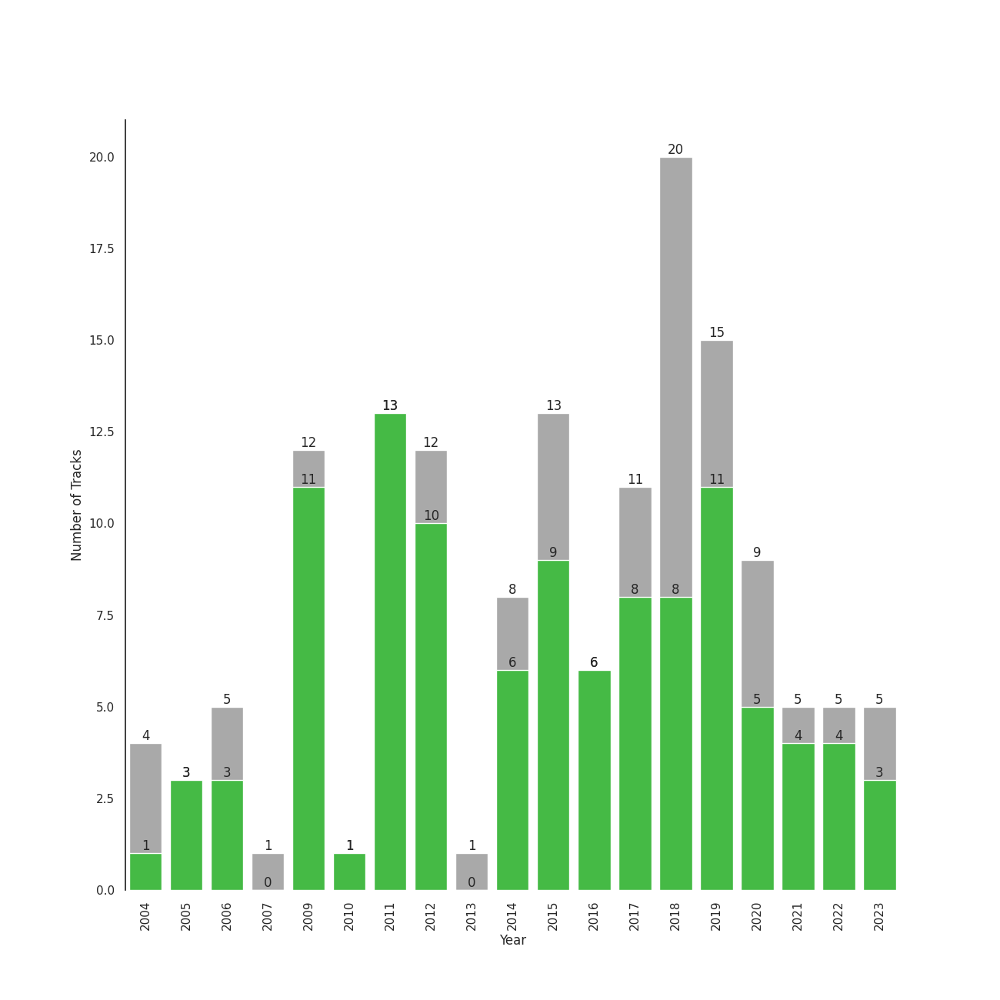

# Alt-Pop

[127 songs (87 liked)](tracks.md)

## Top Artists

See all 55 artists

| Art | Tracks | 💚 | Artist | 🔗 |
|:---|---:|---:|:---|:---|
|  | 17 | 15 | [Florence + The Machine](../../artists/florence___the_machine.md) | [🔗](https://open.spotify.com/artist/1moxjboGR7GNWYIMWsRjgG) |
|  | 17 | 10 | [Kimbra](../../artists/kimbra.md) | [🔗](https://open.spotify.com/artist/6hk7Yq1DU9QcCCrz9uc0Ti) |
|  | 17 | 9 | [Lana Del Rey](../../artists/lana_del_rey.md) | [🔗](https://open.spotify.com/artist/00FQb4jTyendYWaN8pK0wa) |
|  | 9 | 7 | Imogen Heap | [🔗](https://open.spotify.com/artist/6Xb4ezwoAQC4516kI89nWz) |
|  | 8 | 8 | Sia | [🔗](https://open.spotify.com/artist/5WUlDfRSoLAfcVSX1WnrxN) |
|  | 7 | 1 | Sammy Rae & The Friends | [🔗](https://open.spotify.com/artist/3lFDsTyYNPQc8WzJExnQWn) |
|  | 5 | 5 | Clean Bandit | [🔗](https://open.spotify.com/artist/6MDME20pz9RveH9rEXvrOM) |
|  | 5 | 3 | Elizaveta | [🔗](https://open.spotify.com/artist/2a9bCkqCkLvXM0s3uPvR7M) |
|  | 5 | 2 | Andrew Joslyn | [🔗](https://open.spotify.com/artist/5dSCgfYs71v0zjg2AwUq9n) |
|  | 4 | 4 | Regina Spektor | [🔗](https://open.spotify.com/artist/3z6Gk257P9jNcZbBXJNX5i) |
|  | 4 | 1 | Jem | [🔗](https://open.spotify.com/artist/4v4xuH9VypORYabMnhPLt1) |
|  | 3 | 1 | [Billie Eilish](../../artists/billie_eilish.md) | [🔗](https://open.spotify.com/artist/6qqNVTkY8uBg9cP3Jd7DAH) |
|  | 2 | 2 | Maggie Rogers | [🔗](https://open.spotify.com/artist/4NZvixzsSefsNiIqXn0NDe) |
|  | 2 | 2 | Sean Paul | [🔗](https://open.spotify.com/artist/3Isy6kedDrgPYoTS1dazA9) |
|  | 2 | 2 | Hozier | [🔗](https://open.spotify.com/artist/2FXC3k01G6Gw61bmprjgqS) |
|  | 2 | 1 | Glass Animals | [🔗](https://open.spotify.com/artist/4yvcSjfu4PC0CYQyLy4wSq) |
|  | 2 | 1 | Charli XCX | [🔗](https://open.spotify.com/artist/25uiPmTg16RbhZWAqwLBy5) |
|  | 1 | 1 | half•alive | [🔗](https://open.spotify.com/artist/7sOR7gk6XUlGnxj3p9F54k) |
|  | 1 | 1 | Wyvern Lingo | [🔗](https://open.spotify.com/artist/7etzKNDxaZ1LefgbGrexsN) |
|  | 1 | 1 | Thirdstory | [🔗](https://open.spotify.com/artist/7GJbWH8vhhuW22707B8HsW) |
|  | 1 | 1 | Destiny Rogers | [🔗](https://open.spotify.com/artist/6gezkje7GoJlQbHBgLXHuu) |
|  | 1 | 1 | 24kGoldn | [🔗](https://open.spotify.com/artist/6fWVd57NKTalqvmjRd2t8Z) |
|  | 1 | 1 | Demi Lovato | [🔗](https://open.spotify.com/artist/6S2OmqARrzebs0tKUEyXyp) |
|  | 1 | 1 | Shelby Earl | [🔗](https://open.spotify.com/artist/6PIo5nhCQJbR0NfxPdGnGC) |
|  | 1 | 1 | Frou Frou | [🔗](https://open.spotify.com/artist/6MUyqmIQ35inLjch0YzIEG) |
|  | 1 | 1 | The Womack Sisters | [🔗](https://open.spotify.com/artist/6BjLHAiun9TeqC55KB3L6s) |
|  | 1 | 1 | Conan Gray | [🔗](https://open.spotify.com/artist/4Uc8Dsxct0oMqx0P6i60ea) |
|  | 1 | 1 | Jess Glynne | [🔗](https://open.spotify.com/artist/4ScCswdRlyA23odg9thgIO) |
|  | 1 | 1 | Caroline Polachek | [🔗](https://open.spotify.com/artist/4Ge8xMJNwt6EEXOzVXju9a) |
|  | 1 | 1 | Anjulie | [🔗](https://open.spotify.com/artist/4DTbdShHu2RPYEEMUp2XWV) |
|  | 1 | 1 | Caro Emerald | [🔗](https://open.spotify.com/artist/492hDmhPyuIjP3MgTcIqgm) |
|  | 1 | 1 | Pink Siifu | [🔗](https://open.spotify.com/artist/40ZElxHldNyvn7x8WRC6fh) |
|  | 1 | 1 | Christopher | [🔗](https://open.spotify.com/artist/3zDRCqOhJXJfS2YWOEwGMC) |
|  | 1 | 1 | Huxlee | [🔗](https://open.spotify.com/artist/3yb7HrGPG0WpWgdO4XFwBf) |
|  | 1 | 1 | Troye Sivan | [🔗](https://open.spotify.com/artist/3WGpXCj9YhhfX11TToZcXP) |
|  | 1 | 1 | Will Jordan | [🔗](https://open.spotify.com/artist/3Is3ehDoBlnTKQtCHdEvpd) |
|  | 1 | 1 | Tommy Raps | [🔗](https://open.spotify.com/artist/2jDVhHiltj9mEWoIGdBg3z) |
|  | 1 | 1 | Gotye | [🔗](https://open.spotify.com/artist/2AsusXITU8P25dlRNhcAbG) |
|  | 1 | 1 | Anne-Marie | [🔗](https://open.spotify.com/artist/1zNqDE7qDGCsyzJwohVaoX) |
|  | 1 | 1 | YB | [🔗](https://open.spotify.com/artist/1rpgxJZxZMLnFNc1Jmyov5) |
|  | 1 | 1 | Zara Larsson | [🔗](https://open.spotify.com/artist/1Xylc3o4UrD53lo9CvFvVg) |
|  | 1 | 1 | Mabel | [🔗](https://open.spotify.com/artist/1MIVXf74SZHmTIp4V4paH4) |
|  | 1 | 1 | Guy Sigsworth | [🔗](https://open.spotify.com/artist/0uQWT7X0I9Y7zM7WWexpAj) |
|  | 1 | 1 | Måneskin | [🔗](https://open.spotify.com/artist/0lAWpj5szCSwM4rUMHYmrr) |
|  | 1 | 1 | Jacob Banks | [🔗](https://open.spotify.com/artist/0AepkoQhYvkjEzzwIcGxdV) |
|  | 1 | 0 | Peter Bjorn and John | [🔗](https://open.spotify.com/artist/6u11Qbko2N2hP4lTBYjX86) |
|  | 1 | 0 | Feist | [🔗](https://open.spotify.com/artist/6CWTBjOJK75cTE8Xv8u1kj) |
|  | 1 | 0 | A. G. Cook | [🔗](https://open.spotify.com/artist/335TWGWGFan4vaacJzSiU8) |
|  | 1 | 0 | VERNON | [🔗](https://open.spotify.com/artist/2Y34b9AOK30zXgL7cAH4NG) |
|  | 1 | 0 | Tove Styrke | [🔗](https://open.spotify.com/artist/2QSPrJfYeRXaltEEiriXN9) |
|  | 1 | 0 | Rina Sawayama | [🔗](https://open.spotify.com/artist/2KEqzdPS7M5YwGmiuPTdr5) |
|  | 1 | 0 | Lerin Herzer | [🔗](https://open.spotify.com/artist/1O3tPNfosJcQQNI6wmR5Xt) |
|  | 1 | 0 | Ryan Lott | [🔗](https://open.spotify.com/artist/0rLLyTr5rx0qYKb63MdVW9) |
|  | 1 | 0 | Adra Boo | [🔗](https://open.spotify.com/artist/0YahlVgicneX5hdN8XyIpp) |
|  | 1 | 0 | Billy McCarthy | [🔗](https://open.spotify.com/artist/02v2poO7JL5ixVE5GGfwkn) |

## Top Albums

See all 65 albums

| Art | Tracks | 💚 | Album | Release Date | 🔗 |
|:---|---:|---:|:---|:---|:---|
|  | 7 | 7 | Vows (Deluxe Version) | 2011 | [🔗](https://open.spotify.com/album/6V9rvW05Um5bIHePPfeI8p) |
|  | 6 | 6 | Lungs | 2009-01-01 | [🔗](https://open.spotify.com/album/2KAK58PimXHF4lSoKO3RxA) |
|  | 6 | 6 | Ceremonials (Deluxe Edition) | 2011-01-01 | [🔗](https://open.spotify.com/album/5SxudoALxEAVh9l83kSebx) |
|  | 6 | 6 | Born To Die | 2012-01-30 | [🔗](https://open.spotify.com/album/4X8hAqIWpQyQks2yRhyqs4) |
|  | 5 | 0 | Primal Heart | 2018-04-20 | [🔗](https://open.spotify.com/album/4pj0BkJ7u39i009oqe8V79) |
|  | 4 | 4 | This Is Acting (Deluxe Version) | 2016-10-21 | [🔗](https://open.spotify.com/album/2eV6DIPDnGl1idcjww6xyX) |
|  | 4 | 4 | 1000 Forms Of Fear (Deluxe Version) | 2015-05-04 | [🔗](https://open.spotify.com/album/6FdNvoO5sF4EKwCX9je1MH) |
|  | 4 | 3 | Ellipse | 2009-08-25 | [🔗](https://open.spotify.com/album/5AYKGPzPBJNHeKehCxMaq0) |
|  | 4 | 3 | Beatrix Runs | 2012 | [🔗](https://open.spotify.com/album/7HsPaYQbCYnxosF5WiSlEA) |
|  | 4 | 2 | Awake at the Bottom of the Ocean | 2017-02-10 | [🔗](https://open.spotify.com/album/7G36cnLPx9CuqnmZXYna4a) |
|  | 4 | 1 | The Good Life | 2018-07-10 | [🔗](https://open.spotify.com/album/2xCZSSa0kfIJFDhQR8bYar) |
|  | 4 | 1 | Finally Woken | 2004-03-23 | [🔗](https://open.spotify.com/album/3RkjNfqqlhWyLrRp0ZCARU) |
|  | 3 | 3 | Speak for Yourself | 2005-07-18 | [🔗](https://open.spotify.com/album/0t0Cr8jA63wlm8nWj7qfvJ) |
|  | 3 | 3 | Begin to Hope | 2006-06-13 | [🔗](https://open.spotify.com/album/4L4tcx3itXbtx5kuchKhFE) |
|  | 3 | 2 | How Big, How Blue, How Beautiful | 2015-06-01 | [🔗](https://open.spotify.com/album/2btszoya78vyT8fwelmVnz) |
|  | 3 | 1 | Ultraviolence (Deluxe) | 2014-01-01 | [🔗](https://open.spotify.com/album/1ORxRsK3MrSLvh7VQTF01F) |
|  | 3 | 1 | A Reckoning | 2023-01-27 | [🔗](https://open.spotify.com/album/2LXTIciAcMZ6wa96d9sLnM) |
|  | 3 | 0 | Norman Fucking Rockwell! | 2019-08-30 | [🔗](https://open.spotify.com/album/5XpEKORZ4y6OrCZSKsi46A) |
|  | 2 | 2 | What Is Love? (Deluxe Edition) | 2018-11-30 | [🔗](https://open.spotify.com/album/1MvF4ulZKH7SaDQs9rE5nc) |
|  | 2 | 2 | Hozier (Expanded Edition) | 2014-09-19 | [🔗](https://open.spotify.com/album/4Pv7m8D82A1Xun7xNCKZjJ) |
|  | 2 | 1 | Lust For Life | 2017-07-21 | [🔗](https://open.spotify.com/album/7xYiTrbTL57QO0bb4hXIKo) |
|  | 2 | 1 | Happier Than Ever | 2021-07-30 | [🔗](https://open.spotify.com/album/0JGOiO34nwfUdDrD612dOp) |
|  | 1 | 1 | Village | 2018-11-02 | [🔗](https://open.spotify.com/album/2KxC2M0bVm5hrK3GgGMuV9) |
|  | 1 | 1 | Under the Surface | 2019-02-22 | [🔗](https://open.spotify.com/album/6ISIdF1gCK9X8pn4FaObHE) |
|  | 1 | 1 | Tomboy | 2019-02-28 | [🔗](https://open.spotify.com/album/2uDZBeyyQ7mfwF9mUJeYUG) |
|  | 1 | 1 | Tick Tock (feat. 24kGoldn) | 2020-08-21 | [🔗](https://open.spotify.com/album/3tuAs968COA2vxKjiLvmxr) |
|  | 1 | 1 | The Widow Knows E.P. | 2014-08-14 | [🔗](https://open.spotify.com/album/548WnictHrfJKj2u6tXqFe) |
|  | 1 | 1 | The Golden Echo | 2014-08-15 | [🔗](https://open.spotify.com/album/66hoUkjxM7tVQwu7bZocwP) |
|  | 1 | 1 | Taxidriver OST Part.1 | 2021-04-16 | [🔗](https://open.spotify.com/album/3PNXlS9tggXmCm1hrlHDcQ) |
|  | 1 | 1 | Surrender | 2022-07-29 | [🔗](https://open.spotify.com/album/2VeOtQQAJxR8VyvmoXqIbI) |
|  | 1 | 1 | SuperRock (All Folked Up) | 2017-07-19 | [🔗](https://open.spotify.com/album/4PEc1CBBlhpGzswmWjLyFK) |
|  | 1 | 1 | Solo (feat. Demi Lovato) | 2018-05-17 | [🔗](https://open.spotify.com/album/1q7a5wZeti0neU2jDn8Dz3) |
|  | 1 | 1 | Searching | 2016-05-06 | [🔗](https://open.spotify.com/album/7pjWbCevZabqDKwm26ggKd) |
|  | 1 | 1 | Paradise | 2012-11-09 | [🔗](https://open.spotify.com/album/1JnjcAIKQ9TSJFVFierTB8) |
|  | 1 | 1 | Now, Not Yet | 2019-08-09 | [🔗](https://open.spotify.com/album/2KSWrd22LGc0Hmqs2Z5i7z) |
|  | 1 | 1 | New Eyes | 2014-06-02 | [🔗](https://open.spotify.com/album/4a6DxkhmMvvEdPXxm4ergN) |
|  | 1 | 1 | Kid Krow | 2020-03-20 | [🔗](https://open.spotify.com/album/2CMlkzFI2oDAy5MbyV7OV5) |
|  | 1 | 1 | How To Be A Human Being | 2016-08-26 | [🔗](https://open.spotify.com/album/6qb9MDR0lfsN9a2pw77uJy) |
|  | 1 | 1 | Heard It In A Past Life | 2019-01-18 | [🔗](https://open.spotify.com/album/5AHWNPo3gllDmixgAoFru4) |
|  | 1 | 1 | Far | 2009-06-09 | [🔗](https://open.spotify.com/album/5t0lQDPLF22wmWCtSZkIVv) |
|  | 1 | 1 | Deleted Scenes From The Cutting Room Floor | 2010-01-29 | [🔗](https://open.spotify.com/album/1D8grnftAaivpmBkayUgMR) |
|  | 1 | 1 | Darling | 2017-02-03 | [🔗](https://open.spotify.com/album/7pDkPCnYRapjr8dXcwkNIB) |
|  | 1 | 1 | Dance Fever | 2022-05-13 | [🔗](https://open.spotify.com/album/4ohh1zQ4yybSK9FS7LLyDE) |
|  | 1 | 1 | Chosen | 2017-12-08 | [🔗](https://open.spotify.com/album/2qJw6w5XwQO0PQlSWPu7Tw) |
|  | 1 | 1 | CRASH | 2022-03-18 | [🔗](https://open.spotify.com/album/1QqipMXWzJhr6yfcNKTp8B) |
|  | 1 | 1 | Blue Neighbourhood (Deluxe) | 2015-12-04 | [🔗](https://open.spotify.com/album/5ouTDazE4LF9bVJPx1nlgW) |
|  | 1 | 1 | Billions | 2022-02-09 | [🔗](https://open.spotify.com/album/4DpAPqdJ1jVhoWZrxWLRH5) |
|  | 1 | 1 | Aussie Legends | 2019-11-22 | [🔗](https://open.spotify.com/album/3IGRFGa4ErR0CU8aMMrRql) |
|  | 1 | 1 | Anjulie | 2009-01-01 | [🔗](https://open.spotify.com/album/13ablPhINDfXMbbvgX7eLw) |
|  | 1 | 1 | A New Kind Of Love (Demo) | 2022-04-08 | [🔗](https://open.spotify.com/album/484SKRaXGq7m9VV0rmSyeb) |
|  | 1 | 0 | Young And Beautiful | 2013-01-01 | [🔗](https://open.spotify.com/album/1D92WOHWUI2AGQCCdplcXL) |
|  | 1 | 0 | Writer's Block | 2006-01-01 | [🔗](https://open.spotify.com/album/5g4E06cxsFEMFE9hSekAt2) |
|  | 1 | 0 | Whatever We Feel | 2020-04-03 | [🔗](https://open.spotify.com/album/5Lg9bnBTPSu0Xg7MRERveZ) |
|  | 1 | 0 | The Reminder | 2007-01-01 | [🔗](https://open.spotify.com/album/7bTdGfczXffzzNE9ssJj4Z) |
|  | 1 | 0 | The Girl and the Ghost | 2012-09-18 | [🔗](https://open.spotify.com/album/1e1qx3O2gLpmLuVE7OEfxp) |
|  | 1 | 0 | Sway | 2018-05-04 | [🔗](https://open.spotify.com/album/3fSRbKgYW6kcR1ZFMaaNV4) |
|  | 1 | 0 | Saw It Coming | 2019-05-10 | [🔗](https://open.spotify.com/album/0SPZ4equvZdVOPzOYrS8pJ) |
|  | 1 | 0 | Messenger | 2015-06-29 | [🔗](https://open.spotify.com/album/3yQJY0tg0M2rQwWYUgkVQp) |
|  | 1 | 0 | Jackie Onassis | 2020-06-05 | [🔗](https://open.spotify.com/album/3RaVt6xWjSVMFrMdLqoDrN) |
|  | 1 | 0 | Honeymoon | 2015-09-18 | [🔗](https://open.spotify.com/album/2DpEBrjCur1ythIZ10gJWw) |
|  | 1 | 0 | High As Hope | 2018-06-29 | [🔗](https://open.spotify.com/album/0pKZJj9GzcKPCS8r4IaksA) |
|  | 1 | 0 | Guitar Songs | 2022-07-21 | [🔗](https://open.spotify.com/album/1YPWxMpQEC8kcOuefgXbhj) |
|  | 1 | 0 | Goodnight And Go | 2006-05-02 | [🔗](https://open.spotify.com/album/3JYjYjUAoBjxXr1W8eDVLV) |
|  | 1 | 0 | Dreamland (+ Bonus Levels) | 2020-08-06 | [🔗](https://open.spotify.com/album/0KTj6k94XZh0c6IEMfxeWV) |
|  | 1 | 0 | Beg For You (A. G. Cook & VERNON OF SEVENTEEN Remix) [feat. Rina Sawayama] | 2022-02-25 | [🔗](https://open.spotify.com/album/6snPKZGUbpydW2XJu9ievq) |

## Top Record Labels

See all 42 labels

| Tracks | 💚 | Label |
|---:|---:|:---|
| 19 | 10 | [Polydor Records](../../labels/polydor_records.md) |
| 15 | 14 | [Universal-Island Records Ltd.](../../labels/universal_island_records_ltd_.md) |
| 15 | 13 | [RCA Records Label](../../labels/rca_records_label.md) |
| 13 | 8 | [Warner Records](../../labels/warner_records.md) |
| 8 | 8 | Monkey Puzzle Records |
| 7 | 1 | Nettwerk Records |
| 5 | 4 | Atlantic Records UK |
| 5 | 2 | Lux Finite Music |
| 4 | 4 | Sire |
| 4 | 3 | [Universal Music LLC](../../labels/universal_music_llc.md) |
| 4 | 1 | ATO Records |
| 3 | 3 | Sony BMG Music UK |
| 3 | 1 | Kimbra |
| 3 | 1 | [Interscope Records](../../labels/interscope_records.md) |
| 3 | 1 | [Darkroom](../../labels/darkroom.md) |
| 2 | 2 | [Columbia](../../labels/columbia.md) |
| 2 | 2 | [Capitol Records](../../labels/capitol_records.md) |
| 2 | 2 | [Atlantic Records](../../labels/atlantic_records.md) |
| 1 | 1 | half·alive |
| 1 | 1 | ZAR |
| 1 | 1 | Wyvern Lingo |
| 1 | 1 | Wolf Tone |
| 1 | 1 | Verve |
| 1 | 1 | UMGRI Interscope |
| 1 | 1 | UMG Recordings |
| 1 | 1 | Superpop.Co |
| 1 | 1 | SBS Contents Hub Co. |
| 1 | 1 | [Republic Records](../../labels/republic_records.md) |
| 1 | 1 | Perpetual Novice |
| 1 | 1 | Parlophone Denmark |
| 1 | 1 | Not specified |
| 1 | 1 | Music Recipe |
| 1 | 1 | Megaphonic |
| 1 | 1 | Hear Music |
| 1 | 1 | Grandmono Records |
| 1 | 1 | EMI Recorded Music Australia Pty Ltd |
| 1 | 1 | Big Beat Records |
| 1 | 0 | Universal Music Division Polydor |
| 1 | 0 | Universal Music AB |
| 1 | 0 | RCA Victor |
| 1 | 0 | Flower Army Records |
| 1 | 0 | EMI |

## Genres

See all 58 genres

| Tracks | 💚 | Genre |
|---:|---:|:---|
| 59 | 46 | [pop](../../genres/pop.md) |
| 23 | 12 | [electropop](../../genres/electropop.md) |
| 23 | 12 | [art pop](../../genres/art_pop.md) |
| 18 | 15 | baroque pop |
| 17 | 15 | uk alternative pop |
| 17 | 15 | [dance pop](../../genres/dance_pop.md) |
| 17 | 9 | indie pop |
| 16 | 9 | nz pop |
| 16 | 9 | bergen indie |
| 11 | 8 | metropopolis |
| 10 | 10 | australian pop |
| 9 | 7 | etherpop |
| 8 | 8 | australian dance |
| 8 | 5 | [lilith](../../genres/lilith.md) |
| 8 | 2 | nyc pop |
| 5 | 5 | uk funky |
| 5 | 5 | uk dance |
| 5 | 5 | tropical house |
| 5 | 5 | pop rap |
| 5 | 5 | pop dance |
| 5 | 5 | edm |
| 5 | 3 | deep indie singer-songwriter |
| 4 | 4 | piano rock |
| 3 | 2 | indietronica |
| 2 | 2 | irish singer-songwriter |
| 2 | 1 | uk pop |
| 2 | 1 | shiver pop |
| 2 | 1 | [post-teen pop](../../genres/post_teen_pop.md) |
| 2 | 1 | modern rock |
| 2 | 1 | gauze pop |
| 2 | 1 | candy pop |
| 2 | 1 | canadian pop |
| 1 | 1 | viral pop |
| 1 | 1 | uk contemporary r&b |
| 1 | 1 | nu jazz |
| 1 | 1 | modern alternative rock |
| 1 | 1 | korean indie rock |
| 1 | 1 | italian pop |
| 1 | 1 | irish pop |
| 1 | 1 | indie rock italiano |
| 1 | 1 | indie poptimism |
| 1 | 1 | escape room |
| 1 | 1 | dutch pop |
| 1 | 1 | downtempo |
| 1 | 1 | danish pop |
| 1 | 1 | bedroom pop |
| 1 | 1 | alt z |
| 1 | 0 | swedish synthpop |
| 1 | 0 | swedish pop |
| 1 | 0 | swedish indie pop |
| 1 | 0 | swedish electropop |
| 1 | 0 | swedish alternative rock |
| 1 | 0 | stomp and holler |
| 1 | 0 | new rave |
| 1 | 0 | indie rock |
| 1 | 0 | chamber pop |
| 1 | 0 | canadian indie |
| 1 | 0 | alternative dance |

## Years

| 10 newest albums | 10 oldest albums |
|:---|:---|
| 
 A Reckoning (2023-01-27)
 | 
 Finally Woken (2004-03-23)
 |
| 
 Surrender (2022-07-29)
 | 
 Speak for Yourself (2005-07-18)
 |
| 
 Guitar Songs (2022-07-21)
 | 
 Writer's Block (2006-01-01)
 |
| 
 Dance Fever (2022-05-13)
 | 
 Goodnight And Go (2006-05-02)
 |
| 
 A New Kind Of Love (Demo) (2022-04-08)
 | 
 Begin to Hope (2006-06-13)
 |
| 
 CRASH (2022-03-18)
 | 
 The Reminder (2007-01-01)
 |
| 
 Beg For You (A. G. Cook & VERNON OF SEVENTEEN Remix) [feat. Rina Sawayama] (2022-02-25)
 | 
 Anjulie (2009-01-01)
 |
| 
 Billions (2022-02-09)
 | 
 Lungs (2009-01-01)
 |
| 
 Happier Than Ever (2021-07-30)
 | 
 Far (2009-06-09)
 |
| 
 Taxidriver OST Part.1 (2021-04-16)
 | 
 Ellipse (2009-08-25)
 |
## Audio Features

| 10 most Danceable tracks | 10 least Danceable tracks |
|:---|:---|
| Fidelity (0.923) | Born To Die (0.18) |
| On the Radio (0.88) | Norman fucking Rockwell (0.215) |
| Somebody That I Used To Know (0.864) | Shades Of Cool (0.262) |
| Good Intent (0.851) | That's Where I Am (0.269) |
| replay! (0.806) | Radio (0.312) |
| Dreamer (0.802) | What Kind Of Man (0.313) |
| Rather Be (feat. Jess Glynne) (0.799) | Young And Beautiful (0.324) |
| still feel. (0.779) | Happier Than Ever (0.332) |
| Tick Tock (feat. 24kGoldn) (0.779) | Swan Song (0.34) |
| la type (0.773) | Bel Air (0.346) |

| 10 most Energetic tracks | 10 least Energetic tracks |
|:---|:---|
| Cameo Lover (0.922) | Used (0.0938) |
| Like They Do on the TV (0.911) | Hide and Seek (0.166) |
| Delilah (0.87) | foolish thinking (0.176) |
| Rabbit Heart (Raise It Up) (0.865) | Samson (0.193) |
| Radio (0.841) | Norman fucking Rockwell (0.203) |
| Mantra for a Struggling Artist (0.839) | Dreamer (0.223) |
| They (0.817) | Icarus (0.225) |
| Darling (0.812) | Odi Et Amo (0.225) |
| Young Folks (0.812) | Happier Than Ever (0.225) |
| That Man (0.812) | TV (0.236) |

| 10 most Speechy tracks | 10 least Speechy tracks |
|:---|:---|
| Cheap Thrills (feat. Sean Paul) (0.201) | Speeding Cars (0.0247) |
| G Train (0.192) | Come On Closer (0.025) |
| la type (0.183) | Meant (0.0267) |
| Eye of the Needle (0.144) | Odi Et Amo (0.0275) |
| That Man (0.138) | Love (0.0277) |
| Like They Do on the TV (0.134) | Stay Now (0.0281) |
| GOLDWING (0.126) | Missing You (0.0285) |
| Say My Name (0.125) | Good Ones (0.0293) |
| Bad (0.12) | Swan Song (0.0294) |
| Kiss With A Fist (0.114) | First Train Home (0.0295) |

| 10 most Acoustic tracks | 10 least Acoustic tracks |
|:---|:---|
| Norman fucking Rockwell (0.968) | Maniac (0.00162) |
| Meant to Move (0.959) | Kiss With A Fist (0.00254) |
| Used (0.938) | SILENCE (0.00271) |
| Icarus (0.931) | You've Got The Love (0.00475) |
| foolish thinking (0.917) | Recovery (0.00747) |
| Hide and Seek (0.909) | Free (0.00777) |
| Plain Gold Ring (0.9) | Nightflyers (0.00834) |
| Fuck it I love you (0.895) | Missing You (0.00859) |
| Unknown (To You) (0.895) | Seven Devils (0.00913) |
| Bel Air (0.864) | What The Water Gave Me (0.00933) |

| 10 most Instrumental tracks | 10 least Instrumental tracks |
|:---|:---|
| Coal Miners (0.487) | You've Got The Love (0.0) |
| Swan Song (0.421) | Flesh & Bone (0.0) |
| Mantra for a Struggling Artist (0.216) | Dark Paradise (0.0) |
| Meant to Move (0.188) | G Train (0.0) |
| GOLDWING (0.159) | Take Me to Church (0.0) |
| Meant (0.124) | Come On Closer (0.0) |
| Like They Do on the TV (0.114) | The Feeling (0.0) |
| Bel Air (0.0875) | YOUTH (0.0) |
| Top of the World (0.0626) | Odi Et Amo (0.0) |
| Norman fucking Rockwell (0.0585) | Boom (0.0) |

| 10 most Live tracks | 10 least Live tracks |
|:---|:---|
| Bel Air (0.901) | Seven Devils (0.0477) |
| Whatever We Feel (0.75) | still feel. (0.0492) |
| Saw It Coming (0.456) | Icarus (0.0582) |
| No Light, No Light (0.444) | Beg For You (A. G. Cook & VERNON OF SEVENTEEN Remix) [feat. Rina Sawayama] (0.0585) |
| Darling (0.441) | Say My Name (0.0596) |
| Off To The Races (0.4) | replay! (0.063) |
| Rockabye (feat. Sean Paul & Anne-Marie) (0.398) | The Other Side Of Paradise (0.0649) |
| Cherry (0.384) | Kiss With A Fist (0.0654) |
| Never Let Me Go (0.383) | Coal Miners (0.0674) |
| Billions (0.374) | Chandelier (0.0685) |

| 10 most Happy tracks | 10 least Happy tracks |
|:---|:---|
| Tick Tock (feat. 24kGoldn) (0.946) | Swan Song (0.0392) |
| Earth (0.938) | Free (0.0494) |
| Come On Closer (0.928) | Waltz Me to the Grave (0.0748) |
| That Man (0.903) | How Big, How Blue, How Beautiful (0.0825) |
| Good Intent (0.834) | Shades Of Cool (0.0878) |
| Beg For You (A. G. Cook & VERNON OF SEVENTEEN Remix) [feat. Rina Sawayama] (0.824) | Hide and Seek (0.0901) |
| Flesh & Bone (0.824) | The Good War (0.0928) |
| Kick It to Me (0.82) | Old Flame (0.0932) |
| Icarus (0.795) | Big Girls Cry (0.0938) |
| Rockabye (feat. Sean Paul & Anne-Marie) (0.792) | Brooklyn Baby (0.0949) |
