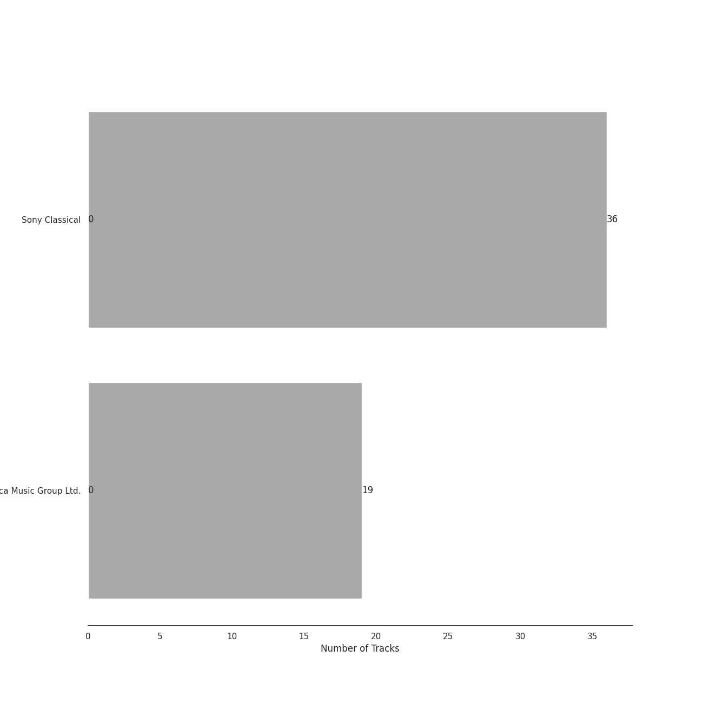

# Bach

[55 songs](bach_tracks.md)

## Top Artists

See all 4 artists

|   Number of Tracks | Art                                                                                              | Artist                                                               | 🔗                                                           |
|-------------------:|:-------------------------------------------------------------------------------------------------|:---------------------------------------------------------------------|:------------------------------------------------------------|
|                 55 |  | [Johann Sebastian Bach](../artists/johann_sebastian_bach.md)         | [🔗](https://open.spotify.com/artist/5aIqB5nVVvmFsvSdExz408) |
|                 36 |  | [Yo-Yo Ma](../artists/yo_yo_ma.md)                                   | [🔗](https://open.spotify.com/artist/5Dl3HXZjG6ZOWT5cV375lk) |
|                 19 |  | [Benjamin Britten](../artists/benjamin_britten.md)                   | [🔗](https://open.spotify.com/artist/7MJ1pB5d6Vjmzep2zQlorn) |
|                 19 |  | [English Chamber Orchestra](../artists/english_chamber_orchestra.md) | [🔗](https://open.spotify.com/artist/2DO4p3CPDnInsJfg0jFfaF) |

## Top Albums

See all 2 albums

|   Number of Tracks | Art                                                                                              | Album                                         | 🔗                                                          |
|-------------------:|:-------------------------------------------------------------------------------------------------|:----------------------------------------------|:-----------------------------------------------------------|
|                 36 |  | Bach: Unaccompanied Cello Suites (Remastered) | [🔗](https://open.spotify.com/album/2OpnKgmVYPEN2GldgBponI) |
|                 19 |  | Bach, J.S.: Brandenburg Concertos etc.        | [🔗](https://open.spotify.com/album/11FzhwtOFCPB4vpgWo33xV) |

## Top Record Labels

See all 2 labels

|   Number of Tracks | Label                                                         |
|-------------------:|:--------------------------------------------------------------|
|                 36 | [Sony Classical](../labels/sony_classical.md)                 |
|                 19 | [Decca Music Group Ltd.](../labels/decca_music_group_ltd_.md) |

