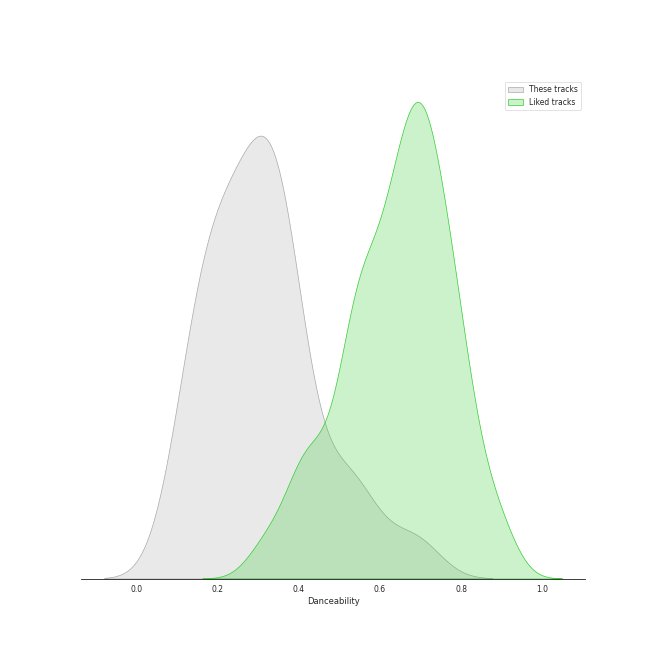
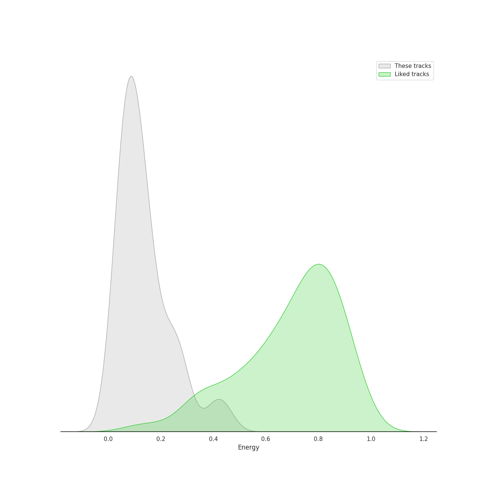
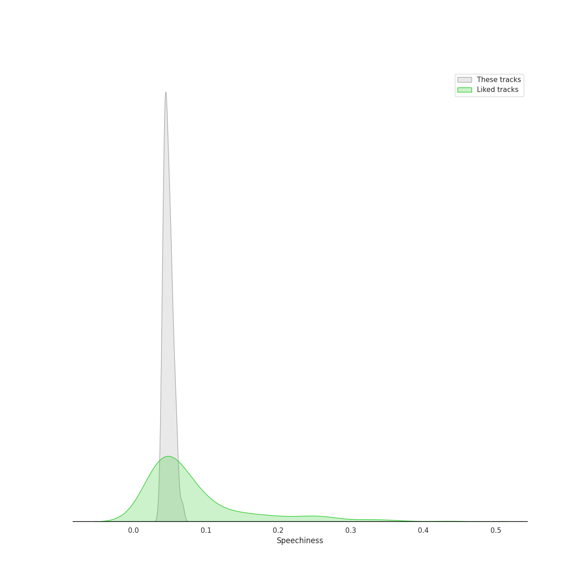
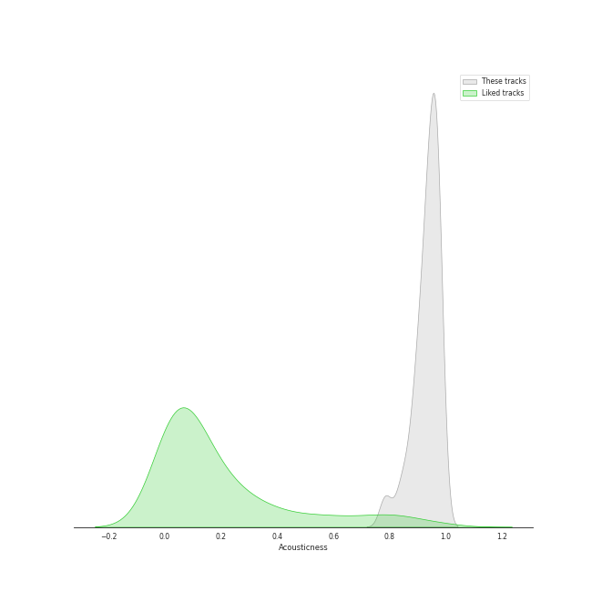
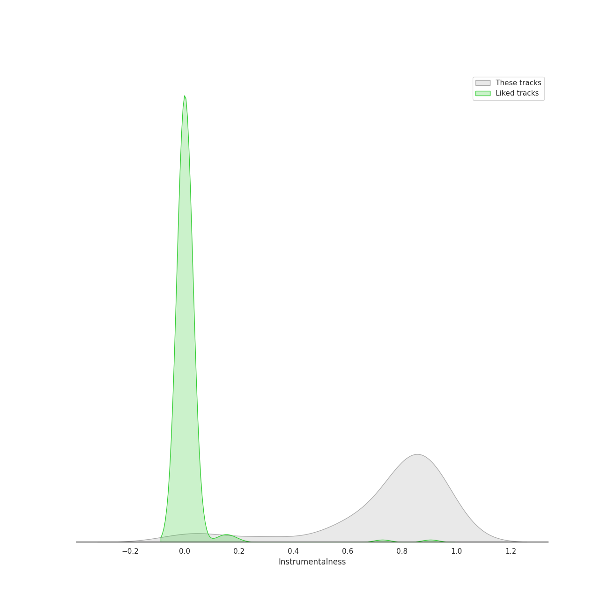
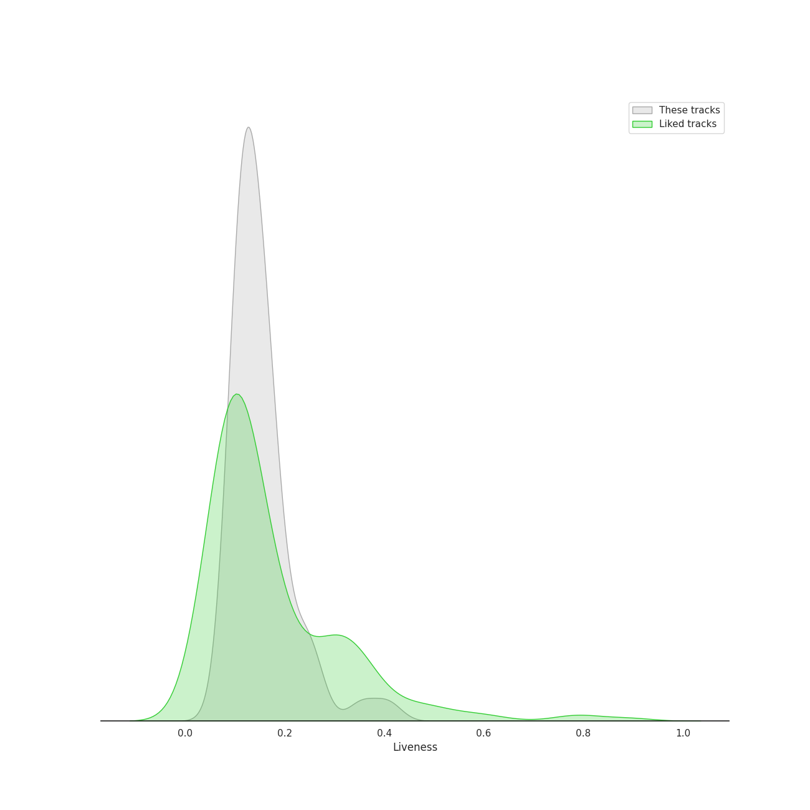
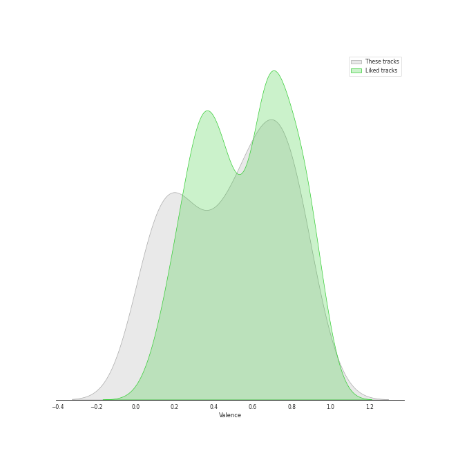
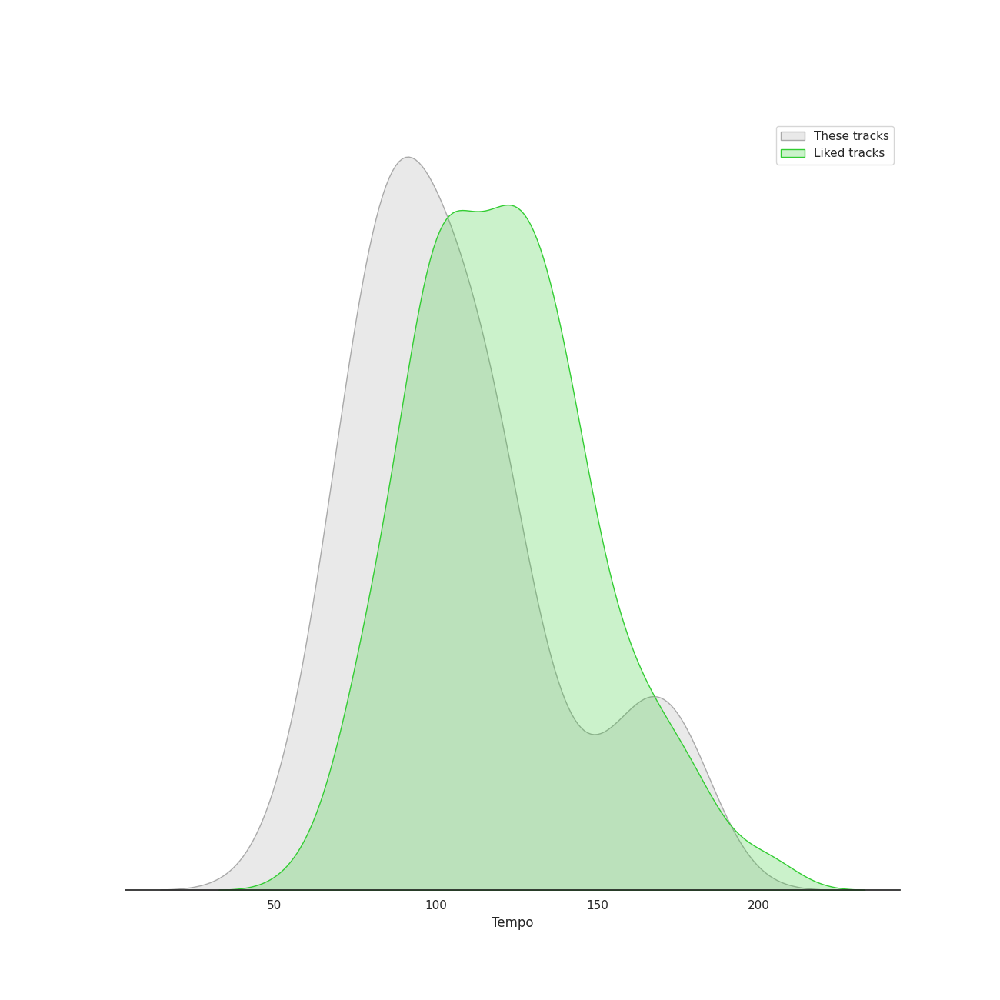

# Audio Features for Bach

## Danceability

| 10 most Danceable tracks | 10 least Danceable tracks |
|:---|:---|
| Brandenburg Concerto No. 2 in F, BWV 1047: 3. Allegro assai (0.691) | Cello Suite No. 5 in C Minor, BWV 1011: IV. Sarabande (0.0874) |
| Brandenburg Concerto No. 2 in F, BWV 1047: 1. (Allegro) (0.687) | Cello Suite No. 2 in D Minor, BWV 1008: IV. Sarabande (0.098) |
| Brandenburg Concerto No. 3 in G, BWV 1048: 3. Allegro (0.594) | Cello Suite No. 5 in C Minor, BWV 1011: II. Allemande (0.103) |
| Brandenburg Concerto No. 1 in F, BWV 1046: 5. Polacca; Trio II (0.534) | Cello Suite No. 1 in G Major, BWV 1007: IV. Sarabande (0.113) |
| Brandenburg Concerto No. 6 in B flat, BWV 1051: 3. Allegro (0.528) | Brandenburg Concerto No. 6 in B flat, BWV 1051: 2. Adagio ma non tanto (0.115) |
| Brandenburg Concerto No. 3 in G, BWV 1048: 1. (Allegro) (0.526) | Cello Suite No. 3 in C Major, BWV 1009: IV. Sarabande (0.12) |
| Brandenburg Concerto No. 4 in G, BWV 1049: 3. Presto (0.52) | Cello Suite No. 4 in E-Flat Major, BWV 1010: IV. Sarabande (0.125) |
| Brandenburg Concerto No. 5 in D, BWV 1050: 3. Allegro (0.469) | Cello Suite No. 6 in D Major, BWV 1012: II. Allemande (0.141) |
| Cello Suite No. 6 in D Major, BWV 1012: V. Gavottes I & II (0.434) | Cello Suite No. 6 in D Major, BWV 1012: IV. Sarabande (0.142) |
| Cello Suite No. 1 in G Major, BWV 1007: III. Courante (0.433) | Brandenburg Concerto No. 2 in F, BWV 1047: 2. Andante (0.146) |

## Energy

| 10 most Energetic tracks | 10 least Energetic tracks |
|:---|:---|
| Brandenburg Concerto No. 2 in F, BWV 1047: 3. Allegro assai (0.441) | Cello Suite No. 5 in C Minor, BWV 1011: IV. Sarabande (0.0169) |
| Brandenburg Concerto No. 3 in G, BWV 1048: 3. Allegro (0.426) | Cello Suite No. 1 in G Major, BWV 1007: IV. Sarabande (0.0283) |
| Brandenburg Concerto No. 2 in F, BWV 1047: 1. (Allegro) (0.398) | Cello Suite No. 3 in C Major, BWV 1009: IV. Sarabande (0.0336) |
| Brandenburg Concerto No. 4 in G, BWV 1049: 3. Presto (0.286) | Cello Suite No. 4 in E-Flat Major, BWV 1010: V. Bourrées I & II (0.0428) |
| Brandenburg Concerto No. 1 in F, BWV 1046: 3. Allegro (0.284) | Cello Suite No. 5 in C Minor, BWV 1011: II. Allemande (0.0447) |
| Brandenburg Concerto No. 1 in F, BWV 1046: 1. (Allegro) (0.275) | Cello Suite No. 2 in D Minor, BWV 1008: I. Prélude (0.0452) |
| Brandenburg Concerto No. 3 in G, BWV 1048: 1. (Allegro) (0.26) | Cello Suite No. 6 in D Major, BWV 1012: II. Allemande (0.0516) |
| Brandenburg Concerto No. 4 in G, BWV 1049: 1. Allegro (0.252) | Cello Suite No. 4 in E-Flat Major, BWV 1010: II. Allemande (0.0528) |
| Brandenburg Concerto No. 5 in D, BWV 1050: 1. Allegro (0.243) | Cello Suite No. 3 in C Major, BWV 1009: V. Bourrées I & II (0.0565) |
| Cello Suite No. 2 in D Minor, BWV 1008: III. Courante (0.243) | Cello Suite No. 6 in D Major, BWV 1012: IV. Sarabande (0.0603) |

## Speechiness

| 10 most Speechy tracks | 10 least Speechy tracks |
|:---|:---|
| Cello Suite No. 1 in G Major, BWV 1007: II. Allemande (0.0672) | Brandenburg Concerto No. 4 in G, BWV 1049: 3. Presto (0.038) |
| Cello Suite No. 6 in D Major, BWV 1012: I. Prélude (0.0604) | Cello Suite No. 1 in G Major, BWV 1007: III. Courante (0.0381) |
| Cello Suite No. 1 in G Major, BWV 1007: I. Prélude (0.0597) | Brandenburg Concerto No. 1 in F, BWV 1046: 2. Adagio (0.04) |
| Brandenburg Concerto No. 5 in D, BWV 1050: 3. Allegro (0.0596) | Brandenburg Concerto No. 6 in B flat, BWV 1051: 3. Allegro (0.0405) |
| Brandenburg Concerto No. 3 in G, BWV 1048: 1. (Allegro) (0.0572) | Cello Suite No. 4 in E-Flat Major, BWV 1010: II. Allemande (0.0407) |
| Brandenburg Concerto No. 2 in F, BWV 1047: 3. Allegro assai (0.0568) | Cello Suite No. 3 in C Major, BWV 1009: II. Allemande (0.0414) |
| Brandenburg Concerto No. 4 in G, BWV 1049: 1. Allegro (0.0566) | Cello Suite No. 5 in C Minor, BWV 1011: III. Courante (0.0415) |
| Cello Suite No. 1 in G Major, BWV 1007: VI. Gigue (0.0555) | Cello Suite No. 3 in C Major, BWV 1009: I. Prélude (0.0416) |
| Brandenburg Concerto No. 2 in F, BWV 1047: 1. (Allegro) (0.0542) | Cello Suite No. 3 in C Major, BWV 1009: VI. Gigue (0.0417) |
| Brandenburg Concerto No. 6 in B flat, BWV 1051: 1. -- (0.0541) | Brandenburg Concerto No. 1 in F, BWV 1046: 5. Polacca; Trio II (0.0418) |

## Acousticness

| 10 most Acoustic tracks | 10 least Acoustic tracks |
|:---|:---|
| Cello Suite No. 6 in D Major, BWV 1012: I. Prélude (0.982) | Brandenburg Concerto No. 1 in F, BWV 1046: 2. Adagio (0.78) |
| Cello Suite No. 6 in D Major, BWV 1012: II. Allemande (0.981) | Brandenburg Concerto No. 6 in B flat, BWV 1051: 2. Adagio ma non tanto (0.788) |
| Cello Suite No. 2 in D Minor, BWV 1008: V. Menuets I & II (0.98) | Brandenburg Concerto No. 5 in D, BWV 1050: 1. Allegro (0.828) |
| Brandenburg Concerto No. 1 in F, BWV 1046: 4. Menuetto: Trio I (0.978) | Brandenburg Concerto No. 5 in D, BWV 1050: 3. Allegro (0.845) |
| Cello Suite No. 6 in D Major, BWV 1012: V. Gavottes I & II (0.978) | Brandenburg Concerto No. 3 in G, BWV 1048: 3. Allegro (0.859) |
| Cello Suite No. 2 in D Minor, BWV 1008: VI. Gigue (0.977) | Brandenburg Concerto No. 2 in F, BWV 1047: 2. Andante (0.86) |
| Brandenburg Concerto No. 5 in D, BWV 1050: 2. Affetuoso (0.976) | Brandenburg Concerto No. 3 in G, BWV 1048: 1. (Allegro) (0.885) |
| Brandenburg Concerto No. 1 in F, BWV 1046: 5. Polacca; Trio II (0.974) | Brandenburg Concerto No. 2 in F, BWV 1047: 1. (Allegro) (0.888) |
| Cello Suite No. 4 in E-Flat Major, BWV 1010: III. Courante (0.974) | Brandenburg Concerto No. 2 in F, BWV 1047: 3. Allegro assai (0.89) |
| Cello Suite No. 6 in D Major, BWV 1012: VI. Gigue (0.973) | Brandenburg Concerto No. 4 in G, BWV 1049: 2. Andante (0.896) |

## Instrumentalness

| 10 most Instrumental tracks | 10 least Instrumental tracks |
|:---|:---|
| Cello Suite No. 2 in D Minor, BWV 1008: I. Prélude (0.934) | Brandenburg Concerto No. 5 in D, BWV 1050: 1. Allegro (0.0047) |
| Cello Suite No. 2 in D Minor, BWV 1008: III. Courante (0.933) | Brandenburg Concerto No. 5 in D, BWV 1050: 3. Allegro (0.0126) |
| Cello Suite No. 2 in D Minor, BWV 1008: II. Allemande (0.928) | Brandenburg Concerto No. 3 in G, BWV 1048: 1. (Allegro) (0.0333) |
| Cello Suite No. 5 in C Minor, BWV 1011: II. Allemande (0.918) | Brandenburg Concerto No. 4 in G, BWV 1049: 1. Allegro (0.116) |
| Cello Suite No. 4 in E-Flat Major, BWV 1010: III. Courante (0.917) | Brandenburg Concerto No. 3 in G, BWV 1048: 3. Allegro (0.295) |
| Cello Suite No. 3 in C Major, BWV 1009: V. Bourrées I & II (0.91) | Brandenburg Concerto No. 4 in G, BWV 1049: 3. Presto (0.321) |
| Cello Suite No. 2 in D Minor, BWV 1008: VI. Gigue (0.908) | Brandenburg Concerto No. 5 in D, BWV 1050: 2. Affetuoso (0.552) |
| Cello Suite No. 5 in C Minor, BWV 1011: VI. Gigue (0.906) | Brandenburg Concerto No. 4 in G, BWV 1049: 2. Andante (0.595) |
| Cello Suite No. 6 in D Major, BWV 1012: III. Courante (0.903) | Cello Suite No. 6 in D Major, BWV 1012: II. Allemande (0.605) |
| Cello Suite No. 1 in G Major, BWV 1007: II. Allemande (0.901) | Brandenburg Concerto No. 1 in F, BWV 1046: 3. Allegro (0.607) |

## Liveness

| 10 most Live tracks | 10 least Live tracks |
|:---|:---|
| Cello Suite No. 6 in D Major, BWV 1012: V. Gavottes I & II (0.407) | Cello Suite No. 1 in G Major, BWV 1007: I. Prélude (0.0762) |
| Brandenburg Concerto No. 4 in G, BWV 1049: 1. Allegro (0.354) | Cello Suite No. 5 in C Minor, BWV 1011: II. Allemande (0.0959) |
| Cello Suite No. 4 in E-Flat Major, BWV 1010: II. Allemande (0.26) | Brandenburg Concerto No. 1 in F, BWV 1046: 2. Adagio (0.1) |
| Cello Suite No. 3 in C Major, BWV 1009: I. Prélude (0.255) | Cello Suite No. 5 in C Minor, BWV 1011: VI. Gigue (0.103) |
| Brandenburg Concerto No. 4 in G, BWV 1049: 3. Presto (0.241) | Cello Suite No. 1 in G Major, BWV 1007: II. Allemande (0.103) |
| Cello Suite No. 1 in G Major, BWV 1007: V. Menuets I & II (0.24) | Cello Suite No. 1 in G Major, BWV 1007: IV. Sarabande (0.103) |
| Cello Suite No. 3 in C Major, BWV 1009: VI. Gigue (0.218) | Cello Suite No. 3 in C Major, BWV 1009: IV. Sarabande (0.106) |
| Cello Suite No. 2 in D Minor, BWV 1008: III. Courante (0.196) | Cello Suite No. 6 in D Major, BWV 1012: IV. Sarabande (0.107) |
| Cello Suite No. 6 in D Major, BWV 1012: VI. Gigue (0.187) | Cello Suite No. 4 in E-Flat Major, BWV 1010: IV. Sarabande (0.107) |
| Brandenburg Concerto No. 1 in F, BWV 1046: 4. Menuetto: Trio I (0.184) | Cello Suite No. 5 in C Minor, BWV 1011: I. Prélude (0.107) |

## Valence

| 10 most Happy tracks | 10 least Happy tracks |
|:---|:---|
| Brandenburg Concerto No. 2 in F, BWV 1047: 3. Allegro assai (0.931) | Brandenburg Concerto No. 1 in F, BWV 1046: 2. Adagio (0.0385) |
| Cello Suite No. 3 in C Major, BWV 1009: III. Courante (0.871) | Cello Suite No. 2 in D Minor, BWV 1008: IV. Sarabande (0.0495) |
| Cello Suite No. 4 in E-Flat Major, BWV 1010: VI. Gigue (0.869) | Cello Suite No. 5 in C Minor, BWV 1011: IV. Sarabande (0.05) |
| Cello Suite No. 2 in D Minor, BWV 1008: III. Courante (0.852) | Brandenburg Concerto No. 4 in G, BWV 1049: 2. Andante (0.0753) |
| Cello Suite No. 6 in D Major, BWV 1012: V. Gavottes I & II (0.82) | Cello Suite No. 4 in E-Flat Major, BWV 1010: IV. Sarabande (0.0836) |
| Brandenburg Concerto No. 3 in G, BWV 1048: 3. Allegro (0.809) | Cello Suite No. 6 in D Major, BWV 1012: IV. Sarabande (0.107) |
| Brandenburg Concerto No. 2 in F, BWV 1047: 1. (Allegro) (0.79) | Brandenburg Concerto No. 6 in B flat, BWV 1051: 2. Adagio ma non tanto (0.111) |
| Brandenburg Concerto No. 1 in F, BWV 1046: 3. Allegro (0.786) | Cello Suite No. 3 in C Major, BWV 1009: IV. Sarabande (0.135) |
| Cello Suite No. 6 in D Major, BWV 1012: III. Courante (0.76) | Brandenburg Concerto No. 2 in F, BWV 1047: 2. Andante (0.148) |
| Cello Suite No. 2 in D Minor, BWV 1008: VI. Gigue (0.759) | Brandenburg Concerto No. 1 in F, BWV 1046: 4. Menuetto: Trio I (0.176) |

## Tempo

| 10 most Fast tracks | 10 least Fast tracks |
|:---|:---|
| Brandenburg Concerto No. 2 in F, BWV 1047: 2. Andante (177.194) | Cello Suite No. 3 in C Major, BWV 1009: II. Allemande (56.213) |
| Brandenburg Concerto No. 4 in G, BWV 1049: 1. Allegro (175.012) | Cello Suite No. 2 in D Minor, BWV 1008: V. Menuets I & II (66.628) |
| Brandenburg Concerto No. 1 in F, BWV 1046: 3. Allegro (172.615) | Brandenburg Concerto No. 5 in D, BWV 1050: 2. Affetuoso (68.517) |
| Cello Suite No. 5 in C Minor, BWV 1011: II. Allemande (171.555) | Brandenburg Concerto No. 1 in F, BWV 1046: 4. Menuetto: Trio I (69.143) |
| Cello Suite No. 1 in G Major, BWV 1007: II. Allemande (168.37) | Cello Suite No. 6 in D Major, BWV 1012: VI. Gigue (70.596) |
| Cello Suite No. 1 in G Major, BWV 1007: IV. Sarabande (163.78) | Cello Suite No. 5 in C Minor, BWV 1011: V. Gavottes I & II (74.812) |
| Brandenburg Concerto No. 1 in F, BWV 1046: 1. (Allegro) (159.382) | Cello Suite No. 1 in G Major, BWV 1007: I. Prélude (75.02) |
| Brandenburg Concerto No. 6 in B flat, BWV 1051: 1. -- (150.83) | Cello Suite No. 2 in D Minor, BWV 1008: VI. Gigue (76.557) |
| Cello Suite No. 4 in E-Flat Major, BWV 1010: V. Bourrées I & II (138.02) | Cello Suite No. 6 in D Major, BWV 1012: V. Gavottes I & II (79.847) |
| Cello Suite No. 1 in G Major, BWV 1007: V. Menuets I & II (127.781) | Cello Suite No. 2 in D Minor, BWV 1008: II. Allemande (80.493) |
