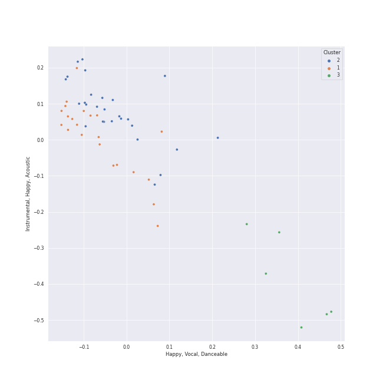

# Clusters in Bach

## Cluster #1

22 tracks

| Art | Track | Album | Artists | Label | Rank | 💚 | 🔗 |
|:---|:---|:---|:---|:---|---:|:---|:---|
|  | Brandenburg Concerto No. 6 in B flat, BWV 1051: 2. Adagio ma non tanto | Bach, J.S.: Brandenburg Concertos etc. | [Johann Sebastian Bach](../../../../artists/johann_sebastian_bach/overview.md), English Chamber Orchestra, Benjamin Britten | [Decca Music Group Ltd.](../../../../labels/decca_music_group_ltd_) | 966 | | [🔗](https://open.spotify.com/track/3rgXIZHbW1RW2dqno4QaCv) |
|  | Brandenburg Concerto No. 2 in F, BWV 1047: 2. Andante | Bach, J.S.: Brandenburg Concertos etc. | [Johann Sebastian Bach](../../../../artists/johann_sebastian_bach/overview.md), English Chamber Orchestra, Benjamin Britten | [Decca Music Group Ltd.](../../../../labels/decca_music_group_ltd_) | 966 | | [🔗](https://open.spotify.com/track/4MY5iDvlsITcO9Y3hieoJU) |
|  | Brandenburg Concerto No. 1 in F, BWV 1046: 4. Menuetto: Trio I | Bach, J.S.: Brandenburg Concertos etc. | [Johann Sebastian Bach](../../../../artists/johann_sebastian_bach/overview.md), English Chamber Orchestra, Benjamin Britten | [Decca Music Group Ltd.](../../../../labels/decca_music_group_ltd_) | 966 | | [🔗](https://open.spotify.com/track/7C3TyMdnQFiMjCoXclqEMC) |
|  | Cello Suite No. 6 in D Major, BWV 1012: IV. Sarabande | Bach: Unaccompanied Cello Suites (Remastered) | [Johann Sebastian Bach](../../../../artists/johann_sebastian_bach/overview.md), Yo-Yo Ma | [Sony Classical](../../../../labels/sony_classical) | 966 | | [🔗](https://open.spotify.com/track/1X0ZNb4aZVPZhBrgWwJBJE) |
|  | Cello Suite No. 5 in C Minor, BWV 1011: II. Allemande | Bach: Unaccompanied Cello Suites (Remastered) | [Johann Sebastian Bach](../../../../artists/johann_sebastian_bach/overview.md), Yo-Yo Ma | [Sony Classical](../../../../labels/sony_classical) | 966 | | [🔗](https://open.spotify.com/track/4hB1M0RTIlrbC1DwA6XJ9Q) |
|  | Cello Suite No. 2 in D Minor, BWV 1008: I. Prélude | Bach: Unaccompanied Cello Suites (Remastered) | [Johann Sebastian Bach](../../../../artists/johann_sebastian_bach/overview.md), Yo-Yo Ma | [Sony Classical](../../../../labels/sony_classical) | 966 | | [🔗](https://open.spotify.com/track/5BSTDnS8drJLOwpL4Co4K2) |
|  | Cello Suite No. 3 in C Major, BWV 1009: IV. Sarabande | Bach: Unaccompanied Cello Suites (Remastered) | [Johann Sebastian Bach](../../../../artists/johann_sebastian_bach/overview.md), Yo-Yo Ma | [Sony Classical](../../../../labels/sony_classical) | 966 | | [🔗](https://open.spotify.com/track/5MvmCcMhBScIqli00VTblQ) |
|  | Cello Suite No. 1 in G Major, BWV 1007: I. Prélude | Bach: Unaccompanied Cello Suites (Remastered) | [Johann Sebastian Bach](../../../../artists/johann_sebastian_bach/overview.md), Yo-Yo Ma | [Sony Classical](../../../../labels/sony_classical) | 966 | | [🔗](https://open.spotify.com/track/61dYvvfIRtIDFuqZypPAta) |
|  | Cello Suite No. 5 in C Minor, BWV 1011: I. Prélude | Bach: Unaccompanied Cello Suites (Remastered) | [Johann Sebastian Bach](../../../../artists/johann_sebastian_bach/overview.md), Yo-Yo Ma | [Sony Classical](../../../../labels/sony_classical) | 966 | | [🔗](https://open.spotify.com/track/7ekIYM7PEFS47LwMes5Y5g) |
|  | Cello Suite No. 1 in G Major, BWV 1007: IV. Sarabande | Bach: Unaccompanied Cello Suites (Remastered) | [Johann Sebastian Bach](../../../../artists/johann_sebastian_bach/overview.md), Yo-Yo Ma | [Sony Classical](../../../../labels/sony_classical) | 966 | | [🔗](https://open.spotify.com/track/7jOJwH4kze92qMREpVI4cr) |
## Cluster #2

27 tracks

| Art | Track | Album | Artists | Label | Rank | 💚 | 🔗 |
|:---|:---|:---|:---|:---|---:|:---|:---|
|  | Brandenburg Concerto No. 1 in F, BWV 1046: 1. (Allegro) | Bach, J.S.: Brandenburg Concertos etc. | [Johann Sebastian Bach](../../../../artists/johann_sebastian_bach/overview.md), English Chamber Orchestra, Benjamin Britten | [Decca Music Group Ltd.](../../../../labels/decca_music_group_ltd_) | 966 | | [🔗](https://open.spotify.com/track/0df320Pc1ZK0050luSGVHt) |
|  | Cello Suite No. 6 in D Major, BWV 1012: VI. Gigue | Bach: Unaccompanied Cello Suites (Remastered) | [Johann Sebastian Bach](../../../../artists/johann_sebastian_bach/overview.md), Yo-Yo Ma | [Sony Classical](../../../../labels/sony_classical) | 966 | | [🔗](https://open.spotify.com/track/0w9xYEvm1nd4S9v04zftup) |
|  | Cello Suite No. 6 in D Major, BWV 1012: III. Courante | Bach: Unaccompanied Cello Suites (Remastered) | [Johann Sebastian Bach](../../../../artists/johann_sebastian_bach/overview.md), Yo-Yo Ma | [Sony Classical](../../../../labels/sony_classical) | 966 | | [🔗](https://open.spotify.com/track/1QSNIfsTBWNmQ2pplTD3xF) |
|  | Cello Suite No. 4 in E-Flat Major, BWV 1010: II. Allemande | Bach: Unaccompanied Cello Suites (Remastered) | [Johann Sebastian Bach](../../../../artists/johann_sebastian_bach/overview.md), Yo-Yo Ma | [Sony Classical](../../../../labels/sony_classical) | 966 | | [🔗](https://open.spotify.com/track/3oPPgAxqczl1Hx0rBhtTDH) |
|  | Cello Suite No. 5 in C Minor, BWV 1011: V. Gavottes I & II | Bach: Unaccompanied Cello Suites (Remastered) | [Johann Sebastian Bach](../../../../artists/johann_sebastian_bach/overview.md), Yo-Yo Ma | [Sony Classical](../../../../labels/sony_classical) | 966 | | [🔗](https://open.spotify.com/track/45wXZS6elH1pyW5jMkYPrp) |
|  | Cello Suite No. 2 in D Minor, BWV 1008: VI. Gigue | Bach: Unaccompanied Cello Suites (Remastered) | [Johann Sebastian Bach](../../../../artists/johann_sebastian_bach/overview.md), Yo-Yo Ma | [Sony Classical](../../../../labels/sony_classical) | 966 | | [🔗](https://open.spotify.com/track/5A00HKycJpzTqjo8f9RzkR) |
|  | Cello Suite No. 2 in D Minor, BWV 1008: II. Allemande | Bach: Unaccompanied Cello Suites (Remastered) | [Johann Sebastian Bach](../../../../artists/johann_sebastian_bach/overview.md), Yo-Yo Ma | [Sony Classical](../../../../labels/sony_classical) | 966 | | [🔗](https://open.spotify.com/track/5zlzCvtuUTEDWOTdqWlizb) |
|  | Cello Suite No. 1 in G Major, BWV 1007: III. Courante | Bach: Unaccompanied Cello Suites (Remastered) | [Johann Sebastian Bach](../../../../artists/johann_sebastian_bach/overview.md), Yo-Yo Ma | [Sony Classical](../../../../labels/sony_classical) | 966 | | [🔗](https://open.spotify.com/track/70rlzUf9y1skkI3agyvbjg) |
|  | Cello Suite No. 1 in G Major, BWV 1007: VI. Gigue | Bach: Unaccompanied Cello Suites (Remastered) | [Johann Sebastian Bach](../../../../artists/johann_sebastian_bach/overview.md), Yo-Yo Ma | [Sony Classical](../../../../labels/sony_classical) | 966 | | [🔗](https://open.spotify.com/track/7BWwT75IPTKbHbxn4P6Bwm) |
|  | Cello Suite No. 5 in C Minor, BWV 1011: III. Courante | Bach: Unaccompanied Cello Suites (Remastered) | [Johann Sebastian Bach](../../../../artists/johann_sebastian_bach/overview.md), Yo-Yo Ma | [Sony Classical](../../../../labels/sony_classical) | 966 | | [🔗](https://open.spotify.com/track/7HMiAI8QmUWgm5gCWFNH9O) |
## Cluster #3

6 tracks

| Art | Track | Album | Artists | Label | Rank | 💚 | 🔗 |
|:---|:---|:---|:---|:---|---:|:---|:---|
|  | Brandenburg Concerto No. 3 in G, BWV 1048: 3. Allegro | Bach, J.S.: Brandenburg Concertos etc. | [Johann Sebastian Bach](../../../../artists/johann_sebastian_bach/overview.md), English Chamber Orchestra, Benjamin Britten | [Decca Music Group Ltd.](../../../../labels/decca_music_group_ltd_) | 966 | | [🔗](https://open.spotify.com/track/4HuoLeflqbsdeBUDvoD6An) |
|  | Brandenburg Concerto No. 3 in G, BWV 1048: 1. (Allegro) | Bach, J.S.: Brandenburg Concertos etc. | [Johann Sebastian Bach](../../../../artists/johann_sebastian_bach/overview.md), English Chamber Orchestra, Benjamin Britten | [Decca Music Group Ltd.](../../../../labels/decca_music_group_ltd_) | 966 | | [🔗](https://open.spotify.com/track/51bqd4W15PIW7nBzvMCuuf) |
|  | Brandenburg Concerto No. 5 in D, BWV 1050: 3. Allegro | Bach, J.S.: Brandenburg Concertos etc. | [Johann Sebastian Bach](../../../../artists/johann_sebastian_bach/overview.md), English Chamber Orchestra, Benjamin Britten | [Decca Music Group Ltd.](../../../../labels/decca_music_group_ltd_) | 966 | | [🔗](https://open.spotify.com/track/5hoRPHTX8zSHCyPIGejvZj) |
|  | Brandenburg Concerto No. 4 in G, BWV 1049: 3. Presto | Bach, J.S.: Brandenburg Concertos etc. | [Johann Sebastian Bach](../../../../artists/johann_sebastian_bach/overview.md), English Chamber Orchestra, Benjamin Britten | [Decca Music Group Ltd.](../../../../labels/decca_music_group_ltd_) | 966 | | [🔗](https://open.spotify.com/track/6PtzKhvAY9xejeJIrwxZGQ) |
|  | Brandenburg Concerto No. 5 in D, BWV 1050: 1. Allegro | Bach, J.S.: Brandenburg Concertos etc. | [Johann Sebastian Bach](../../../../artists/johann_sebastian_bach/overview.md), English Chamber Orchestra, Benjamin Britten | [Decca Music Group Ltd.](../../../../labels/decca_music_group_ltd_) | 966 | | [🔗](https://open.spotify.com/track/7ImuASnzYk9YHn3isFjZ0j) |
|  | Brandenburg Concerto No. 4 in G, BWV 1049: 1. Allegro | Bach, J.S.: Brandenburg Concertos etc. | [Johann Sebastian Bach](../../../../artists/johann_sebastian_bach/overview.md), English Chamber Orchestra, Benjamin Britten | [Decca Music Group Ltd.](../../../../labels/decca_music_group_ltd_) | 966 | | [🔗](https://open.spotify.com/track/7LxP1l4ddjhoVKqgSeRwZY) |