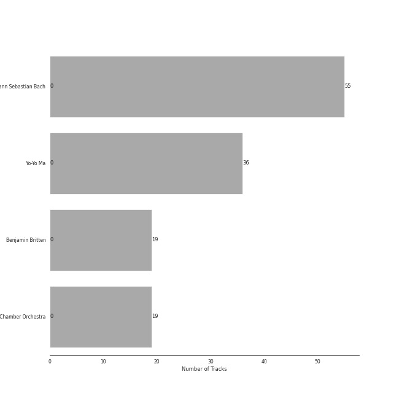
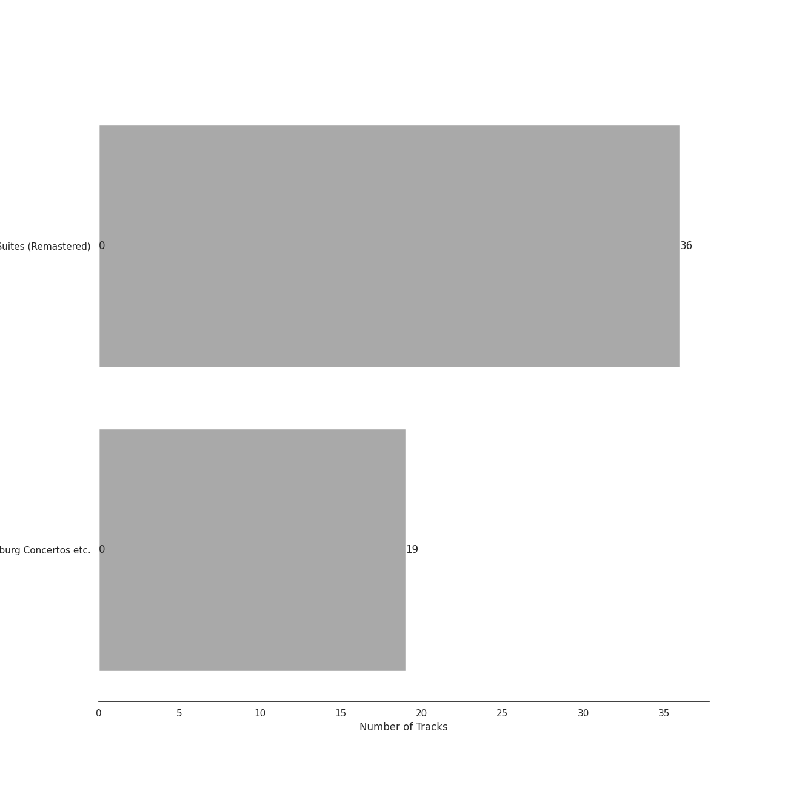
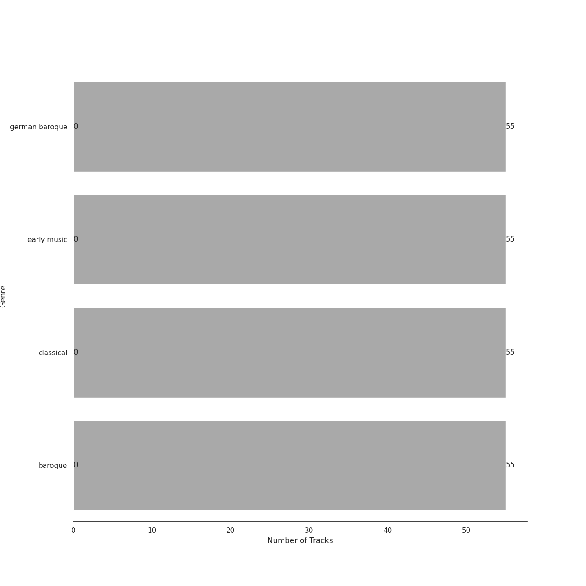

# Bach

[55 songs](tracks.md)

## Top Artists

See all 4 artists

|   Number of Tracks | Art                                                                                              | Artist                                                                  | 🔗                                                           |
|-------------------:|:-------------------------------------------------------------------------------------------------|:------------------------------------------------------------------------|:------------------------------------------------------------|
|                 55 |  | [Johann Sebastian Bach](../../artists/johann_sebastian_bach.md)         | [🔗](https://open.spotify.com/artist/5aIqB5nVVvmFsvSdExz408) |
|                 36 |  | [Yo-Yo Ma](../../artists/yo_yo_ma.md)                                   | [🔗](https://open.spotify.com/artist/5Dl3HXZjG6ZOWT5cV375lk) |
|                 19 |  | [Benjamin Britten](../../artists/benjamin_britten.md)                   | [🔗](https://open.spotify.com/artist/7MJ1pB5d6Vjmzep2zQlorn) |
|                 19 |  | [English Chamber Orchestra](../../artists/english_chamber_orchestra.md) | [🔗](https://open.spotify.com/artist/2DO4p3CPDnInsJfg0jFfaF) |

## Top Albums

See all 2 albums

|   Number of Tracks | Art                                                                                              | Album                                         | Release Date   | 🔗                                                          |
|-------------------:|:-------------------------------------------------------------------------------------------------|:----------------------------------------------|:---------------|:-----------------------------------------------------------|
|                 36 |  | Bach: Unaccompanied Cello Suites (Remastered) | 1983           | [🔗](https://open.spotify.com/album/2OpnKgmVYPEN2GldgBponI) |
|                 19 |  | Bach, J.S.: Brandenburg Concertos etc.        | 1995-01-01     | [🔗](https://open.spotify.com/album/11FzhwtOFCPB4vpgWo33xV) |

## Top Record Labels

See all 2 labels

|   Number of Tracks | Label                                                            |
|-------------------:|:-----------------------------------------------------------------|
|                 36 | [Sony Classical](../../labels/sony_classical.md)                 |
|                 19 | [Decca Music Group Ltd.](../../labels/decca_music_group_ltd_.md) |

## Genres

See all 4 genres

|   Number of Tracks | Genre                                            |
|-------------------:|:-------------------------------------------------|
|                 55 | [german baroque](../../genres/german_baroque.md) |
|                 55 | [early music](../../genres/early_music.md)       |
|                 55 | [classical](../../genres/classical.md)           |
|                 55 | [baroque](../../genres/baroque.md)               |

## Years

| Year            |   Number of Tracks |
|:----------------|-------------------:|
| [1983](1983.md) |                 36 |

| 5 newest albums                                                                                                                                                                                                                                                                                 | 5 oldest albums                                                                                                                                                                                                                                                                                 |
|:------------------------------------------------------------------------------------------------------------------------------------------------------------------------------------------------------------------------------------------------------------------------------------------------|:------------------------------------------------------------------------------------------------------------------------------------------------------------------------------------------------------------------------------------------------------------------------------------------------|
| 
 Bach, J.S.: Brandenburg Concertos etc. (1995-01-01)
         | 
 Bach: Unaccompanied Cello Suites (Remastered) (1983)
 |
| 
 Bach: Unaccompanied Cello Suites (Remastered) (1983)
 | 
 Bach, J.S.: Brandenburg Concertos etc. (1995-01-01)
         |
## Audio Features

| 10 most Danceable tracks                                       | 10 least Danceable tracks                                              |
|:---------------------------------------------------------------|:-----------------------------------------------------------------------|
| Brandenburg Concerto No. 2 in F, BWV 1047: 3. Allegro assai    | Cello Suite No. 5 in C Minor, BWV 1011: IV. Sarabande                  |
| Brandenburg Concerto No. 2 in F, BWV 1047: 1. (Allegro)        | Cello Suite No. 2 in D Minor, BWV 1008: IV. Sarabande                  |
| Brandenburg Concerto No. 3 in G, BWV 1048: 3. Allegro          | Cello Suite No. 5 in C Minor, BWV 1011: II. Allemande                  |
| Brandenburg Concerto No. 1 in F, BWV 1046: 5. Polacca; Trio II | Cello Suite No. 1 in G Major, BWV 1007: IV. Sarabande                  |
| Brandenburg Concerto No. 6 in B flat, BWV 1051: 3. Allegro     | Brandenburg Concerto No. 6 in B flat, BWV 1051: 2. Adagio ma non tanto |
| Brandenburg Concerto No. 3 in G, BWV 1048: 1. (Allegro)        | Cello Suite No. 3 in C Major, BWV 1009: IV. Sarabande                  |
| Brandenburg Concerto No. 4 in G, BWV 1049: 3. Presto           | Cello Suite No. 4 in E-Flat Major, BWV 1010: IV. Sarabande             |
| Brandenburg Concerto No. 5 in D, BWV 1050: 3. Allegro          | Cello Suite No. 6 in D Major, BWV 1012: II. Allemande                  |
| Cello Suite No. 6 in D Major, BWV 1012: V. Gavottes I & II     | Cello Suite No. 6 in D Major, BWV 1012: IV. Sarabande                  |
| Cello Suite No. 1 in G Major, BWV 1007: III. Courante          | Brandenburg Concerto No. 2 in F, BWV 1047: 2. Andante                  |

| 10 most Energetic tracks                                    | 10 least Energetic tracks                                       |
|:------------------------------------------------------------|:----------------------------------------------------------------|
| Brandenburg Concerto No. 2 in F, BWV 1047: 3. Allegro assai | Cello Suite No. 5 in C Minor, BWV 1011: IV. Sarabande           |
| Brandenburg Concerto No. 3 in G, BWV 1048: 3. Allegro       | Cello Suite No. 1 in G Major, BWV 1007: IV. Sarabande           |
| Brandenburg Concerto No. 2 in F, BWV 1047: 1. (Allegro)     | Cello Suite No. 3 in C Major, BWV 1009: IV. Sarabande           |
| Brandenburg Concerto No. 4 in G, BWV 1049: 3. Presto        | Cello Suite No. 4 in E-Flat Major, BWV 1010: V. Bourrées I & II |
| Brandenburg Concerto No. 1 in F, BWV 1046: 3. Allegro       | Cello Suite No. 5 in C Minor, BWV 1011: II. Allemande           |
| Brandenburg Concerto No. 1 in F, BWV 1046: 1. (Allegro)     | Cello Suite No. 2 in D Minor, BWV 1008: I. Prélude              |
| Brandenburg Concerto No. 3 in G, BWV 1048: 1. (Allegro)     | Cello Suite No. 6 in D Major, BWV 1012: II. Allemande           |
| Brandenburg Concerto No. 4 in G, BWV 1049: 1. Allegro       | Cello Suite No. 4 in E-Flat Major, BWV 1010: II. Allemande      |
| Brandenburg Concerto No. 5 in D, BWV 1050: 1. Allegro       | Cello Suite No. 3 in C Major, BWV 1009: V. Bourrées I & II      |
| Cello Suite No. 2 in D Minor, BWV 1008: III. Courante       | Cello Suite No. 6 in D Major, BWV 1012: IV. Sarabande           |

| 10 most Speechy tracks                                      | 10 least Speechy tracks                                        |
|:------------------------------------------------------------|:---------------------------------------------------------------|
| Cello Suite No. 1 in G Major, BWV 1007: II. Allemande       | Brandenburg Concerto No. 4 in G, BWV 1049: 3. Presto           |
| Cello Suite No. 6 in D Major, BWV 1012: I. Prélude          | Cello Suite No. 1 in G Major, BWV 1007: III. Courante          |
| Cello Suite No. 1 in G Major, BWV 1007: I. Prélude          | Brandenburg Concerto No. 1 in F, BWV 1046: 2. Adagio           |
| Brandenburg Concerto No. 5 in D, BWV 1050: 3. Allegro       | Brandenburg Concerto No. 6 in B flat, BWV 1051: 3. Allegro     |
| Brandenburg Concerto No. 3 in G, BWV 1048: 1. (Allegro)     | Cello Suite No. 4 in E-Flat Major, BWV 1010: II. Allemande     |
| Brandenburg Concerto No. 2 in F, BWV 1047: 3. Allegro assai | Cello Suite No. 3 in C Major, BWV 1009: II. Allemande          |
| Brandenburg Concerto No. 4 in G, BWV 1049: 1. Allegro       | Cello Suite No. 5 in C Minor, BWV 1011: III. Courante          |
| Cello Suite No. 1 in G Major, BWV 1007: VI. Gigue           | Cello Suite No. 3 in C Major, BWV 1009: I. Prélude             |
| Brandenburg Concerto No. 2 in F, BWV 1047: 1. (Allegro)     | Cello Suite No. 3 in C Major, BWV 1009: VI. Gigue              |
| Brandenburg Concerto No. 6 in B flat, BWV 1051: 1. --       | Brandenburg Concerto No. 1 in F, BWV 1046: 5. Polacca; Trio II |

| 10 most Acoustic tracks                                        | 10 least Acoustic tracks                                               |
|:---------------------------------------------------------------|:-----------------------------------------------------------------------|
| Cello Suite No. 6 in D Major, BWV 1012: I. Prélude             | Brandenburg Concerto No. 1 in F, BWV 1046: 2. Adagio                   |
| Cello Suite No. 6 in D Major, BWV 1012: II. Allemande          | Brandenburg Concerto No. 6 in B flat, BWV 1051: 2. Adagio ma non tanto |
| Cello Suite No. 2 in D Minor, BWV 1008: V. Menuets I & II      | Brandenburg Concerto No. 5 in D, BWV 1050: 1. Allegro                  |
| Brandenburg Concerto No. 1 in F, BWV 1046: 4. Menuetto: Trio I | Brandenburg Concerto No. 5 in D, BWV 1050: 3. Allegro                  |
| Cello Suite No. 6 in D Major, BWV 1012: V. Gavottes I & II     | Brandenburg Concerto No. 3 in G, BWV 1048: 3. Allegro                  |
| Cello Suite No. 2 in D Minor, BWV 1008: VI. Gigue              | Brandenburg Concerto No. 2 in F, BWV 1047: 2. Andante                  |
| Brandenburg Concerto No. 5 in D, BWV 1050: 2. Affetuoso        | Brandenburg Concerto No. 3 in G, BWV 1048: 1. (Allegro)                |
| Cello Suite No. 4 in E-Flat Major, BWV 1010: III. Courante     | Brandenburg Concerto No. 2 in F, BWV 1047: 1. (Allegro)                |
| Brandenburg Concerto No. 1 in F, BWV 1046: 5. Polacca; Trio II | Brandenburg Concerto No. 2 in F, BWV 1047: 3. Allegro assai            |
| Cello Suite No. 6 in D Major, BWV 1012: VI. Gigue              | Brandenburg Concerto No. 4 in G, BWV 1049: 2. Andante                  |

| 10 most Instrumental tracks                                | 10 least Instrumental tracks                            |
|:-----------------------------------------------------------|:--------------------------------------------------------|
| Cello Suite No. 2 in D Minor, BWV 1008: I. Prélude         | Brandenburg Concerto No. 5 in D, BWV 1050: 1. Allegro   |
| Cello Suite No. 2 in D Minor, BWV 1008: III. Courante      | Brandenburg Concerto No. 5 in D, BWV 1050: 3. Allegro   |
| Cello Suite No. 2 in D Minor, BWV 1008: II. Allemande      | Brandenburg Concerto No. 3 in G, BWV 1048: 1. (Allegro) |
| Cello Suite No. 5 in C Minor, BWV 1011: II. Allemande      | Brandenburg Concerto No. 4 in G, BWV 1049: 1. Allegro   |
| Cello Suite No. 4 in E-Flat Major, BWV 1010: III. Courante | Brandenburg Concerto No. 3 in G, BWV 1048: 3. Allegro   |
| Cello Suite No. 3 in C Major, BWV 1009: V. Bourrées I & II | Brandenburg Concerto No. 4 in G, BWV 1049: 3. Presto    |
| Cello Suite No. 2 in D Minor, BWV 1008: VI. Gigue          | Brandenburg Concerto No. 5 in D, BWV 1050: 2. Affetuoso |
| Cello Suite No. 5 in C Minor, BWV 1011: VI. Gigue          | Brandenburg Concerto No. 4 in G, BWV 1049: 2. Andante   |
| Cello Suite No. 6 in D Major, BWV 1012: III. Courante      | Cello Suite No. 6 in D Major, BWV 1012: II. Allemande   |
| Cello Suite No. 1 in G Major, BWV 1007: II. Allemande      | Brandenburg Concerto No. 1 in F, BWV 1046: 3. Allegro   |

| 10 most Live tracks                                            | 10 least Live tracks                                       |
|:---------------------------------------------------------------|:-----------------------------------------------------------|
| Cello Suite No. 6 in D Major, BWV 1012: V. Gavottes I & II     | Cello Suite No. 1 in G Major, BWV 1007: I. Prélude         |
| Brandenburg Concerto No. 4 in G, BWV 1049: 1. Allegro          | Cello Suite No. 5 in C Minor, BWV 1011: II. Allemande      |
| Cello Suite No. 4 in E-Flat Major, BWV 1010: II. Allemande     | Brandenburg Concerto No. 1 in F, BWV 1046: 2. Adagio       |
| Cello Suite No. 3 in C Major, BWV 1009: I. Prélude             | Cello Suite No. 5 in C Minor, BWV 1011: VI. Gigue          |
| Brandenburg Concerto No. 4 in G, BWV 1049: 3. Presto           | Cello Suite No. 1 in G Major, BWV 1007: IV. Sarabande      |
| Cello Suite No. 1 in G Major, BWV 1007: V. Menuets I & II      | Cello Suite No. 1 in G Major, BWV 1007: II. Allemande      |
| Cello Suite No. 3 in C Major, BWV 1009: VI. Gigue              | Cello Suite No. 3 in C Major, BWV 1009: IV. Sarabande      |
| Cello Suite No. 2 in D Minor, BWV 1008: III. Courante          | Cello Suite No. 5 in C Minor, BWV 1011: I. Prélude         |
| Cello Suite No. 6 in D Major, BWV 1012: VI. Gigue              | Cello Suite No. 6 in D Major, BWV 1012: IV. Sarabande      |
| Brandenburg Concerto No. 1 in F, BWV 1046: 4. Menuetto: Trio I | Cello Suite No. 4 in E-Flat Major, BWV 1010: IV. Sarabande |

| 10 most Happy tracks                                        | 10 least Happy tracks                                                  |
|:------------------------------------------------------------|:-----------------------------------------------------------------------|
| Brandenburg Concerto No. 2 in F, BWV 1047: 3. Allegro assai | Brandenburg Concerto No. 1 in F, BWV 1046: 2. Adagio                   |
| Cello Suite No. 3 in C Major, BWV 1009: III. Courante       | Cello Suite No. 2 in D Minor, BWV 1008: IV. Sarabande                  |
| Cello Suite No. 4 in E-Flat Major, BWV 1010: VI. Gigue      | Cello Suite No. 5 in C Minor, BWV 1011: IV. Sarabande                  |
| Cello Suite No. 2 in D Minor, BWV 1008: III. Courante       | Brandenburg Concerto No. 4 in G, BWV 1049: 2. Andante                  |
| Cello Suite No. 6 in D Major, BWV 1012: V. Gavottes I & II  | Cello Suite No. 4 in E-Flat Major, BWV 1010: IV. Sarabande             |
| Brandenburg Concerto No. 3 in G, BWV 1048: 3. Allegro       | Cello Suite No. 6 in D Major, BWV 1012: IV. Sarabande                  |
| Brandenburg Concerto No. 2 in F, BWV 1047: 1. (Allegro)     | Brandenburg Concerto No. 6 in B flat, BWV 1051: 2. Adagio ma non tanto |
| Brandenburg Concerto No. 1 in F, BWV 1046: 3. Allegro       | Cello Suite No. 3 in C Major, BWV 1009: IV. Sarabande                  |
| Cello Suite No. 6 in D Major, BWV 1012: III. Courante       | Brandenburg Concerto No. 2 in F, BWV 1047: 2. Andante                  |
| Cello Suite No. 2 in D Minor, BWV 1008: VI. Gigue           | Brandenburg Concerto No. 1 in F, BWV 1046: 4. Menuetto: Trio I         |
