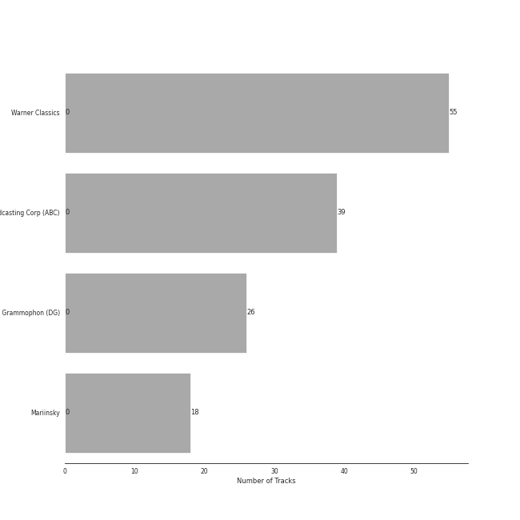

# Ballet

[138 songs](ballet_tracks.md)

## Top Artists

See all 16 artists

|   Number of Tracks | Art                                                                                              | Artist                                                               | 🔗                                                           |
|-------------------:|:-------------------------------------------------------------------------------------------------|:---------------------------------------------------------------------|:------------------------------------------------------------|
|                 55 |  | [Pyotr Ilyich Tchaikovsky](../artists/pyotr_ilyich_tchaikovsky.md)   | [🔗](https://open.spotify.com/artist/3MKCzCnpzw3TjUYs2v7vDA) |
|                 43 |  | [Berliner Philharmoniker](../artists/berliner_philharmoniker.md)     | [🔗](https://open.spotify.com/artist/6uRJnvQ3f8whVnmeoecv5Z) |
|                 39 |  | [Igor Stravinsky](../artists/igor_stravinsky.md)                     | [🔗](https://open.spotify.com/artist/7ie36YytMoKtPiL7tUvmoE) |
|                 39 |  | [Barry Wordsworth](../artists/barry_wordsworth.md)                   | [🔗](https://open.spotify.com/artist/5sjJnaI3YhaO8KylpJk3gN) |
|                 39 |  | [Orchestra Victoria](../artists/orchestra_victoria.md)               | [🔗](https://open.spotify.com/artist/1bnC6eJzCumTgAB7tG1118) |
|                 39 |  | [Léo Delibes](../artists/l_o_delibes.md)                             | [🔗](https://open.spotify.com/artist/1M9AXZkNPdOd1IPEsQsXnT) |
|                 31 |  | [London Symphony Orchestra](../artists/london_symphony_orchestra.md) | [🔗](https://open.spotify.com/artist/5yxyJsFanEAuwSM5kOuZKc) |
|                 31 |  | [André Previn](../artists/andr__previn.md)                           | [🔗](https://open.spotify.com/artist/2tfWguHr2nj4e8KXLKciVq) |
|                 24 |  | [Sir Simon Rattle](../artists/sir_simon_rattle.md)                   | [🔗](https://open.spotify.com/artist/4GQwgdcDQwqtcHICjUNndp) |
|                 19 |  | [Herbert von Karajan](../artists/herbert_von_karajan.md)             | [🔗](https://open.spotify.com/artist/5zCaQxjl110XTrm4LQ1CxY) |
|                 18 |  | [Mariinsky Orchestra](../artists/mariinsky_orchestra.md)             | [🔗](https://open.spotify.com/artist/2rRUfv2w535SEUV1YO5SP6) |
|                 18 |  | [Valery Gergiev](../artists/valery_gergiev.md)                       | [🔗](https://open.spotify.com/artist/2LxnoYPOe0FCLC82R3xgO2) |
|                  7 |  | Orchestre de l'Opéra Bastille                                        | [🔗](https://open.spotify.com/artist/4w8yzPixoCNwxRpUZYpWpP) |
|                  7 |  | Myung-Whun Chung                                                     | [🔗](https://open.spotify.com/artist/4hdiwtmc6OEFFxpSlwwmby) |
|                  5 |  | Béla Bartók                                                          | [🔗](https://open.spotify.com/artist/5zyNXVd952fWOjkdGHCvPd) |
|                  1 |  | Libera                                                               | [🔗](https://open.spotify.com/artist/235C4ktJ2aGIyqaBlXyg7e) |

## Top Albums

See all 6 albums

|   Number of Tracks | Art                                                                                              | Album                                                           | 🔗                                                          |
|-------------------:|:-------------------------------------------------------------------------------------------------|:----------------------------------------------------------------|:-----------------------------------------------------------|
|                 39 |  | Coppélia                                                        | [🔗](https://open.spotify.com/album/7jKT8NC2XfAs9RFKsrGz2p) |
|                 31 |  | Tchaikovsky: Swan Lake                                          | [🔗](https://open.spotify.com/album/7dVA06E7AP7P7VzPyNxQVO) |
|                 24 |  | Tchaikovsky: The Nutcracker                                     | [🔗](https://open.spotify.com/album/54Awn36ryf55PkZyOR4iwQ) |
|                 19 |  | Stravinsky: The Rite of Spring / Bartók: Concerto for Orchestra | [🔗](https://open.spotify.com/album/317b74rpNBO2uhaJFyMaxJ) |
|                 18 |  | Stravinsky: Petrushka, Jeu de cartes                            | [🔗](https://open.spotify.com/album/19fQbFNjlfXgBAFqftKzWA) |
|                  7 |  | Stravinsky: The Firebird (Ballet Suite)                         | [🔗](https://open.spotify.com/album/2q1xMRl4AcA7rI8GfGnmvD) |

## Top Record Labels

See all 4 labels

|   Number of Tracks | Label                                                                                 |
|-------------------:|:--------------------------------------------------------------------------------------|
|                 55 | [Warner Classics](../labels/warner_classics.md)                                       |
|                 39 | [Australian Broadcasting Corp (ABC)](../labels/australian_broadcasting_corp__abc_.md) |
|                 26 | [Deutsche Grammophon (DG)](../labels/deutsche_grammophon__dg_.md)                     |
|                 18 | [Mariinsky](../labels/mariinsky.md)                                                   |

## Audio Features

| 10 most Danceable tracks                                                                                                           | 10 least Danceable tracks                                                                                                         |
|:-----------------------------------------------------------------------------------------------------------------------------------|:----------------------------------------------------------------------------------------------------------------------------------|
| Coppélia / Tableau 2: No. 16 Boléro - Alternative Version                                                                          | Tchaikovsky: Swan Lake, Op. 20, Act II: No. 10, Scene. Moderato                                                                   |
| Coppélia / Tableau 2: No. 11a Musique des automates                                                                                | Tchaikovsky: The Nutcracker, Op. 71, Act II: No. 12b, Divertissement. Coffee, Arabian Dance                                       |
| Coppélia / Tableau 2: No. 17 Gigue                                                                                                 | Tchaikovsky: The Nutcracker, Op. 71, Act II: No. 10, The Enchanted Palace of Confiturembourg, the Kingdom of Sweets               |
| Le Sacre du Printemps - Revised version for Orchestra (published 1947) / Part 2: The Sacrifice: Sacrificial Dance (The Chosen One) | The Firebird (L'oiseau De Feu) - Suite (1919): Finale                                                                             |
| Petrushka: Third Scene: II. Dance of the Ballerina (1911 original version)                                                         | Concerto for Orchestra, Sz. 116: 3. Elegia (Andante, non troppo)                                                                  |
| Coppélia / Tableau 3: No. 20 Fête de la cloche: IV. Le travail (La fileuse)                                                        | Le Sacre du Printemps - Revised version for Orchestra (published 1947) / Part 2: The Sacrifice: Mystic Circles of the Young Girls |
| Coppélia / Tableau 3: No. 20 Fête de la cloche: V. L'hymen (Noce villageoise)                                                      | Tchaikovsky: Swan Lake, Op. 20, Act II: No. 14, Scene. Moderato                                                                   |
| Coppélia / Tableau 3: No. 20 Fête de la cloche: VI. La discorde et la guerre - Alternative Version                                 | Coppélia / Tableau 3: No. 20 Fête de la cloche: VII. La paix                                                                      |
| Coppélia / Tableau 3: No. 20 Fête de la cloche: VIII. Danse de fête                                                                | The Firebird (L'oiseau De Feu) - Suite (1919): Introduction                                                                       |
| Le Sacre du Printemps - Revised version for Orchestra (published 1947) / Part 2: The Sacrifice: Evocation of the Ancestors         | The Firebird (L'oiseau De Feu) - Suite (1919): Round Dance Of The Princesses                                                      |

| 10 most Energetic tracks                                                                                                                | 10 least Energetic tracks                                                                                             |
|:----------------------------------------------------------------------------------------------------------------------------------------|:----------------------------------------------------------------------------------------------------------------------|
| Le Sacre du Printemps - Revised version for Orchestra (published 1947) / Part 1: The Adoration of the Earth: Procession of the Sage     | Coppélia / Tableau 2: No. 14a Scène                                                                                   |
| Le Sacre du Printemps - Revised version for Orchestra (published 1947) / Part 1: The Adoration of the Earth: Ritual of Abduction        | Coppélia / Tableau 1: No. 5 Ballade                                                                                   |
| Le Sacre du Printemps - Revised version for Orchestra (published 1947) / Part 1: The Adoration of the Earth: Dance of the Earth         | The Firebird (L'oiseau De Feu) - Suite (1919): Round Dance Of The Princesses                                          |
| Tchaikovsky: The Nutcracker, Op. 71, Act II: No. 12d, Divertissement. Trepak, Russian Dance                                             | Tchaikovsky: Swan Lake, Op. 20, Act IV: No. 25, Entr'acte                                                             |
| Tchaikovsky: Swan Lake, Op. 20, Act III: No. 15, Scene. March - Allegro giusto                                                          | Tchaikovsky: The Nutcracker, Op. 71, Act II: No. 12b, Divertissement. Coffee, Arabian Dance                           |
| Le Sacre du Printemps - Revised version for Orchestra (published 1947) / Part 2: The Sacrifice: Sacrificial Dance (The Chosen One)      | The Firebird (L'oiseau De Feu) - Suite (1919): Berceuse                                                               |
| Petrushka: Fourth Scene: I. The Shrovetide Fair (towards evening) (1911 original version)                                               | Coppélia / Tableau 3: No. 20 Fête de la cloche: VII. La paix                                                          |
| Le Sacre du Printemps - Revised version for Orchestra (published 1947) / Part 2: The Sacrifice: Glorification of the Chosen One         | Coppélia / Tableau 2: No. 9 Scène                                                                                     |
| Le Sacre du Printemps - Revised version for Orchestra (published 1947) / Part 1: The Adoration of the Earth: Ritual of the Rival Tribes | The Firebird (L'oiseau De Feu) - Suite (1919): Introduction                                                           |
| Tchaikovsky: Swan Lake, Op. 20, Act I: No. 8, Dance with Goblets                                                                        | Le Sacre du Printemps - Revised version for Orchestra (published 1947) / Part 1: The Adoration of the Earth: The Sage |

| 10 most Speechy tracks                                                                                                             | 10 least Speechy tracks                                                                                                                                      |
|:-----------------------------------------------------------------------------------------------------------------------------------|:-------------------------------------------------------------------------------------------------------------------------------------------------------------|
| The Firebird (L'oiseau De Feu) - Suite (1919): Dance Of The Firebird                                                               | Tchaikovsky: Swan Lake, Op. 20, Act III: No. 21, Spanish Dance                                                                                               |
| Le Sacre du Printemps - Revised version for Orchestra (published 1947) / Part 2: The Sacrifice: Glorification of the Chosen One    | Tchaikovsky: Swan Lake, Op. 20, Act I: No. 7, Sujet                                                                                                          |
| Petrushka: Fourth Scene: VI. The Mummers (1911 original version)                                                                   | Coppélia / Tableau 3: No. 20 Fête de la cloche: IV. Le travail (La fileuse)                                                                                  |
| Coppélia / Tableau 3: No. 20 Fête de la cloche: VIII. Danse de fête                                                                | Tchaikovsky: Swan Lake, Op. 20, Act III: No. 18, Scene. Allegro - Allegro giusto                                                                             |
| Coppélia / Tableau 1: No. 4 Scène                                                                                                  | Tchaikovsky: The Nutcracker, Op. 71, Act II: No. 12c, Divertissement. Tea, Chinese Dance                                                                     |
| Le Sacre du Printemps - Revised version for Orchestra (published 1947) / Part 2: The Sacrifice: Sacrificial Dance (The Chosen One) | Tchaikovsky: The Nutcracker, Op. 71, Act II: No. 14b, Pas de deux. Variation I "Tarantella"                                                                  |
| Coppélia / Tableau 3: No. 20 Fête de la cloche: VIII. Danse de fête - Alternative Version                                          | Le Sacre du Printemps - Revised version for Orchestra (published 1947) / Part 2: The Sacrifice: Ritual Action of the Ancestors                               |
| The Firebird (L'oiseau De Feu) - Suite (1919): Infernal Dance Of King Kaschei                                                      | Petrushka: Fourth Scene: III. A Peasant Enters with a Bear (1911 original version)                                                                           |
| Tchaikovsky: Swan Lake, Op. 20, Act III: No. 22, Neapolitan Dance                                                                  | Le Sacre du Printemps - Revised version for Orchestra (published 1947) / Part 1: The Adoration of the Earth: The Augurs of Spring: Dances of the Young Girls |
| Tchaikovsky: The Nutcracker, Op. 71, Act I, Scene 1: No. 7, The Battle                                                             | Le Sacre du Printemps - Revised version for Orchestra (published 1947) / Part 1: The Adoration of the Earth: Dance of the Earth                              |

| 10 most Acoustic tracks                                                            | 10 least Acoustic tracks                                                                                                            |
|:-----------------------------------------------------------------------------------|:------------------------------------------------------------------------------------------------------------------------------------|
| Coppélia / Tableau 3: No. 20 Fête de la cloche: IV. Le travail (La fileuse)        | Petrushka: Fourth Scene: VII. Petrushka's Death (1911 original version)                                                             |
| Coppélia / Tableau 3: No. 20 Fête de la cloche: V. L'hymen (Noce villageoise)      | Coppélia / Tableau 2: No. 11a Musique des automates                                                                                 |
| Tchaikovsky: Swan Lake, Op. 20, Act IV: No. 27, Dance of the Little Swans          | Petrushka: First Scene: III. The Conjuring Trick (1911 original version)                                                            |
| Coppélia / Tableau 2: Entr'acte                                                    | Tchaikovsky: Swan Lake, Op. 20, Act I: No. 8, Dance with Goblets                                                                    |
| Coppélia / Tableau 2: No. 12 Scène                                                 | Le Sacre du Printemps - Revised version for Orchestra (published 1947) / Part 2: The Sacrifice: Sacrificial Dance (The Chosen One)  |
| La Source / Act 2: No. 22 Mazurka                                                  | The Firebird (L'oiseau De Feu) - Suite (1919): Finale                                                                               |
| Coppélia / Tableau 1: No. 2 Scène                                                  | Le Sacre du Printemps - Revised version for Orchestra (published 1947) / Part 1: The Adoration of the Earth: Dance of the Earth     |
| Petrushka: Fourth Scene: III. A Peasant Enters with a Bear (1911 original version) | Le Sacre du Printemps - Revised version for Orchestra (published 1947) / Part 1: The Adoration of the Earth: Procession of the Sage |
| Coppélia / Tableau 2: No. 10 Scène                                                 | Le Sacre du Printemps - Revised version for Orchestra (published 1947) / Part 1: The Adoration of the Earth: The Sage               |
| Coppélia / Tableau 1: No. 7 Czárdás                                                | Tchaikovsky: The Nutcracker, Op. 71, Act II: No. 12a, Divertissement. Chocolate, Spanish Dance                                      |

| 10 most Instrumental tracks                                                                                                      | 10 least Instrumental tracks                                                                                          |
|:---------------------------------------------------------------------------------------------------------------------------------|:----------------------------------------------------------------------------------------------------------------------|
| Tchaikovsky: Swan Lake, Op. 20, Act IV: No. 26, Scene. Allegro ma non troppo                                                     | Coppélia / Tableau 3: No. 20 Fête de la cloche: VII. La paix                                                          |
| Le Sacre du Printemps - Revised version for Orchestra (published 1947) / Part 1: The Adoration of the Earth: Introduction        | The Firebird (L'oiseau De Feu) - Suite (1919): 3. Variation Of The Firebird                                           |
| Tchaikovsky: The Nutcracker, Op. 71, Act II: No. 14a, Pas de deux. Andante maestoso                                              | Coppélia / Tableau 3: No. 20 Fête de la cloche: VIII. Danse de fête                                                   |
| The Firebird (L'oiseau De Feu) - Suite (1919): Dance Of The Firebird                                                             | Coppélia / Tableau 3: No. 20 Fête de la cloche: VIII. Danse de fête - Alternative Version                             |
| Petrushka: Fourth Scene: II. Dance of the Wet-Nurses (1911 original version)                                                     | Coppélia / Tableau 2: No. 17 Gigue                                                                                    |
| Le Sacre du Printemps - Revised version for Orchestra (published 1947) / Part 1: The Adoration of the Earth: Ritual of Abduction | Coppélia / Tableau 3: No. 20 Fête de la cloche: II. L'aurore                                                          |
| Tchaikovsky: The Nutcracker, Op. 71, Act II: No. 15, Final Waltz and Apotheosis                                                  | Petrushka: Fourth Scene: VII. Petrushka's Death (1911 original version)                                               |
| Coppélia / Tableau 1: No. 7a Sortie                                                                                              | Coppélia / Tableau 2: No. 14a Scène                                                                                   |
| Petrushka: First Scene: I. The Shrovetide Fair (Introduction) (1911 original version)                                            | Petrushka: First Scene: III. The Conjuring Trick (1911 original version)                                              |
| Tchaikovsky: The Nutcracker, Op. 71, Act II: No. 12e, Divertissement. Dance of the Reed-Flutes                                   | Le Sacre du Printemps - Revised version for Orchestra (published 1947) / Part 1: The Adoration of the Earth: The Sage |

| 10 most Live tracks                                                                                                                                          | 10 least Live tracks                                                                                                      |
|:-------------------------------------------------------------------------------------------------------------------------------------------------------------|:--------------------------------------------------------------------------------------------------------------------------|
| The Firebird (L'oiseau De Feu) - Suite (1919): 3. Variation Of The Firebird                                                                                  | Tchaikovsky: The Nutcracker, Op. 71, Act II: No. 13, Waltz of the Flowers                                                 |
| Le Sacre du Printemps - Revised version for Orchestra (published 1947) / Part 1: The Adoration of the Earth: The Augurs of Spring: Dances of the Young Girls | Coppélia / Tableau 2: No. 9 Scène                                                                                         |
| Tchaikovsky: The Nutcracker, Op. 71, Act I, Scene 1: No. 3, Children's Galop and Entry of the Parents                                                        | Coppélia / Tableau 3: No. 20 Fête de la cloche: VIII. Danse de fête - Alternative Version                                 |
| Tchaikovsky: Swan Lake, Op. 20, Act III: No. 18, Scene. Allegro - Allegro giusto                                                                             | Coppélia / Tableau 3: No. 19 Marche de la cloche                                                                          |
| Petrushka: First Scene: IV. Russian Dance (1911 original version)                                                                                            | Le Sacre du Printemps - Revised version for Orchestra (published 1947) / Part 1: The Adoration of the Earth: Introduction |
| Petrushka: Fourth Scene: V. Dance of the Coachmen and Grooms (1911 original version)                                                                         | The Firebird (L'oiseau De Feu) - Suite (1919): Finale                                                                     |
| Petrushka: Fourth Scene: I. The Shrovetide Fair (towards evening) (1911 original version)                                                                    | Coppélia / Tableau 1: No. 5 Ballade                                                                                       |
| Tchaikovsky: Swan Lake, Op. 20, Act II: No. 11, Scene. Allegro moderato - Moderato - Allegro vivo                                                            | Tchaikovsky: Swan Lake, Op. 20, Act I: No. 4, Pas de trois                                                                |
| Tchaikovsky: Swan Lake, Op. 20, Act III, Appendix II: No. 20a, Russian Dance                                                                                 | Tchaikovsky: The Nutcracker, Op. 71: Miniature Overture                                                                   |
| Tchaikovsky: Swan Lake, Op. 20, Act IV: No. 28, Scene. Allegro agitato                                                                                       | Coppélia / Tableau 2: No. 14a Scène                                                                                       |

| 10 most Happy tracks                                                                                  | 10 least Happy tracks                                                                                                     |
|:------------------------------------------------------------------------------------------------------|:--------------------------------------------------------------------------------------------------------------------------|
| Petrushka: Third Scene: II. Dance of the Ballerina (1911 original version)                            | Coppélia / Tableau 3: No. 20 Fête de la cloche: III. La prière                                                            |
| Tchaikovsky: The Nutcracker, Op. 71, Act II: No. 12a, Divertissement. Chocolate, Spanish Dance        | Le Sacre du Printemps - Revised version for Orchestra (published 1947) / Part 2: The Sacrifice: Introduction              |
| Tchaikovsky: The Nutcracker, Op. 71, Act II: No. 12d, Divertissement. Trepak, Russian Dance           | Petrushka: Fourth Scene: III. A Peasant Enters with a Bear (1911 original version)                                        |
| Tchaikovsky: The Nutcracker, Op. 71, Act II: No. 12c, Divertissement. Tea, Chinese Dance              | Concerto for Orchestra, Sz. 116: 1. Introduzione (Andante non troppo - Allegro vivace                                     |
| Coppélia / Tableau 2: No. 11a Musique des automates                                                   | Petrushka: Fourth Scene: VII. Petrushka's Death (1911 original version)                                                   |
| Petrushka: Fourth Scene: II. Dance of the Wet-Nurses (1911 original version)                          | Le Sacre du Printemps - Revised version for Orchestra (published 1947) / Part 1: The Adoration of the Earth: Introduction |
| Tchaikovsky: Swan Lake, Op. 20, Act III: No. 22, Neapolitan Dance                                     | Tchaikovsky: The Nutcracker, Op. 71, Act II: No. 12b, Divertissement. Coffee, Arabian Dance                               |
| Tchaikovsky: The Nutcracker, Op. 71, Act I, Scene 1: No. 3, Children's Galop and Entry of the Parents | Concerto for Orchestra, Sz. 116: 3. Elegia (Andante, non troppo)                                                          |
| Coppélia / Tableau 2: No. 16 Boléro - Alternative Version                                             | Le Sacre du Printemps - Revised version for Orchestra (published 1947) / Part 1: The Adoration of the Earth: The Sage     |
| Coppélia / Tableau 3: No. 20 Fête de la cloche: V. L'hymen (Noce villageoise)                         | The Firebird (L'oiseau De Feu) - Suite (1919): Dance Of The Firebird                                                      |
