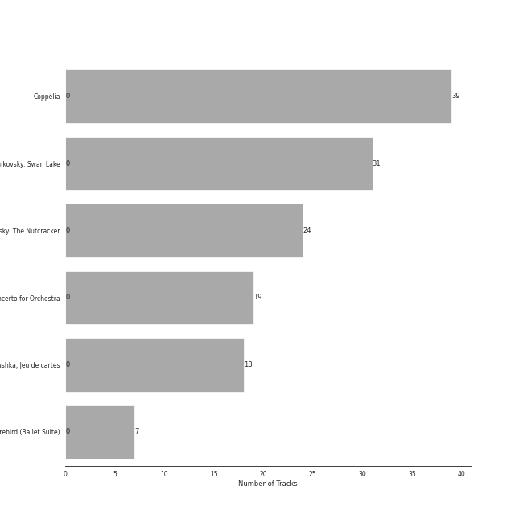

# Ballet

[138 songs](ballet_tracks.md)

## Top Artists

See all 16 artists

|   Number of Tracks | Art                                                                                              | Artist                                                               | 🔗                                                           |
|-------------------:|:-------------------------------------------------------------------------------------------------|:---------------------------------------------------------------------|:------------------------------------------------------------|
|                 55 |  | [Pyotr Ilyich Tchaikovsky](../artists/pyotr_ilyich_tchaikovsky.md)   | [🔗](https://open.spotify.com/artist/3MKCzCnpzw3TjUYs2v7vDA) |
|                 43 |  | [Berliner Philharmoniker](../artists/berliner_philharmoniker.md)     | [🔗](https://open.spotify.com/artist/6uRJnvQ3f8whVnmeoecv5Z) |
|                 39 |  | [Igor Stravinsky](../artists/igor_stravinsky.md)                     | [🔗](https://open.spotify.com/artist/7ie36YytMoKtPiL7tUvmoE) |
|                 39 |  | [Barry Wordsworth](../artists/barry_wordsworth.md)                   | [🔗](https://open.spotify.com/artist/5sjJnaI3YhaO8KylpJk3gN) |
|                 39 |  | [Orchestra Victoria](../artists/orchestra_victoria.md)               | [🔗](https://open.spotify.com/artist/1bnC6eJzCumTgAB7tG1118) |
|                 39 |  | [Léo Delibes](../artists/l_o_delibes.md)                             | [🔗](https://open.spotify.com/artist/1M9AXZkNPdOd1IPEsQsXnT) |
|                 31 |  | [London Symphony Orchestra](../artists/london_symphony_orchestra.md) | [🔗](https://open.spotify.com/artist/5yxyJsFanEAuwSM5kOuZKc) |
|                 31 |  | [André Previn](../artists/andr__previn.md)                           | [🔗](https://open.spotify.com/artist/2tfWguHr2nj4e8KXLKciVq) |
|                 24 |  | [Sir Simon Rattle](../artists/sir_simon_rattle.md)                   | [🔗](https://open.spotify.com/artist/4GQwgdcDQwqtcHICjUNndp) |
|                 19 |  | [Herbert von Karajan](../artists/herbert_von_karajan.md)             | [🔗](https://open.spotify.com/artist/5zCaQxjl110XTrm4LQ1CxY) |
|                 18 |  | [Mariinsky Orchestra](../artists/mariinsky_orchestra.md)             | [🔗](https://open.spotify.com/artist/2rRUfv2w535SEUV1YO5SP6) |
|                 18 |  | [Valery Gergiev](../artists/valery_gergiev.md)                       | [🔗](https://open.spotify.com/artist/2LxnoYPOe0FCLC82R3xgO2) |
|                  7 |  | Orchestre de l'Opéra Bastille                                        | [🔗](https://open.spotify.com/artist/4w8yzPixoCNwxRpUZYpWpP) |
|                  7 |  | Myung-Whun Chung                                                     | [🔗](https://open.spotify.com/artist/4hdiwtmc6OEFFxpSlwwmby) |
|                  5 |  | Béla Bartók                                                          | [🔗](https://open.spotify.com/artist/5zyNXVd952fWOjkdGHCvPd) |
|                  1 |  | Libera                                                               | [🔗](https://open.spotify.com/artist/235C4ktJ2aGIyqaBlXyg7e) |

## Top Albums

See all 6 albums

|   Number of Tracks | Art                                                                                              | Album                                                           | 🔗                                                          |
|-------------------:|:-------------------------------------------------------------------------------------------------|:----------------------------------------------------------------|:-----------------------------------------------------------|
|                 39 |  | Coppélia                                                        | [🔗](https://open.spotify.com/album/7jKT8NC2XfAs9RFKsrGz2p) |
|                 31 |  | Tchaikovsky: Swan Lake                                          | [🔗](https://open.spotify.com/album/7dVA06E7AP7P7VzPyNxQVO) |
|                 24 |  | Tchaikovsky: The Nutcracker                                     | [🔗](https://open.spotify.com/album/54Awn36ryf55PkZyOR4iwQ) |
|                 19 |  | Stravinsky: The Rite of Spring / Bartók: Concerto for Orchestra | [🔗](https://open.spotify.com/album/317b74rpNBO2uhaJFyMaxJ) |
|                 18 |  | Stravinsky: Petrushka, Jeu de cartes                            | [🔗](https://open.spotify.com/album/19fQbFNjlfXgBAFqftKzWA) |
|                  7 |  | Stravinsky: The Firebird (Ballet Suite)                         | [🔗](https://open.spotify.com/album/2q1xMRl4AcA7rI8GfGnmvD) |

## Top Record Labels

See all 4 labels

|   Number of Tracks | Label                                                                                 |
|-------------------:|:--------------------------------------------------------------------------------------|
|                 55 | [Warner Classics](../labels/warner_classics.md)                                       |
|                 39 | [Australian Broadcasting Corp (ABC)](../labels/australian_broadcasting_corp__abc_.md) |
|                 26 | [Deutsche Grammophon (DG)](../labels/deutsche_grammophon__dg_.md)                     |
|                 18 | [Mariinsky](../labels/mariinsky.md)                                                   |

