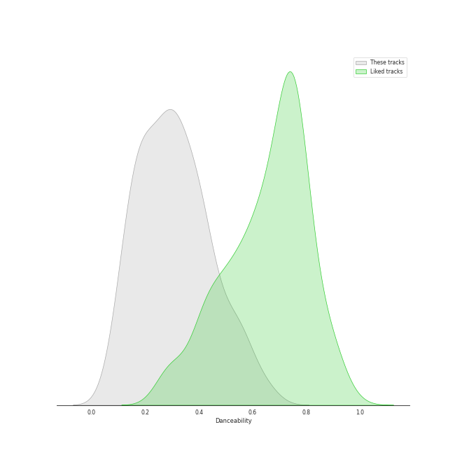
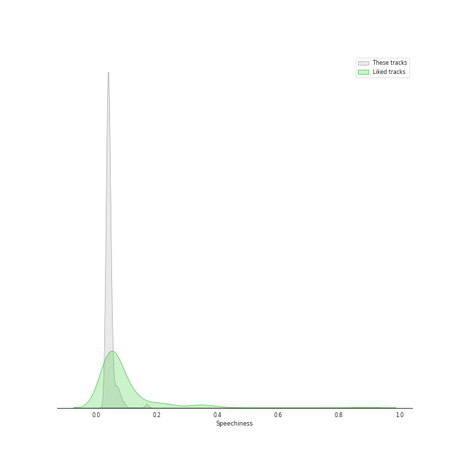
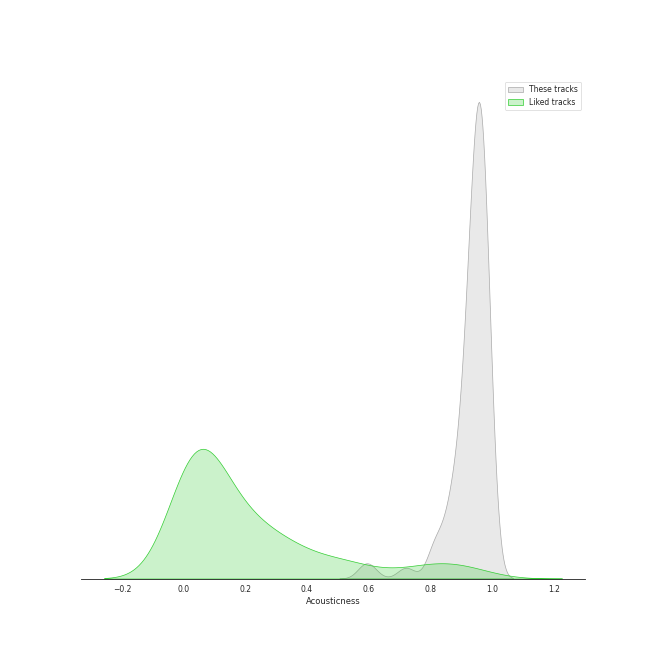
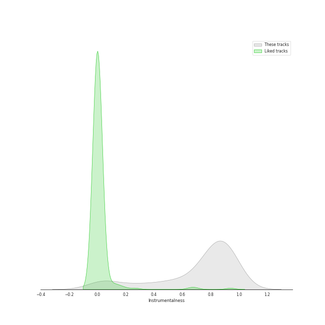

# Track Features for Ballet

## Danceability

| ​ | 10 most Danceable tracks | ​​ | 10 least Danceable tracks |
|:---|:---|:---|:---|
|  | Coppélia / Tableau 2: No. 16 Boléro - Alternative Version (0.661) |  | The Firebird (L'oiseau De Feu) - Suite (1919): Round Dance Of The Princesses (0.0797) |
|  | Coppélia / Tableau 2: No. 11a Musique des automates (0.648) |  | The Firebird (L'oiseau De Feu) - Suite (1919): Introduction (0.083) |
|  | Coppélia / Tableau 2: No. 17 Gigue (0.604) |  | Coppélia / Tableau 3: No. 20 Fête de la cloche: VII. La paix (0.0877) |
|  | The Rite of Spring, K15, Pt. 2: XIV. Sacrificial Dance (0.59) |  | Tchaikovsky: Swan Lake, Op. 20, Act 2: No. 14, Scene. Moderato (0.0958) |
|  | Petrushka: Third Scene: II. Dance of the Ballerina (1911 original version) (0.58) |  | The Rite of Spring, K15, Pt. 2: X. Mystic Circles of the Adolescents (0.108) |
|  | Coppélia / Tableau 3: No. 20 Fête de la cloche: IV. Le travail (La fileuse) (0.568) |  | Concerto for Orchestra, Sz. 116: III. Elegia. Andante, non troppo (0.112) |
|  | Coppélia / Tableau 3: No. 20 Fête de la cloche: V. L'hymen (Noce villageoise) (0.551) |  | The Firebird (L'oiseau De Feu) - Suite (1919): Finale (0.123) |
|  | Coppélia / Tableau 3: No. 20 Fête de la cloche: VI. La discorde et la guerre - Alternative Version (0.55) |  | Tchaikovsky: The Nutcracker, Op. 71, Act II: No. 10, The Enchanted Palace of Confiturembourg, the Kingdom of Sweets (0.124) |
|  | Coppélia / Tableau 3: No. 20 Fête de la cloche: VIII. Danse de fête (0.542) |  | Tchaikovsky: The Nutcracker, Op. 71, Act II: No. 12b, Divertissement. Coffee, Arabian Dance (0.13) |
|  | The Rite of Spring, K15, Pt. 2: XII. Evocation of the Ancestors (0.539) |  | Tchaikovsky: Swan Lake, Op. 20, Act 2: No. 10, Scene. Moderato (0.136) |

## Energy

| ​ | 10 most Energetic tracks | ​​ | 10 least Energetic tracks |
|:---|:---|:---|:---|
|  | The Rite of Spring, K15, Pt. 1: VI. Procession of the Sage (0.7) |  | The Rite of Spring, K15, Pt. 1: VII. Adoration of the Earth (The Sage) (0.000239) |
|  | The Rite of Spring, K15, Pt. 1: III. Ritual of Abduction (0.555) |  | The Firebird (L'oiseau De Feu) - Suite (1919): Introduction (0.00108) |
|  | The Rite of Spring, K15, Pt. 1: VIII. Dance of the Earth (0.509) |  | Coppélia / Tableau 2: No. 9 Scène (0.00262) |
|  | Tchaikovsky: The Nutcracker, Op. 71, Act II: No. 12d, Divertissement. Trepak, Russian Dance (0.5) |  | Coppélia / Tableau 3: No. 20 Fête de la cloche: VII. La paix (0.0039) |
|  | Tchaikovsky: Swan Lake, Op. 20, Act 3: No. 15, Scene. March - Allegro giusto (0.474) |  | The Firebird (L'oiseau De Feu) - Suite (1919): Berceuse (0.00403) |
|  | The Rite of Spring, K15, Pt. 2: XIV. Sacrificial Dance (0.46) |  | Tchaikovsky: The Nutcracker, Op. 71, Act II: No. 12b, Divertissement. Coffee, Arabian Dance (0.00478) |
|  | Petrushka: Fourth Scene: I. The Shrovetide Fair (towards evening) (1911 original version) (0.453) |  | Tchaikovsky: Swan Lake, Op. 20, Act 4: No. 25, Entr'acte (0.00606) |
|  | The Rite of Spring, K15, Pt. 2: XI. Glorification of the Chosen One (0.447) |  | The Firebird (L'oiseau De Feu) - Suite (1919): Round Dance Of The Princesses (0.00617) |
|  | The Rite of Spring, K15, Pt. 1: V. Games of the Rival Tribes (0.435) |  | Coppélia / Tableau 1: No. 5 Ballade (0.00661) |
|  | Tchaikovsky: Swan Lake, Op. 20, Act 1: No. 8, Dance with Goblets (0.391) |  | Coppélia / Tableau 2: No. 14a Scène (0.00699) |

## Speechiness

| ​ | 10 most Speechy tracks | ​​ | 10 least Speechy tracks |
|:---|:---|:---|:---|
|  | The Firebird (L'oiseau De Feu) - Suite (1919): Dance Of The Firebird (0.167) |  | The Rite of Spring, K15, Pt. 1: VIII. Dance of the Earth (0.0292) |
|  | The Rite of Spring, K15, Pt. 2: XI. Glorification of the Chosen One (0.0935) |  | The Rite of Spring, K15, Pt. 1: II. The Augurs of Spring (0.0293) |
|  | Petrushka: Fourth Scene: VI. The Mummers (1911 original version) (0.083) |  | Petrushka: Fourth Scene: III. A Peasant Enters with a Bear (1911 original version) (0.0313) |
|  | Coppélia / Tableau 3: No. 20 Fête de la cloche: VIII. Danse de fête (0.0818) |  | The Rite of Spring, K15, Pt. 2: XIII. Ritual of the Ancestors (0.0319) |
|  | Coppélia / Tableau 1: No. 4 Scène (0.0766) |  | Tchaikovsky: The Nutcracker, Op. 71, Act II: No. 14b, Pas de deux. Variation I "Tarantella" (0.0332) |
|  | The Rite of Spring, K15, Pt. 2: XIV. Sacrificial Dance (0.0741) |  | Tchaikovsky: The Nutcracker, Op. 71, Act II: No. 12c, Divertissement. Tea, Chinese Dance (0.0338) |
|  | Coppélia / Tableau 3: No. 20 Fête de la cloche: VIII. Danse de fête - Alternative Version (0.0716) |  | Tchaikovsky: Swan Lake, Op. 20, Act 3: No. 18, Scene. Allegro - Allegro giusto (0.034) |
|  | The Firebird (L'oiseau De Feu) - Suite (1919): Infernal Dance Of King Kaschei (0.0689) |  | Coppélia / Tableau 3: No. 20 Fête de la cloche: IV. Le travail (La fileuse) (0.0342) |
|  | Tchaikovsky: Swan Lake, Op. 20, Act 3: No. 22, Neapolitan Dance (0.0675) |  | Tchaikovsky: Swan Lake, Op. 20, Act 1: No. 7, Sujet (0.0343) |
|  | Tchaikovsky: The Nutcracker, Op. 71, Act I, Scene 1: No. 7, The Battle (0.0664) |  | Tchaikovsky: Swan Lake, Op. 20, Act 3: No. 21, Spanish Dance (0.0345) |

## Acousticness

| ​ | 10 most Acoustic tracks | ​​ | 10 least Acoustic tracks |
|:---|:---|:---|:---|
|  | Coppélia / Tableau 3: No. 20 Fête de la cloche: IV. Le travail (La fileuse) (0.99) |  | Tchaikovsky: The Nutcracker, Op. 71, Act II: No. 12a, Divertissement. Chocolate, Spanish Dance (0.583) |
|  | Coppélia / Tableau 3: No. 20 Fête de la cloche: V. L'hymen (Noce villageoise) (0.987) |  | The Rite of Spring, K15, Pt. 1: VII. Adoration of the Earth (The Sage) (0.591) |
|  | Tchaikovsky: Swan Lake, Op. 20, Act 4: No. 27, Dance of the Little Swans (0.987) |  | The Rite of Spring, K15, Pt. 1: VI. Procession of the Sage (0.612) |
|  | Coppélia / Tableau 2: Entr'acte (0.986) |  | The Rite of Spring, K15, Pt. 1: VIII. Dance of the Earth (0.712) |
|  | Coppélia / Tableau 2: No. 12 Scène (0.985) |  | The Firebird (L'oiseau De Feu) - Suite (1919): Finale (0.73) |
|  | La Source / Act 2: No. 22 Mazurka (0.984) |  | The Rite of Spring, K15, Pt. 2: XIV. Sacrificial Dance (0.802) |
|  | Coppélia / Tableau 1: No. 2 Scène (0.983) |  | Tchaikovsky: Swan Lake, Op. 20, Act 1: No. 8, Dance with Goblets (0.813) |
|  | Petrushka: Fourth Scene: III. A Peasant Enters with a Bear (1911 original version) (0.983) |  | Coppélia / Tableau 2: No. 11a Musique des automates (0.817) |
|  | Coppélia / Tableau 1: No. 7 Czárdás (0.982) |  | Petrushka: First Scene: III. The Conjuring Trick (1911 original version) (0.817) |
|  | Coppélia / Tableau 2: No. 10 Scène (0.982) |  | Petrushka: Fourth Scene: VII. Petrushka's Death (1911 original version) (0.82) |

## Instrumentalness

| ​ | 10 most Instrumental tracks | ​​ | 10 least Instrumental tracks |
|:---|:---|:---|:---|
|  | Tchaikovsky: Swan Lake, Op. 20, Act 4: No. 26, Scene. Allegro ma non troppo (0.978) |  | The Rite of Spring, K15, Pt. 1: VII. Adoration of the Earth (The Sage) (0.000308) |
|  | The Rite of Spring, K15, Pt. 1: I. Introduction (0.972) |  | Petrushka: First Scene: III. The Conjuring Trick (1911 original version) (0.000393) |
|  | Tchaikovsky: The Nutcracker, Op. 71, Act II: No. 14a, Pas de deux. Andante maestoso (0.954) |  | Coppélia / Tableau 2: No. 14a Scène (0.00519) |
|  | The Firebird (L'oiseau De Feu) - Suite (1919): Dance Of The Firebird (0.951) |  | Petrushka: Fourth Scene: VII. Petrushka's Death (1911 original version) (0.00603) |
|  | The Rite of Spring, K15, Pt. 1: III. Ritual of Abduction (0.945) |  | Coppélia / Tableau 3: No. 20 Fête de la cloche: II. L'aurore (0.0197) |
|  | Petrushka: Fourth Scene: II. Dance of the Wet-Nurses (1911 original version) (0.945) |  | Coppélia / Tableau 2: No. 17 Gigue (0.0246) |
|  | Tchaikovsky: The Nutcracker, Op. 71, Act II: No. 15, Final Waltz and Apotheosis (0.944) |  | Coppélia / Tableau 3: No. 20 Fête de la cloche: VIII. Danse de fête - Alternative Version (0.039) |
|  | Coppélia / Tableau 1: No. 7a Sortie (0.942) |  | Coppélia / Tableau 3: No. 20 Fête de la cloche: VIII. Danse de fête (0.0474) |
|  | Petrushka: First Scene: I. The Shrovetide Fair (Introduction) (1911 original version) (0.941) |  | The Firebird (L'oiseau De Feu) - Suite (1919): 3. Variation Of The Firebird (0.054) |
|  | Tchaikovsky: The Nutcracker, Op. 71, Act 2: No. 12e, Divertissement. Dance of the Reed-Flutes (0.94) |  | Coppélia / Tableau 3: No. 20 Fête de la cloche: VII. La paix (0.0544) |

## Liveness

| ​ | 10 most Live tracks | ​​ | 10 least Live tracks |
|:---|:---|:---|:---|
|  | The Firebird (L'oiseau De Feu) - Suite (1919): 3. Variation Of The Firebird (0.743) |  | Coppélia / Tableau 2: No. 14a Scène (0.0555) |
|  | The Rite of Spring, K15, Pt. 1: II. The Augurs of Spring (0.669) |  | Tchaikovsky: The Nutcracker, Op. 71: Miniature Overture (0.0557) |
|  | Tchaikovsky: The Nutcracker, Op. 71, Act I, Scene 1: No. 3, Children's Galop and Entry of the Parents (0.578) |  | Tchaikovsky: Swan Lake, Op. 20, Act 1: No. 4, Pas de trois (0.0595) |
|  | Tchaikovsky: Swan Lake, Op. 20, Act 3: No. 18, Scene. Allegro - Allegro giusto (0.565) |  | Coppélia / Tableau 1: No. 5 Ballade (0.0601) |
|  | Petrushka: First Scene: IV. Russian Dance (1911 original version) (0.558) |  | The Firebird (L'oiseau De Feu) - Suite (1919): Finale (0.0658) |
|  | Petrushka: Fourth Scene: V. Dance of the Coachmen and Grooms (1911 original version) (0.537) |  | The Rite of Spring, K15, Pt. 1: I. Introduction (0.0674) |
|  | Petrushka: Fourth Scene: I. The Shrovetide Fair (towards evening) (1911 original version) (0.505) |  | Coppélia / Tableau 3: No. 19 Marche de la cloche (0.0678) |
|  | Tchaikovsky: Swan Lake, Op. 20, Act 2: No. 11, Scene. Allegro moderato - Moderato - Allegro vivo (0.486) |  | Coppélia / Tableau 3: No. 20 Fête de la cloche: VIII. Danse de fête - Alternative Version (0.0694) |
|  | Tchaikovsky: Swan Lake, Op. 20, Act 3, Appendix II: No. 20a, Russian Dance (0.421) |  | Coppélia / Tableau 2: No. 9 Scène (0.0701) |
|  | Tchaikovsky: Swan Lake, Op. 20, Act 4: No. 28, Scene. Allegro agitato (0.373) |  | Tchaikovsky: The Nutcracker, Op. 71, Act 2: No. 13, Waltz of the Flowers (0.0703) |

## Valence

| ​ | 10 most Happy tracks | ​​ | 10 least Happy tracks |
|:---|:---|:---|:---|
|  | Petrushka: Third Scene: II. Dance of the Ballerina (1911 original version) (0.907) |  | The Rite of Spring, K15, Pt. 1: VII. Adoration of the Earth (The Sage) (0.0) |
|  | Tchaikovsky: The Nutcracker, Op. 71, Act II: No. 12a, Divertissement. Chocolate, Spanish Dance (0.879) |  | The Firebird (L'oiseau De Feu) - Suite (1919): Dance Of The Firebird (0.0) |
|  | Tchaikovsky: The Nutcracker, Op. 71, Act II: No. 12d, Divertissement. Trepak, Russian Dance (0.851) |  | Concerto for Orchestra, Sz. 116: III. Elegia. Andante, non troppo (0.0312) |
|  | Tchaikovsky: The Nutcracker, Op. 71, Act II: No. 12c, Divertissement. Tea, Chinese Dance (0.832) |  | Tchaikovsky: The Nutcracker, Op. 71, Act II: No. 12b, Divertissement. Coffee, Arabian Dance (0.037) |
|  | Coppélia / Tableau 2: No. 11a Musique des automates (0.728) |  | The Rite of Spring, K15, Pt. 1: I. Introduction (0.037) |
|  | Petrushka: Fourth Scene: II. Dance of the Wet-Nurses (1911 original version) (0.657) |  | Petrushka: Fourth Scene: VII. Petrushka's Death (1911 original version) (0.0377) |
|  | Tchaikovsky: Swan Lake, Op. 20, Act 3: No. 22, Neapolitan Dance (0.641) |  | Petrushka: Fourth Scene: III. A Peasant Enters with a Bear (1911 original version) (0.0379) |
|  | Tchaikovsky: The Nutcracker, Op. 71, Act I, Scene 1: No. 3, Children's Galop and Entry of the Parents (0.639) |  | Concerto for Orchestra, Sz. 116: I. Introduction. Andante non troppo – Allegro vivace (0.0379) |
|  | Coppélia / Tableau 2: No. 16 Boléro - Alternative Version (0.615) |  | The Rite of Spring, K15, Pt. 2: IX. Introduction (0.0385) |
|  | Coppélia / Tableau 3: No. 20 Fête de la cloche: V. L'hymen (Noce villageoise) (0.598) |  | Coppélia / Tableau 3: No. 20 Fête de la cloche: III. La prière (0.0386) |

## Tempo

| ​ | 10 most Fast tracks | ​​ | 10 least Fast tracks |
|:---|:---|:---|:---|
|  | Tchaikovsky: Swan Lake, Op. 20, Act 3: No. 23, Mazurka (184.562) |  | Tchaikovsky: The Nutcracker, Op. 71, Act 2: No. 13, Waltz of the Flowers (47.362) |
|  | Coppélia / Tableau 1: Prélude - Mazurka (184.094) |  | Coppélia / Tableau 2: No. 9 Scène (49.526) |
|  | Coppélia / Tableau 3: No. 20 Fête de la cloche: II. L'aurore (182.171) |  | Tchaikovsky: Swan Lake, Op. 20, Act 2: No. 10, Scene. Moderato (58.303) |
|  | Tchaikovsky: Swan Lake, Op. 20, Act 1: No. 7, Sujet (181.794) |  | Tchaikovsky: The Nutcracker, Op. 71, Act I, Scene 1: No. 3, Children's Galop and Entry of the Parents (62.102) |
|  | Coppélia / Tableau 2: No. 16 Boléro (179.617) |  | Tchaikovsky: Swan Lake, Op. 20, Act 1: No. 6, Pas d'action. Andantino, quasi moderato - Allegro (62.261) |
|  | Coppélia / Tableau 1: No. 7a Sortie (175.841) |  | Petrushka: Fourth Scene: III. A Peasant Enters with a Bear (1911 original version) (63.584) |
|  | Coppélia / Tableau 1: No. 4 Scène (173.625) |  | The Rite of Spring, K15, Pt. 1: IV. Spring Rounds (64.022) |
|  | Coppélia / Tableau 1: No. 1 Valse (167.485) |  | The Rite of Spring, K15, Pt. 2: IX. Introduction (64.987) |
|  | The Firebird (L'oiseau De Feu) - Suite (1919): Infernal Dance Of King Kaschei (162.033) |  | Tchaikovsky: Swan Lake, Op. 20, Act 1: No. 3, Scene. Allegro moderato (65.136) |
|  | Coppélia / Tableau 2: No. 15 Scène - Alternative Version (160.462) |  | Coppélia / Tableau 2: Entr'acte (65.728) |
