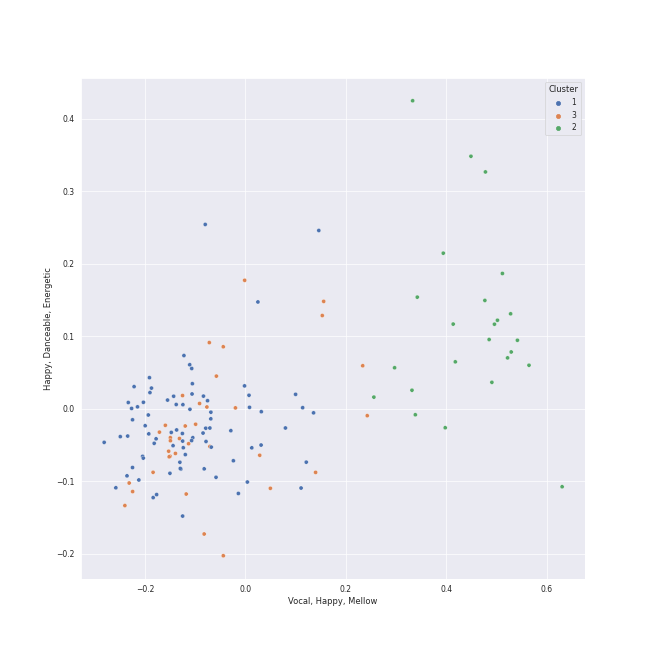

# Clusters in Ballet

## Cluster #1

79 tracks

| Art | Track | Album | Artists | Label | 💚 | 🔗 |
|:---|:---|:---|:---|:---|:---|:---|
|  | Concerto for Orchestra, Sz. 116: 5. Finale (Pesante - Presto) | Stravinsky: The Rite of Spring / Bartók: Concerto for Orchestra | Béla Bartók, [Berliner Philharmoniker](../../../../artists/berliner_philharmoniker/overview.md), [Herbert von Karajan](../../../../artists/herbert_von_karajan/overview.md) | [Deutsche Grammophon (DG)](../../../../labels/deutsche_grammophon__dg_) | | [🔗](https://open.spotify.com/track/6pTDV5wsqZaCNlgnWLhfoF) |
|  | The Firebird (L'oiseau De Feu) - Suite (1919): Infernal Dance Of King Kaschei | Stravinsky: The Firebird (Ballet Suite) | Igor Stravinsky, Orchestre de l'Opéra National de Paris, Myung-Whun Chung | [Deutsche Grammophon (DG)](../../../../labels/deutsche_grammophon__dg_) | | [🔗](https://open.spotify.com/track/0s2MfCDScTP72VvdNy99dy) |
|  | Coppélia / Tableau 1: Prélude - Mazurka | Coppélia | Léo Delibes, Orchestra Victoria, Barry Wordsworth | [Australian Broadcasting Corp (ABC)](../../../../labels/australian_broadcasting_corp__abc_) | | [🔗](https://open.spotify.com/track/6jij2emBEB4q33akGgatsD) |
|  | Coppélia / Tableau 3: No. 20 Fête de la cloche: I. Valse des heures | Coppélia | Léo Delibes, Orchestra Victoria, Barry Wordsworth | [Australian Broadcasting Corp (ABC)](../../../../labels/australian_broadcasting_corp__abc_) | | [🔗](https://open.spotify.com/track/6vSsOUVbAlZWziychEEqZ3) |
|  | Tchaikovsky: Swan Lake, Op. 20, Act 1: Introduction - No. 1, Scene. Allegro giusto | Tchaikovsky: Swan Lake | [Pyotr Ilyich Tchaikovsky](../../../../artists/pyotr_ilyich_tchaikovsky/overview.md), André Previn, London Symphony Orchestra | [Warner Classics](../../../../labels/warner_classics) | | [🔗](https://open.spotify.com/track/5tNUaNoIMdJcdHGj25a7gD) |
|  | Tchaikovsky: Swan Lake, Op. 20, Act 1: No. 2, Waltz | Tchaikovsky: Swan Lake | [Pyotr Ilyich Tchaikovsky](../../../../artists/pyotr_ilyich_tchaikovsky/overview.md), André Previn, London Symphony Orchestra | [Warner Classics](../../../../labels/warner_classics) | | [🔗](https://open.spotify.com/track/7gwqbiFgNU1VddAK2XO5Wr) |
|  | Tchaikovsky: Swan Lake, Op. 20, Act 3, Appendix I: Pas de deux | Tchaikovsky: Swan Lake | [Pyotr Ilyich Tchaikovsky](../../../../artists/pyotr_ilyich_tchaikovsky/overview.md), André Previn, London Symphony Orchestra | [Warner Classics](../../../../labels/warner_classics) | | [🔗](https://open.spotify.com/track/7hh18ES59TNeJnBSVJKtmV) |
|  | Tchaikovsky: Swan Lake, Op. 20, Act 3: No. 20, Hungarian Dance "Czárdás" | Tchaikovsky: Swan Lake | [Pyotr Ilyich Tchaikovsky](../../../../artists/pyotr_ilyich_tchaikovsky/overview.md), André Previn, London Symphony Orchestra | [Warner Classics](../../../../labels/warner_classics) | | [🔗](https://open.spotify.com/track/6YbcqXNj8MEclUKVeicLYU) |
|  | Tchaikovsky: The Nutcracker, Op. 71, Act I, Scene 1: No. 5, Scene and Grandfather Dance | Tchaikovsky: The Nutcracker | [Pyotr Ilyich Tchaikovsky](../../../../artists/pyotr_ilyich_tchaikovsky/overview.md), Sir Simon Rattle, [Berliner Philharmoniker](../../../../artists/berliner_philharmoniker/overview.md) | [Warner Classics](../../../../labels/warner_classics) | | [🔗](https://open.spotify.com/track/7JUbQkbvdPnNqS8RdcfCtO) |
|  | Tchaikovsky: The Nutcracker, Op. 71, Act II: No. 14c, Pas de deux. Variation II "Dance of the Sugar Plum Fairy" | Tchaikovsky: The Nutcracker | [Pyotr Ilyich Tchaikovsky](../../../../artists/pyotr_ilyich_tchaikovsky/overview.md), Sir Simon Rattle, [Berliner Philharmoniker](../../../../artists/berliner_philharmoniker/overview.md) | [Warner Classics](../../../../labels/warner_classics) | | [🔗](https://open.spotify.com/track/1oDAFTOXZGSQedBa6hXGhT) |
## Cluster #2

24 tracks

| Art | Track | Album | Artists | Label | 💚 | 🔗 |
|:---|:---|:---|:---|:---|:---|:---|
|  | Le Sacre du Printemps - Revised version for Orchestra (published 1947) / Part 2: The Sacrifice: Introduction | Stravinsky: The Rite of Spring / Bartók: Concerto for Orchestra | Igor Stravinsky, [Berliner Philharmoniker](../../../../artists/berliner_philharmoniker/overview.md), [Herbert von Karajan](../../../../artists/herbert_von_karajan/overview.md) | [Deutsche Grammophon (DG)](../../../../labels/deutsche_grammophon__dg_) | | [🔗](https://open.spotify.com/track/6GS9MQgfnbFp3yPL2uNAF8) |
|  | Petrushka: First Scene: III. The Conjuring Trick (1911 original version) | Stravinsky: Petrushka, Jeu de cartes | Igor Stravinsky, Valery Gergiev, Mariinsky Orchestra | [Mariinsky](../../../../labels/mariinsky) | | [🔗](https://open.spotify.com/track/5Ngr7bpBvlYNojEpw72eJ7) |
|  | Coppélia / Tableau 2: No. 10 Scène | Coppélia | Léo Delibes, Orchestra Victoria, Barry Wordsworth | [Australian Broadcasting Corp (ABC)](../../../../labels/australian_broadcasting_corp__abc_) | | [🔗](https://open.spotify.com/track/6EkMmjc72kp8fGLLF4mfJk) |
|  | Coppélia / Tableau 2: No. 11b Scène | Coppélia | Léo Delibes, Orchestra Victoria, Barry Wordsworth | [Australian Broadcasting Corp (ABC)](../../../../labels/australian_broadcasting_corp__abc_) | | [🔗](https://open.spotify.com/track/5B822sKaYS1KRlY6tcO1Pn) |
|  | Coppélia / Tableau 2: No. 12 Scène | Coppélia | Léo Delibes, Orchestra Victoria, Barry Wordsworth | [Australian Broadcasting Corp (ABC)](../../../../labels/australian_broadcasting_corp__abc_) | | [🔗](https://open.spotify.com/track/7drtcpK45RJzJpxZ5CfxUr) |
|  | Coppélia / Tableau 2: No. 14a Scène | Coppélia | Léo Delibes, Orchestra Victoria, Barry Wordsworth | [Australian Broadcasting Corp (ABC)](../../../../labels/australian_broadcasting_corp__abc_) | | [🔗](https://open.spotify.com/track/1Kheqw70aaDOJQdLHXrrlq) |
|  | Coppélia / Tableau 2: No. 9 Scène | Coppélia | Léo Delibes, Orchestra Victoria, Barry Wordsworth | [Australian Broadcasting Corp (ABC)](../../../../labels/australian_broadcasting_corp__abc_) | | [🔗](https://open.spotify.com/track/0HOEqW7pRiickxkOcC3Djm) |
|  | Coppélia / Tableau 3: No. 20 Fête de la cloche: II. L'aurore | Coppélia | Léo Delibes, Orchestra Victoria, Barry Wordsworth | [Australian Broadcasting Corp (ABC)](../../../../labels/australian_broadcasting_corp__abc_) | | [🔗](https://open.spotify.com/track/5gpJqY5TNtvkeZuguksKwg) |
|  | Tchaikovsky: Swan Lake, Op. 20, Act 3: No. 21, Spanish Dance | Tchaikovsky: Swan Lake | [Pyotr Ilyich Tchaikovsky](../../../../artists/pyotr_ilyich_tchaikovsky/overview.md), André Previn, London Symphony Orchestra | [Warner Classics](../../../../labels/warner_classics) | | [🔗](https://open.spotify.com/track/3Vulgn0kOld0a561mg7yt4) |
|  | Tchaikovsky: Swan Lake, Op. 20, Act 3: No. 23, Mazurka | Tchaikovsky: Swan Lake | [Pyotr Ilyich Tchaikovsky](../../../../artists/pyotr_ilyich_tchaikovsky/overview.md), André Previn, London Symphony Orchestra | [Warner Classics](../../../../labels/warner_classics) | | [🔗](https://open.spotify.com/track/2yf6Hbs6YR3o1iEtOxr91R) |
## Cluster #3

35 tracks

| Art | Track | Album | Artists | Label | 💚 | 🔗 |
|:---|:---|:---|:---|:---|:---|:---|
|  | Jeu de cartes: III. Third Deal | Stravinsky: Petrushka, Jeu de cartes | Igor Stravinsky, Valery Gergiev, Mariinsky Orchestra | [Mariinsky](../../../../labels/mariinsky) | | [🔗](https://open.spotify.com/track/1RmGFbd7C1jv5oBNRHX7cv) |
|  | Coppélia / Tableau 1: No. 3 Mazurka | Coppélia | Léo Delibes, Orchestra Victoria, Barry Wordsworth | [Australian Broadcasting Corp (ABC)](../../../../labels/australian_broadcasting_corp__abc_) | | [🔗](https://open.spotify.com/track/4Vh9c9ZVc6nPuSMbvJADyi) |
|  | Coppélia / Tableau 1: No. 4 Scène | Coppélia | Léo Delibes, Orchestra Victoria, Barry Wordsworth | [Australian Broadcasting Corp (ABC)](../../../../labels/australian_broadcasting_corp__abc_) | | [🔗](https://open.spotify.com/track/043cfi7SrTRdEoIcFs1i3e) |
|  | Coppélia / Tableau 1: No. 7 Czárdás | Coppélia | Léo Delibes, Orchestra Victoria, Barry Wordsworth | [Australian Broadcasting Corp (ABC)](../../../../labels/australian_broadcasting_corp__abc_) | | [🔗](https://open.spotify.com/track/6vLPBxUABNX1kYP3Eb6uNV) |
|  | Coppélia / Tableau 2: No. 15 Scène - Alternative Version | Coppélia | Léo Delibes, Orchestra Victoria, Barry Wordsworth | [Australian Broadcasting Corp (ABC)](../../../../labels/australian_broadcasting_corp__abc_) | | [🔗](https://open.spotify.com/track/6yt9V1Ph9RuH0PqlnuwzcH) |
|  | Coppélia / Tableau 2: No. 16 Boléro | Coppélia | Léo Delibes, Orchestra Victoria, Barry Wordsworth | [Australian Broadcasting Corp (ABC)](../../../../labels/australian_broadcasting_corp__abc_) | | [🔗](https://open.spotify.com/track/6lEBtjG6PALJtCSr5kQSLW) |
|  | Coppélia / Tableau 3: No. 20 Fête de la cloche: IX. Galop final | Coppélia | Léo Delibes, Orchestra Victoria, Barry Wordsworth | [Australian Broadcasting Corp (ABC)](../../../../labels/australian_broadcasting_corp__abc_) | | [🔗](https://open.spotify.com/track/20UXWmEsvrpI1z0lwcZBcB) |
|  | Coppélia / Tableau 3: No. 20 Fête de la cloche: IX. Galop final - Alternative Version | Coppélia | Léo Delibes, Orchestra Victoria, Barry Wordsworth | [Australian Broadcasting Corp (ABC)](../../../../labels/australian_broadcasting_corp__abc_) | | [🔗](https://open.spotify.com/track/7DStwi0QEkCKh1cZ58x4pC) |
|  | Tchaikovsky: The Nutcracker, Op. 71, Act I, Scene 1: No. 2, March | Tchaikovsky: The Nutcracker | [Pyotr Ilyich Tchaikovsky](../../../../artists/pyotr_ilyich_tchaikovsky/overview.md), Sir Simon Rattle, [Berliner Philharmoniker](../../../../artists/berliner_philharmoniker/overview.md) | [Warner Classics](../../../../labels/warner_classics) | | [🔗](https://open.spotify.com/track/06am46cX3Z6YlSsg0TyVHA) |
|  | Tchaikovsky: The Nutcracker, Op. 71, Act II: No. 14d, Pas de deux. Coda | Tchaikovsky: The Nutcracker | [Pyotr Ilyich Tchaikovsky](../../../../artists/pyotr_ilyich_tchaikovsky/overview.md), Sir Simon Rattle, [Berliner Philharmoniker](../../../../artists/berliner_philharmoniker/overview.md) | [Warner Classics](../../../../labels/warner_classics) | | [🔗](https://open.spotify.com/track/3aBr1vgaFH9QlMIXQBx9f5) |