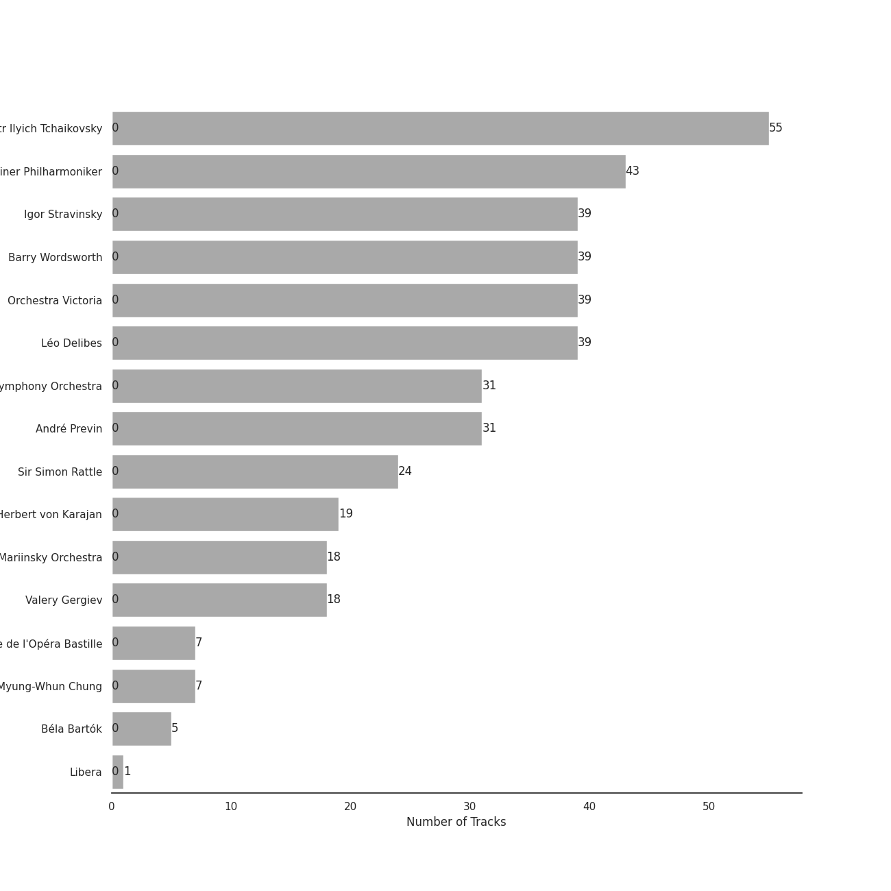
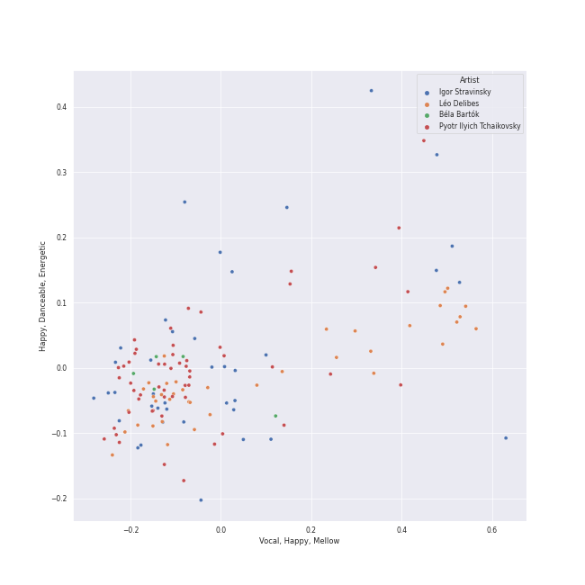
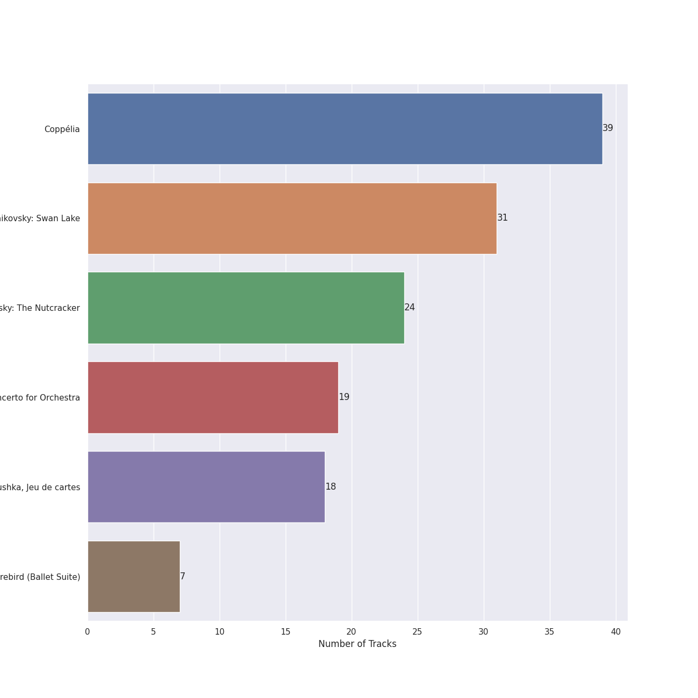
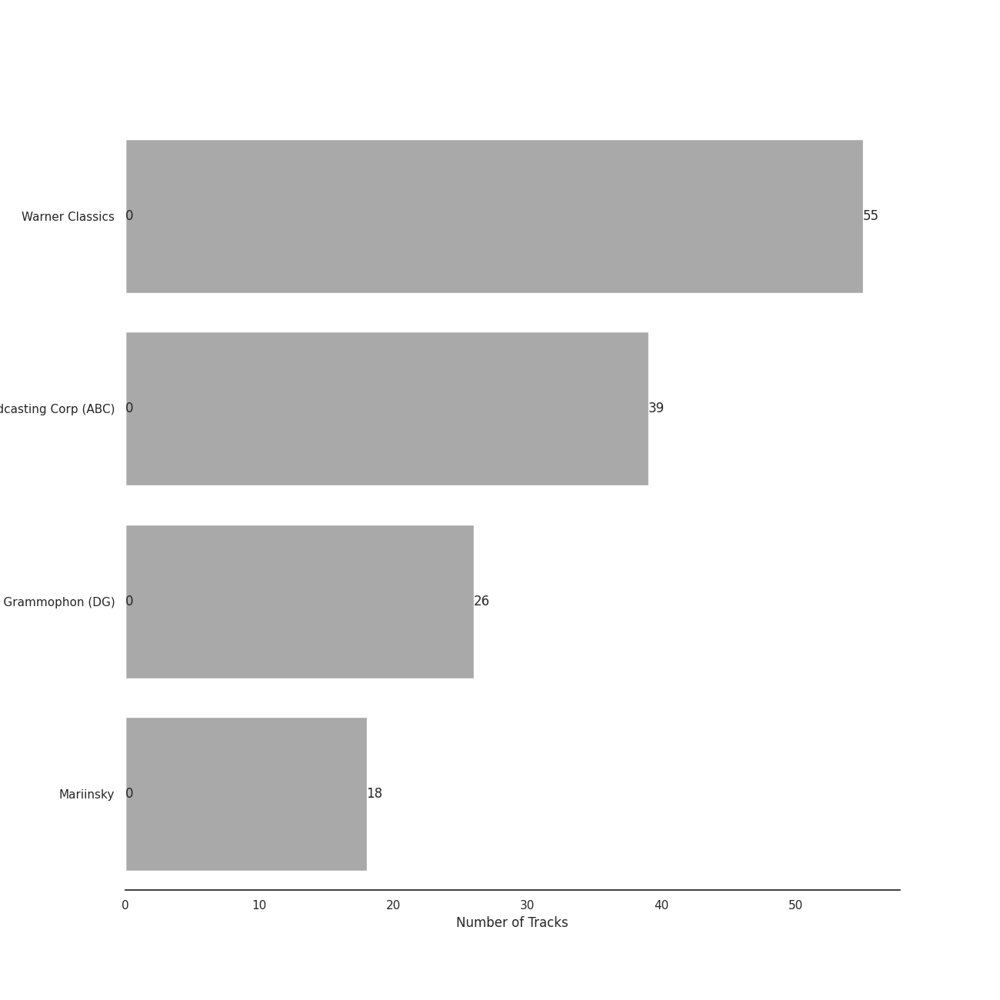
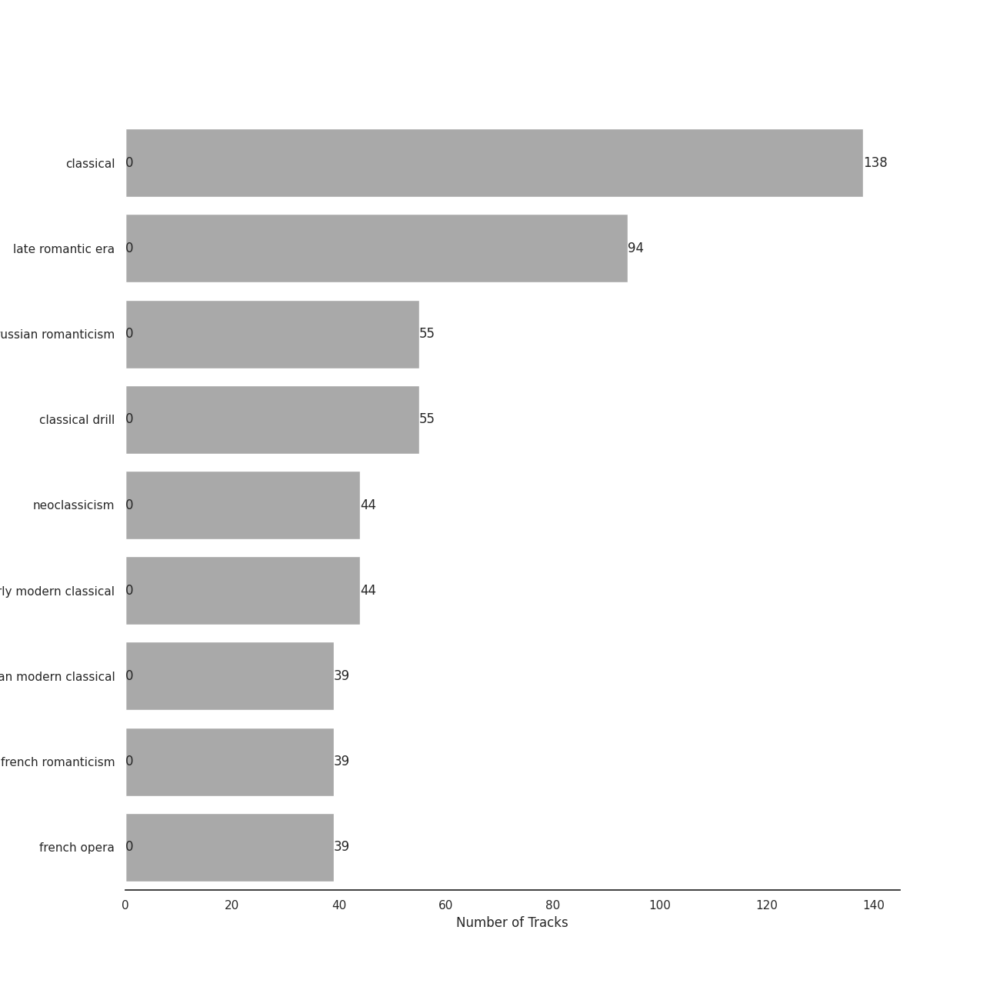
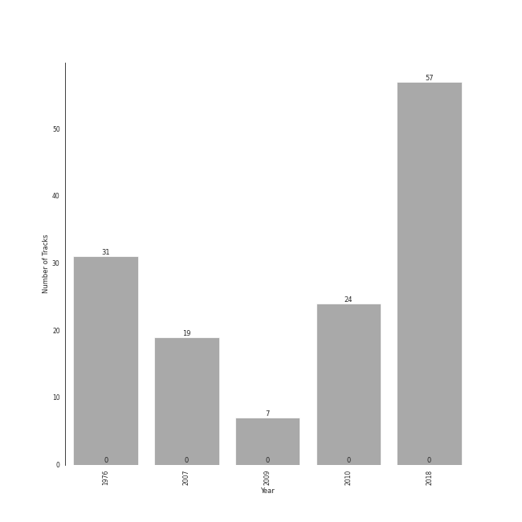

# Ballet

[138 tracks (0 liked) 🔗](https://open.spotify.com/playlist/23temGx5UrTk2wboAvEb0v)

[See Track Features](audio_features.md)

[See Clusters](clusters/overview.md)

## Top Artists

| Art | Rank | Tracks | 💚 | Artist | 🔗 |
|:---|---:|---:|---:|:---|:---|
|  | 405 | 55 | 0 | [Pyotr Ilyich Tchaikovsky](../../artists/pyotr_ilyich_tchaikovsky/overview.md) | [🔗](https://open.spotify.com/artist/3MKCzCnpzw3TjUYs2v7vDA) |
|  | 405 | 43 | 0 | [Berliner Philharmoniker](../../artists/berliner_philharmoniker/overview.md) | [🔗](https://open.spotify.com/artist/6uRJnvQ3f8whVnmeoecv5Z) |
|  | 405 | 39 | 0 | Igor Stravinsky | [🔗](https://open.spotify.com/artist/7ie36YytMoKtPiL7tUvmoE) |
|  | 405 | 39 | 0 | Barry Wordsworth | [🔗](https://open.spotify.com/artist/5sjJnaI3YhaO8KylpJk3gN) |
|  | 405 | 39 | 0 | Orchestra Victoria | [🔗](https://open.spotify.com/artist/1bnC6eJzCumTgAB7tG1118) |
|  | 405 | 39 | 0 | Léo Delibes | [🔗](https://open.spotify.com/artist/1M9AXZkNPdOd1IPEsQsXnT) |
|  | 405 | 31 | 0 | [London Symphony Orchestra](../../artists/london_symphony_orchestra/overview.md) | [🔗](https://open.spotify.com/artist/5yxyJsFanEAuwSM5kOuZKc) |
|  | 405 | 31 | 0 | André Previn | [🔗](https://open.spotify.com/artist/2tfWguHr2nj4e8KXLKciVq) |
|  | 405 | 24 | 0 | Sir Simon Rattle | [🔗](https://open.spotify.com/artist/4GQwgdcDQwqtcHICjUNndp) |
|  | 405 | 19 | 0 | [Herbert von Karajan](../../artists/herbert_von_karajan/overview.md) | [🔗](https://open.spotify.com/artist/5zCaQxjl110XTrm4LQ1CxY) |

See all 16 artists

| Art | Rank | Tracks | 💚 | Artist | 🔗 |
|:---|---:|---:|---:|:---|:---|
|  | 405 | 18 | 0 | Mariinsky Orchestra | [🔗](https://open.spotify.com/artist/2rRUfv2w535SEUV1YO5SP6) |
|  | 405 | 18 | 0 | Valery Gergiev | [🔗](https://open.spotify.com/artist/2LxnoYPOe0FCLC82R3xgO2) |
|  | 405 | 7 | 0 | Myung-Whun Chung | [🔗](https://open.spotify.com/artist/4hdiwtmc6OEFFxpSlwwmby) |
|  | 405 | 7 | 0 | Orchestre de l'Opéra National de Paris | [🔗](https://open.spotify.com/artist/1hro5WQTcOb7fRCEUQEZtK) |
|  | 405 | 5 | 0 | Béla Bartók | [🔗](https://open.spotify.com/artist/5zyNXVd952fWOjkdGHCvPd) |
|  | 405 | 1 | 0 | Libera | [🔗](https://open.spotify.com/artist/235C4ktJ2aGIyqaBlXyg7e) |

## Top Tracks

Most and least listened tracks

| Rank | ​ | Most listened tracks | Rank | ​​ | Least listened tracks |
|---:|:---|:---|---:|:---|:---|
| 874 |  | Jeu de cartes: II. Second Deal | 874 |  | Coppélia / Tableau 3: No. 20 Fête de la cloche: V. L'hymen (Noce villageoise) |
| 874 |  | Coppélia / Tableau 1: No. 4 Scène | 874 |  | [Tchaikovsky: The Nutcracker, Op. 71, Act II: No. 12c, Divertissement. Tea, Chinese Dance](../../artists/pyotr_ilyich_tchaikovsky/overview.md) |
| 874 |  | The Rite of Spring, K15, Pt. 1: IV. Spring Rounds | 874 |  | [Tchaikovsky: Swan Lake, Op. 20, Act 3, Appendix I: Pas de deux](../../artists/pyotr_ilyich_tchaikovsky/overview.md) |
| 874 |  | [Tchaikovsky: The Nutcracker, Op. 71, Act I: No. 2, March](../../artists/pyotr_ilyich_tchaikovsky/overview.md) | 874 |  | [Tchaikovsky: The Nutcracker, Op. 71, Act I, Scene 1: No. 1, Decoration of the Christmas Tree](../../artists/pyotr_ilyich_tchaikovsky/overview.md) |
| 874 |  | Coppélia / Tableau 3: No. 20 Fête de la cloche: IV. Le travail (La fileuse) | 874 |  | [Tchaikovsky: Swan Lake, Op. 20, Act 1: No. 2, Waltz](../../artists/pyotr_ilyich_tchaikovsky/overview.md) |
| 874 |  | [Tchaikovsky: The Nutcracker, Op. 71, Act 2: No. 13, Waltz of the Flowers](../../artists/pyotr_ilyich_tchaikovsky/overview.md) | 874 |  | Coppélia / Tableau 2: No. 18 Scène (Final) |
| 874 |  | [Tchaikovsky: Swan Lake, Op. 20, Act 3, Appendix II: No. 20a, Russian Dance](../../artists/pyotr_ilyich_tchaikovsky/overview.md) | 874 |  | Coppélia / Tableau 2: No. 12 Scène |
| 874 |  | Coppélia / Tableau 2: No. 9 Scène | 874 |  | [Tchaikovsky: The Nutcracker, Op. 71, Act II: No. 10, The Enchanted Palace of Confiturembourg, the Kingdom of Sweets](../../artists/pyotr_ilyich_tchaikovsky/overview.md) |
| 874 |  | [Tchaikovsky: The Nutcracker, Op. 71, Act II: No. 14b, Pas de deux. Variation I "Tarantella"](../../artists/pyotr_ilyich_tchaikovsky/overview.md) | 874 |  | [Tchaikovsky: The Nutcracker, Op. 71, Act I, Scene 1: No. 5, Scene and Grandfather Dance](../../artists/pyotr_ilyich_tchaikovsky/overview.md) |
| 874 |  | Coppélia / Tableau 2: No. 15 Scène | 874 |  | Sylvia / Act 2: No. 12 Chant bachique |

## Top Albums

| Art | Rank | Tracks | 💚 | Album | Release Date | 🔗 |
|:---|---:|---:|---:|:---|:---|:---|
|  | 586 | 39 | 0 | Coppélia | 2018-07-06 | [🔗](https://open.spotify.com/album/7jKT8NC2XfAs9RFKsrGz2p) |
|  | 586 | 31 | 0 | Tchaikovsky: Swan Lake | 1976-01-01 | [🔗](https://open.spotify.com/album/7dVA06E7AP7P7VzPyNxQVO) |
|  | 586 | 24 | 0 | Tchaikovsky: The Nutcracker | 2010-10-11 | [🔗](https://open.spotify.com/album/54Awn36ryf55PkZyOR4iwQ) |
|  | 586 | 19 | 0 | Stravinsky: The Rite of Spring / Bartók: Concerto for Orchestra | 2007-01-01 | [🔗](https://open.spotify.com/album/317b74rpNBO2uhaJFyMaxJ) |
|  | 586 | 18 | 0 | Stravinsky: Petrushka, Jeu de cartes | 2018-10-19 | [🔗](https://open.spotify.com/album/19fQbFNjlfXgBAFqftKzWA) |
|  | 586 | 7 | 0 | Stravinsky: The Firebird (Ballet Suite) | 2009-01-01 | [🔗](https://open.spotify.com/album/2q1xMRl4AcA7rI8GfGnmvD) |

## Top Record Labels

| Tracks | 💚 | Label |
|---:|---:|:---|
| 55 | 0 | [Warner Classics](../../labels/warner_classics/overview.md) |
| 39 | 0 | [Australian Broadcasting Corp (ABC)](../../labels/australian_broadcasting_corp_(abc)/overview.md) |
| 26 | 0 | [Deutsche Grammophon (DG)](../../labels/deutsche_grammophon_(dg)/overview.md) |
| 18 | 0 | [Mariinsky](../../labels/mariinsky/overview.md) |

## Genres

| Tracks | 💚 | Genre |
|---:|---:|:---|
| 138 | 0 | [classical](../../genres/classical/overview.md) |
| 94 | 0 | [late romantic era](../../genres/late_romantic_era/overview.md) |
| 55 | 0 | [russian romanticism](../../genres/russian_romanticism/overview.md) |
| 44 | 0 | [neoclassicism](../../genres/neoclassicism/overview.md) |
| 44 | 0 | [early modern classical](../../genres/early_modern_classical/overview.md) |
| 39 | 0 | [russian modern classical](../../genres/russian_modern_classical/overview.md) |
| 39 | 0 | french romanticism |
| 39 | 0 | french opera |

## Years

View all years

| Year | Number of Tracks |
|:---|---:|
| [2018](2018/overview.md) | 57 |
| [2010](2010/overview.md) | 24 |
| 2009 | 7 |
| 2007 | 19 |
| [1976](1976/overview.md) | 31 |

| ​ | 10 newest albums | ​​ | 10 oldest albums |
|:---|:---|:---|:---|
|  | Stravinsky: Petrushka, Jeu de cartes (2018-10-19) |  | Tchaikovsky: Swan Lake (1976-01-01) |
|  | Coppélia (2018-07-06) |  | Stravinsky: The Rite of Spring / Bartók: Concerto for Orchestra (2007-01-01) |
|  | Tchaikovsky: The Nutcracker (2010-10-11) |  | Stravinsky: The Firebird (Ballet Suite) (2009-01-01) |
|  | Stravinsky: The Firebird (Ballet Suite) (2009-01-01) |  | Tchaikovsky: The Nutcracker (2010-10-11) |
|  | Stravinsky: The Rite of Spring / Bartók: Concerto for Orchestra (2007-01-01) |  | Coppélia (2018-07-06) |
|  | Tchaikovsky: Swan Lake (1976-01-01) |  | Stravinsky: Petrushka, Jeu de cartes (2018-10-19) |