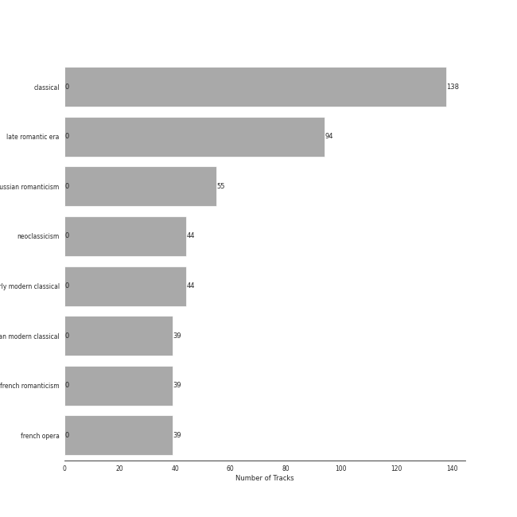

# Ballet

[138 songs (0 liked)](tracks.md)

## Top Artists

| Art | Tracks | 💚 | Artist | 🔗 |
|:---|---:|---:|:---|:---|
|  | 55 | 0 | Pyotr Ilyich Tchaikovsky | [🔗](https://open.spotify.com/artist/3MKCzCnpzw3TjUYs2v7vDA) |
|  | 43 | 0 | Berliner Philharmoniker | [🔗](https://open.spotify.com/artist/6uRJnvQ3f8whVnmeoecv5Z) |
|  | 39 | 0 | Igor Stravinsky | [🔗](https://open.spotify.com/artist/7ie36YytMoKtPiL7tUvmoE) |
|  | 39 | 0 | Barry Wordsworth | [🔗](https://open.spotify.com/artist/5sjJnaI3YhaO8KylpJk3gN) |
|  | 39 | 0 | Orchestra Victoria | [🔗](https://open.spotify.com/artist/1bnC6eJzCumTgAB7tG1118) |
|  | 39 | 0 | Léo Delibes | [🔗](https://open.spotify.com/artist/1M9AXZkNPdOd1IPEsQsXnT) |
|  | 31 | 0 | London Symphony Orchestra | [🔗](https://open.spotify.com/artist/5yxyJsFanEAuwSM5kOuZKc) |
|  | 31 | 0 | André Previn | [🔗](https://open.spotify.com/artist/2tfWguHr2nj4e8KXLKciVq) |
|  | 24 | 0 | Sir Simon Rattle | [🔗](https://open.spotify.com/artist/4GQwgdcDQwqtcHICjUNndp) |
|  | 19 | 0 | Herbert von Karajan | [🔗](https://open.spotify.com/artist/5zCaQxjl110XTrm4LQ1CxY) |

See all 16 artists

| Art | Tracks | 💚 | Artist | 🔗 |
|:---|---:|---:|:---|:---|
|  | 18 | 0 | Mariinsky Orchestra | [🔗](https://open.spotify.com/artist/2rRUfv2w535SEUV1YO5SP6) |
|  | 18 | 0 | Valery Gergiev | [🔗](https://open.spotify.com/artist/2LxnoYPOe0FCLC82R3xgO2) |
|  | 7 | 0 | Orchestre de l’Opéra national de Paris | [🔗](https://open.spotify.com/artist/6qe7dVv9gojPhhrZDL1TUS) |
|  | 7 | 0 | Myung-Whun Chung | [🔗](https://open.spotify.com/artist/4hdiwtmc6OEFFxpSlwwmby) |
|  | 5 | 0 | Béla Bartók | [🔗](https://open.spotify.com/artist/5zyNXVd952fWOjkdGHCvPd) |
|  | 1 | 0 | Libera | [🔗](https://open.spotify.com/artist/235C4ktJ2aGIyqaBlXyg7e) |

## Top Albums

| Art | Tracks | 💚 | Album | Release Date | 🔗 |
|:---|---:|---:|:---|:---|:---|
|  | 39 | 0 | Coppélia | 2018-07-06 | [🔗](https://open.spotify.com/album/7jKT8NC2XfAs9RFKsrGz2p) |
|  | 31 | 0 | Tchaikovsky: Swan Lake | 1976 | [🔗](https://open.spotify.com/album/7dVA06E7AP7P7VzPyNxQVO) |
|  | 24 | 0 | Tchaikovsky: The Nutcracker | 2010-10-11 | [🔗](https://open.spotify.com/album/54Awn36ryf55PkZyOR4iwQ) |
|  | 19 | 0 | Stravinsky: The Rite of Spring / Bartók: Concerto for Orchestra | 2007-01-01 | [🔗](https://open.spotify.com/album/317b74rpNBO2uhaJFyMaxJ) |
|  | 18 | 0 | Stravinsky: Petrushka, Jeu de cartes | 2018-10-19 | [🔗](https://open.spotify.com/album/19fQbFNjlfXgBAFqftKzWA) |
|  | 7 | 0 | Stravinsky: The Firebird (Ballet Suite) | 2009-01-01 | [🔗](https://open.spotify.com/album/2q1xMRl4AcA7rI8GfGnmvD) |

## Top Record Labels

| Tracks | 💚 | Label |
|---:|---:|:---|
| 55 | 0 | [Warner Classics](../../labels/warner_classics/overview.md) |
| 39 | 0 | [Australian Broadcasting Corp (ABC)](../../labels/australian_broadcasting_corp__abc_/overview.md) |
| 26 | 0 | [Deutsche Grammophon (DG)](../../labels/deutsche_grammophon__dg_/overview.md) |
| 18 | 0 | [Mariinsky](../../labels/mariinsky/overview.md) |

## Genres

| Tracks | 💚 | Genre |
|---:|---:|:---|
| 138 | 0 | classical |
| 94 | 0 | late romantic era |
| 55 | 0 | russian romanticism |
| 44 | 0 | neoclassicism |
| 44 | 0 | early modern classical |
| 39 | 0 | russian modern classical |
| 39 | 0 | french romanticism |
| 39 | 0 | french opera |

## Years

View all years

| Year | Number of Tracks |
|:---|---:|
| [2018](2018.md) | 57 |
| [2010](2010.md) | 24 |
| 2009 | 7 |
| 2007 | 19 |
| [1976](1976.md) | 31 |

| 10 newest albums | 10 oldest albums |
|:---|:---|
| 
 Stravinsky: Petrushka, Jeu de cartes (2018-10-19)
 | 
 Tchaikovsky: Swan Lake (1976)
 |
| 
 Coppélia (2018-07-06)
 | 
 Stravinsky: The Rite of Spring / Bartók: Concerto for Orchestra (2007-01-01)
 |
| 
 Tchaikovsky: The Nutcracker (2010-10-11)
 | 
 Stravinsky: The Firebird (Ballet Suite) (2009-01-01)
 |
| 
 Stravinsky: The Firebird (Ballet Suite) (2009-01-01)
 | 
 Tchaikovsky: The Nutcracker (2010-10-11)
 |
| 
 Stravinsky: The Rite of Spring / Bartók: Concerto for Orchestra (2007-01-01)
 | 
 Coppélia (2018-07-06)
 |
| 
 Tchaikovsky: Swan Lake (1976)
 | 
 Stravinsky: Petrushka, Jeu de cartes (2018-10-19)
 |
## Audio Features

| 10 most Danceable tracks | 10 least Danceable tracks |
|:---|:---|
| Coppélia / Tableau 2: No. 16 Boléro - Alternative Version (0.661) | The Firebird (L'oiseau De Feu) - Suite (1919): Round Dance Of The Princesses (0.0797) |
| Coppélia / Tableau 2: No. 11a Musique des automates (0.648) | The Firebird (L'oiseau De Feu) - Suite (1919): Introduction (0.083) |
| Coppélia / Tableau 2: No. 17 Gigue (0.604) | Coppélia / Tableau 3: No. 20 Fête de la cloche: VII. La paix (0.0877) |
| Le Sacre du Printemps - Revised version for Orchestra (published 1947) / Part 2: The Sacrifice: Sacrificial Dance (The Chosen One) (0.59) | Tchaikovsky: Swan Lake, Op. 20, Act II: No. 14, Scene. Moderato (0.0958) |
| Petrushka: Third Scene: II. Dance of the Ballerina (1911 original version) (0.58) | Le Sacre du Printemps - Revised version for Orchestra (published 1947) / Part 2: The Sacrifice: Mystic Circles of the Young Girls (0.108) |
| Coppélia / Tableau 3: No. 20 Fête de la cloche: IV. Le travail (La fileuse) (0.568) | Concerto for Orchestra, Sz. 116: 3. Elegia (Andante, non troppo) (0.112) |
| Coppélia / Tableau 3: No. 20 Fête de la cloche: V. L'hymen (Noce villageoise) (0.551) | The Firebird (L'oiseau De Feu) - Suite (1919): Finale (0.123) |
| Coppélia / Tableau 3: No. 20 Fête de la cloche: VI. La discorde et la guerre - Alternative Version (0.55) | Tchaikovsky: The Nutcracker, Op. 71, Act II: No. 10, The Enchanted Palace of Confiturembourg, the Kingdom of Sweets (0.124) |
| Coppélia / Tableau 3: No. 20 Fête de la cloche: VIII. Danse de fête (0.542) | Tchaikovsky: The Nutcracker, Op. 71, Act II: No. 12b, Divertissement. Coffee, Arabian Dance (0.13) |
| Le Sacre du Printemps - Revised version for Orchestra (published 1947) / Part 2: The Sacrifice: Evocation of the Ancestors (0.539) | Tchaikovsky: Swan Lake, Op. 20, Act II: No. 10, Scene. Moderato (0.136) |

| 10 most Energetic tracks | 10 least Energetic tracks |
|:---|:---|
| Le Sacre du Printemps - Revised version for Orchestra (published 1947) / Part 1: The Adoration of the Earth: Procession of the Sage (0.7) | Le Sacre du Printemps - Revised version for Orchestra (published 1947) / Part 1: The Adoration of the Earth: The Sage (0.000239) |
| Le Sacre du Printemps - Revised version for Orchestra (published 1947) / Part 1: The Adoration of the Earth: Ritual of Abduction (0.555) | The Firebird (L'oiseau De Feu) - Suite (1919): Introduction (0.00108) |
| Le Sacre du Printemps - Revised version for Orchestra (published 1947) / Part 1: The Adoration of the Earth: Dance of the Earth (0.509) | Coppélia / Tableau 2: No. 9 Scène (0.00262) |
| Tchaikovsky: The Nutcracker, Op. 71, Act II: No. 12d, Divertissement. Trepak, Russian Dance (0.5) | Coppélia / Tableau 3: No. 20 Fête de la cloche: VII. La paix (0.0039) |
| Tchaikovsky: Swan Lake, Op. 20, Act III: No. 15, Scene. March - Allegro giusto (0.474) | The Firebird (L'oiseau De Feu) - Suite (1919): Berceuse (0.00403) |
| Le Sacre du Printemps - Revised version for Orchestra (published 1947) / Part 2: The Sacrifice: Sacrificial Dance (The Chosen One) (0.46) | Tchaikovsky: The Nutcracker, Op. 71, Act II: No. 12b, Divertissement. Coffee, Arabian Dance (0.00478) |
| Petrushka: Fourth Scene: I. The Shrovetide Fair (towards evening) (1911 original version) (0.453) | Tchaikovsky: Swan Lake, Op. 20, Act IV: No. 25, Entr'acte (0.00606) |
| Le Sacre du Printemps - Revised version for Orchestra (published 1947) / Part 2: The Sacrifice: Glorification of the Chosen One (0.447) | The Firebird (L'oiseau De Feu) - Suite (1919): Round Dance Of The Princesses (0.00617) |
| Le Sacre du Printemps - Revised version for Orchestra (published 1947) / Part 1: The Adoration of the Earth: Ritual of the Rival Tribes (0.435) | Coppélia / Tableau 1: No. 5 Ballade (0.00661) |
| Tchaikovsky: Swan Lake, Op. 20, Act I: No. 8, Dance with Goblets (0.391) | Coppélia / Tableau 2: No. 14a Scène (0.00699) |

| 10 most Speechy tracks | 10 least Speechy tracks |
|:---|:---|
| The Firebird (L'oiseau De Feu) - Suite (1919): Dance Of The Firebird (0.167) | Le Sacre du Printemps - Revised version for Orchestra (published 1947) / Part 1: The Adoration of the Earth: Dance of the Earth (0.0292) |
| Le Sacre du Printemps - Revised version for Orchestra (published 1947) / Part 2: The Sacrifice: Glorification of the Chosen One (0.0935) | Le Sacre du Printemps - Revised version for Orchestra (published 1947) / Part 1: The Adoration of the Earth: The Augurs of Spring: Dances of the Young Girls (0.0293) |
| Petrushka: Fourth Scene: VI. The Mummers (1911 original version) (0.083) | Petrushka: Fourth Scene: III. A Peasant Enters with a Bear (1911 original version) (0.0313) |
| Coppélia / Tableau 3: No. 20 Fête de la cloche: VIII. Danse de fête (0.0818) | Le Sacre du Printemps - Revised version for Orchestra (published 1947) / Part 2: The Sacrifice: Ritual Action of the Ancestors (0.0319) |
| Coppélia / Tableau 1: No. 4 Scène (0.0766) | Tchaikovsky: The Nutcracker, Op. 71, Act II: No. 14b, Pas de deux. Variation I "Tarantella" (0.0332) |
| Le Sacre du Printemps - Revised version for Orchestra (published 1947) / Part 2: The Sacrifice: Sacrificial Dance (The Chosen One) (0.0741) | Tchaikovsky: The Nutcracker, Op. 71, Act II: No. 12c, Divertissement. Tea, Chinese Dance (0.0338) |
| Coppélia / Tableau 3: No. 20 Fête de la cloche: VIII. Danse de fête - Alternative Version (0.0716) | Tchaikovsky: Swan Lake, Op. 20, Act III: No. 18, Scene. Allegro - Allegro giusto (0.034) |
| The Firebird (L'oiseau De Feu) - Suite (1919): Infernal Dance Of King Kaschei (0.0689) | Coppélia / Tableau 3: No. 20 Fête de la cloche: IV. Le travail (La fileuse) (0.0342) |
| Tchaikovsky: Swan Lake, Op. 20, Act III: No. 22, Neapolitan Dance (0.0675) | Tchaikovsky: Swan Lake, Op. 20, Act I: No. 7, Sujet (0.0343) |
| Tchaikovsky: The Nutcracker, Op. 71, Act I, Scene 1: No. 7, The Battle (0.0664) | Tchaikovsky: Swan Lake, Op. 20, Act III: No. 21, Spanish Dance (0.0345) |

| 10 most Acoustic tracks | 10 least Acoustic tracks |
|:---|:---|
| Coppélia / Tableau 3: No. 20 Fête de la cloche: IV. Le travail (La fileuse) (0.99) | Tchaikovsky: The Nutcracker, Op. 71, Act II: No. 12a, Divertissement. Chocolate, Spanish Dance (0.583) |
| Coppélia / Tableau 3: No. 20 Fête de la cloche: V. L'hymen (Noce villageoise) (0.987) | Le Sacre du Printemps - Revised version for Orchestra (published 1947) / Part 1: The Adoration of the Earth: The Sage (0.591) |
| Tchaikovsky: Swan Lake, Op. 20, Act IV: No. 27, Dance of the Little Swans (0.987) | Le Sacre du Printemps - Revised version for Orchestra (published 1947) / Part 1: The Adoration of the Earth: Procession of the Sage (0.612) |
| Coppélia / Tableau 2: Entr'acte (0.986) | Le Sacre du Printemps - Revised version for Orchestra (published 1947) / Part 1: The Adoration of the Earth: Dance of the Earth (0.712) |
| Coppélia / Tableau 2: No. 12 Scène (0.985) | The Firebird (L'oiseau De Feu) - Suite (1919): Finale (0.73) |
| La Source / Act 2: No. 22 Mazurka (0.984) | Le Sacre du Printemps - Revised version for Orchestra (published 1947) / Part 2: The Sacrifice: Sacrificial Dance (The Chosen One) (0.802) |
| Coppélia / Tableau 1: No. 2 Scène (0.983) | Tchaikovsky: Swan Lake, Op. 20, Act I: No. 8, Dance with Goblets (0.813) |
| Petrushka: Fourth Scene: III. A Peasant Enters with a Bear (1911 original version) (0.983) | Coppélia / Tableau 2: No. 11a Musique des automates (0.817) |
| Coppélia / Tableau 1: No. 7 Czárdás (0.982) | Petrushka: First Scene: III. The Conjuring Trick (1911 original version) (0.817) |
| Coppélia / Tableau 2: No. 10 Scène (0.982) | Petrushka: Fourth Scene: VII. Petrushka's Death (1911 original version) (0.82) |

| 10 most Instrumental tracks | 10 least Instrumental tracks |
|:---|:---|
| Tchaikovsky: Swan Lake, Op. 20, Act IV: No. 26, Scene. Allegro ma non troppo (0.978) | Le Sacre du Printemps - Revised version for Orchestra (published 1947) / Part 1: The Adoration of the Earth: The Sage (0.000308) |
| Le Sacre du Printemps - Revised version for Orchestra (published 1947) / Part 1: The Adoration of the Earth: Introduction (0.972) | Petrushka: First Scene: III. The Conjuring Trick (1911 original version) (0.000393) |
| Tchaikovsky: The Nutcracker, Op. 71, Act II: No. 14a, Pas de deux. Andante maestoso (0.954) | Coppélia / Tableau 2: No. 14a Scène (0.00519) |
| The Firebird (L'oiseau De Feu) - Suite (1919): Dance Of The Firebird (0.951) | Petrushka: Fourth Scene: VII. Petrushka's Death (1911 original version) (0.00603) |
| Le Sacre du Printemps - Revised version for Orchestra (published 1947) / Part 1: The Adoration of the Earth: Ritual of Abduction (0.945) | Coppélia / Tableau 3: No. 20 Fête de la cloche: II. L'aurore (0.0197) |
| Petrushka: Fourth Scene: II. Dance of the Wet-Nurses (1911 original version) (0.945) | Coppélia / Tableau 2: No. 17 Gigue (0.0246) |
| Tchaikovsky: The Nutcracker, Op. 71, Act II: No. 15, Final Waltz and Apotheosis (0.944) | Coppélia / Tableau 3: No. 20 Fête de la cloche: VIII. Danse de fête - Alternative Version (0.039) |
| Coppélia / Tableau 1: No. 7a Sortie (0.942) | Coppélia / Tableau 3: No. 20 Fête de la cloche: VIII. Danse de fête (0.0474) |
| Petrushka: First Scene: I. The Shrovetide Fair (Introduction) (1911 original version) (0.941) | The Firebird (L'oiseau De Feu) - Suite (1919): 3. Variation Of The Firebird (0.054) |
| Tchaikovsky: The Nutcracker, Op. 71, Act II: No. 12e, Divertissement. Dance of the Reed-Flutes (0.94) | Coppélia / Tableau 3: No. 20 Fête de la cloche: VII. La paix (0.0544) |

| 10 most Live tracks | 10 least Live tracks |
|:---|:---|
| The Firebird (L'oiseau De Feu) - Suite (1919): 3. Variation Of The Firebird (0.743) | Coppélia / Tableau 2: No. 14a Scène (0.0555) |
| Le Sacre du Printemps - Revised version for Orchestra (published 1947) / Part 1: The Adoration of the Earth: The Augurs of Spring: Dances of the Young Girls (0.669) | Tchaikovsky: The Nutcracker, Op. 71: Miniature Overture (0.0557) |
| Tchaikovsky: The Nutcracker, Op. 71, Act I, Scene 1: No. 3, Children's Galop and Entry of the Parents (0.578) | Tchaikovsky: Swan Lake, Op. 20, Act I: No. 4, Pas de trois (0.0595) |
| Tchaikovsky: Swan Lake, Op. 20, Act III: No. 18, Scene. Allegro - Allegro giusto (0.565) | Coppélia / Tableau 1: No. 5 Ballade (0.0601) |
| Petrushka: First Scene: IV. Russian Dance (1911 original version) (0.558) | The Firebird (L'oiseau De Feu) - Suite (1919): Finale (0.0658) |
| Petrushka: Fourth Scene: V. Dance of the Coachmen and Grooms (1911 original version) (0.537) | Le Sacre du Printemps - Revised version for Orchestra (published 1947) / Part 1: The Adoration of the Earth: Introduction (0.0674) |
| Petrushka: Fourth Scene: I. The Shrovetide Fair (towards evening) (1911 original version) (0.505) | Coppélia / Tableau 3: No. 19 Marche de la cloche (0.0678) |
| Tchaikovsky: Swan Lake, Op. 20, Act II: No. 11, Scene. Allegro moderato - Moderato - Allegro vivo (0.486) | Coppélia / Tableau 3: No. 20 Fête de la cloche: VIII. Danse de fête - Alternative Version (0.0694) |
| Tchaikovsky: Swan Lake, Op. 20, Act III, Appendix II: No. 20a, Russian Dance (0.421) | Coppélia / Tableau 2: No. 9 Scène (0.0701) |
| Tchaikovsky: Swan Lake, Op. 20, Act IV: No. 28, Scene. Allegro agitato (0.373) | Tchaikovsky: The Nutcracker, Op. 71, Act II: No. 13, Waltz of the Flowers (0.0703) |

| 10 most Happy tracks | 10 least Happy tracks |
|:---|:---|
| Petrushka: Third Scene: II. Dance of the Ballerina (1911 original version) (0.907) | Le Sacre du Printemps - Revised version for Orchestra (published 1947) / Part 1: The Adoration of the Earth: The Sage (0.0) |
| Tchaikovsky: The Nutcracker, Op. 71, Act II: No. 12a, Divertissement. Chocolate, Spanish Dance (0.879) | The Firebird (L'oiseau De Feu) - Suite (1919): Dance Of The Firebird (0.0) |
| Tchaikovsky: The Nutcracker, Op. 71, Act II: No. 12d, Divertissement. Trepak, Russian Dance (0.851) | Concerto for Orchestra, Sz. 116: 3. Elegia (Andante, non troppo) (0.0312) |
| Tchaikovsky: The Nutcracker, Op. 71, Act II: No. 12c, Divertissement. Tea, Chinese Dance (0.832) | Tchaikovsky: The Nutcracker, Op. 71, Act II: No. 12b, Divertissement. Coffee, Arabian Dance (0.037) |
| Coppélia / Tableau 2: No. 11a Musique des automates (0.728) | Le Sacre du Printemps - Revised version for Orchestra (published 1947) / Part 1: The Adoration of the Earth: Introduction (0.037) |
| Petrushka: Fourth Scene: II. Dance of the Wet-Nurses (1911 original version) (0.657) | Petrushka: Fourth Scene: VII. Petrushka's Death (1911 original version) (0.0377) |
| Tchaikovsky: Swan Lake, Op. 20, Act III: No. 22, Neapolitan Dance (0.641) | Petrushka: Fourth Scene: III. A Peasant Enters with a Bear (1911 original version) (0.0379) |
| Tchaikovsky: The Nutcracker, Op. 71, Act I, Scene 1: No. 3, Children's Galop and Entry of the Parents (0.639) | Concerto for Orchestra, Sz. 116: 1. Introduzione (Andante non troppo - Allegro vivace (0.0379) |
| Coppélia / Tableau 2: No. 16 Boléro - Alternative Version (0.615) | Le Sacre du Printemps - Revised version for Orchestra (published 1947) / Part 2: The Sacrifice: Introduction (0.0385) |
| Coppélia / Tableau 3: No. 20 Fête de la cloche: V. L'hymen (Noce villageoise) (0.598) | Coppélia / Tableau 3: No. 20 Fête de la cloche: III. La prière (0.0386) |
