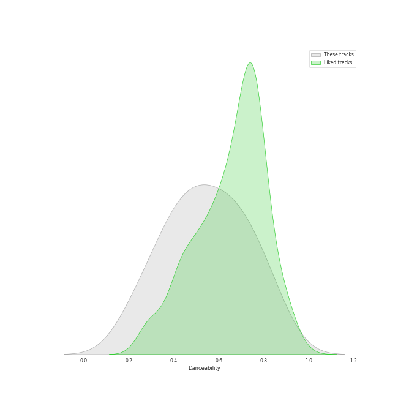
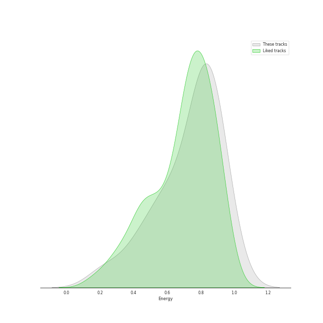
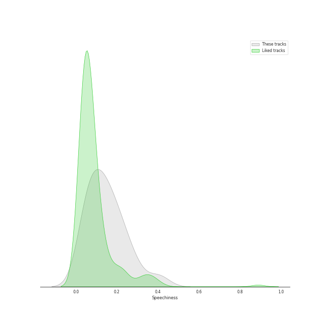
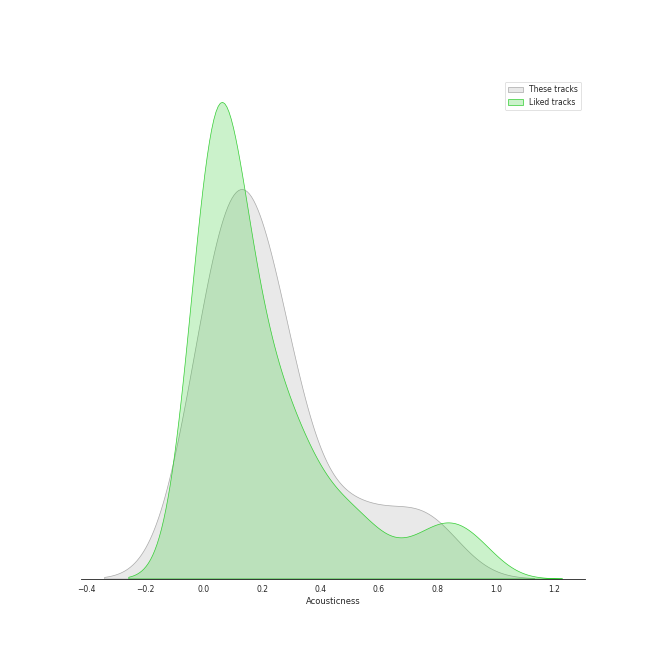
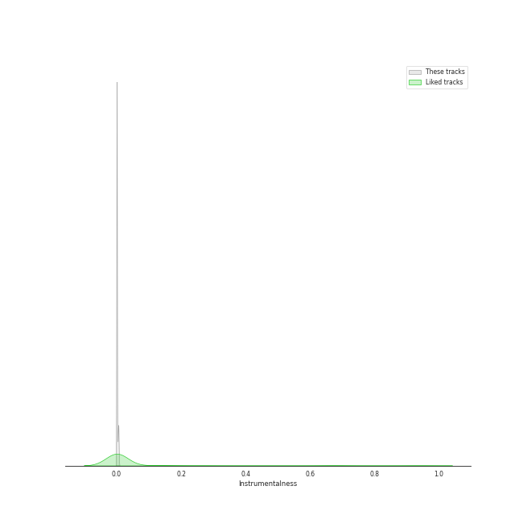
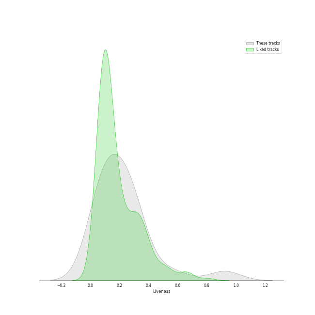
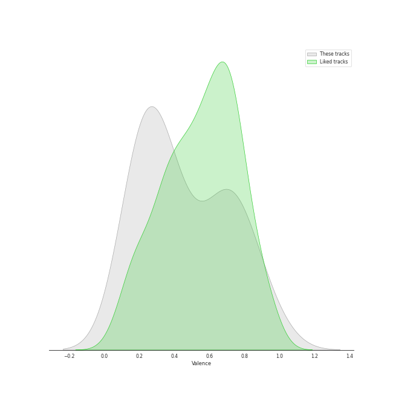
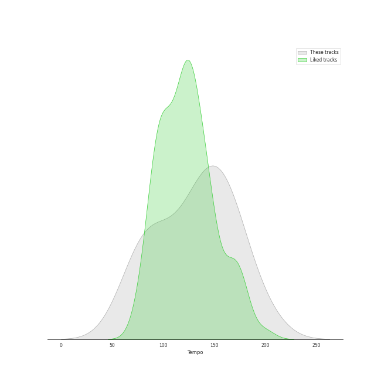

# Track Features for Beat Drop!

## Danceability

| ​ | 10 most Danceable tracks | ​​ | 10 least Danceable tracks |
|:---|:---|:---|:---|
|  | Soñar (Breaker) (0.86) |  | Paranoid Android (0.251) |
|  | Next Level (0.82) |  | Happier Than Ever (0.332) |
|  | KARMA (0.772) |  | A Day In The Life - Remastered 2009 (0.364) |
|  | Savage (0.727) |  | O.O (0.389) |
|  | ♡Like Like♡ (prod. TAK & Giga) (0.715) |  | Bohemian Rhapsody (0.397) |
|  | Sculpture (0.65) |  | STRANGER (0.475) |
|  | DASH (0.645) |  | United In Grief (0.529) |
|  | Lucky Girl (0.6) |  | DICE (0.557) |
|  | DICE (0.557) |  | Lucky Girl (0.6) |
|  | United In Grief (0.529) |  | DASH (0.645) |

## Energy

| ​ | 10 most Energetic tracks | ​​ | 10 least Energetic tracks |
|:---|:---|:---|:---|
|  | ♡Like Like♡ (prod. TAK & Giga) (0.955) |  | Happier Than Ever (0.225) |
|  | KARMA (0.927) |  | Bohemian Rhapsody (0.386) |
|  | Savage (0.879) |  | A Day In The Life - Remastered 2009 (0.457) |
|  | Next Level (0.852) |  | STRANGER (0.581) |
|  | Paranoid Android (0.848) |  | Sculpture (0.629) |
|  | United In Grief (0.845) |  | Soñar (Breaker) (0.762) |
|  | DASH (0.83) |  | O.O (0.77) |
|  | Lucky Girl (0.828) |  | DICE (0.798) |
|  | DICE (0.798) |  | Lucky Girl (0.828) |
|  | O.O (0.77) |  | DASH (0.83) |

## Speechiness

| ​ | 10 most Speechy tracks | ​​ | 10 least Speechy tracks |
|:---|:---|:---|:---|
|  | United In Grief (0.404) |  | Happier Than Ever (0.0348) |
|  | O.O (0.297) |  | Bohemian Rhapsody (0.0503) |
|  | DICE (0.253) |  | Paranoid Android (0.0579) |
|  | KARMA (0.233) |  | A Day In The Life - Remastered 2009 (0.0675) |
|  | Lucky Girl (0.207) |  | STRANGER (0.1) |
|  | Next Level (0.166) |  | ♡Like Like♡ (prod. TAK & Giga) (0.115) |
|  | Sculpture (0.16) |  | Soñar (Breaker) (0.123) |
|  | DASH (0.138) |  | Savage (0.129) |
|  | Savage (0.129) |  | DASH (0.138) |
|  | Soñar (Breaker) (0.123) |  | Sculpture (0.16) |

## Acousticness

| ​ | 10 most Acoustic tracks | ​​ | 10 least Acoustic tracks |
|:---|:---|:---|:---|
|  | Happier Than Ever (0.767) |  | Lucky Girl (0.0299) |
|  | Next Level (0.488) |  | O.O (0.0368) |
|  | A Day In The Life - Remastered 2009 (0.29) |  | Paranoid Android (0.0377) |
|  | Bohemian Rhapsody (0.271) |  | DICE (0.0839) |
|  | United In Grief (0.244) |  | DASH (0.0843) |
|  | STRANGER (0.226) |  | Savage (0.124) |
|  | Soñar (Breaker) (0.201) |  | KARMA (0.126) |
|  | Sculpture (0.186) |  | ♡Like Like♡ (prod. TAK & Giga) (0.136) |
|  | ♡Like Like♡ (prod. TAK & Giga) (0.136) |  | Sculpture (0.186) |
|  | KARMA (0.126) |  | Soñar (Breaker) (0.201) |

## Instrumentalness

| ​ | 10 most Instrumental tracks | ​​ | 10 least Instrumental tracks |
|:---|:---|:---|:---|
|  | Paranoid Android (0.00591) |  | Lucky Girl (0.0) |
|  | Happier Than Ever (0.00349) |  | DASH (0.0) |
|  | ♡Like Like♡ (prod. TAK & Giga) (0.00039) |  | United In Grief (0.0) |
|  | A Day In The Life - Remastered 2009 (0.000106) |  | DICE (0.0) |
|  | KARMA (1.28e-05) |  | Soñar (Breaker) (0.0) |
|  | Savage (1.17e-05) |  | Bohemian Rhapsody (0.0) |
|  | Next Level (5.94e-06) |  | Sculpture (0.0) |
|  | O.O (3.79e-06) |  | STRANGER (3.78e-06) |
|  | STRANGER (3.78e-06) |  | O.O (3.79e-06) |
|  | Sculpture (0.0) |  | Next Level (5.94e-06) |

## Liveness

| ​ | 10 most Live tracks | ​​ | 10 least Live tracks |
|:---|:---|:---|:---|
|  | A Day In The Life - Remastered 2009 (0.922) |  | Paranoid Android (0.0545) |
|  | ♡Like Like♡ (prod. TAK & Giga) (0.557) |  | O.O (0.0598) |
|  | Lucky Girl (0.334) |  | DASH (0.0605) |
|  | DICE (0.302) |  | Soñar (Breaker) (0.082) |
|  | STRANGER (0.253) |  | Next Level (0.0907) |
|  | Savage (0.244) |  | Happier Than Ever (0.128) |
|  | KARMA (0.243) |  | United In Grief (0.143) |
|  | Sculpture (0.197) |  | Bohemian Rhapsody (0.188) |
|  | Bohemian Rhapsody (0.188) |  | Sculpture (0.197) |
|  | United In Grief (0.143) |  | KARMA (0.243) |

## Valence

| ​ | 10 most Happy tracks | ​​ | 10 least Happy tracks |
|:---|:---|:---|:---|
|  | ♡Like Like♡ (prod. TAK & Giga) (0.937) |  | A Day In The Life - Remastered 2009 (0.175) |
|  | Next Level (0.82) |  | Paranoid Android (0.207) |
|  | Soñar (Breaker) (0.787) |  | Bohemian Rhapsody (0.21) |
|  | KARMA (0.73) |  | Sculpture (0.261) |
|  | DASH (0.725) |  | O.O (0.295) |
|  | Savage (0.671) |  | Happier Than Ever (0.297) |
|  | Lucky Girl (0.66) |  | United In Grief (0.331) |
|  | DICE (0.63) |  | STRANGER (0.419) |
|  | STRANGER (0.419) |  | DICE (0.63) |
|  | United In Grief (0.331) |  | Lucky Girl (0.66) |

## Tempo

| ​ | 10 most Fast tracks | ​​ | 10 least Fast tracks |
|:---|:---|:---|:---|
|  | O.O (200.263) |  | STRANGER (62.644) |
|  | DASH (179.977) |  | Happier Than Ever (81.055) |
|  | Lucky Girl (169.758) |  | United In Grief (85.63) |
|  | Paranoid Android (163.709) |  | KARMA (96.014) |
|  | A Day In The Life - Remastered 2009 (163.219) |  | Next Level (109.036) |
|  | ♡Like Like♡ (prod. TAK & Giga) (150.002) |  | Sculpture (121.181) |
|  | Savage (146.959) |  | Soñar (Breaker) (125.074) |
|  | Bohemian Rhapsody (144.242) |  | DICE (131.085) |
|  | DICE (131.085) |  | Bohemian Rhapsody (144.242) |
|  | Soñar (Breaker) (125.074) |  | Savage (146.959) |
