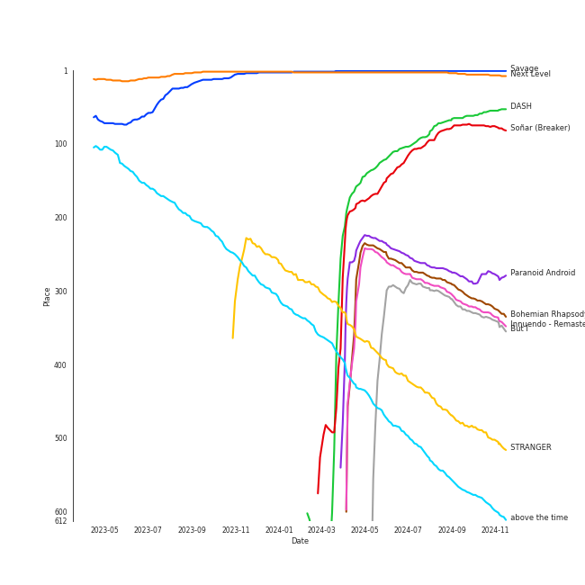
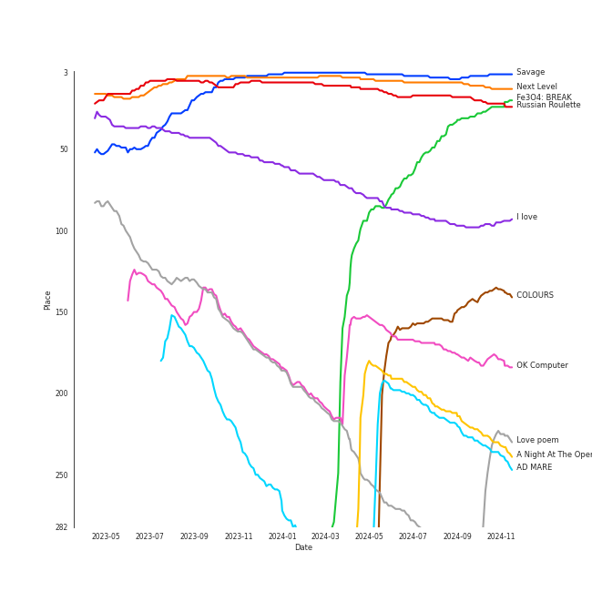
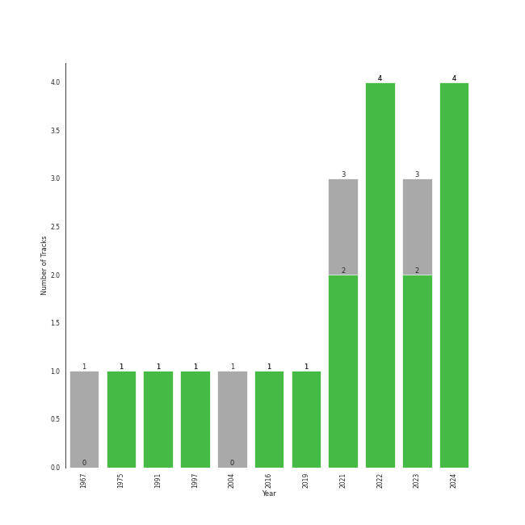

# Beat Drop!

[19 tracks (15 liked) 🔗](https://open.spotify.com/playlist/2CV3LAEvICWmWq3SEJw1my)

[See Track Features](audio_features.md)

[See Clusters](clusters/overview.md)

## Top Artists

| Art | Rank | Tracks | 💚 | Artist | 🔗 |
|:---|---:|---:|---:|:---|:---|
|  | 19 | 4 | 4 | [NMIXX](../../artists/nmixx/overview.md) | [🔗](https://open.spotify.com/artist/28ot3wh4oNmoFOdVajibBl) |
|  | 1 | 2 | 2 | [aespa](../../artists/aespa/overview.md) | [🔗](https://open.spotify.com/artist/6YVMFz59CuY7ngCxTxjpxE) |
|  | 48 | 2 | 2 | [Queen](../../artists/queen/overview.md) | [🔗](https://open.spotify.com/artist/1dfeR4HaWDbWqFHLkxsg1d) |
|  | 42 | 1 | 1 | [SUNMI](../../artists/sunmi/overview.md) | [🔗](https://open.spotify.com/artist/6MoXcK2GyGg7FIyxPU5yW6) |
|  | 65 | 1 | 1 | [Solar](../../artists/solar/overview.md) | [🔗](https://open.spotify.com/artist/5cYcI546S8Lf97m4mNdYLD) |
|  | 49 | 1 | 1 | [Radiohead](../../artists/radiohead/overview.md) | [🔗](https://open.spotify.com/artist/4Z8W4fKeB5YxbusRsdQVPb) |
|  | 298 | 1 | 1 | [Kendrick Lamar](../../artists/kendrick_lamar/overview.md) | [🔗](https://open.spotify.com/artist/2YZyLoL8N0Wb9xBt1NhZWg) |
|  | 6 | 1 | 1 | [(G)I-DLE](../../artists/(g)i-dle/overview.md) | [🔗](https://open.spotify.com/artist/2AfmfGFbe0A0WsTYm0SDTx) |
|  | 2 | 1 | 1 | [Red Velvet](../../artists/red_velvet/overview.md) | [🔗](https://open.spotify.com/artist/1z4g3DjTBBZKhvAroFlhOM) |
|  | 130 | 1 | 1 | PIXY | [🔗](https://open.spotify.com/artist/0CJkEzffVZLgav03xXeC9s) |

See all 16 artists

| Art | Rank | Tracks | 💚 | Artist | 🔗 |
|:---|---:|---:|---:|:---|:---|
|  | 44 | 1 | 0 | [Billie Eilish](../../artists/billie_eilish/overview.md) | [🔗](https://open.spotify.com/artist/6qqNVTkY8uBg9cP3Jd7DAH) |
|  | 156 | 1 | 0 | [TVXQ!](../../artists/tvxq!/overview.md) | [🔗](https://open.spotify.com/artist/6nVMMEywS5Y4tsHPKx1nIo) |
|  | 428 | 1 | 0 | Raon | [🔗](https://open.spotify.com/artist/6grPDYoluzn0yi8qloRKst) |
|  | 32 | 1 | 0 | [BoA](../../artists/boa/overview.md) | [🔗](https://open.spotify.com/artist/4muJrGMndyYWqZtfk8OWy4) |
|  | 61 | 1 | 0 | [The Beatles](../../artists/the_beatles/overview.md) | [🔗](https://open.spotify.com/artist/3WrFJ7ztbogyGnTHbHJFl2) |
|  | 428 | 1 | 0 | TRAX | [🔗](https://open.spotify.com/artist/05IXIcHMbO6RMnJ6uQPrmP) |

## Top Tracks

Most and least listened tracks

| Rank | ​ | Most listened tracks | Rank | ​​ | Least listened tracks |
|---:|:---|:---|---:|:---|:---|
| 1 |  | [Savage](../../artists/aespa/overview.md) | 966 |  | [Sculpture](../../artists/(g)i-dle/overview.md) |
| 5 |  | [Next Level](../../artists/aespa/overview.md) | 966 |  | [DICE](../../artists/nmixx/overview.md) |
| 69 |  | [DASH](../../artists/nmixx/overview.md) | 966 |  | [United In Grief](../../artists/kendrick_lamar/overview.md) |
| 75 |  | [Soñar (Breaker)](../../artists/nmixx/overview.md) | 966 |  | [TRI-ANGLE - Extended Version](../../artists/tvxq!/overview.md) |
| 290 |  | [Paranoid Android](../../artists/radiohead/overview.md) | 966 |  | [Happier Than Ever](../../artists/billie_eilish/overview.md) |
| 307 |  | [Bohemian Rhapsody - Remastered 2011](../../artists/queen/overview.md) | 966 |  | [O.O](../../artists/nmixx/overview.md) |
| 321 |  | [Innuendo - Remastered 2011](../../artists/queen/overview.md) | 966 |  | ♡Like Like♡ (prod. TAK & Giga) |
| 329 |  | [But I](../../artists/solar/overview.md) | 966 |  | [A Day In The Life - Remastered 2009](../../artists/the_beatles/overview.md) |
| 481 |  | [STRANGER](../../artists/sunmi/overview.md) | 638 |  | KARMA |
| 610 |  | [Lucky Girl](../../artists/red_velvet/overview.md) | 610 |  | [Lucky Girl](../../artists/red_velvet/overview.md) |

## Top Albums

| Art | Rank | Tracks | 💚 | Album | Release Date | 🔗 |
|:---|---:|---:|---:|:---|:---|:---|
|  | 32 | 2 | 2 | Fe3O4: BREAK | 2024-01-15 | [🔗](https://open.spotify.com/album/5CCxLQgcI7cVwmgFDlicbP) |
|  | 6 | 1 | 1 | Savage - The 1st Mini Album | 2021-10-05 | [🔗](https://open.spotify.com/album/3vyyDkvYWC36DwgZCYd3Wu) |
|  | 339 | 1 | 1 | STRANGER | 2023-10-17 | [🔗](https://open.spotify.com/album/5QUzffclUFjjFFZ1HmaB6X) |
|  | 19 | 1 | 1 | Russian Roulette - The 3rd Mini Album | 2016-09-07 | [🔗](https://open.spotify.com/album/6MNlcai3skKLKv5syzFwC3) |
|  | 186 | 1 | 1 | OK Computer | 1997-05-28 | [🔗](https://open.spotify.com/album/6dVIqQ8qmQ5GBnJ9shOYGE) |
|  | 9 | 1 | 1 | Next Level | 2021-05-17 | [🔗](https://open.spotify.com/album/2CzbrboOLzeRoaaH1N5K0N) |
|  | 639 | 1 | 1 | Mr. Morale & The Big Steppers | 2022-05-13 | [🔗](https://open.spotify.com/album/79ONNoS4M9tfIA1mYLBYVX) |
|  | 230 | 1 | 1 | Innuendo | 1991-02-04 | [🔗](https://open.spotify.com/album/3jYy7yGNCysTHE8MKrIF1k) |
|  | 96 | 1 | 1 | I love | 2022-10-17 | [🔗](https://open.spotify.com/album/2Hyuin3i1cSZ1FlQFeCPZH) |
|  | 639 | 1 | 1 | ENTWURF | 2022-09-19 | [🔗](https://open.spotify.com/album/3wMlxC4t3dN70e1OF8wUfz) |

See all 18 albums

| Art | Rank | Tracks | 💚 | Album | Release Date | 🔗 |
|:---|---:|---:|---:|:---|:---|:---|
|  | 148 | 1 | 1 | COLOURS | 2024-04-30 | [🔗](https://open.spotify.com/album/5Q1cKPuB4vPk8bIdfZH7Fm) |
|  | 430 | 1 | 1 | CHOSEN KARMA | 2023-03-10 | [🔗](https://open.spotify.com/album/0S6Yq3EcpbHhj1r0cuYChA) |
|  | 229 | 1 | 1 | AD MARE | 2022-02-22 | [🔗](https://open.spotify.com/album/2QbA97qjlAs81t6kVS6zBk) |
|  | 223 | 1 | 1 | A Night At The Opera (Deluxe Remastered Version) | 1975-11-21 | [🔗](https://open.spotify.com/album/6X9k3hSsvQck2OfKYdBbXr) |
|  | 639 | 1 | 0 | ♡Like Like♡ | 2023-03-15 | [🔗](https://open.spotify.com/album/1pDOA02w9EkzlNz1qnUedg) |
|  | 639 | 1 | 0 | TRI-ANGLE - 1st Album | 2004-10-01 | [🔗](https://open.spotify.com/album/1013imXHa490acqEZkQpeX) |
|  | 639 | 1 | 0 | Sgt. Pepper's Lonely Hearts Club Band (Remastered) | 1967-06-01 | [🔗](https://open.spotify.com/album/6QaVfG1pHYl1z15ZxkvVDW) |
|  | 519 | 1 | 0 | Happier Than Ever | 2021-07-30 | [🔗](https://open.spotify.com/album/0JGOiO34nwfUdDrD612dOp) |

## Top Record Labels

| Tracks | 💚 | Label |
|---:|---:|:---|
| 4 | 4 | [Republic Records](../../labels/republic_records/overview.md) |
| 4 | 3 | [SM Entertainment](../../labels/sm_entertainment/overview.md) |
| 2 | 2 | [Hollywood Records](../../labels/hollywood_records/overview.md) |
| 2 | 1 | [Interscope Records](../../labels/interscope_records/overview.md) |
| 1 | 1 | pgLang |
| 1 | 1 | [XL Recordings](../../labels/xl_recordings/overview.md) |
| 1 | 1 | Top Dawg Entertainment |
| 1 | 1 | [RBW Inc.](../../labels/rbw_inc_/overview.md) |
| 1 | 1 | [CUBE ENTERTAINMENT](../../labels/cube_entertainment/overview.md) |
| 1 | 1 | [Aftermath](../../labels/aftermath/overview.md) |

See all 15 labels

| Tracks | 💚 | Label |
|---:|---:|:---|
| 1 | 1 | Abyss Company |
| 1 | 1 | ALLART ENTERTAINMENT |
| 1 | 0 | 액셀러즈 |
| 1 | 0 | [EMI Catalogue](../../labels/emi_catalogue/overview.md) |
| 1 | 0 | [Darkroom](../../labels/darkroom/overview.md) |

## Genres

| Tracks | 💚 | Genre |
|---:|---:|:---|
| 9 | 9 | [k-pop girl group](../../genres/k-pop_girl_group/overview.md) |
| 8 | 7 | [k-pop](../../genres/k-pop/overview.md) |
| 4 | 3 | [rock](../../genres/rock/overview.md) |
| 3 | 2 | [classic rock](../../genres/classic_rock/overview.md) |
| 2 | 2 | glam rock |
| 1 | 1 | west coast rap |
| 1 | 1 | [rap](../../genres/rap/overview.md) |
| 1 | 1 | [permanent wave](../../genres/permanent_wave/overview.md) |
| 1 | 1 | oxford indie |
| 1 | 1 | melancholia |

See all 21 genres

| Tracks | 💚 | Genre |
|---:|---:|:---|
| 1 | 1 | [hip hop](../../genres/hip_hop/overview.md) |
| 1 | 1 | conscious hip hop |
| 1 | 1 | [art rock](../../genres/art_rock/overview.md) |
| 1 | 1 | [alternative rock](../../genres/alternative_rock/overview.md) |
| 1 | 0 | [psychedelic rock](../../genres/psychedelic_rock/overview.md) |
| 1 | 0 | [pop](../../genres/pop/overview.md) |
| 1 | 0 | otacore |
| 1 | 0 | merseybeat |
| 1 | 0 | [k-pop boy group](../../genres/k-pop_boy_group/overview.md) |
| 1 | 0 | [british invasion](../../genres/british_invasion/overview.md) |
| 1 | 0 | [art pop](../../genres/art_pop/overview.md) |

## Top Producers

| Art | Producer | Tracks | Credit Types |
|:---|:---|---:|:---|
| | Brian U | 3 | Songwriter, Arranger |
| | Charlotte Wilson | 2 | Songwriter, Arranger |
| | 백새임 (Baek, Sae-im) | 2 | Lyricist |
| | 오현선 (Oh, Hyun-sun) | 2 | Lyricist |
| | [유영진 (Yoo, Young-jin)](../../producers/유영진_(yoo,_young-jin)/overview.md) | 2 | Arranger, Lyricist, Producer, Songwriter |
| | Dr.JO | 2 | Lyricist, Arranger |
| | [구혜진 (Gu, Hye-jin)](../../producers/구혜진_(gu,_hye-jin)/overview.md) | 2 | Producer |
| | 김영현 (Kim, Young-hyun) | 2 | Producer |
| | 임찬미 (Kim, Chan-mi) | 2 | Producer |
| | Roger Taylor | 2 | Songwriter, Producer |

View all

| Art | Producer | Tracks | Credit Types |
|:---|:---|---:|:---|
| | [Brian May](../../producers/brian_may/overview.md) | 2 | Songwriter, Producer |
| | [Freddie Mercury](../../producers/freddie_mercury/overview.md) | 2 | Songwriter, Lyricist |
| | [엄세희 (Um, Se-Hee)](../../producers/엄세희_(um,_se-hee)/overview.md) | 2 | Producer |
|  | [Queen](../../artists/queen/overview.md) | 2 | Producer |
| | Ayushy | 2 | Songwriter, Arranger |
| | [Tony Maserati](../../producers/tony_maserati/overview.md) | 2 | Producer |
| | Frankie Day | 2 | Songwriter |
| | MarkAlong | 1 | Songwriter |
| | OKLAMA | 1 | Producer |
| | Johnathan Turner | 1 | Producer |
|  | [Radiohead](../../artists/radiohead/overview.md) | 1 | Arranger, Producer |
| | Zaya | 1 | Lyricist |
| | Joseph K | 1 | Arranger, Songwriter |
| | TAK | 1 | Arranger, Songwriter |
| | [Sounwave](../../producers/sounwave/overview.md) | 1 | Producer, Songwriter |
| | David Richards | 1 | Producer |
| | Chanti | 1 | Songwriter |
| | [구종필 (Koo, Jong-Pil)](../../producers/구종필_(koo,_jong-pil)/overview.md) | 1 | Producer |
| | John Deacon | 1 | Songwriter |
| | Tay Jasper | 1 | Songwriter |
| | [Thom Yorke](../../producers/thom_yorke/overview.md) | 1 | Producer, Songwriter |
| | Kirsten Collins | 1 | Songwriter |
| | [정은경 (Jung, Eun-Kyung)](../../producers/정은경_(jung,_eun-kyung)/overview.md) | 1 | Producer |
|  | [JEON SOYEON](../../artists/jeon_soyeon/overview.md) | 1 | Lyricist |
| | Tim Maxey | 1 | Producer, Songwriter |
| | 김인 (Kim, In) | 1 | Lyricist |
| | J.LBS | 1 | Producer, Songwriter |
| | ギガP (GigaP) | 1 | Arranger, Songwriter |
| | Hayley Aitken | 1 | Arranger, Songwriter |
| | [Colin Greenwood](../../producers/colin_greenwood/overview.md) | 1 | Songwriter |
| | Deza | 1 | Lyricist |
| | Awry | 1 | Songwriter |
| | Jia Lih | 1 | Arranger, Songwriter |
| | 성유진 (Sung, Yoojin) | 1 | Lyricist |
| | 최예지 (Choi, Ye-ji) | 1 | Producer |
| | [Jonny Greenwood](../../producers/jonny_greenwood/overview.md) | 1 | Songwriter |
| | DRK | 1 | Producer |
| | Brown Panda | 1 | Arranger, Songwriter |
| | Hautboi Rich | 1 | Songwriter |
| | Sophie Curtis | 1 | Songwriter |
| | Enan | 1 | Songwriter |
| | Beach Noise | 1 | Producer |
| | 박지현 (Park, Ji-hyun) | 1 | Lyricist |
| | Mike Stone | 1 | Producer |
| | FCM 후디니 (FCM Houdini) | 1 | Arranger, Lyricist, Songwriter |
| | 로 (Raw) | 1 | Arranger |
| | 차이린 (Chailin) | 1 | Lyricist |
| | Jonkind | 1 | Songwriter |
| | 랑가 (Langa) | 1 | Arranger, Songwriter |
|  | [Kendrick Lamar](../../artists/kendrick_lamar/overview.md) | 1 | Songwriter |
| | [Ed O'Brien](../../producers/ed_o_brien/overview.md) | 1 | Songwriter |
| | Mario Marchetti | 1 | Arranger, Songwriter |
| | 강선영 (강선영) | 1 | Producer |
| | [Kenzie](../../producers/kenzie/overview.md) | 1 | Arranger, Lyricist |
| | Adam McInnis | 1 | Arranger, Songwriter |
| | Ollipop | 1 | Arranger, Songwriter |
| | LSY | 1 | Arranger, Songwriter |
| | Strong Dragon | 1 | Arranger, Songwriter |
| | Peter Meechan | 1 | Arranger |
| | 원지애 (Won, Jiae) | 1 | Lyricist |
| | HONEY NOISE | 1 | Arranger, Producer, Songwriter |
| | Rajan Muse | 1 | Songwriter |
| | James Hunt | 1 | Producer |
| | EJAE | 1 | Songwriter |
| | WKLY | 1 | Lyricist |
| | 복주영 (Bok, Ju Young) | 1 | Lyricist |
| | PUFF | 1 | Arranger, Songwriter |
| | Ray Charles Brown, Jr | 1 | Producer |
| | 정다연 (Jeong, Dayeon) | 1 | Lyricist |
| | Jan Baars | 1 | Songwriter |
| | Jake Kosich | 1 | Songwriter |
| | Le'mon | 1 | Lyricist |
| | 아르마딜로 (Armadillo) | 1 | Arranger, Songwriter |
| | Duval Timothy | 1 | Producer, Songwriter |
| | NVR know | 1 | Arranger, Songwriter |
| | 명혜인 (Myeong, Hyein) | 1 | Lyricist |
| | Awrii | 1 | Arranger, Songwriter |
| | Jacob Aaron | 1 | Songwriter |
| | Sam Dew | 1 | Songwriter |
| | Kris Fredriksson | 1 | Producer |
| | C'SA | 1 | Arranger, Producer, Songwriter |
| | Roy Thomas Baker | 1 | Producer |
| | [Manny Marroquin](../../producers/manny_marroquin/overview.md) | 1 | Producer |
| | [Nigel Godrich](../../producers/nigel_godrich/overview.md) | 1 | Producer |
| | [danke](../../producers/danke/overview.md) | 1 | Lyricist |
| | MINNIE | 1 | Lyricist, Songwriter |
| | Johnny Kosich | 1 | Producer, Songwriter |
| | [이수만 (Lee, Soo-Man)](../../producers/이수만_(lee,_soo-man)/overview.md) | 1 | Producer |
| | 형근 (Hyeongeun) | 1 | Lyricist |
| | [Philip Selway](../../producers/philip_selway/overview.md) | 1 | Songwriter |

## Years

| ​ | 10 newest albums | ​​ | 10 oldest albums |
|:---|:---|:---|:---|
|  | COLOURS (2024-04-30) |  | Sgt. Pepper's Lonely Hearts Club Band (Remastered) (1967-06-01) |
|  | Fe3O4: BREAK (2024-01-15) |  | A Night At The Opera (Deluxe Remastered Version) (1975-11-21) |
|  | STRANGER (2023-10-17) |  | Innuendo (1991-02-04) |
|  | ♡Like Like♡ (2023-03-15) |  | OK Computer (1997-05-28) |
|  | CHOSEN KARMA (2023-03-10) |  | TRI-ANGLE - 1st Album (2004-10-01) |
|  | I love (2022-10-17) |  | Russian Roulette - The 3rd Mini Album (2016-09-07) |
|  | ENTWURF (2022-09-19) |  | Next Level (2021-05-17) |
|  | Mr. Morale & The Big Steppers (2022-05-13) |  | Happier Than Ever (2021-07-30) |
|  | AD MARE (2022-02-22) |  | Savage - The 1st Mini Album (2021-10-05) |
|  | Savage - The 1st Mini Album (2021-10-05) |  | AD MARE (2022-02-22) |