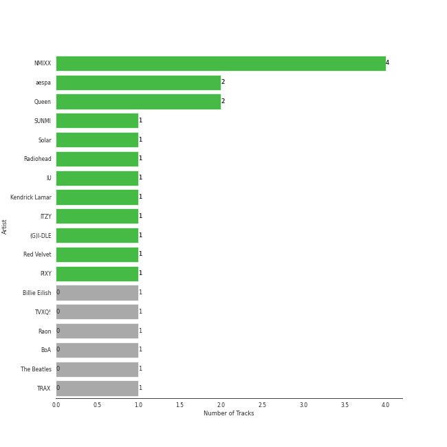
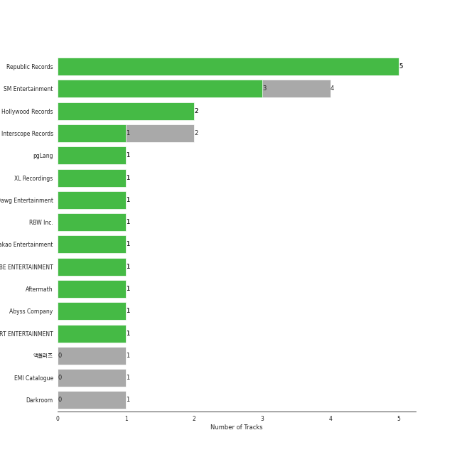
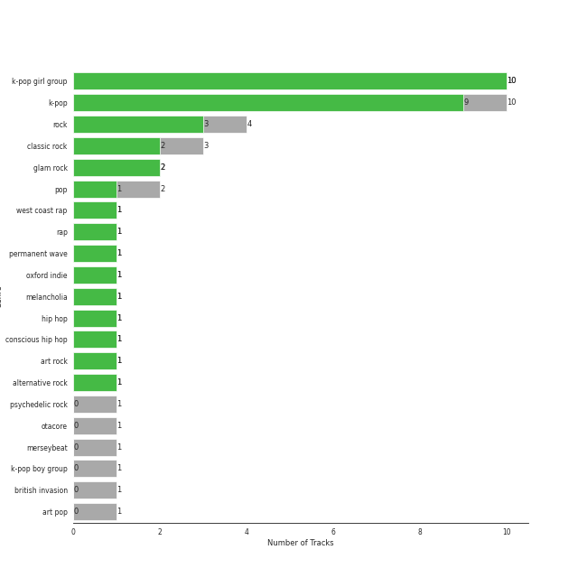

# Beat Drop!

[11 tracks (8 liked) 🔗](https://open.spotify.com/playlist/2CV3LAEvICWmWq3SEJw1my)

[See Track Features](audio_features.md)

[See Clusters](clusters/overview.md)

## Top Artists

| Art | Tracks | 💚 | Artist | 🔗 |
|:---|---:|---:|:---|:---|
|  | 4 | 4 | [NMIXX](../../artists/nmixx/overview.md) | [🔗](https://open.spotify.com/artist/28ot3wh4oNmoFOdVajibBl) |
|  | 2 | 2 | [aespa](../../artists/aespa/overview.md) | [🔗](https://open.spotify.com/artist/6YVMFz59CuY7ngCxTxjpxE) |
|  | 1 | 1 | [Radiohead](../../artists/radiohead/overview.md) | [🔗](https://open.spotify.com/artist/4Z8W4fKeB5YxbusRsdQVPb) |
|  | 1 | 1 | [Red Velvet](../../artists/red_velvet/overview.md) | [🔗](https://open.spotify.com/artist/1z4g3DjTBBZKhvAroFlhOM) |
|  | 1 | 0 | [Billie Eilish](../../artists/billie_eilish/overview.md) | [🔗](https://open.spotify.com/artist/6qqNVTkY8uBg9cP3Jd7DAH) |
|  | 1 | 0 | [The Beatles](../../artists/the_beatles/overview.md) | [🔗](https://open.spotify.com/artist/3WrFJ7ztbogyGnTHbHJFl2) |
|  | 1 | 0 | [Queen](../../artists/queen/overview.md) | [🔗](https://open.spotify.com/artist/1dfeR4HaWDbWqFHLkxsg1d) |

## Top Albums

| Art | Tracks | 💚 | Album | Release Date | 🔗 |
|:---|---:|---:|:---|:---|:---|
|  | 2 | 2 | Fe3O4: BREAK | 2024-01-15 | [🔗](https://open.spotify.com/album/5CCxLQgcI7cVwmgFDlicbP) |
|  | 1 | 1 | Savage - The 1st Mini Album | 2021-10-05 | [🔗](https://open.spotify.com/album/3vyyDkvYWC36DwgZCYd3Wu) |
|  | 1 | 1 | Russian Roulette - The 3rd Mini Album | 2016-09-07 | [🔗](https://open.spotify.com/album/6MNlcai3skKLKv5syzFwC3) |
|  | 1 | 1 | OK Computer | 1997-05-28 | [🔗](https://open.spotify.com/album/6dVIqQ8qmQ5GBnJ9shOYGE) |
|  | 1 | 1 | Next Level | 2021-05-17 | [🔗](https://open.spotify.com/album/2CzbrboOLzeRoaaH1N5K0N) |
|  | 1 | 1 | ENTWURF | 2022-09-19 | [🔗](https://open.spotify.com/album/3wMlxC4t3dN70e1OF8wUfz) |
|  | 1 | 1 | AD MARE | 2022-02-22 | [🔗](https://open.spotify.com/album/2QbA97qjlAs81t6kVS6zBk) |
|  | 1 | 0 | Stone Cold Classics | 2006-01-01 | [🔗](https://open.spotify.com/album/7C2DKB8C12LqxMkfJRwTo9) |
|  | 1 | 0 | Sgt. Pepper's Lonely Hearts Club Band (Remastered) | 1967-06-01 | [🔗](https://open.spotify.com/album/6QaVfG1pHYl1z15ZxkvVDW) |
|  | 1 | 0 | Happier Than Ever | 2021-07-30 | [🔗](https://open.spotify.com/album/0JGOiO34nwfUdDrD612dOp) |

## Top Record Labels

| Tracks | 💚 | Label |
|---:|---:|:---|
| 4 | 4 | [Republic Records](../../labels/republic_records/overview.md) |
| 3 | 3 | [SM Entertainment](../../labels/sm_entertainment/overview.md) |
| 1 | 1 | [XL Recordings](../../labels/xl_recordings/overview.md) |
| 1 | 0 | [Interscope Records](../../labels/interscope_records/overview.md) |
| 1 | 0 | [Hollywood Records](../../labels/hollywood_records/overview.md) |
| 1 | 0 | [EMI Catalogue](../../labels/emi_catalogue/overview.md) |
| 1 | 0 | [Darkroom](../../labels/darkroom/overview.md) |

## Genres

| Tracks | 💚 | Genre |
|---:|---:|:---|
| 7 | 7 | [k-pop girl group](../../genres/k-pop_girl_group/overview.md) |
| 5 | 5 | [k-pop](../../genres/k-pop/overview.md) |
| 3 | 1 | [rock](../../genres/rock/overview.md) |
| 1 | 1 | [permanent wave](../../genres/permanent_wave/overview.md) |
| 1 | 1 | oxford indie |
| 1 | 1 | melancholia |
| 1 | 1 | [art rock](../../genres/art_rock/overview.md) |
| 1 | 1 | [alternative rock](../../genres/alternative_rock/overview.md) |
| 2 | 0 | [classic rock](../../genres/classic_rock/overview.md) |
| 1 | 0 | [psychedelic rock](../../genres/psychedelic_rock/overview.md) |

See all 15 genres

| Tracks | 💚 | Genre |
|---:|---:|:---|
| 1 | 0 | [pop](../../genres/pop/overview.md) |
| 1 | 0 | merseybeat |
| 1 | 0 | glam rock |
| 1 | 0 | [british invasion](../../genres/british_invasion/overview.md) |
| 1 | 0 | [art pop](../../genres/art_pop/overview.md) |

## Top Producers

| Art | Producer | Tracks | Credit Types |
|:---|:---|---:|:---|
| | Brian U | 3 | Songwriter, Arranger |
| | 구혜진 (Gu, Hye-jin) | 2 | Producer |
| | Frankie Day | 2 | Songwriter |
| | Tony Maserati | 2 | Producer |
| | Charlotte Wilson | 2 | Songwriter, Arranger |
| | 임찬미 (Kim, Chan-mi) | 2 | Producer |
| | 백새임 (Baek, Sae-im) | 2 | Lyricist |
| | 오현선 (Oh, Hyun-sun) | 2 | Lyricist |
| | Dr.JO | 2 | Lyricist, Arranger |
| | 김영현 (Kim, Young-hyun) | 2 | Producer |

View all

| Art | Producer | Tracks | Credit Types |
|:---|:---|---:|:---|
| | 유영진 (Yoo, Young-jin) | 2 | Arranger, Lyricist, Producer, Songwriter |
| | Ayushy | 2 | Songwriter, Arranger |
| | 엄세희 (Um, Se-Hee) | 2 | Producer |
| | Jonny Greenwood | 1 | Songwriter |
| | Tay Jasper | 1 | Songwriter |
| | Thom Yorke | 1 | Producer, Songwriter |
| | 정은경 (Jung, Eun-Kyung) | 1 | Producer |
| | Joseph K | 1 | Arranger, Songwriter |
| | Kirsten Collins | 1 | Songwriter |
| | Chanti | 1 | Songwriter |
| | Hayley Aitken | 1 | Arranger, Songwriter |
| | Colin Greenwood | 1 | Songwriter |
|  | [Radiohead](../../artists/radiohead/overview.md) | 1 | Arranger, Producer |
| | Zaya | 1 | Lyricist |
| | 구종필 (Koo, Jong-Pil) | 1 | Producer |
| | MarkAlong | 1 | Songwriter |
| | Brown Panda | 1 | Arranger, Songwriter |
| | Deza | 1 | Lyricist |
| | Awry | 1 | Songwriter |
| | Jia Lih | 1 | Arranger, Songwriter |
| | Jonkind | 1 | Songwriter |
| | 김인 (Kim, In) | 1 | Lyricist |
| | 박지현 (Park, Ji-hyun) | 1 | Lyricist |
| | 성유진 (Sung, Yoojin) | 1 | Lyricist |
| | Enan | 1 | Songwriter |
| | Sophie Curtis | 1 | Songwriter |
| | Hautboi Rich | 1 | Songwriter |
| | 차이린 (Chailin) | 1 | Lyricist |
| | 명혜인 (Myeong, Hyein) | 1 | Lyricist |
| | 원지애 (Won, Jiae) | 1 | Lyricist |
| | NVR know | 1 | Arranger, Songwriter |
| | PUFF | 1 | Arranger, Songwriter |
| | 복주영 (Bok, Ju Young) | 1 | Lyricist |
| | WKLY | 1 | Lyricist |
| | EJAE | 1 | Songwriter |
| | Rajan Muse | 1 | Songwriter |
| | HONEY NOISE | 1 | Arranger, Producer, Songwriter |
| | 랑가 (Langa) | 1 | Arranger, Songwriter |
| | Strong Dragon | 1 | Arranger, Songwriter |
| | LSY | 1 | Arranger, Songwriter |
| | Ollipop | 1 | Arranger, Songwriter |
| | Adam McInnis | 1 | Arranger, Songwriter |
| | Kenzie | 1 | Arranger, Lyricist |
| | 강선영 (강선영) | 1 | Producer |
| | Mario Marchetti | 1 | Arranger, Songwriter |
| | Ed O'Brien | 1 | Songwriter |
| | Jan Baars | 1 | Songwriter |
| | 아르마딜로 (Armadillo) | 1 | Arranger, Songwriter |
| | AFTRSHOK | 1 | Arranger, Songwriter |
| | Philip Selway | 1 | Songwriter |
| | 형근 (Hyeongeun) | 1 | Lyricist |
| | 이수만 (Lee, Soo-Man) | 1 | Producer |
| | danke | 1 | Lyricist |
| | Nigel Godrich | 1 | Producer |
| | C'SA | 1 | Arranger, Producer, Songwriter |
| | Jacob Aaron | 1 | Songwriter |
| | Awrii | 1 | Arranger, Songwriter |
| | 정다연 (Jeong, Dayeon) | 1 | Lyricist |
| | Rick Bridges | 1 | Lyricist |

## Most and least listened tracks
| ​ | Most listened tracks | Score | ​​ | Least listened tracks | Score |
|:---|:---|---:|:---|:---|---:|
|  | [Savage](../../artists/aespa/overview.md) | 66575 |  | [A Day In The Life - Remastered 2009](../../artists/the_beatles/overview.md) | 0 |
|  | [Next Level](../../artists/aespa/overview.md) | 65134 |  | [Lucky Girl](../../artists/red_velvet/overview.md) | 0 |
|  | [Soñar (Breaker)](../../artists/nmixx/overview.md) | 40 |  | [O.O](../../artists/nmixx/overview.md) | 0 |
|  | [DASH](../../artists/nmixx/overview.md) | 7 |  | [Happier Than Ever](../../artists/billie_eilish/overview.md) | 0 |
|  | [Bohemian Rhapsody](../../artists/queen/overview.md) | 0 |  | [DICE](../../artists/nmixx/overview.md) | 0 |
|  | [Paranoid Android](../../artists/radiohead/overview.md) | 0 |  | [Paranoid Android](../../artists/radiohead/overview.md) | 0 |
|  | [DICE](../../artists/nmixx/overview.md) | 0 |  | [Bohemian Rhapsody](../../artists/queen/overview.md) | 0 |
|  | [Happier Than Ever](../../artists/billie_eilish/overview.md) | 0 |  | [DASH](../../artists/nmixx/overview.md) | 7 |
|  | [O.O](../../artists/nmixx/overview.md) | 0 |  | [Soñar (Breaker)](../../artists/nmixx/overview.md) | 40 |
|  | [Lucky Girl](../../artists/red_velvet/overview.md) | 0 |  | [Next Level](../../artists/aespa/overview.md) | 65134 |

## Years

| ​ | 10 newest albums | ​​ | 10 oldest albums |
|:---|:---|:---|:---|
|  | Fe3O4: BREAK (2024-01-15) |  | Sgt. Pepper's Lonely Hearts Club Band (Remastered) (1967-06-01) |
|  | ENTWURF (2022-09-19) |  | OK Computer (1997-05-28) |
|  | AD MARE (2022-02-22) |  | Stone Cold Classics (2006-01-01) |
|  | Savage - The 1st Mini Album (2021-10-05) |  | Russian Roulette - The 3rd Mini Album (2016-09-07) |
|  | Happier Than Ever (2021-07-30) |  | Next Level (2021-05-17) |
|  | Next Level (2021-05-17) |  | Happier Than Ever (2021-07-30) |
|  | Russian Roulette - The 3rd Mini Album (2016-09-07) |  | Savage - The 1st Mini Album (2021-10-05) |
|  | Stone Cold Classics (2006-01-01) |  | AD MARE (2022-02-22) |
|  | OK Computer (1997-05-28) |  | ENTWURF (2022-09-19) |
|  | Sgt. Pepper's Lonely Hearts Club Band (Remastered) (1967-06-01) |  | Fe3O4: BREAK (2024-01-15) |