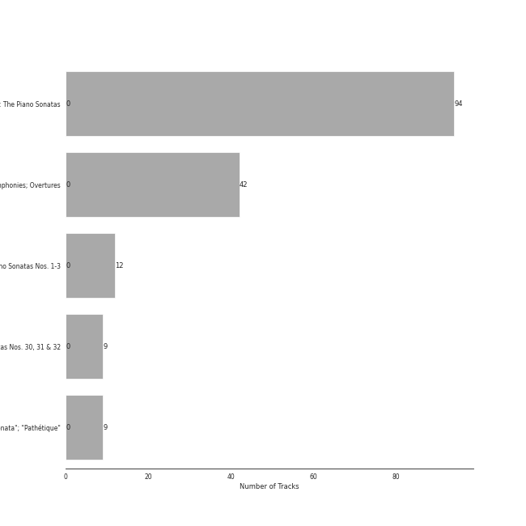
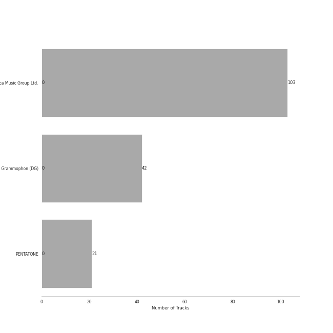

# Beethoven

[166 songs](beethoven_tracks.md)

## Top Artists

See all 11 artists

|   Number of Tracks | Art                                                                                              | Artist                                                           | 🔗                                                           |
|-------------------:|:-------------------------------------------------------------------------------------------------|:-----------------------------------------------------------------|:------------------------------------------------------------|
|                166 |  | [Ludwig van Beethoven](../artists/ludwig_van_beethoven.md)       | [🔗](https://open.spotify.com/artist/2wOqMjp9TyABvtHdOSOTUS) |
|                103 |  | [Vladimir Ashkenazy](../artists/vladimir_ashkenazy.md)           | [🔗](https://open.spotify.com/artist/20iZXzMb8LoWXOeca32i82) |
|                 42 |  | [Berliner Philharmoniker](../artists/berliner_philharmoniker.md) | [🔗](https://open.spotify.com/artist/6uRJnvQ3f8whVnmeoecv5Z) |
|                 42 |  | [Herbert von Karajan](../artists/herbert_von_karajan.md)         | [🔗](https://open.spotify.com/artist/5zCaQxjl110XTrm4LQ1CxY) |
|                 21 |  | [Mari Kodama](../artists/mari_kodama.md)                         | [🔗](https://open.spotify.com/artist/0s0wG03kPyu7MXERfcuxim) |
|                  1 |  | [José van Dam](../artists/jos__van_dam.md)                       | [🔗](https://open.spotify.com/artist/5qNUHMEhszyeXNYMn4sswd) |
|                  1 |  | [Wiener Singverein](../artists/wiener_singverein.md)             | [🔗](https://open.spotify.com/artist/35QSympF887CO8h5eZHme2) |
|                  1 |  | Vinson Cole                                                      | [🔗](https://open.spotify.com/artist/2j6cP3f3TxyHzcKdWYSm6h) |
|                  1 |  | [Agnes Baltsa](../artists/agnes_baltsa.md)                       | [🔗](https://open.spotify.com/artist/2amF56vDuTTbZJQsqUgbuC) |
|                  1 |  | Janet Perry                                                      | [🔗](https://open.spotify.com/artist/1bV3KjOPs1AI3OolJiYogN) |
|                  1 |  | Helmut Froschauer                                                | [🔗](https://open.spotify.com/artist/172Encqfd2ZhWAleNg1gbO) |

## Top Albums

See all 5 albums

|   Number of Tracks | Art                                                                                              | Album                                                              | 🔗                                                          |
|-------------------:|:-------------------------------------------------------------------------------------------------|:-------------------------------------------------------------------|:-----------------------------------------------------------|
|                 94 |  | Beethoven: The Piano Sonatas                                       | [🔗](https://open.spotify.com/album/7xbsSOswKgms1fUFuwKArz) |
|                 42 |  | Beethoven: 9 Symphonies; Overtures                                 | [🔗](https://open.spotify.com/album/2DQTNTznsteIZciZdyeWdj) |
|                 12 |  | Beethoven: Piano Sonatas Nos. 1-3                                  | [🔗](https://open.spotify.com/album/5CjMjZJnjdHHgwAVkqrvXq) |
|                  9 |  | Beethoven: Piano Sonatas Nos. 30, 31 & 32                          | [🔗](https://open.spotify.com/album/478l1JdqbqDzcmmgrqw2zu) |
|                  9 |  | Beethoven: Piano Sonatas "Moonlight"; "Appassionata"; "Pathétique" | [🔗](https://open.spotify.com/album/0RCfE1YhkdrjnM3kXT3YLl) |

## Top Record Labels

See all 3 labels

|   Number of Tracks | Label                    |
|-------------------:|:-------------------------|
|                103 | Decca Music Group Ltd.   |
|                 42 | Deutsche Grammophon (DG) |
|                 21 | PentaTone                |

