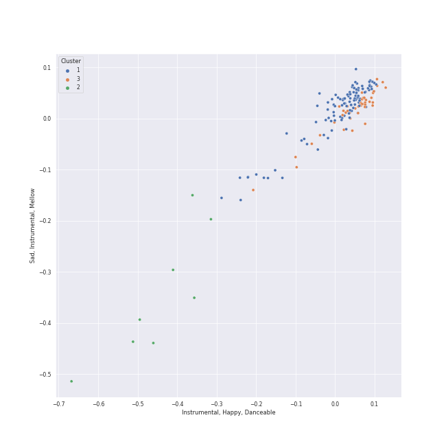

# Clusters in Beethoven

## Cluster #1

110 tracks

| Art | Track | Album | Artists | Label | Rank | 💚 | 🔗 |
|:---|:---|:---|:---|:---|---:|:---|:---|
|  | Piano Sonata No. 29 in B flat, Op. 106 -"Hammerklavier": 2. Scherzo (Assai vivace - Presto - Prestissimo - Tempo I) | Beethoven: The Piano Sonatas | [Ludwig van Beethoven](../../../../artists/ludwig_van_beethoven/overview.md), [Vladimir Ashkenazy](../../../../artists/vladimir_ashkenazy/overview.md) | [Decca Music Group Ltd.](../../../../labels/decca_music_group_ltd_) | 900 | | [🔗](https://open.spotify.com/track/0p7MucNl42X928zuT1iZCX) |
|  | Piano Sonata No. 16 in G, Op. 31 No. 1: 3. Rondo (Allegretto) | Beethoven: The Piano Sonatas | [Ludwig van Beethoven](../../../../artists/ludwig_van_beethoven/overview.md), [Vladimir Ashkenazy](../../../../artists/vladimir_ashkenazy/overview.md) | [Decca Music Group Ltd.](../../../../labels/decca_music_group_ltd_) | 900 | | [🔗](https://open.spotify.com/track/4QpCaoTElARQj31WH2lPAx) |
|  | Piano Sonata No. 6 in F, Op. 10 No. 2: 2. Allegretto | Beethoven: The Piano Sonatas | [Ludwig van Beethoven](../../../../artists/ludwig_van_beethoven/overview.md), [Vladimir Ashkenazy](../../../../artists/vladimir_ashkenazy/overview.md) | [Decca Music Group Ltd.](../../../../labels/decca_music_group_ltd_) | 900 | | [🔗](https://open.spotify.com/track/4gThvgaLCcABLJIFFKTlig) |
|  | Piano Sonata No. 26 in E-Flat Major, Op. 81a "Les Adieux": I. Das Lebewohl (Adagio - Allegro) | Beethoven: The Piano Sonatas | [Ludwig van Beethoven](../../../../artists/ludwig_van_beethoven/overview.md), [Vladimir Ashkenazy](../../../../artists/vladimir_ashkenazy/overview.md) | [Decca Music Group Ltd.](../../../../labels/decca_music_group_ltd_) | 900 | | [🔗](https://open.spotify.com/track/76915vyJFSFWrz8AYVMN2p) |
|  | Piano Sonata No. 29 in B flat, Op. 106 -"Hammerklavier": 1. Allegro | Beethoven: The Piano Sonatas | [Ludwig van Beethoven](../../../../artists/ludwig_van_beethoven/overview.md), [Vladimir Ashkenazy](../../../../artists/vladimir_ashkenazy/overview.md) | [Decca Music Group Ltd.](../../../../labels/decca_music_group_ltd_) | 900 | | [🔗](https://open.spotify.com/track/7HuiaLJAKmUDZSSe5gsPBb) |
|  | Piano Sonata No. 4 in E flat, Op. 7: 1. Allegro molto e con brio | Beethoven: The Piano Sonatas | [Ludwig van Beethoven](../../../../artists/ludwig_van_beethoven/overview.md), [Vladimir Ashkenazy](../../../../artists/vladimir_ashkenazy/overview.md) | [Decca Music Group Ltd.](../../../../labels/decca_music_group_ltd_) | 900 | | [🔗](https://open.spotify.com/track/7bqW46yJPC7pGVOksJibHX) |
|  | Symphony No. 5 in C Minor, Op. 67: 1. Allegro con brio | Beethoven: 9 Symphonies; Overtures | [Ludwig van Beethoven](../../../../artists/ludwig_van_beethoven/overview.md), [Berliner Philharmoniker](../../../../artists/berliner_philharmoniker/overview.md), [Herbert von Karajan](../../../../artists/herbert_von_karajan/overview.md) | [Deutsche Grammophon (DG)](../../../../labels/deutsche_grammophon_(dg)) | 900 | | [🔗](https://open.spotify.com/track/0TpTKpg8LnwZROTYMBYVM3) |
|  | Symphony No. 7 In A, Op. 92: 3. Presto - Assai meno presto | Beethoven: 9 Symphonies; Overtures | [Ludwig van Beethoven](../../../../artists/ludwig_van_beethoven/overview.md), [Berliner Philharmoniker](../../../../artists/berliner_philharmoniker/overview.md), [Herbert von Karajan](../../../../artists/herbert_von_karajan/overview.md) | [Deutsche Grammophon (DG)](../../../../labels/deutsche_grammophon_(dg)) | 900 | | [🔗](https://open.spotify.com/track/0YypnyxCRg754qkH5oN2sT) |
|  | Piano Sonata No. 8 in C Minor, Op. 13 "Pathétique": II. Adagio cantabile | Beethoven: Piano Sonatas "Moonlight"; "Appassionata"; "Pathétique" | [Ludwig van Beethoven](../../../../artists/ludwig_van_beethoven/overview.md), [Vladimir Ashkenazy](../../../../artists/vladimir_ashkenazy/overview.md) | [Decca Music Group Ltd.](../../../../labels/decca_music_group_ltd_) | 900 | | [🔗](https://open.spotify.com/track/29lgND5UlmYysapjjplX1k) |
|  | Piano Sonata No. 23 in F Minor, Op. 57 "Appassionata": III. Allegro ma non troppo | Beethoven: Piano Sonatas "Moonlight"; "Appassionata"; "Pathétique" | [Ludwig van Beethoven](../../../../artists/ludwig_van_beethoven/overview.md), [Vladimir Ashkenazy](../../../../artists/vladimir_ashkenazy/overview.md) | [Decca Music Group Ltd.](../../../../labels/decca_music_group_ltd_) | 900 | | [🔗](https://open.spotify.com/track/3sDfDzDuu3n8eK0onbAXwA) |
## Cluster #2

8 tracks

| Art | Track | Album | Artists | Label | Rank | 💚 | 🔗 |
|:---|:---|:---|:---|:---|---:|:---|:---|
|  | Symphony No. 1 In C, Op. 21: 2. Andante cantabile con moto | Beethoven: 9 Symphonies; Overtures | [Ludwig van Beethoven](../../../../artists/ludwig_van_beethoven/overview.md), [Berliner Philharmoniker](../../../../artists/berliner_philharmoniker/overview.md), [Herbert von Karajan](../../../../artists/herbert_von_karajan/overview.md) | [Deutsche Grammophon (DG)](../../../../labels/deutsche_grammophon_(dg)) | 900 | | [🔗](https://open.spotify.com/track/0WpOlyr0nL5LL8Tc3c3Yln) |
|  | Symphony No. 6 In F, Op. 68 -"Pastoral": 3. Lustiges Zusammensein der Landleute (Allegro) | Beethoven: 9 Symphonies; Overtures | [Ludwig van Beethoven](../../../../artists/ludwig_van_beethoven/overview.md), [Berliner Philharmoniker](../../../../artists/berliner_philharmoniker/overview.md), [Herbert von Karajan](../../../../artists/herbert_von_karajan/overview.md) | [Deutsche Grammophon (DG)](../../../../labels/deutsche_grammophon_(dg)) | 900 | | [🔗](https://open.spotify.com/track/1rClQ3viDyCkJVC2yealEp) |
|  | Symphony No. 6 In F, Op. 68 -"Pastoral": 4. Gewitter, Sturm (Allegro) | Beethoven: 9 Symphonies; Overtures | [Ludwig van Beethoven](../../../../artists/ludwig_van_beethoven/overview.md), [Berliner Philharmoniker](../../../../artists/berliner_philharmoniker/overview.md), [Herbert von Karajan](../../../../artists/herbert_von_karajan/overview.md) | [Deutsche Grammophon (DG)](../../../../labels/deutsche_grammophon_(dg)) | 900 | | [🔗](https://open.spotify.com/track/2ApZ6x9XISWdn9eIu8SDCO) |
|  | Symphony No. 9 In D Minor, Op. 125 - "Choral" / 4.: "O Freunde nicht diese Töne" - | Beethoven: 9 Symphonies; Overtures | [Ludwig van Beethoven](../../../../artists/ludwig_van_beethoven/overview.md), Janet Perry, Agnes Baltsa, Vinson Cole, José van Dam, [Berliner Philharmoniker](../../../../artists/berliner_philharmoniker/overview.md), [Herbert von Karajan](../../../../artists/herbert_von_karajan/overview.md), Wiener Singverein, Helmut Froschauer | [Deutsche Grammophon (DG)](../../../../labels/deutsche_grammophon_(dg)) | 900 | | [🔗](https://open.spotify.com/track/3vanPPXeHjJ6QJ1Sgie8g3) |
|  | Symphony No. 8 in F Major, Op. 93: II. Allegretto scherzando | Beethoven: 9 Symphonies; Overtures | [Ludwig van Beethoven](../../../../artists/ludwig_van_beethoven/overview.md), [Berliner Philharmoniker](../../../../artists/berliner_philharmoniker/overview.md), [Herbert von Karajan](../../../../artists/herbert_von_karajan/overview.md) | [Deutsche Grammophon (DG)](../../../../labels/deutsche_grammophon_(dg)) | 900 | | [🔗](https://open.spotify.com/track/43Hdy71dNjipvXh86dEPFR) |
|  | Symphony No. 3 In E Flat, Op. 55 -"Eroica": 3. Scherzo (Allegro vivace) | Beethoven: 9 Symphonies; Overtures | [Ludwig van Beethoven](../../../../artists/ludwig_van_beethoven/overview.md), [Berliner Philharmoniker](../../../../artists/berliner_philharmoniker/overview.md), [Herbert von Karajan](../../../../artists/herbert_von_karajan/overview.md) | [Deutsche Grammophon (DG)](../../../../labels/deutsche_grammophon_(dg)) | 900 | | [🔗](https://open.spotify.com/track/5b3322i4oAchfQQfcwZcxV) |
|  | Symphony No. 5 In C Minor, Op. 67: 3. Allegro | Beethoven: 9 Symphonies; Overtures | [Ludwig van Beethoven](../../../../artists/ludwig_van_beethoven/overview.md), [Berliner Philharmoniker](../../../../artists/berliner_philharmoniker/overview.md), [Herbert von Karajan](../../../../artists/herbert_von_karajan/overview.md) | [Deutsche Grammophon (DG)](../../../../labels/deutsche_grammophon_(dg)) | 900 | | [🔗](https://open.spotify.com/track/7b6fj5YM0hfPCCxrfursps) |
|  | Symphony No. 4 In B Flat, Op. 60: 1. Adagio - Allegro vivace | Beethoven: 9 Symphonies; Overtures | [Ludwig van Beethoven](../../../../artists/ludwig_van_beethoven/overview.md), [Berliner Philharmoniker](../../../../artists/berliner_philharmoniker/overview.md), [Herbert von Karajan](../../../../artists/herbert_von_karajan/overview.md) | [Deutsche Grammophon (DG)](../../../../labels/deutsche_grammophon_(dg)) | 900 | | [🔗](https://open.spotify.com/track/7h3gKAftaUcgjzQbprBaUq) |
## Cluster #3

48 tracks

| Art | Track | Album | Artists | Label | Rank | 💚 | 🔗 |
|:---|:---|:---|:---|:---|---:|:---|:---|
|  | Piano Sonata No. 10 in G Major, Op. 14 No. 2: 3. Scherzo. Allegro assai | Beethoven: The Piano Sonatas | [Ludwig van Beethoven](../../../../artists/ludwig_van_beethoven/overview.md), [Vladimir Ashkenazy](../../../../artists/vladimir_ashkenazy/overview.md) | [Decca Music Group Ltd.](../../../../labels/decca_music_group_ltd_) | 900 | | [🔗](https://open.spotify.com/track/0VEufDhQQQvz863wJ7unXm) |
|  | Piano Sonata No. 22 in F, Op. 54: 2. Allegretto | Beethoven: The Piano Sonatas | [Ludwig van Beethoven](../../../../artists/ludwig_van_beethoven/overview.md), [Vladimir Ashkenazy](../../../../artists/vladimir_ashkenazy/overview.md) | [Decca Music Group Ltd.](../../../../labels/decca_music_group_ltd_) | 900 | | [🔗](https://open.spotify.com/track/0ZlOZ8gvrSamzfceD9frmQ) |
|  | Piano Sonata No. 2 in A, Op. 2 No. 2: 1. Allegro vivace | Beethoven: The Piano Sonatas | [Ludwig van Beethoven](../../../../artists/ludwig_van_beethoven/overview.md), [Vladimir Ashkenazy](../../../../artists/vladimir_ashkenazy/overview.md) | [Decca Music Group Ltd.](../../../../labels/decca_music_group_ltd_) | 900 | | [🔗](https://open.spotify.com/track/0j6XoSUHbf3aj487ZOn6t6) |
|  | Piano Sonata No. 3 in C, Op. 2 No. 3: 4. Allegro assai | Beethoven: The Piano Sonatas | [Ludwig van Beethoven](../../../../artists/ludwig_van_beethoven/overview.md), [Vladimir Ashkenazy](../../../../artists/vladimir_ashkenazy/overview.md) | [Decca Music Group Ltd.](../../../../labels/decca_music_group_ltd_) | 900 | | [🔗](https://open.spotify.com/track/1ATiYARYMDX7OMTX4RrFlw) |
|  | Piano Sonata No. 5 in C minor, Op. 10 No. 1: 1. Allegro molto e con brio | Beethoven: The Piano Sonatas | [Ludwig van Beethoven](../../../../artists/ludwig_van_beethoven/overview.md), [Vladimir Ashkenazy](../../../../artists/vladimir_ashkenazy/overview.md) | [Decca Music Group Ltd.](../../../../labels/decca_music_group_ltd_) | 900 | | [🔗](https://open.spotify.com/track/23esxSOldUXZFyucgRXauX) |
|  | Piano Sonata No. 31 in A flat, Op. 110: 2. Allegro molto | Beethoven: The Piano Sonatas | [Ludwig van Beethoven](../../../../artists/ludwig_van_beethoven/overview.md), [Vladimir Ashkenazy](../../../../artists/vladimir_ashkenazy/overview.md) | [Decca Music Group Ltd.](../../../../labels/decca_music_group_ltd_) | 900 | | [🔗](https://open.spotify.com/track/3UfHf3OZVwTS9bip0AQykg) |
|  | Piano Sonata No. 24 in F-Sharp Major, Op. 78 "For Therese": 2. Allegro vivace | Beethoven: The Piano Sonatas | [Ludwig van Beethoven](../../../../artists/ludwig_van_beethoven/overview.md), [Vladimir Ashkenazy](../../../../artists/vladimir_ashkenazy/overview.md) | [Decca Music Group Ltd.](../../../../labels/decca_music_group_ltd_) | 900 | | [🔗](https://open.spotify.com/track/4KTOl5qB3uTITHsRUnStDT) |
|  | Piano Sonata No. 7 in D, Op. 10 No. 3: 3. Menuetto (Allegro) | Beethoven: The Piano Sonatas | [Ludwig van Beethoven](../../../../artists/ludwig_van_beethoven/overview.md), [Vladimir Ashkenazy](../../../../artists/vladimir_ashkenazy/overview.md) | [Decca Music Group Ltd.](../../../../labels/decca_music_group_ltd_) | 900 | | [🔗](https://open.spotify.com/track/5QUg8sW1xAK7ENDQNfRsZk) |
|  | Piano Sonata No. 18 in E flat, Op. 31 No. 3 -"The Hunt": 2. Scherzo (Allegretto vivace) | Beethoven: The Piano Sonatas | [Ludwig van Beethoven](../../../../artists/ludwig_van_beethoven/overview.md), [Vladimir Ashkenazy](../../../../artists/vladimir_ashkenazy/overview.md) | [Decca Music Group Ltd.](../../../../labels/decca_music_group_ltd_) | 900 | | [🔗](https://open.spotify.com/track/6ghMfD0tM3XxGxhTLQ1ilI) |
|  | Piano Sonata No. 3 in C Major, Op. 2 No. 3: IV. Allegro assai | Beethoven: Piano Sonatas Nos. 1-3 | [Ludwig van Beethoven](../../../../artists/ludwig_van_beethoven/overview.md), Mari Kodama | [PENTATONE](../../../../labels/pentatone) | 900 | | [🔗](https://open.spotify.com/track/3pZt5RCBnQty2KDduZaBJp) |