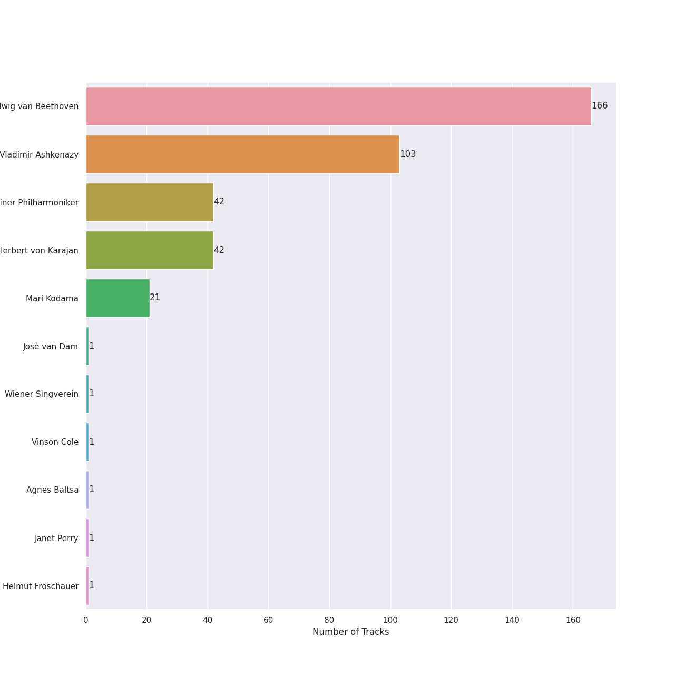
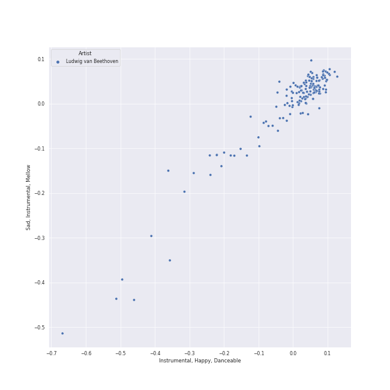
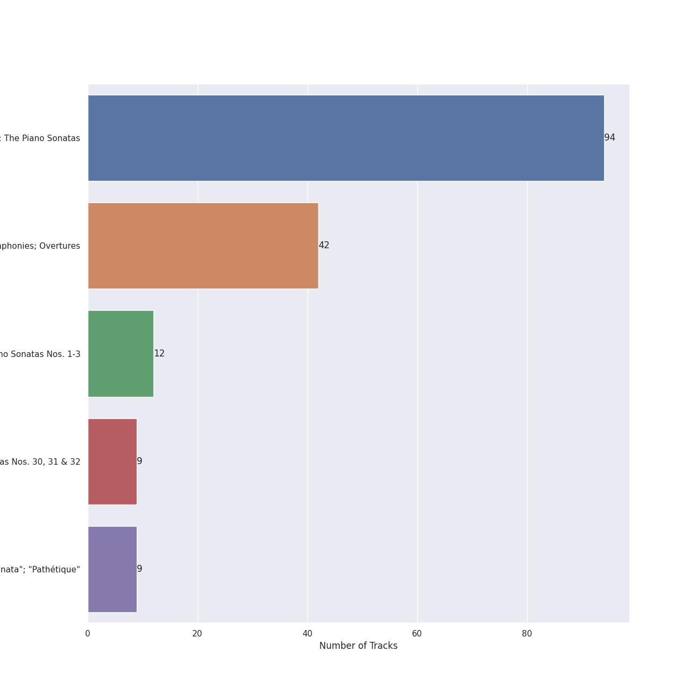
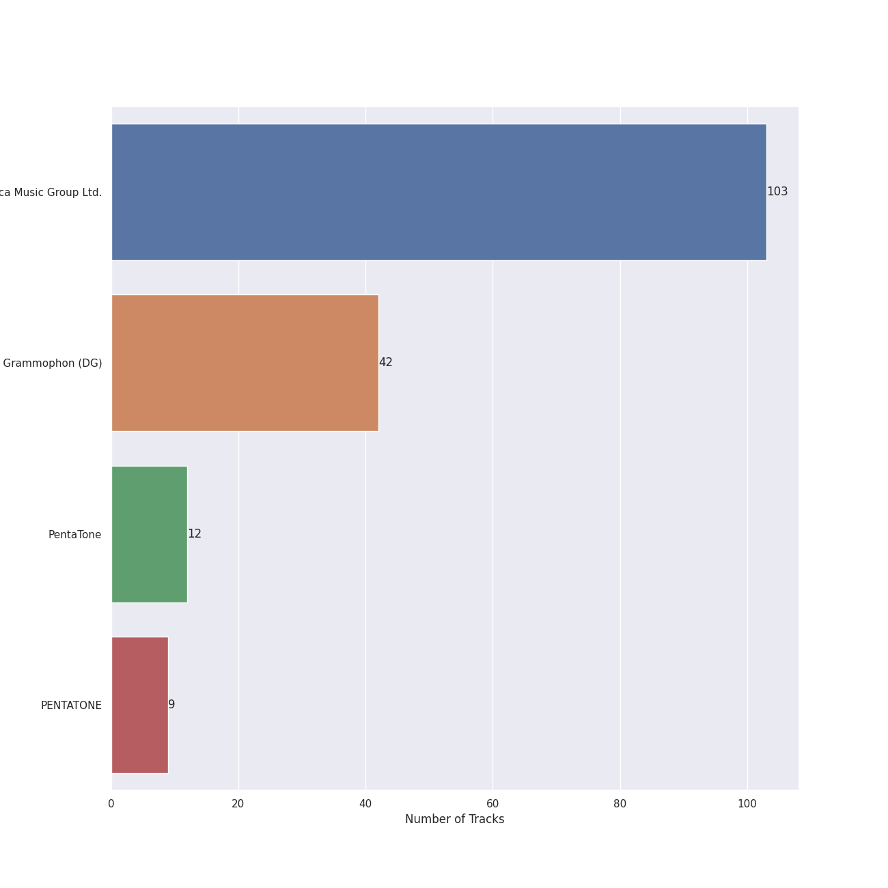
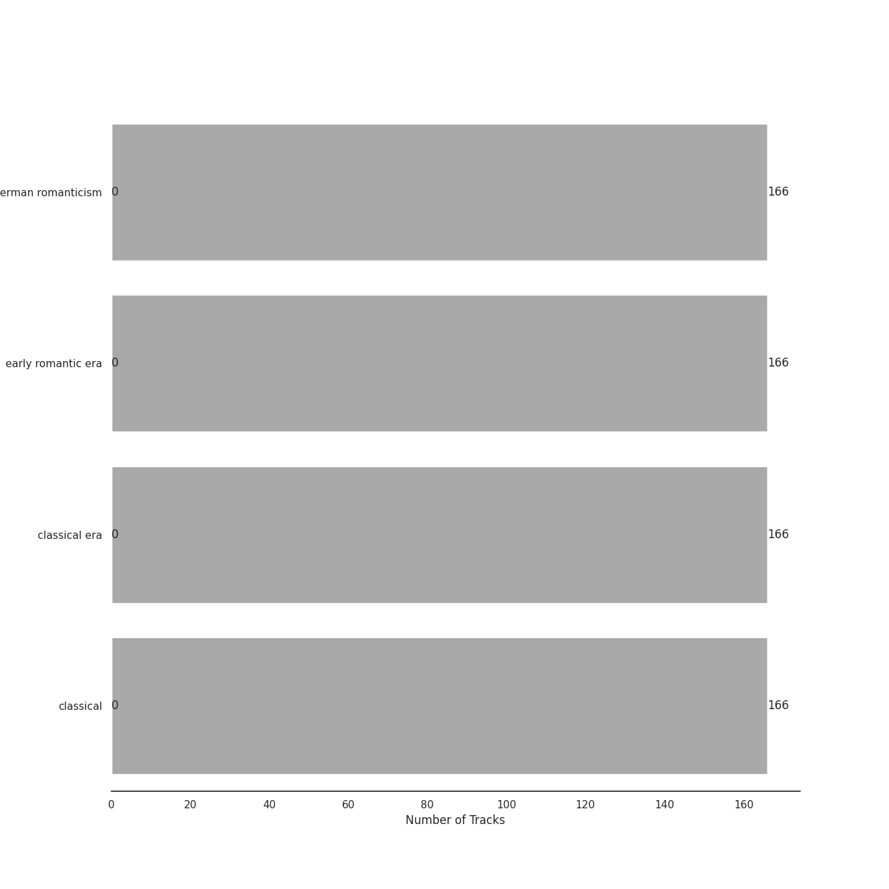
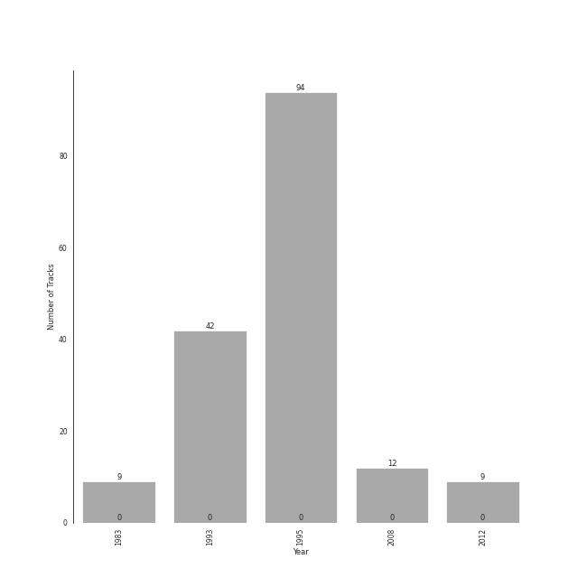

# Beethoven

[166 tracks (0 liked) 🔗](https://open.spotify.com/playlist/6Lvj5MXaiMrmyaBnvLvxAW)

[See Track Features](audio_features.md)

[See Clusters](clusters/overview.md)

## Top Artists

| Art | Rank | Tracks | 💚 | Artist | 🔗 |
|:---|---:|---:|---:|:---|:---|
|  | 289 | 166 | 0 | [Ludwig van Beethoven](../../artists/ludwig_van_beethoven/overview.md) | [🔗](https://open.spotify.com/artist/2wOqMjp9TyABvtHdOSOTUS) |
|  | 149 | 103 | 0 | [Vladimir Ashkenazy](../../artists/vladimir_ashkenazy/overview.md) | [🔗](https://open.spotify.com/artist/20iZXzMb8LoWXOeca32i82) |
|  | 427 | 42 | 0 | [Berliner Philharmoniker](../../artists/berliner_philharmoniker/overview.md) | [🔗](https://open.spotify.com/artist/6uRJnvQ3f8whVnmeoecv5Z) |
|  | 427 | 42 | 0 | [Herbert von Karajan](../../artists/herbert_von_karajan/overview.md) | [🔗](https://open.spotify.com/artist/5zCaQxjl110XTrm4LQ1CxY) |
|  | 427 | 21 | 0 | Mari Kodama | [🔗](https://open.spotify.com/artist/0s0wG03kPyu7MXERfcuxim) |
|  | 427 | 1 | 0 | José van Dam | [🔗](https://open.spotify.com/artist/5qNUHMEhszyeXNYMn4sswd) |
|  | 427 | 1 | 0 | Wiener Singverein | [🔗](https://open.spotify.com/artist/35QSympF887CO8h5eZHme2) |
|  | 427 | 1 | 0 | Vinson Cole | [🔗](https://open.spotify.com/artist/2j6cP3f3TxyHzcKdWYSm6h) |
|  | 427 | 1 | 0 | Agnes Baltsa | [🔗](https://open.spotify.com/artist/2amF56vDuTTbZJQsqUgbuC) |
|  | 427 | 1 | 0 | Janet Perry | [🔗](https://open.spotify.com/artist/1bV3KjOPs1AI3OolJiYogN) |

See all 11 artists

| Art | Rank | Tracks | 💚 | Artist | 🔗 |
|:---|---:|---:|---:|:---|:---|
|  | 427 | 1 | 0 | Helmut Froschauer | [🔗](https://open.spotify.com/artist/172Encqfd2ZhWAleNg1gbO) |

## Top Tracks

Most and least listened tracks

| Rank | ​ | Most listened tracks | Rank | ​​ | Least listened tracks |
|---:|:---|:---|---:|:---|:---|
| 954 |  | [Piano Sonata No. 18 in E flat, Op. 31 No. 3 -"The Hunt": 1. Allegro](../../artists/ludwig_van_beethoven/overview.md) | 954 |  | [Piano Sonata No. 14 in C-Sharp Minor, Op. 27 No. 2 "Moonlight": I. Adagio sostenuto](../../artists/ludwig_van_beethoven/overview.md) |
| 954 |  | [Piano Sonata No. 31 in A flat, Op. 110: 3. Adagio ma non troppo](../../artists/ludwig_van_beethoven/overview.md) | 954 |  | [Piano Sonata No. 20 in G, Op. 49 No. 2: 1. Allegro ma non troppo](../../artists/ludwig_van_beethoven/overview.md) |
| 954 |  | [Piano Sonata No. 11 in B flat, Op. 22: 4. Rondo (Allegretto)](../../artists/ludwig_van_beethoven/overview.md) | 954 |  | [Piano Sonata No. 30 in E Major, Op. 109: III. Gesangvoll, mit innigster Empfindung. Andante molto cantabile ed espressivo](../../artists/ludwig_van_beethoven/overview.md) |
| 954 |  | [Symphony No. 7 in A Major, Op. 92: II. Allegretto](../../artists/ludwig_van_beethoven/overview.md) | 954 |  | [Piano Sonata No. 23 in F Minor, Op. 57 "Appassionata": I. Allegro assai](../../artists/ludwig_van_beethoven/overview.md) |
| 954 |  | [Piano Sonata No. 1 in F Minor, Op. 2 No. 1: II. Adagio](../../artists/ludwig_van_beethoven/overview.md) | 954 |  | [Piano Sonata No. 4 in E flat, Op. 7: 3. Allegro](../../artists/ludwig_van_beethoven/overview.md) |
| 954 |  | [Piano Sonata No. 32 in C Minor, Op. 111: I. Maestoso - Allegro con brio ed appassionato](../../artists/ludwig_van_beethoven/overview.md) | 954 |  | [Symphony No. 5 in C Minor, Op. 67: II. Andante con moto](../../artists/ludwig_van_beethoven/overview.md) |
| 954 |  | [Piano Sonata No. 28 in A, Op. 101: 3. Langsam und sehnsuchtsvoll (Adagio ma non troppo, con affetto)](../../artists/ludwig_van_beethoven/overview.md) | 954 |  | [Symphony No. 4 in B Flat Major, Op. 60: I. Adagio – Allegro vivace](../../artists/ludwig_van_beethoven/overview.md) |
| 954 |  | [Piano Sonata No. 11 in B flat, Op. 22: 1. Allegro con brio](../../artists/ludwig_van_beethoven/overview.md) | 954 |  | [Piano Sonata No. 4 in E flat, Op. 7: 1. Allegro molto e con brio](../../artists/ludwig_van_beethoven/overview.md) |
| 954 |  | [Symphony No. 5 in C Minor, Op. 67: I. Allegro con brio](../../artists/ludwig_van_beethoven/overview.md) | 954 |  | [Symphony No. 5 in C Minor, Op. 67: III. Scherzo. Allegro](../../artists/ludwig_van_beethoven/overview.md) |
| 954 |  | [Piano Sonata No. 18 in E flat, Op. 31 No. 3 -"The Hunt": 3. Menuetto (Moderato e grazioso)](../../artists/ludwig_van_beethoven/overview.md) | 954 |  | [Symphony No. 4 in B Flat Major, Op. 60: III. Allegro vivace](../../artists/ludwig_van_beethoven/overview.md) |

## Top Albums

| Art | Rank | Tracks | 💚 | Album | Release Date | 🔗 |
|:---|---:|---:|---:|:---|:---|:---|
|  | 631 | 94 | 0 | Beethoven: The Piano Sonatas | 1995-01-01 | [🔗](https://open.spotify.com/album/7xbsSOswKgms1fUFuwKArz) |
|  | 631 | 42 | 0 | Beethoven: 9 Symphonies; Overtures | 1993-01-01 | [🔗](https://open.spotify.com/album/2DQTNTznsteIZciZdyeWdj) |
|  | 631 | 12 | 0 | Beethoven: Piano Sonatas Nos. 1-3 | 2008-01-01 | [🔗](https://open.spotify.com/album/5CjMjZJnjdHHgwAVkqrvXq) |
|  | 631 | 9 | 0 | Beethoven: Piano Sonatas Nos. 30, 31 & 32 | 2012-03-06 | [🔗](https://open.spotify.com/album/478l1JdqbqDzcmmgrqw2zu) |
|  | 631 | 9 | 0 | Beethoven: Piano Sonatas "Moonlight"; "Appassionata"; "Pathétique" | 1983-01-01 | [🔗](https://open.spotify.com/album/0RCfE1YhkdrjnM3kXT3YLl) |

## Top Record Labels

| Tracks | 💚 | Label |
|---:|---:|:---|
| 103 | 0 | [Decca Music Group Ltd.](../../labels/decca_music_group_ltd_/overview.md) |
| 42 | 0 | [Deutsche Grammophon (DG)](../../labels/deutsche_grammophon_(dg)/overview.md) |
| 21 | 0 | [PENTATONE](../../labels/pentatone/overview.md) |

## Genres

| Tracks | 💚 | Genre |
|---:|---:|:---|
| 166 | 0 | [german romanticism](../../genres/german_romanticism/overview.md) |
| 166 | 0 | [early romantic era](../../genres/early_romantic_era/overview.md) |
| 166 | 0 | [classical era](../../genres/classical_era/overview.md) |
| 166 | 0 | [classical](../../genres/classical/overview.md) |

## Years

View all years

| Year | Number of Tracks |
|:---|---:|
| 2012 | 9 |
| 2008 | 12 |
| [1995](1995/overview.md) | 94 |
| [1993](1993/overview.md) | 42 |
| 1983 | 9 |

| ​ | 10 newest albums | ​​ | 10 oldest albums |
|:---|:---|:---|:---|
|  | Beethoven: Piano Sonatas Nos. 30, 31 & 32 (2012-03-06) |  | Beethoven: Piano Sonatas "Moonlight"; "Appassionata"; "Pathétique" (1983-01-01) |
|  | Beethoven: Piano Sonatas Nos. 1-3 (2008-01-01) |  | Beethoven: 9 Symphonies; Overtures (1993-01-01) |
|  | Beethoven: The Piano Sonatas (1995-01-01) |  | Beethoven: The Piano Sonatas (1995-01-01) |
|  | Beethoven: 9 Symphonies; Overtures (1993-01-01) |  | Beethoven: Piano Sonatas Nos. 1-3 (2008-01-01) |
|  | Beethoven: Piano Sonatas "Moonlight"; "Appassionata"; "Pathétique" (1983-01-01) |  | Beethoven: Piano Sonatas Nos. 30, 31 & 32 (2012-03-06) |