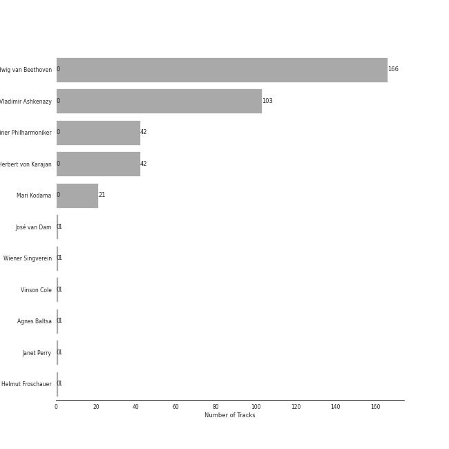
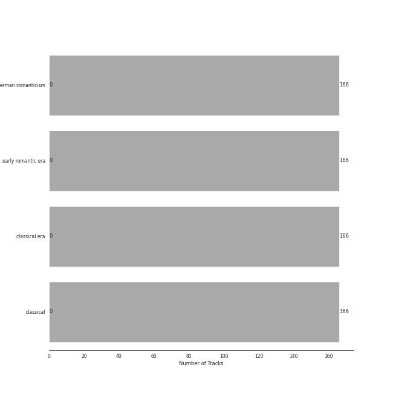

# Beethoven

[166 songs](tracks.md)

## Top Artists

See all 11 artists

| Number of Tracks | Art | Artist | 🔗 |
|---:|:---|:---|:---|
| 166 |  | [Ludwig van Beethoven](../../artists/ludwig_van_beethoven.md) | [🔗](https://open.spotify.com/artist/2wOqMjp9TyABvtHdOSOTUS) |
| 103 |  | [Vladimir Ashkenazy](../../artists/vladimir_ashkenazy.md) | [🔗](https://open.spotify.com/artist/20iZXzMb8LoWXOeca32i82) |
| 42 |  | [Berliner Philharmoniker](../../artists/berliner_philharmoniker.md) | [🔗](https://open.spotify.com/artist/6uRJnvQ3f8whVnmeoecv5Z) |
| 42 |  | [Herbert von Karajan](../../artists/herbert_von_karajan.md) | [🔗](https://open.spotify.com/artist/5zCaQxjl110XTrm4LQ1CxY) |
| 21 |  | [Mari Kodama](../../artists/mari_kodama.md) | [🔗](https://open.spotify.com/artist/0s0wG03kPyu7MXERfcuxim) |
| 1 |  | José van Dam | [🔗](https://open.spotify.com/artist/5qNUHMEhszyeXNYMn4sswd) |
| 1 |  | [Wiener Singverein](../../artists/wiener_singverein.md) | [🔗](https://open.spotify.com/artist/35QSympF887CO8h5eZHme2) |
| 1 |  | Vinson Cole | [🔗](https://open.spotify.com/artist/2j6cP3f3TxyHzcKdWYSm6h) |
| 1 |  | Agnes Baltsa | [🔗](https://open.spotify.com/artist/2amF56vDuTTbZJQsqUgbuC) |
| 1 |  | Janet Perry | [🔗](https://open.spotify.com/artist/1bV3KjOPs1AI3OolJiYogN) |
| 1 |  | Helmut Froschauer | [🔗](https://open.spotify.com/artist/172Encqfd2ZhWAleNg1gbO) |

## Top Albums

See all 5 albums

| Number of Tracks | Art | Album | Release Date | 🔗 |
|---:|:---|:---|:---|:---|
| 94 |  | Beethoven: The Piano Sonatas | 1995-01-01 | [🔗](https://open.spotify.com/album/7xbsSOswKgms1fUFuwKArz) |
| 42 |  | Beethoven: 9 Symphonies; Overtures | 1993-01-01 | [🔗](https://open.spotify.com/album/2DQTNTznsteIZciZdyeWdj) |
| 12 |  | Beethoven: Piano Sonatas Nos. 1-3 | 2008-01-01 | [🔗](https://open.spotify.com/album/5CjMjZJnjdHHgwAVkqrvXq) |
| 9 |  | Beethoven: Piano Sonatas Nos. 30, 31 & 32 | 2012-03-06 | [🔗](https://open.spotify.com/album/478l1JdqbqDzcmmgrqw2zu) |
| 9 |  | Beethoven: Piano Sonatas "Moonlight"; "Appassionata"; "Pathétique" | 1983-01-01 | [🔗](https://open.spotify.com/album/0RCfE1YhkdrjnM3kXT3YLl) |

## Top Record Labels

See all 3 labels

| Number of Tracks | Label |
|---:|:---|
| 103 | [Decca Music Group Ltd.](../../labels/decca_music_group_ltd_.md) |
| 42 | [Deutsche Grammophon (DG)](../../labels/deutsche_grammophon__dg_.md) |
| 21 | [PENTATONE](../../labels/pentatone.md) |

## Genres

See all 4 genres

| Number of Tracks | Genre |
|---:|:---|
| 166 | [german romanticism](../../genres/german_romanticism.md) |
| 166 | [early romantic era](../../genres/early_romantic_era.md) |
| 166 | [classical era](../../genres/classical_era.md) |
| 166 | [classical](../../genres/classical.md) |

## Years

View all years

| Year | Number of Tracks |
|:---|---:|
| 2012 | 9 |
| 2008 | 12 |
| [1995](1995.md) | 94 |
| [1993](1993.md) | 42 |
| 1983 | 9 |

| 10 newest albums | 10 oldest albums |
|:---|:---|
| 
 Beethoven: Piano Sonatas Nos. 30, 31 & 32 (2012-03-06)
 | 
 Beethoven: Piano Sonatas "Moonlight"; "Appassionata"; "Pathétique" (1983-01-01)
 |
| 
 Beethoven: Piano Sonatas Nos. 1-3 (2008-01-01)
 | 
 Beethoven: 9 Symphonies; Overtures (1993-01-01)
 |
| 
 Beethoven: The Piano Sonatas (1995-01-01)
 | 
 Beethoven: The Piano Sonatas (1995-01-01)
 |
| 
 Beethoven: 9 Symphonies; Overtures (1993-01-01)
 | 
 Beethoven: Piano Sonatas Nos. 1-3 (2008-01-01)
 |
| 
 Beethoven: Piano Sonatas "Moonlight"; "Appassionata"; "Pathétique" (1983-01-01)
 | 
 Beethoven: Piano Sonatas Nos. 30, 31 & 32 (2012-03-06)
 |
## Audio Features

| 10 most Danceable tracks | 10 least Danceable tracks |
|:---|:---|
| Piano Sonata No. 12 in A flat, Op. 26: 3. Marcia funebre sulla morte d'un Eroe (0.584) | Symphony No. 9 In D Minor, Op. 125 - "Choral": 3. Adagio molto e cantabile (0.062) |
| Piano Sonata No. 2 in A, Op. 2 No. 2: 3. Scherzo (Allegretto) (0.521) | Symphony No. 3 In E Flat, Op. 55 -"Eroica": 2. Marcia funebre (Adagio assai) (0.0871) |
| Piano Sonata No. 14 in C-Sharp Minor, Op. 27 No. 2 "Moonlight": II. Allegretto (0.504) | Symphony No. 6 In F, Op. 68 -"Pastoral": 2. Szene am Bach: (Andante molto mosso) (0.103) |
| Piano Sonata No. 5 in C minor, Op. 10 No. 1: 2. Adagio molto (0.49) | Symphony No. 4 In B Flat, Op. 60: 2. Adagio (0.125) |
| Piano Sonata No. 3 in C Major, Op. 2, No. 3: III. Scherzo: Allegro - Trio (0.473) | Symphony No. 5 In C Minor, Op. 67: 2. Andante con moto (0.126) |
| Piano Sonata No. 4 in E flat, Op. 7: 2. Largo, con gran espressione (0.471) | Symphony No. 8 in F Major, Op. 93: III. Tempo di menuetto (0.181) |
| Piano Sonata No. 2 in A Major, Op. 2, No. 2: III. Scherzo: Allegretto - Trio (0.468) | Symphony No. 7 In A, Op. 92: 2. Allegretto (0.183) |
| Piano Sonata No. 15 in D, Op. 28 -"Pastorale": 2. Andante (0.466) | Overture "Leonore No. 3", Op. 72b (0.196) |
| Piano Sonata No. 28 in A, Op. 101: 1. Etwas lebhaft und mit der innigsten Empfindung (Allegretto ma non troppo) (0.466) | Symphony No. 9 In D Minor, Op. 125 - "Choral" / 4.: "O Freunde nicht diese Töne" - (0.201) |
| Piano Sonata No. 1 in F Minor, Op. 2, No. 1: I. Allegro (0.464) | Piano Sonata No. 10 in G Major, Op. 14 No. 2: 1. Allegro (0.204) |

| 10 most Energetic tracks | 10 least Energetic tracks |
|:---|:---|
| Symphony No. 7 In A, Op. 92: 4. Allegro con brio (0.385) | Piano Sonata No. 21 in C Major, Op. 53 "Waldstein": II. Introduzione (Adagio molto) (0.00157) |
| Symphony No. 5 In C Minor, Op. 67: 4. Allegro (0.358) | Piano Sonata No. 31 in A flat, Op. 110: 3. Adagio ma non troppo (0.00168) |
| Symphony No. 9 In D Minor, Op. 125 - "Choral" / 4.: "O Freunde nicht diese Töne" - (0.355) | Piano Sonata No. 14 in C-Sharp Minor, Op. 27 No. 2 "Moonlight": I. Adagio sostenuto (0.0025) |
| Piano Sonata No. 6 in F, Op. 10 No. 2: 3. Presto (0.351) | Piano Sonata No. 31 in A-Flat Major, Op. 110: III. Adagio ma non troppo - (0.00293) |
| Symphony No. 6 In F, Op. 68 -"Pastoral": 4. Gewitter, Sturm (Allegro) (0.288) | Piano Sonata No. 2 in A, Op. 2 No. 2: 2. Largo appassionato (0.00343) |
| Symphony No. 5 in C Minor, Op. 67: 1. Allegro con brio (0.263) | Piano Sonata No. 4 in E flat, Op. 7: 2. Largo, con gran espressione (0.00362) |
| Piano Sonata No. 13 in E flat, Op. 27 No. 1: 4. Allegro vivace - Tempo I - Presto (0.247) | Piano Sonata No. 3 in C Major, Op. 2, No. 3: II. Adagio (0.00389) |
| Piano Sonata No. 23 in F Minor, Op. 57 "Appassionata": III. Allegro ma non troppo (0.245) | Piano Sonata No. 25 in G, Op. 79: 2. Andante (0.00446) |
| Symphony No. 8 in F Major, Op. 93: IV. Allegro vivace (0.231) | Piano Sonata No. 3 in C, Op. 2 No. 3: 2. Adagio (0.00451) |
| Piano Sonata No. 3 in C, Op. 2 No. 3: 4. Allegro assai (0.231) | Piano Sonata No. 13 in E flat, Op. 27 No. 1: 3. Adagio con espressione (0.00484) |

| 10 most Speechy tracks | 10 least Speechy tracks |
|:---|:---|
| Piano Sonata No. 21 in C Major, Op. 53 "Waldstein": II. Introduzione (Adagio molto) (0.0974) | Piano Sonata No. 25 in G, Op. 79: 3. Vivace (0.0322) |
| Piano Sonata No. 19 in G minor, Op. 49 No. 1: 2. Rondo (Allegro) (0.0889) | Piano Sonata No. 12 in A flat, Op. 26: 4. Allegro (0.0323) |
| Symphony No. 1 In C, Op. 21: 3. Menuetto (Allegro molto e vivace) (0.0779) | Symphony No. 8 in F Major, Op. 93: III. Tempo di menuetto (0.0332) |
| Piano Sonata No. 12 in A flat, Op. 26: 3. Marcia funebre sulla morte d'un Eroe (0.075) | Piano Sonata No. 22 in F, Op. 54: 2. Allegretto (0.034) |
| Symphony No. 9 In D Minor, Op. 125 - "Choral" / 4.: "O Freunde nicht diese Töne" - (0.0736) | Piano Sonata No. 9 in E, Op. 14 No. 1: 3. Rondo (Allegro comodo) (0.0342) |
| Piano Sonata No. 22 in F, Op. 54: 1. In Tempo d'un Menuetto (0.066) | Piano Sonata No. 1 in F minor, Op. 2 No. 1: 4. Prestissimo (0.0343) |
| Symphony No. 3 In E Flat, Op. 55 -"Eroica": 3. Scherzo (Allegro vivace) (0.0634) | Piano Sonata No. 1 in F Minor, Op. 2, No. 1: IV. Prestissimo (0.0345) |
| Piano Sonata No. 31 in A-Flat Major, Op. 110: III. Adagio ma non troppo - (0.0634) | Symphony No. 8 in F Major, Op. 93: I. Allegro vivace e con brio (0.0347) |
| Piano Sonata No. 31 in A-Flat Major, Op. 110: II. Allegro molto (0.0624) | Piano Sonata No. 11 in B flat, Op. 22: 4. Rondo (Allegretto) (0.0348) |
| Piano Sonata No. 4 in E flat, Op. 7: 2. Largo, con gran espressione (0.0615) | Piano Sonata No. 18 in E flat, Op. 31 No. 3 -"The Hunt": 4. Presto con fuoco (0.0348) |

| 10 most Acoustic tracks | 10 least Acoustic tracks |
|:---|:---|
| Piano Sonata No. 25 in G, Op. 79: 2. Andante (0.995) | Symphony No. 6 In F, Op. 68 -"Pastoral": 4. Gewitter, Sturm (Allegro) (0.792) |
| Piano Sonata No. 19 in G minor, Op. 49 No. 1: 1. Andante (0.995) | Symphony No. 7 In A, Op. 92: 4. Allegro con brio (0.847) |
| Piano Sonata No. 9 in E, Op. 14 No. 1: 2. Allegretto (0.995) | Symphony No. 5 In C Minor, Op. 67: 4. Allegro (0.891) |
| Piano Sonata No. 31 in A-Flat Major, Op. 110: III. Adagio ma non troppo - (0.995) | Symphony No. 4 In B Flat, Op. 60: 1. Adagio - Allegro vivace (0.899) |
| Piano Sonata No. 19 in G minor, Op. 49 No. 1: 2. Rondo (Allegro) (0.995) | Symphony No. 6 In F, Op. 68 -"Pastoral": 1. Erwachen heiterer Empfindungen bei der Ankunft auf dem Lande: Allegro ma non troppo (0.909) |
| Piano Sonata No. 1 in F Minor, Op. 2, No. 1: III. Menuetto: Allegretto (0.995) | Symphony No. 2 In D, Op. 36: 4. Allegro molto (0.919) |
| Piano Sonata No. 2 in A Major, Op. 2, No. 2: III. Scherzo: Allegretto - Trio (0.994) | Symphony No. 5 In C Minor, Op. 67: 3. Allegro (0.925) |
| Piano Sonata No. 1 in F minor, Op. 2 No. 1: 3. Menuetto (Allegretto) (0.994) | Symphony No. 8 in F Major, Op. 93: I. Allegro vivace e con brio (0.928) |
| Piano Sonata No. 3 in C Major, Op. 2, No. 3: II. Adagio (0.994) | Symphony No. 7 In A, Op. 92: 2. Allegretto (0.929) |
| Piano Sonata No. 20 in G, Op. 49 No. 2: 2. Tempo di Menuetto (0.994) | Symphony No. 5 in C Minor, Op. 67: 1. Allegro con brio (0.939) |

| 10 most Instrumental tracks | 10 least Instrumental tracks |
|:---|:---|
| Piano Sonata No. 31 in A-Flat Major, Op. 110: II. Allegro molto (0.949) | Symphony No. 9 In D Minor, Op. 125 - "Choral" / 4.: "O Freunde nicht diese Töne" - (0.0625) |
| Piano Sonata No. 30 in E Major, Op. 109: I. Vivace ma non troppo (0.948) | Symphony No. 6 In F, Op. 68 -"Pastoral": 3. Lustiges Zusammensein der Landleute (Allegro) (0.132) |
| Piano Sonata No. 2 in A Major, Op. 2, No. 2: II. Largo appassionato (0.945) | Symphony No. 8 in F Major, Op. 93: II. Allegretto scherzando (0.138) |
| Piano Sonata No. 9 in E, Op. 14 No. 1: 2. Allegretto (0.941) | Symphony No. 3 In E Flat, Op. 55 -"Eroica": 3. Scherzo (Allegro vivace) (0.181) |
| Piano Sonata No. 25 in G, Op. 79: 2. Andante (0.938) | Symphony No. 1 In C, Op. 21: 2. Andante cantabile con moto (0.317) |
| Piano Sonata No. 26 in E-Flat Major, Op. 81a "Les Adieux": II. Abwesendheit (Andante espressivo) (0.935) | Symphony No. 5 In C Minor, Op. 67: 3. Allegro (0.335) |
| Piano Sonata No. 5 in C minor, Op. 10 No. 1: 3. Finale (Prestissimo) (0.935) | Symphony No. 4 In B Flat, Op. 60: 1. Adagio - Allegro vivace (0.461) |
| Piano Sonata No. 24 in F-Sharp Major, Op. 78 "For Therese": 1. Adagio cantabile - Allegro ma non troppo (0.935) | Symphony No. 6 In F, Op. 68 -"Pastoral": 4. Gewitter, Sturm (Allegro) (0.518) |
| Piano Sonata No. 15 in D, Op. 28 -"Pastorale": 2. Andante (0.933) | Symphony No. 5 In C Minor, Op. 67: 2. Andante con moto (0.533) |
| Piano Sonata No. 8 in C Minor, Op. 13 "Pathétique": I. Grave - Allegro di molto e con brio (0.933) | Symphony No. 1 In C, Op. 21: 3. Menuetto (Allegro molto e vivace) (0.566) |

| 10 most Live tracks | 10 least Live tracks |
|:---|:---|
| Symphony No. 5 In C Minor, Op. 67: 3. Allegro (0.614) | Piano Sonata No. 32 in C minor, Op. 111: 2. Arietta (Adagio molto semplice e cantabile) (0.0511) |
| Symphony No. 9 In D Minor, Op. 125 - "Choral" - Excerpt From 4th Movement: 4. Presto (0.535) | Symphony No. 1 In C, Op. 21: 3. Menuetto (Allegro molto e vivace) (0.0554) |
| Symphony No. 8 in F Major, Op. 93: I. Allegro vivace e con brio (0.375) | Piano Sonata No. 8 in C Minor, Op. 13 "Pathétique": III. Rondo (Allegro) (0.0575) |
| Piano Sonata No. 30 in E, Op. 109: 1. Vivace, ma non troppo - Adagio espressivo - Tempo I (0.362) | Piano Sonata No. 31 in A flat, Op. 110: 1. Moderato cantabile molto espressivo (0.0588) |
| Symphony No. 4 In B Flat, Op. 60: 4. Allegro ma non troppo (0.359) | Piano Sonata No. 3 in C, Op. 2 No. 3: 4. Allegro assai (0.0615) |
| Piano Sonata No. 25 in G, Op. 79: 3. Vivace (0.353) | Piano Sonata No. 29 in B flat, Op. 106 -"Hammerklavier": 3. Adagio sostenuto (0.0616) |
| Symphony No. 8 in F Major, Op. 93: II. Allegretto scherzando (0.331) | Piano Sonata No. 10 in G Major, Op. 14 No. 2: 1. Allegro (0.0645) |
| Symphony No. 3 In E Flat, Op. 55 -"Eroica": 4. Finale (Allegro molto) (0.318) | Piano Sonata No. 19 in G minor, Op. 49 No. 1: 2. Rondo (Allegro) (0.0668) |
| Fidelio Op. 72: Overture (0.317) | Piano Sonata No. 8 in C Minor, Op. 13 "Pathétique": I. Grave - Allegro di molto e con brio (0.0693) |
| Symphony No. 9 In D Minor, Op. 125 - "Choral": 1. Allegro ma non troppo, un poco maestoso (0.3) | Piano Sonata No. 22 in F, Op. 54: 1. In Tempo d'un Menuetto (0.0696) |

| 10 most Happy tracks | 10 least Happy tracks |
|:---|:---|
| Piano Sonata No. 6 in F, Op. 10 No. 2: 3. Presto (0.814) | Piano Sonata No. 31 in A-Flat Major, Op. 110: III. Adagio ma non troppo - (0.0355) |
| Piano Sonata No. 25 in G, Op. 79: 3. Vivace (0.791) | Piano Sonata No. 29 in B flat, Op. 106 -"Hammerklavier": 3. Adagio sostenuto (0.0356) |
| Piano Sonata No. 31 in A-Flat Major, Op. 110: II. Allegro molto (0.652) | Symphony No. 3 In E Flat, Op. 55 -"Eroica": 2. Marcia funebre (Adagio assai) (0.0366) |
| Piano Sonata No. 12 in A flat, Op. 26: 4. Allegro (0.652) | Piano Sonata No. 31 in A flat, Op. 110: 3. Adagio ma non troppo (0.0367) |
| Piano Sonata No. 3 in C, Op. 2 No. 3: 3. Scherzo (Allegro) (0.574) | Piano Sonata No. 30 in E Major, Op. 109: III. Gesangvoll, mit innigster Empfindung. Andante molto cantabile ed espressivo (0.039) |
| Piano Sonata No. 3 in C Major, Op. 2, No. 3: III. Scherzo: Allegro - Trio (0.573) | Piano Sonata No. 32 in C minor, Op. 111: 2. Arietta (Adagio molto semplice e cantabile) (0.0391) |
| Piano Sonata No. 19 in G minor, Op. 49 No. 1: 2. Rondo (Allegro) (0.557) | Piano Sonata No. 11 in B flat, Op. 22: 2. Adagio con molto espressione (0.0393) |
| Symphony No. 2 In D, Op. 36: 3. Scherzo (Allegro) (0.522) | Piano Sonata No. 32 in C Minor, Op. 111: II. Arietta. Adagio molto semplice e cantabile (0.0397) |
| Piano Sonata No. 20 in G, Op. 49 No. 2: 1. Allegro ma non troppo (0.521) | Piano Sonata No. 7 in D, Op. 10 No. 3: 2. Largo e mesto (0.0398) |
| Piano Sonata No. 25 in G, Op. 79: 1. Presto alla tedesca (0.502) | Piano Sonata No. 23 in F Minor, Op. 57 "Appassionata": I. Allegro assai (0.0398) |
