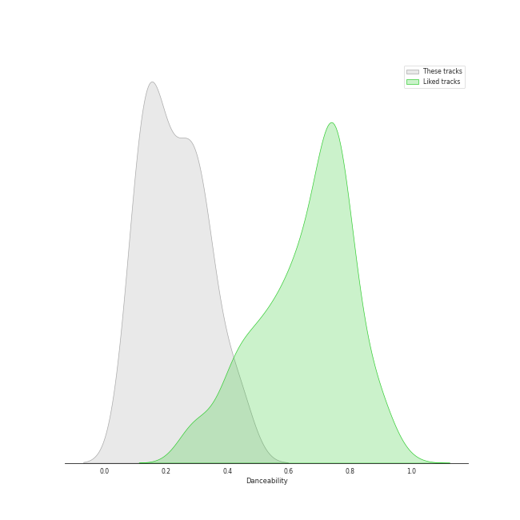
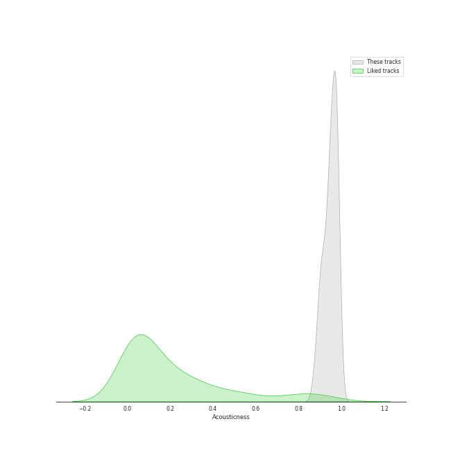
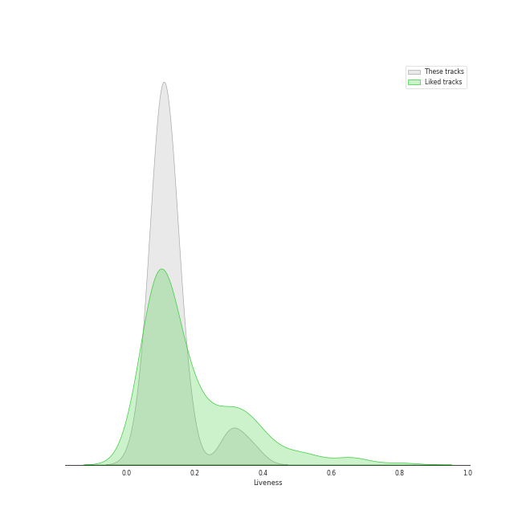
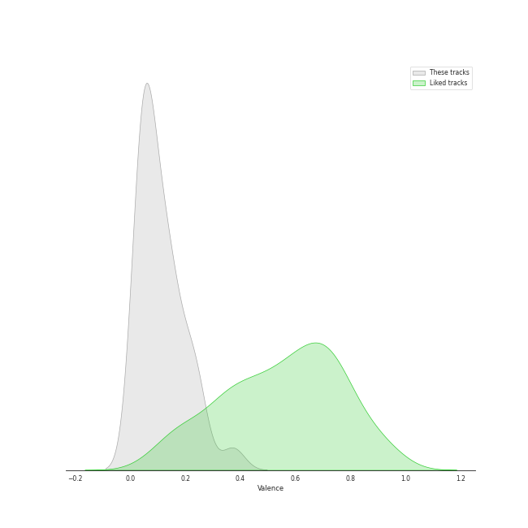
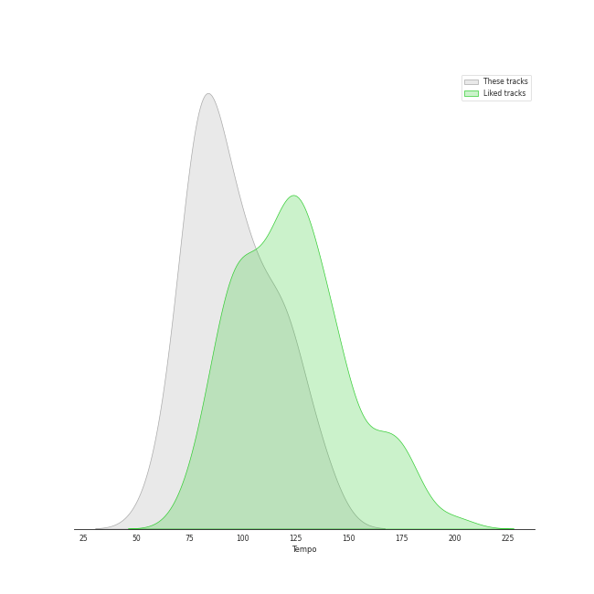

# Audio Features for Brahms

## Danceability

| 10 most Danceable tracks | 10 least Danceable tracks |
|:---|:---|
| Piano Quintet in F minor, Op. 34: 3. Scherzo (Allegro) (0.446) | Brahms: Symphony No. 2 in D Major, Op. 73: II. Adagio non troppo (0.0817) |
| String Quartet No. 2 In A Minor, Op. 51 No. 2: 3. Quasi minuetto, moderato - Allegretto vivace (0.43) | Brahms: Symphony No. 1 in C Minor, Op. 68: II. Andante sostenuto (0.0853) |
| String Quartet No. 3 In B Flat, Op. 67: 1. Vivace (0.391) | Brahms: Symphony No. 3 in F Major, Op. 90: III. Poco allegretto (0.105) |
| String Quartet No. 2 In A Minor, Op. 51 No. 2: 4. Finale (Allegro non assai - Più vivace) (0.341) | Brahms: Symphony No. 1 in C Minor, Op. 68: III. Un poco allegretto e grazioso (0.11) |
| String Quartet No. 1 In C Minor, Op. 51 No. 1: 4. Allegro - 2007 Recording (0.336) | Brahms: Symphony No. 4 in E Minor, Op. 98: II. Andante moderato (0.124) |
| String Quartet No. 1 In C Minor, Op. 51 No. 1: 1. Allegro - 2007 Recording (0.323) | Brahms: Symphony No. 3 in F Major, Op. 90: II. Andante (0.125) |
| Brahms: Symphony No. 4 in E Minor, Op. 98: III. Allegro giocoso (0.321) | Brahms: Symphony No. 3 in F Major, Op. 90: I. Allegro con brio (0.132) |
| Piano Quintet in F minor, Op. 34: 4. Finale (poco sostenuto - Allegro non troppo) (0.304) | Brahms: Symphony No. 3 in F Major, Op. 90: IV. Allegro (0.134) |
| Piano Quintet in F minor, Op. 34: 1. Allegro non troppo (0.304) | String Quartet No. 2 In A Minor, Op. 51 No. 2: 2. Andante moderato (0.15) |
| String Quartet No. 3 In B Flat, Op. 67: 4. Poco allegretto con variazioni - Doppio movimento (0.285) | Brahms: Symphony No. 4 in E Minor, Op. 98: I. Allegro non troppo (0.152) |

## Energy

| 10 most Energetic tracks | 10 least Energetic tracks |
|:---|:---|
| Brahms: Symphony No. 2 in D Major, Op. 73: IV. Allegro con spirito (0.248) | Piano Quintet in F minor, Op. 34: 2. Andante, un poco adagio (0.0231) |
| Brahms: Symphony No. 4 in E Minor, Op. 98: III. Allegro giocoso (0.206) | String Quartet No. 1 In C Minor, Op. 51 No. 1: 2. Romanze (Poco adagio) - 2007 Recording (0.0331) |
| Brahms: Symphony No. 1 in C Minor, Op. 68: IV. Finale. Adagio (0.188) | Brahms: Symphony No. 3 in F Major, Op. 90: II. Andante (0.0344) |
| Piano Quintet in F minor, Op. 34: 3. Scherzo (Allegro) (0.185) | Brahms: Symphony No. 3 in F Major, Op. 90: III. Poco allegretto (0.0406) |
| Brahms: Symphony No. 4 in E Minor, Op. 98: IV. Allegro energico e passionato (0.173) | String Quartet No. 1 In C Minor, Op. 51 No. 1: 3. Allegretto molto moderato e comodo - Un poco più animato - 2007 Recording (0.0412) |
| String Quartet No. 1 In C Minor, Op. 51 No. 1: 4. Allegro - 2007 Recording (0.17) | String Quartet No. 2 In A Minor, Op. 51 No. 2: 2. Andante moderato (0.0477) |
| Brahms: Symphony No. 4 in E Minor, Op. 98: I. Allegro non troppo (0.146) | String Quartet No. 2 In A Minor, Op. 51 No. 2: 3. Quasi minuetto, moderato - Allegretto vivace (0.059) |
| String Quartet No. 1 In C Minor, Op. 51 No. 1: 1. Allegro - 2007 Recording (0.146) | String Quartet No. 3 In B Flat, Op. 67: 2. Andante (0.0601) |
| Brahms: Symphony No. 3 in F Major, Op. 90: IV. Allegro (0.146) | Brahms: Symphony No. 4 in E Minor, Op. 98: II. Andante moderato (0.0602) |
| Brahms: Symphony No. 1 in C Minor, Op. 68: I. Un poco sostenuto - Allegro (0.142) | Piano Quintet in F minor, Op. 34: 1. Allegro non troppo (0.0605) |

## Speechiness

| 10 most Speechy tracks | 10 least Speechy tracks |
|:---|:---|
| String Quartet No. 1 In C Minor, Op. 51 No. 1: 3. Allegretto molto moderato e comodo - Un poco più animato - 2007 Recording (0.0525) | Brahms: Symphony No. 2 in D Major, Op. 73: IV. Allegro con spirito (0.0325) |
| String Quartet No. 3 In B Flat, Op. 67: 2. Andante (0.0513) | Brahms: Symphony No. 1 in C Minor, Op. 68: I. Un poco sostenuto - Allegro (0.0343) |
| String Quartet No. 2 In A Minor, Op. 51 No. 2: 4. Finale (Allegro non assai - Più vivace) (0.0511) | Brahms: Symphony No. 1 in C Minor, Op. 68: IV. Finale. Adagio (0.0361) |
| String Quartet No. 2 In A Minor, Op. 51 No. 2: 3. Quasi minuetto, moderato - Allegretto vivace (0.0483) | Brahms: Symphony No. 3 in F Major, Op. 90: I. Allegro con brio (0.0363) |
| String Quartet No. 2 In A Minor, Op. 51 No. 2: 1. Allegro non troppo (0.0476) | Brahms: Symphony No. 4 in E Minor, Op. 98: I. Allegro non troppo (0.0373) |
| String Quartet No. 1 In C Minor, Op. 51 No. 1: 1. Allegro - 2007 Recording (0.047) | Brahms: Symphony No. 3 in F Major, Op. 90: IV. Allegro (0.0377) |
| String Quartet No. 3 In B Flat, Op. 67: 1. Vivace (0.0468) | Brahms: Symphony No. 4 in E Minor, Op. 98: IV. Allegro energico e passionato (0.0394) |
| String Quartet No. 2 In A Minor, Op. 51 No. 2: 2. Andante moderato (0.0468) | Brahms: Symphony No. 3 in F Major, Op. 90: III. Poco allegretto (0.0396) |
| Piano Quintet in F minor, Op. 34: 3. Scherzo (Allegro) (0.0467) | Brahms: Symphony No. 2 in D Major, Op. 73: I. Allegro non troppo (0.0399) |
| Brahms: Symphony No. 1 in C Minor, Op. 68: II. Andante sostenuto (0.0466) | Brahms: Symphony No. 4 in E Minor, Op. 98: II. Andante moderato (0.0403) |

## Acousticness

| 10 most Acoustic tracks | 10 least Acoustic tracks |
|:---|:---|
| Brahms: Symphony No. 3 in F Major, Op. 90: III. Poco allegretto (0.987) | String Quartet No. 3 In B Flat, Op. 67: 2. Andante (0.877) |
| Brahms: Symphony No. 3 in F Major, Op. 90: II. Andante (0.983) | String Quartet No. 3 In B Flat, Op. 67: 4. Poco allegretto con variazioni - Doppio movimento (0.891) |
| Brahms: Symphony No. 2 in D Major, Op. 73: III. Allegretto grazioso. Quasi andantino (0.983) | String Quartet No. 2 In A Minor, Op. 51 No. 2: 4. Finale (Allegro non assai - Più vivace) (0.9) |
| Brahms: Symphony No. 4 in E Minor, Op. 98: II. Andante moderato (0.982) | Piano Quintet in F minor, Op. 34: 3. Scherzo (Allegro) (0.903) |
| Brahms: Symphony No. 3 in F Major, Op. 90: I. Allegro con brio (0.978) | String Quartet No. 3 In B Flat, Op. 67: 1. Vivace (0.906) |
| Brahms: Symphony No. 4 in E Minor, Op. 98: IV. Allegro energico e passionato (0.978) | String Quartet No. 1 In C Minor, Op. 51 No. 1: 4. Allegro - 2007 Recording (0.909) |
| Brahms: Symphony No. 3 in F Major, Op. 90: IV. Allegro (0.977) | String Quartet No. 1 In C Minor, Op. 51 No. 1: 1. Allegro - 2007 Recording (0.919) |
| Brahms: Symphony No. 4 in E Minor, Op. 98: I. Allegro non troppo (0.974) | String Quartet No. 2 In A Minor, Op. 51 No. 2: 2. Andante moderato (0.925) |
| Brahms: Symphony No. 1 in C Minor, Op. 68: III. Un poco allegretto e grazioso (0.974) | String Quartet No. 2 In A Minor, Op. 51 No. 2: 1. Allegro non troppo (0.93) |
| Brahms: Symphony No. 2 in D Major, Op. 73: I. Allegro non troppo (0.972) | String Quartet No. 3 In B Flat, Op. 67: 3. Agitato (Allegretto non troppo) (0.931) |

## Instrumentalness

| 10 most Instrumental tracks | 10 least Instrumental tracks |
|:---|:---|
| Brahms: Symphony No. 1 in C Minor, Op. 68: III. Un poco allegretto e grazioso (0.928) | String Quartet No. 1 In C Minor, Op. 51 No. 1: 4. Allegro - 2007 Recording (0.267) |
| Brahms: Symphony No. 3 in F Major, Op. 90: II. Andante (0.922) | String Quartet No. 1 In C Minor, Op. 51 No. 1: 2. Romanze (Poco adagio) - 2007 Recording (0.362) |
| Brahms: Symphony No. 1 in C Minor, Op. 68: IV. Finale. Adagio (0.922) | String Quartet No. 3 In B Flat, Op. 67: 3. Agitato (Allegretto non troppo) (0.421) |
| Brahms: Symphony No. 2 in D Major, Op. 73: IV. Allegro con spirito (0.905) | String Quartet No. 1 In C Minor, Op. 51 No. 1: 3. Allegretto molto moderato e comodo - Un poco più animato - 2007 Recording (0.533) |
| Brahms: Symphony No. 4 in E Minor, Op. 98: I. Allegro non troppo (0.904) | String Quartet No. 2 In A Minor, Op. 51 No. 2: 4. Finale (Allegro non assai - Più vivace) (0.559) |
| Brahms: Symphony No. 3 in F Major, Op. 90: IV. Allegro (0.904) | Piano Quintet in F minor, Op. 34: 2. Andante, un poco adagio (0.585) |
| Brahms: Symphony No. 4 in E Minor, Op. 98: II. Andante moderato (0.902) | Piano Quintet in F minor, Op. 34: 1. Allegro non troppo (0.642) |
| Brahms: Symphony No. 3 in F Major, Op. 90: I. Allegro con brio (0.896) | String Quartet No. 3 In B Flat, Op. 67: 4. Poco allegretto con variazioni - Doppio movimento (0.67) |
| Brahms: Symphony No. 4 in E Minor, Op. 98: IV. Allegro energico e passionato (0.893) | String Quartet No. 2 In A Minor, Op. 51 No. 2: 2. Andante moderato (0.716) |
| Brahms: Symphony No. 1 in C Minor, Op. 68: I. Un poco sostenuto - Allegro (0.892) | String Quartet No. 2 In A Minor, Op. 51 No. 2: 1. Allegro non troppo (0.72) |

## Liveness

| 10 most Live tracks | 10 least Live tracks |
|:---|:---|
| String Quartet No. 3 In B Flat, Op. 67: 3. Agitato (Allegretto non troppo) (0.367) | String Quartet No. 2 In A Minor, Op. 51 No. 2: 4. Finale (Allegro non assai - Più vivace) (0.0439) |
| String Quartet No. 1 In C Minor, Op. 51 No. 1: 3. Allegretto molto moderato e comodo - Un poco più animato - 2007 Recording (0.309) | Piano Quintet in F minor, Op. 34: 4. Finale (poco sostenuto - Allegro non troppo) (0.0572) |
| String Quartet No. 1 In C Minor, Op. 51 No. 1: 4. Allegro - 2007 Recording (0.304) | Brahms: Symphony No. 4 in E Minor, Op. 98: II. Andante moderato (0.0791) |
| Brahms: Symphony No. 4 in E Minor, Op. 98: I. Allegro non troppo (0.167) | Brahms: Symphony No. 3 in F Major, Op. 90: I. Allegro con brio (0.0825) |
| Brahms: Symphony No. 1 in C Minor, Op. 68: III. Un poco allegretto e grazioso (0.16) | Brahms: Symphony No. 4 in E Minor, Op. 98: IV. Allegro energico e passionato (0.0907) |
| Brahms: Symphony No. 3 in F Major, Op. 90: II. Andante (0.156) | String Quartet No. 3 In B Flat, Op. 67: 1. Vivace (0.0912) |
| String Quartet No. 3 In B Flat, Op. 67: 4. Poco allegretto con variazioni - Doppio movimento (0.145) | String Quartet No. 3 In B Flat, Op. 67: 2. Andante (0.095) |
| Brahms: Symphony No. 4 in E Minor, Op. 98: III. Allegro giocoso (0.134) | Brahms: Symphony No. 3 in F Major, Op. 90: IV. Allegro (0.0973) |
| Piano Quintet in F minor, Op. 34: 1. Allegro non troppo (0.127) | Piano Quintet in F minor, Op. 34: 3. Scherzo (Allegro) (0.0989) |
| String Quartet No. 1 In C Minor, Op. 51 No. 1: 2. Romanze (Poco adagio) - 2007 Recording (0.127) | String Quartet No. 2 In A Minor, Op. 51 No. 2: 3. Quasi minuetto, moderato - Allegretto vivace (0.1) |

## Valence

| 10 most Happy tracks | 10 least Happy tracks |
|:---|:---|
| Piano Quintet in F minor, Op. 34: 3. Scherzo (Allegro) (0.373) | Brahms: Symphony No. 3 in F Major, Op. 90: II. Andante (0.0345) |
| String Quartet No. 2 In A Minor, Op. 51 No. 2: 4. Finale (Allegro non assai - Più vivace) (0.245) | Brahms: Symphony No. 2 in D Major, Op. 73: II. Adagio non troppo (0.0353) |
| Brahms: Symphony No. 4 in E Minor, Op. 98: III. Allegro giocoso (0.242) | Brahms: Symphony No. 1 in C Minor, Op. 68: II. Andante sostenuto (0.0358) |
| String Quartet No. 3 In B Flat, Op. 67: 1. Vivace (0.238) | Brahms: Symphony No. 4 in E Minor, Op. 98: II. Andante moderato (0.0377) |
| String Quartet No. 1 In C Minor, Op. 51 No. 1: 4. Allegro - 2007 Recording (0.216) | Brahms: Symphony No. 2 in D Major, Op. 73: I. Allegro non troppo (0.0389) |
| Brahms: Symphony No. 2 in D Major, Op. 73: IV. Allegro con spirito (0.192) | Brahms: Symphony No. 3 in F Major, Op. 90: III. Poco allegretto (0.0395) |
| String Quartet No. 3 In B Flat, Op. 67: 4. Poco allegretto con variazioni - Doppio movimento (0.168) | Brahms: Symphony No. 3 in F Major, Op. 90: I. Allegro con brio (0.0395) |
| Brahms: Symphony No. 2 in D Major, Op. 73: III. Allegretto grazioso. Quasi andantino (0.166) | Brahms: Symphony No. 4 in E Minor, Op. 98: IV. Allegro energico e passionato (0.0415) |
| String Quartet No. 1 In C Minor, Op. 51 No. 1: 3. Allegretto molto moderato e comodo - Un poco più animato - 2007 Recording (0.156) | Brahms: Symphony No. 3 in F Major, Op. 90: IV. Allegro (0.0487) |
| Brahms: Symphony No. 1 in C Minor, Op. 68: III. Un poco allegretto e grazioso (0.13) | Brahms: Symphony No. 1 in C Minor, Op. 68: I. Un poco sostenuto - Allegro (0.0535) |

## Tempo

| 10 most Fast tracks | 10 least Fast tracks |
|:---|:---|
| String Quartet No. 3 In B Flat, Op. 67: 3. Agitato (Allegretto non troppo) (137.36) | Brahms: Symphony No. 3 in F Major, Op. 90: II. Andante (60.218) |
| Brahms: Symphony No. 1 in C Minor, Op. 68: IV. Finale. Adagio (134.592) | Brahms: Symphony No. 4 in E Minor, Op. 98: II. Andante moderato (69.042) |
| String Quartet No. 3 In B Flat, Op. 67: 2. Andante (124.021) | Brahms: Symphony No. 4 in E Minor, Op. 98: I. Allegro non troppo (73.925) |
| Brahms: Symphony No. 2 in D Major, Op. 73: I. Allegro non troppo (120.806) | Brahms: Symphony No. 1 in C Minor, Op. 68: III. Un poco allegretto e grazioso (75.646) |
| Piano Quintet in F minor, Op. 34: 3. Scherzo (Allegro) (120.008) | Brahms: Symphony No. 3 in F Major, Op. 90: IV. Allegro (76.428) |
| Brahms: Symphony No. 4 in E Minor, Op. 98: III. Allegro giocoso (118.069) | Brahms: Symphony No. 1 in C Minor, Op. 68: II. Andante sostenuto (76.601) |
| String Quartet No. 2 In A Minor, Op. 51 No. 2: 3. Quasi minuetto, moderato - Allegretto vivace (117.594) | Brahms: Symphony No. 3 in F Major, Op. 90: I. Allegro con brio (77.537) |
| String Quartet No. 1 In C Minor, Op. 51 No. 1: 3. Allegretto molto moderato e comodo - Un poco più animato - 2007 Recording (116.355) | String Quartet No. 2 In A Minor, Op. 51 No. 2: 1. Allegro non troppo (79.441) |
| Piano Quintet in F minor, Op. 34: 1. Allegro non troppo (106.826) | String Quartet No. 2 In A Minor, Op. 51 No. 2: 4. Finale (Allegro non assai - Più vivace) (82.278) |
| String Quartet No. 3 In B Flat, Op. 67: 1. Vivace (102.877) | Brahms: Symphony No. 2 in D Major, Op. 73: II. Adagio non troppo (82.317) |
