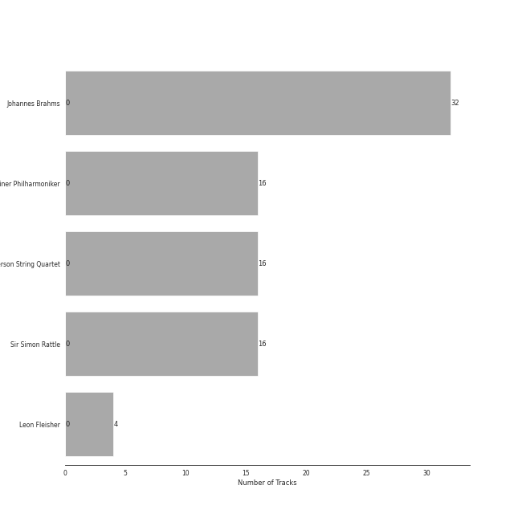
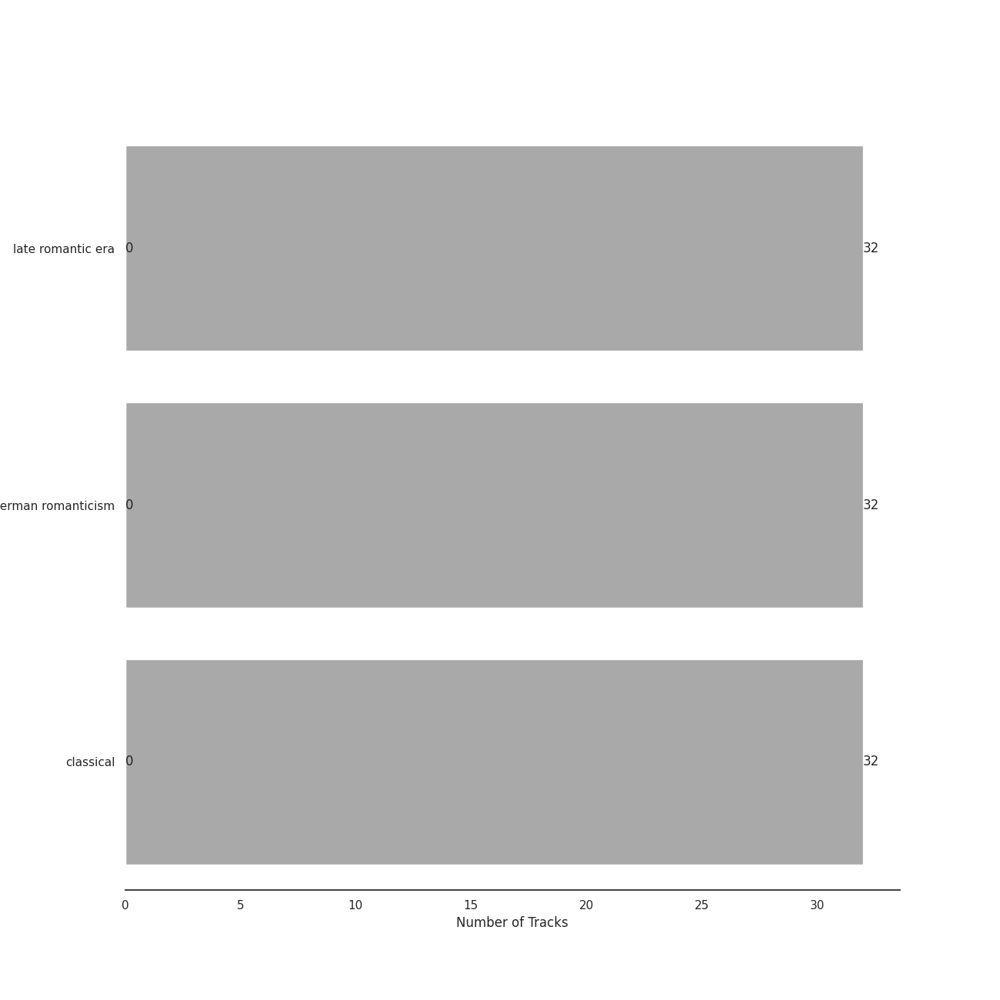

# Brahms

[32 tracks (0 liked) 🔗](https://open.spotify.com/playlist/7MnYdeDrgvc9PoWHqcGVeq)

[See Track Features](audio_features.md)

[See Clusters](clusters/overview.md)

## Top Artists

| Art | Rank | Tracks | 💚 | Artist | 🔗 |
|:---|---:|---:|---:|:---|:---|
|  | 409 | 32 | 0 | Johannes Brahms | [🔗](https://open.spotify.com/artist/5wTAi7QkpP6kp8a54lmTOq) |
|  | 409 | 16 | 0 | [Berliner Philharmoniker](../../artists/berliner_philharmoniker/overview.md) | [🔗](https://open.spotify.com/artist/6uRJnvQ3f8whVnmeoecv5Z) |
|  | 409 | 16 | 0 | Emerson String Quartet | [🔗](https://open.spotify.com/artist/4IBl8k6ZsBagsI5zRjyXH7) |
|  | 409 | 16 | 0 | Sir Simon Rattle | [🔗](https://open.spotify.com/artist/4GQwgdcDQwqtcHICjUNndp) |
|  | 409 | 4 | 0 | Leon Fleisher | [🔗](https://open.spotify.com/artist/6ncNdxBc8zVWMOF7nJ5Pgy) |

## Top Tracks

Most and least listened tracks

| Rank | ​ | Most listened tracks | Rank | ​​ | Least listened tracks |
|---:|:---|:---|---:|:---|:---|
| 904 |  | Brahms: Symphony No. 3 in F Major, Op. 90: III. Poco allegretto | 904 |  | String Quartet No. 3 In B Flat, Op. 67: 2. Andante |
| 904 |  | String Quartet No. 2 In A Minor, Op. 51 No. 2: 1. Allegro non troppo | 904 |  | Brahms: Symphony No. 4 in E Minor, Op. 98: III. Allegro giocoso |
| 904 |  | String Quartet No. 2 In A Minor, Op. 51 No. 2: 4. Finale (Allegro non assai - Più vivace) | 904 |  | Brahms: Symphony No. 2 in D Major, Op. 73: II. Adagio non troppo |
| 904 |  | String Quartet No. 1 In C Minor, Op. 51 No. 1: 2. Romanze (Poco adagio) - 2007 Recording | 904 |  | String Quartet No. 3 In B Flat, Op. 67: 1. Vivace |
| 904 |  | String Quartet No. 2 In A Minor, Op. 51 No. 2: 2. Andante moderato | 904 |  | Brahms: Symphony No. 3 in F Major, Op. 90: I. Allegro con brio |
| 904 |  | Piano Quintet in F minor, Op. 34: 3. Scherzo (Allegro) | 904 |  | Brahms: Symphony No. 4 in E Minor, Op. 98: IV. Allegro energico e passionato |
| 904 |  | Piano Quintet in F minor, Op. 34: 2. Andante, un poco adagio | 904 |  | Brahms: Symphony No. 4 in E Minor, Op. 98: I. Allegro non troppo |
| 904 |  | String Quartet No. 2 In A Minor, Op. 51 No. 2: 3. Quasi minuetto, moderato - Allegretto vivace | 904 |  | Brahms: Symphony No. 3 in F Major, Op. 90: II. Andante |
| 904 |  | Brahms: Symphony No. 4 in E Minor, Op. 98: II. Andante moderato | 904 |  | Brahms: Symphony No. 1 in C Minor, Op. 68: I. Un poco sostenuto - Allegro |
| 904 |  | Piano Quintet in F minor, Op. 34: 1. Allegro non troppo | 904 |  | String Quartet No. 1 In C Minor, Op. 51 No. 1: 1. Allegro - 2007 Recording |

## Top Albums

| Art | Rank | Tracks | 💚 | Album | Release Date | 🔗 |
|:---|---:|---:|---:|:---|:---|:---|
|  | 604 | 16 | 0 | Brahms: The Symphonies | 2009-09-07 | [🔗](https://open.spotify.com/album/2dL2qDsg6teV1cueLxCRa1) |
|  | 604 | 16 | 0 | Brahms: String Quartets & Piano Quintet | 2007-01-01 | [🔗](https://open.spotify.com/album/5nZ5ePGoQZGt1MbGphwqph) |

## Top Record Labels

| Tracks | 💚 | Label |
|---:|---:|:---|
| 16 | 0 | [Warner Classics UK](../../labels/warner_classics_uk/overview.md) |
| 16 | 0 | [Deutsche Grammophon (DG)](../../labels/deutsche_grammophon_(dg)/overview.md) |

## Genres

| Tracks | 💚 | Genre |
|---:|---:|:---|
| 32 | 0 | [late romantic era](../../genres/late_romantic_era/overview.md) |
| 32 | 0 | [german romanticism](../../genres/german_romanticism/overview.md) |
| 32 | 0 | [classical](../../genres/classical/overview.md) |

## Years

| ​ | 5 newest albums | ​​ | 5 oldest albums |
|:---|:---|:---|:---|
|  | Brahms: The Symphonies (2009-09-07) |  | Brahms: String Quartets & Piano Quintet (2007-01-01) |
|  | Brahms: String Quartets & Piano Quintet (2007-01-01) |  | Brahms: The Symphonies (2009-09-07) |